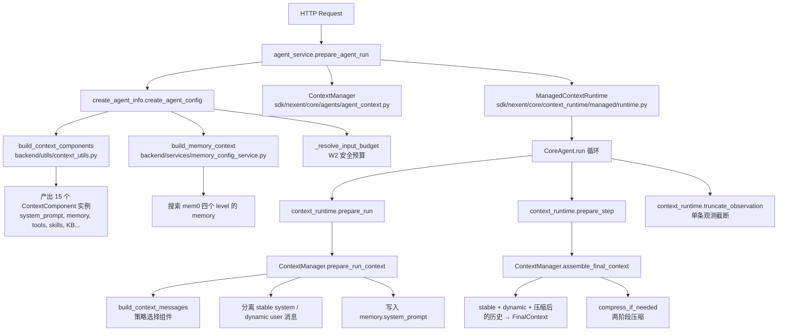
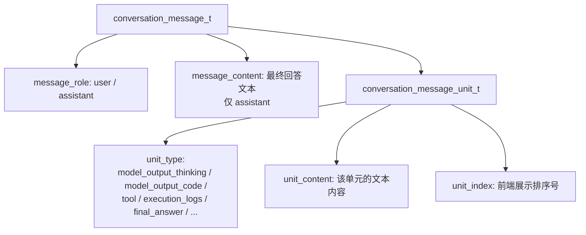
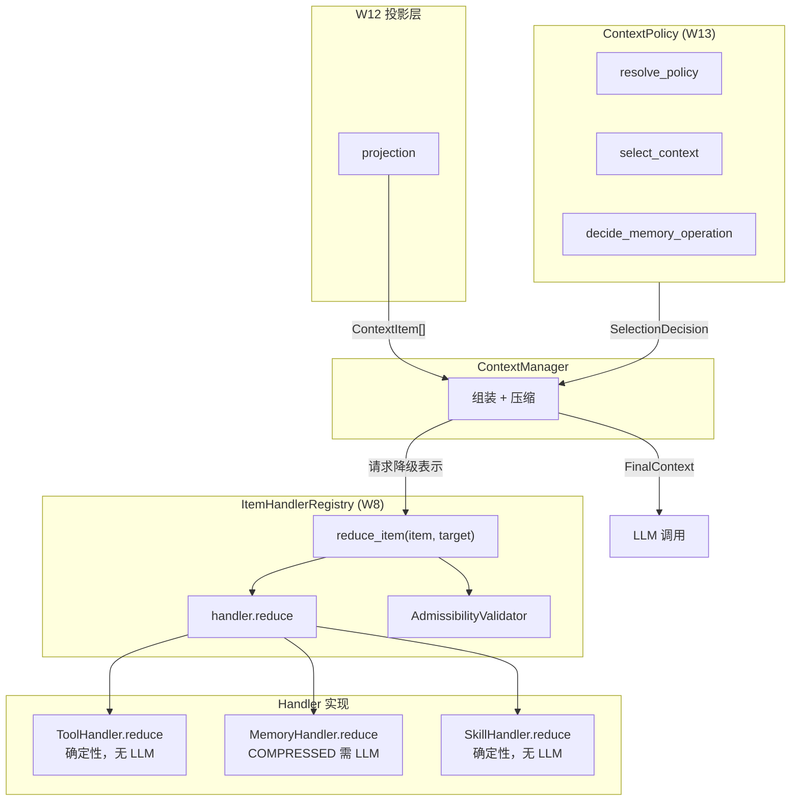
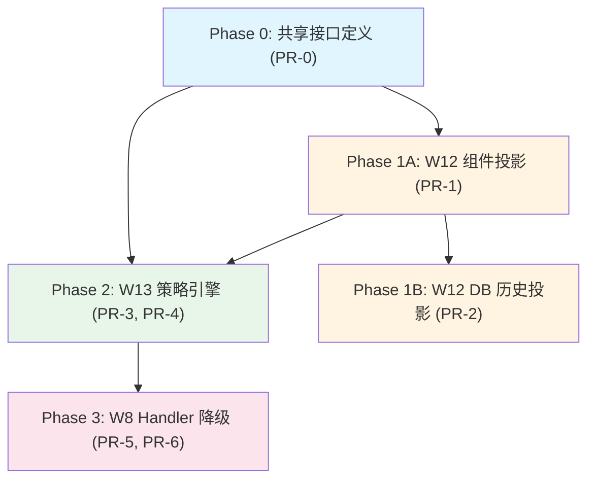
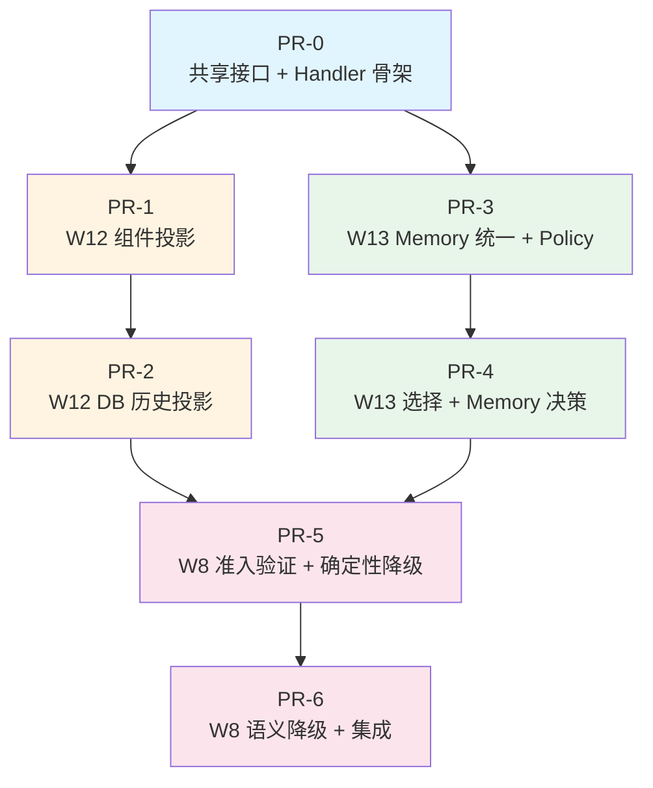

# Agent 上下文管理优化 — 开发计划

> 基于 W8 (Progressive Component Reduction)、W12 (Release 1 History Projections)、W13 (Unified Context and Memory Policy) 三个需求文档，聚焦 SDK 层上下文管理能力的系统性提升。

---

## 1. 目标

**核心问题**：当前 agent 上下文管理存在三个结构性缺陷：

1. **组件粒度粗**：`ContextComponent` 是整体选择/丢弃的最小单位，token 压力下只能整块移除（如整个 memory 组件），无法降级保留关键信息
2. **选择逻辑分散**：memory level 过滤逻辑在 `store_memory_tool.py`、`search_memory_tool.py`、`create_agent_info.py` 三处重复；组件选择策略、预算分配、memory 决策没有统一策略引擎
3. **历史投影缺失**：对话历史由前端每次请求回传，后端没有从持久化数据构建有界 `ContextItem` 候选集的能力

**目标状态**：

- 每个上下文组件可在 `full → compressed → structured → pointer` 四级表示间渐进降级（W8）
- 统一的 `ContextPolicy` 引擎决定什么进入 prompt、什么被排除、以什么精度呈现（W13）
- 从执行历史中产出有界的、带源溯源的 `ContextItem` 候选集，替代当前的 ad-hoc 消息拼装（W12）

---

## 2. 当前架构分析

### 2.1 上下文组装流程



### 2.2 关键模块清单

| 模块 | 文件 | 职责 |
|------|------|------|
| ContextManager | `sdk/nexent/core/agents/agent_context.py` (1787 行) | 压缩、组件注册/选择、managed 上下文组装 |
| ContextComponent | `sdk/nexent/core/agents/agent_model.py` (7 个子类) | 上下文组件类型系统 |
| ContextStrategy | `sdk/nexent/core/agents/agent_model.py` (4 个策略) | 组件选择算法 |
| ContextManagerConfig | `sdk/nexent/core/agents/summary_config.py` (123 行) | 全部配置：压缩、策略、预算、注入开关 |
| ContextRuntime | `sdk/nexent/core/context_runtime/contracts.py` (107 行) | CoreAgent 与上下文实现的协议接口 |
| ManagedContextRuntime | `sdk/nexent/core/context_runtime/managed/runtime.py` (105 行) | managed 路径适配器 |
| LegacyContextRuntime | `sdk/nexent/core/context_runtime/legacy/runtime.py` (118 行) | 旧路径回退 |
| StoreMemoryTool | `sdk/nexent/core/tools/store_memory_tool.py` | memory 写入 + level 过滤 |
| SearchMemoryTool | `sdk/nexent/core/tools/search_memory_tool.py` | memory 搜索 + level 过滤 |
| memory_service | `sdk/nexent/memory/memory_service.py` | mem0 异步 CRUD |
| build_context_components | `backend/utils/context_utils.py` | 后端侧 15 个组件拼装 |

### 2.3 当前缺陷与改进方向

#### 2.3.1 上下文组装层缺陷

| 缺陷 | 当前状态 | W8/W12/W13 改进 |
|------|---------|-----------------|
| 组件只能整体保留或丢弃 | `ContextStrategy.select_components()` 返回完整的 `ContextComponent` 列表 | W8：引入多级表示（full/compressed/structured/pointer），组件可降级而非丢弃 |
| memory level 过滤逻辑重复 3 处 | `store_memory_tool._resolve_memory_levels()`、`search_memory_tool._resolve_memory_levels()`、`create_agent_info.py` | W13：统一为 `MemoryPolicy` 决策 |
| 组件预算是静态硬编码 | `component_budgets` 在 `ContextManagerConfig` 中固定 | W13：动态预算分配，基于策略引擎决策 |
| 没有 ContextItem 概念 | 最接近的是 `ContextComponent`（粗粒度） | W12：引入 `ContextItem` 作为有界的、带溯源的上下文候选单元 |
| 上下文选择没有统一策略 | 策略选择、memory 决策、预算分配各自独立 | W13：统一 `ContextPolicy` 引擎 |
| 压缩结果仅存内存 | `ContextManager` 的 summary cache 是进程内的 | W12：投影层为后续持久化做准备（但本期不实现 W5 event log） |

#### 2.3.2 对话历史持久化层缺陷

当前 DB 存储了 ReAct 过程的大部分数据，但**缺乏结构化分组**，无法从 DB 重建完整的执行上下文。

**当前 DB 存储内容：**



**ReAct 过程持久化缺陷：**

| 缺陷 | 当前状态 | 影响 |
|------|---------|------|
| **无 run_id** | 同一次对话可能被多次运行，但 DB 无法区分"这次运行"和"上次运行" | 无法按 run 重建执行上下文 |
| **无 step_id** | ReAct 的每个 step（thinking → code → tool → observation）没有分组标识 | 无法将 tool 调用和对应的 execution_logs 配对 |
| **无 tool call/result 配对** | `tool` unit 存了工具名，`execution_logs` 存了结果，但没有显式关联 | 无法从 DB 重建"调用了什么工具、传了什么参数、得到了什么结果" |
| **无结构化 tool 参数** | 工具参数嵌在 `model_output_code` 的 Python 代码文本中 | 无法提取结构化的 tool call 信息 |
| **无事件时间戳** | `create_time` 是批量插入时间，不是实际事件发生时间 | 无法按时间顺序精确重建执行过程 |
| **unit_index 是展示排序** | 用于前端渲染，不是执行顺序 | 并发 run 时可能冲突 |
| **message_index 从请求历史计算** | `user_role_count * 2 + 1` | 并发 run 时会覆盖 |

**核心问题**：当前 DB 存储的是**扁平的 UI 展示单元**，不是**结构化的执行日志**。上下文模块无法从 DB 读取历史来构建 ContextItem，因为 DB 中缺少 ReAct 的结构信息。

**改进方向**：在不引入 W5 event log 的前提下，增强现有 DB schema，使其能正确持久化 ReAct 全过程的结构化信息。然后基于增强后的 DB，建立 DB → ContextItem 的投影能力。

---

## 3. 目标架构



**数据流**：
1. W12 投影层从当前对话/agent 状态中产出 `ContextItem[]` 候选集
2. W13 策略引擎对候选集做选择决策 → `SelectionDecision`（选中/排除/表示级别）
3. ContextManager 根据决策组装上下文，需要降级时通过 `ItemHandlerRegistry` 路由到对应 handler
4. 压缩后产出 `FinalContext` 进入模型

---

## 4. 共享接口定义

> 以下接口是三个 workstream 的协作契约，在 Phase 0 统一定义。

### 4.1 ContextItem（W12 产出，W13 消费，W8 降级）

```python
# sdk/nexent/core/agents/context/context_item.py

from dataclasses import dataclass, field
from enum import Enum
from typing import Any, Dict, List, Optional


class ContextItemType(str, Enum):
    """上下文项类型"""
    SYSTEM_PROMPT = "system_prompt"
    TOOL = "tool"
    SKILL = "skill"
    MEMORY = "memory"
    KNOWLEDGE_BASE = "knowledge_base"
    MANAGED_AGENT = "managed_agent"
    EXTERNAL_AGENT = "external_agent"
    HISTORY_TURN = "history_turn"          # 一轮对话（user + assistant）
    TOOL_CALL_RESULT = "tool_call_result"  # 工具调用及结果
    WORKING_MEMORY = "working_memory"      # 当前任务状态


class RepresentationTier(str, Enum):
    """表示精度层级（从高到低）"""
    FULL = "full"               # 完整内容
    COMPRESSED = "compressed"   # 语义压缩（LLM 摘要）
    STRUCTURED = "structured"   # 最小结构化字段（名称 + 关键属性）
    POINTER = "pointer"         # 引用 + 元数据（决定是否加载）


class AuthorityTier(str, Enum):
    """权威层级（高到低）"""
    PLATFORM = "platform"       # 平台安全策略
    TENANT = "tenant"           # 租户配置
    USER = "user"               # 用户指令
    WORKING_MEMORY = "working_memory"  # 当前任务状态
    TOOL_RESULT = "tool_result"        # 工具执行结果
    RETRIEVED_MEMORY = "retrieved_memory"  # 检索的长期记忆
    SUMMARY = "summary"         # 压缩摘要
    AGENT_INFERENCE = "agent_inference"   # agent 推断


@dataclass
class ContextItem:
    """有界的、带溯源的上下文候选单元。

    替代当前 ContextComponent 的粗粒度模型，提供更细粒度的选择/降级能力。
    """
    item_id: str                                    # 稳定标识符
    item_type: ContextItemType                      # 类型
    source_refs: List[str] = field(default_factory=list)  # 源事件/数据引用
    authority_tier: AuthorityTier = AuthorityTier.AGENT_INFERENCE
    minimum_fidelity: RepresentationTier = RepresentationTier.STRUCTURED
    current_representation: RepresentationTier = RepresentationTier.FULL
    content: Any = None                             # 当前表示的内容
    token_estimate: int = 0                         # 当前表示的 token 估算
    metadata: Dict[str, Any] = field(default_factory=dict)  # 扩展元数据
    lifecycle_status: str = "active"                # active / stale / evicted
    recompute_cost: Optional[int] = None            # 重新计算的 token 成本
```

### 4.2 SelectionDecision（W13 产出，ContextManager 消费）

```python
# sdk/nexent/core/agents/context/policy_models.py

@dataclass(frozen=True)
class SelectionDecision:
    """上下文选择决策"""
    selected_item_ids: List[str]                    # 选中的 item ID
    excluded_item_ids: List[str]                    # 排除的 item ID
    representation_requirements: Dict[str, RepresentationTier]  # item_id → 要求的表示级别
    budget_allocations: Dict[str, int]              # 类型 → 分配的 token 预算
    remaining_budget: int                           # 剩余预算
    conflicts: List[Dict[str, Any]]                 # 冲突决策记录
    reason_codes: List[str]                         # 决策原因码
    policy_version: str                             # 策略版本
    decision_fingerprint: str                       # 决策指纹


@dataclass(frozen=True)
class MemoryDecision:
    """Memory 操作决策"""
    operation: str          # retrieve / write / update / delete / no_write / confirm_required
    allowed_scopes: List[str]                       # 允许的 memory level
    excluded_candidates: List[str]                  # 排除的候选项
    conflict_decisions: List[Dict[str, Any]]        # 冲突决策
    confirmation_required: Optional[Dict[str, Any]] # 需要的确认信息
    reason_codes: List[str]                         # 决策原因码
```

### 4.3 ReductionResult（W8 产出，W13/ContextManager 消费）

```python
# sdk/nexent/core/agents/context/reducer_models.py

@dataclass(frozen=True)
class ReductionResult:
    """组件降级结果"""
    representation: RepresentationTier              # 实际产出的表示级别
    source_fingerprint: str                         # 源内容指纹
    token_count: int                                # 降级后的 token 数
    generator: str                                  # 生成器标识
    generator_version: str                          # 生成器版本
    admissible: bool                                # 是否通过准入检查
    loss_metadata: Dict[str, Any]                   # 丢失信息分类
    content: Any                                    # 降级后的内容
```

### 4.4 ContextItemHandler — 每种类型的选择与降级处理器

> **核心原则**：每种 `ContextItemType` 必须有一个 `ContextItemHandler`，负责该类型的选择评分和降级逻辑。
> **初始实现**：所有 handler 在 PR-1 中以 **passthrough** 形式创建（选择返回全部、降级返回原内容），
> 但必须用 `TODO` 注释标注建议算法。算法的具体实现在后续 PR 中逐步完善。

```python
# sdk/nexent/core/agents/context/item_handler.py

from abc import ABC, abstractmethod


class ContextItemHandler(ABC):
    """Per-type handler responsible for selection scoring and reduction.

    Every ContextItemType MUST have a registered handler.
    Initial implementations are passthrough; suggested algorithms
    are documented in TODO comments for incremental implementation.
    """

    @abstractmethod
    def supported_types(self) -> List[ContextItemType]:
        """Return the ContextItemType(s) this handler covers."""

    def score(
        self,
        item: ContextItem,
        query: str,
        context: Dict[str, Any],
    ) -> float:
        """Return a selection score for this item (0.0 ~ 1.0).

        Higher score = more likely to be selected.
        Default: passthrough, returns 1.0 (all items equally selected).
        """
        return 1.0

    def reduce(
        self,
        item: ContextItem,
        target: RepresentationTier,
        budget: int,
    ) -> ReductionResult:
        """Reduce item to target representation tier.

        Default: passthrough, returns original content unchanged.
        """
        return ReductionResult(
            representation=item.current_representation,
            source_fingerprint="",
            token_count=item.token_estimate,
            generator="passthrough",
            generator_version="0.1.0",
            admissible=True,
            loss_metadata={},
            content=item.content,
        )
```

#### 每种类型的 Handler 及建议算法（TODO）

| Handler 类 | 覆盖类型 | 选择评分建议算法（TODO） | 降级建议算法（TODO） |
|---|---|---|---|
| `SystemPromptHandler` | `SYSTEM_PROMPT` | 不参与选择（mandatory，score=∞） | 不可降级（minimum=FULL），直接拒绝 |
| `ToolHandler` | `TOOL` | `score = priority × 0.4 + keyword_overlap(query, description) × 0.3 + usage_frequency × 0.3`；已被当前 run 调用过的 tool 额外加权 | `STRUCTURED`：模板裁剪，仅保留 name + 一句话 description + 参数名列表；`POINTER`：仅 name + 参数数量 |
| `SkillHandler` | `SKILL` | `score = keyword_overlap(query, description) × 0.6 + priority × 0.4` | `STRUCTURED`：name + description 首句截断；`POINTER`：仅 name |
| `MemoryHandler` | `MEMORY` | `score = mem0_relevance_score × 0.5 + recency × 0.2 + authority_weight × 0.3` | `COMPRESSED`：LLM 摘要（复用现有 compress prompt）；`STRUCTURED`：关键词/实体提取；`POINTER`：level + score + 前 50 字符预览 |
| `KnowledgeBaseHandler` | `KNOWLEDGE_BASE` | `score = relevance_score`（来自 KB 检索） | `COMPRESSED`：LLM 摘要；`STRUCTURED`：KB ID + 标题 + 相关度分数 |
| `ManagedAgentHandler` | `MANAGED_AGENT` | `score = keyword_overlap(query, description) × 0.5 + priority × 0.5` | `STRUCTURED`：name + routing metadata；`POINTER`：name + 能力标签 |
| `ExternalAgentHandler` | `EXTERNAL_AGENT` | 同 `ManagedAgentHandler` | 同 `ManagedAgentHandler` |
| `HistoryTurnHandler` | `HISTORY_TURN` | `score = recency × 0.5 + has_pending_action × 0.3 + keyword_overlap × 0.2` | `COMPRESSED`：LLM 摘要（复用现有压缩逻辑）；`STRUCTURED`：user query 摘要 + assistant 结论 |
| `ToolCallResultHandler` | `TOOL_CALL_RESULT` | `score = recency × 0.4 + is_active_tool × 0.4 + result_relevance × 0.2` | `STRUCTURED`：tool name + 结果摘要；`POINTER`：tool name + 状态 |
| `WorkingMemoryHandler` | `WORKING_MEMORY` | 不参与选择（mandatory，score=∞） | `STRUCTURED`：保留 active goals + constraints，丢弃 details |

#### Handler 注册机制

```python
# sdk/nexent/core/agents/context/item_handler_registry.py

class ItemHandlerRegistry:
    """Registry mapping ContextItemType → ContextItemHandler.

    All handlers are registered at module load time.
    Every ContextItemType MUST have exactly one handler.
    """

    _handlers: Dict[ContextItemType, ContextItemHandler] = {}

    @classmethod
    def register(cls, handler: ContextItemHandler) -> None: ...

    @classmethod
    def get(cls, item_type: ContextItemType) -> ContextItemHandler: ...

    @classmethod
    def all_types_covered(cls) -> bool:
        """Return True if every ContextItemType has a handler."""
```

#### 开发约束

1. **PR-1 中必须创建所有 handler**（10 个类型对应 10 个 handler 类），即使大部分是 passthrough
2. 每个 handler 的 `score()` 和 `reduce()` 方法体中必须包含 `TODO` 注释，写明上表中的建议算法
3. `ItemHandlerRegistry` 在初始化时校验所有 `ContextItemType` 都有对应 handler，缺失则报错
4. 后续 PR（PR-4 选择引擎、PR-5/6 Reducer）通过调用 handler 的 `score()` / `reduce()` 来实现具体逻辑，而不是重新实现
5. 每个 handler 的 TODO 注释格式：
   ```python
   def score(self, item, query, context):
       # TODO(W13): Implement weighted scoring:
       #   score = priority * 0.4
       #         + keyword_overlap(query, description) * 0.3
       #         + usage_frequency * 0.3
       #   Boost if tool was called in current run.
       #   Signals: item.metadata["priority"], item.metadata["usage_count"]
       return 1.0  # passthrough
   ```

---

## 5. 开发阶段与 PR 拆解

### 当前范围调整：Memory 相关工作暂缓

> **决策**：由于 Nexent 的 memory 模块近期将进行重构，本计划中所有依赖现有 memory 读写、level 过滤、scope 决策、memory reducer 的实现工作暂缓。
>
> **当前阶段要求**：保持现有 memory 行为不变；只保留 ContextItem 类型覆盖和兼容性所需的最小占位接口。

具体调整：

- `MEMORY` 类型和 `MemoryHandler` 继续保留，用于 handler registry 完整性校验
- `MemoryHandler.score()` / `MemoryHandler.reduce()` 暂时保持 passthrough 或最小占位实现
- `MemoryDecision` 模型如已存在则保留，但暂不接入运行时行为
- 暂不新增或接入 `memory_policy.py`
- 暂不重构 `store_memory_tool.py`、`search_memory_tool.py`、`backend/agents/create_agent_info.py` 中现有 memory level 过滤逻辑
- 暂不实现 `memory_decision_engine.py`
- 上下文选择与降级工作优先覆盖非 memory 类型：system prompt、tools、skills、knowledge base、managed/external agents、history turn、tool call result、working memory

### 阶段依赖关系



### PR 合并策略

| 合并后 | 原始 PR | 合并理由 | 预估行数 | 主干影响 |
|--------|--------|---------|---------|---------|
| PR-1 | 原 PR-1 + PR-2 | 同属 W12 组件投影管线，PR-2 依赖 PR-1，顺序开发 | ~960 | 无：`use_context_items=False` 默认关闭 |
| PR-2 | 原 PR-3 + PR-4 + PR-5 | 同属 W12 DB 历史投影，PR-3→4→5 顺序依赖 | ~1480 | 无：新字段 DEFAULT NULL，旧路径不变 |
| PR-3 | 原 PR-6 + PR-7 | 同属 W13 策略基础，PR-6 是重构，PR-7 是新建 | ~770 | 无：PR-6 行为不变的重构 |
| PR-4 | 原 PR-8 + PR-9 | 同属 W13 策略引擎，都消费 PR-3 的 Policy 模型 | ~1060 | 无：新模块，旧路径不受影响 |
| PR-5 | 原 PR-10 + PR-11 | 同属 W8 确定性降级，PR-11 依赖 PR-10 | ~1000 | 无：仅影响 `use_context_items=True` 路径 |
| PR-6 | 原 PR-12 | W8 语义降级 + 集成，涉及 LLM 调用，独立交付 | ~700 | 无：仅影响 `use_context_items=True` 路径 |

---

### Phase 0: 共享接口与模块基础

> **目标**：定义三个 workstream 的协作契约，创建新模块目录结构。
> **预估**：1 个 PR

#### PR-0: 共享接口定义

**开发内容**：

1. 创建 `sdk/nexent/core/agents/context/` 模块目录：
   ```
   sdk/nexent/core/agents/context/
   ├── __init__.py
   ├── context_item.py          # ContextItem, ContextItemType, RepresentationTier, AuthorityTier
   ├── policy_models.py         # SelectionDecision, MemoryDecision
   ├── reducer_models.py        # ReductionResult
   ├── reason_codes.py          # 稳定原因码注册表
   ├── item_handler.py          # ContextItemHandler 抽象基类（见 4.4 节）
   ├── item_handler_registry.py # ItemHandlerRegistry（见 4.4 节）
   └── handlers/                # 每种类型的 handler 实现
       ├── __init__.py
       ├── system_prompt_handler.py
       ├── tool_handler.py
       ├── skill_handler.py
       ├── memory_handler.py
       ├── knowledge_base_handler.py
       ├── managed_agent_handler.py
       ├── external_agent_handler.py
       ├── history_turn_handler.py
       ├── tool_call_result_handler.py
       └── working_memory_handler.py
   ```

2. 实现 `ContextItem` 数据模型（见 4.1 节）

3. 实现 `SelectionDecision`、`MemoryDecision` 数据模型（见 4.2 节）

4. 实现 `ReductionResult` 数据模型（见 4.3 节）

5. 定义原因码注册表 `reason_codes.py`：
   ```python
   # 选择原因码
   SELECTED_MANDATORY_MINIMUM = "selected_mandatory_minimum"
   SELECTED_BUDGET_UPGRADE = "selected_budget_upgrade"
   EXCLUDED_BUDGET = "excluded_budget"
   EXCLUDED_POLICY_DISABLED = "excluded_policy_disabled"
   EXCLUDED_LOWER_AUTHORITY = "excluded_lower_authority"

   # Memory 原因码
   MEMORY_OPERATION_ALLOWED = "memory_operation_allowed"
   MEMORY_OPERATION_DENIED = "memory_operation_denied"
   CONFIRMATION_REQUIRED = "confirmation_required"

   # 降级原因码
   MINIMUM_FIDELITY_VIOLATION = "minimum_fidelity_violation"
   REDUCER_FAILED = "reducer_failed"
   REPRESENTATION_STALE = "representation_stale"
   ```

6. 实现 `ContextItemHandler` 抽象基类（见 4.4 节），包含 `score()` 和 `reduce()` 的 passthrough 默认实现

7. 实现 `ItemHandlerRegistry`，初始化时校验所有 `ContextItemType` 都有对应 handler

8. 创建所有 10 个 handler 类（passthrough 实现 + TODO 注释），每个 handler 的 `score()` 和 `reduce()` 方法中必须包含建议算法的 TODO 注释（具体算法见 4.4 节表格）

9. 编写单元测试：数据模型序列化/反序列化、枚举值完整性、原因码不重复、handler 注册完整性校验

**验收标准**：
- [ ] `ContextItem` 可正确实例化，所有字段有类型注解和默认值
- [ ] `SelectionDecision` 和 `MemoryDecision` 是 frozen dataclass（不可变）
- [ ] `ReductionResult` 是 frozen dataclass
- [ ] 原因码注册表无重复值
- [ ] `ContextItemHandler` 抽象基类定义清晰，`score()` 和 `reduce()` 有 passthrough 默认实现
- [ ] 所有 10 个 handler 类已创建，每个的 `score()` 和 `reduce()` 中有 TODO 注释写明建议算法
- [ ] `ItemHandlerRegistry.all_types_covered()` 返回 True
- [ ] 所有新增代码有英文 docstring
- [ ] 单元测试全部通过

---

### Phase 1A: W12 组件投影基础设施

> **目标**：实现 ContextItem 投影管线，从 ContextComponent 桥接到 ContextItem，并集成到 ContextManager。
> **预估**：1 个 PR（~960 行）
> **依赖**：PR-0

#### PR-1: ContextItem 投影器 + ContextManager 集成

**开发内容**：

1. 创建 `sdk/nexent/core/agents/context/projector.py`：
   - `ContextProjector` 类：将 `List[ContextComponent]` 转换为 `List[ContextItem]`
   - 每个 `ContextComponent` 子类映射到一个或多个 `ContextItem`
   - 映射规则：
     - `SystemPromptComponent` → 1 个 `ContextItem(type=SYSTEM_PROMPT, authority=PLATFORM)`
     - `ToolsComponent` → N 个 `ContextItem(type=TOOL)`，每个工具一个 item
     - `SkillsComponent` → N 个 `ContextItem(type=SKILL)`，每个 skill 一个 item
     - `MemoryComponent` → N 个 `ContextItem(type=MEMORY, authority=RETRIEVED_MEMORY)`，每条 memory 一个 item
     - `KnowledgeBaseComponent` → 1 个 `ContextItem(type=KNOWLEDGE_BASE)`
     - `ManagedAgentsComponent` → N 个 `ContextItem(type=MANAGED_AGENT)`
     - `ExternalAgentsComponent` → N 个 `ContextItem(type=EXTERNAL_AGENT)`

2. 为每个 `ContextItem` 计算 `token_estimate`（复用现有 `estimate_tokens()` 逻辑）

3. 为每个 `ContextItem` 设置 `minimum_fidelity`：
   - `SYSTEM_PROMPT` → `FULL`（不可降级）
   - `TOOL` → `STRUCTURED`（至少保留 name + description）
   - `SKILL` → `STRUCTURED`（至少保留 name + 简短描述）
   - `MEMORY` → `STRUCTURED`（至少保留核心事实）
   - `KNOWLEDGE_BASE` → `COMPRESSED`
   - `MANAGED_AGENT` / `EXTERNAL_AGENT` → `STRUCTURED`

4. 投影时通过 `ItemHandlerRegistry.get(item_type)` 验证每种产出的 ContextItem 都有对应 handler

5. 在 `ContextManager` 中新增 `project_context_items()` 方法：
   ```python
   def project_context_items(
       self,
       components: Optional[Sequence[ContextComponent]] = None,
   ) -> List[ContextItem]:
       """Project registered components into ContextItem candidates."""
   ```

6. 在 `assemble_final_context()` 中增加 ContextItem 路径（可选启用）：
   - 新增配置项 `ContextManagerConfig.use_context_items: bool = False`
   - 当 `use_context_items=True` 时，走 ContextItem 投影 → 选择 → 组装路径
   - 当 `use_context_items=False` 时，保持现有 `build_context_messages()` 路径

7. 在 `FinalContext` 的 `ContextEvidence` 中增加 `context_items` 字段，记录投影决策

8. 在 `ManagedContextRuntime` 中适配新路径

9. 编写单元测试 + 集成测试：每种组件类型的投影正确性、token 估算、minimum_fidelity 设置、handler 覆盖校验、ContextItem 路径与旧路径的输出一致性

**验收标准**：
- [ ] `ContextProjector.project(components) → List[ContextItem]` 接口稳定
- [ ] 每种 `ContextComponent` 子类都有对应的投影规则
- [ ] 细粒度投影（tools/skills/memory 拆分为独立 item）正确工作
- [ ] 每个 `ContextItem` 的 `token_estimate` > 0（空内容除外）
- [ ] 每种产出的 ContextItemType 在 `ItemHandlerRegistry` 中都有对应 handler
- [ ] `use_context_items=False` 时行为与当前完全一致（零回归）
- [ ] `use_context_items=True` 时，模型收到的消息内容与旧路径语义等价
- [ ] `ContextEvidence` 中包含 `context_items` 投影信息
- [ ] 单元测试覆盖所有 7 种组件类型 + 集成测试覆盖 managed 路径完整流程
- [ ] 现有 `ContextManager.build_context_messages()` 行为不变（向后兼容）

---

### Phase 1B: W12 对话历史持久化与投影（可与 Phase 2 并行）

> **目标**：增强 DB schema 以正确持久化 ReAct 全过程，基于 DB 产出 `HISTORY_TURN` 和 `TOOL_CALL_RESULT` 类型的 ContextItem，并集成到 ContextManager。
> **预估**：1 个 PR（~1480 行）
> **依赖**：PR-0

#### PR-2: DB Schema 增强 + 历史投影 + 集成

**开发内容**：

**Part A: DB Schema 增强**

1. 在 `conversation_message_unit_t` 表新增字段（通过 migration SQL）：
   ```sql
   ALTER TABLE nexent.conversation_message_unit_t ADD COLUMN run_id INTEGER DEFAULT NULL;
   ALTER TABLE nexent.conversation_message_unit_t ADD COLUMN step_id INTEGER DEFAULT NULL;
   ALTER TABLE nexent.conversation_message_unit_t ADD COLUMN tool_call_id VARCHAR(100) DEFAULT NULL;
   ALTER TABLE nexent.conversation_message_unit_t ADD COLUMN event_time TIMESTAMP DEFAULT NULL;
   ```

   **新增字段详细说明：**

   | 字段 | 类型 | 含义 | 来源 | 写入时机 | 是否变化 |
   |------|------|------|------|---------|---------|
   | `run_id` | INTEGER | 该 unit 属于同一次对话中的第几次 agent 运行 | `_stream_agent_chunks()` 入口处生成，= 该 conversation 下已有 run 的最大值 + 1 | 每个 unit 创建时写入 | 写入后不再变化 |
   | `step_id` | INTEGER | 该 unit 属于当前 run 中的第几个 ReAct 步骤 | `_stream_agent_chunks()` 中维护计数器，每次收到 `step_count` chunk 时递增 | 每个 unit 创建时写入 | 写入后不再变化 |
   | `tool_call_id` | VARCHAR(100) | 将一次工具调用的"调用"和"结果"配对 | `_stream_agent_chunks()` 中，每次收到 `tool` chunk 时生成 UUID，同时附加到后续 `execution_logs` chunk | 仅在 `tool` 和 `execution_logs` 类型的 unit 上写入，其他类型为 NULL | 写入后不再变化 |
   | `event_time` | TIMESTAMP | 该 unit 的实际产生时间（chunk 被处理的时间） | `_stream_agent_chunks()` 中每个 chunk 被处理时取 `datetime.now()` | 每个 unit 创建时写入 | 写入后不再变化 |

   **具体示例 — 一次 ReAct 执行过程：**

   用户问"帮我查一下北京天气然后写个总结"，agent 的 ReAct 过程产生以下 chunk 流：

   ```
   run_id | step_id | tool_call_id | unit_type              | unit_content          | event_time
   -------|---------|--------------|------------------------|-----------------------|------------------
   1      | 1       | NULL         | model_output_thinking  | "让我查一下天气..."     | 10:00:01.123
   1      | 1       | NULL         | model_output_code      | "search_web('北京...')"| 10:00:01.456
   1      | 1       | abc-123      | tool                   | "search_web"          | 10:00:01.789
   1      | 1       | abc-123      | execution_logs         | "北京今天晴，25°C..."  | 10:00:02.234
   1      | 1       | NULL         | step_count             | "1"                   | 10:00:02.300
   1      | 2       | NULL         | model_output_thinking  | "现在写总结..."        | 10:00:03.100
   1      | 2       | NULL         | model_output_code      | "write_file(...)"     | 10:00:03.400
   1      | 2       | def-456      | tool                   | "write_file"          | 10:00:03.700
   1      | 2       | def-456      | execution_logs         | "文件已创建"           | 10:00:04.100
   1      | 2       | NULL         | step_count             | "2"                   | 10:00:04.200
   1      | 3       | NULL         | model_output_thinking  | "整理结果..."          | 10:00:05.000
   1      | 3       | NULL         | final_answer           | "北京今天天气晴朗..."   | 10:00:05.500
   ```

   用户第 2 次发消息时，`run_id` 变为 2，`step_id` 从 1 重新开始。

   **增强后的 DB 视图使上下文模块能够：**
   1. 按 `run_id` 取出某次运行的全部 unit
   2. 按 `step_id` 分组为 ReAct 步骤
   3. 按 `tool_call_id` 配对 tool call 和 result → 投影为 `TOOL_CALL_RESULT` ContextItem
   4. 按 `event_time` 精确排序

2. 在 `conversation_message_t` 表新增字段：
   ```sql
   ALTER TABLE nexent.conversation_message_t ADD COLUMN run_id INTEGER DEFAULT NULL;
   ```

3. 修改 `backend/services/agent_service.py` 的 `_stream_agent_chunks()`：
   - 维护当前 `run_id`（每次 agent run 递增）和 `step_id`（每次 `step_count` chunk 时递增）
   - 为 `tool` 类型的 chunk 生成 `tool_call_id`（UUID），并将同一个 tool_call_id 传递给后续的 `execution_logs` chunk
   - 为每个 unit 写入 `event_time = datetime.now()`
   - 将 `run_id` 写入 assistant message 行

4. 修改 `save_message_unit()` 和 `create_message_unit()` 支持新字段

5. 同步更新 `docker/init.sql` 和 `k8s/helm/.../init.sql`

**Part B: DB → ContextItem 历史投影**

6. 创建 `sdk/nexent/core/agents/context/history_projector.py`：
   - `HistoryProjector` 类：从 DB 查询对话历史并投影为 ContextItem
   - 输入：`conversation_id` + `tenant_id` + `user_id`
   - 投影三种 purpose：
     - `chat_projection`：用户可见的对话历史（兼容当前 UI）
     - `resume_projection`：重启恢复所需的活跃状态（目标、约束、待办、阻塞项）
     - `model_context_projection`：有界的 ContextItem 候选集

7. `model_context_projection` 实现：
   - 从 DB 查询 `conversation_message_unit_t`，按 `run_id` → `step_id` → `unit_index` 排序
   - 将 user message + assistant final_answer 配对投影为 `HISTORY_TURN` ContextItem
   - 将 `tool` + `execution_logs`（通过 `tool_call_id` 配对）投影为 `TOOL_CALL_RESULT` ContextItem
   - 每个 item 带 `source_refs`（指向 DB 中的 message_id + unit_id）
   - 按 recency 排序（run_id + step_id），最近的步骤 authority 更高
   - `model_output_thinking` / `model_output_deep_thinking` 不投影（隐藏思维链）

8. `resume_projection` 实现：
   - 从最近一次 run 的 DB 记录中提取：最后一个 user query（活跃目标）、final_answer 中的结论、未完成的 tool call（有 tool unit 但无 execution_logs）
   - 产出 `WORKING_MEMORY` 类型的 ContextItem

9. `chat_projection` 实现：
   - 从 DB 重建当前 UI 兼容的消息格式
   - 按 message_index 排序，unit 按 unit_index 排序
   - 输出格式与 `conversation_management_service.get_conversation_history_service()` 一致

**Part C: 集成**

10. 将 `HistoryProjector` 集成到 `ContextManager.assemble_final_context()`：
    - 当 `use_context_items=True` 时，合并组件投影（PR-1）和历史投影的 ContextItem
    - 历史投影的 item 与组件投影的 item 统一进入选择流程

11. 添加投影决策记录：
    - 每个 ContextItem 的 inclusion/exclusion 决策带 reason code
    - 记录在 `ContextEvidence` 中

12. 编写单元测试 + 集成测试：DB → ContextItem 投影正确性、tool_call_id 配对、thinking 过滤、空历史处理、完整流程（组件 + DB 历史 → ContextItem → 选择 → FinalContext）

**验收标准**：
- [ ] `conversation_message_unit_t` 新增 4 个字段，migration SQL 可执行
- [ ] `conversation_message_t` 新增 `run_id` 字段
- [ ] 每次 agent run 的 unit 都带有正确的 `run_id` 和 `step_id`
- [ ] `tool` unit 和对应的 `execution_logs` unit 共享相同的 `tool_call_id`
- [ ] `event_time` 记录实际事件时间
- [ ] 现有 `unit_type` / `unit_content` / `unit_index` 行为不变（向后兼容）
- [ ] `docker/init.sql` 和 `k8s/helm/.../init.sql` 同步更新
- [ ] `HistoryProjector.project(conversation_id, purpose) → List[ContextItem]` 接口稳定
- [ ] `model_context_projection` 从 DB 正确产出 `HISTORY_TURN` 和 `TOOL_CALL_RESULT` ContextItem
- [ ] `tool` 和 `execution_logs` 通过 `tool_call_id` 正确配对
- [ ] `model_output_thinking` / `model_output_deep_thinking` 不出现在 ContextItem 中
- [ ] `resume_projection` 能从 DB 中提取活跃目标和未完成的 tool call
- [ ] `chat_projection` 输出与当前 `get_conversation_history_service()` 格式兼容
- [ ] 组件投影和 DB 历史投影的 ContextItem 合并后正确进入选择流程
- [ ] 每个 ContextItem 的决策有 reason code
- [ ] 端到端集成测试通过
- [ ] 现有测试全部通过

---

### Phase 2: W13 统一上下文策略引擎

> **目标**：用统一的策略引擎替代分散的上下文选择和 memory 决策逻辑。
> **预估**：2 个 PR（~770 + ~1060 行）
> **依赖**：PR-0；PR-1（ContextItem 模型）
> **可与 Phase 1B 并行**

#### PR-3: Memory 统一 + Policy 模型

> **范围调整**：本 PR 中所有 memory 统一与 memory level 过滤重构工作暂缓。当前只实现与非 memory 上下文选择相关的 policy 模型；memory 行为保持现状。

**开发内容**：

**Part A: Memory Level 过滤统一**

> **暂缓**：以下 Part A 内容等待 memory 模块重构完成后再重新设计和实现。

1. 创建 `sdk/nexent/core/agents/context/memory_policy.py`：
   - `resolve_memory_levels()` 函数：统一当前三处重复的 level 过滤逻辑
   - 输入：`MemoryUserConfig`（agent_share_option, disable_agent_ids, disable_user_agent_ids）
   - 输出：允许的 memory level 列表
   - 区分 store 场景（候选 `["user_agent", "agent"]`）和 search 场景（候选 `["tenant", "user", "agent", "user_agent"]`）

2. 重构 `store_memory_tool.py`：删除 `_resolve_memory_levels()` 方法，调用 `memory_policy.resolve_memory_levels()`

3. 重构 `search_memory_tool.py`：删除 `_resolve_memory_levels()` 方法，调用 `memory_policy.resolve_memory_levels()`

4. 重构 `backend/agents/create_agent_info.py`：被动 memory 注入路径使用 `memory_policy.resolve_memory_levels()`

5. 编写单元测试：所有 agent_share_option 值的 level 解析、disable 列表过滤、store/search 场景差异

**Part B: ContextPolicy 与 MemoryPolicy 模型**

6. 在 `sdk/nexent/core/agents/context/policy_models.py` 中扩展 `ContextPolicy` frozen dataclass

   > `MemoryPolicy` 如已在前置 PR 中存在则保留为兼容模型，但当前不要求完善字段、不要求接入运行时。

7. 实现 `resolve_policy()` 函数：合并 precedence（平台默认 → 租户配置 → agent 配置 → 用户请求覆盖），验证策略合法性

8. 实现 `validate_policy()` 函数：非法策略抛出 `PolicyInvalidError`（带 reason code）

9. 编写单元测试：默认策略解析、合并 precedence、非法策略拒绝

**验收标准**：
- [ ] 当前阶段不实现 `resolve_memory_levels()`，现有 memory level 过滤逻辑保持不变
- [ ] 当前阶段不改动 `store_memory_tool`、`search_memory_tool`、`create_agent_info.py` 的 memory 行为
- [ ] 现有 memory 相关测试全部通过（行为不变）
- [ ] `ContextPolicy` 是 frozen dataclass
- [ ] `MemoryPolicy` 如已存在则保持兼容，但不作为当前验收重点
- [ ] `resolve_policy()` 正确合并各层配置
- [ ] 非法策略（预算超限、层级矛盾）在解析阶段被拒绝
- [ ] 单元测试覆盖合并 precedence + 验证分支

#### PR-4: 选择引擎 + Memory 决策引擎

> **范围调整**：本 PR 只实现非 memory 的上下文选择引擎。Memory 操作策略路由暂缓，等待 memory 模块重构后再接入。

**开发内容**：

**Part A: 上下文选择引擎**

1. 创建 `sdk/nexent/core/agents/context/selection_engine.py`：
   ```python
   def select_context(
       policy: ContextPolicy,
       context_items: List[ContextItem],
       safe_input_budget: int,
   ) -> SelectionDecision:
       """Two-phase selection: install mandatory, then spend remaining budget."""
   ```

2. 实现两阶段选择算法：
   - **阶段 1**：安装所有 mandatory item 到 minimum_fidelity 表示；超出预算则返回 `mandatory_budget_impossible`
   - **阶段 2**：调用 `ItemHandlerRegistry.get(item.item_type).score()` 获取评分，按 authority_tier + score 排序贪心升级（`STRUCTURED → COMPRESSED → FULL`）
   - 当前 handler 的 `score()` 是 passthrough（返回 1.0），后续 PR 逐步实现具体算法

3. 实现冲突检测：同类型 item 内容矛盾时按 authority 层级决策，不可解冲突标记为 `authority_conflict_unresolved`

4. 与现有 `ContextStrategy` 系统的桥接：当 `use_context_items=False` 时，现有策略系统继续工作

**Part B: Memory 操作策略路由**

> **暂缓**：以下 Part B 内容等待 memory 模块重构完成后再重新设计和实现。

5. 创建 `sdk/nexent/core/agents/context/memory_decision_engine.py`：
   ```python
   def decide_memory_operation(
       policy: ContextPolicy,
       candidate_or_query: Any,
       operation_type: str,  # "retrieve" / "write" / "update" / "delete"
   ) -> MemoryDecision:
       """Route memory operations through unified policy engine."""
   ```

6. 重构 `SearchMemoryTool.forward()`：搜索前调用 `decide_memory_operation()`，根据 `allowed_scopes` 和 `excluded_candidates` 过滤

7. 重构 `StoreMemoryTool.forward()`：写入前调用 `decide_memory_operation()`，根据 `allowed_scopes` 和 `operation` 判断

8. 重构被动 memory 注入（`create_agent_info.py`）：pre-run memory search 通过 `decide_memory_operation()` 决策

9. 编写单元测试 + 集成测试：mandatory 安装、预算降级、authority 冲突、确定性测试、memory allow/deny/confirm-required

**验收标准**：
- [ ] 两阶段选择算法正确实现
- [ ] mandatory item 超出预算时返回 `mandatory_budget_impossible`
- [ ] authority 冲突按层级正确解决
- [ ] 确定性测试：相同 `(policy, items, budget)` 产出相同的 `SelectionDecision`
- [ ] 与现有 `TokenBudgetStrategy` 行为兼容（不改变现有路径）
- [ ] 当前阶段不接入 `SearchMemoryTool`、`StoreMemoryTool`、被动 memory 注入
- [ ] 默认策略下非 memory 上下文行为与重构前一致（零回归）
- [ ] 单元测试覆盖所有非 memory 选择分支

---

### Phase 3: W8 渐进式组件降级

> **目标**：在 token 压力下将组件降级到可接受的最低表示，而不是整块丢弃。
> **预估**：2 个 PR（~1000 + ~700 行）
> **依赖**：PR-3（ContextPolicy）、PR-4（SelectionDecision 中的 representation_requirements）
> **实现方式**：实现 PR-0 中已创建的 Handler 的 `reduce()` 方法

#### PR-5: 准入验证 + 确定性 Handler 降级

**开发内容**：

**Part A: 准入验证器与降级调度**

1. 创建 `sdk/nexent/core/agents/context/admissibility_validator.py`：验证降级结果不低于 `minimum_fidelity`，mandatory item 不消失，源指纹匹配

2. 在 `ItemHandlerRegistry` 中新增 `reduce_item()` 调度方法：路由到 handler.reduce()，然后通过 AdmissibilityValidator 验证

**Part B: 确定性 Handler.reduce() 实现（无 LLM 调用）**

3. 实现 `ToolHandler.reduce()`：FULL → 原内容；STRUCTURED → name + 一句话 description + 参数名列表；POINTER → name + 参数数量

4. 实现 `SkillHandler.reduce()`：FULL → 原内容；STRUCTURED → name + description 首句截断；POINTER → 仅 name

5. 实现 `ManagedAgentHandler.reduce()` 和 `ExternalAgentHandler.reduce()`：FULL → 完整描述 + 工具列表；STRUCTURED → name + routing metadata；POINTER → name + 能力标签

6. 实现 `SystemPromptHandler.reduce()`：FULL → 原内容；其他级别 → `admissible=False`（不可降级）

7. 实现 `WorkingMemoryHandler.reduce()`：FULL → 原内容；STRUCTURED → 保留 active goals + constraints，丢弃 details

8. 编写单元测试：准入验证、路由正确、每个 handler 每个级别输出正确、token 估算、source_fingerprint

**验收标准**：
- [ ] `AdmissibilityValidator` 正确拒绝非法降级
- [ ] `ItemHandlerRegistry.reduce_item()` 正确路由到 handler 并执行验证
- [ ] 5 个 handler 的 `reduce()` 从 passthrough 升级为确定性实现
- [ ] 所有降级是确定性的（无 LLM 调用，相同输入 = 相同输出）
- [ ] token 估算误差 < 20%
- [ ] 低于 minimum_fidelity 的降级被拒绝
- [ ] 单元测试覆盖所有验证分支 + 每个 handler 的每个表示级别

#### PR-6: 语义 Handler 降级 + ContextManager 集成

**开发内容**：

1. 实现 `MemoryHandler.reduce()`：FULL → 原内容；COMPRESSED → LLM 摘要（复用现有 compress prompt）；STRUCTURED → 核心事实 key-value；POINTER → level + 时间戳 + 前 50 字符预览

   > **暂缓**：等待 memory 模块重构完成后再实现。当前 `MemoryHandler.reduce()` 保持 passthrough 或最小占位行为。

2. 实现 `KnowledgeBaseHandler.reduce()`：FULL → 原内容；COMPRESSED → LLM 摘要；STRUCTURED → KB ID + 标题 + 相关度分数

3. 实现 `HistoryTurnHandler.reduce()`：FULL → 原内容；COMPRESSED → LLM 摘要（复用现有压缩逻辑）；STRUCTURED → user query 摘要 + assistant 结论

4. 实现 `ToolCallResultHandler.reduce()`：FULL → 原内容；STRUCTURED → tool name + 结果摘要；POINTER → tool name + 状态

5. 将降级流程集成到 `ContextManager.assemble_final_context()` 的 ContextItem 路径：根据 `SelectionDecision.representation_requirements` 确定目标表示级别，通过 `ItemHandlerRegistry.reduce_item()` 执行降级，降级失败时 fallback 到原始内容 + 记录 warning

6. 编写集成测试：完整流程（投影 → 选择 → 降级 → FinalContext）、token 预算压力下的降级行为、降级 fallback

**验收标准**：
- [ ] 非 memory 语义 handler 的 `reduce()` 从 passthrough 升级为语义实现
- [ ] `MemoryHandler.reduce()` 当前保持 passthrough 或最小占位行为，不接入 LLM 摘要
- [ ] LLM 调用复用现有压缩 prompt（不引入新 prompt）
- [ ] 集成到 `ContextManager` 的 ContextItem 路径
- [ ] token 预算压力下组件正确降级而非丢弃
- [ ] 降级失败时 fallback 到原始内容
- [ ] 端到端集成测试通过
- [ ] 现有测试无回归

---

## 6. PR 总览与并行策略

### PR 依赖图



### 并行开发建议

| 阶段 | 可并行的 PR | 说明 |
|------|------------|------|
| Phase 0 完成后 | PR-1 ∥ PR-3 | W12 组件投影和 W13 非 memory Policy 基础无依赖 |
| Phase 1 中期 | PR-2 ∥ PR-4 | W12 DB 历史投影和 W13 非 memory 选择引擎可并行 |
| Phase 3 | PR-5 → PR-6 | 顺序执行，PR-6 依赖 PR-5 |

### 预计 PR 数量

| Workstream | PR 数量 | 核心交付 |
|-----------|---------|---------|
| Phase 0 | 1 | 共享接口 + 10 个 Handler 骨架（passthrough + TODO） |
| W12 | 2 | 组件投影 + DB Schema 增强 + DB→ContextItem 历史投影 |
| W13 | 2 | Policy 模型 + 非 memory 选择引擎（memory 决策暂缓） |
| W8 | 2 | 准入验证 + 确定性降级 + 非 memory 语义降级 + 集成 |
| **合计** | **7** | |

---

## 7. 全局验收标准

### 功能验收

- [ ] `use_context_items=False` 时，所有现有行为零回归
- [ ] `use_context_items=True` 时，模型收到的上下文质量不低于旧路径
- [ ] DB 正确持久化 ReAct 全过程（run_id、step_id、tool_call_id 配对、event_time）
- [ ] 上下文模块能从 DB 读取历史并构建 ContextItem（不依赖前端回传）
- [ ] 当前阶段不重构 memory level 过滤逻辑，现有 memory 行为保持不变
- [ ] 每种 `ContextItemType` 都有对应的 `ContextItemHandler`，具备 `score()` 和 `reduce()` 方法
- [ ] token 预算压力下，非 memory 组件通过 handler 降级而非整块丢弃
- [ ] 每个上下文选择决策有 reason code 可追溯

### 测试验收

- [ ] 所有新增代码有对应单元测试
- [ ] 所有重构代码的现有测试通过（零回归）
- [ ] 端到端集成测试覆盖完整流程
- [ ] 确定性测试：相同输入产出相同决策

### 代码质量

- [ ] 所有注释和 docstring 使用英文
- [ ] 新增模块遵循 SDK 层规范（不读取环境变量）
- [ ] 类型注解完整，无 `as any` / `@ts-ignore` 等价操作
- [ ] `lsp_diagnostics` 无 error

### 性能验收

- [ ] ContextItem 投影延迟 < 50ms（100 个组件）
- [ ] 策略引擎决策延迟 < 10ms
- [ ] 确定性 Handler.reduce() 延迟 < 5ms/个
- [ ] 语义 Handler.reduce()（LLM 调用）延迟 < 2s/个

---

## 8. 风险与缓解

| 风险 | 影响 | 缓解措施 |
|------|------|---------|
| ContextItem 投影改变了消息顺序 | 模型行为变化 | PR-1 中做 A/B 对比测试，确保语义等价 |
| DB Schema 变更影响现有持久化逻辑 | 消息/单元写入异常 | PR-2 中新增字段全部 DEFAULT NULL，现有写入路径不受影响；全量回归测试 |
| Memory 模块即将重构 | 当前实现可能与新 memory 架构冲突 | 当前计划暂缓 memory policy、memory decision engine、memory reducer；只保留最小兼容占位 |
| LLM 降级调用增加延迟 | 响应变慢 | 确定性 Handler.reduce() 优先（PR-5）；语义 Handler.reduce() 仅在必要时调用（PR-6） |
| Handler passthrough 阶段功能不完整 | 降级无实际效果 | passthrough 是有意设计，保证框架可用；具体算法在后续 PR 逐步实现，每个 PR 独立可交付 |
| 策略引擎过于复杂 | 维护成本高 | 分阶段实现，每个 PR 独立可用 |
| 与 W5 event log 的后续集成 | 需要适配 | ContextItem 的 `source_refs` 字段预留了事件引用；DB 新增的 run_id/step_id 与 W5 的 agent_session/event_seq 概念对齐 |

---

## 9. Memory 重构后的回补提醒

Memory 模块重构完成后，需要重新审视并回补本计划中暂缓的 memory 相关能力。回补时不要直接照搬旧设计，应先对齐新的 memory 架构、scope 模型、权限模型和数据结构。

待回补事项：

- 重新设计 `MemoryPolicy`，明确 memory scope、authority、tenant/user/agent 边界
- 实现统一的 memory level/scope 解析，替代当前分散在 `store_memory_tool.py`、`search_memory_tool.py`、`create_agent_info.py` 的逻辑
- 实现 `memory_policy.py` 或等价模块，并迁移 memory 读写路径
- 实现 `memory_decision_engine.py`，将 retrieve/write/update/delete 操作纳入统一策略决策
- 完善 `MemoryHandler.score()`，结合新 memory relevance、recency、authority、scope 信号进行选择评分
- 完善 `MemoryHandler.reduce()`，支持符合新 memory 数据结构的 compressed/structured/pointer 表示
- 补充 memory policy、memory decision、memory reducer 的单元测试和端到端回归测试
- 更新本计划的 PR 拆分和验收标准，移除“memory 暂缓”的临时约束
