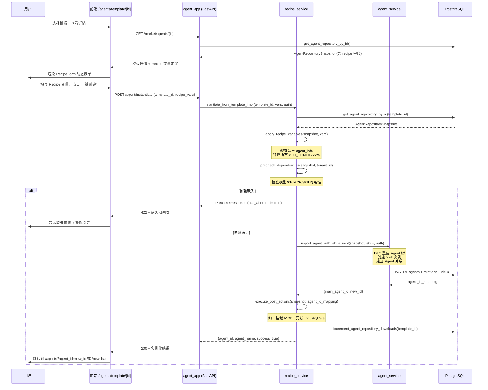
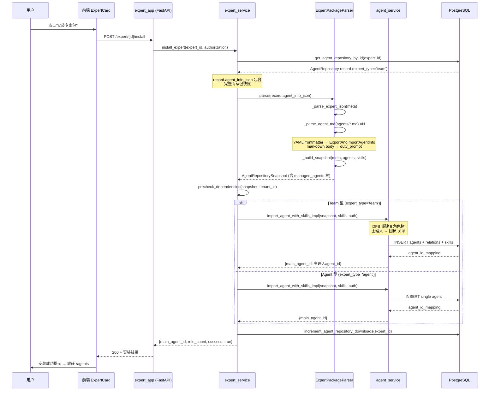
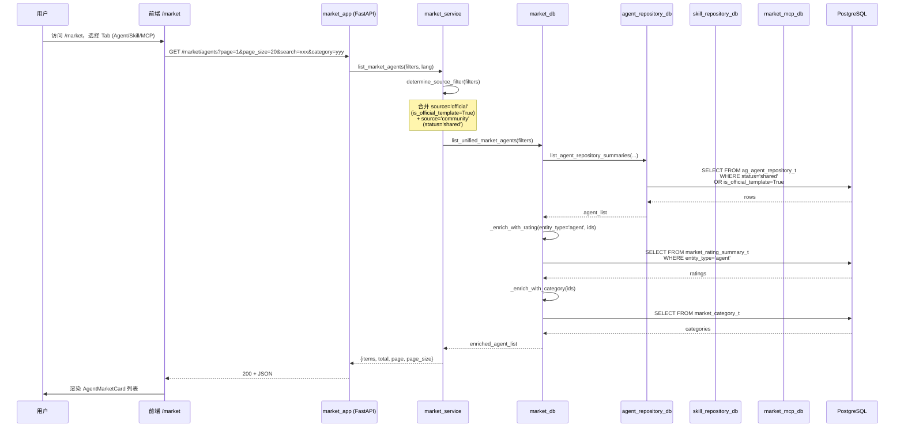
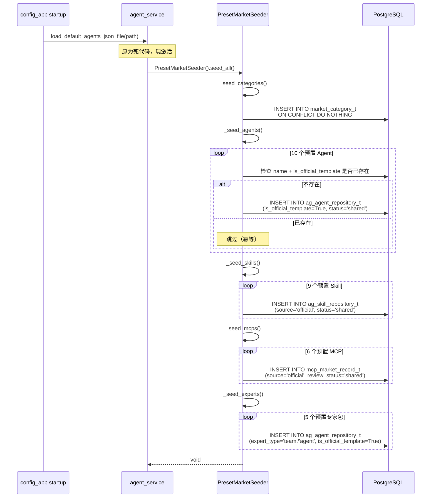

# Nexent 生态市场与专家模板系统 — 系统架构设计 + 任务分解

> 架构师：高见远（Gao）  
> 日期：2026-07-25  
> 基于：nexent-market-template-master-spec-2026-07-25.md  
> 代码库版本：当前 main 分支

---

## 目录

- [Part A: 系统设计](#part-a-系统设计)
  - [1. 实现方案与框架选型](#1-实现方案与框架选型)
  - [2. 文件列表及相对路径](#2-文件列表及相对路径)
  - [3. 数据结构与接口（类图）](#3-数据结构与接口类图)
  - [4. 程序调用流程（时序图）](#4-程序调用流程时序图)
  - [5. 待明确事项](#5-待明确事项)
- [Part B: 任务分解](#part-b-任务分解)
  - [6. 依赖包列表](#6-依赖包列表)
  - [7. 任务列表](#7-任务列表)
  - [8. 共享知识](#8-共享知识)
  - [9. 任务依赖图](#9-任务依赖图)

---

## Part A: 系统设计

### 1. 实现方案与框架选型

#### 1.1 技术栈确认

Nexent 已有技术栈经过代码库验证，全部沿用，不引入新框架：

| 层级 | 技术选型 | 版本约束 | 说明 |
|------|---------|---------|------|
| 后端框架 | FastAPI | ≥0.115.12 | 已有 `backend/apps/app_factory.py` 工厂模式，新增 app 沿用 `create_app()` |
| ORM | SQLAlchemy 2.0 | ~2.0.37 | 已有 `database/db_models.py` 统一模型定义，schema=`nexent` |
| 数据库 | PostgreSQL | — | JSONB 大量使用，ARRAY(Text) 用于标签 |
| 后端依赖管理 | uv + pyproject.toml | — | `backend/pyproject.toml` 已有声明 |
| SDK | nexent 包 | 0.1.2 | `sdk/nexent/core/agents/` 下有 `core_agent.py`、`nexent_agent.py`、`run_agent.py` |
| 前端框架 | Next.js | ^15.5.9 | App Router，`[locale]` 动态路由 |
| 前端 UI | antd | ^6.3.0 | **非 MUI**，全站统一 antd 组件 |
| 前端状态 | zustand | ^5.0.9 | 已有 `stores/agentConfigStore.ts` |
| 前端数据请求 | @tanstack/react-query | ^5.90.12 | 已有 `usePublishedAgentList` 等 hooks |
| 前端国际化 | i18next + react-i18next | — | `common` namespace |
| 前端动画 | framer-motion | ^12.23.6 | 已在 market 页使用 |
| 前端 ZIP | jszip | ^3.10.1 | 已在 `agentImportUtils.ts` 使用 |

#### 1.2 核心技术挑战与方案

**挑战 1：统一市场查询层——三仓库合一**

现有三个独立仓库（`ag_agent_repository_t`、`ag_skill_repository_t`、`mcp_market_record_t`）各有独立 app 和 service。需要新建 `market_app` + `market_service` 作为统一查询层，合并官方预置 + 社区内容，按 entity_type 路由到底层 DB 函数。

方案：`market_service` 内部按 `entity_type`（`agent`/`skill`/`mcp`）分派到已有 db 函数（`list_agent_repository_summaries`、`list_skill_repository_summaries`、`get_mcp_market_records`），并叠加 `is_official`/`is_featured` 过滤和排序。不修改已有 db 层，仅新增 market_db 层做组合查询。

**挑战 2：模板实例化引擎——Recipe 变量替换 + 依赖预检**

`import_agent_with_skills_impl` 已实现 DFS 重建 Agent 树。模板实例化需要在其上游加一层：读取快照 → 应用 Recipe 变量（替换 `<TO_CONFIG>` 占位符）→ 预检依赖（模型/KB/MCP 是否可用）→ 复用已有 DFS 导入 → 执行 post_actions。

方案：新建 `recipe_service`，核心函数 `apply_recipe_variables(snapshot, recipe_vars)` 深度遍历 snapshot 的 `agent_info` 字典，替换所有 `<TO_CONFIG:xxx>` 为用户填入的值。`instantiate_from_template_impl` 编排整个流程。

**挑战 3：专家包 ZIP 解析——MD frontmatter → AgentRepositorySnapshot**

专家包格式：`expert.json` + `agents/*.md`（YAML frontmatter + markdown body）+ `skills/` + `avatars/`。需要解析为已有的 `AgentRepositorySnapshot` 格式，才能复用 `import_agent_with_skills_impl`。

方案：新建 `ExpertPackageParser`，读取 `expert.json` 获取元数据，遍历 `agents/*.md` 解析 frontmatter（YAML）→ 映射为 `ExportAndImportAgentInfo` 字段，markdown body 作为 `duty_prompt`。如果是 Team 型，从 `settings.json` 读取主理人声明，构建 `managed_agents` 关系树。

**挑战 4：SDK 层 ExpertTeam 运行时——多角色调度**

`ExpertTeam` 需要在 SDK 层实现：主理人 Agent 激活 → 创建团员 → 按 SOP 调度 → 团员回传 → 主理人汇编。

方案：`ExpertTeam` 类持有主理人 `NexentAgent` 实例和 `subagent_factory`（接受角色定义 → 返回 `NexentAgent`）。调度通过已有的 `managed_agents` 机制（`core_agent.py` 已支持子 Agent 调用）。`ExpertRouter` 在后端做语义匹配，决定路由到哪个团员。

**挑战 5：零配置——平台统一 API Key 代理**

官方预置 Agent 使用平台统一模型配置，用户不感知 API Key。

方案：在 `const.py` 新增 `PLATFORM_LLM_API_KEY`、`PLATFORM_LLM_BASE_URL` 等 env var。`PresetMarketSeeder` 创建预置 Agent 时，模型字段指向平台统一模型 ID（从 `MODEL_CONFIG_MAPPING` 读取 env var）。实例化时如果 `is_official_template=True`，跳过模型配置步骤。

#### 1.3 架构模式

沿用现有分层：

```
Frontend (Next.js)
    ↓ HTTP /api/*
Backend Apps (FastAPI APIRouter)  — HTTP 边界，参数校验，认证
    ↓
Backend Services — 业务逻辑编排
    ↓
Backend Database — SQLAlchemy 查询
    ↓
PostgreSQL (schema: nexent)

SDK (nexent package) — Agent 运行时，被 backend services 调用
```

新增模块嵌入此分层：
- `market_app.py` → `market_service.py` → `market_db.py`（新）+ 已有 db 函数
- `expert_app.py` → `expert_service.py` → `agent_repository_db.py`（复用）
- `recipe_service.py` → `agent_service.py`（复用 `import_agent_with_skills_impl`）
- `preset_market_seeder.py` → `agent_repository_db.py` + `skill_repository_db.py` + `market_mcp_db.py`
- SDK: `sdk/nexent/core/agents/expert_team.py` + `context_loader.py`

---

### 2. 文件列表及相对路径

#### 后端 (backend/)

| # | 文件路径 | N/M | 职责 |
|---|---------|-----|------|
| 1 | `backend/apps/market_app.py` | N | 统一市场 API Router，`/market/*` 端点：agents/skills/mcps/featured/categories |
| 2 | `backend/apps/expert_app.py` | N | 专家包管理 API Router，`/expert/*` 端点：详情/安装 |
| 3 | `backend/apps/config_app.py` | M | 注册 `market_router` 和 `expert_router` |
| 4 | `backend/services/market_service.py` | N | 统一市场查询服务，合并官方+社区，按 entity_type 分派 |
| 5 | `backend/services/expert_service.py` | N | 专家包解析器 `ExpertPackageParser` + 安装流程 |
| 6 | `backend/services/recipe_service.py` | N | Recipe 变量替换 + 依赖预检 + 实例化编排 |
| 7 | `backend/services/preset_market_seeder.py` | N | `PresetMarketSeeder` 类，幂等插入预置 Agent/Skill/MCP |
| 8 | `backend/services/expert_router.py` | N | `ExpertRouter`，语义匹配自动路由（Phase 5） |
| 9 | `backend/services/agent_service.py` | M | 修改 `load_default_agents_json_file` → 调用 `PresetMarketSeeder.seed_all()` |
| 10 | `backend/database/market_db.py` | N | 统一市场 DB 查询：跨三仓库合并查询、精选推荐、评分聚合 |
| 11 | `backend/database/market_interaction_db.py` | N | 评分评论/订阅收藏/举报/发布者档案 DB 操作 |
| 12 | `backend/database/agent_repository_db.py` | M | 新增 `source`/`is_official_template`/`expert_type`/`category_id`/`default_init_prompt`/`quick_prompts`/`members_info`/`template_group_id`/`version_label`/`is_featured`/`featured_weight` 字段支持 |
| 13 | `backend/database/market_mcp_db.py` | M | 新增 `source`/`is_featured` 字段支持 |
| 14 | `backend/database/db_models.py` | M | `AgentRepository` 增加新列；新增 `MarketReview`/`MarketRatingSummary`/`MarketSubscription`/`MarketCategory`/`MarketRecipe`/`MarketReport`/`MarketPublisherProfile` 模型 |
| 15 | `backend/consts/model.py` | M | 新增 `IndustryRule`/`RecipeDefinition`/`RecipeVariable`/`ExpertPackageMeta`/`ExpertMemberInfo` Pydantic 模型；`AgentRepositorySnapshot` 增加 `industry_rule` 和 `recipe` 字段 |
| 16 | `backend/consts/const.py` | M | 新增 `PLATFORM_LLM_API_KEY`/`PLATFORM_LLM_BASE_URL`/`PLATFORM_LLM_MODEL_NAME` 等 env var |
| 17 | `backend/consts/market.py` | N | 市场常量：`EntityType` 枚举、`ReviewStatus`、`SubscriptionAction`、`ReportReason`、`ExpertType` |
| 18 | `backend/utils/expert_md_parser.py` | N | Markdown frontmatter 解析工具，解析 `agents/*.md` → `ExportAndImportAgentInfo` |

#### SDK (sdk/nexent/)

| # | 文件路径 | N/M | 职责 |
|---|---------|-----|------|
| 19 | `sdk/nexent/core/agents/expert_team.py` | N | `ExpertTeam` 类：主理人 Agent + subagent_factory + SOP 调度 + SendMessage 中转 |
| 20 | `sdk/nexent/core/agents/context_loader.py` | N | `AgentContextLoader`：三级加载（metadata/core/on_demand） |
| 21 | `sdk/nexent/core/agents/core_agent.py` | M | 扩展支持 Team 型 Agent 的 managed_agents 调度协议 |

#### 前端 (frontend/)

| # | 文件路径 | N/M | 职责 |
|---|---------|-----|------|
| 22 | `frontend/components/navigation/SideNavigation.tsx` | M | ROUTE_CONFIG 新增 `/market` 入口（order 8.5, parent resource-space） |
| 23 | `frontend/app/[locale]/market/page.tsx` | M | 重构为三 Tab 统一市场（Agent + Skill + MCP + Recipe） |
| 24 | `frontend/app/[locale]/market/components/MarketHeader.tsx` | N | 市场页头部：标题 + 搜索栏 + 精选轮播 |
| 25 | `frontend/app/[locale]/market/components/SearchBar.tsx` | N | 统一搜索栏组件 |
| 26 | `frontend/app/[locale]/market/components/FeaturedCarousel.tsx` | N | 精选推荐轮播组件（三类型混合） |
| 27 | `frontend/app/[locale]/market/components/SkillMarketCard.tsx` | N | Skill 市场卡片 |
| 28 | `frontend/app/[locale]/market/components/McpMarketCard.tsx` | N | MCP 市场卡片 |
| 29 | `frontend/app/[locale]/market/components/RecipeMarketCard.tsx` | N | 组合配方市场卡片 |
| 30 | `frontend/app/[locale]/market/components/ExpertCard.tsx` | N | 专家包展示卡片（头像 + 官方徽章 + Team 成员 chips + 安装按钮） |
| 31 | `frontend/app/[locale]/agents/template/[template_id]/page.tsx` | N | 模板详情 + Recipe 表单页 |
| 32 | `frontend/app/[locale]/agents/template/[template_id]/components/TemplateHeader.tsx` | N | 模板详情头部 |
| 33 | `frontend/app/[locale]/agents/template/[template_id]/components/TemplateIntro.tsx` | N | 模板介绍区 |
| 34 | `frontend/app/[locale]/agents/template/[template_id]/components/RecipeVisualizer.tsx` | N | Recipe 可视化组件（展示 Agent+Skill+MCP 组合关系） |
| 35 | `frontend/app/[locale]/agents/template/[template_id]/components/RecipeForm.tsx` | N | Recipe 动态表单（根据 `recipe.variables` 渲染输入项） |
| 36 | `frontend/app/[locale]/agents/template/[template_id]/components/ReviewSection.tsx` | N | 评分评论区域 |
| 37 | `frontend/components/market/OfficialBadge.tsx` | N | 官方徽章组件 |
| 38 | `frontend/app/[locale]/newchat/assistant-ui/agent-landing.tsx` | M | 增加预置 Agent 快捷入口（6 个 PresetAgentCard） |
| 39 | `frontend/app/[locale]/newchat/assistant-ui/components/PresetAgentCard.tsx` | N | 预置 Agent 卡片（零配置入口） |
| 40 | `frontend/services/marketService.ts` | M | 扩展：新增 skill/mcp/recipe/expert/instantiate/review/subscribe/report API 方法 |
| 41 | `frontend/services/api.ts` | M | `API_ENDPOINTS` 新增 `market.skills`/`market.mcps`/`market.recipes`/`market.expert`/`market.instantiate`/`market.reviews`/`market.subscribe`/`market.report`/`market.publisher` 端点 |
| 42 | `frontend/types/market.ts` | M | 新增 `MarketSkillListItem`/`MarketMcpListItem`/`MarketRecipe`/`RecipeVariable`/`ExpertPackage`/`MarketReview`/`MarketSubscription`/`MarketPublisherProfile` 类型 |
| 43 | `frontend/const/marketConfig.ts` | M | 新增 Recipe 变量类型映射、专家包类型常量 |
| 44 | `frontend/hooks/useMarketData.ts` | N | 市场数据 hook：统一列表 + 搜索 + 分页 + 分类 |
| 45 | `frontend/hooks/useRecipeInstantiate.ts` | N | Recipe 实例化 hook：表单提交 + 进度反馈 |
| 46 | `frontend/hooks/useExpertInstall.ts` | N | 专家包安装 hook：安装 + 进度 |

#### 数据库迁移与部署

| # | 文件路径 | N/M | 职责 |
|---|---------|-----|------|
| 47 | `deploy/sql/migrations/v2.4.0_0725_market_phase0.sql` | N | Phase 0：ALTER ag_agent_repository_t + ALTER mcp_market_record_t |
| 48 | `deploy/sql/migrations/v2.4.0_0725_market_phase1.sql` | N | Phase 1：CREATE market_review_t + market_rating_summary_t + market_subscription_t + market_category_t |
| 49 | `deploy/sql/migrations/v2.4.1_market_phase2.sql` | N | Phase 2：CREATE market_recipe_t + ALTER ag_agent_repository_t (+template_group_id, +version_label) |
| 50 | `deploy/sql/migrations/v2.4.2_market_phase3.sql` | N | Phase 3：ALTER ag_agent_repository_t (+is_featured, +featured_weight) + ALTER mcp_market_record_t (+is_featured) + CREATE market_report_t + market_publisher_profile_t |
| 51 | `docker/init.sql` | M | 同步所有 Phase 迁移内容 |
| 52 | `k8s/helm/nexent/charts/nexent-common/files/init.sql` | M | 同步所有 Phase 迁移内容 |

#### 预置内容数据

| # | 文件路径 | N/M | 职责 |
|---|---------|-----|------|
| 53 | `backend/data/preset_agents/` | N | 10 个预置 Agent JSON 文件（5 通用 + 5 行业） |
| 54 | `backend/data/preset_skills/` | N | 9 个预置 Skill ZIP 文件 |
| 55 | `backend/data/preset_mcps/` | N | 6 个预置 MCP 配置 JSON |
| 56 | `backend/data/preset_experts/` | N | 5 个预置专家包 ZIP（2 Team + 3 Agent） |
| 57 | `backend/data/preset_categories.json` | N | 预置分类数据（Agent + Skill + MCP 统一分类） |

#### 测试

| # | 文件路径 | N/M | 职责 |
|---|---------|-----|------|
| 58 | `backend/tests/test_market_service.py` | N | market_service 单元测试 |
| 59 | `backend/tests/test_expert_service.py` | N | expert_service + ExpertPackageParser 测试 |
| 60 | `backend/tests/test_recipe_service.py` | N | recipe_service + apply_recipe_variables 测试 |
| 61 | `backend/tests/test_preset_market_seeder.py` | N | PresetMarketSeeder 幂等性测试 |

---

### 3. 数据结构与接口（类图）

```mermaid
classDiagram
    %% ===== Pydantic 数据模型层 =====

    class IndustryRule {
        +Dict guardrails
        +Dict tool_routing
        +List scene_mappings
        +String fallback_strategy
    }

    class RecipeVariable {
        +String key
        +String label
        +String var_type
        +String description
        +String default_value
        +List options
        +bool required
    }

    class RecipeDefinition {
        +List~RecipeVariable~ variables
        +List~RecipeLayer~ layers
        +List~Dict~ post_actions
    }

    class RecipeLayer {
        +String layer_type
        +String entity_type
        +int entity_id
        +String entity_name
        +Dict overrides
    }

    class AgentRepositorySnapshot {
        +int agent_id
        +Dict agent_info
        +List mcp_info
        +List skills
        +Optional~IndustryRule~ industry_rule
        +Optional~RecipeDefinition~ recipe
    }

    class ExpertPackageMeta {
        +String expert_id
        +String name
        +String display_name
        +String description
        +String expert_type
        +String version
        +String locale
        +List~ExpertMemberInfo~ members
        +String main_agent_id
        +String icon
        +List~String~ tags
        +String category_id
    }

    class ExpertMemberInfo {
        +String role
        +String agent_file
        +String display_name
        +String description
        +String avatar
    }

    AgentRepositorySnapshot --> IndustryRule : industry_rule
    AgentRepositorySnapshot --> RecipeDefinition : recipe
    RecipeDefinition --> RecipeVariable : variables
    RecipeDefinition --> RecipeLayer : layers

    %% ===== 后端 Service 层 =====

    class MarketService {
        +list_market_agents(filters, lang) Dict
        +list_market_skills(filters, lang) Dict
        +list_market_mcps(filters, lang) Dict
        +list_featured(locale) List
        +list_categories(entity_type) List
    }

    class ExpertService {
        +ExpertPackageParser parser
        +get_expert_detail(expert_id) Dict
        +install_expert(expert_id, authorization) Dict
    }

    class ExpertPackageParser {
        +parse(zip_bytes) ExpertPackageParseResult
        +_parse_expert_json(data) ExpertPackageMeta
        +_parse_agent_md(content) ExportAndImportAgentInfo
        +_build_snapshot(meta, agents, skills) AgentRepositorySnapshot
    }

    class RecipeService {
        +instantiate_from_template(template_id, recipe_vars, authorization) Dict
        +apply_recipe_variables(snapshot, vars) AgentRepositorySnapshot
        +precheck_dependencies(snapshot, tenant_id) RepositoryImportPrecheckResponse
        +publish_recipe(recipe_data, authorization) int
        +instantiate_recipe(recipe_id, authorization) Dict
    }

    class PresetMarketSeeder {
        +PRESET_AGENTS list
        +PRESET_SKILLS list
        +PRESET_MCPS list
        +seed_all() void
        +_seed_agents() void
        +_seed_skills() void
        +_seed_mcps() void
        +_seed_categories() void
        +_seed_experts() void
    }

    class ExpertRouter {
        +route(query, expert_id) String
        +_semantic_match(query, role_descriptions) String
    }

    ExpertService --> ExpertPackageParser
    ExpertService --> AgentRepositorySnapshot : builds
    RecipeService --> AgentRepositorySnapshot : transforms
    PresetMarketSeeder --> MarketService : seeds into

    %% ===== SDK 层 =====

    class ExpertTeam {
        +NexentAgent main_agent
        +subagent_factory factory
        +List~NexentAgent~ members
        +SOPDefinition sop
        +run(input) str
        +_dispatch_phase(phase, context) str
        +_aggregate_outputs(member_outputs) str
    }

    class AgentContextLoader {
        +int agent_id
        +str tenant_id
        +load_metadata() Dict
        +load_core() Dict
        +load_on_demand(query) Dict
    }

    ExpertTeam --> AgentContextLoader : uses

    %% ===== DB 模型层（新增表） =====

    class MarketReview {
        +int review_id
        +String entity_type
        +int entity_id
        +String tenant_id
        +String user_id
        +int rating
        +String comment
        +int parent_review_id
        +String status
    }

    class MarketRatingSummary {
        +String entity_type
        +int entity_id
        +Decimal avg_rating
        +int rating_count
        +int review_count
    }

    class MarketSubscription {
        +int subscription_id
        +String entity_type
        +int entity_id
        +String tenant_id
        +String user_id
        +String action
    }

    class MarketCategory {
        +int category_id
        +String entity_type
        +String name
        +int parent_id
        +String icon
        +int sort_order
        +bool is_active
    }

    class MarketRecipe {
        +int recipe_id
        +String name
        +String description
        +String publisher_tenant_id
        +String publisher_user_id
        +JSONB recipe_json
        +List~String~ tags
        +int category_id
        +String status
        +int downloads
    }

    class MarketReport {
        +int report_id
        +String entity_type
        +int entity_id
        +String reporter_user_id
        +String reason
        +String description
        +String status
        +String handler_user_id
    }

    class MarketPublisherProfile {
        +String user_id
        +String tenant_id
        +String display_name
        +String avatar
        +String bio
        +int total_publishes
        +int total_downloads
        +Decimal avg_rating
        +bool verified
    }

    MarketReview --> MarketRatingSummary : aggregates
    MarketSubscription --> MarketCategory : optionally
    MarketRecipe --> MarketCategory : belongs to
```



---

### 4. 程序调用流程（时序图）

#### 4.1 模板实例化流程



#### 4.2 专家包安装流程



#### 4.3 统一市场列表查询流程



#### 4.4 预置内容 Seeding 流程（启动时）



---

### 5. 待明确事项

1. **平台统一 API Key 的具体来源**：spec 提到"平台统一 API Key"，但当前 `const.py` 中没有 `PLATFORM_LLM_API_KEY` 定义。**假设**：新增 env var `PLATFORM_LLM_API_KEY`、`PLATFORM_LLM_BASE_URL`、`PLATFORM_LLM_MODEL_NAME`，在 `const.py` 声明。需用户确认是否与现有模型管理系统集成（`model_management_db.py`）还是独立配置。

2. **IndustryRule 的运行时注入点**：spec 要求 `IndustryRule` 包含 `guardrails`/`tool_routing`/`scene_mappings`/`fallback_strategy`，但未明确运行时在哪里生效。**假设**：注入到 Agent 的 system prompt 上下文中（通过 `duty_prompt` 拼接），以及 `ExpertRouter` 做 `tool_routing`。需用户确认是否需要修改 SDK 层的 prompt 构建逻辑。

3. **ExpertTeam 与已有 managed_agents 机制的关系**：`core_agent.py` 已支持 `managed_agents` 子 Agent 调用。**假设**：`ExpertTeam` 封装已有机制，不修改 `core_agent.py` 的调度核心，仅在上层加 SOP 阶段控制。需用户确认 SOP 阶段控制是否需要 SDK 层原生支持。

4. **预置内容的实际数据**：spec 列出 10 个 Agent + 9 个 Skill + 6 个 MCP + 5 个专家包，但未给出具体内容。**假设**：`backend/data/preset_agents/` 等目录下的 JSON/ZIP 文件需要产品团队提供具体内容。架构设计只定义格式规范，不含具体预置数据。

5. **前端路由 `[template_id]` 的值类型**：spec 写 `frontend/app/[locale]/agents/template/[template_id]/page.tsx`。**假设**：`template_id` 是 `ag_agent_repository_t.agent_repository_id`（整数）。需确认是否用 slug 或 ID。

6. **评分评论的审核机制**：spec 提到 `market_review_t.status` 默认 `visible`，但未明确是否需要审核。**假设**：评论即时可见（`visible`），管理员可隐藏（`hidden`）。需用户确认审核策略。

7. **docker/init.sql 和 k8s init.sql 的路径**：代码库中 `docker/init.sql` 未在预期路径找到。**假设**：可能路径为 `docker/init.sql` 或在 docker 构建脚本中。需用户确认准确路径。

8. **`load_default_agents_json_file` 的调用时机**：当前是死代码（无调用方）。**假设**：在 `config_app.py` 的 `@app.on_event("startup")` 中调用。需用户确认是否在启动时自动 seed。

---

## Part B: 任务分解

### 6. 依赖包列表

#### 后端 (backend/pyproject.toml)

```toml
# 无新增依赖。现有 fastapi、sqlalchemy、pydantic、pyyaml 已满足需求。
# pyyaml (>=6.0.2) 已在依赖中，用于解析专家包 MD frontmatter
```

#### SDK (sdk/pyproject.toml)

```toml
# 无新增依赖。现有 openai、pydantic 已满足 ExpertTeam 需求
```

#### 前端 (frontend/package.json)

```json
{
  "dependencies": {
    // 无新增依赖。现有 antd、framer-motion、jszip、@tanstack/react-query、zustand 已满足
  }
}
```

> **说明**：经过代码库验证，所有需要的框架和库已在现有 `pyproject.toml` 和 `package.json` 中声明，无需新增任何第三方依赖。

---

### 7. 任务列表

> 按 Phase 顺序排列，每个任务含依赖关系。任务粒度按功能模块/层次分组。

#### T01: 数据库基础设施 + 数据模型扩展（Phase 0 核心）

| 字段 | 值 |
|------|---|
| **Task ID** | T01 |
| **Task Name** | 数据库迁移 + ORM 模型 + Pydantic 数据模型 |
| **Phase** | Phase 0 |
| **Priority** | P0 |
| **Dependencies** | 无 |
| **预估工作量** | 3-4 天 |
| **Source Files** | `deploy/sql/migrations/v2.4.0_0725_market_phase0.sql` (N), `deploy/sql/migrations/v2.4.1_market_phase1.sql` (N), `deploy/sql/migrations/v2.4.2_market_phase2.sql` (N), `deploy/sql/migrations/v2.4.2_market_phase3.sql` (N), `docker/init.sql` (M), `k8s/helm/nexent/charts/nexent-common/files/init.sql` (M), `backend/database/db_models.py` (M), `backend/database/agent_repository_db.py` (M), `backend/database/market_mcp_db.py` (M), `backend/consts/model.py` (M), `backend/consts/market.py` (N), `backend/consts/const.py` (M) |
| **Description** | 编写所有 Phase 的 SQL 迁移脚本（Phase 0-3），同步更新 `docker/init.sql` 和 k8s init.sql。在 `db_models.py` 中为 `AgentRepository` 增加新列（source, is_official_template, expert_type, category_id, default_init_prompt, quick_prompts, members_info, template_group_id, version_label, is_featured, featured_weight），为 `McpMarketRecord` 增加 source, is_featured 列。新增 7 个 ORM 模型类（MarketReview, MarketRatingSummary, MarketSubscription, MarketCategory, MarketRecipe, MarketReport, MarketPublisherProfile）。在 `model.py` 中新增 IndustryRule, RecipeVariable, RecipeDefinition, RecipeLayer, ExpertPackageMeta, ExpertMemberInfo Pydantic 模型，扩展 AgentRepositorySnapshot 增加 industry_rule 和 recipe 字段。新建 `consts/market.py` 定义 EntityType/ReviewStatus/SubscriptionAction/ReportReason/ExpertType 常量。在 `const.py` 新增 PLATFORM_LLM_API_KEY 等环境变量。在 `agent_repository_db.py` 和 `market_mcp_db.py` 中增加新字段的读写支持。 |

#### T02: 后端市场与专家 Service 层 + API 层（Phase 0-2 后端）

| 字段 | 值 |
|------|---|
| **Task ID** | T02 |
| **Task Name** | market_app + expert_app + 所有 Service 层 |
| **Phase** | Phase 0-2 |
| **Priority** | P0 |
| **Dependencies** | T01 |
| **预估工作量** | 5-6 天 |
| **Source Files** | `backend/apps/market_app.py` (N), `backend/apps/expert_app.py` (N), `backend/apps/config_app.py` (M), `backend/services/market_service.py` (N), `backend/services/expert_service.py` (N), `backend/services/recipe_service.py` (N), `backend/services/preset_market_seeder.py` (N), `backend/services/agent_service.py` (M), `backend/database/market_db.py` (N), `backend/database/market_interaction_db.py` (N), `backend/utils/expert_md_parser.py` (N) |
| **Description** | 新建 `market_app.py`（API Router，`/market/*`：agents/skills/mcps/featured/categories + Phase 1 的 reviews/subscribe + Phase 3 的 recipes/report/publisher）。新建 `expert_app.py`（`/expert/*`：详情/安装）。在 `config_app.py` 注册两个新 router。新建 `market_service.py` 实现统一市场查询（合并 official + community，按 entity_type 分派）。新建 `market_db.py` 跨三仓库合并查询 + 评分聚合 + 精选推荐。新建 `market_interaction_db.py` 处理评分评论/订阅收藏/举报/发布者档案 CRUD。新建 `expert_service.py` 含 `ExpertPackageParser`（解析 expert.json + agents/*.md → AgentRepositorySnapshot）和安装流程。新建 `recipe_service.py` 含 `apply_recipe_variables`（深度遍历替换 <TO_CONFIG> 占位符）、`precheck_dependencies`、`instantiate_from_template_impl`（复用 `import_agent_with_skills_impl`）、Recipe 发布与实例化。新建 `preset_market_seeder.py` 含 `PresetMarketSeeder` 类（幂等 seed_all）。新建 `expert_md_parser.py` 解析 YAML frontmatter。修改 `agent_service.py` 激活 `load_default_agents_json_file` → 调用 `PresetMarketSeeder().seed_all()`，在 `config_app.py` startup 事件中触发。 |

#### T03: SDK 层 ExpertTeam + AgentContextLoader（Phase 4-5 SDK）

| 字段 | 值 |
|------|---|
| **Task ID** | T03 |
| **Task Name** | ExpertTeam 运行时 + 三级上下文加载 |
| **Phase** | Phase 4-5 |
| **Priority** | P1 |
| **Dependencies** | T01 |
| **预估工作量** | 4-5 天 |
| **Source Files** | `sdk/nexent/core/agents/expert_team.py` (N), `sdk/nexent/core/agents/context_loader.py` (N), `sdk/nexent/core/agents/core_agent.py` (M) |
| **Description** | 新建 `expert_team.py` 实现 `ExpertTeam` 类：持有主理人 `NexentAgent` 实例 + `subagent_factory`（接受角色定义 → 返回 NexentAgent）。实现 SOP 5 阶段调度（理解→规划→执行→验证→汇编），每阶段调用对应团员 Agent，团员产出通过 `SendMessage` 回传主理人，主理人中转汇编。新建 `context_loader.py` 实现 `AgentContextLoader`：`load_metadata()`（读取 agent 基本信息 + industry_rule）、`load_core()`（加载完整 agent 配置 + skills + tools）、`load_on_demand(query)`（按需加载知识库/外部数据）。修改 `core_agent.py` 扩展支持 Team 型 Agent 的 managed_agents 调度协议（在已有 DFS 调用基础上增加阶段控制钩子）。新建 `backend/services/expert_router.py` 实现 `ExpertRouter` 语义匹配自动路由（Phase 5，可基于关键词匹配或 LLM embedding，初期实现简单关键词匹配）。 |

#### T04: 前端统一市场 + 模板详情 + 专家卡片（Phase 0-4 前端）

| 字段 | 值 |
|------|---|
| **Task ID** | T04 |
| **Task Name** | 前端市场页重构 + 模板详情页 + 专家卡片 + 预置入口 |
| **Phase** | Phase 0-4 |
| **Priority** | P0 |
| **Dependencies** | T01, T02 |
| **预估工作量** | 6-7 天 |
| **Source Files** | `frontend/components/navigation/SideNavigation.tsx` (M), `frontend/app/[locale]/market/page.tsx` (M), `frontend/app/[locale]/market/components/MarketHeader.tsx` (N), `frontend/app/[locale]/market/components/SearchBar.tsx` (N), `frontend/app/[locale]/market/components/FeaturedCarousel.tsx` (N), `frontend/app/[locale]/market/components/SkillMarketCard.tsx` (N), `frontend/app/[locale]/market/components/McpMarketCard.tsx` (N), `frontend/app/[locale]/market/components/RecipeMarketCard.tsx` (N), `frontend/app/[locale]/market/components/ExpertCard.tsx` (N), `frontend/app/[locale]/agents/template/[template_id]/page.tsx` (N), `frontend/app/[locale]/agents/template/[template_id]/components/TemplateHeader.tsx` (N), `frontend/app/[locale]/agents/template/[template_id]/components/TemplateIntro.tsx` (N), `frontend/app/[locale]/agents/template/[template_id]/components/RecipeVisualizer.tsx` (N), `frontend/app/[locale]/agents/template/[template_id]/components/RecipeForm.tsx` (N), `frontend/app/[locale]/agents/template/[template_id]/components/ReviewSection.tsx` (N), `frontend/components/market/OfficialBadge.tsx` (N), `frontend/app/[locale]/newchat/assistant-ui/agent-landing.tsx` (M), `frontend/app/[locale]/newchat/assistant-ui/components/PresetAgentCard.tsx` (N), `frontend/services/marketService.ts` (M), `frontend/services/api.ts` (M), `frontend/types/market.ts` (M), `frontend/const/marketConfig.ts` (M), `frontend/hooks/useMarketData.ts` (N), `frontend/hooks/useRecipeInstantiate.ts` (N), `frontend/hooks/useExpertInstall.ts` (N) |
| **Description** | 在 `SideNavigation.tsx` 的 `ROUTE_CONFIG` 新增 `/market` 入口（order 8.5, parent `/resource-space`, icon Store, label `sidebar.market`）。重构 `/market/page.tsx` 为三 Tab 统一市场（Agent + Skill + MCP + Recipe Tab），含 MarketHeader + SearchBar + FeaturedCarousel。新建 SkillMarketCard/McpMarketCard/RecipeMarketCard/ExpertCard 组件。新建模板详情页 `agents/template/[template_id]/page.tsx`（含 TemplateHeader + TemplateIntro + RecipeVisualizer + RecipeForm 动态渲染 + 一键创建按钮 + ReviewSection）。新建 OfficialBadge 组件。修改 `agent-landing.tsx` 增加预置 Agent 快捷入口（6 个 PresetAgentCard）。扩展 `marketService.ts` 新增 skill/mcp/recipe/expert/instantiate/review/subscribe/report API 方法。扩展 `api.ts` 新增对应端点。扩展 `types/market.ts` 新增所有新类型。新建 `useMarketData`/`useRecipeInstantiate`/`useExpertInstall` hooks。 |

#### T05: 预置内容数据 + 集成测试 + 收尾（Phase 0-5 集成）

| 字段 | 值 |
|------|---|
| **Task ID** | T05 |
| **Task Name** | 预置内容数据文件 + 后端测试 + 端到端集成 |
| **Phase** | Phase 0-5 |
| **Priority** | P1 |
| **Dependencies** | T01, T02, T03, T04 |
| **预估工作量** | 4-5 天 |
| **Source Files** | `backend/data/preset_agents/` (N, 10 files), `backend/data/preset_skills/` (N, 9 files), `backend/data/preset_mcps/` (N, 6 files), `backend/data/preset_experts/` (N, 5 files), `backend/data/preset_categories.json` (N), `backend/tests/test_market_service.py` (N), `backend/tests/test_expert_service.py` (N), `backend/tests/test_recipe_service.py` (N), `backend/tests/test_preset_market_seeder.py` (N) |
| **Description** | 创建预置内容数据文件：10 个预置 Agent JSON（5 通用型 + 5 行业型，含 IndustryRule）、9 个预置 Skill ZIP、6 个预置 MCP 配置 JSON、5 个预置专家包 ZIP（2 Team + 3 Agent，含 expert.json + agents/*.md + skills/ + avatars/ + settings.json）、预置分类数据。编写后端单元测试：`test_market_service.py`（市场查询合并逻辑、评分聚合）、`test_expert_service.py`（ExpertPackageParser 解析、安装流程）、`test_recipe_service.py`（apply_recipe_variables 变量替换、precheck_dependencies）、`test_preset_market_seeder.py`（seed_all 幂等性、重复执行不报错）。Mock 策略：在 import site 用全限定路径 mock（如 `backend.services.agent_service.import_agent_with_skills_impl`）。端到端集成：验证 PresetMarketSeeder 启动时正确 seed → 市场页显示预置内容 → 模板实例化 → 专家包安装全流程。 |

---

### 8. 共享知识

#### 8.1 命名约定

```
# 后端
- API Router 前缀：/market/*（市场）、/expert/*（专家）
- Service 文件：xxx_service.py（如 market_service.py）
- DB 文件：xxx_db.py（如 market_db.py）
- Pydantic 模型：PascalCase（如 IndustryRule, RecipeVariable）
- 常量：UPPER_SNAKE_CASE（如 PLATFORM_LLM_API_KEY）
- 数据库表名：xxx_t 后缀（如 market_review_t）
- 数据库列名：snake_case
- ORM 模型类：PascalCase，与表名映射

# 前端
- 页面路径：/app/[locale]/xxx/page.tsx
- 组件文件：PascalCase.tsx（如 ExpertCard.tsx）
- hooks：useXxx.ts（如 useMarketData.ts）
- types：PascalCase interface（如 MarketReview）
- services：camelCase 方法名（如 marketService.listSkills()）
- zustand store：useXxxStore

# SDK
- 类名：PascalCase（如 ExpertTeam, AgentContextLoader）
- 方法：snake_case（如 load_on_demand）
```

#### 8.2 错误处理模式

```
# 后端统一响应格式
{
  "code": 200,       # 200=成功, 4xx=客户端错误, 5xx=服务端错误
  "data": {...},     # 业务数据
  "message": "..."   # 错误描述（成功时为空）
}

# HTTP 状态码
- 200: 成功
- 201: 创建成功（POST /market/recipes, POST /expert/{id}/install）
- 400: 参数错误
- 404: 资源不存在
- 409: 冲突（如 SkillDuplicateError）
- 422: 依赖预检失败（instantiate 时依赖缺失）
- 403: 权限不足

# 异常处理
- 使用 HTTPException(status_code, detail)
- AppException 用于业务异常
- Service 层抛 ValueError / 自定义异常，App 层捕获转 HTTPException
```

#### 8.3 环境变量管理规则

```
# 铁律：SDK 层绝不直接读 env var
# 环境变量单一真相源在 backend/consts/const.py

# 新增 env var（Phase 0）：
PLATFORM_LLM_API_KEY = os.getenv("PLATFORM_LLM_API_KEY", "")      # 平台统一 LLM API Key
PLATFORM_LLM_BASE_URL = os.getenv("PLATFORM_LLM_BASE_URL", "")    # 平台统一 LLM Base URL
PLATFORM_LLM_MODEL_NAME = os.getenv("PLATFORM_LLM_MODEL_NAME", "") # 平台统一模型名称

# 使用方式：
# 1. const.py 声明 env var
# 2. Service 层通过 `from consts.const import PLATFORM_LLM_API_KEY` 使用
# 3. SDK 层通过参数传递，绝不直接 import const.py
```

#### 8.4 Mock 策略（pytest）

```python
# Mock 在 import site 用全限定路径
# 示例：mock import_agent_with_skills_impl
@patch("backend.services.recipe_service.import_agent_with_skills_impl")
async def test_instantiate_from_template(mock_import):
    mock_import.return_value = {1: 100}
    # ...

# Mock 数据库 session
@patch("backend.database.agent_repository_db.get_db_session")
def test_get_repository(mock_session):
    # ...

# Mock HTTP 请求（外部 Registry 代理）
@patch("httpx.AsyncClient.get")
async def test_registry_proxy(mock_get):
    # ...
```

#### 8.5 SQL 迁移铁律

```
# 三处必须同步更新：
1. deploy/sql/migrations/vX.Y.Z_description.sql  — 迁移脚本
2. docker/init.sql                                 — Docker 初始化
3. k8s/helm/nexent/charts/nexent-common/files/init.sql — K8s 初始化

# 迁移脚本规范：
- 文件名：v{major}.{minor}.{patch}_{MMDD}_{description}.sql
- 使用 IF NOT EXISTS / IF EXISTS 保证幂等
- ALTER TABLE 使用 ADD COLUMN IF NOT EXISTS
- CREATE TABLE 使用 IF NOT EXISTS
- 包含注释说明变更目的

# ORM 模型同步：
- db_models.py 中的类定义必须与 DDL 一致
- 新增列必须有 doc 参数说明
- JSONB 类型使用 sqlalchemy.dialects.postgresql.JSONB
- ARRAY 类型使用 sqlalchemy.dialects.postgresql.ARRAY
```

#### 8.6 前端 API 调用约定

```typescript
// 所有市场 API 通过 marketService 调用
import marketService from "@/services/marketService";

// 统一错误处理
try {
  const res = await marketService.listAgents(params);
  if (!res.success) {
    // 业务错误
  }
} catch (err) {
  // 网络错误，MarketApiError
}

// react-query 缓存键
queryKey: ["market", "agents", { page, pageSize, search, category }]

// 实例化进度反馈使用 SSE 或轮询
// POST /agent/instantiate 返回 task_id → 轮询 GET /agent/instantiate/{task_id}/status
```

#### 8.7 专家包格式规范

```
expert.zip
├── expert.json          # 元数据 + 展示信息 + 类型声明
├── agents/
│   ├── main.md          # 主理人角色定义（frontmatter + markdown body）
│   ├── researcher.md    # 研究员
│   ├── writer.md        # 撰写者
│   └── ...
├── skills/              # 可选，附带 Skill ZIP
│   └── xxx.zip
├── avatars/             # 可选，头像
│   ├── main.png
│   └── ...
└── settings.json        # Team 型声明：主理人 ID + SOP 定义

# expert.json 格式：
{
  "expert_id": "deep-research-team",
  "name": "深度研究团队",
  "display_name": {"zh": "深度研究团队", "en": "Deep Research Team"},
  "description": {"zh": "...", "en": "..."},
  "expert_type": "team",  // "team" or "agent"
  "version": "1.0.0",
  "locale": ["zh", "en"],
  "main_agent_id": "main",
  "members": [
    {"role": "main", "agent_file": "agents/main.md", "display_name": {...}},
    {"role": "researcher", "agent_file": "agents/researcher.md", "display_name": {...}}
  ],
  "icon": "🔬",
  "tags": ["研究", "分析"],
  "category_id": "research"
}

# agents/*.md frontmatter 格式：
---
name: deep-researcher
display_name: 研究员
description: 负责信息搜集与分析
max_steps: 20
is_main_agent: false
provide_run_summary: true
tools: []
managed_agents: []
---

# 角色职责
你是深度研究团队的研究员...

# 工作流程
1. 接收主理人的研究任务
2. 使用搜索工具收集信息
3. 汇总发现并回传主理人
```

---

### 9. 任务依赖图

```mermaid
graph TD
    T01[T01: 数据库基础设施<br/>+ 数据模型扩展<br/>Phase 0 | P0 | 3-4d]
    T02[T02: 后端市场与专家<br/>Service + API 层<br/>Phase 0-2 | P0 | 5-6d]
    T03[T03: SDK 层<br/>ExpertTeam + ContextLoader<br/>Phase 4-5 | P1 | 4-5d]
    T04[T04: 前端统一市场<br/>+ 模板详情 + 专家卡片<br/>Phase 0-4 | P0 | 6-7d]
    T05[T05: 预置内容数据<br/>+ 测试 + 集成<br/>Phase 0-5 | P1 | 4-5d]

    T01 --> T02
    T01 --> T03
    T01 --> T04
    T02 --> T04
    T02 --> T05
    T03 --> T05
    T04 --> T05

    style T01 fill:#f9f,stroke:#333,stroke-width:2px
    style T02 fill:#bbf,stroke:#333,stroke-width:2px
    style T03 fill:#bfb,stroke:#333,stroke-width:2px
    style T04 fill:#fbb,stroke:#333,stroke-width:2px
    style T05 fill:#fff,stroke:#333,stroke-width:2px,stroke-dasharray: 5 5
```

**关键路径**：T01 → T02 → T04 → T05（总计约 18-22 天）

**并行机会**：
- T03 可与 T02/T04 并行（仅依赖 T01）
- T04 的前端开发可在 T02 API 完成后立即开始（T01+T02 完成后 T04 启动）

---

## 附录：Phase 与任务映射

| Phase | 说明 | 涉及任务 |
|-------|------|---------|
| Phase 0 | 基础设施与预置内容 | T01 (DB), T02 (API+Service), T04 (前端市场), T05 (预置数据) |
| Phase 1 | 模板实例化与 Recipe | T01 (DDL), T02 (recipe_service), T04 (RecipeForm) |
| Phase 2 | 社区互动层 | T01 (DDL), T02 (interaction API), T04 (ReviewSection) |
| Phase 3 | 组合配方层 | T01 (DDL), T02 (recipe API), T04 (RecipeMarketCard) |
| Phase 4 | 专家系统 | T01 (DDL), T02 (expert_service), T03 (ExpertTeam), T04 (ExpertCard), T05 (专家包数据) |
| Phase 5 | 体验优化 | T03 (ExpertRouter, ContextLoader), T04 (PresetAgentCard) |
