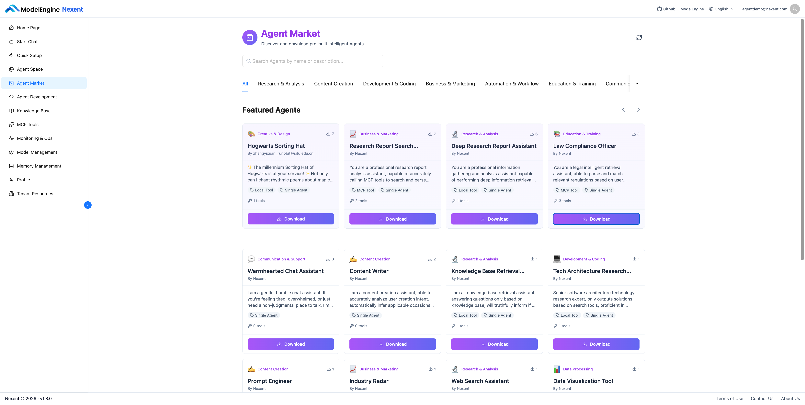
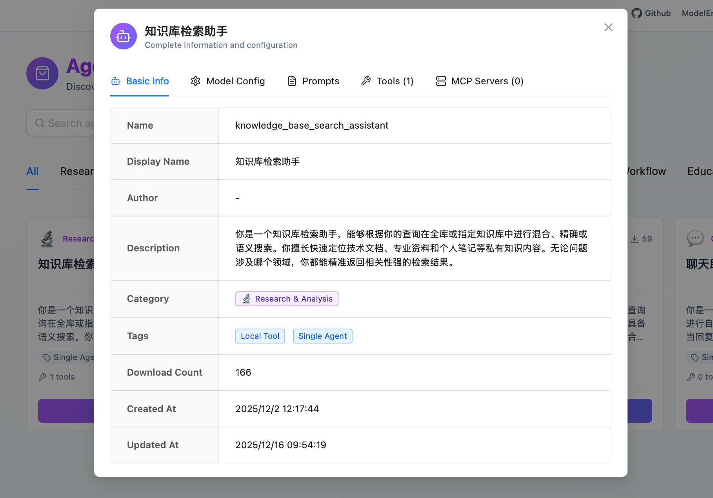
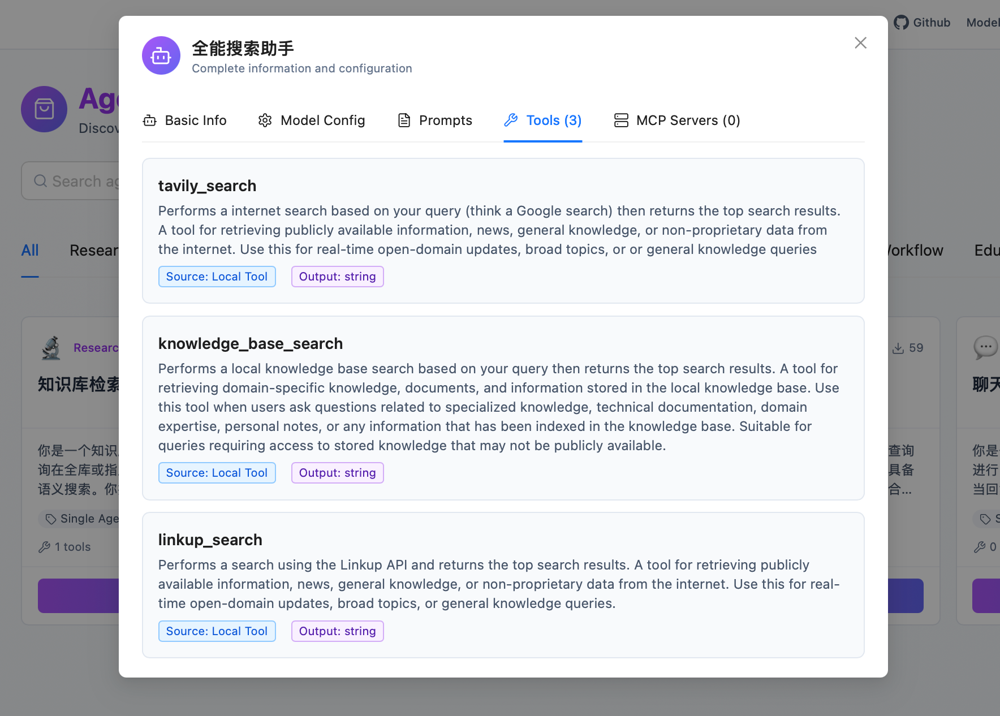
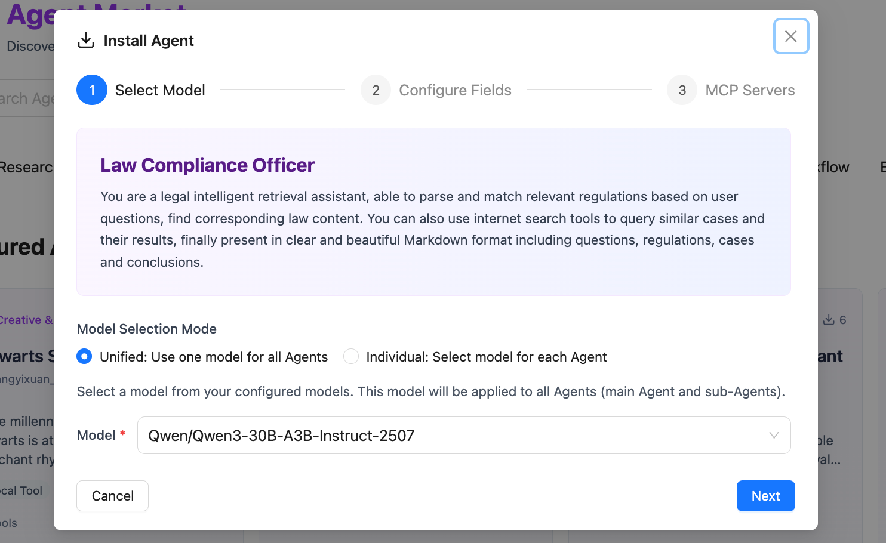
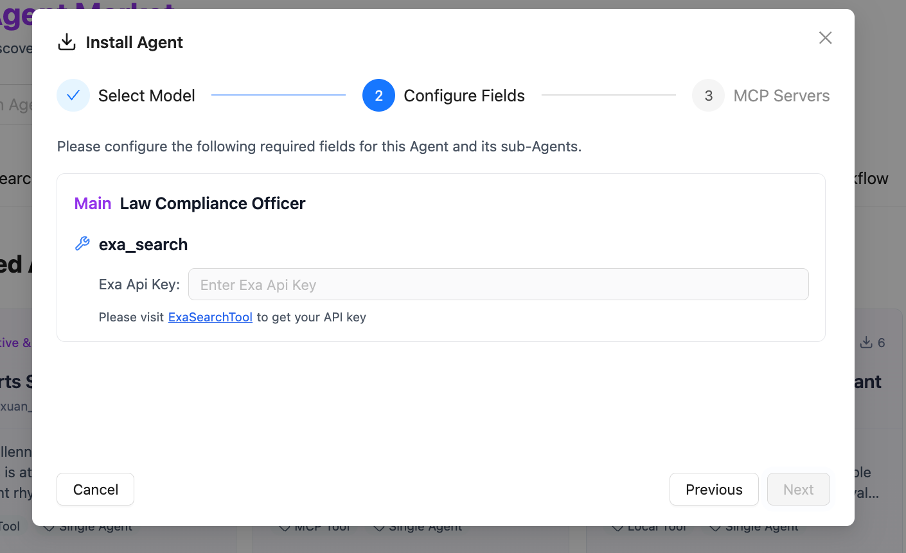

# Agent Market

🎁 Here you'll find high-quality agents created by **Nexent Official** and **community creators**

You can use them directly to complete specific tasks, or incorporate them as sub-agents into your own agents

## 🔍 Explore and Discover

You can quickly find the best agents through the following methods:

1. Browse or search by use case category
2. View agent feature descriptions to confirm if they meet your needs 🆗
3. Check built-in tools to confirm if they are ready or available ✅

  

  

## 🔧 Install Agents

Select your preferred agent, download with one click, and add it to your agent space immediately

### 1️⃣ Select Models

🌟 Confirm model availability

✍️ Configure the same model for all agents uniformly, or select appropriate models for the main agent and sub-agents separately

### 2️⃣ Configure Fields

🔑 Fill in tool permissions as prompted

After installation, your agent will be ready in **[Agent Space](./agent-space)**

## 📢 Share Your Creations

Created an excellent agent? 👍

Welcome to share your work in [GitHub Discussions](https://github.com/ModelEngine-Group/nexent/discussions), and we'll contact you as soon as possible to let more people see and use it!

## 🚀 Related Features

While waiting for the Agent Market to launch, you can:

1. Manage your own agents in **[Agent Space](./agent-space)**
2. Create custom agents through **[Agent Development](./agent-development)**
3. Experience the powerful features of agents in **[Start Chat](./start-chat)**

If you encounter any issues during use, please refer to our **[FAQ](../quick-start/faq)** or ask for support in [GitHub Discussions](https://github.com/ModelEngine-Group/nexent/discussions).
