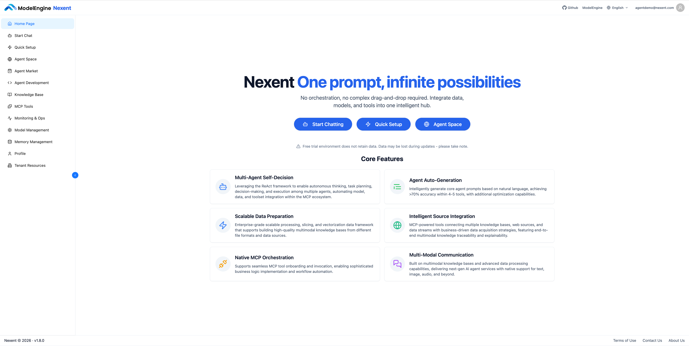

# User Guide

Nexent is a future-oriented zero-code agent development platform that helps anyone build and deploy custom AI agents without writing code or handling complex workflows.

This guide walks you through Nexent’s major features and daily workflows so you can get productive in minutes.

By the end, you’ll know how to turn your ideas into production-ready agents that deliver real value at work and in life.

## 🏠 Homepage Overview

The Nexent homepage highlights the core entry points of the platform:

### Primary actions

1. **Start Chatting** – Jump straight into the chat interface and talk to an agent.
2. **Quick Setup** – Follow the guided flow to finish model, knowledge base, and agent setup in sequence.
3. **Agent Space** – Browse and manage every agent you have built.

### Left navigation

The left sidebar exposes every major module:

- **Home Page** – Return to the homepage.
- **Start Chat** – Open the chat interface.
- **Quick Setup** – Complete the recommended setup flow (Models → Knowledge Base → Agent).
- **Agent Space** – Manage all existing agents.
- **Agent Market** – Discover and install published agents.
- **Agent Development** – Create and configure agents.
- **Knowledge Base** – Upload documents and materials to help agents understand your exclusive knowledge.
- **MCP Tools** – Connect servers, sync tools, and view status at a glance (coming soon).
- **Monitoring & Operations** – Monitor agent runtime status in real time (coming soon).
- **Model Management** – Manage app information and model configuration, connect the AI capabilities you need.
- **Memory Management** – Control agents' long-term memory for more efficient conversations.
- **User Management** – Provide unified user, role, and permission control for teams (coming soon).

Use the language switcher in the top-right corner to toggle between Simplified Chinese and English. The lower-left corner shows the running Nexent version to simplify troubleshooting when asking for help.

## 🚀 Quick Start

We recommend configuring the platform in this order:

1. Set up **[Model Management](./model-management)** to define app details and connect AI models.
2. Create your **[Knowledge Base](./knowledge-base)** and upload documents.
3. Conduct **[Agent Development](./agent-development)** on top of the models and knowledge base.
4. When everything is ready, chat with your agents via **[Start Chat](./start-chat)**.

Alternatively, you can click the "Quick Setup" button on the homepage or in the navigation bar and follow the guided flow to complete the setup.

## 💡 Get Help

Need help? Check the **[FAQ](../quick-start/faq)** or open a thread in [GitHub Discussions](https://github.com/ModelEngine-Group/nexent/discussions).