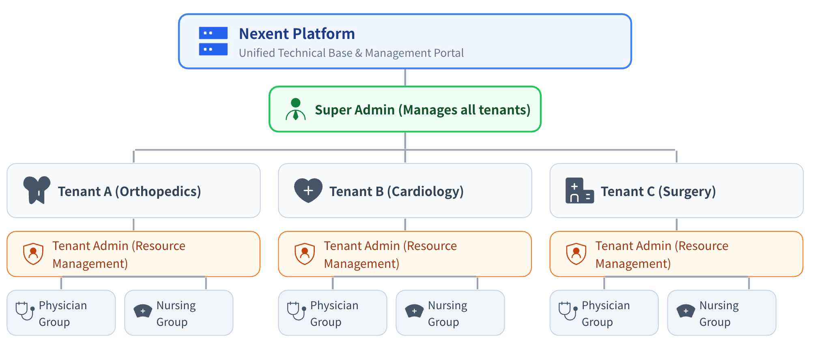
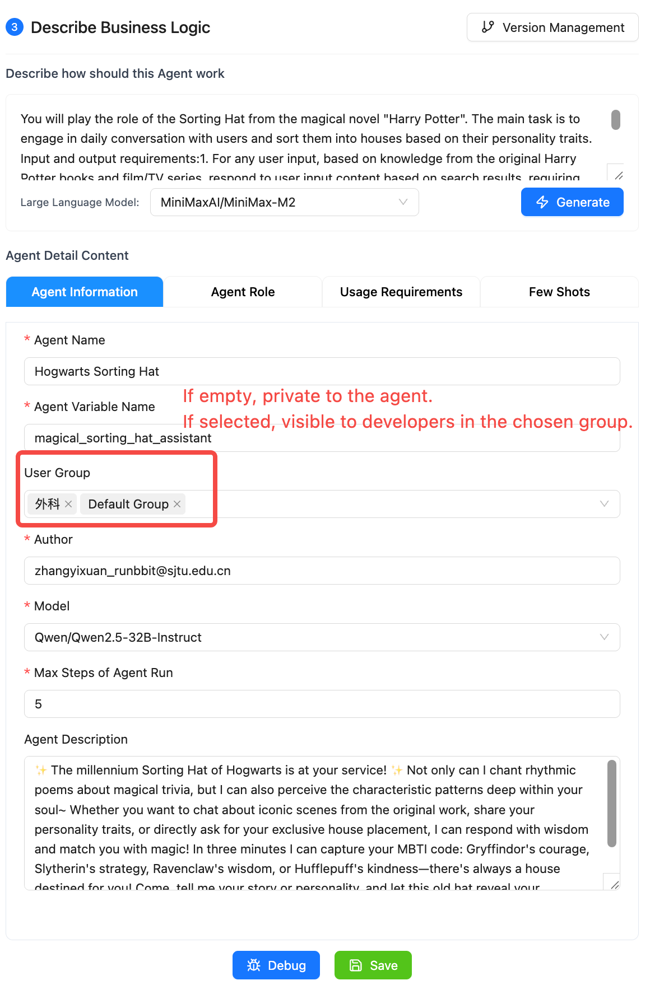
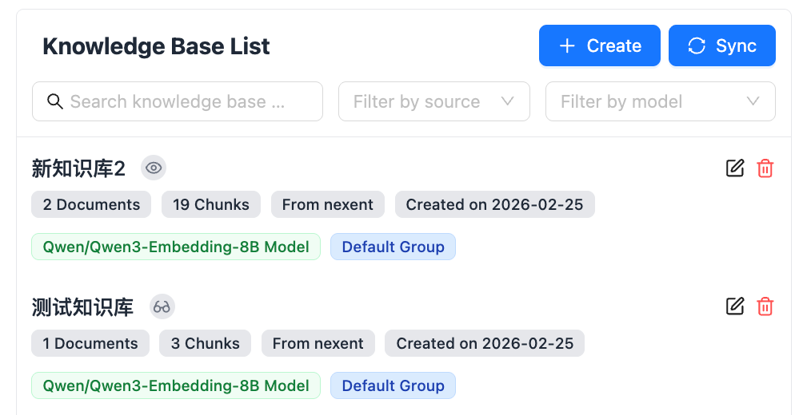
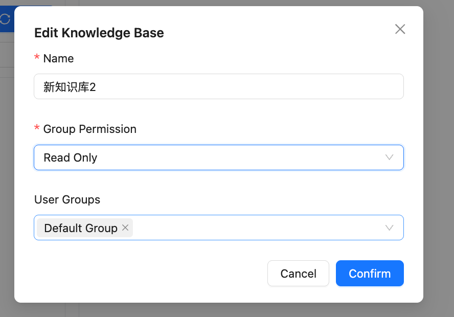
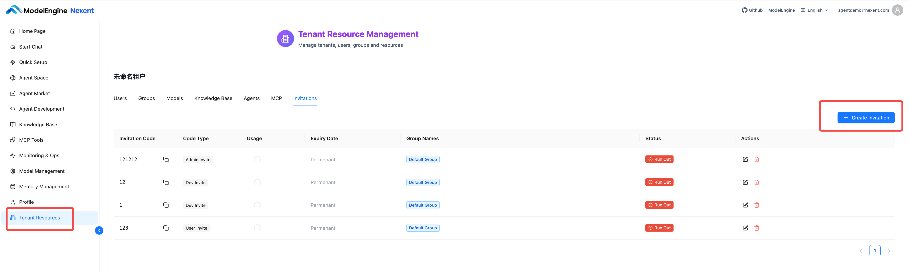
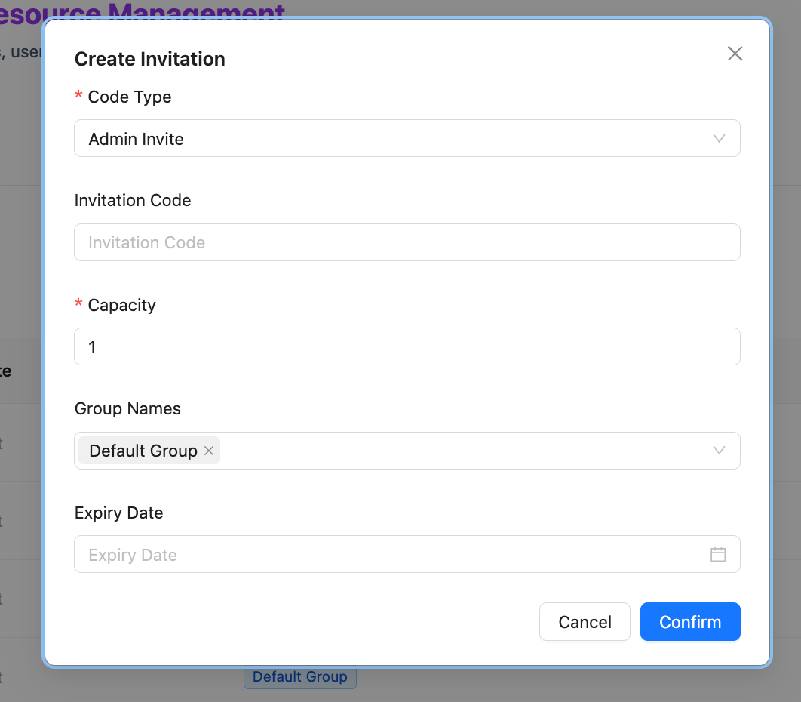

# User Management

This page provides a detailed explanation of the Nexent platform's user role system, data visibility scope, operation permissions for various resources, and practical examples of permission configuration.

## 📋 Page Navigation

- [I. Role System](#i-role-system) - Definitions and responsibilities of four core roles
- [II. Tab Access Permissions](#ii-tab-access-permissions) - System pages accessible to each role
- [III. Resource Permission Comparison](#iii-resource-permission-comparison) - Detailed operation permissions for various resources
- [IV. Permission Configuration](#iv-permission-configuration) - Permission management for agents and knowledge bases
- [V. Invitation Code Mechanism](#v-invitation-code-mechanism) - User registration and invitation process
- [VI. Practical Examples](#vi-practical-examples) - Recommendations for permission configuration

## I. Role System

Nexent adopts a Role-Based Access Control (RBAC) model, dividing user scope through the concepts of tenants and user groups:

### 1.1 What is a Tenant?

- A **Tenant** is the top-level resource isolation unit in the Nexent platform, which can be understood as an independent workspace or organizational unit

- Data between different tenants is completely isolated and invisible to each other. Each tenant can independently create agents, knowledge bases, models, MCPs, etc.

- Only the Super Administrator can manage permissions across tenants and invite tenant administrators

### 1.2 What is a User Group?

- A **User Group** is a collection of users within a tenant. User management and permission control can be achieved through user group division
- A user can belong to multiple user groups
- The visibility of resources such as knowledge bases and agents within a tenant is controlled through user groups

### 1.3 User Roles

Includes the following four core roles:

| Role | Responsibility Description | Applicable Scenarios | Role Notes |
| ---- | -------------------------- | -------------------- | ---------- |
| **Super Administrator** | Can create **different tenants** and manage all tenant resources | Platform operation and maintenance personnel | There is only one Super Administrator in the Nexent system. Account credentials are generated during local deployment. Please keep them safe as they cannot be retrieved after logs are cleared |
| **Administrator** | Responsible for **intra-tenant** resource management and permission allocation | Department managers, tenant leaders | A tenant can have multiple administrators, who can only be invited by the Super Administrator |
| **Developer** | Can create and edit agents, knowledge bases, and other resources, but has no management permissions | Developers, product managers | A tenant can have multiple developers who can belong to multiple user groups within the tenant, invited by administrators and the Super Administrator |
| **Regular User** | Can only use platform features without creation and editing permissions | Employees, business personnel | A tenant can have multiple regular users who can belong to multiple user groups within the tenant, invited by administrators and the Super Administrator |

#### 1.3.1 Super Administrator

The Super Administrator is responsible for the overall operation and maintenance of the platform. They can create tenants and participate in user permission management within each tenant, but cannot use agents.

- ✅ Can manage personnel and permissions for all tenants
- ✅ Can view platform-wide monitoring and operation data
- ❌ Cannot directly view specific business data (such as agent conversation content, knowledge base documents, etc.)
- ❌ Cannot create and use agents, knowledge bases, etc.

#### 1.3.2 Administrator

The Administrator is the highest permission role within a tenant, responsible for resource management and user management within the tenant, with full platform functionality.

- ✅ Can manage all users and user groups within the tenant
- ✅ Can view and edit all agents, knowledge bases, and MCPs within the tenant
- ❌ Cannot access data from other tenants

#### 1.3.3 Developer

The Developer is a technical role within a tenant, responsible for creating and optimizing technical resources such as agents and knowledge bases.

- ✅ Can create agents and knowledge bases and set permissions
- ⚠️ For resources created by others, authorization is required to edit
- ❌ Cannot manage users and user groups within the tenant

#### 1.3.4 Regular User

Regular Users only have permission to use agents for conversations.

- ✅ Can use authorized agents for conversations
- ✅ Can view their own usage records and personal information
- ❌ Cannot create or edit agents, knowledge bases

## II. Tab Access Permissions

| Tab | Super Administrator | Administrator | Developer | Regular User |
| --- | :-----------------: | :-----------: | :-------: | :----------: |
| **Home** | ✅ | ✅ | ✅ | ✅ |
| **Start Chat** | ❌ | ✅ | ✅ | ✅ |
| **Quick Setup** | ❌ | ✅ | ✅ | ✅ |
| **Agent Space** | ❌ | ✅ | ✅ | ❌ |
| **Agent Market** | ❌ | ✅ | ✅ | ❌ |
| **Agent Development** | ❌ | ✅ | ✅ | ❌ |
| **Knowledge Base** | ❌ | ✅ | ✅ | ❌ |
| **MCP Tools** | ❌ | ✅ | ✅ | ❌ |
| **Monitoring** | ✅ | ✅ | ✅ | ❌ |
| **Model Management** | ❌ | ✅ | ✅ | ❌ |
| **Memory Management** | ❌ | ✅ | ✅ | ✅ |
| **Personal Information** | ❌ | ✅ | ✅ | ✅ |
| **Tenant Resources** | ✅ | ✅ | ❌ | ❌ |

## III. Resource Permission Comparison

The following tables show the operation permissions of four roles for various types of resources. Among them:

- **Super Administrator**: Can manage resources for all tenants (cross-tenant)
- **Administrator/Developer/Regular User**: Can only operate resources within their own tenant

### 3.1 User and User Group Permissions

| Operation | Super Administrator | Administrator | Developer | Regular User |
| --------- | :-----------------: | :-----------: | :-------: | :----------: |
| **View Tenant List** | ✅ | ❌ | ❌ | ❌ |
| **Create/Delete Tenant** | ✅ | ❌ | ❌ | ❌ |
| **View User List** | ✅ | ✅ | ❌ | ❌ |
| **Edit User Permissions** | ✅ | ✅ | ❌ | ❌ |
| **Delete User** | ✅ | ✅ | ❌ | ❌ |
| **Assign User Group** | ✅ | ✅ | ❌ | ❌ |
| **View User Group List** | ✅ | ✅ | ❌ | ❌ |
| **Create User Group** | ✅ | ✅ | ❌ | ❌ |
| **Edit User Group** | ✅ | ✅ | ❌ | ❌ |
| **Delete User Group** | ✅ | ✅ | ❌ | ❌ |

### 3.2 Model Permissions

| Operation | Super Administrator | Administrator | Developer | Regular User |
| --------- | :-----------------: | :-----------: | :-------: | :----------: |
| **View Model List** | ✅ | ✅ | ✅ | ❌ |
| **Add Model** | ✅ | ✅ | ❌ | ❌ |
| **Edit Model** | ✅ | ✅ | ❌ | ❌ |
| **Delete Model** | ✅ | ✅ | ❌ | ❌ |
| **Test Connectivity** | ✅ | ✅ | ✅ | ❌ |
| **Use Model** | ❌ | ✅ | ✅ | ✅ |

> 💡 **Note**: Models are tenant-level shared resources. All user groups within the same tenant share the same model pool, with no group-level isolation. Administrators uniformly manage model configurations, while developers and regular users can only use configured models.

### 3.3 Knowledge Base Permissions

| Operation | Super Administrator | Administrator | Developer | Regular User |
| --------- | :-----------------: | :-----------: | :-------: | :----------: |
| **View Knowledge Base List** | ✅ | ✅ | 🟡 Self-created/Authorized | ❌ |
| **View Knowledge Base Details** | ❌ | ✅ | 🟡 Self-created/Authorized | ❌ |
| **View Knowledge Base Summary** | ✅ | ✅ | 🟡 Self-created/Authorized | ❌ |
| **Create Knowledge Base** | ❌ | ✅ | ✅ | ❌ |
| **Edit Knowledge Base Name and Permissions** | ✅ | ✅ | 🟡 Self-created/Authorized | ❌ |
| **Edit Knowledge Base Chunks and Summary** | ❌ | ✅ | 🟡 Self-created/Authorized | ❌ |
| **Delete Knowledge Base** | ✅ | ✅ | 🟡 Self-created/Authorized | ❌ |
| **Upload/Delete Files** | ❌ | ✅ | 🟡 Self-created/Authorized | ❌ |

### 3.4 Agent Permissions

| Operation | Super Administrator | Administrator | Developer | Regular User |
| --------- | :-----------------: | :-----------: | :-------: | :----------: |
| **View Agent List** | ✅ | ✅ | 🟡 Self-created/Authorized | 🟡 Authorized Published Agents |
| **View Agent Info** | ✅ | ✅ | 🟡 Self-created/Authorized | ❌ |
| **Edit Agent Config** | ❌ | ✅ | 🟡 Self-created/Authorized | ❌ |
| **Manage Agent Versions** | ✅ | ✅ | 🟡 Self-created/Authorized | ❌ |
| **Delete Agent** | ✅ | ✅ | 🟡 Self-created/Authorized | ❌ |
| **Use Agent Chat** | ❌ | ✅ | 🟡 Self-created/Authorized | 🟡 Authorized Published Agents |

### 3.5 MCP Permissions

| Operation | Super Administrator | Administrator | Developer | Regular User |
| --------- | :-----------------: | :-----------: | :-------: | :----------: |
| **View MCP Tools** | ✅ | ✅ | ✅ | ❌ |
| **Edit MCP Tools** | ✅ | ✅ | ❌ | ❌ |
| **Add MCP Tools** | ✅ | ✅ | ✅ | ❌ |
| **Delete MCP Tools** | ✅ | ✅ | ❌ | ❌ |

> 💡 **Note**: MCP tools are tenant-level shared resources. All user groups within the same tenant share the same MCP tools, with no group-level isolation. Administrators can add and manage MCP tools, while developers can only add MCP tools.

## IV. Permission Configuration

### 4.1 Agent Permission Settings

| Permission Level | Description | Applicable Scenario |
| ---------------- | ----------- | ------------------- |
| **Creator Only** | Only the creator (and administrators) can view and edit | Personal development agents |
| **Specified User Group - Read Only** | User groups specified in the agent development page can view and publish, but cannot edit or delete. | Department-specific agents |

  

### 4.2 Knowledge Base Permission Settings

| Permission Level | Description | Applicable Scenario |
| ---------------- | ----------- | ------------------- |
| **Private** | Only the creator (and administrators) can view and manage | Personal knowledge base |
| **Specified User Group - Read Only** | Specified user groups can view but cannot edit or delete | Department knowledge base |
| **Specified User Group - Editable** | Specified user groups can view and edit, delete | Project team knowledge base |

  
  

## V. Invitation Code Mechanism

Nexent platform uses an invitation code mechanism to control new user registration, ensuring platform security and controllability.

### 5.1 Generating Invitation Codes

- Super Administrators can go to "Tenant Resources" → "Select Tenant" → "Invitation Code"
- Administrators can go directly through "Tenant Resources" → "Invitation Code"
- Click "Create Invitation Code"
- Configure parameters: invitation type (Administrator, Developer, User), invitation code, number of uses, user groups to join, expiration time
- Copy the invitation code and distribute it to relevant personnel

  

## VI. Practical Examples

This section uses **XX City People's Hospital - Orthopedics Department** as an example to demonstrate how to build a single-department medical intelligent assistant system on the Nexent platform, as well as the workflow of each role in the system.

### 6.1 Overall Architecture Design

#### 6.1.1 Architecture Level Correspondence

In the scenario of XX City People's Hospital, the correspondence between Nexent platform levels and hospital entities is as follows:

| Level | Corresponding Entity | Description |
| ----- | -------------------- | ----------- |
| **Super Administrator** | Hospital Information Center/System Administrator | Manages multiple departments (multiple tenants) of the entire hospital |
| **Single Tenant** | Single Department | Such as: Orthopedics, Cardiology, Surgery |
| **User Groups within Tenant** | Professional groups within the department | Such as: Orthopedics Physician Group, Nursing Group, Rehabilitation Group |
| **Members within User Groups** | Specific medical staff/patients | Such as: Chief Physician of Orthopedics, Charge Nurse, Inpatient |

#### 6.1.2 Definition and Responsibilities of Each Role

| Role | Corresponding Personnel in Orthopedics Tenant | Core Responsibilities | Data Visibility Scope |
| ---- | --------------------------------------------- | --------------------- | --------------------- |
| **Super Administrator** | Hospital Information Center Administrator | Manages multiple tenants of hospital departments (Orthopedics, Cardiology, Surgery, etc.) | Data of all tenants in the hospital |
| **Administrator** | Chief of Orthopedics | Manages all resources within the Orthopedics tenant (users, agents, knowledge bases, etc.) | All data of this department (this tenant) |
| **Developer** | Chief Physicians and Associate Chief Physicians of Orthopedics Sub-specialties | Creates and edits clinical auxiliary agents, uploads professional materials to knowledge bases | Resources authorized within this department; self-created resources are manageable |
| **Regular User** | Resident Physicians, Nurses, Patients | Uses published agents for work assistance, information queries, health education | Resources authorized for use within this department; view-only, no editing |

### 6.2 Example User Work Scenarios

#### Scenario 1: Hospital Information Center Administrator (Super Administrator Role)

- **User Identity**: Hospital Information Center - System Administrator - Engineer Zhang
- **Role**: Super Administrator
- **Work Requirement**: Manage Nexent platform tenants for all departments of XX City People's Hospital, ensuring normal operation of systems in each department
- **Operation Process in Nexent Platform**:
  1. **Login to System**: Log in to Nexent platform with Super Administrator account
  2. **View Tenant List**: Go to the "Tenant Resources" tab to view tenants of all hospital departments:
     - Orthopedics Tenant
     - Cardiology Tenant
     - Surgery Tenant
     - Pediatrics Tenant
     - ... (other department tenants)
  3. **Create New Tenant** (e.g., hospital newly opened Rehabilitation Department):
     - Click "Create Tenant"
     - Fill in tenant name: "XX City People's Hospital - Rehabilitation Department"
     - Invite the Chief of Rehabilitation Department as the tenant administrator

#### Scenario 2: Chief of Orthopedics (Tenant Administrator Role)

- **User Identity**: Orthopedics - Management - Chief of Orthopedics - Director Liu
- **Role**: Administrator
- **Work Requirement**: Manage all resources within the Orthopedics tenant, create accounts and configure permissions for newly hired spine surgeons
- **Operation Process in Nexent Platform**:
  1. **Login to System**: Log in to Nexent platform with Administrator account
  2. **Enter User Management**: Click the "User Management" tab
  3. **Create New User**:
     - Click "Create Invitation Code", configure the group and developer permissions for this doctor
  4. **Assign User Groups**:
     - This doctor also needs to join the subsequently created "Spine Surgery New Group" user group, enter "User Management" to edit
  5. **Check Agent Permissions**:
     - Enter "Agent Space" to view all existing agents in Orthopedics
     - Check if the permission settings for "Spine CT Image Analysis Assistant" are correct (visible and editable to the Spine Surgery Group)
  6. **Manage Knowledge Base**:
     - Enter the "Knowledge Base" tab to check the content update status of the Orthopedics knowledge base
     - Approve new materials submitted by doctors (such as new surgical cases, research literature, etc.)

#### Scenario 3: Chief Physician of Spine Surgery (Developer Role)

- **User Identity**: Orthopedics - Spine Surgery Group - Chief Physician - Dr. Wang
- **Role**: Developer
- **Work Requirement**: Need an intelligent assistant to help analyze spine CT images and provide surgical plan recommendations
- **Operation Process in Nexent Platform**:
  1. **Login to System**: Register account and password with the hospital-assigned invitation code and log in to the corresponding development group
  2. **Enter Agent Development**: Click the "Agent Development" tab
  3. **Create New Agent**: Click "Create Agent", name it "Spine CT Image Analysis Assistant"
  4. **Configure Agent Capabilities**:
     - Select "Medical Image Analysis Model" as the base model
     - Associate "Spine Surgery Knowledge Base" as the knowledge source
     - Configure prompts to train the agent to identify disc herniation, scoliosis and other lesions
  5. **Set Permissions**:
     - Visible User Groups: Select "Spine Surgery Group"
     - Permission Level: Select "Editable" (allows doctors in the same department to modify and optimize)
  6. **Publish Agent**: Click "Publish", the agent is officially put into use
- **Accessible Data**:
  - ✅ Self-created "Spine CT Image Analysis Assistant" agent (editable, version manageable)
  - ✅ Other agents authorized for use (such as "Orthopedics Medication Assistant") (view-only)
  - ✅ Orthopedics-related knowledge bases (queryable, some can upload materials)
  - ❌ Data from other tenants (such as Cardiology) (completely isolated)

#### Scenario 4: Orthopedics Inpatient (Regular User Role)

- **User Identity**: Orthopedics - Inpatient Group - Inpatient - Mr. Zhang
- **Role**: Regular User
- **Work Requirement**: After lumbar disc surgery, wants to understand rehabilitation training methods and post-discharge precautions
- **Operation Process in Nexent Platform**:
  1. **Login to System**: Log in to the Nexent platform patient portal
  2. **Enter Patient Services**: Click the "Start Chat" tab
  3. **Select Agent**: Click "Orthopedics Rehabilitation Assistant"
  4. **Initiate Consultation**:
     - Input question: "Day 3 after lumbar disc surgery, what rehabilitation training can I do?"
     - The agent provides rehabilitation movement videos and guidance suitable for early postoperative period based on the Orthopedics Rehabilitation knowledge base
  5. **Schedule Follow-up**: Schedule a one-month post-discharge outpatient follow-up through the agent
- **Accessible Data**:
  - ✅ "Orthopedics Rehabilitation Assistant" agent (view-only)
  - ❌ Doctor's diagnostic system (no permission)
  - ❌ Other patients' data (completely isolated)

## 💡 Get Help

If you encounter any issues while using the platform:

- 📖 Check the **[FAQ](../quick-start/faq)** for detailed answers
- 💬 Join our [Discord community](https://discord.gg/tb5H3S3wyv) to connect with other users
