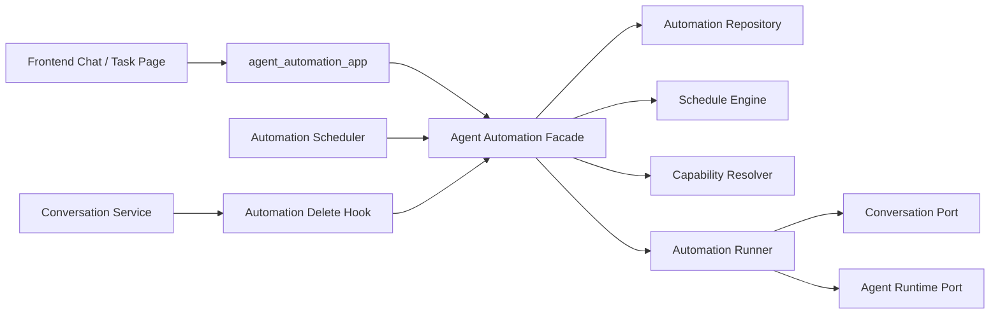
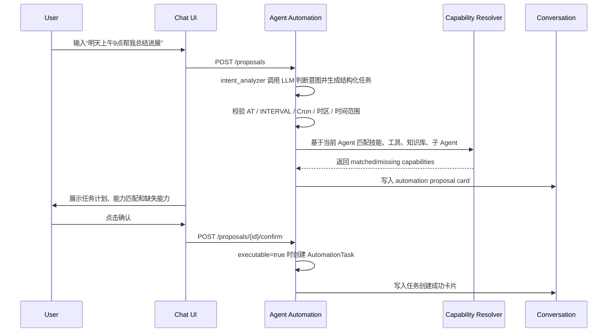
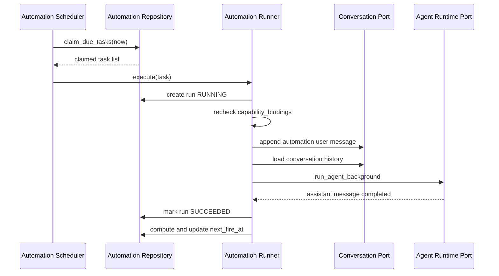

# 智能体自动化任务设计文档

## 1. 背景与目标

Nexent 需要支持用户在自然语言对话中为当前选择的智能体创建自动化任务，任务管理页面只负责管理，不提供脱离会话的手工创建入口。任务可以是一次性执行，也可以是周期性执行。每个任务唯一绑定创建它的会话；创建时生成并确认稳定的标题和单次执行指令，后续每次触发原样复用该指令，用户可以在同一会话中持续查看历史结果。

本设计的核心目标：

- 自动化任务作为相对独立的业务模块建设，避免把调度、运行记录、触发规则分散到 Agent、Conversation、Frontend 组件里。
- 一次性任务和周期性任务使用同一套 `ScheduleTrigger` 抽象、同一套任务表、同一套运行表和同一套执行链路。
- 保持和现有 Nexent 会话模型一致：任务绑定 conversation，删除 conversation 时同步删除任务；删除任务时不删除 conversation。
- 后台执行复用现有智能体运行能力，但不伪造浏览器 SSE 请求。
- 可支持多实例部署下的抢占、锁、恢复、超时和失败可观测。

参考设计来源：

- OpenClaw：独立 cron service、持久化 job/run、锁、启动恢复、超时与失败日志。参考 [OpenClaw cron schema](https://github.com/openclaw/openclaw/blob/7e0324263b867d3d47138d1d2b1e9afd1dd2016f/packages/gateway-protocol/src/schema/cron.ts) 和 [OpenClaw cron jobs](https://docs.openclaw.ai/automation/cron-jobs)。
- LangGraph/LangSmith：cron job 可以绑定 thread，也可以每次创建新 thread。Nexent v1 选择 thread-bound 的 conversation-bound 模式。参考 [LangSmith cron jobs](https://docs.langchain.com/langsmith/cron-jobs)。
- n8n：Schedule Trigger 明确区分启用状态、时区、固定时间、间隔和 cron 表达式。参考 [n8n Schedule Trigger](https://docs.n8n.io/integrations/builtin/core-nodes/n8n-nodes-base.scheduletrigger/)。
- Codex 产品形态：用户可在对话中创建自动任务，有独立页面管理任务；一个自动任务对应一个会话，每次执行都在该会话内继续追加任务执行提示词。

## 2. 模块边界

新增模块命名为 Agent Automation，后端目录建议如下：

```text
backend/apps/agent_automation_app.py
backend/services/agent_automation/
  __init__.py
  facade.py
  models.py
  repository.py
  schedule_engine.py
  scheduler.py
  runner.py
  intent_parser.py
  capability_resolver.py
  errors.py
backend/database/agent_automation_db.py
```

模块职责：

| 子模块 | 职责 |
| --- | --- |
| `agent_automation_app.py` | HTTP 边界，解析请求、调用 facade、映射异常 |
| `facade.py` | 对外唯一服务入口，屏蔽内部 repository、scheduler、runner |
| `models.py` | 自动化任务领域 DTO、枚举、校验模型 |
| `repository.py` / `agent_automation_db.py` | 自动化任务与运行记录的数据库访问 |
| `schedule_engine.py` | 统一计算一次性与周期性任务的下一次触发时间 |
| `scheduler.py` | 后台轮询、抢占到期任务、lease 续期、恢复异常运行 |
| `runner.py` | 把一次触发转换成会话消息，并调用后台智能体执行入口 |
| `intent_analyzer.py` | 使用当前选择的 LLM 判断自动任务意图，并结构化生成标题、单次指令和调度配置 |
| `intent_parser.py` | 确定性时间解析与 LLM 不可用时的降级策略 |
| `capability_resolver.py` | 基于 Nexent 现有 Agent 配置匹配可用技能、工具、知识库、子 Agent 和 A2A Agent |

与现有模块的依赖方向：



解耦约束：

- Agent Automation 可以调用 Conversation 和 Agent Runtime 暴露的端口；Conversation 和 Agent Runtime 不能直接读取自动任务表。
- Conversation 模块只在删除会话时调用 `AgentAutomationFacade.on_conversation_deleted(conversation_id, user_id)`。
- Agent Runtime 只新增后台执行端口，不感知任务表和调度规则。
- Frontend 使用独立 `agentAutomationService` 访问任务接口，不把任务 CRUD 混入 `conversationService`。
- SDK 不读取环境变量，不新增调度逻辑；自动化任务是 Nexent backend runtime 能力。
- 自然语言只生成“任务提案”，不能绕过 Nexent 当前 Agent 的技能/工具选择机制直接创建可执行任务。
- 自动化任务保存创建时的能力快照，但每次运行仍通过 Agent Runtime 装配真实工具实例；快照用于校验、提示和审计，不复制工具执行逻辑。

需要新增的端口：

| 端口 | 建议函数 | 实现位置 |
| --- | --- | --- |
| Conversation Port | `append_automation_user_message`、`get_conversation_history_for_task`、`mark_conversation_task_deleted` | 复用 `conversation_management_service` 与 `conversation_db` |
| Agent Runtime Port | `run_agent_background(agent_request, runtime_context)` | 从 `agent_service.run_agent_stream` 抽出公共 runner |
| Automation Delete Hook | `on_conversation_deleted(conversation_id, user_id)` | `agent_automation.facade` |
| Agent Capability Port | `resolve_agent_capabilities(agent_id, tenant_id, user_id, version_no)` | 复用 `create_agent_config`、`SkillService.get_enabled_skills_for_agent`、`search_tools_for_sub_agent` |
| Prompt Strategy Port | `generate_task_content(context)` | `agent_automation.prompt_generator`，在创建阶段一次性生成标题和执行指令 |

## 3. 领域模型

### 3.1 自动化任务

一个自动化任务描述“谁、在哪个会话、用哪个智能体、按什么触发规则、执行什么指令”。

```text
AutomationTask
  task_id
  tenant_id
  user_id
  conversation_id
  agent_id
  agent_version_no
  title
  instruction
  status
  source
  schedule_trigger
  capability_requirements
  capability_bindings
  execution_policy
  runtime_snapshot
  next_fire_at
  last_fire_at
  last_run_status
  last_error
  consecutive_failures
```

任务状态：

| 状态 | 含义 |
| --- | --- |
| `DRAFT` | 对话识别出任务意图后生成提案，等待确认 |
| `ACTIVE` | 已启用，调度器可触发 |
| `PAUSED` | 用户暂停 |
| `PAUSED_BY_SYSTEM` | 连续失败、Agent 不可用、权限失效等原因被系统暂停 |
| `COMPLETED` | 一次性任务执行成功且不再触发 |
| `DELETED` | 软删除 |

任务来源：

| 来源 | 含义 |
| --- | --- |
| `CHAT_INTENT` | 用户在对话中用自然语言创建 |

### 3.2 能力匹配模型

Nexent 的自动化任务不能只保存一句自然语言指令。任务必须明确“执行这件事依赖当前 Agent 的哪些能力”，否则到点后 Agent 可能缺少对应技能、工具或知识库，导致任务只是形式上被创建，实际不可执行。

因此自然语言创建任务分为两层：

1. `IntentParser`：识别用户是否在创建自动任务，并抽取任务目标、时间、频率、输出要求。
2. `CapabilityResolver`：基于当前 Agent 的可用能力判断任务是否可执行，并生成待确认的能力绑定。

能力来源以现有 Nexent 装配链路为准：

| 能力类型 | 当前来源 | 用途 |
| --- | --- | --- |
| `TOOL` | `create_tool_config_list` / `search_tools_for_sub_agent` | 搜索、文件、终端、多模态、MCP 工具等 |
| `SKILL` | `SkillService.get_enabled_skills_for_agent` | 已启用技能及其说明、脚本、配置 |
| `KNOWLEDGE_BASE` | `KnowledgeBaseSearchTool` 的 `index_names` 和 metadata | 需要检索指定知识库的任务 |
| `MANAGED_AGENT` | `query_sub_agent_relations` + `create_agent_config` | 主 Agent 可调度的内部子 Agent |
| `EXTERNAL_A2A_AGENT` | `_get_external_a2a_agents` | 外部 A2A Agent 能力 |
| `MEMORY` | `build_memory_context` 与记忆工具 | 需要长期记忆上下文的任务 |

能力需求结构：

```json
{
  "required": [
    {
      "type": "KNOWLEDGE_BASE",
      "name": "销售线索知识库",
      "reason": "任务要求每天总结新增销售线索",
      "match_status": "MATCHED"
    },
    {
      "type": "TOOL",
      "name": "linkup_search",
      "reason": "任务要求检索公开网页信息",
      "match_status": "MISSING"
    }
  ],
  "optional": [
    {
      "type": "SKILL",
      "name": "report-writing",
      "reason": "可用于结构化生成日报",
      "match_status": "MATCHED"
    }
  ]
}
```

能力绑定结构：

```json
{
  "agent": {
    "agent_id": 456,
    "version_no": 3,
    "name": "销售助手"
  },
  "matched_capabilities": [
    {
      "type": "KNOWLEDGE_BASE",
      "name": "sales_leads",
      "display_name": "销售线索知识库",
      "binding_ref": "tool:KnowledgeBaseSearchTool:index:sales_leads"
    },
    {
      "type": "SKILL",
      "name": "report-writing",
      "binding_ref": "skill:report-writing"
    }
  ],
  "missing_capabilities": [
    {
      "type": "TOOL",
      "name": "linkup_search",
      "suggestion": "请先在该 Agent 中启用联网搜索工具，或删除任务中的公开网页检索要求"
    }
  ],
  "executable": false
}
```

创建规则：

- `executable=false` 时不能确认创建 `ACTIVE` 任务，只能保存为 `DRAFT` 提案并提示用户补齐 Agent 能力。
- 用户可以选择“修改任务要求”，让任务只使用已匹配能力。
- 用户也可以跳转到 Agent 配置页启用工具、技能或知识库，回来后重新执行能力匹配。
- `executable=true` 时才允许确认创建 `ACTIVE` 任务。
- 任务确认时保存 `capability_requirements`、`capability_bindings` 和 `runtime_snapshot`，用于后续审计和运行前校验。
- 每次执行前重新校验绑定能力是否仍可用；如果能力缺失，本次 run 记为 `FAILED`，错误码为 `AUTOMATION_CAPABILITY_UNAVAILABLE`，连续失败达到阈值后任务进入 `PAUSED_BY_SYSTEM`。

### 3.3 统一 ScheduleTrigger

一次性任务和周期性任务都使用 `ScheduleTrigger`，差异只体现在 `mode` 与 `rule_type`。

```json
{
  "mode": "ONCE",
  "rule_type": "AT",
  "timezone": "Asia/Shanghai",
  "start_at": "2026-07-09T09:00:00+08:00",
  "end_at": null,
  "cron_expr": null,
  "interval_seconds": null,
  "max_fire_count": 1
}
```

```json
{
  "mode": "RECURRING",
  "rule_type": "CRON",
  "timezone": "Asia/Shanghai",
  "start_at": "2026-07-08T00:00:00+08:00",
  "end_at": null,
  "cron_expr": "0 9 * * *",
  "interval_seconds": null,
  "max_fire_count": null
}
```

字段规则：

| 字段 | 说明 |
| --- | --- |
| `mode` | `ONCE` 或 `RECURRING` |
| `rule_type` | `AT`、`INTERVAL`、`CRON` |
| `timezone` | 用户选择的 IANA 时区，默认浏览器时区 |
| `start_at` | 首次可触发时间；一次性任务即执行时间 |
| `end_at` | 周期性任务截止时间，可为空 |
| `cron_expr` | `rule_type=CRON` 时必填 |
| `interval_seconds` | `rule_type=INTERVAL` 时必填 |
| `max_fire_count` | 一次性任务固定为 1；周期性任务可为空或指定最大次数 |

合法组合：

| mode | rule_type | 使用场景 |
| --- | --- | --- |
| `ONCE` | `AT` | 指定时间执行一次 |
| `RECURRING` | `INTERVAL` | 每 N 分钟/小时/天执行 |
| `RECURRING` | `CRON` | 每天 9 点、每周一 10 点等日历规则 |

v1 不支持的组合：

- `ONCE + INTERVAL`
- `ONCE + CRON`
- `RECURRING + AT`

`ScheduleEngine` 对外只提供统一方法：

```python
def compute_next_fire_at(
    trigger: ScheduleTrigger,
    after: datetime,
    fire_count: int,
) -> datetime | None:
    ...
```

返回 `None` 表示任务不再触发：

- 一次性任务已经执行过；
- 达到 `max_fire_count`；
- 下一次时间超过 `end_at`。

### 3.4 运行记录

每次触发生成一条运行记录。

```text
AutomationRun
  run_id
  task_id
  tenant_id
  user_id
  conversation_id
  scheduled_fire_at
  actual_fire_at
  trigger_type
  status
  generated_prompt
  user_message_id
  assistant_message_id
  started_at
  finished_at
  duration_ms
  error_code
  error_message
```

运行状态：

| 状态 | 含义 |
| --- | --- |
| `QUEUED` | 已抢占，等待执行 |
| `RUNNING` | 正在执行 |
| `SUCCEEDED` | 执行成功 |
| `FAILED` | 执行失败 |
| `SKIPPED` | 因 overlap、任务过期等策略跳过 |
| `CANCELED` | 用户或会话删除导致取消 |
| `TIMEOUT` | 超时中止 |

## 4. 数据库设计

新增表 `agent_automation_task_t`：

| 字段 | 类型 | 说明 |
| --- | --- | --- |
| `task_id` | BIGSERIAL PK | 任务 ID |
| `tenant_id` | VARCHAR(100) | 租户 |
| `user_id` | VARCHAR(100) | 所属用户 |
| `conversation_id` | BIGINT NOT NULL | 绑定会话 |
| `agent_id` | BIGINT NOT NULL | 绑定智能体 |
| `agent_version_no` | VARCHAR(100) NULL | 创建时版本，可为空表示使用当前版本 |
| `title` | VARCHAR(255) | 任务名 |
| `instruction` | TEXT | 每次执行的基础指令 |
| `status` | VARCHAR(32) | 任务状态 |
| `source` | VARCHAR(32) | 来源 |
| `schedule_mode` | VARCHAR(16) | `ONCE` / `RECURRING` |
| `schedule_rule_type` | VARCHAR(16) | `AT` / `INTERVAL` / `CRON` |
| `schedule_expr` | TEXT NULL | cron 表达式或 interval 表达式的展示值 |
| `schedule_config` | JSONB | 完整 `ScheduleTrigger` |
| `capability_requirements` | JSONB | 从自然语言或表单解析出的能力需求 |
| `capability_bindings` | JSONB | 用户确认时匹配到的技能、工具、知识库、子 Agent |
| `runtime_snapshot` | JSONB | 创建时 Agent 名称、版本、模型、能力摘要，用于审计和变更提示 |
| `timezone` | VARCHAR(64) | IANA 时区 |
| `next_fire_at` | TIMESTAMPTZ NULL | 下次触发时间 |
| `last_fire_at` | TIMESTAMPTZ NULL | 上次触发时间 |
| `fire_count` | INT DEFAULT 0 | 已触发次数 |
| `last_run_status` | VARCHAR(32) NULL | 最近运行状态 |
| `last_error` | TEXT NULL | 最近错误 |
| `consecutive_failures` | INT DEFAULT 0 | 连续失败次数 |
| `timeout_seconds` | INT | 单次运行超时 |
| `overlap_policy` | VARCHAR(16) | v1 固定 `SKIP` |
| `misfire_policy` | VARCHAR(16) | v1 固定 `RUN_ONCE` |
| `lock_owner` | VARCHAR(128) NULL | 调度抢占 owner |
| `lock_until` | TIMESTAMPTZ NULL | lease 过期时间 |
| `created_by` / `updated_by` / `delete_flag` | 复用现有审计字段 | 软删除与审计 |

索引：

```sql
CREATE INDEX idx_agent_automation_due
ON agent_automation_task_t (status, next_fire_at)
WHERE delete_flag = 'N';

CREATE INDEX idx_agent_automation_owner
ON agent_automation_task_t (tenant_id, user_id, status)
WHERE delete_flag = 'N';

CREATE UNIQUE INDEX uq_agent_automation_conversation_active
ON agent_automation_task_t (conversation_id)
WHERE delete_flag = 'N' AND status <> 'DELETED';
```

新增表 `agent_automation_run_t`：

| 字段 | 类型 | 说明 |
| --- | --- | --- |
| `run_id` | BIGSERIAL PK | 运行 ID |
| `task_id` | BIGINT NOT NULL | 任务 ID |
| `tenant_id` | VARCHAR(100) | 租户 |
| `user_id` | VARCHAR(100) | 用户 |
| `conversation_id` | BIGINT NOT NULL | 会话 |
| `scheduled_fire_at` | TIMESTAMPTZ | 计划触发时间 |
| `actual_fire_at` | TIMESTAMPTZ | 实际触发时间 |
| `trigger_type` | VARCHAR(32) | `SCHEDULED` / `MANUAL` |
| `status` | VARCHAR(32) | 运行状态 |
| `generated_prompt` | TEXT | 本次写入会话的自动提示词 |
| `user_message_id` | BIGINT NULL | 自动 user message |
| `assistant_message_id` | BIGINT NULL | assistant message |
| `started_at` / `finished_at` | TIMESTAMPTZ | 执行时间 |
| `duration_ms` | BIGINT NULL | 耗时 |
| `error_code` | VARCHAR(64) NULL | 错误码 |
| `error_message` | TEXT NULL | 错误详情 |
| `capability_check` | JSONB NULL | 本次运行前能力校验结果 |

新增表 `agent_automation_proposal_t`：

| 字段 | 类型 | 说明 |
| --- | --- | --- |
| `proposal_id` | BIGSERIAL PK | 提案 ID |
| `tenant_id` / `user_id` | VARCHAR(100) | 所属用户 |
| `conversation_id` | BIGINT NOT NULL | 来源会话 |
| `agent_id` | BIGINT NOT NULL | 智能体 |
| `proposed_task` | JSONB | 待确认任务配置 |
| `capability_resolution` | JSONB | 能力匹配结果 |
| `status` | VARCHAR(32) | `PENDING` / `ACCEPTED` / `REJECTED` / `EXPIRED` |
| `expires_at` | TIMESTAMPTZ | 过期时间 |

迁移要求：

- 新增 `deploy/sql/migrations/v2.3.0_0713_add_agent_automation.sql`，并同步更新 `deploy/sql/init.sql` 以覆盖 fresh deploy。
- 同步更新 `deploy/sql/init.sql`。
- 同步更新 `deploy/k8s/helm/nexent/charts/nexent-common/files/init.sql`。
- ORM 模型新增到 `backend/database/db_models.py`，遵循现有 `TableBase` 约定。

## 5. API 设计

所有接口挂到 Runtime API，前缀为 `/agent/automations`。

### 5.1 对话创建提案

```http
POST /agent/automations/proposals
```

请求：

```json
{
  "conversation_id": 123,
  "agent_id": 456,
  "message": "明天上午 9 点帮我总结这个项目的进展",
  "timezone": "Asia/Shanghai"
}
```

`conversation_id` 在已有会话中必填；用户从“新对话”直接输入定时指令时可以省略。后端先做无副作用的意图识别，只有确认属于自动任务意图后才创建新会话，并把用户原始指令和 `automation_proposal` 卡片连续写入该会话。普通聊天消息不会因此创建空会话。

响应：

```json
{
  "proposal_id": 1001,
  "conversation_id": 123,
  "confidence": 0.92,
  "executable": false,
  "task": {
    "title": "总结项目进展",
    "instruction": "总结这个项目的最新进展，并给出风险和下一步建议",
    "schedule_trigger": {
      "mode": "ONCE",
      "rule_type": "AT",
      "timezone": "Asia/Shanghai",
      "start_at": "2026-07-09T09:00:00+08:00",
      "max_fire_count": 1
    }
  },
  "capability_resolution": {
    "matched_capabilities": [
      {
        "type": "KNOWLEDGE_BASE",
        "name": "project_docs",
        "display_name": "项目文档知识库",
        "binding_ref": "tool:KnowledgeBaseSearchTool:index:project_docs"
      }
    ],
    "missing_capabilities": [
      {
        "type": "TOOL",
        "name": "project_management_api",
        "suggestion": "如果需要读取实时项目管理系统，请先为该 Agent 启用对应 MCP 工具；否则可改为仅基于当前会话和知识库总结"
      }
    ],
    "agent_snapshot": {
      "agent_id": 456,
      "version_no": 3,
      "name": "项目助手"
    }
  }
}
```

### 5.2 确认提案

```http
POST /agent/automations/proposals/{proposal_id}/confirm
```

创建提案时即在当前会话依次持久化用户定时指令和 `automation_proposal` message unit；刷新会话后完整的提案交互仍然存在。前端在 Agent 普通执行之前调用提案接口；识别成功后不再把“每周发周报”作为普通查询立即执行一次。确认后创建 `agent_automation_task_t`，并原位更新该 message unit 的 `confirmed_task_id`，避免出现只存在于前端内存的临时卡片。

确认规则：

- 如果 `capability_resolution.executable=false`，接口返回 `AUTOMATION_CAPABILITY_NOT_READY`，前端展示缺失能力和处理建议。
- 用户在确认卡片中选择“仅使用已匹配能力创建”时，前端必须提交修改后的 `instruction`，后端重新解析并匹配能力。
- 用户跳转配置页启用工具、技能或知识库后，需要重新调用 `POST /agent/automations/proposals` 刷新提案，不能复用旧的不可执行提案直接确认。

### 5.3 创建边界

- 不暴露 `POST /agent/automations` 直接创建接口，也不接受脱离聊天消息的任务 DTO。
- 新对话允许 proposal 命令在识别到定时意图后创建绑定会话；这是会话命令的一部分，不是任务管理页的手工创建能力。
- 任务只能由当前会话中的 proposal 确认创建；`conversation_id` 和当前选择的 `agent_id` 在提案阶段确定。
- 创建提案和确认提案时都校验会话归属；如果会话已有未删除任务，返回 `AUTOMATION_CONVERSATION_ALREADY_BOUND`。
- 创建时基于所选 Agent 的名称、职责和能力快照优化基础任务指令，并保存原始意图用于审计。

### 5.4 管理接口

| 接口 | 说明 |
| --- | --- |
| `GET /agent/automations` | 列表，支持状态、关键词、agent、时间范围过滤 |
| `GET /agent/automations/{task_id}` | 任务详情 |
| `PATCH /agent/automations/{task_id}` | 编辑任务配置 |
| `POST /agent/automations/{task_id}/pause` | 暂停 |
| `POST /agent/automations/{task_id}/resume` | 恢复 |
| `POST /agent/automations/{task_id}/run` | 立即运行 |
| `DELETE /agent/automations/{task_id}` | 删除任务，不删除会话 |
| `GET /agent/automations/{task_id}/runs` | 运行历史 |
| `POST /agent/automations/runs/{run_id}/cancel` | 取消运行 |
| `GET /conversation/{conversation_id}/automation` | 查询会话绑定任务 |

## 6. 执行流程

### 6.1 对话内创建任务



自然语言识别规则：

- 消息包含日期、时间、周期、提醒或计划信号时，`IntentAnalyzer` 优先调用当前选择的 LLM；选择模型不可用时使用租户默认 LLM，两者均不可用或模型输出非法时才降级到 `IntentParser`。
- LLM 在一次调用中同时输出 `is_automation_intent`、`title`、`instruction`、`schedule` 和 `schedule_error`，不再为标题和提示词发起第二次模型调用。
- `IntentParser` 作为确定性降级策略，支持固定间隔、相对延迟、明确/短日期、今天/明天/后天、相对月份、工作日/周末、星期范围、多星期、多月日、月底、季度、年度日期和五段 Cron 可表达的日历周期。
- 固定间隔生成 `INTERVAL`；指定一次时间生成 `AT`；每天、每周、每月、每年等日历周期生成标准五段 Cron。
- 同一周期任务可以包含具有相同分钟或相同小时的多个时刻，例如“每天上午 9 点、下午 3 点”生成 `0 9,15 * * *`；无法用单个 Cron 精确表达的多个时刻要求拆分任务，不生成近似规则。
- 用户在文本中明确常见地区时间、UTC 或 IANA 时区时优先使用文本时区，否则使用请求携带的 IANA 时区；一次性任务遇到 DST 不存在或歧义时间时拒绝创建。
- 缺少日期、缺少具体时刻、日期非法或指定时间已过去时，返回明确的 `schedule_error`，不默认猜测为上午 9 点，也不创建 proposal。
- 意图判定同时检查调度语义、业务动作和两者在句子中的修饰关系，不使用“时间词 + 动作词”简单碰撞规则。
- 调度语义位于任务动作之前时识别为创建命令，例如“每天八点获取黄历”和“帮我每天八点分析销量”；动作位于调度短语之前且调度短语属于查询对象时继续走普通任务，例如“分析一下每天八点的销量”。
- 调度短语但没有业务动作的问句、说明句和个人习惯陈述不会被识别为创建命令，例如“每周的销量是多少”“每天八点如何获取黄历”“我每天八点都会查看黄历”。
- LLM 生成的标题和单次指令必须通过语言、长度、调度噪音和编排噪音校验；规则降级路径才调用 `AutomationPromptGenerator` 生成任务内容。
- `CapabilityResolver` 使用最终 `instruction` 调用现有 Agent 能力装配链路，生成 matched/missing capabilities。
- 低置信度或非任务意图不创建 proposal，只让普通 Agent 对话继续。
- 所有对话创建都必须用户确认，不能由模型直接创建 `ACTIVE` 任务。
- 如果缺少必要能力，确认卡片展示“需要先启用的技能/工具/知识库”；用户不能直接确认，只能修改任务要求或去配置 Agent。

`intent_analyzer` 输出结构：

```json
{
  "is_automation_intent": true,
  "confidence": 0.92,
  "title": "",
  "instruction": "总结项目进展",
  "schedule_trigger": {
    "mode": "ONCE",
    "rule_type": "AT",
    "timezone": "Asia/Shanghai",
    "start_at": "2026-07-09T09:00:00+08:00",
    "max_fire_count": 1
  },
  "schedule_error": null,
  "capability_intents": [],
  "output_requirements": {}
}
```

`CapabilityResolver` 匹配策略：

- 先调用 `resolve_agent_capabilities` 获取当前 Agent 能力快照，快照包含 tools、enabled skills、knowledge indexes、managed agents、external A2A agents、memory enabled。
- 对 `capability_intents.required=true` 的能力做强校验；任何必需能力缺失时 `executable=false`。
- 对 optional 能力只给建议，不阻断创建。
- 知识库匹配优先使用 `KnowledgeBaseSearchTool` 的 `index_names` 和 display metadata。
- 技能匹配使用技能 name、description、content 摘要，不在创建阶段读取或执行 skill script。
- 工具匹配使用 tool name、class_name、description、labels、inputs，不在创建阶段执行工具。
- 子 Agent/A2A Agent 匹配使用名称、描述和 Agent Card skills。
- 匹配结果必须给出自然语言 reason，供确认卡片展示。

### 6.2 调度执行



自动任务意图、标题、提示词和执行周期由 `AutomationIntentAnalyzer` 在创建提案时统一生成：

- `AutomationIntentStrategyFactory` 优先使用请求中的当前选择 LLM，否则使用租户默认 LLM；没有可用模型时使用规则策略。
- LLM 策略严格输出结构化 JSON；标题是任务目标短语，指令是一次触发真正执行的业务动作，调度类型只能是 `AT`、`INTERVAL` 或 `CRON`。
- 普通任务由 LLM 返回 `is_automation_intent=false`，继续进入原有 Agent 对话，不创建会话或 proposal。
- LLM 生成的 Cron、时区、时间范围、最小间隔和字段组合必须经过确定性校验，校验失败时不允许落库或作为普通任务立即执行。
- 不允许加入调度时间、Agent、能力、工具、配置、重试、错误处理或用户未要求的步骤和输出格式。
- 模型不可用、JSON 非法、输出过长或任一字段引入编排噪音时，整组分析结果降级为确定性规则，不保留半清洗输出。
- 任务触发时直接复用用户已确认的执行指令，Agent 配置、工具参数和会话历史通过运行时参数独立传递。

执行策略：

- `overlap_policy=SKIP`：同一 conversation 已有运行中的 Agent 时，本次 run 记为 `SKIPPED`。
- `misfire_policy=RUN_ONCE`：服务停机期间错过多次触发时，恢复后只补执行一次，然后计算下一次。
- `timeout_seconds` 默认 1800 秒，Runner 使用异步超时控制强制终止超时执行并记录 `TIMEOUT`。
- Scheduler 在任务运行期间按 lease 周期续租，避免长任务被其他实例重复抢占。
- 用户取消任务运行后，Runner 只能从 `RUNNING` 原子更新到终态，迟到结果不能覆盖 `CANCELED`。
- 只有计划触发会消费一次 `fire_count` 并推进 `next_fire_at`；任务页“立即运行”是旁路执行，不改变原计划和触发次数。
- 周期任务的计划执行即使 `FAILED`、`TIMEOUT` 或 `SKIPPED`，也推进到下一计划时间，避免调度器对已到期时间进行秒级重试；连续 5 个计划周期失败后进入 `PAUSED_BY_SYSTEM`。
- 一次性任务完成一次计划尝试后进入 `COMPLETED`，不会无限重试；用户仍可在任务页通过“立即运行”手动重试，且手动执行不改变原计划计数。
- 每次运行前重新校验 `capability_bindings`。如果创建时绑定的必需技能、工具、知识库、子 Agent 或 A2A Agent 已被删除/禁用，本次不调用 Agent，直接记录 `FAILED + AUTOMATION_CAPABILITY_UNAVAILABLE`，并在绑定会话写入一条任务失败卡片。
- 运行时不把 `capability_bindings` 当成硬编码工具调用序列；它只作为提示词约束和可用性校验。实际工具选择仍由 Nexent Agent ReAct loop 根据当前上下文动态决定。

### 6.3 会话删除联动

`conversation_management_service.delete_conversation_service` 增加删除 hook：

```text
delete_conversation_service
  -> AgentAutomationFacade.on_conversation_deleted(conversation_id, user_id)
       -> soft delete bound task
       -> cancel running automation run
       -> release task lock
  -> delete_conversation(...)
  -> agent_run_manager.clear_conversation_context_manager(...)
```

联动规则：

- 删除会话时同步删除绑定任务。
- 如果任务正在运行，先调用 Agent Runtime stop 端口取消该 conversation 的运行。
- 删除任务时不删除会话，只停止未来触发。

## 7. 调度器设计

`AgentAutomationScheduler` 在 Runtime API 启动时启动，在 shutdown 时停止。

环境变量统一放入 `backend/consts/const.py`：

| 变量 | 默认值 | 说明 |
| --- | --- | --- |
| `AGENT_AUTOMATION_ENABLED` | `true` | 是否启用调度器 |
| `AGENT_AUTOMATION_POLL_INTERVAL_SECONDS` | `5` | 扫描间隔 |
| `AGENT_AUTOMATION_MAX_CONCURRENT_RUNS` | `2` | 单实例并发执行数 |
| `AGENT_AUTOMATION_LEASE_SECONDS` | `120` | 任务抢占 lease |
| `AGENT_AUTOMATION_DEFAULT_TIMEOUT_SECONDS` | `1800` | 默认执行超时 |
| `AGENT_AUTOMATION_MIN_INTERVAL_SECONDS` | `5` | 普通用户最小周期 |

多实例抢占：

```sql
UPDATE agent_automation_task_t
SET lock_owner = :instance_id,
    lock_until = now() + interval '120 seconds'
WHERE task_id IN (
  SELECT task_id
  FROM agent_automation_task_t
  WHERE delete_flag = 'N'
    AND status = 'ACTIVE'
    AND next_fire_at <= now()
    AND (lock_until IS NULL OR lock_until < now())
  ORDER BY next_fire_at ASC
  LIMIT :batch_size
  FOR UPDATE SKIP LOCKED
)
RETURNING *;
```

启动恢复：

- 启动时扫描 `RUNNING` 且 `started_at` 超过 timeout 的 run，标记为 `TIMEOUT`。
- 扫描 `lock_until < now()` 的 task，释放 lock。
- 对 `ACTIVE` 且 `next_fire_at` 已过期的任务按 `misfire_policy=RUN_ONCE` 补一次。

## 8. 前端设计

新增页面 `/agent-tasks`，导航文案“自动任务”。

页面能力：

- 列表：任务名、状态、类型、计划、绑定会话、Agent、下次执行、上次结果。
- 操作：打开会话、暂停、恢复、立即运行、编辑、删除。
- 详情抽屉：任务配置、最近运行记录、生成提示词、错误信息、关联消息。
- 创建入口：跳转聊天页，由用户在当前会话中用自然语言描述任务并确认提案。

一次性任务 UI：

- 控件：日期时间选择器 + 时区。
- 展示：`2026-07-09 09:00 执行一次`。
- 成功后状态展示为 `已完成`。

周期性任务 UI：

- 快捷模式：每 N 分钟/小时/天、每天指定时间、每周指定星期和时间。
- 高级模式：cron 表达式。
- 展示：`每天 09:00 执行`、`每周一 10:00 执行`。

聊天页增强：

- 支持 `automation_proposal` message unit，渲染确认卡片。
- 确认卡片必须展示任务计划、执行指令、绑定 Agent、已匹配能力、缺失能力和处理建议。
- 能力不满足时，卡片主按钮不是“创建任务”，而是“修改任务要求”或“去配置 Agent”。
- 当前会话绑定任务时，聊天头部展示任务 badge 和下次执行时间。
- 会话列表 item 展示 clock 标识。
- 删除会话时，如果存在绑定任务，确认文案明确提示会同步删除任务。

前端模块：

```text
frontend/app/[locale]/agent-tasks/page.tsx
frontend/app/[locale]/agent-tasks/components/TaskList.tsx
frontend/app/[locale]/agent-tasks/components/TaskEditor.tsx
frontend/app/[locale]/agent-tasks/components/RunHistoryDrawer.tsx
frontend/services/agentAutomationService.ts
frontend/types/agentAutomation.ts
```

## 9. 错误码与边界行为

| 错误码 | 场景 |
| --- | --- |
| `AUTOMATION_CONVERSATION_ALREADY_BOUND` | 会话已有未删除任务 |
| `AUTOMATION_SCHEDULE_INVALID` | ScheduleTrigger 非法、时间已过去、Cron 非法或周期低于最小间隔 |
| `AUTOMATION_CONVERSATION_NOT_FOUND` | 会话不存在或无权限 |
| `AUTOMATION_AGENT_NOT_FOUND` | Agent 不存在或无权限 |
| `AUTOMATION_TASK_NOT_FOUND` | 任务不存在或无权限 |
| `AUTOMATION_TASK_NOT_ACTIVE` | 对非 active 任务执行 run/pause/resume 冲突操作 |
| `AUTOMATION_RUN_ALREADY_ACTIVE` | 同会话已有运行，且策略不允许重叠 |
| `AUTOMATION_CAPABILITY_NOT_READY` | 创建或确认任务时必需能力缺失 |
| `AUTOMATION_CAPABILITY_UNAVAILABLE` | 运行前发现已绑定能力被删除、禁用或无权限 |
| `AUTOMATION_CAPABILITY_BINDING_INVALID` | 前端提交的能力绑定不属于该 Agent |

边界行为：

- 用户暂停任务后，`next_fire_at` 保留但 scheduler 不触发。
- 用户恢复任务时，基于当前时间重新计算 `next_fire_at`。
- 用户编辑时间规则时，重置 `next_fire_at`，不删除历史 run。
- Agent 被删除或不可用时，本次 run 记 `FAILED`；连续失败达到阈值后任务 `PAUSED_BY_SYSTEM`。
- Agent 的技能、工具、知识库配置变化后，不主动批量修改任务；任务详情页显示“能力可能已变化”，下一次运行前做强校验。
- 用户编辑任务指令或切换 Agent 时，必须重新执行能力匹配，并覆盖 `capability_requirements`、`capability_bindings`、`runtime_snapshot`。
- 会话被删除后，任务不可恢复；如需恢复，用户需要重新创建任务。

## 10. 测试计划

后端测试：

- `ScheduleEngine`：
  - `ONCE + AT` 首次返回 start_at，执行后返回 `None`。
  - `RECURRING + INTERVAL` 正确计算下一次。
  - `RECURRING + CRON` 正确处理 timezone。
  - Cron 校验拒绝越界分钟/小时，支持多时刻、星期范围、月底和季度表达式。
  - `end_at`、`max_fire_count` 生效。
- Repository：
  - 创建任务、编辑任务、软删除任务。
  - 同一 conversation 重复创建任务失败。
  - `claim_due_tasks` 在并发场景只返回一次。
- Facade：
  - 直接 `POST /agent/automations` 不可用，任务只能由会话 proposal 创建。
  - 新对话只在识别到自动任务意图后创建，并同时持久化用户指令与 proposal；普通聊天不创建空会话。
  - 并发确认同一会话时，数据库唯一约束竞争映射为 `AUTOMATION_CONVERSATION_ALREADY_BOUND`，不返回 500。
  - 对话 proposal 确认后创建 task。
  - 创建提案时生成不含调度与编排噪音的标题和单次执行指令。
  - proposal 能解析出 schedule，但必需能力缺失时不能确认创建 `ACTIVE` 任务。
  - 用户修改 instruction 后重新匹配能力，匹配成功才允许确认。
  - 前端提交不属于该 Agent 的 capability binding 时返回 `AUTOMATION_CAPABILITY_BINDING_INVALID`。
  - 删除 conversation 后同步删除 task。
- Runner：
  - 自动 user message 写入同一 conversation。
  - 成功执行后 run 状态为 `SUCCEEDED`。
  - Agent 执行失败后 run 状态为 `FAILED`，任务记录 last_error。
  - overlap 时 run 状态为 `SKIPPED`。
  - 计划失败或跳过后推进到下一周期，手动立即运行不消费下一计划触发。
  - 运行前发现绑定技能、工具或知识库被禁用时，不调用 Agent，run 状态为 `FAILED`，错误码为 `AUTOMATION_CAPABILITY_UNAVAILABLE`。
  - 每次运行原样复用创建时已确认的执行指令；Agent 配置、能力和会话历史只通过结构化运行参数传入。
- Scheduler：
  - 启动恢复 timeout run。
  - 停机错过多次触发后按 `RUN_ONCE` 只补一次。
  - 连续失败 5 次后任务进入 `PAUSED_BY_SYSTEM`。

前端测试：

- `/agent-tasks` 列表、编辑、暂停、恢复、立即运行、删除，以及“通过会话创建”跳转。
- 聊天页 proposal card 的确认、编辑、取消。
- proposal card 在能力满足时展示“创建任务”，能力缺失时展示“修改任务要求”和“去配置 Agent”。
- 会话删除确认文案在绑定任务时切换。
- 会话列表和聊天头部正确展示任务状态。

验收场景：

- 用户在对话中输入“明天上午 9 点帮我总结项目进展”，确认后生成一次性任务；到点后同一会话新增自动提示词和智能体回复，任务状态变为 `COMPLETED`。
- 用户在对话中输入“每天 9 点联网查询竞品新闻并总结”，但当前 Agent 未启用联网搜索工具；系统生成提案但不可确认，卡片提示需要启用对应工具或修改任务要求。
- 用户为 Agent 启用联网搜索工具后重新创建上述任务；能力匹配通过，任务可以确认并保存能力快照。
- 用户输入“每周发一个周报”时，因为缺少星期和具体时间，系统明确要求补充信息，不默认猜测执行时间。
- 用户从新对话输入“每周五上午 9 点发一个周报”时，系统创建并绑定新会话、展示提案，不先让 Agent 立即生成一次周报。
- 用户询问“今天项目进展如何”或“明天上午的天气怎么样”时不会误生成定时任务提案。
- 用户输入“每周五下午 3 点发一个周报”时生成 `0 15 * * 5`，输入“每月 15 日上午 10 点汇总销售数据”时生成 `0 10 15 * *`。
- 用户输入“每周一至周五上午 9 点发送日报”时生成 `0 9 * * 1-5`；输入“每天上午 9 点、下午 3 点检查状态”时生成 `0 9,15 * * *`。
- 用户输入“每月最后一天上午 9 点生成月报”时生成 `0 9 L * *`；输入“每季度第一天上午 9 点生成季报”时生成 `0 9 1 1,4,7,10 *`。
- 用户输入“每 5 秒发送一次你好”时生成 `INTERVAL=5`，调度器按 5 秒轮询基线发现到期任务；重叠运行仍按 `SKIP` 策略保护。
- 周期任务创建后，管理员禁用其绑定知识库；下一次运行前校验失败，run 记录 `AUTOMATION_CAPABILITY_UNAVAILABLE`，不会让 Agent 编造总结。
- 删除绑定会话后，任务页不再展示该任务，后台不会再触发。
- 暂停周期任务后不会执行；恢复后基于当前时间重新计算下一次触发。
- 多个 Runtime 实例同时运行时，同一个到期任务只会被一个实例执行。
