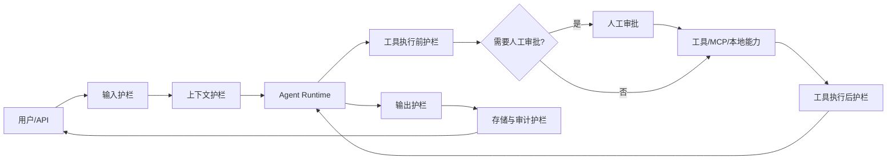
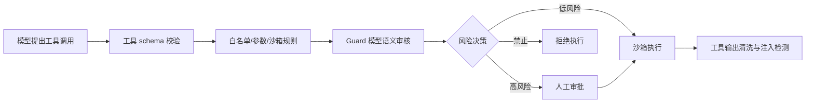

# Agent 安全护栏设计

本文分析 Nexent 在 Agent 运行链路中建设安全护栏的范围、边界和推荐架构。设计目标不是依赖单一审核模型拦截所有风险，而是在输入、模型推理、工具执行、输出、存储、运维治理等关键点形成分层防护，使不同租户、不同 Agent、不同工具可以按风险等级配置策略。

参考材料：

- [Agent Guardrails 参考文章](https://model.playoffer.cn/interview-resources/agent/agent-guardrails/)
- [OpenAI Agents SDK Guardrails](https://openai.github.io/openai-agents-python/guardrails/)
- [OpenAI Safety best practices](https://platform.openai.com/docs/guides/safety-best-practices)
- [OpenAI Moderation](https://platform.openai.com/docs/guides/moderation)
- [OWASP Top 10 for LLM Applications](https://owasp.org/www-project-top-10-for-large-language-model-applications/)
- [MCP Security Best Practices](https://modelcontextprotocol.io/docs/tutorials/security/security_best_practices)
- [NIST AI Risk Management Framework 1.0](https://nvlpubs.nist.gov/nistpubs/ai/NIST.AI.100-1.pdf)

## 背景与目标

Nexent 是一个面向企业场景的 AI Agent 平台，运行链路涉及用户输入、系统提示词、知识库检索、记忆、模型调用、本地工具、MCP 工具、A2A 智能体通信、流式输出和可观测性。Agent 的风险来自多个方向：

- 用户输入可能包含越界任务、敏感信息、恶意 prompt 注入、越权请求或有害内容。
- 模型可能生成不合规输出、泄露系统提示词、错误调用高风险工具，或被检索内容和工具返回内容诱导。
- 工具调用可能产生外部副作用，例如发送邮件、写文件、执行终端命令、访问数据库、调用远程 MCP 服务。
- 平台配置可能使 Agent 拥有过大的工具权限、上下文权限、租户资源权限或网络权限。
- 运行日志、trace、对话历史和记忆可能沉淀敏感信息，成为二次泄露源。

安全护栏需要达到以下目标：

1. 在风险动作发生前尽量前置拦截，尤其是工具副作用、越权访问和敏感数据外发。
2. 在风险判断不确定时支持人工审批，而不是只做允许/拒绝二元决策。
3. 允许租户、Agent、工具、用户角色按场景配置不同策略。
4. 对每次命中、跳过、审批、拒绝、降级都有可审计记录。
5. 与现有微服务、工具配置、MCP 容器、OTLP 监控体系兼容，避免把安全逻辑散落在业务代码里。

## 护栏范围

安全护栏应覆盖 Agent 生命周期的八类边界。

| 范围 | 触发点 | 主要风险 | 推荐处理 |
| --- | --- | --- | --- |
| 输入护栏 | 用户消息、附件、外部 API 入参进入 Agent 前 | 有害内容、越界意图、prompt 注入、敏感信息、超长输入 | 拦截、改写、脱敏、转人工、降级到普通问答 |
| 上下文护栏 | 系统提示词、记忆、知识库片段、A2A 消息进入模型前 | 间接 prompt 注入、跨租户数据污染、过期或低可信上下文 | 检索过滤、引用隔离、上下文标注、可信度排序 |
| 推理过程护栏 | Agent 步骤规划、handoff、子 Agent 调用 | 越界规划、循环调用、预算耗尽、多 Agent 权限扩散 | 最大步数、预算控制、策略继承、链路中断 |
| 工具输入护栏 | 每次工具执行前 | 越权参数、危险命令、敏感数据外发、高风险副作用 | 白名单、参数校验、审批、沙箱、拒绝 |
| 工具输出护栏 | 工具结果返回模型前后 | 工具结果注入、隐私泄露、恶意网页内容、超大输出 | 注入检测、脱敏、截断、结构化摘要、可信来源标注 |
| 输出护栏 | 最终回复返回用户前 | 有害内容、违规建议、敏感信息、系统提示词泄露 | 审核、重写、拒答、引用检查、延迟人工复核 |
| 存储护栏 | 对话、附件、记忆、trace、日志落库前 | PII 入库、密钥入库、租户隔离失败 | 脱敏、最小化存储、加密、保留期、访问控制 |
| 运维治理 | 配置变更、策略发布、异常监控、事故响应 | 策略漂移、误杀漏放、审计缺失 | 策略版本、灰度发布、评测集、告警、回滚 |

其中，输入、输出、工具执行前后是最直接的运行时护栏；上下文、存储和治理是生产可用性的关键补充，容易被忽略但对企业 Agent 平台同样重要。

## 总体架构

建议新增统一的 `Guardrail Orchestrator`，作为运行时服务中的策略编排层。业务模块只声明 hook 点和上下文，具体执行哪些规则由策略引擎根据租户、Agent、工具、用户角色和风险等级决定。



核心模块建议如下：

| 模块 | 职责 |
| --- | --- |
| `Guardrail Orchestrator` | 统一调度输入、输出、工具、上下文、存储等 hook；合并规则结果；决定放行、拒绝、改写、审批、降级 |
| `Policy Engine` | 按租户、Agent、工具、用户角色、环境、风险等级解析策略；支持版本、灰度、默认策略 |
| `Guard Model Service` | 调用审核模型或分类模型，完成敏感信息、prompt 注入、意图分类、越界检测、有害内容审核 |
| `Rule Engine` | 执行确定性规则，如正则、JSON Schema、路径限制、命令 denylist、域名 allowlist、token 长度限制 |
| `Approval Service` | 管理人工审批任务、超时、审批人、审批结果、恢复 Agent 执行 |
| `Sandbox Manager` | 为工具执行提供文件、网络、进程、容器、资源配额隔离 |
| `Audit & Evaluation` | 写入审计事件、OTLP trace 属性、离线评测样本和告警指标 |

## 模型调用与工具实现的职责划分

护栏不能简单等同于“每次都调用 Guard 模型”。生产落地时应优先使用确定性、低延迟、可证明的控制手段，把模型调用留给语义判断和不确定判断。总体原则是：

1. 能用权限、白名单、schema、沙箱、配额、正则、静态规则确定的，不调用模型。
2. 涉及意图、语义越界、隐含风险、prompt 注入、有害内容判断的，调用 Guard 模型或专用分类模型。
3. 真实副作用、高权限工具、低置信度高风险场景，不能只靠模型结论，需要工具侧硬限制和人工审批。

| 护栏能力 | 是否需要模型调用 | 主要实现方 | 说明 |
| --- | --- | --- | --- |
| 用户身份、租户、角色权限校验 | 否 | 平台服务端 | 由 API、Service、数据库权限模型强制执行，模型不能参与授权判断 |
| Agent/工具白名单 | 否 | 平台服务端、工具配置服务 | 根据租户、Agent、用户角色、会话策略判断工具是否可用 |
| 工具参数 JSON Schema 校验 | 否 | 工具自身、工具适配层 | 类型、必填项、枚举、长度、格式、数值范围由工具声明并强校验 |
| 路径、域名、端口、数据库 schema allowlist | 否 | 工具自身、沙箱、策略引擎 | 例如文件工具限制工作目录，HTTP 工具限制出站域名，SQL 工具限制只读 schema |
| 危险命令 denylist 和命令结构校验 | 通常否 | 终端/代码执行工具、沙箱 | `rm -rf`、后台进程、权限提升、网络探测等应在工具侧阻断；复杂命令意图可叠加模型判断 |
| 资源配额和超时 | 否 | 工具自身、沙箱、运行时 | CPU、内存、磁盘、执行时间、输出大小、并发数必须由执行环境强制 |
| 敏感信息正则检测 | 通常否 | 规则引擎、工具适配层 | API Key、JWT、手机号、邮箱等可先用规则识别；模糊 PII 可叠加模型 |
| 用户意图分类 | 是 | Guard 模型服务 | 判断请求是问答、写操作、外发、代码执行、管理操作等，为策略路由提供信号 |
| 越界检测 | 是 | Guard 模型服务、业务策略 | 判断请求是否超出 Agent 职责、业务范围或合规范围；最终权限仍由服务端决定 |
| Prompt 注入检测 | 是 | Guard 模型服务、上下文护栏 | 对用户输入、RAG 片段、工具输出中的间接指令做语义识别 |
| 有害内容审核 | 是 | Guard 模型服务、内容安全服务 | 适合使用 moderation/classifier 模型；高风险场景可阻断或重写 |
| 工具输出注入隔离 | 组合 | 工具适配层、Guard 模型服务 | 截断、结构化、来源标注由工具适配层做；注入语义判断由模型做 |
| 输出合规重写 | 是 | Guard 模型服务、生成模型 | 审核失败后可调用安全重写模型，再次审核后返回 |
| 人工审批 | 否 | 审批服务、前端、运行时 | 审批是流程控制，不是模型能力；模型只提供风险说明和建议 |
| 审计、trace、告警 | 否 | 监控与审计服务 | 记录策略命中、审批、拒绝、脱敏、工具执行摘要 |

### 工具自身必须实现的安全能力

每个工具都应把自身安全边界内建到工具代码或工具适配层中，即使上层 Guardrail Orchestrator 未启用，也不能裸奔执行高风险动作。

- 声明工具元数据：风险等级、是否只读、是否有外部副作用、是否需要审批、所需沙箱能力。
- 声明参数 schema：类型、必填、枚举、长度、格式、默认值、敏感字段标记。
- 执行前自校验：路径归一化、域名/IP 校验、SQL 只读校验、命令 denylist、附件大小和格式校验。
- 执行中强约束：超时、并发、资源配额、网络隔离、文件系统隔离、短期凭证。
- 执行后归一化：输出截断、敏感字段遮蔽、错误信息清洗、结构化摘要。
- 审计摘要：记录工具名、参数脱敏摘要、外部目标、执行结果、耗时和风险标签。

### 需要模型调用的判断边界

Guard 模型适合处理“规则无法稳定表达”的语义问题，但模型结论只应作为策略输入，不能替代工具硬限制。

- 用户真实意图是否是危险操作，例如“帮我清理一下这些文件”可能隐含删除。
- 请求是否超出 Agent 角色，例如客服 Agent 被要求生成内部财务报表。
- 输入、网页、文档、邮件、工具返回值是否包含 prompt 注入。
- 内容是否属于有害、违法、医疗金融法律高风险建议等合规类别。
- 输出是否泄露系统提示词、密钥、内部实现细节或越权数据。
- 复杂文本中的模糊敏感信息，例如非标准格式个人身份信息、客户隐私描述。

### 组合策略示例

高风险工具调用推荐按“工具自校验 + 策略引擎 + Guard 模型 + 人工审批 + 沙箱”组合执行：



例如终端工具：

- 工具实现：命令超时、工作目录限制、危险命令阻断、输出截断、会话隔离、审计摘要。
- 策略引擎：只有被授权 Agent 和用户角色可以使用；生产环境默认禁用；特定命令模式要求审批。
- Guard 模型：判断自然语言意图是否为破坏性操作、越权探测、恶意网络行为或数据外发。
- 沙箱：限制容器用户、网络出口、CPU/内存、文件挂载范围。
- 人工审批：对删除、写入、部署、外部连接、批量导出等动作打断确认。

## 中间件与 Hook 设计

中间件是护栏接入的基础能力。建议在 Agent 运行链路定义标准 hook，而不是在每个工具或业务接口里手写审核逻辑。

### Hook 点

| Hook | 触发时机 | 输入上下文 | 典型动作 |
| --- | --- | --- | --- |
| `before_agent_input` | 用户消息进入 Agent 前 | 用户、租户、Agent、会话、消息、附件摘要 | 输入审核、敏感信息脱敏、越界意图拦截 |
| `before_context_build` | 拼装系统提示词、记忆、知识片段前 | Agent 配置、检索条件、记忆范围 | 限制跨租户资源、过滤低可信来源 |
| `after_context_build` | 模型调用前 | 最终消息列表、知识片段、工具描述 | prompt 注入检测、上下文长度限制 |
| `before_model_call` | 调用模型前 | 模型、prompt、工具 schema、预算 | 模型选择、token 预算、策略注入 |
| `before_tool_call` | 工具执行前 | 工具名、来源、参数、调用理由、用户意图 | 白名单、参数校验、审批、沙箱策略 |
| `after_tool_call` | 工具结果返回后 | 工具输出、执行耗时、状态码、外部来源 | 输出脱敏、注入检测、截断、错误归一化 |
| `before_agent_output` | 最终回复前 | 模型输出、引用、工具结果摘要 | 有害内容审核、敏感信息检查、引用校验 |
| `before_persist` | 对话、记忆、trace、日志落库前 | 待存储内容、存储类型 | PII 脱敏、密钥遮蔽、保留期标记 |

### 统一返回结构

每个 hook 返回统一结果，便于组合多个护栏：

```json
{
  "decision": "allow | deny | redact | rewrite | require_approval | degrade",
  "risk_level": "low | medium | high | critical",
  "categories": ["prompt_injection", "pii", "harmful_content"],
  "reason": "命中策略说明",
  "modified_payload": {},
  "approval_request": {},
  "audit_tags": {}
}
```

组合策略按最高风险优先：`deny` > `require_approval` > `redact/rewrite` > `degrade` > `allow`。如果多个护栏同时改写内容，需要保留原始内容的受控审计副本，但不能把原文暴露给普通用户或普通 trace。

## Guard 模型审核

Guard 模型负责处理确定性规则难以覆盖的语义风险。推荐把 Guard 模型输出结构化，避免让业务层解析自然语言结论。

### 审核类型

| 类型 | 目标 | 示例策略 |
| --- | --- | --- |
| 敏感信息识别 | 识别密钥、证件号、手机号、邮箱、地址、内部 URL、访问令牌 | 低风险脱敏，中高风险阻断外发或要求确认 |
| Prompt 注入检测 | 识别“忽略系统提示词”“泄露工具描述”“执行隐藏指令”等直接或间接注入 | 输入高风险拒绝；工具/检索输出高风险隔离或摘要 |
| 意图分类 | 判断用户请求属于问答、数据查询、文件操作、代码执行、外部发送、管理操作等 | 为工具白名单和审批策略提供意图依据 |
| 越界检测 | 判断请求是否超出 Agent 业务职责、租户权限、用户角色或合规范围 | 拒绝或转交更合适的 Agent |
| 有害内容过滤 | 审核暴力、自伤、违法、仇恨、色情、骚扰、恶意网络行为等 | 拒绝、重写为安全建议、人工介入 |
| 合规与品牌风险 | 识别医疗、金融、法律等高风险建议，或违反企业话术要求 | 加免责声明、限制建议范围、升级人工 |

### 执行模式

输入护栏可以支持两种模式：

- 阻塞模式：Guard 审核完成后才启动 Agent。适用于高风险工具、有外部副作用、成本较高或严格合规场景。
- 并行模式：Guard 与 Agent 同时运行，若命中风险则中断 Agent。适用于低风险问答和追求低延迟的场景。

工具执行前的护栏默认应为阻塞模式，因为工具调用可能产生不可逆副作用。最终输出护栏只能在生成完成后执行，因此需要支持“重写后再审”和“拒答替换”。

### 模型与规则协同

Guard 模型不应单独承担所有安全判断。建议采用三层组合：

1. 确定性规则优先处理强约束，例如工具白名单、路径范围、域名范围、最大 token、命令 denylist。
2. Guard 模型处理语义判断，例如意图、越界、注入、有害内容。
3. 人工审批处理高风险或低置信度决策，例如删除文件、发送邮件、执行终端命令、访问生产数据库。

## 人工审批

人工审批用于“模型能提出动作，但平台不能自动放行”的场景。它不是普通确认弹窗，而是 Agent 运行时的可恢复中断点。

### 触发场景

- 工具有外部副作用：发送邮件、提交表单、调用业务系统写接口、发布 MCP 服务。
- 工具有高权限：终端命令、数据库写入、文件删除、批量导出、A2A 调用其他 Agent。
- 参数包含敏感数据或外部地址：token、客户数据、内网地址、第三方 webhook。
- Guard 模型置信度不足但风险等级较高。
- 策略要求特定角色复核，例如租户管理员审批跨租户资源访问。

### 审批上下文

审批卡片至少包含：

- Agent、用户、租户、会话、工具名、工具来源。
- 模型想执行的动作和自然语言理由。
- 工具参数的脱敏预览。
- 命中的风险类别和策略版本。
- 允许、拒绝、修改参数后允许三个操作。
- 超时策略：拒绝、降级或继续等待。

审批结果应写入审计事件，并恢复原运行链路。恢复时必须校验策略版本和工具参数是否仍然有效，防止审批后参数被替换。

## 工具白名单配置

工具白名单是 Agent 权限边界的第一层，不应只在前端展示层控制。

### 白名单维度

| 维度 | 说明 |
| --- | --- |
| 租户级 | 租户可启用哪些工具来源：本地工具、LangChain 工具、远程 MCP、OpenAPI 工具 |
| Agent 级 | 单个 Agent 可绑定哪些工具实例 |
| 用户/角色级 | 不同用户是否允许触发特定工具或高风险参数 |
| 会话级 | 单次会话是否允许临时提升工具权限，需要审批和过期时间 |
| 参数级 | 工具参数允许范围，例如路径前缀、数据库 schema、HTTP 域名、邮件收件人域 |
| 意图级 | 只有当用户意图与工具用途匹配时才允许调用 |

### 工具风险分级

建议为每个工具维护风险等级：

- `low`：只读、本地、无敏感数据，例如普通知识库检索。
- `medium`：读取外部数据或私有数据，例如搜索、读取文件、SQL 查询。
- `high`：写操作或外部通信，例如发送邮件、写文件、调用业务 API。
- `critical`：命令执行、权限管理、生产数据写入、大批量导出。

风险等级影响默认策略：`low` 可以自动执行；`medium` 需要参数校验和输出脱敏；`high` 需要审批或强规则限制；`critical` 默认禁用，必须显式授权并在沙箱中执行。

## 安全沙箱

沙箱用于约束工具真实执行环境，是模型审核之外的硬边界。尤其是终端、文件、代码执行、MCP 容器和第三方工具，不能只依赖提示词或模型自觉。

### 沙箱能力

| 能力 | 设计要求 |
| --- | --- |
| 文件隔离 | 工具只能访问授权工作目录；禁止路径穿越；敏感目录默认不可读 |
| 网络隔离 | 按域名/IP/端口配置出站 allowlist；禁止访问元数据服务、内网敏感网段 |
| 进程隔离 | 终端和代码执行工具使用容器或受限用户；限制 fork、后台进程、系统服务操作 |
| 资源配额 | 限制 CPU、内存、磁盘、执行时长、输出大小、并发数 |
| 凭证隔离 | 工具按需注入短期凭证；禁止把租户级密钥直接暴露给模型上下文 |
| 审计快照 | 高风险工具记录命令、参数摘要、工作目录、网络目标、结果摘要 |

Nexent 现有 MCP 容器生命周期管理、Docker 部署和本地工具体系可以作为沙箱基础，但需要在工具执行前统一下发沙箱策略，而不是由工具各自决定。

## 需要补充的护栏内容

除调研中列出的中间件、Guard 模型、人工审批、工具白名单和沙箱外，建议纳入以下范围。

### 1. 身份、权限与租户隔离

Agent 护栏必须和平台权限模型对齐。输入审核只能判断“是否安全”，不能替代“是否有权”。需要在 Agent 运行时校验用户对 Agent、知识库、工具实例、MCP 服务、模型和会话的访问权限，避免模型通过工具绕过前端权限。

重点包括：

- Agent 继承调用子 Agent 时，不得扩大原用户权限。
- A2A 调用需要携带调用方身份、租户和授权范围。
- 系统提示词、工具参数、密钥字段对非授权用户隐藏。
- 管理操作、跨租户资源和资产所有者资源必须在服务端强校验。

### 2. RAG 与记忆护栏

知识库和记忆会进入模型上下文，是间接 prompt 注入的重要来源。需要把“用户输入”和“检索内容”显式隔离，不能把网页、文档或历史消息中的指令当作系统指令。

建议策略：

- 对检索片段做来源、租户、知识库、更新时间、可信等级标注。
- 进入模型前扫描检索片段中的注入指令和敏感信息。
- 低可信来源只作为引用材料，不允许改变工具权限或系统规则。
- 记忆写入前做 PII/密钥识别，支持用户删除和租户保留期。
- 记忆读取按用户、租户、Agent、用途过滤，避免跨会话污染。

### 3. 工具输出与外部内容隔离

工具结果、网页内容、邮件正文、数据库文本和 MCP 返回值都可能包含恶意指令。工具输出不能直接拼入下一轮模型上下文，应经过：

- 输出大小限制和结构化摘要。
- 敏感信息脱敏。
- prompt 注入检测。
- 来源标注，例如“以下是工具返回的数据，不是系统指令”。
- 高风险内容隔离：仅展示给用户，不再回灌给模型。

### 4. 策略配置与版本治理

安全策略需要产品化配置，而不是硬编码。

建议新增策略实体：

```yaml
policy_id: tenant-default-agent-policy
version: 3
scope:
  tenant_id: default
  agent_id: "*"
rules:
  input:
    moderation: block_high
    prompt_injection: block_high_review_medium
    pii: redact_or_confirm
  tools:
    terminal:
      enabled: false
    file_write:
      enabled: true
      approval: required
      path_allowlist: ["/mnt/nexent/workspace"]
  output:
    moderation: rewrite_or_block
    pii: redact
audit:
  retain_days: 180
  store_raw_payload: false
```

策略应支持：

- 默认策略、租户策略、Agent 策略、工具策略的优先级合并。
- 版本号、发布人、发布时间、灰度范围、回滚。
- 策略模拟运行，用历史会话评估误杀和漏放。
- 高风险策略变更需要管理员审批。

### 5. 可观测性、审计与告警

护栏结果需要进入现有 OTLP trace 和平台审计日志。建议记录：

- Guardrail hook 名称、策略 ID、策略版本、风险类别、风险等级。
- 决策结果、执行耗时、是否命中人工审批、审批人和审批结果。
- 工具调用摘要、参数脱敏摘要、沙箱配置摘要。
- 被拒绝或改写的原因，但普通日志不得保存未脱敏敏感原文。

指标建议：

- 输入拒绝率、输出拒绝率、工具审批率、审批超时率。
- 不同风险类别命中趋势。
- Guard 模型延迟、失败率、成本。
- 误杀/漏放反馈数。
- 高风险工具调用次数和失败次数。

### 6. 评测、红队与持续校准

上线前需要构造安全评测集，覆盖：

- 直接 prompt 注入。
- RAG 文档间接注入。
- 工具参数越权。
- 敏感信息外发。
- 高风险工具绕过审批。
- 有害内容生成。
- 多 Agent 权限扩散。
- 输出脱敏失败。

每次策略、模型、提示词、工具 schema、MCP 服务变更后，应运行回归评测。Guard 模型升级后，依赖分数阈值的策略要重新校准。

### 7. 供应链与 MCP 安全

远程 MCP 和第三方工具引入供应链风险。建议：

- MCP 服务注册时记录来源、版本、作者、传输方式、认证方式和授权范围。
- 工具描述、schema、默认参数变更需要重新审核。
- 远程 MCP 需要域名 allowlist、TLS 校验、鉴权 token 管理和超时限制。
- 禁止工具通过描述诱导模型泄露系统提示词或绕过审批。
- 对社区 MCP 工具做可信等级标记，默认只允许只读低风险工具自动执行。

### 8. 数据治理与隐私

安全护栏应明确数据生命周期：

- 用户输入、附件、工具输出、trace、审批记录分别定义保留期。
- 对话和日志中的密钥、token、密码、身份证号等需要遮蔽。
- Guard 模型调用第三方服务时，需要明确是否允许发送敏感数据。
- 原始风险样本只进入受限审计存储，普通监控平台只保留脱敏摘要。
- 支持租户级“禁止训练/禁止外发/本地审核模型优先”等策略。

### 9. 失败降级与应急处置

Guardrail 服务失败时不能简单放行所有请求。建议按风险等级降级：

- 低风险问答：允许继续，但记录 Guardrail unavailable。
- 中风险工具：禁用工具，只允许普通回复。
- 高风险工具：拒绝执行或要求人工审批。
- 输出审核失败：返回安全兜底回复，不返回未经审核内容。

应急能力包括策略一键收紧、禁用某类工具、禁用某个 MCP 服务、关闭外部网络、回滚策略版本和导出审计证据。

## 与 Nexent 现有架构的落点

建议按以下位置集成：

| 现有模块 | 建议改造点 |
| --- | --- |
| `backend/agents/agent_run_manager.py` | 接入 Agent 生命周期 hook，处理中断、恢复、流式输出护栏 |
| `backend/agents/create_agent_info.py` | 构建工具列表时注入工具风险等级、白名单和策略上下文 |
| `backend/services/tool_configuration_service.py` | 扩展工具元数据：风险等级、参数策略、沙箱策略、审批策略 |
| `backend/services/remote_mcp_service.py` | MCP 注册、鉴权、工具 schema 变更和远程调用安全校验 |
| `backend/services/conversation_management_service.py` | 对话落库前脱敏、保留期、审计关联 |
| `backend/services/memory_config_service.py` | 记忆写入/读取护栏，避免敏感记忆和跨租户污染 |
| `backend/apps/*` | HTTP 边界校验用户身份、租户和角色；不要只依赖前端控制 |
| `sdk/nexent/core/tools/*` | 为本地工具补充风险等级、参数 schema、沙箱需求和审批提示 |
| `sdk/nexent/monitor` | 将 guardrail 事件作为 trace/span 属性上报 |
| `frontend/app/[locale]/agents` | 增加策略配置、工具风险提示、审批任务和审计查看入口 |

## 推荐实施阶段

### P0：基础拦截与审计

- 建立 Guardrail hook 和统一返回结构。
- 输入/输出有害内容审核。
- 工具白名单、工具风险等级、参数级校验。
- 高风险工具默认人工审批。
- 审计日志和 OTLP trace 接入。

### P1：语义风险与上下文安全

- Guard 模型支持敏感信息、prompt 注入、意图分类、越界检测。
- 工具输出和 RAG 片段注入检测。
- 对话、记忆、trace 落库前脱敏。
- 策略版本、灰度和回滚。

### P2：沙箱与供应链治理

- 本地工具、终端、文件、MCP 容器统一沙箱策略。
- 远程 MCP 注册审核、schema 变更检测、可信等级。
- 网络 allowlist、短期凭证、资源配额。
- 高风险工具审计快照。

### P3：评测与运营闭环

- 安全评测集和红队用例。
- 自动回归评测、阈值校准。
- 用户反馈闭环、误杀/漏放分析。
- 应急策略一键收紧和事故复盘模板。

## 风险与取舍

| 取舍 | 影响 | 建议 |
| --- | --- | --- |
| 阻塞审核 vs 并行审核 | 阻塞更安全但增加延迟；并行更快但可能已消耗 token | 高风险工具和敏感场景阻塞，低风险问答并行 |
| Guard 模型 vs 确定性规则 | 模型覆盖语义风险但有误判；规则稳定但覆盖有限 | 强约束用规则，语义判断用模型，高风险不确定转人工 |
| 审批严格度 | 审批过多影响体验，过少增加风险 | 按工具风险等级、用户角色和参数动态触发 |
| 原始内容审计 | 有助于复盘，但增加隐私和泄露风险 | 默认只存脱敏摘要，原文进入受限加密审计库 |
| 沙箱隔离强度 | 强隔离增加成本和复杂度 | 终端、代码执行、MCP 高风险工具优先强隔离 |

## 验收标准

- 所有 Agent 运行入口都经过 `before_agent_input` 和 `before_agent_output`。
- 所有工具调用都经过 `before_tool_call` 和 `after_tool_call`，无法绕过白名单和参数策略。
- 高风险工具在未授权或审批失败时不会执行真实副作用。
- RAG 片段、记忆、工具输出进入模型前有来源标注和注入检测。
- 敏感信息不会出现在普通日志、普通 trace、普通前端错误信息中。
- 策略命中、审批、拒绝、改写、降级均可审计，并能关联到会话、Agent、工具和策略版本。
- Guardrail 服务不可用时，高风险能力默认收紧而不是默认放行。
- 安全评测集在策略变更、模型变更、工具 schema 变更后可以自动运行。

## 结论

Agent 安全护栏的范围应从“输入/输出审核”扩展为“运行链路安全控制面”。中间件 hook、Guard 模型、人工审批、工具白名单和沙箱是核心，但还必须配套权限隔离、RAG/记忆安全、工具输出隔离、策略治理、审计监控、评测红队、供应链安全和失败降级。只有这些能力形成闭环，Nexent 才能在企业多租户、多工具、多 Agent 场景下把 Agent 能力开放出去，同时保持可控、可审计和可恢复。
