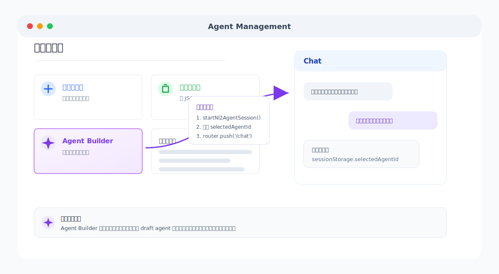
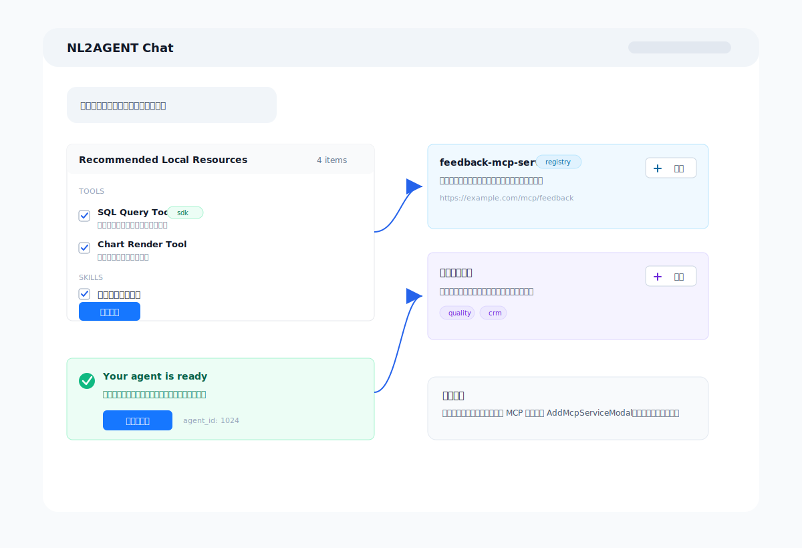
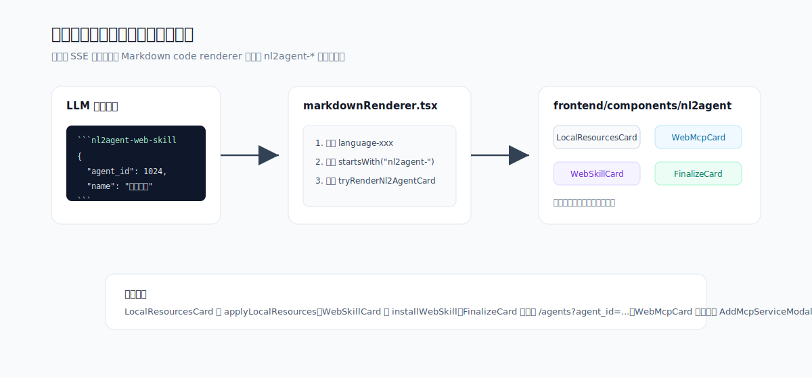

# NL2AGENT 对话式智能体构建助手 设计文档

> 版本：v1.0 ｜ 对应实现分支：`dyx/nl2a` ｜ 最后更新：2026-07-07

---

## 1. 概述

### 1.1 背景

Nexent 现有的智能体构建流程是表单驱动的单次输入：用户填写业务描述、选择模型、点击"生成提示词"、在弹窗中手动挑选工具，然后保存。该流程缺乏引导性，用户面对空白表单往往不知从何入手，工具与技能的挑选也依赖用户预先知道全租户有哪些资源可用。

### 1.2 目标

NL2AGENT 是一个**默认智能体**（DB 中一行 `name="nl2agent"` 的记录），通过多轮自然语言对话引导用户从模糊想法到可发布的智能体草稿。核心能力：

1. 多轮提问，逐步澄清目标、场景、约束、数据源。
2. 基于用户描述，搜索并推荐**本地**工具/技能（SDK 工具 + 租户已安装 MCP 工具 + LangChain 工具 + 租户已安装技能），支持"**全部应用**"一键批量绑定到草稿。
3. 当本地资源不足时，搜索并推荐**网络** MCP 市场（官方 Registry + 社区）与官方技能市场，由用户**逐个安装**。
4. 用户表示完成后，调用既有 `generate_and_save_system_prompt_impl` 生成完整提示词集，产出可发布的草稿。

### 1.3 设计原则

- **最大化复用**：NL2AGENT 走既有 `POST /agent/run` → `run_agent_stream` 主循环，不新建聊天/流式推送基础设施。
- **薄包装工具**：6 个 SDK builtin 工具仅是对既有 service 方法的薄包装，无新业务逻辑。
- **会话上下文注入**：draft `agent_id`、`user_id`、`tenant_id`、`model_id`、`language` 通过 `ToolConfig.metadata` 在构建期注入，复用既有 `ReadSkillConfigTool` 模式。
- **卡片渲染**：LLM 在最终回答中以带特定语言标签的代码围栏块输出 JSON，前端 `markdownRenderer.tsx` 拦截并渲染交互卡片，不侵入 SSE 流式管道。

---

## 2. 系统架构

```
┌──────────────────────────────────────────────────────────────┐
│                         前端 (Next.js :3000)                   │
│  AgentManageComp ──click──► startNl2AgentSession()            │
│                                  │                             │
│                                  ▼                             │
│   /chat  ◄── sessionStorage.selectedAgentId ◄── POST /session │
│     │                                                          │
│     ▼                                                          │
│   chatInterface (run_agent_stream SSE)                         │
│     │                                                          │
│     ▼                                                          │
│   markdownRenderer.tsx ──► tryRenderNl2AgentCard()             │
│     │                              │                            │
│     ▼                              ▼                            │
│   LocalResourcesCard  WebMcpCard  WebSkillCard  FinalizeCard   │
└──────────────────────────────────────────────────────────────┘
                              │
                              ▼ HTTP /api/*
┌──────────────────────────────────────────────────────────────┐
│                     后端 (FastAPI 多服务)                       │
│                                                                │
│   config_app (:5010) ──startup──► seed_nl2agent_default_agent │
│                                                                │
│   nl2agent_app (router)                                        │
│     POST /nl2agent/session/start                               │
│     POST /nl2agent/session/{id}/apply-local-resources         │
│     POST /nl2agent/session/{id}/install-web-skill             │
│     POST /nl2agent/session/{id}/finalize                      │
│                                                                │
│   agent_app  POST /agent/run  (现有主循环)                     │
│     └─► run_agent_stream                                       │
│           └─► create_agent_config                              │
│                 └─► create_builtin_tool (6 个 NL2Agent 分支)   │
│                       └─► get_*_tool() 设置 Nl2AgentContext   │
│                                                                │
│   nl2agent_service.py (核心业务逻辑)                           │
│     start_session / recommend_local_resources /                │
│     search_web_mcps / search_web_skills /                      │
│     apply_local_resources_batch / install_web_skill /          │
│     finalize_agent / seed_nl2agent_default_agent              │
└──────────────────────────────────────────────────────────────┘
```

---

## 3. 核心概念

### 3.1 NL2AGENT 默认智能体

一行 `ag_tenant_agent_t` 记录，`name="nl2agent"`，绑定 6 个 builtin 工具实例。由启动钩子 `seed_nl2agent_default_agent()` 幂等创建。用户点击"Agent Builder"后，前端导航到 `/chat` 并以该 `agent_id` 运行主循环。

### 3.2 草稿智能体（Draft Agent）

每个会话启动时通过 `create_agent()` 创建的占位智能体：`name="draft_<uuid8>"`，`version_no=0`。它不出现在主列表中（被 `list_all_agent_info_impl` 过滤）。`finalize_agent` 完成后会被重命名（移除 `draft_` 前缀），用户在草稿配置页评审并发布为 v1。

### 3.3 资源分类

| 类别 | 范围 | 安装方式 |
|---|---|---|
| **本地工具** | SDK 工具、租户已安装 MCP 工具、LangChain 工具 | "全部应用"批量绑定 |
| **本地技能** | 租户已安装技能 | "全部应用"批量绑定 |
| **网络 MCP** | 官方 Registry + 社区市场 | 逐个安装（既有 `AddMcpServiceModal`） |
| **网络技能** | 官方技能市场 | 逐个安装（`POST /install-web-skill`） |

### 3.4 卡片输出协议

NL2AGENT LLM 在最终回答中以带特定语言标签的代码围栏块输出 JSON，前端拦截渲染。支持的标签：

| 语言标签 | 渲染组件 | 用途 |
|---|---|---|
| `nl2agent-local-resources` | `LocalResourcesCard` | 本地工具+技能，带"全部应用" |
| `nl2agent-web-mcp` | `WebMcpCard`（单个） | 单个网络 MCP，带"安装" |
| `nl2agent-web-mcps` | `WebMcpCard` 列表 | 多个网络 MCP |
| `nl2agent-web-skill` | `WebSkillCard`（单个） | 单个网络技能，带"安装" |
| `nl2agent-web-skills` | `WebSkillCard` 列表 | 多个网络技能 |
| `nl2agent-finalize` | `FinalizeCard` | 终步确认，带"评审并发布" |

每张卡片的 JSON 必须包含 `agent_id`，以便前端调用 apply/install/finalize 接口。

---

## 4. 后端设计

### 4.1 服务层：`backend/services/nl2agent_service.py`

| 函数 | 签名 | 职责 |
|---|---|---|
| `start_session` | `(user_id, tenant_id, language) -> {agent_id, conversation_id, draft_name}` | 创建 draft AgentInfo（v0）+ conversation 行 |
| `recommend_local_resources` | `(query, agent_id, tenant_id, model_id, top_n=5) -> {tools, skills}` | LLM 评分本地工具+技能，返回 top-N，每项含 `score`/`reason` |
| `search_web_mcps` | `(query, tenant_id, model_id, top_n=5) -> [mcp]` | 调既有 Registry/社区端点，LLM 筛选 top-N |
| `search_web_skills` | `(query, tenant_id, model_id, top_n=5) -> [skill]` | 调既有官方技能列表，LLM 评分 top-N |
| `apply_local_resources_batch` | `(agent_id, tool_ids, skill_ids, tenant_id, user_id) -> {bound_tool_count, bound_skill_count}` | 批量创建 ToolInstance + SkillInstance |
| `install_web_skill` | `(skill_id, tenant_id, user_id) -> {skill_id, status}` | 复用 `skill_service.install_official_skill` |
| `finalize_agent` | `(agent_id, model_id, task_description, tool_ids, skill_ids, sub_agent_ids, knowledge_base_display_names, user_id, tenant_id, language) -> {agent_id, status:"draft_ready"}` | 调 `generate_and_save_system_prompt_impl` 生成完整提示词集，重命名 draft |
| `seed_nl2agent_default_agent` | `(tenant_id=DEFAULT, user_id=DEFAULT) -> agent_id \| None` | 启动时幂等插入 6 个 builtin 工具行 + 创建 NL2AGENT 默认智能体 + 绑定工具实例 |

**LLM 评分机制**：`_score_candidates_with_llm` 发送紧凑的工具/技能描述（id、name、description）给 `call_llm_for_system_prompt`，要求返回 0-10 评分与一句话理由。`_parse_scored_json` 容忍 LLM 输出中的代码围栏包裹。

### 4.2 API 路由：`backend/apps/nl2agent_app.py`

| 方法 | 路径 | 请求体 | 调用 |
|---|---|---|---|
| POST | `/nl2agent/session/start` | 无（仅 auth 头） | `start_session` |
| POST | `/nl2agent/session/{agent_id}/apply-local-resources` | `Nl2AgentApplyLocalResourcesRequest` | `apply_local_resources_batch` |
| POST | `/nl2agent/session/{agent_id}/install-web-skill` | `Nl2AgentInstallWebSkillRequest` | `install_web_skill` |
| POST | `/nl2agent/session/{agent_id}/finalize` | `Nl2AgentFinalizeRequest` | `finalize_agent` |

聊天本身复用既有 `POST /agent/run`，无新聊天端点。鉴权通过 `get_current_user_info(authorization, http_request)`；错误映射遵循 CLAUDE.md：`UnauthorizedError`→401，校验错误→400，`AgentRunException`→500。

### 4.3 请求模型：`backend/consts/model.py`

```python
class Nl2AgentApplyLocalResourcesRequest(BaseModel):
    tool_ids: List[int] = Field(default_factory=list)
    skill_ids: List[int] = Field(default_factory=list)

class Nl2AgentInstallWebSkillRequest(BaseModel):
    skill_id: int

class Nl2AgentFinalizeRequest(BaseModel):
    model_id: int
    task_description: str
    tool_ids: List[int] = Field(default_factory=list)
    skill_ids: List[int] = Field(default_factory=list)
    sub_agent_ids: List[int] = Field(default_factory=list)
    knowledge_base_display_names: List[str] = Field(default_factory=list)
```

### 4.4 SDK Builtin 工具：`sdk/nexent/core/tools/nl2agent/`

每个工具模块遵循 `ReadSkillConfigTool` 模式：`get_*_tool()` 初始化器调用 `set_nl2agent_context()` 设置模块级单例上下文，模块级 `@tool` 装饰的可调用对象在执行时通过 `get_nl2agent_context()` 读取上下文并以 `asyncio.run()` 调用异步 service。

| 模块 | `@tool` 可调用 | `get_*` 初始化器 |
|---|---|---|
| `search_local_resources_tool.py` | `search_local_resources(query: str) -> str` | `get_search_local_resources_tool(agent_id, user_id, tenant_id, model_id, language)` |
| `search_web_mcps_tool.py` | `search_web_mcps(query: str) -> str` | `get_search_web_mcps_tool(...)` |
| `search_web_skills_tool.py` | `search_web_skills(query: str) -> str` | `get_search_web_skills_tool(...)` |
| `apply_local_resources_tool.py` | `apply_local_resources(tool_ids: str, skill_ids: str) -> str` | `get_apply_local_resources_tool(...)` |
| `install_web_skill_tool.py` | `install_web_skill(skill_id: int) -> str` | `get_install_web_skill_tool(...)` |
| `finalize_agent_tool.py` | `finalize_agent(task_description, tool_ids, skill_ids, sub_agent_ids, knowledge_base_names) -> str` | `get_finalize_agent_tool(...)` |

**上下文数据结构**（`_context.py`）：

```python
@dataclass
class Nl2AgentContext:
    agent_id: Optional[int]
    user_id: Optional[str]
    tenant_id: Optional[str]
    model_id: Optional[int]
    language: Optional[str]

def set_nl2agent_context(agent_id, user_id, tenant_id, model_id, language) -> Nl2AgentContext
def get_nl2agent_context() -> Optional[Nl2AgentContext]
```

### 4.5 工具分发：`sdk/nexent/core/agents/nexent_agent.py`

`create_builtin_tool`（line 300）在既有 `ReadSkillConfigTool` 分支之后新增 6 个 `elif class_name == "NL2Agent*Tool"` 分支（lines 359-450）。每个分支：
1. 读取 `metadata = tool_config.metadata or {}`
2. 调用对应 `get_*_tool(agent_id=..., user_id=..., tenant_id=..., model_id=..., language=...)` 设置上下文
3. 返回模块级 `@tool` 可调用对象

### 4.6 上下文注入：`backend/agents/create_agent_info.py`

在模型解析后（line 925 起），定义 `_NL2AGENT_TOOL_CLASS_NAMES` 集合（6 个 class_name）。遍历 `tool_list`，对 `class_name` 命中的 `tool_cfg` 设置：

```python
tool_cfg.metadata = {
    "agent_id": agent_id,       # 草稿 agent_id（非 NL2AGENT 自身）
    "user_id": user_id,
    "tenant_id": tenant_id,
    "model_id": model_id_to_use,
    "language": language,
}
```

**关键**：注入的 `agent_id` 是**草稿目标智能体**的 ID，不是 NL2AGENT 自身的 ID。这样所有工具调用（apply/install/finalize）都作用于草稿。

### 4.7 启动播种：`backend/apps/config_app.py`

```python
@app.on_event("startup")
async def seed_nl2agent_on_startup():
    try:
        seed_nl2agent_default_agent()
    except Exception as exc:
        logger.error(f"Failed to seed NL2AGENT default agent: {str(exc)}")
```

`seed_nl2agent_default_agent()` 顺序：
1. 调 `seed_nl2agent_builtin_tools(tenant_id, user_id)` 幂等插入 6 行 `ag_tool_info_t`（按 `(name, source)` 去重）。
2. 创建 `ag_tenant_agent_t` 行（`name="nl2agent"`），若已存在则跳过。
3. 为该智能体绑定 6 个 ToolInstance。

### 4.8 草稿过滤：`backend/services/agent_service.py`

`list_all_agent_info_impl`（line 2330）签名新增 `include_drafts: bool = False`。line 2382 过滤：

```python
if not include_drafts and (agent.get("name") or "").startswith("draft_"):
    continue
```

`agent_app.py`（line 297）新增 `include_drafts: bool = Query(False)` 查询参数并透传。草稿仍可通过直接 `agent_id` 访问（用于聊天与 finalize 流程）。

### 4.9 系统提示词

`backend/prompts/nl2agent_system_prompt_{zh,en}.yaml` 定义对话流程、工具调用准则、卡片输出格式、语气与重要约束。提示词指导 LLM：

1. **第 1 轮**：开放式问候，询问目标。
2. **第 2-N 轮**：每次 1-2 个聚焦问题，覆盖场景/数据源/输出格式/约束/子智能体。能写出一段式任务描述时停止提问。
3. **能力映射**：调 `search_local_resources`；本地不足时调 `search_web_mcps` / `search_web_skills`。
4. **卡片输出**：调用搜索工具后，**必须**以 `nl2agent-*` 代码围栏块呈现 JSON，围栏内只放 JSON。
5. **终步**：用户表示完成时调 `finalize_agent`。

---

## 5. 前端设计

### 5.1 入口：`frontend/app/[locale]/agents/components/AgentManageComp.tsx`

在"创建智能体"与"导入智能体"卡片旁新增"Agent Builder"卡片（紫色，Sparkles 图标）。点击行为：

```typescript
const handleStartAgentBuilder = async () => {
  const res = await startNl2AgentSession();
  sessionStorage.setItem("selectedAgentId", String(res.agent_id));
  router.push(`/${locale}/chat`);
};
```

`chatInterface.tsx`（line 167）在挂载时读取 `sessionStorage.getItem("selectedAgentId")` 并设为当前选中智能体。

<div align="center">
  
</div>

_图 5-1：Agent Builder 入口复用现有智能体管理页和聊天页，只在点击后补充会话启动、`selectedAgentId` 写入与路由跳转。_

### 5.2 服务层：`frontend/services/nl2agentService.ts`

| 导出 | 签名 |
|---|---|
| `startNl2AgentSession` | `() => Promise<{agent_id, conversation_id, draft_name}>` |
| `applyLocalResources` | `(agentId, {tool_ids, skill_ids}) => Promise<{bound_tool_count, ...}>` |
| `installWebSkill` | `(agentId, skillId) => Promise<{skill_id, ...}>` |
| `finalizeNl2Agent` | `(agentId, payload) => Promise<{agent_id, status}>` |

均通过 `fetchWithAuth` 调用 `/api/nl2agent/*`，端点定义在 `frontend/services/api.ts` 的 `API_ENDPOINTS.nl2agent`。

### 5.3 卡片渲染：`frontend/components/nl2agent/`

`index.tsx` 导出 `tryRenderNl2AgentCard(language, content, onInstallMcp?)`：解析围栏块 JSON，按语言标签路由到对应组件，非 `nl2agent-` 前缀返回 `null`（交回默认代码块渲染器），JSON 解析失败渲染红色错误框。

| 组件 | Props | 交互按钮 | 行为 |
|---|---|---|---|
| `LocalResourcesCard` | `agentId`, `tools`, `skills` | "全部应用" | 调 `applyLocalResources`，成功后禁用 |
| `WebMcpCard` | `agentId`, `item`, `onInstall?` | "安装" | 触发 `onInstall` 回调打开既有 `AddMcpServiceModal`（预填 url/server_name），不直接调 API |
| `WebSkillCard` | `agentId`, `item` | "安装" | 调 `installWebSkill`，成功后显示"已安装" |
| `FinalizeCard` | `agentId`, `status?` | "评审并发布" | `router.push('/${locale}/agents?agent_id=${agentId}')` |

<div align="center">
  
</div>

_图 5-2：NL2AGENT 在聊天消息中渲染四类交互卡片。本地资源卡片负责批量应用，网络 MCP 卡片复用现有安装弹窗，网络技能卡片逐个安装，终步卡片引导进入评审发布。_

### 5.4 Markdown 拦截：`frontend/components/common/markdownRenderer.tsx`

在 `code` 渲染器中，先于 mermaid 检查：若 `match[1].startsWith("nl2agent-")`，调 `tryRenderNl2AgentCard`，返回非 null 则直接渲染。该方案不侵入 SSE 流式管道，卡片从 LLM 最终回答的围栏块渲染。

<div align="center">
  
</div>

_图 5-3：前端只在 Markdown 代码块渲染阶段识别 `nl2agent-*` 标签；无法识别或解析失败的内容不会影响普通 Markdown 与 mermaid 渲染。_

---

## 6. 数据流

1. **打开聊天**：前端 `POST /nl2agent/session/start` → 后端创建 draft AgentInfo（v0）+ conversation → 返回 `{agent_id, conversation_id}`。
2. **构建智能体**：前端加载 `/chat`，`run_agent_stream` → `create_agent_config` → 6 个 builtin 工具通过 `metadata` 注入 draft `agent_id` 等上下文。
3. **每轮对话**：`POST /agent/run`，LLM 按系统提示词提问或调工具。
4. **本地资源推荐**：LLM 调 `search_local_resources(query)` → service LLM 评分 → 返回 top-N JSON → LLM 以 `nl2agent-local-resources` 围栏块输出 → 前端渲染 `LocalResourcesCard`。
5. **全部应用（本地）**：用户勾选 → 点"全部应用" → `POST /apply-local-resources` → 后端批量创建 ToolInstance + SkillInstance。
6. **网络 MCP（逐个安装）**：LLM 调 `search_web_mcps` → 前端渲染 `WebMcpCard` 列表 → 用户点"安装" → 既有 `AddMcpServiceModal` 打开预填 → 用户确认 → 既有 `POST /mcp/add`。安装后下次 `search_local_resources` 即可见新 MCP 工具为本地工具。
7. **网络技能（逐个安装）**：LLM 调 `search_web_skills` → 前端渲染 `WebSkillCard` → 用户点"安装" → `POST /install-web-skill` → 复用 `skill_service.install_official_skill`。
8. **终步**：用户说"完成" → LLM 调 `finalize_agent(task_description, tool_ids, skill_ids, ...)` → service 调 `generate_and_save_system_prompt_impl` 填充 `duty_prompt`/`constraint_prompt`/`few_shots_prompt`/`greeting_message`/`example_questions`/`name`/`display_name`/`description` → 重命名 draft → 前端渲染 `FinalizeCard`。
9. **评审与发布**：用户点"评审并发布" → 跳转草稿配置页 → 评审 → 点"发布"（`publish_version_impl`）→ draft 变为 v1，出现在主列表。

---

## 7. 复用映射

| 既有资产 | NL2AGENT 复用为 |
|---|---|
| `run_agent_stream` (`agent_service.py:2912`) | NL2AGENT 聊天主循环 |
| `create_agent_config` (`create_agent_info.py:659`) | 构建 NexentAgent + 6 个 builtin 工具 |
| `create_builtin_tool` (`nexent_agent.py:300`) | 6 个新工具分发分支 |
| `ReadSkillConfigTool` 模式 (`read_skill_config_tool.py`) | 新工具模块模板 |
| `call_llm_for_system_prompt` (`llm_utils.py`) | 工具/技能 LLM 评分 |
| `generate_and_save_system_prompt_impl` (`prompt_service.py:99`) | 终步 finalize |
| `load_default_agents_json_file` (`agent_service.py:2300`) | 从 JSON fixture 加载 NL2AGENT |
| `create_agent` (`agent_db.py:191`) | 会话启动创建 draft |
| `list_all_tools` (`tool_configuration_service.py:492`) | 本地工具目录 |
| `skill_service` 列表/安装逻辑 | 本地技能列表 + 官方技能安装 |
| `create_or_update_tool_by_tool_info` | 批量绑定本地工具 |
| `ToolConfig.metadata` (`agent_model.py:125`) | 上下文注入 |
| `ToolSourceEnum.BUILTIN` (`model.py:611`) | NL2AGENT 工具来源 |
| `AddMcpServiceModal` (前端) | 网络 MCP 安装，预填打开 |
| `markdownRenderer.tsx` (前端) | 围栏块拦截 → 卡片渲染 |
| `prepare_prompt_templates` (`create_agent_info.py:1169`) | 加载 NL2AGENT YAML 提示词 |
| `prompt_template_service.py` | 模板解析 |

---

## 8. 关键文件清单

### 后端
- `backend/services/nl2agent_service.py`（新）
- `backend/apps/nl2agent_app.py`（新）
- `backend/agents/default_agents/nl2agent.json`（新）
- `backend/prompts/nl2agent_system_prompt_zh.yaml`、`_en.yaml`（新）
- `backend/database/tool_db.py`（新增 `NL2AGENT_BUILTIN_TOOL_DEFINITIONS` + `seed_nl2agent_builtin_tools`）
- `backend/consts/model.py`（新增 3 个请求模型）
- `backend/apps/runtime_app.py`（注册 nl2agent_router）
- `backend/apps/config_app.py`（新增 startup 钩子）
- `backend/apps/agent_app.py`（新增 `include_drafts` 查询参数）
- `backend/services/agent_service.py`（`list_all_agent_info_impl` 新增 `include_drafts` 过滤）
- `backend/agents/create_agent_info.py`（新增 `_NL2AGENT_TOOL_CLASS_NAMES` + metadata 注入）

### SDK
- `sdk/nexent/core/tools/nl2agent/`（新，6 个工具模块 + `_context.py` + `__init__.py`）
- `sdk/nexent/core/tools/__init__.py`（导出 6 个可调用对象）
- `sdk/nexent/core/agents/nexent_agent.py`（`create_builtin_tool` 新增 6 个分支）

### 前端
- `frontend/components/nl2agent/`（新，4 个卡片组件 + `index.tsx`）
- `frontend/services/nl2agentService.ts`（新）
- `frontend/services/api.ts`（新增 `nl2agent` 端点段）
- `frontend/components/common/markdownRenderer.tsx`（拦截 `nl2agent-` 围栏块）
- `frontend/app/[locale]/agents/components/AgentManageComp.tsx`（新增"Agent Builder"卡片）
- `frontend/public/locales/{en,zh}/common.json`（新增 i18n 键）

---

## 9. 风险与后续事项

1. **工具目录规模**：租户内若有 100+ 工具，评分 LLM 提示词会膨胀。缓解：先按 label/category 预筛（复用 `query_tools_by_labels`），或分页。待实测后优化。
2. **Registry/社区搜索端点**：`search_web_mcps` 直接调用既有后端端点，需确认其稳定性与分页参数。
3. **草稿清理**：用户中途放弃的 draft 会累积。后续应加 TTL 清理任务或在 NL2AGENT 聊天中提供"丢弃"按钮。
4. **播种顺序**：`ag_tool_info_t` 行必须在 fixture 的 `enabled_tool_ids` 解析前存在。当前 `seed_nl2agent_default_agent` 在 startup 钩子中先插工具行再创建智能体，顺序正确。
5. **发布流程**：finalize 后 draft 停在 v0，用户需手动发布。是否自动发布属于产品决策，建议保持手动（用户先评审）。
6. **跨轮状态**：draft `agent_id` 在 `ToolConfig.metadata` 中于构建期固定，会话内不变；对话历史作为 LLM 记忆。足够支撑单会话场景。
7. **并发会话**：多标签页开多个会话时，每个会话独立获得 draft `agent_id`，`Nl2AgentContext` 模块级单例在每次 `create_agent_config` 时被覆盖——由于每次 `run_agent_stream` 都会重建，不会跨会话泄漏。

---

## 10. 验证清单

### 启动验证
- [ ] `ag_tool_info_t` 存在 6 行 `category='nl2agent'` 记录
- [ ] `ag_tenant_agent_t` 存在 `name='nl2agent'` 记录
- [ ] 重启后端，播种幂等无报错

### 会话验证
- [ ] `POST /nl2agent/session/start` 返回 `{agent_id, conversation_id, draft_name}`
- [ ] draft 行 `name` 以 `draft_` 开头，不出现在 `GET /agents` 默认响应中
- [ ] 前端点击"Agent Builder"后跳转 `/chat`，NL2AGENT 智能体被选中

### 对话验证
- [ ] 第 1 轮开放式问候并询问目标
- [ ] 后续轮次每次 1-2 个聚焦问题
- [ ] 提及能力需求时调 `search_local_resources` 并渲染 `LocalResourcesCard`
- [ ] 点"全部应用"后 DB 出现对应 ToolInstance/SkillInstance
- [ ] 本地不足时调 `search_web_mcps`/`search_web_skills` 渲染卡片
- [ ] 网络 MCP "安装"打开既有 modal 预填
- [ ] 网络技能"安装"调 `POST /install-web-skill` 成功
- [ ] 用户说"完成"后调 `finalize_agent`，渲染 `FinalizeCard`
- [ ] "评审并发布"跳转草稿配置页，提示词字段已填充
- [ ] 发布后智能体出现在主列表，可经 `POST /agent/run` 运行

### 边界验证
- [ ] 无 token 调 `/nl2agent/session/start` → 401
- [ ] 空本地目录的租户调 `search_local_resources` 返回空列表不崩溃
- [ ] LLM 输出非法 JSON 围栏块时渲染红色错误框而非崩溃
- [ ] 用户改主意可重新搜索/移除资源
