# 智能体开发

在智能体开发页面中，您可以创建、配置和管理智能体。页面由“智能生成”和“配置”面板组成：智能生成负责把自然语言需求转换为配置草稿，配置面板用于手动调整参数，在配置完成后，可在配置页面右下角点击“调试”，调出“调试”面板用于验证实际运行效果。

<div style="display: flex; justify-content: center;">
  
</div>

## 🔧 创建智能体

在“智能体开发”的“智能体配置”页签下，点击右上角的“新建”创建空白智能体。创建或选择一个可编辑的智能体后，可以在智能生成面板描述需求，也可以直接在配置面板中手动填写。若当前智能体只有只读权限，页面会显示配置内容，但不会允许生成或修改。

如果您有现成的智能体配置，也可以导入使用：

1. 点击"导入"按钮
2. 在弹出的文件选择对话框中选择智能体配置文件（支持 JSON 或 zip 压缩包格式）
3. 点击"打开"按钮，系统会验证配置文件的格式和内容，并显示导入的智能体信息

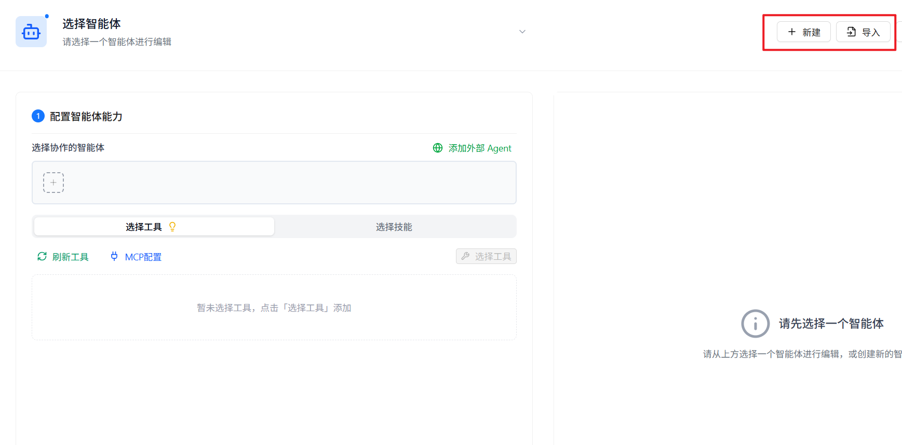


> ⚠️ **提示**：如果导入了重名的智能体，系统会弹出提示弹窗。您可以选择：
>
> - **直接导入**：保留重复名称，导入后的智能体会处于不可用状态，需手动修改智能体名称和变量名后才能使用
> - **重新生成并导入**：系统将调用 LLM 对智能体进行重命名，会消耗一定的模型 token 数，可能耗时较长

> 📌 **重要说明**：通过导入创建的智能体，如果其工具中包含 `knowledge_base_search` 等知识库检索工具，这些工具只会检索**当前登录用户在本环境中有权限访问的知识库**。导入文件中原有的知识库配置不会自动继承，因此实际检索结果和回答效果，可能与智能体原作者环境下的表现存在差异。

<div style="display: flex; justify-content: left;">
  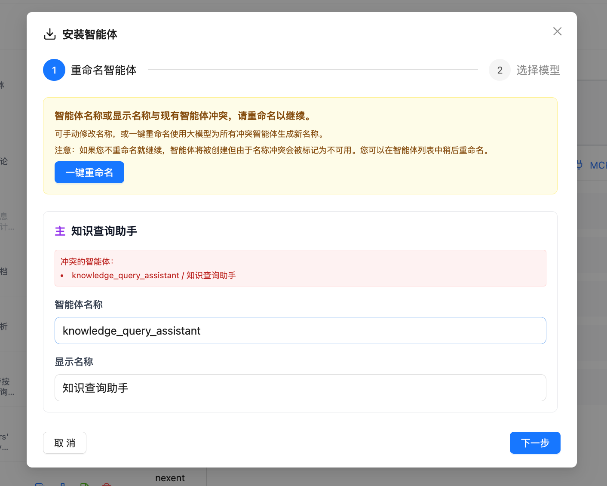
</div>

## 👥 配置协作智能体/工具

您可以为创建的智能体配置其他协作智能体，也可以为它配置可使用的工具，以赋予智能体能力完成复杂任务。

### 🤝 协作 Agent

协作智能体用于帮助当前智能体完成复杂任务。协作智能体的来源分为两类：

- **内部 Agent**：平台已发布的智能体
- **外部 A2A Agent**：通过 A2A 协议发现的第三方 Agent

1. 点击"协作 Agent"页签下的加号，弹出可选择的智能体列表
2. 智能体列表分为"内部 Agent"和"外部 A2A Agent"两个页签，您可以根据需要选择
3. 在下拉列表中选择要添加的智能体
4. 允许选择多个协作智能体
5. 可点击 × 取消选择此智能体

<div style="display: flex; justify-content: left;">
  
</div>

#### 🌐 添加外部 A2A Agent

Nexent 支持通过 A2A 协议与第三方 Agent 进行通信。您可以通过以下两种方式发现外部 A2A Agent：

##### 通过 URL 发现 Agent

如果您知道目标 Agent 的 Agent Card 地址，可以使用 URL 发现方式：

<div style="display: flex; justify-content: left;">
  
</div>

1. 在外部 A2A Agent 列表中，点击"添加外部 Agent"按钮
2. 选择"URL 发现"页签
3. 填写 Agent Card URL 地址，例如：`https://example.com/.well-known/agent.json`
4. 如果目标 Agent Card 需要认证，在"自定义请求头"中填写 JSON 对象，例如：`{"Authorization": "Bearer <token>"}`
5. 点击"发现"按钮，系统会自动获取 Agent 的相关信息
6. 发现成功后，可以查看 Agent 的名称、描述、能力等信息
7. 点击"添加到列表"完成添加

> 💡 **提示**：自定义请求头会随该外部 Agent 保存，仅用于获取和刷新 Agent Card，不会用于后续调用 Agent。再次发现同一 URL 时，留空会保留现有配置，填写 `{}` 可清空配置。

> 💡 **提示**：Agent Card 是符合 A2A 1.0 规范的 Agent 描述文件，包含了 Agent 的名称、描述、调用地址、能力等信息。

##### 通过 Nacos 发现 Agent

如果您的 Agent 注册在 Nacos 服务发现平台，可以使用 Nacos 发现方式：

<div style="display: flex; justify-content: left;">
  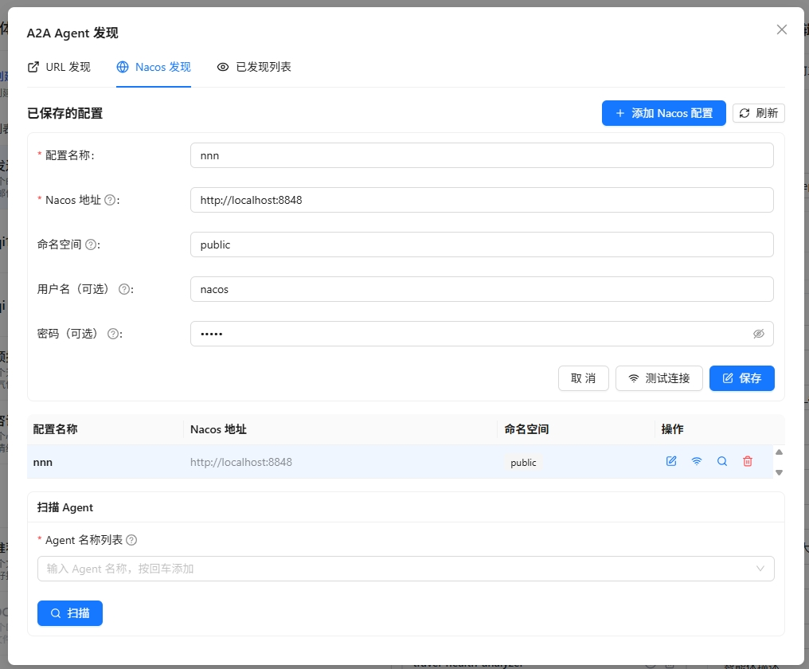
</div>

1. 在外部 A2A Agent 列表中，点击"添加外部 Agent"按钮
2. 选择"Nacos 发现"页签
3. 首次使用时，需要先配置 Nacos 连接信息：
   - **Nacos 服务器地址**：填写 Nacos 服务器地址，如 `http://127.0.0.1:8848`
   - **命名空间 ID**：填写 Nacos 命名空间 ID（可选）
   - **分组名**：填写服务分组名，默认为 `DEFAULT_GROUP`
   - **用户名/密码**：填写 Nacos 访问凭证（可选）
4. 点击"保存配置"保存 Nacos 连接信息
5. 填写要扫描的 Agent 服务名称
6. 点击"扫描"按钮，系统会从 Nacos 中获取匹配的 Agent 信息
7. 扫描结果会列出所有匹配的 Agent，可以选择需要的 Agent 添加到列表

> ⚠️ **注意**：确保 Nacos 服务正常运行，且目标 Agent 已正确注册到 Nacos。

##### 管理已发现的外部 Agent

在外部 A2A Agent 列表中，您可以查看和管理所有已发现的外部 Agent：

<div style="display: flex; justify-content: left;">
  
</div>

1. **查看 Agent 详情**：点击 Agent 卡片，可以查看其完整信息，包括名称、描述、URL、能力列表等
2. **测试 Agent**：点击"测试"按钮，可以向该 Agent 发送测试消息，验证其是否正常工作
3. **与 Agent 对话**：点击"对话"按钮，可以打开对话窗口，与该 Agent 进行实时交互
4. **配置调用协议**：点击"协议配置"按钮，可以选择该 Agent 的调用协议：
   - **HTTP + JSON**：使用 REST API 风格调用
   - **JSON-RPC**：使用 JSON-RPC 协议调用
5. **配置调用认证**：如果 Agent Card 声明了 `securitySchemes` 和 `securityRequirements`，点击"Agent 认证"按钮，填写所需认证值。系统会按 Card 声明将值放入请求头、查询参数或 Cookie；同一认证组合中的字段必须同时填写。
6. **刷新 Agent 信息**：如果 Agent 信息发生变化，可以点击"刷新"按钮重新获取最新的 Agent Card
7. **移除 Agent**：点击"移除"按钮，可以将该 Agent 从已发现列表中删除

> 💡 **使用场景**：
>
> - 通过 URL 发现快速接入已知的第三方 Agent 服务
> - 通过 Nacos 发现批量接入同一服务注册中心的所有 Agent
> - 配置协议以兼容不同 Agent 服务提供商的要求

###### 通过URL对接[DataAgent](https://gitcode.com/datagallery/dataagent) A2A Agent

1. 参考[DataAgent文档](https://gitcode.com/datagallery/dataagent#%F0%9F%8C%90-a2a-10-%E6%9C%8D%E5%8A%A1%E6%A8%A1%E5%BC%8F)以A2A服务模式启动DataAgent

   > 如果 DataAgent 启用了认证，请在发现 Agent 后，根据 Agent Card 声明的安全方案配置调用认证；未启用认证时可直接进行连通性测试。

   <div style="display: flex; justify-content: left;">
     
   </div>

2. 参考[通过 URL 发现 Agent](#通过-url-发现-agent)接入agent，url为http://\<IP\>:9999/.well-known/agent-card.json
3. 参考[管理已发现的外部 Agent](#管理已发现的外部-agent)配置调用协议，选择HTTP+JSON方式接入

### 🛠️ 选择智能体的工具或技能

智能体可以使用各种工具与技能来完成任务，如知识库检索、文件解析、图片解析、收发邮件、文件管理等本地工具，也可接入第三方或自行开发的 MCP 工具或技能。

1. 在"选择智能体的工具"页签右侧，点击"刷新工具"来刷新可用工具列表
2. 点击"选择工具"或"选择技能"按钮，可根据标签分组浏览当前可用的工具或技能清单
3. 点击 ⚙️ 查看工具或技能的描述，并配置工具或技能参数
4. 点击即可选中工具或技能，回到智能体已选择工具或已选择技能处可执行删除
   - 如果工具有必填参数没有配置，选择时会弹出弹窗引导进行参数配置
   - 如果所有必备参数已配置完成，选择则会直接选中

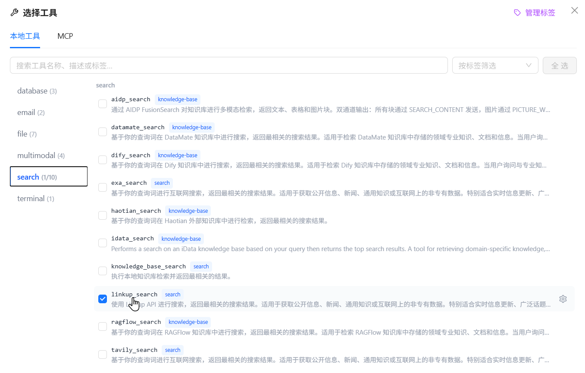


> 💡 **小贴士**：
>
> 1. 请选择 `knowledge_base_search` 工具，启用知识库的检索功能。
> 2. 请选择 `analyze_text_file` 工具，启用文档类、文本类文件的解析功能。
> 3. 请选择 `analyze_image` 工具，启用图片类文件的解析功能。
>
> ⚠️ **注意**：使用 `knowledge_base_search` 工具时，需要事先创建知识库。请务必确保**创建知识库时使用的向量化模型**与当前生效的向量化模型一致。否则将会导致检索失败或结果不准确。
>
> 📚 想了解系统已经内置的所有本地工具能力？请参阅 [本地工具概览](../local-tools/index.md)。
> 📚 想了解技能能力？请参阅 [技能管理](../resource-repository/skill-repository.md)。

### 🔌 添加 MCP 工具

在"选择智能体的工具"页签右侧，点击"MCP 配置"，可在弹窗中进行 MCP 服务器的配置，查看已配置的 MCP 服务器

您可以通过以下两种方式在 Nexent 中添加 MCP 服务

**1️⃣ 通过 URL 添加 MCP 服务**

🔔 该方法适用于已有独立部署的 MCP 服务（支持 SSE 与 Streamable HTTP 协议）：

> 1.  在界面上方的 **Add MCP Server** 区域填写 **Server name** 、 **Server URL**
>
> ⚠️ **注意**：服务器名称只能包含英文字母和数字，不能包含空格、下划线等其他字符
>
> 2.  点击 右侧 **+ Add** 按钮，完成单个服务添加

**2️⃣ 通过 JSON 配置添加容器化 MCP 服务**

🔔 该方法适用于 npx 部署的容器化 MCP 服务

> 1.  在 **Add Containerized MCP Service** 输入框中，填写符合示例格式的 JSON 配置
>
> ```json
> {
>   "mcpServers": {
>     "service-name": {
>       "args": ["mcp-package-name@version", "additional-parameters"],
>       "command": "npx"
>     }
>   }
> }
> ```
>
> 2.  在下方 **Port** 输入框中，填写容器化服务对应的端口号
> 3.  点击右侧 **+ Add** 按钮，完成容器化服务添加

<div style="display: flex; justify-content: left;">
  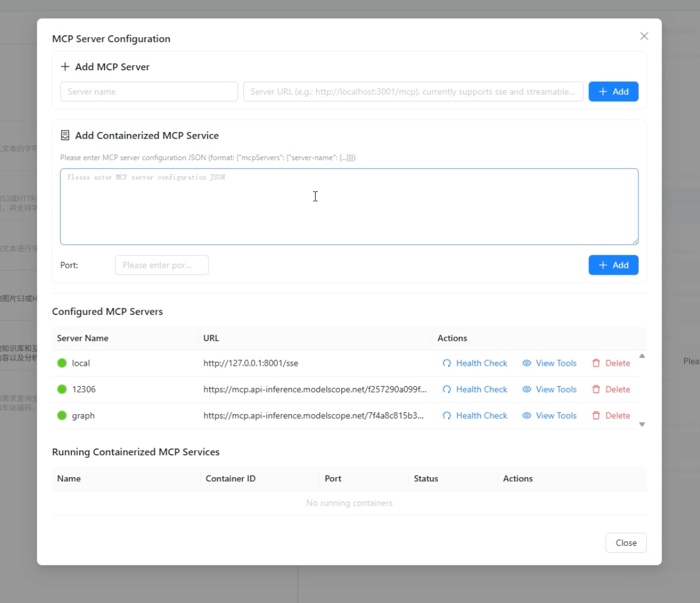
</div>

有许多第三方服务如 [ModelScope](https://www.modelscope.cn/mcp) 提供了 MCP 服务，您可以快速接入使用。
您也可以自行开发 MCP 服务并接入 Nexent 使用，参考文档 [MCP 工具开发](../../backend/tools/mcp)。

**3️⃣ 存量 API 转换为 MCP 服务**

🔔 该方法适用于将已有的 REST API 接口快速转换为 MCP 工具，无需额外开发即可让智能体调用现有 API 能力：

> 1.  在 MCP 配置模块选择 **"API 转换为 MCP"** 接入类型
> 2.  在下方的输入框中填写 API 基础信息：
>
> - **服务名称**：MCP 服务的展示名称
> - **OpenAPI JSON**：OpenAPI 3.x 规范的 JSON 内容
> - **基础服务 URL**：API 服务的基础地址（支持 http/https）
>
> 3.  点击右下角 **+ 添加** 按钮，完成对应 MCP 服务的转换

<div style="display: flex; justify-content: left;">
  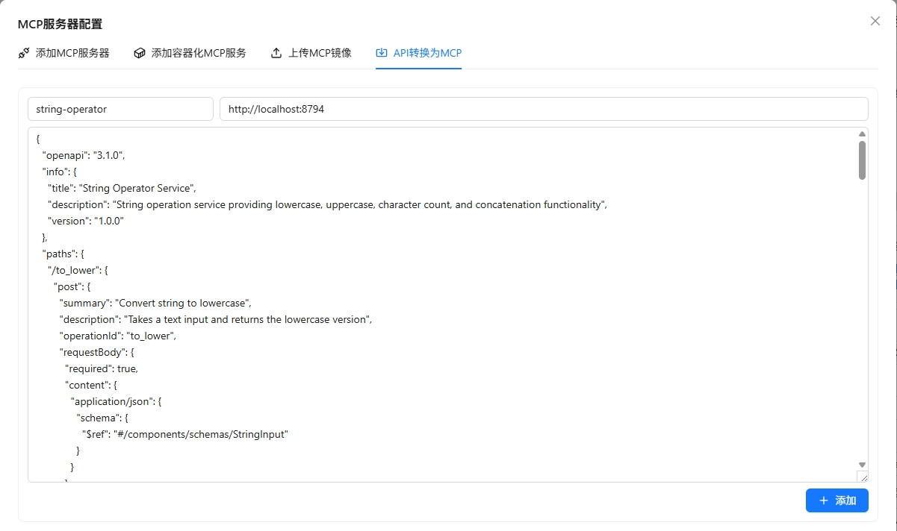
</div>

> 4.  转换完成后，可在 **Outer APIs** 页签下查看所有外部 API 转换的 MCP 工具

<div style="display: flex; justify-content: left;">
  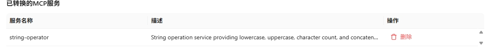
</div>
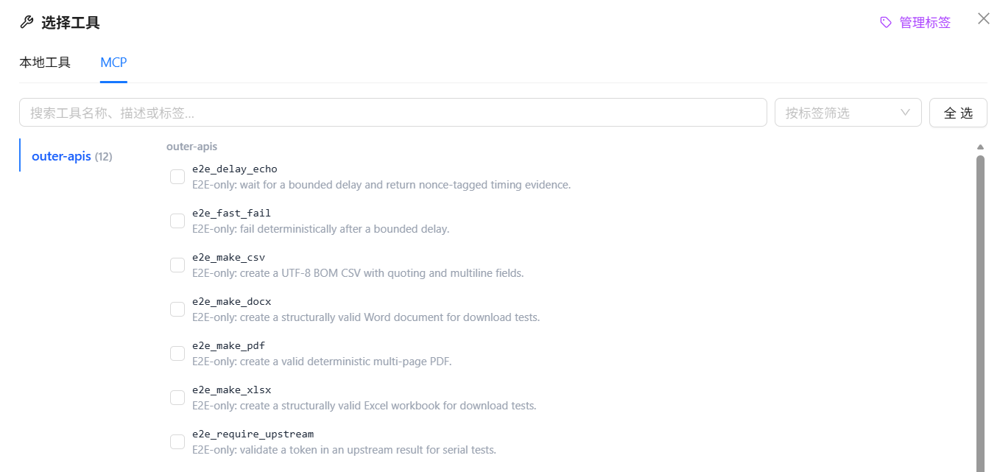


> 💡 **使用场景**：
>
> - 快速接入企业内部的 REST API 接口
> - 将第三方服务的 HTTP API 转换为 MCP 工具
> - 无需编写 MCP Server 代码，直接通过 OpenAPI 规范生成工具

### ⚙️ 自定义工具

您可参考以下指导文档，开发自己的工具，并接入 Nexent 使用，丰富智能体能力。

- [LangChain 工具指南](../../backend/tools/langchain)
- [MCP 工具开发](../../backend/tools/mcp)
- [SDK 工具文档](../../sdk/core/tools.md)

### 🔌 创建或导入技能

在智能体的高级配置中切换到“选择技能”页签，点击“构建技能”，即可通过对话生成或文件安装的方式创建技能。技能创建成功后会进入当前用户可访问的技能列表，但**不会自动关联到当前智能体**；完成创建后，还需要选择该技能并保存智能体配置。

#### 交互式创建技能 (NL2SKILL)

“交互式创建”适合从自然语言需求开始构建技能：

1. 点击“构建技能”，选择“交互式创建”页签。
2. 在左侧对话区描述技能的用途、执行步骤、输入输出以及限制条件。例如：“创建一个读取 CSV 文件并输出数据质量报告的技能”。
3. 系统会流式生成技能草稿。生成过程中可以停止生成，也可以继续对话，补充要求或要求系统修改已有草稿。
4. 在右侧草稿区检查并编辑技能信息与文件内容：
   - **技能名称**：必填，并且不能与现有技能重名。
   - **技能描述**：必填，用于说明技能的用途和适用场景。
   - **标签**：最多添加 5 个标签，每个标签不超过 20 个字符，便于后续搜索和筛选。
   - **用户组与组内权限**：根据需要设置技能的可见范围及编辑权限；仅在当前账号具备相关权限时显示或允许修改。
   - **技能文件**：`SKILL.md` 是技能的主文件，不可重命名或删除；还可以新增、编辑、重命名或删除脚本、资源文件等其他文件。
5. 确认草稿内容后，点击“创建”。如果技能名称已存在，请修改名称后重新创建。

#### 从文件安装技能

“安装”页签用于导入已经准备好的技能文件。点击上传区域选择文件，或将文件拖入上传区域。每次只能上传一个文件，支持以下格式：

| 文件格式 | 适用场景 | 文件要求 |
| --- | --- | --- |
| `.md` | 仅包含主说明文件的单文件技能 | 文件应为完整的 `SKILL.md`，并在 YAML Front Matter 中包含 `name` 和 `description` |
| `.zip` | 包含脚本、资源或其他辅助文件的多文件技能 | 压缩包中必须包含 `SKILL.md`；该文件可以位于压缩包根目录或某个子目录中，其他文件会随技能一并导入 |

`SKILL.md` 的基本结构示例如下：

```markdown
---
name: csv-report
description: 分析 CSV 文件并生成数据质量报告
tags:
  - data-analysis
---

# CSV 数据质量报告

在用户提供 CSV 文件后，检查缺失值、重复数据和字段类型，并输出结构化报告。
```

上传后，系统会从 `SKILL.md` 中读取技能名称和描述，并展示解析结果。确认无误后点击“创建”完成安装。

> ⚠️ **导入限制**：
>
> - `SKILL.md` 必须包含有效的 YAML Front Matter，并提供 `name` 和 `description`；缺少任一字段都将导致导入失败。
> - `SKILL.md` 编码格式必须为`UTF-8`。
> - 导入不会覆盖同名技能。如果名称已存在，请修改 `SKILL.md` 中的 `name`，然后重新上传。
> - 多文件技能应先将技能目录压缩为 `.zip`，并确保压缩包内包含 `SKILL.md`。

#### 将新技能关联到智能体

技能创建或安装成功后，按以下步骤将其用于当前智能体：

1. 如列表尚未更新，点击“刷新技能”。
2. 点击“选择技能”，通过名称、描述或标签找到新技能并选中。
3. 如果技能包含需要填写的参数，点击 ⚙️ 完成参数配置。
4. 返回智能体配置页保存配置。之后，该智能体才可以在运行过程中使用此技能。

有关技能的查看、编辑、权限和删除等完整管理方式，请参阅 [技能管理](../resource-repository/skill-repository.md)。

### 🧪 工具测试

无论是什么类型的工具（内置工具、外部接入的 MCP 工具，还是自定义开发工具），Nexent 都提供了"工具测试"能力。如果您在创建智能体时不确定某个工具的效果，可以使用测试功能来验证工具是否按预期工作。

1. 点击工具的小齿轮按钮 ⚙️，进入工具的详细配置弹窗
2. 首先确保已经配置了工具的必备参数（带红色星号的参数）
3. 在弹窗的左下角点击"工具测试"按钮
4. 右侧会新弹出一个测试框
5. 在测试框中输入测试工具的入参，例如：
   - 测试本地知识库检索工具 `knowledge_base_search` 时，需要输入：
     - 测试的 `query`，例如"维生素C的功效"
     - 检索的模式 `search_mode`（默认为 `hybrid`）
     - 目标检索的知识库列表 `index_names`，如 `["医疗", "维生素知识大全"]`
   - 若不输入 `index_names`，则默认检索知识库页面所选中的全部知识库
     - 是否启用重排模型（默认为 `false`），启用后配置重排模型，实现对检索结果的重排优化
6. 输入完成后点击"执行测试"开始测试，并在下方查看测试结果

<div style="display: flex; justify-content: left;">
  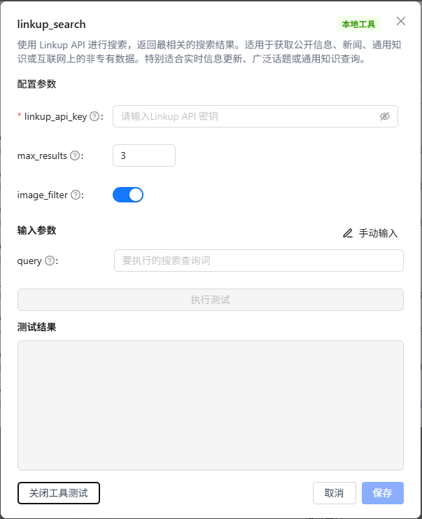
</div>

## 📝 描述业务逻辑

### ✍️ 描述智能体应该如何工作

在“智能生成”面板中直接描述业务目标、使用对象、输入输出和限制条件。系统会分阶段澄清需求、查找资源并生成草稿，避免一次生成后还需要手动补齐大量信息。

1. **描述需求**：说明智能体要解决的问题，例如“创建一个面向售后人员的产品问答助手，优先使用内部知识库，回答时给出来源”。
2. **澄清需求**：系统在信息不足时显示问题卡片。选择合适的选项，也可以在“其他”中补充说明后提交。
3. **应用草稿**：系统生成智能体描述、职责提示词、约束提示词、示例、开场白和示例问题后，点击“应用到草稿”，再在配置面板中检查结果。

生成或资源绑定进行中时，配置表单会暂时锁定，避免人工编辑与生成结果互相覆盖。如生成异常或不想继续等待，可点击“解除锁定”；该操作会停止当前生成，再恢复手动编辑。

<div style="display: flex; justify-content: center;">
  
</div>


#### 📋 智能体基础信息配置

配置面板的“基本设置”包含五个可折叠区域：

| 区域 | 主要配置 |
| --- | --- |
| **展示信息** | 图标、展示名称、变量名、作者和简介 |
| **模型与提示词** | 大语言模型、职责提示词、约束提示词和示例提示词 |
| **工具与技能** | 智能体可以调用的工具、Skill 及其参数 |
| **运行策略** | 最大步数、输出预留、运行摘要、自验证和会话 Metadata 开关 |
| **发布属性** | 用户组、组内权限、是否为主智能体以及 A2A 发布设置 |

智能体变量名只能包含字母、数字和下划线，且必须以字母或下划线开头。建议使用能体现用途的英文名称，例如 `code_assistant` 或 `data_analyst`。

“允许会话 Metadata”默认关闭。开启后，使用者可以在开始问答页面为每个会话填写 JSON 对象，并把业务标识、渠道或其他运行参数传给模型。Metadata 对模型可见，大小不能超过 64 KiB；不要在其中填写密码、访问令牌或其他敏感信息。

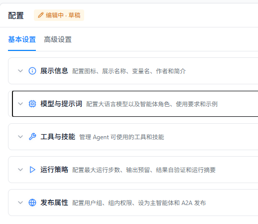


#### ⚙️ 高级设置

“高级设置”页签用于配置智能体与其他资源之间的关系：

##### 高级配置区域

| 区域 | 主要配置 |
| --- | --- |
| **协作智能体** | 添加内部智能体或外部 A2A Agent，并配置协作关系 |
| **知识库** | 选择智能体可检索的知识库；选择后会启用知识库检索能力并建立关联 |
| **会话引导** | 设置用户首次进入问答页面时看到的开场白和示例问题 |
| **安全护栏** | 配置内容匹配规则、命中后的处理动作和规则测试 |

知识库和协作智能体必须在当前账号的可访问范围内。导入或复制智能体后，应重新检查这些关联资源，因为其他环境中的资源标识和权限不会自动迁移。


##### 🚧安全护栏

安全护栏使用按顺序执行的正则表达式规则，检查发送给模型的内容以及工具调用过程中的数据。安全护栏默认关闭，且不依赖"自验证"开关；需要单独打开"规则列表"旁的开关，并至少配置一条有效规则。规则按列表顺序匹配，同一段内容以首个命中的规则为准。

每条规则包含以下配置：

| 配置项           | 说明                                                                                                                      |
| ---------------- | ------------------------------------------------------------------------------------------------------------------------- |
| **规则名称**     | 规则的唯一标识。名称重复时界面会给出提示，建议使用能表达检测目标的名称。                                                  |
| **正则表达式**   | 使用 Python `re` 语法描述要匹配的内容。运行时默认忽略大小写；语法无效的规则不会参与运行时检查。                          |
| **严重级别**     | 指定命中后的处理方式：**阻断**、**脱敏**或**放行**。新建规则默认为"阻断"。                                             |
| **说明**         | 可选的规则用途说明，便于维护和审查。                                                                                      |

不同严重级别在各检查位置的实际行为如下：

| 严重级别 | 最新用户输入             | 历史消息                   | 工具入参                         | 工具输出                         |
| -------- | ------------------------ | -------------------------- | -------------------------------- | -------------------------------- |
| **阻断** | 终止本次运行并返回拒绝说明 | 降级为脱敏后再发送给模型   | 阻止本次工具调用                 | 因工具已经执行，降级为脱敏       |
| **脱敏** | 将命中内容替换为 `***` 后继续 | 将命中内容替换为 `***` 后继续 | 将命中的字符串参数替换为 `***` 后调用工具 | 将命中内容替换为 `***` 后写入智能体上下文 |
| **放行** | 不修改内容，继续运行     | 不修改内容，继续运行       | 不修改参数，继续调用             | 不修改输出，继续运行             |

安全护栏还提供以下辅助能力：

- **智能生成**：选择用于生成的模型，并用自然语言描述要匹配或拦截的内容。系统会自动判断生成单个候选表达式还是多条规则；确认候选或勾选规则后再导入列表。
- **规则管理**：支持手动添加、编辑、复制、单条删除和批量删除规则，并显示阻断、脱敏、放行规则的数量分布。
- **正则测试预览**：粘贴样本文本后，可以实时查看命中的文本、规则名称和命中次数。预览仅用于验证匹配效果，不会执行阻断或脱敏动作。

> ⚠️ **注意**：安全护栏是基于正则表达式的内容筛查，不等同于完整的语义安全审核。AI 生成的规则也可能存在误报或漏报；请先在"正则测试预览"中使用正常样本和风险样本进行验证，再保存配置。

## 🐛 调试与保存

配置面板顶部的“编辑中 · 草稿”表示当前修改尚未形成正式发布版本。完成初步配置后：

1. 点击“调试”。系统先校验并保存当前草稿，再打开调试面板。
2. 使用具有代表性的问题验证提示词、知识检索、工具调用和协作流程。
3. 根据运行过程和错误提示修改配置，然后再次调试。
4. 点击“发布”。系统再次保存草稿，并打开版本发布窗口。

只有发布成功的主智能体才会出现在“开始问答”等正式使用入口中。调试不会启用记忆检索和写入，因此跨会话记忆效果需要在“开始问答”中验证。

::: info 截图待补充
**截图内容**：配置底部的“解除锁定 / 调试 / 发布”按钮、右侧调试面板和“编辑中 · 草稿”状态。

**建议文件**：`doc/docs/zh/user-guide/assets/agent-development/agent-debug-publish.png`
:::

## 🐛 版本管理

Nexent 支持智能体的版本管理，您可以在调试过程中，保存不同版本的智能体配置。

确认智能体配置无误后，您可点击"发布"按钮正式发布智能体。发布后智能体将在 Agent 仓库、开始问答中可见，并可进行历史版本管理。

点击"版本管理"栏目右下角的版本对比按钮，可以回顾历史版本的信息，并与最新版本的问答效果进行对比。

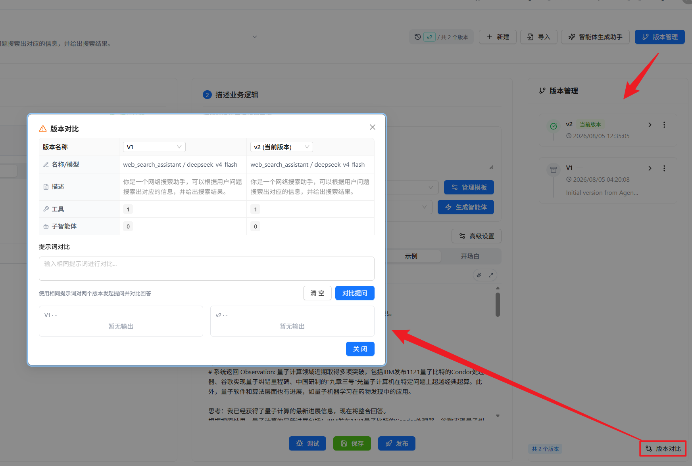

若需回滚到其他版本，可在版本右侧的菜单中点击"回滚"。

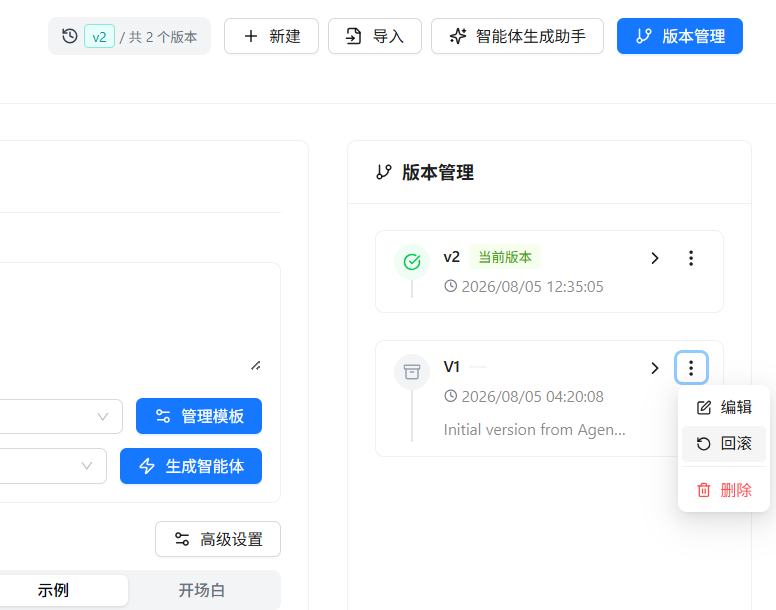

### 🚀 发布为 A2A Agent

Nexent 支持将已发布的智能体作为 A2A Agent 暴露给外部系统调用。在发布版本时，您可以勾选"发布为 A2A Agent"选项，将当前智能体注册为符合 A2A 1.0 规范的 Agent。

<div style="display: flex; justify-content: left;">
  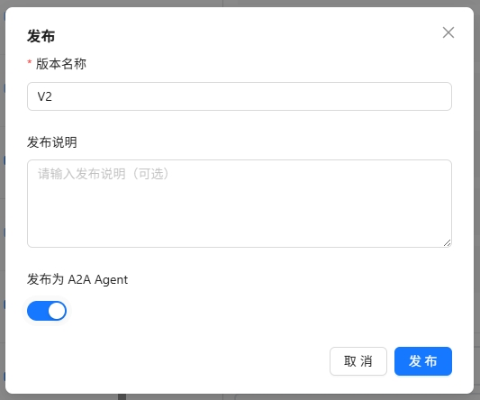
</div>

发布成功后，系统会显示 A2A Agent 的调用信息，包括：

<div style="display: flex; justify-content: left;">
  
</div>

| 信息项             | 说明                                              |
| ------------------ | ------------------------------------------------- |
| **Endpoint ID**    | A2A Agent 的唯一标识符                            |
| **Agent Card URL** | Agent 发现端点，外部系统通过此地址获取 Agent 描述 |
| **协议版本**       | A2A 协议版本，当前为 1.0                          |
| **REST 端点**      | 基于 REST 风格的 API 端点                         |
| **JSON-RPC 端点**  | 基于 JSON-RPC 2.0 协议的调用端点                  |

#### 调用方式

发布后的 A2A Agent 支持以下两种调用协议：

##### REST API

```bash
# 获取 Agent Card（用于 Agent 发现）
GET /nb/a2a/{endpoint_id}/.well-known/agent-card.json

# 发送同步消息
POST /nb/a2a/{endpoint_id}/message:send
Content-Type: application/json

{
  "message": {
    "role": "user",
    "content": "请帮我完成某个任务"
  }
}

# 发送流式消息（SSE）
POST /nb/a2a/{endpoint_id}/message:stream
Content-Type: application/json

{
  "message": {
    "role": "user",
    "content": "请帮我完成某个任务"
  }
}

# 获取任务状态
GET /nb/a2a/{endpoint_id}/tasks/{task_id}
```

##### JSON-RPC 2.0

```bash
POST /nb/a2a/{endpoint_id}/v1
Content-Type: application/json

# 发送同步消息
{
  "jsonrpc": "2.0",
  "method": "SendMessage",
  "params": {
    "message": {
      "role": "user",
      "content": "请帮我完成某个任务"
    }
  },
  "id": 1
}

# 发送流式消息
{
  "jsonrpc": "2.0",
  "method": "SendStreamingMessage",
  "params": {
    "message": {
      "role": "user",
      "content": "请帮我完成某个任务"
    }
  },
  "id": 2
}

# 获取任务状态
{
  "jsonrpc": "2.0",
  "method": "GetTask",
  "params": {
    "taskId": "task_abc123"
  },
  "id": 3
}
```

> 💡 **提示**：
>
> - 本地开发时，如果使用 docker 启动：请将路径前面的 `/nb/a2a` 部分替换为 `http://localhost:5013/nb/a2a`；如果通过 k8s 启动，请使用 `http://localhost:30013/nb/a2a`
> - 生产环境请将路径替换为您的服务器域名或公网 IP 地址

> ⚠️ **注意事项**：
>
> - 调用 A2A Agent 需要在请求头中携带有效的认证信息
> - Agent Card 信息会被缓存，刷新间隔为 1 小时
> - 如需更新 Agent 信息，需要重新发布智能体版本

当发布的Agent为符合A2A协议的Agent时，在智能体列表中，点击最左侧的icon查看A2A Agent调用具体信息


## 🔧 管理智能体清单

点击"选择智能体"，您可浏览当前环境中可以编辑的完整智能体清单。你可以在上方的搜索框中


智能体条目右侧的一系列icon按钮代表了你可以对智能体执行的所有管理操作。从左至右分别为：

### 📋 复制

创建完全一致的 Agent 克隆体，便于多版本备份或并行测试。

### 🔗 查看调用关系

查看智能体所使用的协作智能体/工具，以树状图形式明晰查看智能体调用关系。

<div style="display: flex; justify-content: left;">
  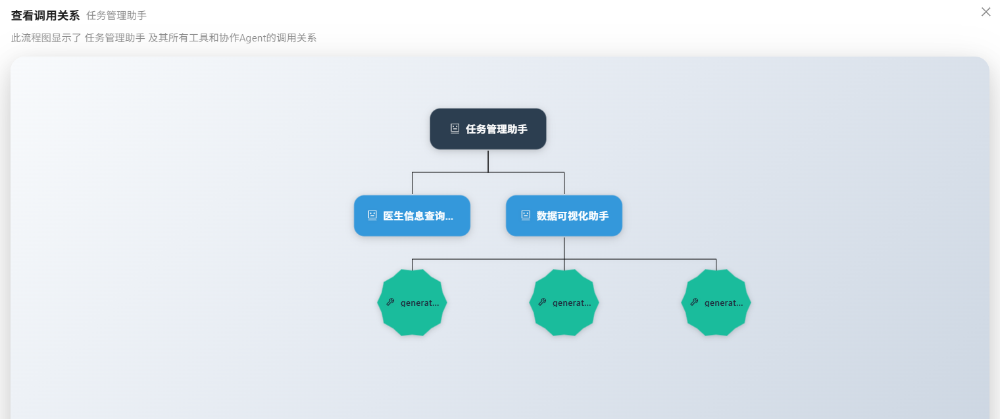
</div>

### 📤 导出

可将调试成功的智能体导出为 JSON 或 Zip 文件，在创建智能体时可以使用此文件以导入的方式创建副本。含有技能的复杂智能体将默认被导出为 Zip 压缩包。

### 🗑️ 删除

从本地环境中彻底删除智能体。

## 🚀 下一步

完成智能体开发后，您可以：

1. 在 **[Agent仓库](../agent-development.md)** 中管理、发布你的智能体，或获取更多其他开发者的智能体
2. 在 **[开始问答](../start-chat.md)** 中与智能体进行交互
3. 在 **[记忆管理](./memory-configuration.md)** 配置记忆以提升智能体的个性化能力

如果您在使用程中遇到任何问题，请参考我们的 **[常见问题](../../quick-start/faq.md)** 或在 [GitHub Discussions](https://github.com/ModelEngine-Group/nexent/discussions) 中进行提问获取支持。
