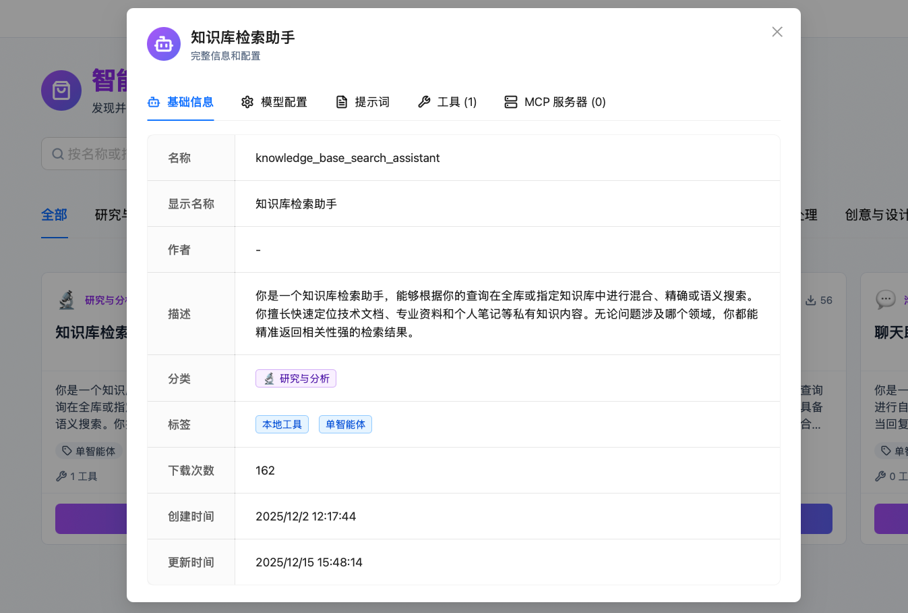
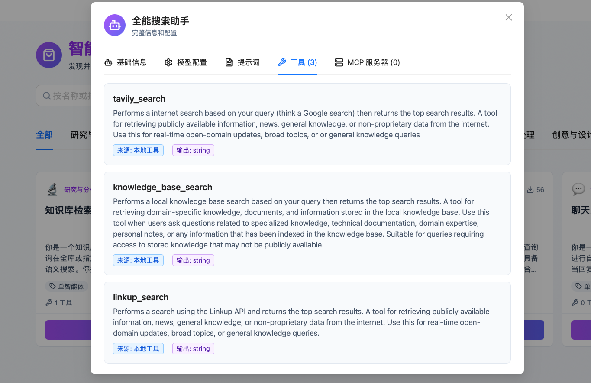
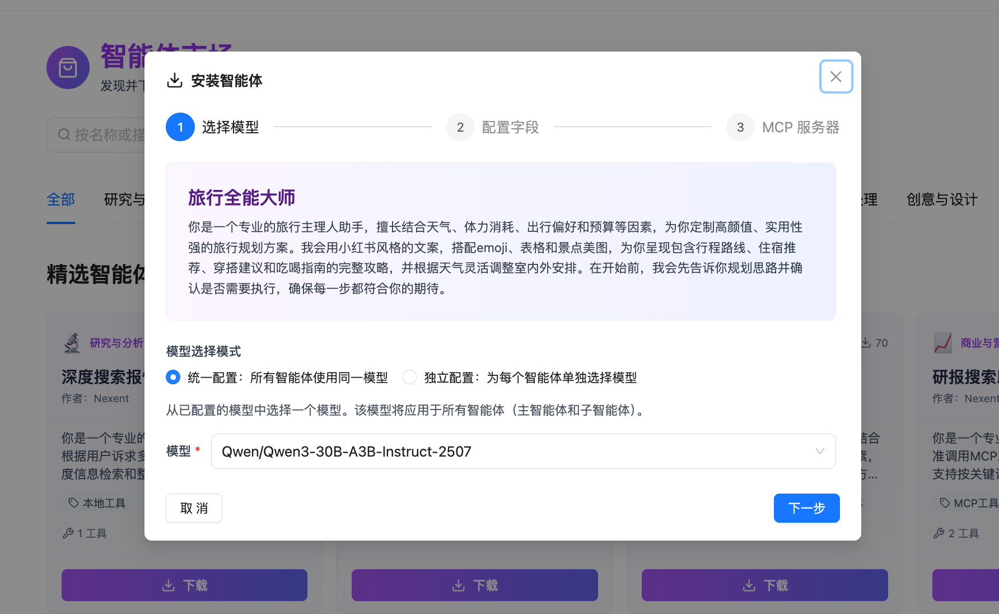
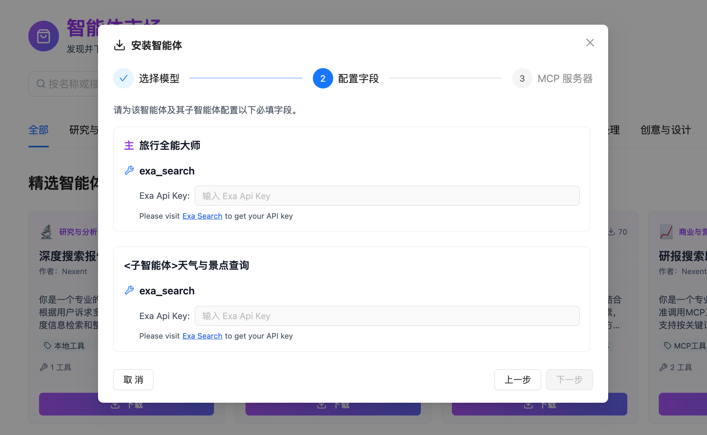

# 智能体市场

🎁 这里汇集了由 **Nexent 官方**与**社区创作者**打造的高质量智能体

您可以直接使用它们完成具体任务，或将其作为子智能体，组合进自己的智能体中

## 🔍 探索与发现

您可以通过以下方式快速找到最优的智能体：

1. 按使用场景分类浏览或搜索
2. 查看智能体的功能简介，确认是否符合您的需求 🆗
3. 查看内置工具，确认是否已就绪或可获取 ✅

  

  

## 🔧 安装智能体

选择心仪的智能体，一键下载，即刻加入您的智能体空间

### 1️⃣ 选择模型

🌟 确认模型可用

✍️ 为智能体统一配置同一个模型，或为主智能体和子智能体分别选配合适的模型

### 2️⃣ 配置字段

🔑 依据提示补充工具许可

安装完成后，您的智能体会在 **[智能体空间](./agent-space)** 准备好

## 📢 分享您的创作

创作了优秀的智能体？ 👍

欢迎在 [GitHub Discussions](https://github.com/ModelEngine-Group/nexent/discussions) 中分享您的作品，我们会尽快与您取得联系，让更多人看到并使用它！

## 🚀 相关功能

在等待智能体市场上线期间，您可以：

1. 在 **[智能体空间](./agent-space)** 中管理您自己的智能体
2. 通过 **[智能体开发](./agent-development)** 创建专属智能体
3. 在 **[开始问答](./start-chat)** 中体验智能体的强大功能

如果您使用过程中遇到任何问题，请参考我们的 **[常见问题](../quick-start/faq)** 或在 [GitHub Discussions](https://github.com/ModelEngine-Group/nexent/discussions) 中进行提问获取支持。
