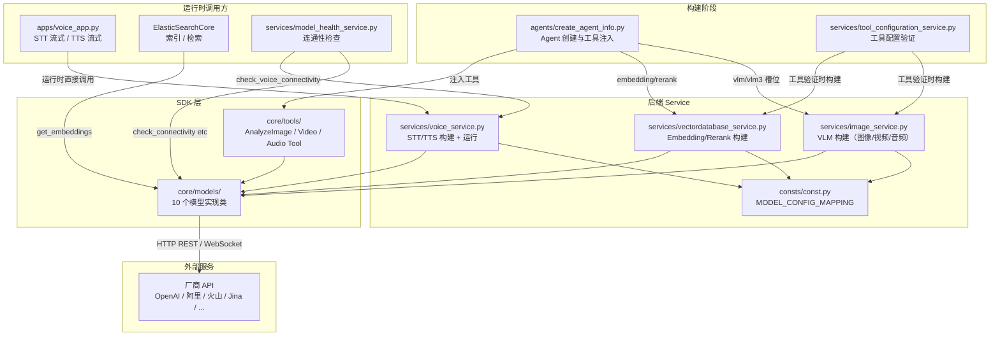
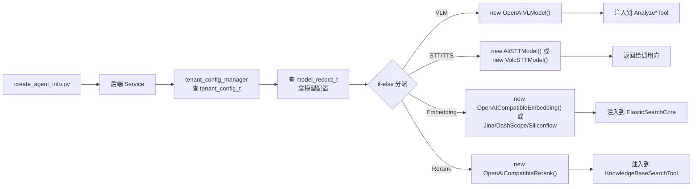
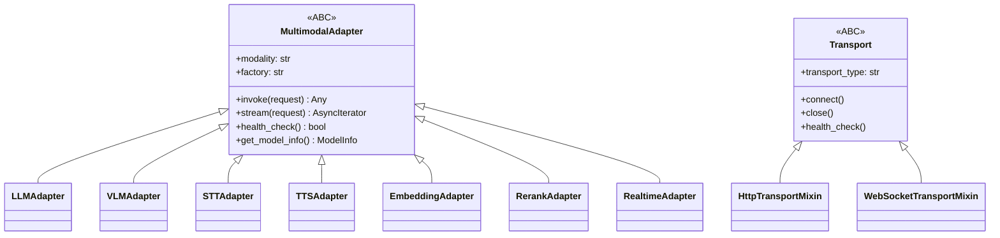
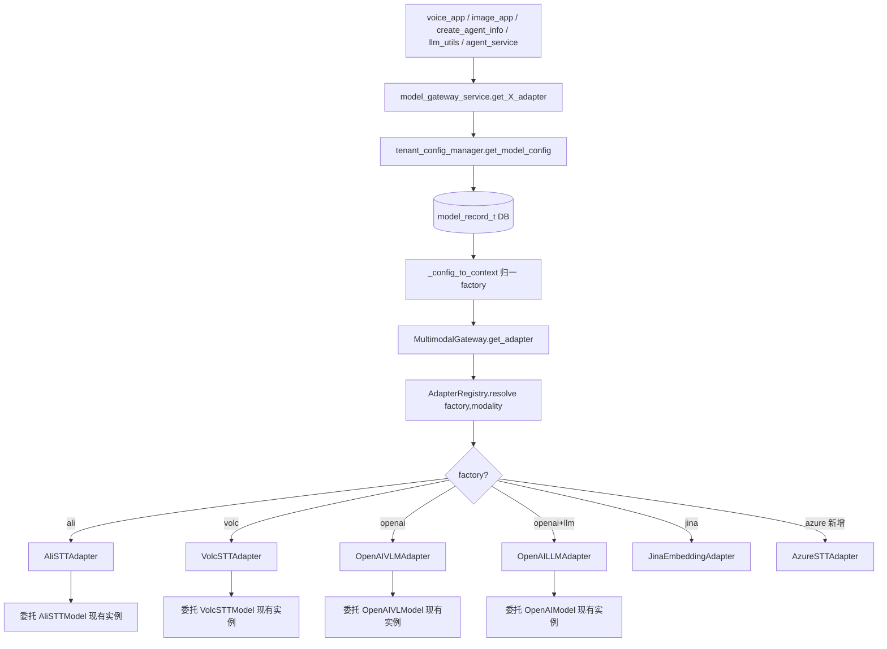

# Nexent 多模态模型统一适配网关需求设计文档

| 日期               | 版本          | 修改描述                                                                                              | 作者   |
| ------------------ | ------------- | --------------------------------------------------------------------------------------------------- | ------ |
| 2026-08-03 ~ 08-06 | v1.0 ~ v1.9   | 初创及迭代：现状梳理（VLM/STT/TTS/Embedding/Rerank）、业界协议全景与覆盖差距、Adapter 层详细设计（传输层 Mixin + 模态子接口 + 注册表 + 网关 + 三阶段迁移）、LLMAdapter 纳入（`__call__`/`__getattr__` 兼容 CoreAgent） | Nexent |
| 2026-08-07         | v2.0          | 全面瘦身合一：§2+§3 合并，§4+§5 合并为新 §3，消除三重痛点重复，类图精简为 ABC 骨架，验收精简为 5 条                          | Nexent |
| 2026-08-07         | v2.1          | §3.15 新增 ModelEngine 厂商接入示例：HTTP 式 STT/TTS 复用 OpenAI 协议，协议转换放 Adapter 层，服务层零改动                          | Nexent |

---

## 1. 背景与问题

### 1.1 现状概述

Nexent 是零代码 AI Agent 自动生成平台。Agent 跑起来要能看图、看视频、听音频，还得有语音输入（STT）和语音输出（TTS）。但现在多模态模型的适配散在 SDK 层好几个文件里，各模态协议完全不同，没有一个统一的抽象层把它们拢起来。

### 1.2 核心问题

| 问题维度     | 说明                                                         |
| ------------ | ------------------------------------------------------------ |
| 协议碎片化   | VLM 走 OpenAI Chat Completions（HTTP REST），STT/TTS 走 WebSocket 且阿里与火山引擎协议完全不同 |
| 适配逻辑分散 | VLM 构建在 `image_service.py`，STT/TTS 分派在 `voice_service.py`，无统一入口 |
| 厂商硬编码   | `voice_service.py` 中 `if model_factory == "volc"` 硬编码分派，新增厂商得改服务层代码 |
| 缺乏协议抽象 | STT/TTS 基类 `BaseSTTModel`/`BaseTTSModel` 只定义了 WebSocket 接口，REST 式语音 API 接不上 |
| 模态间割裂   | 图像/视频/音频理解复用同一个 `OpenAIVLModel`，但 STT/TTS 是完全独立的类体系，没法统一管 |

### 1.3 预期效果

网关建起来之后，几个老场景会变成这样：

| 场景                     | 实现前                                       | 实现后                                             |
| ------------------------ | ------------------------------------------ | ------------------------------------------------ |
| 新增语音厂商（如 Azure）  | 需新写 `AzureSTTModel` + 改 `voice_service` 分派 | 写一个 Adapter，网关自动路由                         |
| 切换 VLM 厂商             | 仅支持 OpenAI 协议厂商                        | 支持 OpenAI / Anthropic / Gemini 等多协议厂商         |
| 统一多模态管理            | VLM 和 STT/TTS 配置分离，没有统一视图             | 网关统一注册、健康检查、容量管理                        |
| 实时语音对话              | 不支持                                      | 支持 OpenAI Realtime API 等实时流式协议               |

---

## 2. 当前多模态模型支持现状

### 2.1 模型类型与槽位

后端 `backend/consts/const.py` 定义了模型配置映射，当前模型的种类如下：

```python
MODEL_CONFIG_MAPPING = {
    "llm": "LLM_ID",
    "embedding": "EMBEDDING_ID",
    "multiEmbedding": "MULTI_EMBEDDING_ID",
    "rerank": "RERANK_ID",
    "vlm": "VLM_ID",       # 图像理解
    "vlm2": "VLM2_ID",     # 第二 VLM 槽位（预留）
    "vlm3": "VLM3_ID",     # 视频/音频理解
    "stt": "STT_ID",       # 语音转文字
    "tts": "TTS_ID",       # 文字转语音
}
```

### 2.2 VLM（视觉语言模型）— 图像/视频/音频理解

| 属性         | 值                                                                                  |
| ------------ | ---------------------------------------------------------------------------------- |
| SDK 类        | `OpenAIVLModel`（继承 `OpenAIModel` → smolagents `OpenAIServerModel`）                |
| 代码位置      | `sdk/nexent/core/models/openai_vlm.py`                                                |
| 协议          | **OpenAI Chat Completions API**（HTTP REST，`client.chat.completions.create`）           |
| 支持模态      | 图像（`image_url`）、音频（`audio_url`）、视频（`video_url`），均以 base64 data URL 传输    |
| 后端构建      | `backend/services/image_service.py` → `_build_vlm_model()`                              |
| 槽位分派      | `vlm` → 图像理解（`get_vlm_model()`）；`vlm3` → 视频/音频理解（`get_video_understanding_model()`） |
| Agent 工具注入 | `backend/agents/create_agent_info.py` 第 1478-1489 行                                   |

VLM 消息格式示例：

```json
{
  "role": "user",
  "content": [
    {"type": "image_url", "image_url": {"url": "data:image/png;base64,..."}},
    {"type": "text", "text": "描述这张图片"}
  ]
}
```

视频消息额外携带 `detail`、`max_frames`、`fps` 参数。

### 2.3 STT（语音转文字）

| 属性         | 阿里云                                              | 火山引擎                                                |
| ------------ | -------------------------------------------------- | ---------------------------------------------------- |
| SDK 类        | `AliSTTModel`                                       | `VolcSTTModel`                                        |
| 代码位置      | `sdk/nexent/core/models/ali_stt_model.py`            | `sdk/nexent/core/models/volc_stt_model.py`            |
| 基类          | `BaseSTTModel`                                      | `BaseSTTModel`                                       |
| 协议          | **WebSocket**（JSON over WS）                       | **WebSocket**（私有二进制帧协议）                        |
| 端点          | `wss://dashscope.aliyuncs.com/api-ws/v1/realtime`    | `wss://openspeech.bytedance.com/api/v3/sauc/bigmodel` |
| 默认模型      | `qwen3-asr-flash-realtime`                          | `volc.bigasr.sauc.duration`                          |
| 认证          | API Key（Bearer）                                    | AppID + Access Token                                 |
| 音频格式      | PCM 16kHz 单声道                                     | PCM 16kHz 单声道                                      |
| 特性          | VAD、分段识别                                        | Gzip 压缩、流式                                       |
| 后端分派      | `voice_service.py` → `_get_stt_model_from_config()`  | 同左（`model_factory == "volc"` 时选用）                  |

### 2.4 TTS（文字转语音）

| 属性         | 阿里云                                              | 火山引擎                                                |
| ------------ | -------------------------------------------------- | ---------------------------------------------------- |
| SDK 类        | `AliTTSModel`                                       | `VolcTTSModel`                                        |
| 代码位置      | `sdk/nexent/core/models/ali_tts_model.py`            | `sdk/nexent/core/models/volc_tts_model.py`            |
| 基类          | `BaseTTSModel`                                      | `BaseTTSModel`                                       |
| 协议          | **WebSocket**（JSON over WS）                       | **WebSocket**（私有二进制帧协议）                        |
| 端点          | `wss://dashscope.aliyuncs.com/api-ws/v1/inference`  | `wss://openspeech.bytedance.com/api/v1/tts/ws_binary` |
| 默认模型      | `cosyvoice-v2`                                      | `seed-tts-2.0`                                       |
| 认证          | API Key                                             | AppID + Token                                         |
| 输出格式      | MP3 16kHz                                           | MP3                                                  |
| 后端分派      | `voice_service.py` → `_get_tts_model_from_config()`  | 同左                                                  |

### 2.5 文本向量模型（Text Embedding）

| 属性         | 值                                                                                  |
| ------------ | ---------------------------------------------------------------------------------- |
| SDK 类        | `OpenAICompatibleEmbedding`（继承 `TextEmbedding` → `BaseEmbedding(ABC)`）           |
| 代码位置      | `sdk/nexent/core/models/embedding_model.py`                                          |
| 协议          | **OpenAI Embeddings API**（HTTP REST，`POST /v1/embeddings`）                          |
| 输入格式      | `{"model": "...", "input": "text" 或 ["text1", "text2", ...]}`                          |
| 输出格式      | `{"data": [{"embedding": [0.1, 0.2, ...]}, ...]}`                                    |
| 后端构建      | `backend/services/vectordatabase_service.py` → `_create_embedding_model()`            |
| 配置读取      | `MODEL_CONFIG_MAPPING["embedding"]` → `EMBEDDING_ID`；从 DB 按 `model_type="embedding"` 查    |
| 连通性检查    | `dimension_check(timeout)` — 和 VLM/STT/TTS 的方法名不同                                 |
| 槽位          | 无独立槽位，按 `model_type` 从 `model_record_t` 表查                                   |

文本向量走的是标准 OpenAI Embeddings REST 协议，输入一串文本，返回一组 float 向量。和 VLM/STT/TTS 不一样的地方在于，它没有独立的槽位配置键，后端直接按 `model_type="embedding"` 从数据库模型表里查记录，拿到 `base_url`、`api_key`、`model_name` 后 new 一个 `OpenAICompatibleEmbedding` 出来。

### 2.6 多模态向量模型（Multimodal Embedding）

| 属性         | Jina                                          | DashScope                                        | Siliconflow                                        |
| ------------ | --------------------------------------------- | ------------------------------------------------ | -------------------------------------------------- |
| SDK 类        | `JinaEmbedding`                                | `DashScopeMultimodalEmbedding`                    | `SiliconflowMultimodalEmbedding`                    |
| 代码位置      | `sdk/nexent/core/models/embedding_model.py`    | 同左                                              | 同左                                                |
| 基类          | `MultimodalEmbedding` → `BaseEmbedding(ABC)`   | 同左                                              | 同左                                                |
| 协议          | HTTP REST                                      | HTTP REST                                        | HTTP REST                                          |
| 默认模型      | `jina-clip-v2`                                 | `tongyi-embedding-vision`                        | `Qwen/Qwen3-VL-Embedding-8B` 等                     |
| 认证          | API Key（Bearer）                               | API Key（Bearer）                                 | API Key（Bearer）                                   |
| 后端分派      | `_create_embedding_model()` 中 else 分支（默认）   | `model_factory == "dashscope"`                   | `model_factory == "silicon"`                       |

三个厂商都走 HTTP REST，但输入格式各搞各的，这是最头疼的地方。

**Jina 格式**，输入是 `List[Dict]`，文本和图片各是一个 dict

```json
{
  "model": "jina-clip-v2",
  "input": [{"text": "一段文字"}, {"image": "data:image/png;base64,..."}],
  "truncate": true
}
```

**DashScope 格式**，多了一层 `contents` 包装

```json
{
  "model": "tongyi-embedding-vision",
  "input": {"contents": [{"text": "一段文字"}, {"image": "data:image/png;base64,..."}]}
}
```

**Siliconflow 格式**，文本直接是 string，图片是 dict，混在一个 flat list 里

```json
{
  "model": "Qwen3-VL-Embedding-8B",
  "input": ["一段文字", {"image": "data:image/png;base64,..."}]
}
```

三个类各自在 `_prepare_multimodal_input()` 里做格式转换，`get_multimodal_embeddings()` 的对外接口签名一样，但内部发的 HTTP body 完全不同。连通性检查都叫 `dimension_check()`，而且都要读一张测试图片 `assets/test.png` 来跑连通性。

### 2.7 重排序模型（Rerank）

| 属性         | 值                                                                                  |
| ------------ | ---------------------------------------------------------------------------------- |
| SDK 类        | `OpenAICompatibleRerank`（继承 `BaseRerank(ABC)`）；另有 `JinaRerank`、`CohereRerank` 子类     |
| 代码位置      | `sdk/nexent/core/models/rerank_model.py`                                             |
| 协议          | **HTTP REST**，但有两种请求体格式                                                      |
| 后端构建      | `backend/services/vectordatabase_service.py` → `get_rerank_model()`                 |
| 配置读取      | `MODEL_CONFIG_MAPPING["rerank"]` → `RERANK_ID`；也支持按 `model_type="rerank"` 从 DB 查      |
| 连通性检查    | `connectivity_check(timeout)` — 和 Embedding 的 `dimension_check`、VLM 的 `check_connectivity` 都不一样    |
| 工具注入      | `backend/agents/create_agent_info.py` 第 1425 行，注入到 `KnowledgeSearchTool`        |

Rerank 协议虽然走 HTTP REST，但请求体有两种格式，在 `_prepare_request()` 里靠 URL 字符串嗅探来区分。如果 `base_url` 里带 `dashscope` 就走 DashScope 格式，否则走 OpenAI 兼容格式。

**OpenAI 兼容格式**

```json
{
  "model": "rerank-model",
  "query": "搜索词",
  "documents": ["文档1", "文档2"],
  "top_n": 2
}
```

**DashScope 格式**，query 和 documents 包在 `input` 里，top_n 包在 `parameters` 里

```json
{
  "model": "qwen3-rerank",
  "input": {"query": "搜索词", "documents": ["文档1", "文档2"]},
  "parameters": {"top_n": 2}
}
```

响应解析也有两套，DashScope 返回 `{"output": {"results": [...]}}`，OpenAI 兼容返回 `{"results": [...]}`，在 `rerank()` 里用 `response.get("results") or response.get("output", {}).get("results", [])` 兼容。

### 2.8 Agent 多模态工具

| 工具               | 代码位置                                         | 注入的模型            | 用途               |
| ------------------ | ----------------------------------------------- | -------------------- | ------------------ |
| `AnalyzeImageTool`  | `sdk/nexent/core/tools/analyze_image_tool.py`    | `vlm` 槽位 VLM       | 图像理解与分析       |
| `AnalyzeVideoTool`  | `sdk/nexent/core/tools/analyze_video_tool.py`     | `vlm3` 槽位 VLM      | 视频理解与分析       |
| `AnalyzeAudioTool`  | `sdk/nexent/core/tools/analyze_audio_tool.py`     | `vlm3` 槽位 VLM      | 音频理解与分析       |

> 注意，音频理解复用的是视频理解 VLM 模型（`vlm3` 槽位），通过 `prepare_media_message()` 把音频编码成 `audio_url` 消息块发给 VLM。

### 2.9 架构总览



这张图区分了构建阶段和运行时：

**构建阶段**有两条入口：`create_agent_info.py` 是 Agent 组装时注入模型到工具（VLM → Analyze 工具、Embedding/Rerank → 知识库搜索工具）；`tool_configuration_service.py` 是工具配置验证时也会构建模型实例。两条入口都调后端 service 的 `get_*_model()` 方法。

**运行时调用方**不是 `create_agent_info.py`，而是三个不同的入口：`voice_app.py`（HTTP 端点）直接调 `voice_service` 的 `start_stt_streaming_session()` / `stream_tts_to_websocket()` 跑实时语音；`ElasticSearchCore` 调 `embedding_model.get_embeddings()` 做向量检索；`model_health_service.py` 调各模型的连通性检查方法。

几个值得注意的点：
- `image_service.py` 文件名是历史遗留，实际管所有 VLM 槽位——`get_vlm_model()` 对应 `vlm` 槽位（图像理解），`get_video_understanding_model()` 对应 `vlm3` 槽位（视频 + 音频理解），三个 Analyze 工具的模型都从这里出。
- STT/TTS 的构建和运行时都在 `voice_service.py` 里，而且运行时不经过 `create_agent_info.py`——是 `voice_app.py` 直接调 `voice_service`。

### 2.10 碎片化细节

三个细节值得注意：**连通性检查方法名不统一**（VLM/STT/TTS 叫 `check_connectivity()`，Embedding 叫 `dimension_check()`，Rerank 叫 `connectivity_check()`）；**Ali TTS 内置两套子协议**（CosyVoice 和 Qwen Realtime，靠 URL 含 `/realtime` 切换）；**Rerank URL 嗅探**（`"dashscope" in base_url` 切换请求体格式）。这些碎片化是 §3 协议全景差距和 §3 网关设计的核心动因。

### 2.11 调用链路与分派差异

四种模态的调用链路结构高度相似，差异在分派逻辑：



各模态在分派环节的差异：

| 模态 | 入口方法 | 配置来源 | 分派方式 | 注入目标 |
| ---- | -------- | -------- | -------- | -------- |
| VLM | `get_vlm_model()` / `get_video_understanding_model()` | `MODEL_CONFIG_MAPPING["vlm"]` 或 `["vlm3"]` → 两表查询 | 无分派，直接 new `OpenAIVLModel` | `AnalyzeImageTool` / `AnalyzeVideoTool` / `AnalyzeAudioTool` |
| STT | `_get_stt_model_from_tenant_config()` | `get_model_config(tenant_id, "stt")` | `if model_factory in ["volc",...]` → `VolcSTTModel`，else → `AliSTTModel` | 返回给 VoiceService 调用方 |
| TTS | `_get_tts_model_from_tenant_config()` | `get_model_config(tenant_id, "tts")` | 同 STT 的 if-else 结构 | 返回给 VoiceService 调用方 |
| Embedding | `get_embedding_model()` | `get_model_records({"model_type": ...})` 按 type 查 | `model_type` × `model_factory` 四路 if-else 嵌套 | `ElasticSearchCore` 索引/检索 |
| Rerank | `get_rerank_model()` | 按 `model_name` 查 DB，或回退到 `RERANK_ID` 配置 | 无分派，统一 new `OpenAICompatibleRerank`；运行时 URL 嗅探切换请求体 | `KnowledgeBaseSearchTool` |

核心问题集中在分派环节：VLM 和 Rerank 不分派但绑死单一协议；STT/TTS 用 if-else 硬编码厂商；Embedding 用嵌套 if-else 同时分派类型和厂商。这些分派逻辑散在三个不同的 service 文件里，没有统一入口——这是 §3 网关设计要解决的核心问题。

---

## 3. 协议全景与统一适配网关设计

> 原 §4（协议全景+覆盖差距）与 §5（Adapter 层详细设计）合并为一章。宏观设计见 `deliverables/unified_model_adaptor_design.md`。

### 3.1 协议全景表

| 模态 / 能力 | 协议 | 厂商 | 传输方式 | 模式 | 多模态支持 / 能力 | 特点 | SDK 实现 | 状态 |
| --- | --- | --- | --- | --- | --- | --- | --- | --- |
| VLM | OpenAI Chat Completions | OpenAI / 兼容厂商 | HTTP REST | 批量 | 图像、音频、视频（base64） | 用得最多，各家基本都兼容；支持 `image_url`/`audio_url`/`video_url` 消息块 | `OpenAIVLModel` | 已覆盖 |
|  | Anthropic Messages API | Anthropic | HTTP REST | 批量 | 图像（base64 / URL） | 用 `content` 数组中的 `image` 类型；原生不支持 audio/video | — | 未覆盖 |
|  | Google Gemini API | Google | HTTP REST | 批量 | 图像、音频、视频、PDF | `inlineData` 或 `fileData`；原生支持多种模态 | — | 未覆盖 |
|  | Azure AI Vision | Microsoft | HTTP REST | 批量 | 图像 | 主要做 OCR、图像描述，不是对话式 | — | 未覆盖 |
| STT | OpenAI Audio Transcriptions | OpenAI | HTTP REST | 批量 | 音频→文本 | 上传音频文件，返回文本；非实时 | — | 未覆盖 |
|  | OpenAI Realtime API | OpenAI | WebSocket | 实时流式 | STT+TTS+LLM | 双向音频流，支持 VAD、中断；一条连接同时做 STT+TTS+LLM | — | 未覆盖 |
|  | 阿里 DashScope Realtime | 阿里云 | WebSocket | 实时流式 | 音频→文本 | Qwen Realtime API，JSON over WS | `AliSTTModel` | 已覆盖 |
|  | 火山引擎 SAUC | 字节跳动 | WebSocket | 实时流式 | 音频→文本 | 私有二进制帧协议，Gzip 压缩 | `VolcSTTModel` | 已覆盖 |
|  | Azure Speech to Text | Microsoft | WebSocket / REST | 实时 / 批量 | 音频→文本 | 支持多种语言、方言；STT 标准服务 | — | 未覆盖 |
|  | AWS Transcribe | Amazon | HTTP / WebSocket | 实时 / 批量 | 音频→文本 | 支持 Stream 模式和 Batch 模式 | — | 未覆盖 |
|  | Google Cloud Speech-to-Text | Google | gRPC / REST | 实时 / 批量 | 音频→文本 | 支持 StreamingRecognize 和 Recognize | — | 未覆盖 |
| TTS | OpenAI Audio Speech | OpenAI | HTTP REST | 批量 | 文本→音频 | 输入文本，返回 MP3/Opus/AAC/FLAC | — | 未覆盖 |
|  | OpenAI Realtime API | OpenAI | WebSocket | 实时流式 | STT+TTS+LLM | 和 STT 共享连接，双向实时对话 | — | 未覆盖 |
|  | 阿里 CosyVoice / Qwen Realtime | 阿里云 | WebSocket | 实时流式 | 文本→音频 | JSON over WS，流式音频输出 | `AliTTSModel` | 已覆盖 |
|  | 火山引擎 TTS | 字节跳动 | WebSocket | 实时流式 | 文本→音频 | 私有二进制帧协议 | `VolcTTSModel` | 已覆盖 |
|  | Azure Text to Speech | Microsoft | HTTP REST | 批量 / 流式 | 文本→音频 | 支持 SSML，Neural 语音 | — | 未覆盖 |
|  | AWS Polly | Amazon | HTTP REST | 批量 | 文本→音频 | 支持 Stream 合成 | — | 未覆盖 |
|  | Google Cloud Text-to-Speech | Google | gRPC / REST | 批量 | 文本→音频 | 支持 WaveNet / Neural2 语音 | — | 未覆盖 |
| 实时多模态 | OpenAI Realtime API | OpenAI | WebSocket | 实时流式 | STT + LLM + TTS 三合一 | 单连接双向音频流，支持中断、VAD；一条 WebSocket 搞定语音对话 | — | 未覆盖 |
|  | Google Gemini Live API | Google | WebSocket | 实时流式 | 多模态实时对话 | 支持音视频输入输出流 | — | 未覆盖 |
|  | 阿里 Qwen Realtime | 阿里云 | WebSocket | 实时流式 | STT + LLM + TTS | DashScope Realtime，JSON over WS | — | 未覆盖 |

### 3.2 覆盖情况汇总

> 已覆盖 7 项（VLM OpenAI 协议 + 阿里/火山 STT/TTS），未覆盖 14 项（VLM 缺 Anthropic/Google/Azure，STT/TTS 缺 OpenAI/Azure/AWS/Google，实时多模态全部空白）。

### 3.3 设计原则与关键决策

| 决策点 | 选择 | 理由 |
|---|---|---|
| 包装 vs 重写 | **组合/委托**，现有模型类不动 | `OpenAIVLModel`/`AliSTTModel` 等已稳定且有测试覆盖，Adapter 持有其引用并转发调用 |
| 网关位置 | **SDK 层** `sdk/nexent/core/models/gateway/` | 网关是协议无关的能力抽象，backend 仅作调用方；与 `sdk/nexent/memory/providers/` 范式对齐 |
| 传输层处理 | **Mixin 模式**（参考 Pipecat `WebsocketService`） | `HttpTransportMixin` / `WebSocketTransportMixin` 与模态 ABC 正交，解除 `BaseSTTModel`/`BaseTTSModel` 对 WS 的硬编码 |
| 统一入口方法 | `invoke()` 批量 + `stream()` 流式 | 覆盖 VLM/Embedding/Rerank（批量为主）与 STT/TTS/Realtime（流式为主）；参考 LiteLLM 的 `completion()` + `completion(stream=True)` |
| 注册机制 | 装饰器 `@register_adapter(factory, modality)` + 全局 `AdapterRegistry` | 加厂商不动服务层，与 `ProviderRegistry` 范式一致 |
| 能力声明 | `ModelInfo.capabilities` dict | 替代 `analyze_audio_tool` L114-116 的 `getattr(vlm_model, "client_kwargs")` + URL 嗅探 |
| 迁移节奏 | 三阶段：Adapter 包装（零破坏）→ 服务层切网关（`._inner` 兼容）→ 删除旧直造代码 | 每阶段独立可发布，风险递增 |
| LLM 兼容性 | `__call__` 显式转发 + `__getattr__` 兜底 | LLM 是 CoreAgent 主推理模型，smolagents 通过 `model.__call__()` / `model.client` / `model.model_id` 等接口访问；`__call__` 是 Python 特殊方法不走 `__getattr__`，需显式写；其余属性通过 `__getattr__` 自动转发到 `_inner`，零维护成本 |

### 3.4 文件组织结构

全部新增文件位于 SDK 层，与现有 `models/` 同级新建 `gateway/` 包：

```
sdk/nexent/core/models/gateway/
├── __init__.py                     # 导出管理
├── base.py                         # MultimodalAdapter ABC + ModelInfo
├── transport.py                    # Transport ABC + HttpTransportMixin / WebSocketTransportMixin
├── context.py                      # ModelContext 统一构造数据类
├── registry.py                     # AdapterRegistry + @register_adapter 装饰器
├── gateway.py                      # MultimodalGateway 统一入口
├── modality/
│   ├── __init__.py
│   ├── llm_adapter.py             # LLMAdapter + OpenAILLMAdapter / OpenAILongContextLLMAdapter
│   ├── vlm_adapter.py             # VLMAdapter + OpenAIVLMAdapter
│   ├── stt_adapter.py             # STTAdapter + AliSTTAdapter / VolcSTTAdapter
│   ├── tts_adapter.py             # TTSAdapter + AliTTSAdapter / VolcTTSAdapter
│   ├── embedding_adapter.py       # EmbeddingAdapter + Jina/DashScope/Siliconflow/OpenAICompatible Adapter
│   ├── rerank_adapter.py          # RerankAdapter + Jina/Cohere Adapter
│   └── realtime_adapter.py        # RealtimeAdapter（OpenAI Realtime API 预留）
```

backend 层新增一个薄桥接：
```
backend/services/model_gateway_service.py   # 桥接 backend 配置 → SDK 网关
```

命名规范：`<厂商><模态>Adapter`，如 `AliSTTAdapter`、`VolcTTSAdapter`、`OpenAIVLMAdapter`。

### 3.5 传输层抽象 — `transport.py`

参考 Pipecat 的 `WebsocketService` mixin 设计，将传输层与模态逻辑正交分离：

```python
from abc import ABC, abstractmethod
from typing import Optional

class Transport(ABC):
    """传输层抽象，与模态逻辑正交。"""
    transport_type: str  # "http" | "websocket"

    @abstractmethod
    async def connect(self) -> None: ...
    @abstractmethod
    async def close(self) -> None: ...
    @abstractmethod
    async def health_check(self) -> bool: ...

class HttpTransportMixin:
    """HTTP REST 传输能力混入。Adapter 通过多继承获得 HTTP 传输属性。"""
    transport_type = "http"
    def __init__(self, *, base_url: str, api_key: str,
                 ssl_verify: bool = True, timeout: float = 30.0):
        self._base_url = base_url
        self._api_key = api_key
        self._ssl_verify = ssl_verify
        self._timeout = timeout

class WebSocketTransportMixin:
    """WebSocket 传输能力混入，解除原 BaseSTTModel/BaseTTSModel 对 WS 的硬编码。
    WS 特有参数（ws_url/auth_headers）在此层管理，不污染模态 ABC。"""
    transport_type = "websocket"
    def __init__(self, *, ws_url: Optional[str] = None,
                 auth_headers: Optional[dict] = None):
        self._ws_url = ws_url
        self._auth_headers = auth_headers or {}
        self._ws_session = None  # websockets.ClientConnection 延迟建立
```

Pipecat 用 `WebsocketSTTService(STTService, WebsocketService)` 多继承分离传输层；本方案同样让 `AliSTTAdapter(STTAdapter, WebSocketTransportMixin)` 多继承，`STTAdapter` ABC 不含任何 WS 方法，HTTP 式 STT 厂商可只继承 `STTAdapter + HttpTransportMixin`。

### 3.6 Adapter 根 ABC — `base.py`

```python
from abc import ABC, abstractmethod
from dataclasses import dataclass
from typing import Any, AsyncIterator, Dict, Optional
from .context import ModelContext

@dataclass
class ModelInfo:
    """模型能力声明，替代硬编码 URL 嗅探。"""
    model_id: str
    display_name: str
    provider: str
    capabilities: Dict[str, bool]  # {"image": True, "audio": False, "video": True}

class MultimodalAdapter(ABC):
    """所有模态适配器的根接口。组合（非继承）现有模型类。"""
    modality: str            # "llm"|"llm_long_context"|"vlm"|"stt"|"tts"|"embedding"|"rerank"|"realtime"
    factory: str             # "openai"|"ali"|"volc"|"jina"|"siliconflow"|"dashscope"...

    def __init__(self, context: ModelContext):
        self._context = context
        self._inner: Any = None  # 被委托的现有模型实例（延迟构建）

    @abstractmethod
    async def invoke(self, request: Any) -> Any:
        """批量同步语义入口。
        LLM→ChatMessage, VLM→ChatMessage, Embedding→List[vec], Rerank→List[dict],
        TTS→bytes, STT→Dict[str,Any]。"""
        ...

    async def stream(self, request: Any) -> AsyncIterator[Any]:
        """流式入口，默认 raise NotImplementedError。
        STT/TTS/Realtime 覆写为 AsyncGenerator。"""
        raise NotImplementedError(f"{self.modality} adapter does not support streaming")

    @abstractmethod
    async def health_check(self) -> bool:
        """统一健康检查，替代 check_connectivity / dimension_check / connectivity_check 三种命名。"""
        ...

    @abstractmethod
    def get_model_info(self) -> ModelInfo:
        """返回模型能力声明，替代 analyze_audio_tool 的 getattr+URL 嗅探。"""
        ...

    @property
    def info(self) -> dict:
        return {"modality": self.modality, "factory": self.factory,
                "model_name": self._context.model_name}
```

### 3.7 统一构造上下文 — `context.py`

统一 5 种构造参数风格（风格A: LLM/VLM 的 observer+model_id+api_base、风格B: Embedding 的 api_key+base_url+model_name+embedding_dim、风格C: Rerank 的 model_name+base_url+api_key、风格D: STT/TTS 的 Config 对象+audio_file_path、风格E: LongContext LLM 的 max_context_tokens+truncation_strategy）为单一数据类：

```python
from dataclasses import dataclass, field
from typing import Any, Dict, Optional

@dataclass
class ModelContext:
    """统一所有模型类型的构造参数。"""
    model_name: str
    base_url: str
    api_key: str
    modality: str           # "llm"|"llm_long_context"|"vlm"|"stt"|"tts"|"embedding"|"multi_embedding"|"rerank"|"realtime"
    factory: str            # 归一化后的厂商名："openai"|"ali"|"volc"|"jina"|"siliconflow"|"dashscope"|"cohere"
    tenant_id: Optional[str] = None
    slot: Optional[str] = None  # "llm"|"vlm"|"vlm2"|"vlm3"|"stt"|"tts"|... 对应 MODEL_CONFIG_MAPPING
    ssl_verify: bool = True
    embedding_dim: Optional[int] = None     # Embedding 专用
    model_appid: Optional[str] = None       # Volc 专用
    access_token: Optional[str] = None      # Volc 专用
    speed_ratio: float = 1.0               # TTS 专用
    language: str = "zh"                   # STT 专用
    audio_file_path: Optional[str] = None  # STT 连通性测试
    observer: Any = None                   # LLM/VLM 需要 MessageObserver
    display_name: Optional[str] = None
    capabilities: Dict[str, bool] = field(default_factory=dict)
    extra: dict = field(default_factory=dict)  # WS URL, voice, format, rate, max_tokens, truncation_strategy 等协议特有参数
```

### 3.8 模态子接口 — `modality/*.py`

```python
# === llm_adapter.py ===
class LLMAdapter(MultimodalAdapter):
    """LLM 适配器根接口。

    与其他模态的关键差异：LLM 是 CoreAgent 的主推理模型，
    smolagents 通过 model.__call__() / model.client / model.model_id 等接口访问。
    因此 LLMAdapter 需要显式转发 __call__，并用 __getattr__ 兜底转发其余属性。
    """
    modality = "llm"

    @abstractmethod
    async def invoke(self, request: LLMRequest) -> Any: ...   # request 含 messages + kwargs → ChatMessage

    async def stream(self, request: LLMRequest) -> AsyncIterator[Any]:
        """流式入口，转发到 _inner.client.chat.completions.create(stream=True)。"""
        raise NotImplementedError(f"{self.modality} adapter does not support streaming")

    def __call__(self, messages: List[Dict[str, Any]], **kwargs) -> Any:
        """显式转发 __call__，兼容 CoreAgent 的 model(messages, stop_sequences=...) 调用。

        Python 特殊方法不走 __getattr__，必须显式声明。
        """
        if self._inner is None:
            self._build_inner()
        return self._inner(messages, **kwargs)

    def __getattr__(self, name: str):
        """兜底转发未知属性到 _inner，兼容 smolagents 对 model.client /
        model.model_id / model.temperature / model.safe_input_budget_snapshot 等的访问。

        零维护成本：smolagents 升级新增属性也自动转发。
        """
        if self._inner is not None:
            return getattr(self._inner, name)
        raise AttributeError(f"{type(self).__name__!r} has no attribute {name!r}")

@register_adapter("openai", "llm")
class OpenAILLMAdapter(LLMAdapter, HttpTransportMixin):
    factory = "openai"
    def __init__(self, context: ModelContext):
        super().__init__(context)
        HttpTransportMixin.__init__(self, base_url=context.base_url,
                                    api_key=context.api_key, ssl_verify=context.ssl_verify)
    def _build_inner(self):
        from ..openai_llm import OpenAIModel
        self._inner = OpenAIModel(
            observer=self._context.observer,
            model_id=self._context.model_name,
            api_base=self._base_url, api_key=self._api_key,
            ssl_verify=self._ssl_verify, model_factory=self.factory,
            display_name=self._context.display_name,
            timeout_seconds=self._context.extra.get("timeout_seconds"),
        )
    async def invoke(self, request):
        if self._inner is None: self._build_inner()
        return await asyncio.to_thread(self._inner, request.messages, **request.kwargs)
    async def stream(self, request):
        if self._inner is None: self._build_inner()
        completion_kwargs = {"model": self._inner.model_id, "messages": request.messages,
                             "stream": True, **request.kwargs}
        return self._inner.client.chat.completions.create(**completion_kwargs)
    async def health_check(self):
        if self._inner is None: self._build_inner()
        return await asyncio.to_thread(self._inner.check_connectivity)
    def get_model_info(self):
        return ModelInfo(model_id=self._context.model_name,
                         display_name=self._context.display_name or "",
                         provider=self.factory,
                         capabilities={"text": True, "tool_calling": True,
                                       "long_context": False})

@register_adapter("openai", "llm_long_context")
class OpenAILongContextLLMAdapter(OpenAILLMAdapter):
    """长上下文 LLM Adapter，包装 OpenAILongContextModel(OpenAIModel)。

    镜像 OpenAILongContextModel → OpenAIModel 的继承关系，
    复用 OpenAILLMAdapter 的 __call__/__getattr__/invoke/stream/health_check 全部逻辑，
    只覆盖 _build_inner 和 modality。
    """
    modality = "llm_long_context"
    def _build_inner(self):
        from ..openai_long_context_model import OpenAILongContextModel
        self._inner = OpenAILongContextModel(
            observer=self._context.observer,
            model_id=self._context.model_name,
            api_base=self._base_url, api_key=self._api_key,
            max_context_tokens=self._context.extra.get("max_tokens", 128000),
            truncation_strategy=self._context.extra.get("truncation_strategy", "start"),
            ssl_verify=self._ssl_verify, model_factory=self.factory,
            display_name=self._context.display_name,
            timeout_seconds=self._context.extra.get("timeout_seconds"),
        )
    def get_model_info(self):
        return ModelInfo(model_id=self._context.model_name,
                         display_name=self._context.display_name or "",
                         provider=self.factory,
                         capabilities={"text": True, "tool_calling": True,
                                       "long_context": True})
```

> **LLM 与 VLM 的继承关系**：`OpenAIVLModel(OpenAIModel)` — VLM 继承 LLM。Adapter 层镜像这一关系：`OpenAIVLMAdapter` 的 `_inner` 是 `OpenAIVLModel`，本身就是 `OpenAIModel` 子类。VLM Adapter 不继承 LLM Adapter（组合而非继承），但 VLM Adapter 的 `_build_inner` 构建的 `OpenAIVLModel` 天然支持 `__call__` 等 LLM 接口。如果未来需要 VLM Adapter 也转发 `__call__`，可复用 `LLMAdapter.__call__` / `__getattr__` 的实现。

```python
# === vlm_adapter.py ===
class VLMAdapter(MultimodalAdapter):
    modality = "vlm"
    @abstractmethod
    async def invoke(self, request: VLMRequest) -> Any: ...   # request 含 media_type + media_input + prompt

@register_adapter("openai", "vlm")
class OpenAIVLMAdapter(VLMAdapter, HttpTransportMixin):
    factory = "openai"
    def __init__(self, context: ModelContext):
        super().__init__(context)
        HttpTransportMixin.__init__(self, base_url=context.base_url,
                                    api_key=context.api_key, ssl_verify=context.ssl_verify)
    def _build_inner(self):
        from ..openai_vlm import OpenAIVLModel
        self._inner = OpenAIVLModel(observer=context.observer, model_id=context.model_name,
                                    api_base=self._base_url, api_key=self._api_key,
                                    ssl_verify=self._ssl_verify, model_factory=self.factory,
                                    display_name=context.display_name)
    async def invoke(self, request):
        if self._inner is None: self._build_inner()
        method_map = {"image": "analyze_image", "audio": "analyze_audio", "video": "analyze_video"}
        return await asyncio.to_thread(getattr(self._inner, method_map[request.media_type]),
                                        request.media_input, request.prompt)
    async def health_check(self):
        if self._inner is None: self._build_inner()
        return await self._inner.check_connectivity()
    def get_model_info(self):
        return ModelInfo(model_id=self._context.model_name,
                         display_name=self._context.display_name or "",
                         provider=self.factory,
                         capabilities=self._context.capabilities or
                         {"image": True, "audio": True, "video": True})

# === stt_adapter.py === 解决 BaseSTTModel 强制 WS
class STTAdapter(MultimodalAdapter):
    modality = "stt"
    @abstractmethod
    async def invoke(self, request: STTRequest) -> dict: ...   # 批量识别文件
    async def stream(self, request: STTStreamRequest) -> AsyncIterator[dict]: ...  # 实时流

@register_adapter("ali", "stt")
class AliSTTAdapter(STTAdapter, WebSocketTransportMixin):
    factory = "ali"
    def _build_inner(self):
        from ..ali_stt_model import AliSTTModel, AliSTTConfig
        cfg = AliSTTConfig(api_key=self._context.api_key, model=self._context.model_name,
                          ws_url=self._ws_url, format="pcm", rate=16000, enable_vad=True)
        self._inner = AliSTTModel(cfg, self._context.audio_file_path)
    async def invoke(self, request):
        if self._inner is None: self._build_inner()
        return await self._inner.recognize_file(request.audio_path)
    async def stream(self, request):
        if self._inner is None: self._build_inner()
        await self._inner.start_streaming_session(request.websocket)

@register_adapter("volc", "stt")
class VolcSTTAdapter(STTAdapter, WebSocketTransportMixin): ...  # 同构，内建 VolcSTTModel

# === tts_adapter.py ===
class TTSAdapter(MultimodalAdapter):
    modality = "tts"
    @abstractmethod
    async def invoke(self, request: TTSRequest) -> bytes: ...      # stream=False 完整音频
    async def stream(self, request: TTSRequest) -> AsyncIterator[bytes]: ...  # stream=True

@register_adapter("ali", "tts")
class AliTTSAdapter(TTSAdapter, WebSocketTransportMixin): ...
@register_adapter("volc", "tts")
class VolcTTSAdapter(TTSAdapter, WebSocketTransportMixin): ...

# === embedding_adapter.py ===
class EmbeddingAdapter(MultimodalAdapter):
    modality = "embedding"  # 或 "multi_embedding"
    @abstractmethod
    async def invoke(self, request: EmbeddingRequest) -> list: ...

@register_adapter("jina", "multi_embedding")
class JinaEmbeddingAdapter(EmbeddingAdapter, HttpTransportMixin): ...
@register_adapter("dashscope", "multi_embedding")
class DashScopeEmbeddingAdapter(EmbeddingAdapter, HttpTransportMixin): ...
@register_adapter("siliconflow", "multi_embedding")
class SiliconflowEmbeddingAdapter(EmbeddingAdapter, HttpTransportMixin): ...
@register_adapter("openai", "embedding")
class OpenAICompatibleEmbeddingAdapter(EmbeddingAdapter, HttpTransportMixin): ...

# === rerank_adapter.py ===
class RerankAdapter(MultimodalAdapter):
    modality = "rerank"
    @abstractmethod
    async def invoke(self, request: RerankRequest) -> list: ...

@register_adapter("jina", "rerank")
class JinaRerankAdapter(RerankAdapter, HttpTransportMixin): ...
@register_adapter("cohere", "rerank")
class CohereRerankAdapter(RerankAdapter, HttpTransportMixin): ...

# === realtime_adapter.py === OpenAI Realtime API 预留
class RealtimeAdapter(MultimodalAdapter, WebSocketTransportMixin):
    modality = "realtime"
    async def invoke(self, request): raise NotImplementedError("Use stream()")
    async def stream(self, request): ...  # STT+LLM+TTS 三合一事件流
```

### 3.9 注册表 — `registry.py`

参考 `sdk/nexent/memory/providers/registry.py` 的 `ProviderRegistry` 范式：

```python
from typing import Dict, Tuple, Type
from .base import MultimodalAdapter

class AdapterRegistry:
    def __init__(self):
        self._table: Dict[Tuple[str, str], Type[MultimodalAdapter]] = {}
    def register(self, factory: str, modality: str):
        def deco(cls: Type[MultimodalAdapter]):
            self._table[(factory.lower(), modality)] = cls
            return cls
        return deco
    def resolve(self, factory: str, modality: str) -> Type[MultimodalAdapter]:
        key = (factory.lower(), modality)
        if key not in self._table:
            raise KeyError(f"No adapter for factory={factory} modality={modality}")
        return self._table[key]
    def list_adapters(self) -> list: return list(self._table.keys())

_registry = AdapterRegistry()
def get_registry() -> AdapterRegistry: return _registry
def register_adapter(factory, modality): return _registry.register(factory, modality)
```

### 3.10 网关 — `gateway.py`

```python
class MultimodalGateway:
    """统一入口，替代 image_service._build_vlm_model / voice_service._get_*_from_config 的硬编码分派。"""
    def __init__(self, registry: AdapterRegistry = None):
        self._registry = registry or get_registry()
        self._instances: Dict[Tuple, MultimodalAdapter] = {}
    def get_adapter(self, context: ModelContext) -> MultimodalAdapter:
        cls = self._registry.resolve(context.factory, context.modality)
        key = (context.tenant_id or "", context.modality, context.slot or "",
               context.model_name, context.factory)
        if key not in self._instances:
            self._instances[key] = cls(context)
        return self._instances[key]
    async def invoke(self, context, request): return await self.get_adapter(context).invoke(request)
    async def stream(self, context, request): return self.get_adapter(context).stream(request)
    async def health_check(self, context): return await self.get_adapter(context).health_check()
```

### 3.11 架构图

#### 类图



> 具体 Adapter 类（`OpenAILLMAdapter`、`OpenAIVLMAdapter`、`AliSTTAdapter` 等 15+ 个）见 §3.8 代码中的 `@register_adapter` 装饰器。`AdapterRegistry` 和 `MultimodalGateway` 见 §3.9/§3.10 代码。

#### 路由流程图



### 3.12 三阶段渐进迁移路径

#### 阶段一：Adapter 包装（零破坏）

新建上述 `gateway/` 全部文件。在 `sdk/nexent/core/models/__init__.py` 追加导出 `MultimodalGateway`、`ModelContext`、`register_adapter`、各 Adapter 类。现有模型类**零改动**。

#### 阶段二：backend 服务层切网关（`._inner` 兼容）

新增 `backend/services/model_gateway_service.py` 薄桥接，将 DB 配置转换为 `ModelContext` 并调网关。现有服务层函数保留签名，内部改为调 `get_*_adapter()._inner`，对工具层无感：

```python
# backend/services/model_gateway_service.py
from nexent.core.models.gateway import MultimodalGateway, ModelContext
from utils.config_utils import tenant_config_manager, get_model_name_from_config

_gateway = MultimodalGateway()

_FACTORY_NORMALIZE = {
    "volc": "volc", "volcano": "volc", "volcengine": "volc", "火山引擎": "volc",
    "dashscope": "dashscope", "ali": "ali", "alibaba": "ali", "阿里云": "ali",
    "silicon": "siliconflow", "siliconflow": "siliconflow",
    "openai": "openai", "tokenpony": "tokenpony", "jina": "jina", "cohere": "cohere",
}

def _normalize_factory(raw: str) -> str:
    return _FACTORY_NORMALIZE.get(raw.lower().strip(), raw.lower().strip())

def _config_to_context(cfg: dict, modality: str, slot: str, tenant_id: str) -> ModelContext:
    factory = _normalize_factory(cfg.get("model_factory", ""))
    if modality in ("stt", "tts") and factory in ("dashscope", "ali", "alibaba"):
        factory = "ali"
    return ModelContext(model_name=get_model_name_from_config(cfg), base_url=cfg.get("base_url",""),
        api_key=cfg.get("api_key",""), modality=modality, factory=factory,
        tenant_id=tenant_id, slot=slot, ssl_verify=cfg.get("ssl_verify",True),
        model_appid=cfg.get("model_appid"), access_token=cfg.get("access_token"),
        speed_ratio=float(cfg.get("speed_ratio",1.0)),
        audio_file_path=TEST_PCM_PATH if modality=="stt" else None,
        observer=MessageObserver() if modality in ("vlm","llm","llm_long_context") else None,
        display_name=cfg.get("display_name"),
        extra={"max_tokens": cfg.get("max_tokens"), "timeout_seconds": cfg.get("timeout_seconds"),
               "truncation_strategy": cfg.get("truncation_strategy")})

def get_vlm_adapter(tenant_id, model_id=None, slot="vlm"):
    cfg = _get_model_config(tenant_id, slot, model_id)
    return _gateway.get_adapter(_config_to_context(cfg, "vlm", slot, tenant_id))

def get_llm_adapter(tenant_id, model_id=None, modality="llm"):
    """LLM Adapter 桥接。modality="llm" 标准模型，"llm_long_context" 长上下文模型。"""
    cfg = _get_model_config(tenant_id, "llm", model_id)
    return _gateway.get_adapter(_config_to_context(cfg, modality, "llm", tenant_id))
```

`image_service.py` 和 `voice_service.py` 中的工厂函数保留签名，内部改为调 `get_*_adapter()._inner`，加厂商不动服务层。LLM 的 6 个实例化点同理迁移：

| 实例化点 | 当前代码 | 阶段二迁移后 |
|---|---|---|
| `core_agent.py` L445 | `model=self.model`（外部传入） | `model=get_llm_adapter()._inner`（通过 `.__call__` 转发） |
| `file_management_service.py` L533 | `OpenAILongContextModel(...)` | `get_llm_adapter(modality="llm_long_context")._inner` |
| `llm_utils.py` L78 | `OpenAIModel(...)` + `llm.client.chat.completions.create()` | `get_llm_adapter()._inner`（`.client` 通过 `__getattr__` 转发） |
| `conversation_management_service.py` L292 | `OpenAIModel(...)` | `get_llm_adapter()._inner` |
| `model_health_service.py` L218 | `OpenAIModel(...)` + `check_connectivity()` | `get_llm_adapter().health_check()` |
| `prompt_generator.py` L235 / `intent_analyzer.py` L291 | `OpenAIModel(...)` | `get_llm_adapter()._inner` |

#### 阶段三：删除旧直造代码

- `_build_vlm_model`、`_get_stt_model_from_config`、`_get_tts_model_from_config` 全部删除
- LLM 的 6 个直造点全部删除（`llm_utils.py`/`conversation_management_service.py`/`model_health_service.py`/`file_management_service.py`/`prompt_generator.py`/`intent_analyzer.py`），统一调 `get_llm_adapter()`
- `CoreAgent` 改为直接接收 `LLMAdapter`（而非 `._inner`），通过 Adapter 的 `__call__`/`__getattr__` 转发
- 服务层仅调 `get_*_adapter()`，返回 Adapter 本身
- `AnalyzeImageTool` 等工具 `forward()` 内由直调 `vlm_model.analyze_image()` 改为 `vlm_adapter.invoke(VLMRequest(...))`
- `AnalyzeTextFileTool` 改为调 `llm_adapter.invoke(LLMRequest(...))`
- `BaseSTTModel`/`BaseTTSModel` 的 `get_websocket_url`/`get_auth_headers` 改为可选（提供默认 `raise NotImplementedError`）
- `analyze_audio_tool` L114-116 的 URL 嗅探改为 `adapter.get_model_info().capabilities.get("audio", False)`
- `model_health_service.py` 的 3 种方法名统一为 `adapter.health_check()`（LLM 连通性检查也走 `get_llm_adapter().health_check()`）

### 3.13 现有文件修改清单

> 新增文件清单见 §3.4 文件组织结构。以下仅列需修改的现有文件。

| 文件 | 说明 |
|---|---|
| `sdk/nexent/core/models/__init__.py` | 追加 gateway 导出 |
| `backend/services/image_service.py` | 阶段二/三切网关 |
| `backend/services/voice_service.py` | 阶段二/三切网关，删除 if/else |
| `backend/agents/create_agent_info.py` | 注入 adapter |
| `backend/services/tool_configuration_service.py` | 注入 adapter |
| `backend/services/model_health_service.py` | 统一为 adapter.health_check()（含 LLM 连通性） |
| `backend/services/vectordatabase_service.py` | Embedding/Rerank 切网关 |
| `backend/utils/llm_utils.py` | `OpenAIModel(...)` → `get_llm_adapter()._inner` |
| `backend/services/conversation_management_service.py` | `OpenAIModel(...)` → `get_llm_adapter()._inner` |
| `backend/services/file_management_service.py` | `OpenAILongContextModel(...)` → `get_llm_adapter("llm_long_context")._inner` |
| `backend/services/agent_automation/prompt_generator.py` | `OpenAIModel(...)` → `get_llm_adapter()._inner` |
| `backend/services/agent_automation/intent_analyzer.py` | `OpenAIModel(...)` → `get_llm_adapter()._inner` |
| `sdk/nexent/core/models/stt_model.py` | `get_websocket_url` 改可选 |
| `sdk/nexent/core/models/tts_model.py` | `get_websocket_url` 改可选 |
| `sdk/nexent/core/tools/analyze_audio_tool.py` | 用 capabilities 替代 URL 嗅探 |

### 3.14 验收要点

1. `LLMAdapter.__call__` 正确转发到 `OpenAIModel.__call__`，CoreAgent 可通过 `model=llm_adapter` 正常推理
2. `LLMAdapter.__getattr__` 兜底转发 `model.client` / `model.model_id` / `model.temperature` 等属性，smolagents 接口契约不破坏
3. `OpenAILongContextLLMAdapter` 继承 `OpenAILLMAdapter`，只覆盖 `_build_inner` 和 `modality`，`__call__`/`__getattr__`/`invoke`/`stream`/`health_check` 全部复用
4. LLM 的 6 个 backend 实例化点统一走 `get_llm_adapter()`，不再各自 `new OpenAIModel(...)`
5. `llm_utils.py` 中 `llm.client.chat.completions.create()` 通过 `adapter.client`（`__getattr__` 转发）正常工作
6. 新增 `@register_adapter("modelengine","stt")` 装饰器后，`voice_service.py` 零改动即可路由到 ModelEngine HTTP 式 STT
7. `ModelEngineSTTAdapter` 继承 `HttpTransportMixin` 而非 `WebSocketTransportMixin`，证明传输层 Mixin 正交分离有效
8. ModelEngine STT/TTS 的 `_inner` 复用 `OpenAIModel`（非独立 SDK 类），协议转换（音频↔base64）在 Adapter `invoke()` 内完成
6. 新增 `@register_adapter("modelengine","stt")` 装饰器后，`voice_service.py` 零改动即可路由到 ModelEngine HTTP 式 STT

### 3.15 新增厂商示例：ModelEngine

> 以 ModelEngine 厂商为例，展示网关如何用**零服务层改动**接入一个全新的 HTTP 式厂商。ModelEngine 的特点：底层全走 HTTP REST，STT/TTS 也用 OpenAI Chat Completions 协议（音频/视频/图像先转 base64 塞进 `content` 数组，模型输出 base64 再转回来）。

#### 场景特点

| 维度 | ModelEngine 做法 | 与现有厂商的差异 |
|---|---|---|
| 传输方式 | HTTP REST | 阿里/火山 STT/TTS 走 WebSocket |
| VLM 协议 | OpenAI Chat Completions（`image_url`/`audio_url`/`video_url`） | 与 OpenAIVLModel 完全一致 |
| STT 协议 | 把音频转 base64 塞进 `content` 数组，走 Chat Completions | 非原生 STT 协议，是 VLM 协议复用 |
| TTS 协议 | 模型输出 base64 音频，在 `content` 数组里返回 | 非原生 TTS 协议，响应体解析方式不同 |
| SDK 模型类 | 无独立类，复用 `OpenAIVLModel` / `OpenAIModel` | 阿里/火山有 `AliSTTModel`/`VolcSTTModel` 等独立类 |

#### 设计要点：为什么不需要新建 SDK 模型类

ModelEngine 的 STT/TTS 底层就是 OpenAI Chat Completions HTTP 调用，只不过输入输出的 `content` 数组里塞的是 base64 音频而非文本。现有 `OpenAIVLModel` 已经能处理 `audio_url`（base64 data URL）格式的输入，`OpenAIModel` 的 `client.chat.completions.create()` 能处理任意 `content` 数组。所以 ModelEngine 不需要像阿里/火山那样写独立的 `ModelEngineSTTModel` / `ModelEngineTTSModel`，**协议转换（音频↔base64）放在 Adapter 层做就行**。

#### 三个 Adapter 实现

```python
# === modality/vlm_adapter.py 追加 ===
@register_adapter("modelengine", "vlm")
class ModelEngineVLMAdapter(VLMAdapter, HttpTransportMixin):
    """ModelEngine VLM — 协议与 OpenAI 完全一致，直接复用 OpenAIVLModel。"""
    factory = "modelengine"
    def _build_inner(self):
        from ..openai_vlm import OpenAIVLModel
        self._inner = OpenAIVLModel(
            observer=self._context.observer,
            model_id=self._context.model_name,
            api_base=self._base_url, api_key=self._api_key,
            ssl_verify=self._ssl_verify, model_factory="modelengine",
            display_name=self._context.display_name)
    # invoke/health_check/get_model_info 与 OpenAIVLMAdapter 完全一致，无需覆写

# === modality/stt_adapter.py 追加 ===
@register_adapter("modelengine", "stt")
class ModelEngineSTTAdapter(STTAdapter, HttpTransportMixin):
    """ModelEngine STT — HTTP 式，音频转 base64 走 Chat Completions。

    与 AliSTTAdapter/VolcSTTAdapter 的关键差异：
    1. 继承 HttpTransportMixin 而非 WebSocketTransportMixin
    2. _inner 复用 OpenAIModel（非独立 STT 类）
    3. invoke() 内部做 音频文件→base64→content 数组→Chat Completions→文本 的全链路转换
    """
    factory = "modelengine"
    def _build_inner(self):
        from ..openai_llm import OpenAIModel
        self._inner = OpenAIModel(
            observer=self._context.observer,
            model_id=self._context.model_name,
            api_base=self._base_url, api_key=self._api_key,
            ssl_verify=self._ssl_verify, model_factory="modelengine",
            display_name=self._context.display_name)

    async def invoke(self, request: STTRequest) -> dict:
        """批量识别音频文件。

        转换链路：音频文件 → base64 data URL → content 数组 → Chat Completions → 文本
        """
        if self._inner is None: self._build_inner()
        import base64, mimetypes, os
        audio_bytes = open(request.audio_path, "rb").read()
        b64 = base64.b64encode(audio_bytes).decode()
        mime = mimetypes.guess_type(request.audio_path)[0] or "audio/wav"
        data_url = f"data:{mime};base64,{b64}"

        messages = [{"role": "user", "content": [
            {"type": "audio_url", "audio_url": {"url": data_url}},
            {"type": "text", "text": "请将这段音频转写成文字"}
        ]}]
        # 复用 OpenAIModel.__call__ 发起 HTTP 请求
        result = await asyncio.to_thread(self._inner, messages)
        return {"text": result.content, "raw": result}

    async def stream(self, request: STTStreamRequest) -> AsyncIterator[dict]:
        """实时流式 STT。

        ModelEngine 的流式 = Chat Completions stream=True，
        将 PCM 音频块增量编码 base64，通过 HTTP 流发送。
        """
        if self._inner is None: self._build_inner()
        # 流式实现：将音频块分批发送，解析 SSE 增量文本
        async for chunk in self._stream_chat_completions(request.audio_stream):
            yield {"text": chunk, "is_final": chunk.get("finish_reason") == "stop"}

# === modality/tts_adapter.py 追加 ===
@register_adapter("modelengine", "tts")
class ModelEngineTTSAdapter(TTSAdapter, HttpTransportMixin):
    """ModelEngine TTS — HTTP 式，文本走 Chat Completions，响应里带 base64 音频。

    与 AliTTSAdapter/VolcTTSAdapter 的关键差异：
    1. 继承 HttpTransportMixin 而非 WebSocketTransportMixin
    2. invoke() 发文本，模型在 content 数组里返回 base64 音频，Adapter 解码成 bytes
    3. stream() 解析 SSE 流，每个 chunk 可能带增量 base64 音频段
    """
    factory = "modelengine"
    def _build_inner(self):
        from ..openai_llm import OpenAIModel
        self._inner = OpenAIModel(
            observer=self._context.observer,
            model_id=self._context.model_name,
            api_base=self._base_url, api_key=self._api_key,
            ssl_verify=self._ssl_verify, model_factory="modelengine",
            display_name=self._context.display_name)

    async def invoke(self, request: TTSRequest) -> bytes:
        """批量合成语音。

        转换链路：文本 → Chat Completions → content 数组含 audio_url(base64) → 解码 → bytes
        """
        if self._inner is None: self._build_inner()
        messages = [{"role": "user", "content": [
            {"type": "text", "text": f"请将以下文字合成语音：{request.text}"}
        ]}]
        result = await asyncio.to_thread(self._inner, messages)
        # 从响应 content 数组中提取 base64 音频
        for part in result.content if isinstance(result.content, list) else []:
            if isinstance(part, dict) and part.get("type") == "audio_url":
                b64_data = part["audio_url"]["url"].split(",")[1]
                return base64.b64decode(b64_data)
        raise ValueError("ModelEngine TTS response missing audio_url in content")

    async def stream(self, request: TTSRequest) -> AsyncIterator[bytes]:
        """流式合成 — 解析 SSE 流中的增量 base64 音频段。"""
        if self._inner is None: self._build_inner()
        messages = [{"role": "user", "content": request.text}]
        completion_kwargs = {"model": self._inner.model_id, "messages": messages,
                             "stream": True}
        async for chunk in await self._inner.client.chat.completions.create(**completion_kwargs):
            delta = chunk.choices[0].delta if chunk.choices else None
            if delta and delta.content:
                # 增量 base64 音频段，解码后 yield
                yield base64.b64decode(delta.content)
```

#### 为什么这个设计是对的

| 设计点 | 选择 | 理由 |
|---|---|---|
| VLM Adapter | 直接复用 `OpenAIVLModel` 做 `_inner` | ModelEngine VLM 协议与 OpenAI 完全一致，无需独立类 |
| STT/TTS 传输层 | `HttpTransportMixin` | ModelEngine 走 HTTP REST，不是 WebSocket |
| STT/TTS 的 `_inner` | 复用 `OpenAIModel` 而非独立类 | 底层就是 Chat Completions HTTP 调用，音频 base64 编解码放在 Adapter 的 `invoke()` 里做 |
| 协议转换位置 | Adapter `invoke()`/`stream()` 内部 | 音频→base64→content 数组→Chat Completions→base64→音频 的全链路转换是厂商特有的，属于 Adapter 职责 |
| `voice_service.py` 改动 | **零改动** | `_normalize_factory("modelengine")` → `"modelengine"`，`AdapterRegistry.resolve("modelengine","stt")` 自动找到 `ModelEngineSTTAdapter`，if/else 硬编码已被注册表替代 |

#### `_normalize_factory` 只需加一行

```python
_FACTORY_NORMALIZE = {
    "volc": "volc", "volcano": "volc", "volcengine": "volc", "火山引擎": "volc",
    "dashscope": "dashscope", "ali": "ali", "alibaba": "ali", "阿里云": "ali",
    "silicon": "siliconflow", "siliconflow": "siliconflow",
    "openai": "openai", "tokenpony": "tokenpony", "jina": "jina", "cohere": "cohere",
    "modelengine": "modelengine",  # ← 新增这一行
}
```

#### 接入后效果对比

| 操作 | 接入前（无网关） | 接入后（有网关） |
|---|---|---|
| 新增 ModelEngine VLM | 写 `ModelEngineVLMModel` 类 + 改 `image_service._build_vlm_model` 加 if 分支 | `@register_adapter("modelengine","vlm")` 一行装饰器 |
| 新增 ModelEngine STT | 写 `ModelEngineSTTModel` 类（继承 `BaseSTTModel`，但 `get_websocket_url` 无意义）+ 改 `voice_service._get_stt_model_from_config` 加 if 分支 | `@register_adapter("modelengine","stt")` 一行装饰器 |
| 新增 ModelEngine TTS | 同上，写类 + 改分派 | `@register_adapter("modelengine","tts")` 一行装饰器 |
| `voice_app.py` 实时流式 | 需适配 ModelEngine 的 HTTP 流式（SSE）而非 WS | `ModelEngineSTTAdapter.stream()` 内部处理 SSE，`voice_app` 无感 |


---

## 4. 参考文献

### 4.1 协议文档

| 编号 | 协议                          | 来源                                                                                          |
| ---- | ---------------------------- | -------------------------------------------------------------------------------------------- |
| [1]  | OpenAI Chat Completions API  | OpenAI, https://platform.openai.com/docs/api-reference/chat                                  |
| [2]  | OpenAI Realtime API          | OpenAI, https://platform.openai.com/docs/guides/realtime                                     |
| [3]  | OpenAI Audio API（STT/TTS）   | OpenAI, https://platform.openai.com/docs/api-reference/audio                                 |
| [4]  | Anthropic Messages API       | Anthropic, https://docs.anthropic.com/en/api/messages                                        |
| [5]  | Google Gemini API            | Google, https://ai.google.dev/gemini-api/docs                                                |
| [6]  | Google Gemini Live API       | Google, https://ai.google.dev/gemini-api/docs/live                                           |
| [7]  | 阿里 DashScope API           | 阿里云, https://help.aliyun.com/zh/dashscope/                                                |
| [8]  | 火山引擎语音技术              | 字节跳动, https://www.volcengine.com/product/speech-tech                                     |
| [9]  | Azure Speech Service         | Microsoft, https://learn.microsoft.com/azure/ai-services/speech-service/                    |
| [10] | AWS Transcribe               | Amazon, https://docs.aws.amazon.com/transcribe/                                              |
| [11] | AWS Polly                    | Amazon, https://docs.aws.amazon.com/polly/                                                  |
| [12] | Google Cloud Speech-to-Text  | Google, https://cloud.google.com/speech-to-text                                               |

### 4.2 开源框架与设计参考

| 编号 | 项目 | 来源 |
| ---- | ---- | ---- |
| [13] | Pipecat — 实时语音 AI 编排框架 | https://github.com/pipecat-ai/pipecat ，Mixin 传输层模式参考 |
| [14] | LiteLLM — 176 模型统一网关 | https://github.com/BerriAI/litellm ，统一 invoke/stream 入口参考 |
| [15] | 统一模型适配层设计文档 | `deliverables/unified_model_adaptor_design.md` v2.0 |
| [16] | ProviderRegistry 范式 | `sdk/nexent/memory/providers/registry.py` |

### 4.3 项目内代码参考

| 编号 | 文件                                                | 引用位置                              |
| ---- | -------------------------------------------------- | ---------------------------------- |
| [17] | `sdk/nexent/core/models/openai_vlm.py`             | §2.2 VLM 实现                       |
| [18] | `sdk/nexent/core/models/stt_model.py`              | §2.3 STT 基类                       |
| [19] | `sdk/nexent/core/models/tts_model.py`              | §2.4 TTS 基类                       |
| [20] | `backend/services/image_service.py`                | §2.2 VLM 构建与分派                  |
| [21] | `backend/services/voice_service.py`                | §2.3-2.4 STT/TTS 分派               |
| [22] | `backend/consts/const.py`                          | §2.1 模型槽位映射                    |
| [23] | `backend/agents/create_agent_info.py`              | §2.8 工具注入逻辑                    |
