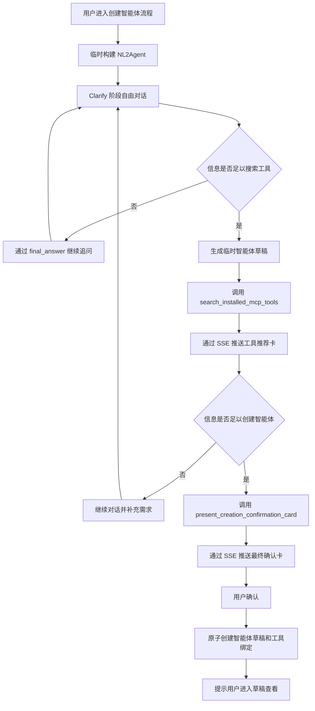

# NL2Agent 临时智能体设计方案

## 0. 当前实现阶段

当前最小可验证版本只实现以下能力：

- 通过 `/newchat?mode=nl2agent` 复用普通聊天界面和流式消息渲染。
- 每次请求在后端内存中临时构建 NL2Agent，不保存智能体或会话。
- 仅绑定 `search_installed_mcp_tools`，并在现有工具 Result 区域展示结构化 JSON。
- 不实现推荐卡、最终确认卡、确认接口或目标智能体创建。

本文第 3 节中搜索之后的流程、第 7 至 9 节以及对应的完整验收项描述后续目标设计，不代表当前版本已经实现。

## 1. 设计目标

NL2Agent 是通过“创建智能体”专用入口启动的临时 ReAct 智能体，负责通过自然语言对话明确用户需求、推荐当前租户已安装的 MCP 工具，并在用户最终确认后创建可编辑的智能体草稿。

核心原则：

- NL2Agent 仅在处理当前请求时构建，不创建数据库智能体记录。
- 当前页面通过请求中的 `history` 维持多轮上下文。
- NL2Agent 的对话、卡片和运行状态不写入历史记录，刷新或退出后重新开始。
- 模型决定何时继续澄清、何时搜索工具以及何时可以创建智能体。
- 最终确认前不创建数据库草稿。
- 服务端负责鉴权、数据校验、租户隔离、事务和幂等。
- 最终创建的目标智能体仍使用普通的草稿、工具绑定和发布链路。

## 2. 临时运行架构

### 2.1 调用入口

前端通过现有 `/newchat?mode=nl2agent` 页面调用临时运行接口：

```http
POST /agent/nl2agent/run
```

请求：

```json
{
  "query": "用户当前输入",
  "history": [
    {"role": "user", "content": "..."},
    {"role": "assistant", "content": "..."}
  ],
  "minio_files": []
}
```

`query` 为当前轮用户输入，`history` 由前端从当前页面状态组装，`minio_files` 沿用现有附件描述格式。请求不包含 `agent_id` 或 `conversation_id`。

### 2.2 运行配置

服务端使用以下信息在内存中构建 `AgentConfig` 和 `AgentRunInfo`：

- 当前租户默认 LLM。
- NL2Agent 职责提示词。
- NL2Agent 运行时 LangChain 工具。
- 当前请求携带的对话历史和附件。
- 从鉴权上下文获得的用户、租户和语言。

临时配置使用 `__nl2agent_runtime__` 作为仅供运行期识别的名称。该名称不写入数据库，也不作为系统保留的普通智能体名称。

运行链路直接组装 SDK 运行对象，不进入普通智能体的数据库配置和会话链路：

```text
build_nl2agent_run_info（薄包装：构建内存态 AgentConfig）
  -> AgentRunInfo
  -> agent_run
  -> agent_run_thread
  -> NexentAgent.create_single_agent
  -> CoreAgent ReAct loop
```

NL2Agent 不修改 `create_agent_run_info` 或 `run_agent_stream`。包装层只复用租户默认模型构建和附件描述拼接，然后直接创建 `AgentRunInfo`；`agent_run` 产生的 observer JSON 被包装成现有前端可解析的 SSE。浏览器取消请求时，流生成器设置本次运行的 `stop_event`。

当前 MVP 的搜索工具是进程内 LangChain `StructuredTool` 对象，通过闭包持有租户 ID 和后端搜索函数。当前 SDK 不会把 `source="langchain"` 工具通过 host bridge 接入 Docker 或 WASM 执行器，因此 NL2Agent 包装层明确设置 `sandbox_config=None`，使用现有本地执行器。本设计不支持远程沙箱执行；后续若需支持，必须由 SDK 为 LangChain 工具增加 host-tool 能力，或将这些工具迁移到 MCP。

NL2Agent 不通过数据库版 `create_agent_config` 加载配置，不出现在普通智能体选择器中，也不需要数据库生成的智能体 ID。

### 2.3 生命周期

- 每次 `/agent/nl2agent/run` 请求都根据请求中的 `history` 创建新的临时运行实例。
- 临时实例只服务当前 SSE 请求，流结束后即可释放。
- 不读取或写入 conversation、message、历史卡片和历史摘要。
- 不启用长期记忆、历史上下文加载、对话标题生成或 SSE resume。
- 页面刷新、关闭或离开创建流程后，前端丢弃当前历史、草稿和卡片状态。
- 目标智能体草稿创建成功后，NL2Agent 流程结束。

## 3. ReAct 对话流程



模型使用两个独立判断阈值：

1. 当现有信息足以判断所需能力和检索关键词时，可以开始搜索工具。
2. 当现有信息足以生成可实际使用的智能体配置时，可以展示最终确认卡。

工具搜索可以早于最终信息收集完成，搜索结果可帮助后续澄清。最终确认卡要求**同一次运行内**已完成一次工具搜索：临时运行实例不跨请求保留状态，`present_creation_confirmation_card` 只能校验当前 ReAct 运行内发生的搜索。如果模型在没有先搜索的运行中尝试生成确认卡，工具将返回错误 Observation，要求先调用 `search_installed_mcp_tools`。这同时保证确认卡始终基于最新草稿的最新搜索结果。该前置条件属于产品质量约束而非安全控制，授权由确认接口的重新校验独立保证。

最终确认卡生成后，当前流程进入 `awaiting_confirmation` 状态。前端停止接受新的需求输入，用户只能确认创建或退出当前流程。

## 4. 提示词与运行时工具

### 4.1 职责提示词

NL2Agent 不使用独立 YAML、数据库提示词记录或提示词加载器。每次构建临时 `AgentConfig` 时，后端根据鉴权语言、工具名和最大结果数即时拼接角色、工作流、草稿结构、约束和最终回答规则，并通过 `AgentConfig.instructions` 注入 SDK 默认 CodeAgent system prompt。

职责提示词使用一致的分阶段指令：

- `clarify`：通过自由对话了解智能体目标、使用场景、输入、输出、约束和成功标准。不得要求用户填写固定结构，也不得生成需求确认卡。
- `tool_search`：当信息足以判断所需能力时，生成完整的 `GeneratedAgentDraft`，然后调用 `search_installed_mcp_tools`。不得在没有草稿的情况下搜索。
- `ready_to_create`（后续阶段）：当草稿已经足够完整且本次运行内已完成工具搜索时，调用 `present_creation_confirmation_card`。当前 MVP 明确禁止进入该阶段或声称已经创建智能体。
- 工具返回的 Observation 用于告知搜索结果、卡片生成结果及下一步允许的行为。
- 模型不得生成或覆盖用户 ID、租户 ID、授权信息、卡片 ID 和工具凭据。

### 4.2 运行时工具构建

当前 MVP 仅绑定一个运行时工具：

```text
search_installed_mcp_tools
```

后端在每次 `/agent/nl2agent/run` 请求中通过 `StructuredTool.from_function` 创建搜索工具。处理函数通过闭包绑定鉴权得到的 `tenant_id` 和后端搜索函数；这些值不进入模型可见的参数 Schema，因此模型不能提交或覆盖租户范围和结果数量。

每个 `StructuredTool` 都以 `source="langchain"` 直接附加到预构建的 `AgentConfig`。后端先构造 `ToolConfig`，再把 `BaseTool` 对象赋给 `metadata`，与现有 LangChain 加载约定保持一致；SDK 继续通过既有 `Tool.from_langchain` 适配器完成转换。运行时工具不写入 `ag_tool_info_t` 或 `ag_tool_instance_t`，不通过 `backend/tool_collection/langchain` 静态扫描，也不出现在公共工具选择器和公共工具验证接口中。本设计不修改 SDK，不增加 `bind_runtime` 钩子、`is_internal` 标记、MCP 注册或工具列表刷新。

单次运行工厂采用以下形式：

```python
search_tool = build_search_installed_mcp_tools(
    tenant_id=tenant_id,
    language=language,
    search_fn=search_installed_mcp_tools_for_tenant,
)
search_config = ToolConfig(
    class_name="search_installed_mcp_tools",
    name="search_installed_mcp_tools",
    source="langchain",
    params={},
)
search_config.metadata = search_tool
```

`search_installed_mcp_tools` 只向模型暴露一个 `draft` JSON object。当前 `smolagents` 无法转换嵌套 Pydantic `$ref`，因此 LangChain `args_schema` 把 `draft` 声明为 object，处理函数入口再使用 `GeneratedAgentDraft.model_validate()` 严格校验。随后它只调用一次租户范围内的 Python 搜索函数，不调用 LLM、MCP 服务、智能体或任何其他工具。

工具名中的 `mcp` 表示被搜索的目录记录类型，不表示该工具自身使用 MCP 协议。成功 Observation 使用以下固定结构：

```python
class InstalledMcpToolRecommendation(BaseModel):
    tool_id: int
    name: str
    origin_name: str | None
    description: str
    source: Literal["mcp"]
    usage: str
    labels: list[str]
    score: float


class SearchInstalledMcpToolsObservation(BaseModel):
    status: Literal["success"]
    recommendation_count: int
    recommendations: list[InstalledMcpToolRecommendation]


class SearchInstalledMcpToolsErrorObservation(BaseModel):
    status: Literal["error"]
    code: Literal["invalid_draft", "tool_search_failed"]
    retryable: Literal[True]
```

空结果属于成功完成的搜索。草稿校验、数据库或排序失败时，处理函数返回不包含内部异常细节的可重试错误 Observation。结构化 JSON 由现有 `execution_logs` 映射显示在 ToolFallback Result 中。

`present_creation_confirmation_card` 和单次运行共享状态留待后续卡片阶段实现。

## 5. 临时智能体草稿

```python
class GeneratedAgentDraft(BaseModel):
    model_config = ConfigDict(
        extra="forbid",
        str_strip_whitespace=True,
    )

    name: str = Field(min_length=1, max_length=100)
    display_name: str = Field(min_length=1, max_length=100)
    description: str = Field(min_length=1)
    duty_prompt: str = Field(min_length=1)
    constraint_prompt: str = Field(min_length=1)
    few_shots_prompt: str | None = None
```

字段要求：

- `name` 使用普通智能体名称规则，最终确认时再次检查冲突。
- `display_name` 是用户可见名称。
- `description` 概括用途、目标用户和主要能力。
- `duty_prompt` 描述职责、任务流程和输出要求。
- `constraint_prompt` 描述边界、权限、安全要求和失败处理。
- `few_shots_prompt` 仅在示例能显著提高行为稳定性时生成。
- 未知字段一律拒绝，所有字符串执行去空白处理。

临时草稿只存在于当前前端页面状态和 SSE 卡片数据中，最终确认前不写入数据库。

最终创建的目标智能体属性：

- 数据库生成 `target_agent_id > 0`。
- `version_no=0`。
- `enabled=true`。
- 使用当前租户默认 LLM。
- 初始状态为可编辑草稿。
- 不自动发布。

## 6. MCP 工具推荐

### 6.1 数据范围

只查询当前租户满足以下条件的工具：

```text
source == "mcp"
is_available == true
```

检索范围有意保持为仅 MCP 工具。本地工具和静态发现的 LangChain 工具可能需要按智能体配置模型、知识库、密钥或其他初始化参数，而当前推荐和确认流程只选择 `tool_id`，没有配置步骤；若推荐这些工具，NL2Agent 可能创建出无法运行的草稿。

模型和前端不能访问 MCP Token、请求头、密钥或连接凭据。

后端搜索函数从 `query_all_tools(tenant_id)` 获取候选项；该查询已经强制租户归属并排除软删除记录，随后再应用上述 `source` 和可用性过滤。运行时搜索工具从不持久化，因此不会出现在候选结果中。搜索文档和返回结果只复制安全的展示元数据，排除 `params`、请求头、Token 和其他可执行配置。

### 6.2 检索字段

工具检索文档由以下字段组成：

- `name`
- `origin_name`
- `description`
- `labels`
- `usage`

匹配前，所有值先转换为字符串，执行 Unicode 规范化、转小写、去除首尾空白并合并连续空白。缺失的可选字段按空字符串处理，标签按原列表顺序以空格连接。

服务端从临时草稿的 `display_name`、`description`、`duty_prompt`、`constraint_prompt` 和 `few_shots_prompt` 构造检索文本，不接收模型单独提供的任意检索范围或租户条件。

### 6.3 匹配规则

使用 RapidFuzz：

```text
score = max(
    WRatio(query, tool_document),
    token_set_ratio(query, tool_document)
) / 100
```

本功能把 `rapidfuzz>=3.0.0` 声明为后端直接依赖，而不依赖其他包的传递依赖。排序完全确定，不调用模型或外部服务。

固定规则：

| 规则 | 值 |
|---|---|
| 最低推荐分数 | `0.45` |
| 最大推荐数量 | `5` |
| 默认选中阈值 | `0.65` |
| 同分排序 | `tool_id` 升序 |

低于最低分数的候选项直接丢弃；其余结果先按分数降序、再按 `tool_id` 升序排列，截取前五项，并在工具 Observation 和卡片载荷中把分数保留四位小数。

评分阈值为初始值，待真实使用数据调参。

没有匹配结果时由工具发送空状态推荐卡，并允许用户不绑定工具完成创建。

### 6.4 草稿修订与工具选择

- 每次生成用于搜索的新草稿时创建新的 `draft_revision`。
- 工具推荐卡默认选中分数不低于 `0.65` 的工具。
- 用户可以在最新工具推荐卡中多选或取消选择工具。
- 新工具推荐卡到达时，前端将所有旧推荐卡和旧确认卡标记为 `superseded`。
- 新工具推荐卡使用新的默认选中集合，不继承旧修订的选择。
- 确认卡始终与同一次运行内已完成的搜索配对，其 `draft_revision` 恒等于最新推荐卡的修订，无需跨修订匹配。
- 最终确认卡始终读取同一 `draft_revision` 下最新工具卡的选择状态。

## 7. SSE 卡片和前端状态

### 7.1 卡片信封

两个运行时工具通过现有 `ProcessType.CARD` 输出：

```ts
type NL2AgentCardEnvelope<T> = {
  card_id: string;
  draft_revision: string;
  schema_version: 1;
  name:
    | "nl2agent_tool_recommendations_card"
    | "nl2agent_creation_confirmation_card";
  status: "pending" | "confirmed" | "superseded" | "failed";
  data: T;
};
```

`card_id` 和 `draft_revision` 均由服务端生成。卡片只通过当前 SSE 流发送，不写入 conversation message units。

### 7.2 工具推荐卡

工具推荐卡包含：

- 当前 `draft_revision`。
- 推荐工具的 `tool_id`、名称、说明、MCP 来源、标签和匹配分数。
- 默认选中的工具 ID。
- 空结果或搜索失败状态。

前端负责维护当前页面中的选择状态，请求进行中禁止重复操作。

### 7.3 最终确认卡

最终确认卡包含：

- 完整 `GeneratedAgentDraft`。
- 智能体名称和用途摘要。
- 关联的 `draft_revision`。
- 最近一次有效工具推荐集合。
- “信息已经足够，确认后将写入智能体草稿”的提示。

卡片只提供确认按钮。前端根据相同 `draft_revision` 下的最新选择状态动态展示将绑定的工具。

### 7.4 assistant-ui 映射

已对照当前前端验证（`@assistant-ui/react ^0.14.20`，新聊天位于 `app/[locale]/newchat/`）：共享流式适配器（`newchat/adapter/remote-chat-model-adapter.ts`）目前将 `card` 块映射为 `null`（直接跳过），消息渲染器（`thread.tsx`）仅通过通用 `dataRendererUI` 路径支持 data part，当前安装版本没有 `by_name` 组件注册机制。

当前 MVP 按以下方式集成：

- `/newchat?mode=nl2agent` 使用本地 assistant-ui runtime 和内存态 NL2Agent 展示对象，不加载远程会话列表。
- 共享流式适配器根据 `runConfig.custom.runtimeMode` 切换到 `/api/agent/nl2agent/run`，并省略 `agent_id`、`conversation_id`、模型覆盖、resume 和标题回调。
- 现有 `tool` 与 `execution_logs` 映射将结构化 JSON 显示在 ToolFallback 中，不解析 `card` 块，也不注册卡片组件。
- 普通 `/newchat` 继续使用原有远程会话 runtime，行为不变。

NL2Agent 不提供历史会话适配器。现有非 NL2Agent 的 text、reasoning、tool-call、source 和 card 渲染保持不变。

## 8. 最终确认接口

```http
POST /agent/nl2agent/confirm
```

请求：

```json
{
  "card_id": "confirmation-card-uuid",
  "draft": {
    "name": "agent_name",
    "display_name": "Agent Name",
    "description": "...",
    "duty_prompt": "...",
    "constraint_prompt": "...",
    "few_shots_prompt": null
  },
  "selected_tool_ids": [10, 12]
}
```

DTO：

```python
class NL2AgentConfirmRequest(BaseModel):
    model_config = ConfigDict(extra="forbid")

    card_id: UUID
    draft: GeneratedAgentDraft
    selected_tool_ids: list[int]
```

`selected_tool_ids` 执行稳定去重，所有值必须为正整数。

服务端行为：

1. 从鉴权上下文读取当前用户和租户。
2. 重新校验完整草稿、智能体名称和字段长度。
3. 重新校验每个工具属于当前租户、`source="mcp"` 且仍然可用。
4. 幂等基于 Redis 实现，不引入新的数据库表。幂等键由租户、用户和 `card_id` 派生：若键中已保存 `target_agent_id`，直接返回；若键处于进行中锁状态，返回可重试的冲突错误。
5. 通过 `SET NX` 加带 TTL 的进行中锁，然后在单个数据库事务中创建目标智能体 `version_no=0` 草稿并写入工具绑定。
6. 事务提交后，将 `target_agent_id` 写入幂等键并设置覆盖真实重试窗口的有限 TTL（例如 24 小时）；失败时释放锁。
7. 返回目标智能体 ID 和草稿配置页地址。

成功响应：

```json
{
  "target_agent_id": 456,
  "draft_url": "/agents/456?version_no=0"
}
```

前端收到成功响应后，将确认卡标记为 `confirmed`，告知用户所有相关信息已经写入智能体草稿，并引导用户进入草稿查看。

TTL 内相同幂等键重复提交时返回已创建的草稿；TTL 之外由前端的 `confirmed` 卡片状态阻止重复提交。校验失败或事务失败时不得保留部分智能体或工具绑定，必须释放进行中锁且不记录成功结果；卡片标记为 `failed`，瞬时错误允许重试。

## 9. 安全与一致性

- 用户和租户身份只从鉴权上下文获取。
- 前端提交的草稿属于用户待创建配置，服务端仍需应用普通智能体的完整校验规则。
- 前端提交的工具 ID 不具有授权效力，必须重新校验租户、来源和可用状态。
- 模型和前端不能提交或读取 MCP 凭据。
- 智能体草稿创建与工具绑定处于同一数据库事务；幂等记录基于 Redis，进行中锁防止并发重复创建。幂等不引入新的数据库表。
- `card_id` 的幂等范围为当前租户和当前用户，不能跨身份复用。
- NL2Agent 不持久化运行历史，因此任何页面状态都不能作为最终授权依据。
- “确认卡前必须搜索”的前置条件仅在单次运行内强制，属于产品质量约束；安全完全依赖确认接口对草稿和全部提交工具 ID 的重新校验。
- 运行时 LangChain 工具仅在预构建的 NL2Agent 配置内创建，不持久化、不参与扫描，也不能通过公共工具选择器或验证接口触达。
- 绑定的租户和用户上下文不进入模型可见参数；搜索服务独立强制租户条件。
- 由于当前 SDK 不会把 LangChain 工具通过 host bridge 接入远程沙箱，NL2Agent 使用本地执行器；远程沙箱支持需要单独的 SDK 或 MCP 设计。
- 目标智能体创建后遵循现有智能体编辑、发布、权限和版本管理规则。

## 10. 测试计划

### 10.1 后端测试

- `/agent/nl2agent/run` 使用临时配置和租户默认 LLM 运行。
- 临时运行不查询 NL2Agent 数据库记录，也不保存 conversation、message 或历史摘要。
- 请求中的 `history` 正确转换为 SDK `AgentHistory`，且不从数据库补充历史。
- 临时运行不启用记忆检索、历史恢复或 SSE resume。
- 两个运行时工具只向模型暴露草稿数据，并使用闭包绑定的服务端安全上下文。
- 生成的 `ToolConfig` 使用 `source="langchain"`，携带内存态 `BaseTool` 对象，不创建或更新工具目录记录。
- 工具搜索仅返回当前租户已安装且可用的 MCP 工具。
- 搜索处理函数只调用一次租户范围内的 Python 搜索函数，绝不调用其他工具、智能体、LLM 或 MCP 端点。
- 搜索规范化、检索字段、评分阈值、Top 5、分数取整、默认选择和同分排序保持确定性。
- 成功 Observation 与卡片载荷使用相同顺序的推荐 DTO，且不暴露可执行工具配置。
- 空结果视为成功搜索；后端失败时发送失败卡片，且不满足确认前置条件。
- 最终确认工具在本次运行内没有已完成工具搜索时拒绝生成卡片，并通过错误 Observation 要求模型先搜索。
- 确认接口正确校验草稿、工具权限、正整数 ID 和稳定去重。
- 伪造、跨租户、非 MCP 和不可用工具均被拒绝。
- 草稿创建与工具绑定满足原子性；并发重复确认被幂等锁阻止。
- 幂等 TTL 内网络超时后的重复确认返回同一个 `target_agent_id`。

### 10.2 前端测试

- 创建智能体专用入口能够启动 NL2Agent，普通智能体选择器不展示 NL2Agent。
- 当前页面历史支持多轮澄清，刷新或退出后不恢复流程。
- 两种卡片分别映射到独立的 assistant-ui 组件。
- 工具卡正确展示推荐、默认选择、多选、空状态和失败状态。
- 新 `draft_revision` 正确取代旧推荐卡和旧确认卡。
- 最终确认卡展示草稿摘要和最新工具选择，并且只提供确认按钮。
- 确认成功后展示草稿入口，失败时不显示成功状态。
- 现有非 NL2Agent SSE 消息和卡片渲染不受影响。

### 10.3 端到端测试

1. 从“创建智能体”专用入口启动 NL2Agent。
2. 提供不完整需求并验证模型通过自由对话追问。
3. 补充到可搜索状态并验证生成临时草稿和 MCP 工具推荐卡。
4. 修改工具多选结果并继续补充需求。
5. 验证新草稿修订会取代旧卡片并生成新的推荐结果。
6. 信息充足后验证最终确认卡展示草稿摘要和最新工具选择。
7. 确认后验证原子创建正整数 ID 的目标草稿和工具绑定。
8. 验证页面引导用户进入可编辑、启用且未发布的草稿。
9. 刷新创建页面并验证 NL2Agent 对话和卡片不会恢复。
10. 重复提交相同确认并验证不会创建重复智能体。

## 11. 实施约定

- 模型负责语义澄清、阶段判断、草稿生成和工具调用顺序。
- 服务端负责临时运行配置、安全上下文、搜索范围、数据校验、事务和幂等。
- 前端负责当前页面内的对话历史、草稿修订、卡片状态和工具选择。
- 工具搜索是生成最终确认卡的必要前置步骤，通过两个运行时工具共享的单次运行状态强制；跨请求场景下作为提示词层规则维持，安全边界始终是确认接口的重新校验。
- 两个 NL2Agent 工具均为后端创建、非持久化的 LangChain `StructuredTool`，SDK 保持不变。
- 用户确认是唯一触发目标智能体数据库写入的动作。
- 中英文设计文档保持同一份行为规范。
