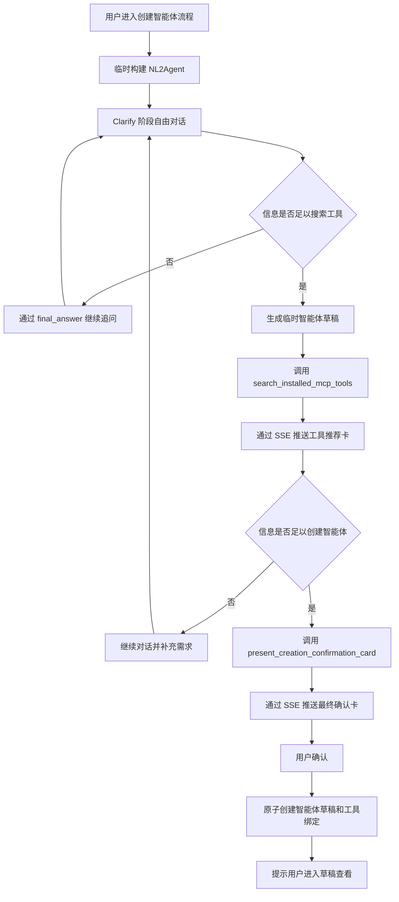

# NL2Agent 临时智能体设计方案

## 1. 设计目标

NL2Agent 是通过“创建智能体”专用入口启动的临时 ReAct 智能体，负责通过自然语言对话明确用户需求、推荐当前租户已安装的 MCP 工具，并在用户最终确认后创建可编辑的智能体草稿。

核心原则：

- NL2Agent 仅在处理当前请求时构建，不创建数据库智能体记录。
- 当前页面通过请求中的 `history` 维持多轮上下文。
- NL2Agent 的对话、卡片和运行状态不写入历史记录，刷新或退出后重新开始。
- 模型决定何时继续澄清、何时搜索工具以及何时可以创建智能体。
- 最终确认前不创建数据库草稿。
- 服务端负责鉴权、数据校验、租户隔离、事务和幂等。
- 最终创建的目标智能体仍使用普通的草稿、工具绑定和发布链路。

## 2. 临时运行架构

### 2.1 调用入口

前端在“创建智能体”流程中调用专用接口：

```http
POST /agent/nl2agent/run
```

请求：

```json
{
  "query": "用户当前输入",
  "history": [
    {"role": "user", "content": "..."},
    {"role": "assistant", "content": "..."}
  ],
  "minio_files": []
}
```

`query` 为当前轮用户输入，`history` 由前端从当前页面状态组装，`minio_files` 沿用现有附件描述格式。请求不包含 `agent_id` 或 `conversation_id`。

### 2.2 运行配置

服务端使用以下信息在内存中构建 `AgentConfig` 和 `AgentRunInfo`：

- 当前租户默认 LLM。
- NL2Agent 职责提示词。
- NL2Agent 专用平台工具。
- 当前请求携带的对话历史和附件。
- 从鉴权上下文获得的用户、租户和语言。

临时配置使用 `__nl2agent_runtime__` 作为仅供运行期识别的名称。该名称不写入数据库，也不作为系统保留的普通智能体名称。

运行链路最大化复用现有实现，不另建平行链路：

```text
build_nl2agent_run_info（薄包装：构建内存态 AgentConfig）
  -> create_agent_run_info(prebuilt_agent_config=...)   # 复用现有函数
  -> agent_run_thread
  -> NexentAgent.create_single_agent
  -> CoreAgent ReAct loop
```

`create_agent_run_info` 增加一个可选参数 `prebuilt_agent_config`：传入时仅跳过版本号解析和数据库版 `create_agent_config` 加载，附件拼接、租户模型列表构建、history 转换和 `AgentRunInfo` 组装均原样复用。流式输出复用现有 `is_debug` 路径（`_stream_agent_chunks`），使用运行期生成的临时会话 ID；不修改 `run_agent_stream` 本身——其会话自动创建、resume 探测和标题生成正是 NL2Agent 明确排除的能力。运行仍以临时 ID 注册到 `agent_run_manager`，现有停止能力对 NL2Agent 继续可用。

NL2Agent 不通过数据库版 `create_agent_config` 加载配置，不出现在普通智能体选择器中，也不需要数据库生成的智能体 ID。

### 2.3 生命周期

- 每次 `/agent/nl2agent/run` 请求都根据请求中的 `history` 创建新的临时运行实例。
- 临时实例只服务当前 SSE 请求，流结束后即可释放。
- 不读取或写入 conversation、message、历史卡片和历史摘要。
- 不启用长期记忆、历史上下文加载、对话标题生成或 SSE resume。
- 页面刷新、关闭或离开创建流程后，前端丢弃当前历史、草稿和卡片状态。
- 目标智能体草稿创建成功后，NL2Agent 流程结束。

## 3. ReAct 对话流程



模型使用两个独立判断阈值：

1. 当现有信息足以判断所需能力和检索关键词时，可以开始搜索工具。
2. 当现有信息足以生成可实际使用的智能体配置时，可以展示最终确认卡。

工具搜索可以早于最终信息收集完成，搜索结果可帮助后续澄清。最终确认卡要求**同一次运行内**已完成一次工具搜索：临时运行实例不跨请求保留状态，`present_creation_confirmation_card` 只能校验当前 ReAct 运行内发生的搜索。如果模型在没有先搜索的运行中尝试生成确认卡，工具将返回错误 Observation，要求先调用 `search_installed_mcp_tools`。这同时保证确认卡始终基于最新草稿的最新搜索结果。该前置条件属于产品质量约束而非安全控制，授权由确认接口的重新校验独立保证。

最终确认卡生成后，当前流程进入 `awaiting_confirmation` 状态。前端停止接受新的需求输入，用户只能确认创建或退出当前流程。

## 4. 提示词与平台工具

### 4.1 职责提示词

NL2Agent 的职责提示词使用一致的分阶段指令：

- `clarify`：通过自由对话了解智能体目标、使用场景、输入、输出、约束和成功标准。不得要求用户填写固定结构，也不得生成需求确认卡。
- `tool_search`：当信息足以判断所需能力时，生成完整的 `GeneratedAgentDraft`，然后调用 `search_installed_mcp_tools`。不得在没有草稿的情况下搜索。
- `ready_to_create`：当草稿已经足够完整且本次运行内已完成工具搜索时，调用 `present_creation_confirmation_card`。若本次运行尚未搜索——即使更早的轮次搜索过——必须先调用 `search_installed_mcp_tools`。不得仅通过文本宣称创建完成。
- 工具返回的 Observation 用于告知搜索结果、卡片生成结果及下一步允许的行为。
- 模型不得生成或覆盖用户 ID、租户 ID、授权信息、卡片 ID 和工具凭据。

### 4.2 专用工具

临时 NL2Agent 仅绑定两个平台工具：

```text
search_installed_mcp_tools
present_creation_confirmation_card
```

工具通过 `ToolConfig.metadata` 接收服务端注入的用户、租户、语言、`MessageObserver` 和受控回调。模型不能自行提供或覆盖这些安全上下文。

注入采用通用的 SDK 约定而非逐工具特判：每个平台工具实现 `bind_runtime(metadata, observer)` 方法，自行从 `ToolConfig.metadata` 提取依赖、完成校验，缺失必需项时抛出异常。`create_local_tool` 仅在通用分支通过一次 `hasattr` 检查调用该钩子；新增平台工具不得在 `create_local_tool` 或后端工具服务中增加工具专属分支。确认卡前置条件所需的单次运行共享状态由服务端构造为同一个对象，放入两个工具的 metadata，二者通过 `bind_runtime` 拿到同一引用。

平台工具标记 `is_internal = True`：不进入用户可见的本地工具扫描，公共工具验证端点统一拒绝执行，仅通过 NL2Agent 运行时和自动化测试触达。

`search_installed_mcp_tools` 接收当前生成的 `GeneratedAgentDraft`，服务端注入的回调从草稿字段构造检索文本并执行租户范围内的查询；推荐卡由工具自身通过 `ProcessType.CARD` 发送。

`present_creation_confirmation_card` 接收当前完整草稿，通过 `ProcessType.CARD` 发送最终确认卡。它不从模型接收搜索标识：两个平台工具共享本次运行的运行期状态，确认工具直接读取 `search_installed_mcp_tools` 在同一次运行内记录的最新搜索结果（`draft_revision` 和推荐集合）。若本次运行内没有已完成的搜索，调用被拒绝并返回错误 Observation，要求模型先搜索。

## 5. 临时智能体草稿

```python
class GeneratedAgentDraft(BaseModel):
    model_config = ConfigDict(
        extra="forbid",
        str_strip_whitespace=True,
    )

    name: str = Field(min_length=1, max_length=100)
    display_name: str = Field(min_length=1, max_length=100)
    description: str = Field(min_length=1)
    duty_prompt: str = Field(min_length=1)
    constraint_prompt: str = Field(min_length=1)
    few_shots_prompt: str | None = None
```

字段要求：

- `name` 使用普通智能体名称规则，最终确认时再次检查冲突。
- `display_name` 是用户可见名称。
- `description` 概括用途、目标用户和主要能力。
- `duty_prompt` 描述职责、任务流程和输出要求。
- `constraint_prompt` 描述边界、权限、安全要求和失败处理。
- `few_shots_prompt` 仅在示例能显著提高行为稳定性时生成。
- 未知字段一律拒绝，所有字符串执行去空白处理。

临时草稿只存在于当前前端页面状态和 SSE 卡片数据中，最终确认前不写入数据库。

最终创建的目标智能体属性：

- 数据库生成 `target_agent_id > 0`。
- `version_no=0`。
- `enabled=true`。
- 使用当前租户默认 LLM。
- 初始状态为可编辑草稿。
- 不自动发布。

## 6. MCP 工具推荐

### 6.1 数据范围

只查询当前租户满足以下条件的工具：

```text
source == "mcp"
is_available == true
```

模型和前端不能访问 MCP Token、请求头、密钥或连接凭据。

### 6.2 检索字段

工具检索文档由以下字段组成：

- `name`
- `origin_name`
- `description`
- 本地化描述
- `labels`
- `usage`

服务端从临时草稿的 `display_name`、`description`、`duty_prompt`、`constraint_prompt` 和 `few_shots_prompt` 构造检索文本，不接收模型单独提供的任意检索范围或租户条件。

### 6.3 匹配规则

使用 RapidFuzz：

```text
score = max(
    WRatio(query, tool_document),
    token_set_ratio(query, tool_document)
) / 100
```

固定规则：

| 规则 | 值 |
|---|---|
| 最低推荐分数 | `0.45` |
| 最大推荐数量 | `5` |
| 默认选中阈值 | `0.65` |
| 同分排序 | `tool_id` 升序 |

评分阈值为初始值，待真实使用数据调参。

没有匹配结果时由工具发送空状态推荐卡，并允许用户不绑定工具完成创建。

### 6.4 草稿修订与工具选择

- 每次生成用于搜索的新草稿时创建新的 `draft_revision`。
- 工具推荐卡默认选中分数不低于 `0.65` 的工具。
- 用户可以在最新工具推荐卡中多选或取消选择工具。
- 新工具推荐卡到达时，前端将所有旧推荐卡和旧确认卡标记为 `superseded`。
- 新工具推荐卡使用新的默认选中集合，不继承旧修订的选择。
- 确认卡始终与同一次运行内已完成的搜索配对，其 `draft_revision` 恒等于最新推荐卡的修订，无需跨修订匹配。
- 最终确认卡始终读取同一 `draft_revision` 下最新工具卡的选择状态。

## 7. SSE 卡片和前端状态

### 7.1 卡片信封

两个平台工具通过现有 `ProcessType.CARD` 输出：

```ts
type NL2AgentCardEnvelope<T> = {
  card_id: string;
  draft_revision: string;
  schema_version: 1;
  name:
    | "nl2agent_tool_recommendations_card"
    | "nl2agent_creation_confirmation_card";
  status: "pending" | "confirmed" | "superseded" | "failed";
  data: T;
};
```

`card_id` 和 `draft_revision` 均由服务端生成。卡片只通过当前 SSE 流发送，不写入 conversation message units。

### 7.2 工具推荐卡

工具推荐卡包含：

- 当前 `draft_revision`。
- 推荐工具的 `tool_id`、名称、说明、MCP 来源、标签和匹配分数。
- 默认选中的工具 ID。
- 空结果或搜索失败状态。

前端负责维护当前页面中的选择状态，请求进行中禁止重复操作。

### 7.3 最终确认卡

最终确认卡包含：

- 完整 `GeneratedAgentDraft`。
- 智能体名称和用途摘要。
- 关联的 `draft_revision`。
- 最近一次有效工具推荐集合。
- “信息已经足够，确认后将写入智能体草稿”的提示。

卡片只提供确认按钮。前端根据相同 `draft_revision` 下的最新选择状态动态展示将绑定的工具。

### 7.4 assistant-ui 映射

已对照当前前端验证（`@assistant-ui/react ^0.14.20`，新聊天位于 `app/[locale]/newchat/`）：共享流式适配器（`newchat/adapter/remote-chat-model-adapter.ts`）目前将 `card` 块映射为 `null`（直接跳过），消息渲染器（`thread.tsx`）仅通过通用 `dataRendererUI` 路径支持 data part，当前安装版本没有 `by_name` 组件注册机制。

因此 NL2Agent 按以下方式集成：

- 创建智能体页面使用自己的适配器实例，在共享适配器基础上仅扩展一条映射：将 `card` 块解析为 `NL2AgentCardEnvelope`，输出为 data part `{type: "data", name: envelope.name, data: envelope}`。普通聊天使用的共享适配器保持不变，其现有的跳过 card 行为不受影响。
- 卡片组件在 NL2Agent 页面的 data part 渲染器内按 `envelope.name` 分发，沿用现有 `dataRendererUI` 机制：`nl2agent_tool_recommendations_card` 渲染 `McpToolRecommendationCard`，`nl2agent_creation_confirmation_card` 渲染 `AgentCreationConfirmationCard`。
- 创建智能体入口目前仅跳转到智能体管理页；NL2Agent 对话页是该流程中新建的页面，复用 newchat 的 thread 组件。

NL2Agent 不提供历史会话适配器。现有非 NL2Agent 的 text、reasoning、tool-call、source 和 card 渲染保持不变。

## 8. 最终确认接口

```http
POST /agent/nl2agent/confirm
```

请求：

```json
{
  "card_id": "confirmation-card-uuid",
  "draft": {
    "name": "agent_name",
    "display_name": "Agent Name",
    "description": "...",
    "duty_prompt": "...",
    "constraint_prompt": "...",
    "few_shots_prompt": null
  },
  "selected_tool_ids": [10, 12]
}
```

DTO：

```python
class NL2AgentConfirmRequest(BaseModel):
    model_config = ConfigDict(extra="forbid")

    card_id: UUID
    draft: GeneratedAgentDraft
    selected_tool_ids: list[int]
```

`selected_tool_ids` 执行稳定去重，所有值必须为正整数。

服务端行为：

1. 从鉴权上下文读取当前用户和租户。
2. 重新校验完整草稿、智能体名称和字段长度。
3. 重新校验每个工具属于当前租户、`source="mcp"` 且仍然可用。
4. 幂等基于 Redis 实现，不引入新的数据库表。幂等键由租户、用户和 `card_id` 派生：若键中已保存 `target_agent_id`，直接返回；若键处于进行中锁状态，返回可重试的冲突错误。
5. 通过 `SET NX` 加带 TTL 的进行中锁，然后在单个数据库事务中创建目标智能体 `version_no=0` 草稿并写入工具绑定。
6. 事务提交后，将 `target_agent_id` 写入幂等键并设置覆盖真实重试窗口的有限 TTL（例如 24 小时）；失败时释放锁。
7. 返回目标智能体 ID 和草稿配置页地址。

成功响应：

```json
{
  "target_agent_id": 456,
  "draft_url": "/agents/456?version_no=0"
}
```

前端收到成功响应后，将确认卡标记为 `confirmed`，告知用户所有相关信息已经写入智能体草稿，并引导用户进入草稿查看。

TTL 内相同幂等键重复提交时返回已创建的草稿；TTL 之外由前端的 `confirmed` 卡片状态阻止重复提交。校验失败或事务失败时不得保留部分智能体或工具绑定，必须释放进行中锁且不记录成功结果；卡片标记为 `failed`，瞬时错误允许重试。

## 9. 安全与一致性

- 用户和租户身份只从鉴权上下文获取。
- 前端提交的草稿属于用户待创建配置，服务端仍需应用普通智能体的完整校验规则。
- 前端提交的工具 ID 不具有授权效力，必须重新校验租户、来源和可用状态。
- 模型和前端不能提交或读取 MCP 凭据。
- 智能体草稿创建与工具绑定处于同一数据库事务；幂等记录基于 Redis，进行中锁防止并发重复创建。幂等不引入新的数据库表。
- `card_id` 的幂等范围为当前租户和当前用户，不能跨身份复用。
- NL2Agent 不持久化运行历史，因此任何页面状态都不能作为最终授权依据。
- “确认卡前必须搜索”的前置条件仅在单次运行内强制，属于产品质量约束；安全完全依赖确认接口对草稿和全部提交工具 ID 的重新校验。
- `is_internal` 平台工具不持久化、不出现在用户可见的工具选择器中，也不能通过公共工具验证端点执行。
- 目标智能体创建后遵循现有智能体编辑、发布、权限和版本管理规则。

## 10. 测试计划

### 10.1 后端测试

- `/agent/nl2agent/run` 使用临时配置和租户默认 LLM 运行。
- 临时运行不查询 NL2Agent 数据库记录，也不保存 conversation、message 或历史摘要。
- 请求中的 `history` 正确转换为 SDK `AgentHistory`，且不从数据库补充历史。
- 临时运行不启用记忆检索、历史恢复或 SSE resume。
- 两个专用工具只能使用服务端注入的安全上下文。
- 工具搜索仅返回当前租户已安装且可用的 MCP 工具。
- 检索字段、评分阈值、Top 5、默认选择和同分排序保持稳定。
- 最终确认工具在本次运行内没有已完成工具搜索时拒绝生成卡片，并通过错误 Observation 要求模型先搜索。
- 确认接口正确校验草稿、工具权限、正整数 ID 和稳定去重。
- 伪造、跨租户、非 MCP 和不可用工具均被拒绝。
- 草稿创建与工具绑定满足原子性；并发重复确认被幂等锁阻止。
- 幂等 TTL 内网络超时后的重复确认返回同一个 `target_agent_id`。

### 10.2 前端测试

- 创建智能体专用入口能够启动 NL2Agent，普通智能体选择器不展示 NL2Agent。
- 当前页面历史支持多轮澄清，刷新或退出后不恢复流程。
- 两种卡片分别映射到独立的 assistant-ui 组件。
- 工具卡正确展示推荐、默认选择、多选、空状态和失败状态。
- 新 `draft_revision` 正确取代旧推荐卡和旧确认卡。
- 最终确认卡展示草稿摘要和最新工具选择，并且只提供确认按钮。
- 确认成功后展示草稿入口，失败时不显示成功状态。
- 现有非 NL2Agent SSE 消息和卡片渲染不受影响。

### 10.3 端到端测试

1. 从“创建智能体”专用入口启动 NL2Agent。
2. 提供不完整需求并验证模型通过自由对话追问。
3. 补充到可搜索状态并验证生成临时草稿和 MCP 工具推荐卡。
4. 修改工具多选结果并继续补充需求。
5. 验证新草稿修订会取代旧卡片并生成新的推荐结果。
6. 信息充足后验证最终确认卡展示草稿摘要和最新工具选择。
7. 确认后验证原子创建正整数 ID 的目标草稿和工具绑定。
8. 验证页面引导用户进入可编辑、启用且未发布的草稿。
9. 刷新创建页面并验证 NL2Agent 对话和卡片不会恢复。
10. 重复提交相同确认并验证不会创建重复智能体。

## 11. 实施约定

- 模型负责语义澄清、阶段判断、草稿生成和工具调用顺序。
- 服务端负责临时运行配置、安全上下文、搜索范围、数据校验、事务和幂等。
- 前端负责当前页面内的对话历史、草稿修订、卡片状态和工具选择。
- 工具搜索是生成最终确认卡的必要前置步骤，通过两个平台工具共享的单次运行状态强制；跨请求场景下作为提示词层规则维持，安全边界始终是确认接口的重新校验。
- 用户确认是唯一触发目标智能体数据库写入的动作。
- 中英文设计文档保持同一份行为规范。
