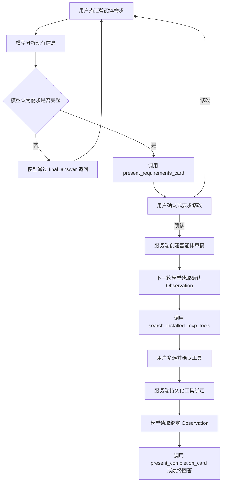

# NL2Agent 内置智能体设计方案

## 1. 设计目标

NL2Agent 是一个由模型驱动的普通 ReAct 智能体，通过多轮对话帮助用户明确新智能体需求、推荐当前租户已安装的 MCP 工具，并创建可编辑的智能体草稿。

核心原则：

- NL2Agent 与其他智能体使用完全相同的 `AgentConfig`、`ToolConfig` 和 ReAct 运行链路。
- 模型决定追问内容、对话轮数、何时展示确认卡片以及下一步调用哪个工具。
- 服务端负责鉴权、数据校验、用户确认、事务、幂等和租户隔离。
- NL2Agent 作为普通智能体出现在现有智能体选择器中。
- 所有智能体 ID 均为数据库生成的正整数。

## 2. 智能体结构

### 2.1 租户内置记录

每个租户维护一个已发布 NL2Agent：

| 字段 | 值 |
|---|---|
| `name` | `__nl2agent__` |
| `display_name` | `NL2Agent` |
| `enabled` | `true` |
| `is_main_agent` | `true` |
| `model_ids` | 当前租户默认 LLM |
| `version_no` | `0` 为源记录 |
| `current_version_no` | 最新已发布版本 |
| 权限 | 租户内所有用户可见、只读 |

使用幂等的 `ensure_nl2agent_for_tenant` 服务创建或校准记录，并通过数据库 Sequence 获得 `agent_id > 0`。

`__nl2agent__` 为系统保留名称，普通创建、复制、重命名和导入接口不能使用。

### 2.2 统一运行链路

NL2Agent 使用现有普通智能体链路：

```text
create_agent_run_info
  -> create_agent_config
  -> agent_run_thread
  -> NexentAgent.create_single_agent
  -> CoreAgent ReAct loop
```

NL2Agent 的职责提示词和专用工具通过正常的智能体草稿、工具绑定和发布快照加载。

### 2.3 专用工具

NL2Agent 绑定三个平台工具：

```text
present_requirements_card
search_installed_mcp_tools
present_completion_card
```

工具通过 `ToolConfig.metadata` 获得由服务端注入的租户、用户、会话和受控回调。模型不能自行提供或覆盖这些安全上下文。

## 3. ReAct 对话流程



工具返回的 Observation 会提示模型当前操作结果以及是否应等待用户输入。

服务端工具前置条件：

- 需求卡片未确认时，不能搜索 MCP 工具。
- 目标智能体不属于当前租户时，不能搜索或绑定工具。
- 工具推荐卡片未确认时，不能生成成功完成卡片。
- 已完成操作重复执行时，返回已保存结果。

## 4. 五项需求模型

五项需求作为 `present_requirements_card` 的工具参数：

```python
class NL2AgentRequirementsCardInput(BaseModel):
    model_config = ConfigDict(
        extra="forbid",
        str_strip_whitespace=True,
    )

    user_identity: str = Field(min_length=1)
    usage_scenario: str = Field(min_length=1)
    input_methods: list[str] = Field(min_length=1)
    output_methods: list[str] = Field(min_length=1)
    output_content: str = Field(min_length=1)
    key_constraints: list[str]
```

字段语义：

| 字段 | 含义 |
|---|---|
| `user_identity` | 谁使用智能体，例如客服、开发者、运营人员 |
| `usage_scenario` | 在什么业务场景和流程中使用 |
| `input_methods` | 文本、文件、图片、语音、API 数据等输入方式 |
| `output_methods` | 对话文本、JSON、文件、邮件、系统写入等交付方式 |
| `output_content` | 输出中需要包含的具体信息和结果 |
| `key_constraints` | 权限、时效、准确性、格式、数据范围等约束 |

校验规则：

- 用户身份和使用场景分别为必填字段。
- 输入和输出方式支持多个值。
- 列表值执行去空白、过滤空项和稳定去重。
- `key_constraints` 必须由模型显式传入。
- 空约束列表表示用户已明确确认“无额外约束”。
- 未知字段一律拒绝。

需求确认卡片固定展示五栏：

1. 用户身份 / 使用场景
2. 期望输入方式
3. 期望输出方式
4. 输出内容
5. 关键约束

第一栏内部使用两个子区域分别展示用户身份和使用场景。

## 5. 智能体草稿配置

`present_requirements_card` 同时接收模型生成的草稿配置：

```python
class GeneratedAgentDraft(BaseModel):
    model_config = ConfigDict(
        extra="forbid",
        str_strip_whitespace=True,
    )

    name: str = Field(min_length=1, max_length=100)
    display_name: str = Field(min_length=1, max_length=100)
    description: str = Field(min_length=1)
    duty_prompt: str = Field(min_length=1)
    constraint_prompt: str = Field(min_length=1)
    few_shots_prompt: str | None = None
```

需求卡片只展示五项用户需求。草稿配置保存在权威卡片数据中，用于确认后创建目标智能体。

目标智能体属性：

- 数据库生成 `target_agent_id > 0`。
- `version_no=0`。
- `enabled=true`。
- 使用租户默认 LLM。
- 初始状态为可编辑草稿。
- 不自动发布。

## 6. MCP 工具推荐

### 6.1 数据范围

只查询当前租户满足以下条件的工具：

```text
source == "mcp"
is_available == true
```

模型和前端不能访问 MCP Token、请求头、密钥或连接凭据。

### 6.2 检索字段

工具检索文本由以下字段组成：

- `name`
- `origin_name`
- `description`
- 本地化描述
- `labels`
- `usage`

搜索查询从权威需求卡片的全部需求字段生成，不信任模型重新传入的需求文本。

### 6.3 匹配规则

使用 RapidFuzz：

```text
score = max(
    WRatio(query, tool_document),
    token_set_ratio(query, tool_document)
) / 100
```

固定规则：

| 规则 | 值 |
|---|---|
| 最低推荐分数 | `0.45` |
| 最大推荐数量 | `5` |
| 默认选中阈值 | `0.65` |
| 同分排序 | `tool_id` 升序 |

没有匹配结果时展示空状态，并允许用户不绑定工具完成创建。

## 7. 操作接口

### 7.1 确认需求

```http
POST /agent/nl2agent/requirements/confirm
```

请求：

```json
{
  "conversation_id": 123,
  "card_id": "requirements-card-uuid"
}
```

行为：

- 校验当前用户、租户和会话。
- 读取持久化需求卡片及草稿配置。
- 校验卡片状态和五项需求。
- 幂等创建目标智能体草稿。
- 将 `target_agent_id` 写入卡片。
- 返回更新后的卡片和 continuation message。

### 7.2 确认工具

```http
POST /agent/nl2agent/tools/confirm
```

请求：

```json
{
  "conversation_id": 123,
  "card_id": "tools-card-uuid",
  "target_agent_id": 456,
  "selected_tool_ids": [10, 12]
}
```

行为：

- 校验会话、卡片和目标智能体归属。
- 校验选中工具属于权威推荐集合。
- 重新校验工具的租户、来源和可用状态。
- 幂等持久化 `version_no=0` 工具绑定。
- 保存最终 `selected_tool_ids`。
- 返回更新后的卡片和 continuation message。

所有新增 DTO 中的 `conversation_id`、`agent_id` 和 `target_agent_id` 使用 `Field(gt=0)`。

## 8. 卡片和 assistant-ui

### 8.1 卡片信封

三个平台工具通过现有 `ProcessType.CARD` 输出：

```ts
type NL2AgentCardEnvelope<T> = {
  card_id: string;
  schema_version: 1;
  name:
    | "nl2agent_requirements_card"
    | "nl2agent_tool_recommendations_card"
    | "nl2agent_completion_card";
  status: "pending" | "confirmed" | "superseded" | "failed";
  data: T;
};
```

卡片保存在现有 conversation message units 中。

生成新需求卡片时，同一创建流程中的旧 pending 需求卡片更新为 `superseded`。

### 8.2 assistant-ui 映射

适配器将结构化 `card` 事件转换为：

```ts
{
  type: "data",
  name: envelope.name,
  data: envelope,
}
```

流式适配器和历史会话适配器使用相同转换逻辑。非 NL2Agent 的现有 `card` 数据保持原有渲染方式。

### 8.3 独立 GUI

```tsx
<MessagePrimitive.Parts
  components={{
    Text: DirectiveText,
    data: {
      by_name: {
        nl2agent_requirements_card: RequirementsConfirmationCard,
        nl2agent_tool_recommendations_card: McpToolRecommendationCard,
        nl2agent_completion_card: AgentCreationResultCard,
      },
    },
  }}
/>
```

GUI 要求：

- 需求卡片：宽屏五栏，窄屏独立分区，支持确认和返回修改。
- 工具卡片：展示工具说明、MCP 来源、标签和匹配度，支持多选、恢复、重试和空状态。
- 完成卡片：展示目标智能体、已绑定工具和进入配置页的入口。
- 已确认、已取代和历史卡片均以只读状态展示。
- 请求进行中禁止重复提交。

## 9. 安全与一致性

- 用户和租户身份只从鉴权上下文获取。
- 模型输入中的 `tenant_id`、`user_id` 和工具 ID 不具有授权效力。
- 卡片是确认接口和后续工具调用的权威数据源。
- 卡片状态更新和相关数据库写入处于同一事务或等价锁边界。
- 网络超时后的重复请求返回已保存结果。
- 未提交的失败操作保持可重试。
- continuation message 只负责向模型提供 Observation，后续工具仍需重新校验数据库状态。
- 多轮历史复用 `AgentRunInfo.history`，不增加 NL2Agent 会话表。

## 10. 测试计划

### 10.1 后端测试

- NL2Agent 使用数据库生成的正整数 ID 和普通发布快照。
- NL2Agent 完整通过普通 `AgentConfig` 和 ReAct 链路运行。
- 租户预置和版本校准在并发场景下保持幂等。
- 用户身份与使用场景分别执行必填校验。
- 输入和输出方式支持多值并正确清理。
- 明确的空约束列表通过校验。
- 三个工具正确执行前置条件和租户隔离。
- 需求确认和工具确认满足授权、原子性和幂等性。
- MCP 搜索过滤、评分、Top 5 和默认选中结果稳定。
- 伪造、跨租户、非 MCP、不可用和未推荐工具均被拒绝。

### 10.2 前端测试

- 流式和历史适配器生成一致的 `data` part。
- 三种卡片分别渲染独立组件。
- 五项需求在桌面和移动端均保持独立展示。
- 工具选择在刷新和历史加载后恢复。
- pending、confirmed、superseded、failed 和空状态正确渲染。
- continuation message 成功自动发送。
- NL2Agent 仅作为普通智能体选择项展示。
- 现有 text、reasoning、tool-call、source 和普通 card 渲染不受影响。

### 10.3 端到端测试

1. 从普通智能体列表选择 NL2Agent。
2. 提供不完整需求并验证模型自主追问。
3. 补齐五项需求并展示确认卡片。
4. 修改需求并验证旧卡片被取代。
5. 确认需求并创建正整数 ID 的目标草稿。
6. 展示 MCP 工具推荐并修改默认选择。
7. 确认工具绑定。
8. 展示完成卡片并进入配置页。
9. 刷新会话并恢复全部卡片状态。
10. 验证目标智能体为可编辑、启用且未发布的普通草稿。

## 11. 实施约定

- 模型负责语义流程和工具选择。
- 服务端负责所有安全、权限和事务边界。
- 用户确认是创建智能体和绑定工具的必要条件。
- 完成卡片由模型决定何时展示。
- 中英文设计文档保持同一份行为规范。
