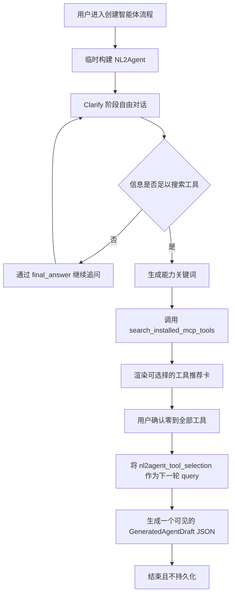

# NL2Agent 临时智能体设计方案

## 0. 当前实现阶段

当前最小可验证版本只实现以下能力：

- 通过 `/newchat?mode=nl2agent` 复用普通聊天界面和流式消息渲染。
- 每次请求在后端内存中临时构建 NL2Agent，不保存智能体或会话。
- 仅绑定 `search_installed_mcp_tools`，并根据保存到 assistant 消息 metadata 的结构化 `nl2a` SSE 渲染可选择的推荐卡。
- 默认全选推荐工具，允许选择零到全部工具，确认后立即将卡片设为只读。
- 将选中的安全工具元数据作为下一轮 NL2Agent query 发送，并生成一个可见的 `GeneratedAgentDraft` JSON；每个已选工具包含一个 few-shot。
- 不实现最终创建确认卡、确认接口、草稿 revision、持久化或目标智能体创建。

本文第 7.3 至 9 节描述后续持久化设计，不代表当前版本已经实现。

## 1. 设计目标

NL2Agent 是通过“创建智能体”专用入口启动的临时 ReAct 智能体。当前 MVP 负责通过自然语言对话明确用户需求、推荐当前租户已安装的 MCP 工具，并在用户确认工具选择后返回可见的智能体 Draft JSON。创建可编辑的数据库草稿属于后续阶段。

核心原则：

- NL2Agent 仅在处理当前请求时构建，不创建数据库智能体记录。
- 当前页面通过请求中的 `history` 维持多轮上下文。
- NL2Agent 的对话、卡片和运行状态不写入历史记录，刷新或退出后重新开始。
- 模型决定何时继续澄清、何时搜索工具以及如何生成最终 Draft JSON。
- 当前流程始终不创建数据库草稿。
- 服务端负责鉴权、输入校验和租户隔离的工具搜索；事务和幂等属于后续持久化阶段。
- 后续持久化的目标智能体仍使用普通的草稿、工具绑定和发布链路。

## 2. 临时运行架构

### 2.1 调用入口

前端通过现有 `/newchat?mode=nl2agent` 页面调用临时运行接口：

```http
POST /agent/nl2agent/run
```

请求：

```json
{
  "query": "用户当前输入",
  "history": [
    {"role": "user", "content": "..."},
    {"role": "assistant", "content": "..."}
  ],
  "minio_files": []
}
```

`query` 通常是当前轮用户可见输入。用户确认推荐卡时，本地摘要仍作为可见消息展示，而 adapter 将 `metadata.custom.nl2agentToolSelection` 序列化为当前 query：

```json
{"type":"nl2agent_tool_selection","tools":[]}
```

`history` 由前端从当前页面状态组装，`minio_files` 沿用现有附件描述格式。请求不包含 `agent_id` 或 `conversation_id`。

### 2.2 运行配置

服务端使用以下信息在内存中构建 `AgentConfig` 和 `AgentRunInfo`：

- 当前租户默认 LLM。
- NL2Agent 职责提示词。
- NL2Agent 运行时 Local MCP 工具。
- 当前请求携带的对话历史和附件。
- 从鉴权上下文获得的用户、租户和语言。

临时配置使用 `__nl2agent_runtime__` 作为仅供运行期识别的名称。该名称不写入数据库，也不作为系统保留的普通智能体名称。

运行链路直接组装 SDK 运行对象，不进入普通智能体的数据库配置和会话链路：

```text
build_nl2agent_run_info（薄包装：构建内存态 AgentConfig）
  -> AgentRunInfo
  -> agent_run
  -> agent_run_thread
  -> NexentAgent.create_single_agent
  -> CoreAgent ReAct loop
```

NL2Agent 不修改 `create_agent_run_info` 或 `run_agent_stream`。包装层只复用租户默认模型构建和附件描述拼接，然后直接创建 `AgentRunInfo`；`agent_run` 产生的 observer JSON 被包装成现有前端可解析的 SSE。浏览器取消请求时，流生成器设置本次运行的 `stop_event`。

当前 MVP 的搜索工具注册在 Local MCP 服务中。NL2Agent 使用 `source="mcp"` 配置该工具，并通过 `AgentRunInfo.mcp_host` 连接 `NEXENT_MCP_SERVER/sse`。当前鉴权请求的 `Authorization` 会透传到该连接，MCP 工具在搜索前独立解析租户。

NL2Agent 不通过数据库版 `create_agent_config` 加载配置，不出现在普通智能体选择器中，也不需要数据库生成的智能体 ID。

### 2.3 生命周期

- 每次 `/agent/nl2agent/run` 请求都根据请求中的 `history` 创建新的临时运行实例。
- 临时实例只服务当前 SSE 请求，流结束后即可释放。
- 不读取或写入 conversation、message、历史卡片和历史摘要。
- 不启用长期记忆、历史上下文加载、对话标题生成或 SSE resume。
- 页面刷新、关闭或离开创建流程后，前端丢弃当前历史、草稿和卡片状态。
- 当前 NL2Agent 流程在返回生成的 Draft JSON 后结束。

## 3. ReAct 对话流程



当现有信息足以判断所需能力和检索关键词时，模型开始搜索工具。收到工具选择 query 后不得再次搜索；模型结合之前的需求历史与已选工具，只输出 Draft JSON。此次确认仅生成内容，不创建智能体。

## 4. 提示词与运行时工具

### 4.1 职责提示词

NL2Agent 不使用独立 YAML、数据库提示词记录或提示词加载器。每次构建临时 `AgentConfig` 时，后端根据鉴权语言、工具名和最大结果数即时拼接角色、工作流、关键词结构、few-shot、约束和最终回答规则，并通过 `AgentConfig.instructions` 注入 SDK 默认 CodeAgent system prompt。

职责提示词使用一致的分阶段指令：

- `clarify`：通过自由对话了解智能体目标、使用场景、输入、输出、约束和成功标准。不得要求用户填写固定结构，也不得生成需求确认卡。
- `tool_search`：当信息足以判断所需能力时，生成 1 到 10 个简洁的能力关键词，调用 `search_installed_mcp_tools` 并原样 `print(result)`。
- `tool_search_retry`：使用中文关键词成功搜索但无推荐时，将相同能力翻译为英文，并且只重试一次。
- `recommendation_output`：结合对话审查候选项，只保留合适的完整对象，并通过一个 `<nl2a>` wrapper 返回。模型只能删除或重排对象，不得修改字段。
- `tool_selection`：当前 query 的 `type="nl2agent_tool_selection"` 时不得再次搜索，依据之前的需求和已选工具生成完整 Draft JSON。
- `ready_to_create`（后续阶段）：持久化或展示最终创建确认。当前 MVP 明确禁止进入该阶段或声称已经创建智能体。
- 工具返回的 Observation 用于告知搜索结果及下一步允许的行为。
- 模型不得生成或覆盖用户 ID、租户 ID、授权信息、卡片 ID 和工具凭据。

提示词包含两组精简 few-shot：需求不明确时只提出澄清问题；需求明确时生成关键词、调用 MCP 工具并输出原始结果。重试规则包含独立的英文关键词动作。示例不包含固定 Observation，避免模型复制或编造搜索结果。可执行动作统一使用 `<code>...</code>` 标签。

### 4.2 运行时工具构建

当前 MVP 仅绑定一个运行时工具：

```text
search_installed_mcp_tools
```

搜索工具以无前缀名称挂载到现有 Local MCP 服务，并标记 `nexent_internal=true`，公共 MCP 目录扫描会跳过它。预构建的 `AgentConfig` 使用 `source="mcp"` 引用该工具，不持久化工具目录或实例记录。

每次 `/agent/nl2agent/run` 请求都会把当前 `Authorization` 传入 Local MCP SSE 连接。租户范围和固定结果数量不进入模型可见的参数 Schema。

单次运行工厂采用以下形式：

```python
search_config = ToolConfig(
    class_name="search_installed_mcp_tools",
    name="search_installed_mcp_tools",
    inputs='{"keywords": "list[str]"}',
    source="mcp",
    usage="outer-apis",
    params={},
)
mcp_host = [{
    "url": urljoin(NEXENT_MCP_SERVER, "sse"),
    "transport": "sse",
    "headers": {"Authorization": authorization},
}]
```

`search_installed_mcp_tools` 只向模型暴露一个 `keywords: string[]` 参数。Local MCP Schema 会拒绝类型错误；处理函数校验 1 到 10 个去除首尾空格后的非空字符串，每项最长 100 个字符，并按规范化值去重且保持顺序。

MCP 工具描述包含 `print(result)` 调用示例，要求 Agent 将返回的 JSON 原样写入现有 `execution_logs`。

成功 Observation 使用以下固定结构：

```python
class InstalledMcpToolRecommendation(BaseModel):
    tool_id: int
    name: str
    origin_name: str | None
    description: str
    source: Literal["mcp"]
    usage: str
    labels: list[str]
    inputs: str
    score: float


class SearchInstalledMcpToolsObservation(BaseModel):
    status: Literal["success"]
    recommendation_count: int
    recommendations: list[InstalledMcpToolRecommendation]


class SearchInstalledMcpToolsErrorObservation(BaseModel):
    status: Literal["error"]
    code: Literal["invalid_keywords", "tool_search_failed"]
    retryable: Literal[True]
```

成功、空结果和错误 Observation 的序列化 JSON 只包含上述业务字段，不携带 `_assistant_ui` 展示元数据。原始工具 Observation 继续保留在 `execution_logs` 中，并显示在 ToolFallback 的 Result 区域。

空结果属于成功完成的搜索。关键词校验、数据库或排序失败时，处理函数返回不包含内部异常细节的可重试错误 Observation。搜索后，模型筛选候选对象，并在 `final_answer` 中将结果 JSON 放入唯一的 `<nl2a>...</nl2a>` wrapper。启用 `MessageObserver(enable_nl2a_wrapper=True)` 后，Observer 将合法对象提取为独立的 `nl2a` SSE 事件，并从可见文本中移除 wrapper；非法 wrapper 会被移除，但不会产生 `nl2a` 事件。

`present_creation_confirmation_card` 和单次运行共享状态留待后续卡片阶段实现。

## 5. 临时智能体草稿

```python
class GeneratedAgentDraftTool(BaseModel):
    tool_id: int
    name: str
    origin_name: str | None
    description: str
    source: Literal["mcp"]
    usage: str
    labels: list[str]
    inputs: str
    few_shots_prompt: str | None = None


class GeneratedAgentDraft(BaseModel):
    model_config = ConfigDict(
        extra="forbid",
        str_strip_whitespace=True,
    )

    name: str = Field(min_length=1, max_length=100)
    display_name: str = Field(min_length=1, max_length=100)
    description: str = Field(min_length=1)
    duty_prompt: str = Field(min_length=1)
    constraint_prompt: str = Field(min_length=1)
    few_shots_prompt: str | None = None
    tools: list[GeneratedAgentDraftTool]
```

字段要求：

- `name` 使用普通智能体名称规则，最终确认时再次检查冲突。
- `display_name` 是用户可见名称。
- `description` 概括用途、目标用户和主要能力。
- `duty_prompt` 描述职责、任务流程和输出要求。
- `constraint_prompt` 描述边界、权限、安全要求和失败处理。
- `few_shots_prompt` 仅在示例能显著提高行为稳定性时生成。
- `tools` 按推荐顺序保留已选工具。每个工具保留安全元数据和原始 `inputs` 字符串，移除 `score`，并获得非空的工具级 `few_shots_prompt`。
- 未知字段一律拒绝，所有字符串执行去空白处理。

Draft 作为模型最终回答中唯一可见的 JSON 返回。本 MVP 不在后端解析它，也不写入数据库。

后续持久化阶段创建的目标智能体具有以下属性：

- 数据库生成 `target_agent_id > 0`。
- `version_no=0`。
- `enabled=true`。
- 使用当前租户默认 LLM。
- 初始状态为可编辑草稿。
- 不自动发布。

## 6. MCP 工具推荐

### 6.1 数据范围

只查询当前租户满足以下条件的工具：

```text
source == "mcp"
is_available == true
```

检索范围有意保持为仅 MCP 工具。本地工具和静态发现的 LangChain 工具可能需要按智能体配置模型、知识库、密钥或其他初始化参数，而当前推荐和确认流程只选择 `tool_id`，没有配置步骤；若推荐这些工具，NL2Agent 可能创建出无法运行的草稿。

模型和前端不能访问 MCP Token、请求头、密钥或连接凭据。

后端搜索函数从 `query_all_tools(tenant_id)` 获取候选项；该查询已经强制租户归属并排除软删除记录，随后再应用上述 `source` 和可用性过滤。运行时搜索工具从不持久化，因此不会出现在候选结果中。返回结果包含安全元数据和生成工具调用所需的原始 `inputs` Schema 字符串；排除 `params`、请求头、Token 和其他可执行配置。

### 6.2 检索字段

工具检索文档由以下字段组成：

- `name`
- `origin_name`
- `description`
- `labels`
- `usage`

匹配前，所有值先转换为字符串，执行 Unicode 规范化、转小写、去除首尾空白并合并连续空白。缺失的可选字段按空字符串处理，标签按原列表顺序以空格连接。

模型提供 1 到 10 个能力关键词。Local MCP 处理函数校验并去重后，按原顺序使用空格拼接，并将该查询文本传给租户范围内的搜索函数。租户范围和结果数量仍由服务端控制。

### 6.3 匹配规则

使用 RapidFuzz：

```text
score = max(
    WRatio(query, tool_document),
    token_set_ratio(query, tool_document)
) / 100
```

本功能把 `rapidfuzz>=3.0.0` 声明为后端直接依赖，而不依赖其他包的传递依赖。排序完全确定，不调用模型或外部服务。

固定规则：

| 规则 | 值 |
|---|---|
| 最低推荐分数 | `0.45` |
| 最大推荐数量 | `5` |
| 同分排序 | `tool_id` 升序 |

低于最低分数的候选项直接丢弃；其余结果先按分数降序、再按 `tool_id` 升序排列，截取前五项，并在工具 Observation 中把分数保留四位小数。

评分阈值为初始值，待真实使用数据调参。

没有匹配结果时，前端根据成功 Observation 渲染空状态推荐卡。

### 6.4 工具选择

- 每张成功推荐卡默认选中全部返回工具。
- 用户可以选择零到全部工具，空结果也允许继续。
- 确认时保持推荐顺序，移除 `score` 并加入 `few_shots_prompt: null`。
- 卡片立即变为只读，并阻止重复提交。
- 跨消息旧卡失效和 `draft_revision` 管理由后续阶段实现。

## 7. 工具推荐卡和前端状态

### 7.1 结构化推荐事件

推荐卡由模型筛选后的 `nl2a` SSE 事件驱动，而不是直接使用原始工具结果。事件内容是第 4.2 节中的成功推荐合约或脱敏错误合约。

前端将事件解析为 `Nl2aMessage`，并保存到 `message.metadata.custom.nl2a`。原始搜索 Observation 则独立作为 `execution_logs` 关联到之前的工具调用。

### 7.2 工具推荐卡

工具推荐卡包含：

- 推荐工具的 `tool_id`、名称、说明、MCP 来源、标签和匹配分数。
- 空结果或搜索失败状态。
- 成功结果中的原生复选框、已选数量和确认操作。

所有成功推荐默认全选。空成功结果允许“无工具继续”，错误结果不可确认。确认会追加本地化摘要消息，将完整选择 JSON 保存到消息 metadata，并锁定卡片。

### 7.3 最终创建确认卡（后续阶段）

最终确认卡包含：

- 完整 `GeneratedAgentDraft`。
- 智能体名称和用途摘要。
- 关联的 `draft_revision`。
- 最近一次有效工具推荐集合。
- “信息已经足够，确认后将写入智能体草稿”的提示。

卡片只提供确认按钮。前端根据相同 `draft_revision` 下的最新选择状态动态展示将绑定的工具。

### 7.4 assistant-ui 映射

新聊天位于 `app/[locale]/newchat/`，共享流式适配器统一处理普通 Agent 和 NL2Agent 的 SSE。

推荐事件按以下方式映射：

1. `execution_logs` 继续关联到之前的 tool-call。
2. `nl2a` 是内部 metadata 事件，不转换为 assistant-ui 消息 part。
3. adapter 解析事件，并将 `{custom: {nl2a}}` 加入流式 assistant 消息 metadata。
4. `AssistantMessage` 读取该 metadata，在工具调用分组之后渲染 `ToolRecommendations`。
5. NL2Agent 历史不持久化或恢复，因此不实现历史 adapter 映射。

## 8. 最终确认接口（后续阶段）

```http
POST /agent/nl2agent/confirm
```

请求：

```json
{
  "card_id": "confirmation-card-uuid",
  "draft": {
    "name": "agent_name",
    "display_name": "Agent Name",
    "description": "...",
    "duty_prompt": "...",
    "constraint_prompt": "...",
    "few_shots_prompt": null,
    "tools": []
  },
  "selected_tool_ids": [10, 12]
}
```

DTO：

```python
class NL2AgentConfirmRequest(BaseModel):
    model_config = ConfigDict(extra="forbid")

    card_id: UUID
    draft: GeneratedAgentDraft
    selected_tool_ids: list[int]
```

`selected_tool_ids` 执行稳定去重，所有值必须为正整数。

服务端行为：

1. 从鉴权上下文读取当前用户和租户。
2. 重新校验完整草稿、智能体名称和字段长度。
3. 重新校验每个工具属于当前租户、`source="mcp"` 且仍然可用。
4. 幂等基于 Redis 实现，不引入新的数据库表。幂等键由租户、用户和 `card_id` 派生：若键中已保存 `target_agent_id`，直接返回；若键处于进行中锁状态，返回可重试的冲突错误。
5. 通过 `SET NX` 加带 TTL 的进行中锁，然后在单个数据库事务中创建目标智能体 `version_no=0` 草稿并写入工具绑定。
6. 事务提交后，将 `target_agent_id` 写入幂等键并设置覆盖真实重试窗口的有限 TTL（例如 24 小时）；失败时释放锁。
7. 返回目标智能体 ID 和草稿配置页地址。

成功响应：

```json
{
  "target_agent_id": 456,
  "draft_url": "/agents/456?version_no=0"
}
```

前端收到成功响应后，将确认卡标记为 `confirmed`，告知用户所有相关信息已经写入智能体草稿，并引导用户进入草稿查看。

TTL 内相同幂等键重复提交时返回已创建的草稿；TTL 之外由前端的 `confirmed` 卡片状态阻止重复提交。校验失败或事务失败时不得保留部分智能体或工具绑定，必须释放进行中锁且不记录成功结果；卡片标记为 `failed`，瞬时错误允许重试。

## 9. 安全与一致性（后续阶段）

- 用户和租户身份只从鉴权上下文获取。
- 前端提交的草稿属于用户待创建配置，服务端仍需应用普通智能体的完整校验规则。
- 前端提交的工具 ID 不具有授权效力，必须重新校验租户、来源和可用状态。
- 模型和前端不能提交或读取 MCP 凭据。
- 智能体草稿创建与工具绑定处于同一数据库事务；幂等记录基于 Redis，进行中锁防止并发重复创建。幂等不引入新的数据库表。
- `card_id` 的幂等范围为当前租户和当前用户，不能跨身份复用。
- NL2Agent 不持久化运行历史，因此任何页面状态都不能作为最终授权依据。
- “确认卡前必须搜索”的前置条件仅在单次运行内强制，属于产品质量约束；安全完全依赖确认接口对草稿和全部提交工具 ID 的重新校验。
- Local MCP 搜索工具带有内部标记，不持久化为 NL2Agent 工具实例，公共 MCP 目录扫描会跳过它。
- 绑定的租户和用户上下文不进入模型可见参数；搜索服务独立强制租户条件。
- NL2Agent 只通过服务端构建的 MCP 连接透传当前鉴权头；模型不能读取或覆盖该信息。
- 目标智能体创建后遵循现有智能体编辑、发布、权限和版本管理规则。

## 10. 测试计划

### 10.1 后端测试

- `/agent/nl2agent/run` 使用临时配置和租户默认 LLM 运行。
- 临时运行不查询 NL2Agent 数据库记录，也不保存 conversation、message 或历史摘要。
- 请求中的 `history` 正确转换为 SDK `AgentHistory`，且不从数据库补充历史。
- 临时运行不启用记忆检索、历史恢复或 SSE resume。
- 运行时搜索工具只向模型暴露关键词数据，并通过服务端构建的 MCP 连接接收鉴权信息。
- 生成的 `ToolConfig` 使用 `source="mcp"` 和 `usage="outer-apis"`，不创建或更新工具目录记录。
- 关键词校验、规范化、去重、评分阈值、Top 5、分数取整和同分排序保持确定性。
- 工具搜索仅返回当前租户已安装且可用的 MCP 工具，包含原始 `inputs`，并排除 `params` 和凭据。
- 成功、空结果和错误 Observation 只包含各自业务合约，不暴露可执行配置或 `_assistant_ui` metadata。
- 中英文职责提示词包含澄清和 MCP 工具调用 few-shot，可执行工具示例原样 `print(result)`。
- 提示词要求中文关键词成功搜索但无结果时，只执行一次英文关键词重试。
- 模型可以过滤或重排返回的候选项，但必须保留所选对象的所有字段。
- 合法的 `<nl2a>` 对象在可见最终回答前作为 `nl2a` SSE 发出；非法 wrapper JSON 被移除且不产生事件。
- 工具选择 query 禁止再次搜索，并要求为每个已选工具生成一个非空且符合输入的 few-shot。
- 生成的 Draft 允许工具列表为空，并以不含 `<nl2a>` wrapper 的纯 JSON 返回。
- 空结果视为成功搜索；后端失败时返回脱敏且可重试的错误。

### 10.2 前端测试

- 创建智能体专用入口能够启动 NL2Agent，普通智能体选择器不展示 NL2Agent。
- 当前页面历史支持多轮澄清，刷新或退出后不恢复流程。
- `execution_logs` 继续关联到 ToolFallback，`nl2a` 则解析到 `message.metadata.custom.nl2a`。
- 推荐卡在工具调用分组之后渲染，不创建 assistant-ui data part。
- 工具推荐卡正确展示推荐列表、空状态和失败状态。
- 成功卡默认全选，并支持全选、部分选择和零工具选择。
- 空成功卡允许无工具继续，错误卡不可确认。
- 确认保持推荐顺序，移除 `score`，加入 `few_shots_prompt: null`，并立即将卡片设为只读。
- 同步 guard 在 React 状态提交前阻止重复确认。
- NL2Agent adapter 将选择 metadata 作为 query 发送，不改变普通 Agent 请求。
- 现有非 NL2Agent SSE 消息和卡片渲染不受影响。

### 10.3 端到端测试

1. 从“创建智能体”专用入口启动 NL2Agent。
2. 提供不完整需求并验证模型通过自由对话追问。
3. 补充到可搜索状态并验证生成能力关键词和 MCP 工具推荐卡。
4. 验证可见推荐集合与模型筛选后的 `nl2a` payload 完全一致。
5. 确认默认全选，并验证卡片变为只读。
6. 分别验证部分选择和零工具选择，包括空的成功推荐结果。
7. 验证下一轮请求 query 为 `nl2agent_tool_selection` JSON，而可见用户消息只有本地化摘要。
8. 验证最终回答是一个纯 `GeneratedAgentDraft` JSON 对象，且每个已选工具包含一个具体 few-shot。
9. 验证不持久化智能体、conversation、卡片或工具绑定。
10. 刷新创建页面并验证 NL2Agent 对话和卡片不会恢复。

## 11. 实施约定

- 模型负责语义澄清、关键词生成、候选过滤、Draft 生成和工具级 few-shot。
- 服务端负责临时运行配置、鉴权租户范围、搜索校验、确定性排序和安全 Observation 合约。
- 前端负责当前页面内的对话历史、单卡选择状态、确认摘要和选择 metadata。
- NL2Agent 搜索工具是非持久化的内部 Local MCP 工具。
- SDK 改动仅限可选的 `nl2a` wrapper 提取器；普通 Observer 默认不启用。
- 工具确认只触发 Draft JSON 生成，不执行数据库写入。
- 卡片 revision、最终创建确认、持久化、事务和幂等仍属于第 7.3 至 9 节描述的后续设计。
- 中英文设计文档保持同一份行为规范。
