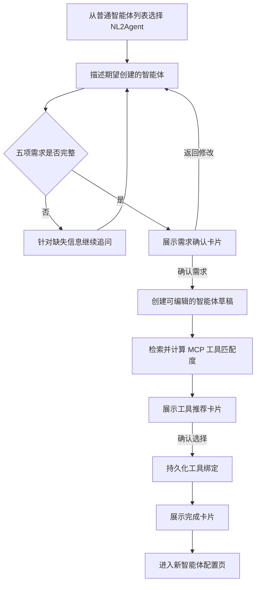

# NL2Agent 内置智能体设计文档

## 1. 概述

NL2Agent 是一个用于辅助用户创建新智能体的内置智能体。它通过多轮对话收集并确认用户需求，从当前租户已安装的 MCP 工具中检索和推荐匹配工具，最终创建一个可继续编辑的智能体草稿。

NL2Agent 通过现有智能体选择器作为普通已发布智能体展示，不在前端注入置顶选项，也不在入口页增加独立的 NL2Agent 卡片。

本设计仅基于当前代码库，不参考历史分支或旧版 NL2Agent 实现。

## 2. 设计目标

- 支持用户通过自然语言和多轮对话描述新智能体需求。
- 在确认需求前，必须同时获得以下五项信息：
  - 用户身份 / 使用场景
  - 期望输入方式
  - 期望输出方式
  - 输出内容
  - 关键约束
- 在需求确认卡片中将五项信息分栏或分区展示。
- 仅搜索当前租户已安装且可用的 MCP 工具。
- 最多推荐五个高匹配度工具，并允许用户多选。
- 只有在用户明确确认后才创建普通智能体草稿。
- 在现有会话历史中持久化卡片、确认状态和最终工具选择。
- 每类卡片使用独立的 React 组件和 GUI 交互设计。

## 3. 非目标

- 不自动发布 NL2Agent 创建的新智能体。
- 不通过 NL2Agent 安装新的 MCP 服务或工具。
- 不读取 MCP 密钥、Token、请求头或本地文件系统配置。
- 不允许大模型生成具有权威性的工具 ID 或直接写数据库。
- 不新增独立的 NL2Agent 会话状态表。
- 不在本次改动中为所有历史智能体请求模型统一补充正整数 ID 校验。

## 4. 已确认的代码约束

### 4.1 Agent ID

当前通用聊天请求没有统一校验 `agent_id > 0`：

```python
class AgentRequest(BaseModel):
    agent_id: Optional[int] = None
```

智能体自动化模块中的部分请求模型已经显式使用 `Field(gt=0)`。虽然通用请求模型没有统一校验，但普通智能体存储在 `ag_tenant_agent_t` 中，其 `agent_id` 由 PostgreSQL Sequence 自动生成；正常运行流程会根据 ID 查询数据库，已发布智能体列表也依赖真实草稿记录和已发布快照。

因此，本设计明确：

- NL2Agent 必须拥有数据库生成的正整数 `agent_id`。
- 不使用 `-1` 等虚拟或保留的负数 ID。
- 所有新增 NL2Agent 请求和响应模型中的智能体 ID 均使用 `Field(gt=0)`。
- NL2Agent 自身的 ID 命名为 `nl2agent_id`。
- NL2Agent 创建的目标智能体 ID 命名为 `target_agent_id`。

### 4.2 普通智能体列表约束

现有已发布智能体列表遵循以下逻辑：

1. 仅查询当前租户的 `version_no=0` 草稿记录。
2. 跳过未启用的智能体。
3. 应用用户组可见性过滤。
4. 要求 `current_version_no > 0`。
5. 要求对应的已发布版本快照存在。

因此，全局 asset-owner 记录、前端虚拟记录或负数 ID 都不能自然进入现有普通智能体列表。NL2Agent 必须按租户创建真实记录并发布版本。

### 4.3 MCP 工具来源

“已安装 MCP 工具”指当前租户存储在 PostgreSQL 中的工具记录，不是用户提供的文件系统路径或 MCP 服务 URL。

只有同时满足以下条件的工具可以参与推荐：

```text
source == "mcp"
is_available == true
```

## 5. 用户流程



需求确认和工具确认必须通过明确的前端操作接口完成。模型不得根据“可以”“没问题”等自由文本自行判断用户已经确认。

## 6. NL2Agent 预置方案

### 6.1 持久化身份

每个租户拥有一个内置 NL2Agent：

| 字段 | 值 |
|---|---|
| `name` | `__nl2agent__` |
| `display_name` | `NL2Agent` |
| `enabled` | `true` |
| `is_main_agent` | `true` |
| `model_ids` | 当前租户默认 LLM 的模型 ID |
| `version_no` | `0`，作为可更新的源记录 |
| `current_version_no` | 最新内置已发布版本 |

`__nl2agent__` 是系统保留名称。普通创建、重命名、复制和导入接口必须拒绝使用该名称。

### 6.2 幂等校准

新增 `ensure_nl2agent_for_tenant(tenant_id, user_id)` 服务，负责：

1. 根据租户和保留名称获取事务级锁。
2. 查询当前租户未删除的 NL2Agent 草稿。
3. 记录不存在时，使用数据库 Sequence 创建真实正整数 ID。
4. 读取当前租户默认 LLM。
5. 仅当内置提示词版本或模型配置发生变化时更新并发布新版本。
6. 返回正整数 `nl2agent_id`。

在构建现有已发布智能体列表前执行该幂等服务，以同时支持：

- 新租户首次进入聊天页时初始化。
- 存量租户首次进入聊天页时自动补齐。
- 租户默认 LLM 变化后的配置同步。

如果租户尚未配置可用默认 LLM，则仍保留 NL2Agent 记录和已发布快照，但沿用现有可用性检查，将其标记为不可用。

### 6.3 列表和编辑权限

- NL2Agent 通过现有 `/agent/published_list` 返回。
- 使用与其他普通智能体相同的选择器样式和选择流程。
- 对当前租户的所有用户可见，不受普通用户组过滤限制。
- 始终按只读权限返回，避免被误编辑或删除。
- 运行时必须先加载并校验真实智能体记录，再根据当前租户和保留名称分派到 NL2Agent 运行逻辑。

## 7. 多轮对话与提示词协议

### 7.1 对话上下文

复用 `AgentRunInfo.history` 传递多轮历史，不新增 NL2Agent 专用会话表。

模型结构化输出包含四种状态：

```text
clarify
requirements_ready
tool_search_ready
complete
```

状态含义如下：

| 状态 | 含义 |
|---|---|
| `clarify` | 五项需求尚未完整，需要继续追问 |
| `requirements_ready` | 五项需求完整，可以展示需求确认卡片 |
| `tool_search_ready` | 需求已确认，可以生成工具推荐卡片 |
| `complete` | 工具选择已确认，创建流程结束 |

### 7.2 五项需求模型

```python
class NL2AgentRequirements(BaseModel):
    user_and_scenario: str = Field(min_length=1)
    input_method: str = Field(min_length=1)
    output_method: str = Field(min_length=1)
    output_content: str = Field(min_length=1)
    constraints: list[str] = Field(min_length=1)
```

只要任意字段为空，模型就不得返回 `requirements_ready`。追问时只询问缺失或存在歧义的部分，并保留已经确认的信息。

字段与用户界面标签必须保持固定映射：

| 字段 | 界面标签 |
|---|---|
| `user_and_scenario` | 用户身份 / 使用场景 |
| `input_method` | 期望输入方式 |
| `output_method` | 期望输出方式 |
| `output_content` | 输出内容 |
| `constraints` | 关键约束 |

### 7.3 智能体草稿生成

当五项需求完整时，模型结构化输出还需要包含待创建智能体的草稿配置：

```python
class GeneratedAgentDraft(BaseModel):
    name: str
    display_name: str
    description: str
    duty_prompt: str
    constraint_prompt: str
    few_shots_prompt: str | None = None
```

需求确认卡片只展示五项需求。生成的智能体名称、描述和提示词作为服务端确认操作的输入保存，不在确认卡片中增加额外栏目。

YAML 提示词必须明确：

- 不得为缺失的需求信息自行编造默认值。
- 不得编造工具 ID 或声称某工具已经安装。
- 不得直接执行数据库操作。
- 将历史中的操作接口返回结果视为权威状态。
- 根据已确认需求生成简洁名称和可执行提示词。

## 8. MCP 工具模糊匹配

### 8.1 工具检索文本

将每个符合条件的工具以下字段组合为标准化检索文本：

- `name`
- `origin_name`
- `description`
- 可用的本地化描述
- `labels`
- `usage`

将五项已确认需求组合为搜索查询文本。

### 8.2 评分规则

使用 RapidFuzz 计算：

```text
score = max(WRatio(query, document), token_set_ratio(query, document)) / 100
```

采用以下固定规则：

| 规则 | 值 |
|---|---|
| 最低推荐分数 | `0.45` |
| 最大推荐数量 | `5` |
| 默认选中阈值 | `0.65` |
| 同分排序 | 按 `tool_id` 升序 |

没有匹配结果属于正常情况。工具卡片展示空状态，并允许用户不绑定任何工具直接完成。

## 9. 操作接口

### 9.1 确认需求

```http
POST /agent/nl2agent/requirements/confirm
```

请求：

```json
{
  "conversation_id": 123,
  "card_id": "requirements-card-uuid"
}
```

处理流程：

1. 校验当前用户和租户是否有权访问该会话。
2. 从已持久化的会话消息单元读取权威待确认卡片。
3. 拒绝不完整、已被取代或不属于当前租户的卡片。
4. 使用租户默认 LLM 创建启用状态的 `version_no=0` 智能体草稿。
5. 将数据库生成的正整数 `target_agent_id` 写回卡片。
6. 将卡片状态更新为已确认。
7. 返回更新后的卡片和继续对话消息。

响应：

```json
{
  "card": {},
  "target_agent_id": 456,
  "continuation_message": "需求已确认，智能体草稿已创建。"
}
```

### 9.2 确认工具

```http
POST /agent/nl2agent/tools/confirm
```

请求：

```json
{
  "conversation_id": 123,
  "card_id": "tools-card-uuid",
  "target_agent_id": 456,
  "selected_tool_ids": [10, 12]
}
```

处理流程：

1. 校验当前用户是否有权访问会话和目标智能体。
2. 校验 `target_agent_id` 与权威卡片记录一致。
3. 校验所有选中工具都属于该卡片的推荐集合。
4. 再次校验工具租户、MCP 来源和当前可用状态。
5. 持久化目标智能体 `version_no=0` 的工具绑定和 `selected_tool_ids`。
6. 将工具卡片状态更新为已确认。
7. 返回继续对话消息。

两个接口都必须幂等。重复确认已经完成的操作时，直接返回已保存结果，不重复创建智能体或工具实例。

操作成功后，前端将接口返回的 `continuation_message` 设置到 assistant-ui composer 并自动发送。这样会话历史中会产生明确的操作结果，NL2Agent 可以从服务端已执行状态继续后续流程。

## 10. 卡片持久化

每张卡片使用统一信封结构：

```ts
type CardEnvelope<T> = {
  card_id: string;
  schema_version: 1;
  status: "pending" | "confirmed" | "superseded" | "failed";
  data: T;
};
```

卡片存储在现有会话消息单元中。需求确认和工具确认接口更新权威消息单元，不依赖仅存在于浏览器内存中的状态。

当生成新的需求确认卡片时，同一创建流程中旧的待确认需求卡片应标记为 `superseded`。工具卡片必须保存最终 `selected_tool_ids`，保证刷新页面或重新打开历史会话后能够恢复提交状态。

卡片状态更新和对应的数据库写入必须在同一事务中完成，或采用等价的锁和幂等边界。

## 11. SSE 与 assistant-ui 集成

### 11.1 两种不同含义的 `type`

后端 SSE 可以使用业务自定义事件类型：

```text
nl2agent_requirements_card
nl2agent_tool_recommendations_card
nl2agent_completion_card
```

assistant-ui 消息 part 中的 `type` 是框架定义的固定判别字段，常见取值包括：

```text
text
reasoning
tool-call
source
image
file
data
```

不能直接将 `nl2agent_requirements_card` 作为 assistant-ui part 的 `type`。当前 `MessagePrimitive.Parts` 会将任意未知类型视为不可渲染内容。

适配层应将 NL2Agent SSE 事件转换为 assistant-ui 原生支持的 `data` 扩展点：

```ts
{
  type: "data",
  name: "nl2agent_requirements_card",
  data: payload,
}
```

流式消息适配器与历史会话适配器必须生成完全一致的 part 数据结构。

### 11.2 每张卡片使用独立 GUI

`type: "data"` 不表示所有卡片共用同一组件。`name` 用于选择独立的 React GUI：

```tsx
<MessagePrimitive.Parts
  components={{
    Text: DirectiveText,
    data: {
      by_name: {
        nl2agent_requirements_card: RequirementsConfirmationCard,
        nl2agent_tool_recommendations_card: McpToolRecommendationCard,
        nl2agent_completion_card: AgentCreationResultCard,
      },
    },
  }}
/>
```

每个组件拥有独立的数据类型、布局、操作按钮、加载状态和错误处理。

### 11.3 需求确认卡片

`RequirementsConfirmationCard` 的 GUI 要求：

- 宽屏下将五项需求展示为五个独立栏位。
- 窄屏下按独立分区响应式换行。
- 不合并期望输入方式、期望输出方式和输出内容。
- 提供明确的确认和返回修改操作。
- 操作请求进行中禁止重复提交。
- 已确认和已被取代的历史卡片以只读状态展示。

### 11.4 MCP 工具推荐卡片

`McpToolRecommendationCard` 的 GUI 要求：

- 展示工具名称、描述、所属 MCP 服务、标签和匹配分数。
- 支持多选。
- 默认选中匹配分数不低于 `0.65` 的工具。
- 根据持久化的 `selected_tool_ids` 恢复选择。
- 支持加载、失败、重试、已确认和无结果状态。

### 11.5 完成卡片

`AgentCreationResultCard` 是创建流程结束后的会话结果卡片，不是智能体选择器中的独立入口。

卡片展示：

- 已创建智能体名称。
- 正整数 `target_agent_id`。
- 最终绑定的 MCP 工具。
- 进入智能体配置页的操作入口。

完成卡片用于明确数据库操作已经成功，并在刷新或打开历史会话后保留可操作的最终结果。

## 12. 安全与失败处理

- 用户和租户身份必须从鉴权信息中获取，不得信任卡片请求体中的身份字段。
- 校验会话、卡片、目标智能体和工具都属于当前租户。
- 不得在 SSE、卡片、日志或模型提示词中包含 MCP Token、请求头或凭据。
- 即使伪造的工具 ID 属于当前租户，只要不在权威推荐卡片中，也必须拒绝。
- 创建目标智能体时如果租户缺少默认 LLM，返回明确的配置错误。
- 数据库尚未提交时发生失败，卡片保持可重试状态。
- 数据库已提交但客户端因网络问题重试时，返回此前保存的成功结果。

## 13. 测试计划

### 13.1 后端测试

- NL2Agent 使用数据库 Sequence 生成 `agent_id > 0`。
- 不存在负数或虚拟 NL2Agent ID 路径。
- 顺序调用和并发调用下，预置服务都保持幂等。
- 存量租户能够通过幂等校准获得 NL2Agent。
- 默认 LLM 变化时，仅在需要时更新内置已发布版本。
- NL2Agent 对当前租户所有用户出现在普通已发布智能体列表中。
- 创建、重命名、复制和导入操作不能占用保留名称。
- 任意需求字段缺失时输出状态必须为 `clarify`。
- 五项需求齐全时才能输出 `requirements_ready`。
- MCP 搜索正确执行租户、来源和可用性过滤。
- 推荐阈值、Top 5、默认选中和同分排序保持确定性。
- 需求确认接口满足授权、原子性和幂等性。
- 工具确认接口拒绝未推荐、跨租户、非 MCP 或不可用工具。
- 最终 `selected_tool_ids` 和工具绑定能够持久化。

### 13.2 前端测试

- 流式适配器和历史适配器生成相同的 `data` part。
- 三种卡片名称分别渲染独立 GUI 组件。
- 五项需求在宽屏下分五栏，在窄屏下保持独立分区。
- 页面刷新和历史会话加载后恢复工具选择。
- 正确展示待确认、已确认、已取代、失败、重试和空结果状态。
- 操作成功后自动发送继续对话消息。
- NL2Agent 只作为普通智能体选择项出现。
- 普通文本、推理、工具调用和来源内容的渲染不受影响。

### 13.3 端到端测试

1. 从普通智能体列表选择 NL2Agent。
2. 只提供部分需求，验证 NL2Agent 针对缺失项继续追问。
3. 补齐五项需求，验证需求确认卡片和分栏布局。
4. 修改一项需求，验证旧卡片变为已取代状态。
5. 确认需求，验证创建正整数 ID 的目标智能体草稿。
6. 验证 MCP 工具推荐和默认选中结果。
7. 修改工具多选结果并确认。
8. 刷新会话，验证两类确认卡片状态和工具选择恢复。
9. 从完成卡片进入新智能体配置页。
10. 验证新智能体仍是可编辑且未发布的草稿。

## 14. 预计改动范围

实现预计涉及：

- 后端 NL2Agent 运行模块和 YAML 提示词。
- 智能体预置、创建、版本发布、工具绑定和会话服务。
- NL2Agent 操作接口及 Pydantic 请求响应模型。
- SSE 事件生成和历史消息序列化。
- newchat 流式与历史消息适配器。
- 独立的需求确认、MCP 工具推荐和完成卡片组件。
- 后端、前端和端到端测试。
