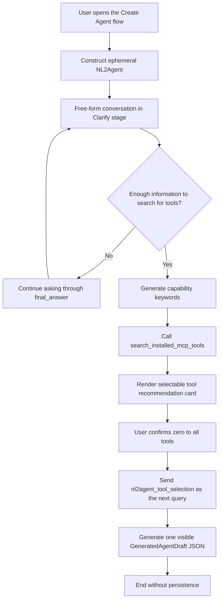

# NL2Agent Ephemeral Agent Design

## 0. Current Implementation Phase

The minimum verifiable implementation currently provides only these capabilities:

- Reuse the ordinary chat UI through `/newchat?mode=nl2agent` and its existing stream rendering.
- Construct NL2Agent in backend memory for every request without saving an agent or conversation.
- Bind only `search_installed_mcp_tools` and render a selectable recommendation card from the structured `nl2a` SSE stored in assistant message metadata.
- Select all recommendations by default, allow zero to all tools, and make the card read-only immediately after confirmation.
- Send selected safe tool metadata through the next NL2Agent query and generate one visible `GeneratedAgentDraft` JSON with one few-shot per selected tool.
- Do not implement the final creation confirmation card, confirmation API, draft revision flow, persistence, or target-agent creation.

Sections 7.3 through 9 describe the later persistence design rather than currently implemented behavior.

## 1. Design Goals

NL2Agent is an ephemeral ReAct agent started from the dedicated "Create Agent" entry point. The current MVP clarifies user requirements, recommends MCP tools installed for the current tenant, and returns a generated agent draft as visible JSON after tool selection. Creating an editable database draft remains a later phase.

Core principles:

- NL2Agent is constructed only while handling the current request and has no database agent record.
- The current page maintains multi-turn context through the `history` field in each request.
- NL2Agent conversations, cards, and runtime state are not written to history. Refreshing or leaving the page starts a new flow.
- The model decides when to continue clarifying, when to search for tools, and how to generate the final JSON draft.
- The current flow never creates a database draft.
- The server owns authentication, input validation, and tenant-isolated tool search. Transactions and idempotency belong to the later persistence phase.
- A future persisted target agent will use the standard draft, tool-binding, and publishing lifecycle.

## 2. Ephemeral Runtime Architecture

### 2.1 Entry Point

The frontend calls the ephemeral endpoint from the existing `/newchat?mode=nl2agent` page:

```http
POST /agent/nl2agent/run
```

Request:

```json
{
  "query": "The user's current input",
  "history": [
    {"role": "user", "content": "..."},
    {"role": "assistant", "content": "..."}
  ],
  "minio_files": []
}
```

`query` is normally the current user-visible input. When a user confirms a recommendation card, the local summary remains visible while the adapter serializes `metadata.custom.nl2agentToolSelection` as the current query:

```json
{"type":"nl2agent_tool_selection","tools":[]}
```

`history` is assembled from the current frontend page state, and `minio_files` uses the existing attachment description format. The request does not contain an `agent_id` or `conversation_id`.

### 2.2 Runtime Configuration

The server constructs `AgentConfig` and `AgentRunInfo` in memory from:

- The current tenant's default LLM.
- The NL2Agent duty prompt.
- The NL2Agent runtime Local MCP tool.
- The conversation history and attachments in the current request.
- The user, tenant, and language resolved from the authentication context.

The ephemeral configuration uses `__nl2agent_runtime__` as a runtime-only name. It is not persisted and is not reserved as a normal agent name.

The runtime constructs the SDK run object directly and does not enter the ordinary agent database or conversation path:

```text
build_nl2agent_run_info (thin wrapper: builds the in-memory AgentConfig)
  -> AgentRunInfo
  -> agent_run
  -> agent_run_thread
  -> NexentAgent.create_single_agent
  -> CoreAgent ReAct loop
```

NL2Agent does not modify `create_agent_run_info` or `run_agent_stream`. Its wrapper reuses tenant default-model construction and attachment-description assembly, then creates `AgentRunInfo` directly. Observer JSON from `agent_run` is wrapped in the SSE format already parsed by the frontend. When the browser cancels the request, the stream generator sets the run-scoped `stop_event`.

The current MVP search tool is registered on the Local MCP service. NL2Agent configures it with `source="mcp"` and connects to `NEXENT_MCP_SERVER/sse` through `AgentRunInfo.mcp_host`. The authenticated request's `Authorization` header is forwarded to that connection, and the MCP tool independently resolves the tenant before searching.

NL2Agent does not load configuration through the database-backed `create_agent_config`, does not appear in the ordinary agent selector, and does not require a database-generated agent ID.

### 2.3 Lifecycle

- Each `/agent/nl2agent/run` request creates a new ephemeral runtime from the supplied `history`.
- The runtime serves only the current SSE request and may be released when the stream ends.
- It does not read or write conversations, messages, historical cards, or history summaries.
- It does not enable long-term memory, historical context loading, conversation title generation, or SSE resume.
- Refreshing, closing, or leaving the creation flow discards the frontend history, draft, and card state.
- The current NL2Agent flow ends after the generated Draft JSON is returned.

## 3. ReAct Conversation Flow



The model searches once the available information is sufficient to identify required capabilities and search terms. On a tool-selection query it must not search again; it combines the selected tools with the preceding requirement history and emits only the draft JSON. This confirmation generates content only and does not create an agent.

## 4. Prompt and Runtime Tools

### 4.1 Duty Prompt

NL2Agent has no standalone YAML file, database prompt record, or prompt-loader entry. Whenever the ephemeral `AgentConfig` is built, the backend assembles role, workflow, keyword schema, few-shots, constraints, and final-response sections from the authenticated language, runtime tool name, and result limit. It injects this text through `AgentConfig.instructions` into the SDK's default CodeAgent system prompt.

The duty prompt uses consistent stage-specific instructions:

- `clarify`: Learn the agent's goals, usage scenario, inputs, outputs, constraints, and success criteria through free-form conversation. Do not require a fixed structure or emit a requirements confirmation card.
- `tool_search`: Once there is enough information to identify required capabilities, generate 1 to 10 concise capability keywords, call `search_installed_mcp_tools`, and preserve the result with `print(result)`.
- `tool_search_retry`: If a successful search using Chinese keywords returns no recommendations, translate the same capabilities to English and retry exactly once.
- `recommendation_output`: Review the candidates against the conversation, keep only suitable complete objects, and return them in one `<nl2a>` wrapper. The model may remove or reorder objects but may not alter their fields.
- `tool_selection`: When the current query has `type="nl2agent_tool_selection"`, do not search again. Generate the complete draft JSON from the preceding requirements and selected tools.
- `ready_to_create` (later phase): Persist or present a final creation confirmation. The current MVP explicitly prohibits entering this phase or claiming that an agent was created.
- Tool Observations tell the model the search result and allowed next action.
- The model must not generate or override user IDs, tenant IDs, authorization data, card IDs, or tool credentials.

The prompt contains two concise few-shots: ask one clarification question without a tool call when the request is unclear; generate keywords, call the MCP tool, and print its original result when the request is clear. The retry instructions include a separate English-keyword action. Examples contain no fixed Observation, preventing the model from copying or inventing search results. Executable actions consistently use `<code>...</code>` tags.

### 4.2 Runtime Tool Construction

The current MVP binds only one runtime tool:

```text
search_installed_mcp_tools
```

The search tool is mounted without a prefix on the existing Local MCP server and marked with `nexent_internal=true`, so public MCP catalog scans skip it. The prebuilt `AgentConfig` references the tool with `source="mcp"` and does not persist a tool catalog or instance record.

For each `/agent/nl2agent/run` request, the backend passes the authenticated `Authorization` header to the Local MCP SSE connection. Tenant scope and the fixed result limit do not appear in the model-visible argument schema.

The per-run factory follows this shape:

```python
search_config = ToolConfig(
    class_name="search_installed_mcp_tools",
    name="search_installed_mcp_tools",
    inputs='{"keywords": "list[str]"}',
    source="mcp",
    usage="outer-apis",
    params={},
)
mcp_host = [{
    "url": urljoin(NEXENT_MCP_SERVER, "sse"),
    "transport": "sse",
    "headers": {"Authorization": authorization},
}]
```

`search_installed_mcp_tools` exposes one model-visible `keywords: string[]` argument. The Local MCP schema rejects type mismatches; the handler validates 1 to 10 trimmed, non-empty strings of at most 100 characters and de-duplicates normalized values while preserving order.

The MCP tool description includes a `print(result)` call example so the Agent writes the returned JSON unchanged to the existing `execution_logs`.

The successful Observation has this fixed shape:

```python
class InstalledMcpToolRecommendation(BaseModel):
    tool_id: int
    name: str
    origin_name: str | None
    description: str
    source: Literal["mcp"]
    usage: str
    labels: list[str]
    inputs: str
    score: float


class SearchInstalledMcpToolsObservation(BaseModel):
    status: Literal["success"]
    recommendation_count: int
    recommendations: list[InstalledMcpToolRecommendation]


class SearchInstalledMcpToolsErrorObservation(BaseModel):
    status: Literal["error"]
    code: Literal["invalid_keywords", "tool_search_failed"]
    retryable: Literal[True]
```

Serialized success, empty, and error Observations contain only the business fields above. They do not carry `_assistant_ui` presentation metadata. The raw tool Observation remains in `execution_logs` and is displayed in ToolFallback's Result area.

An empty result is a successful completed search. Keyword validation, database, or ranking failures return retryable error Observations without internal exception details. After a search, the model filters the candidate objects and copies the resulting JSON into exactly one `<nl2a>...</nl2a>` wrapper in `final_answer`. The opt-in `MessageObserver(enable_nl2a_wrapper=True)` extracts a valid object into a separate `nl2a` SSE event and removes the wrapper from visible text. An invalid wrapper is removed without emitting an `nl2a` event.

`present_creation_confirmation_card` and shared per-run card state are deferred to the later card phase.

## 5. Ephemeral Agent Draft

```python
class GeneratedAgentDraftTool(BaseModel):
    tool_id: int
    name: str
    origin_name: str | None
    description: str
    source: Literal["mcp"]
    usage: str
    labels: list[str]
    inputs: str
    few_shots_prompt: str | None = None


class GeneratedAgentDraft(BaseModel):
    model_config = ConfigDict(
        extra="forbid",
        str_strip_whitespace=True,
    )

    name: str = Field(min_length=1, max_length=100)
    display_name: str = Field(min_length=1, max_length=100)
    description: str = Field(min_length=1)
    duty_prompt: str = Field(min_length=1)
    constraint_prompt: str = Field(min_length=1)
    few_shots_prompt: str | None = None
    tools: list[GeneratedAgentDraftTool]
```

Field requirements:

- `name` follows normal agent naming rules and is checked again for conflicts during final confirmation.
- `display_name` is the user-facing name.
- `description` summarizes the purpose, target users, and primary capabilities.
- `duty_prompt` defines responsibilities, task flow, and output requirements.
- `constraint_prompt` defines boundaries, permissions, safety requirements, and failure handling.
- `few_shots_prompt` is generated only when examples materially improve behavioral stability.
- `tools` preserves the selected tools in recommendation order. Each tool keeps its safe metadata and raw `inputs` string, drops `score`, and receives a non-empty tool-level `few_shots_prompt`.
- Unknown fields are rejected, and all strings are stripped of surrounding whitespace.

The draft is returned as the only visible JSON in the model's final answer. It is not parsed by the backend or written to the database in this MVP.

A target agent created by the later persistence phase will have these properties:

- A database-generated `target_agent_id > 0`.
- `version_no=0`.
- `enabled=true`.
- The current tenant's default LLM.
- An initial editable draft state.
- No automatic publication.

## 6. MCP Tool Recommendations

### 6.1 Data Scope

Only tools from the current tenant that satisfy the following conditions are searched:

```text
source == "mcp"
is_available == true
```

The scope intentionally remains MCP-only. Local and statically discovered LangChain tools may require per-agent model, knowledge-base, secret, or other initialization parameters, while the current recommendation and confirmation flow selects only `tool_id` values and has no configuration step. Recommending those tools would allow NL2Agent to create a draft that cannot run.

The model and frontend cannot access MCP tokens, request headers, secrets, or connection credentials.

The backend search function obtains candidates from `query_all_tools(tenant_id)`, which already enforces tenant ownership and excludes soft-deleted rows, and then applies the `source` and availability filters above. The runtime search tool itself is absent from this query because it is never persisted. Results include safe metadata and the raw `inputs` schema string needed to generate calls; `params`, headers, tokens, and other executable configuration are excluded.

### 6.2 Search Fields

The searchable tool document contains:

- `name`
- `origin_name`
- `description`
- `labels`
- `usage`

Before matching, values are converted to strings, Unicode-normalized, lowercased, stripped, and whitespace-collapsed. Missing optional fields contribute an empty string. Labels retain their list order and are joined with spaces.

The model supplies 1 to 10 capability keywords. The Local MCP handler validates and de-duplicates them, joins them with spaces in their preserved order, and passes that query text to the tenant-scoped search function. Tenant scope and result limits remain server-controlled.

### 6.3 Matching Rules

Matching uses RapidFuzz:

```text
score = max(
    WRatio(query, tool_document),
    token_set_ratio(query, tool_document)
) / 100
```

`rapidfuzz>=3.0.0` is a direct backend dependency for this feature rather than an implicit transitive dependency. Ranking is entirely deterministic and invokes no model or external service.

Fixed rules:

| Rule | Value |
|---|---|
| Minimum recommendation score | `0.45` |
| Maximum recommendation count | `5` |
| Tie-break order | Ascending `tool_id` |

Candidates below the minimum score are discarded. The remaining candidates are sorted by descending score and then ascending `tool_id`, truncated to five, and their scores are rounded to four decimal places in the tool Observation.

The score thresholds are initial values and are expected to be tuned with real usage data.

When no tool matches, the frontend renders an empty-state recommendation card from the successful Observation.

### 6.4 Tool Selection

- Every successful recommendation card selects all returned tools by default.
- Users may select zero to all tools, including continuing from an empty result.
- Confirmation preserves recommendation order, removes `score`, and adds `few_shots_prompt: null`.
- The card becomes read-only immediately and prevents duplicate submission.
- Cross-message superseding and `draft_revision` management are deferred.

## 7. Tool Recommendation Card and Frontend State

### 7.1 Structured Recommendation Event

The recommendation card is driven by the model-filtered `nl2a` SSE event, not by the raw tool result. The event content is either the successful recommendation contract or the sanitized error contract from Section 4.2.

The frontend parses this event into `Nl2aMessage` and stores it in `message.metadata.custom.nl2a`. The raw search Observation independently remains attached to the preceding tool call as `execution_logs`.

### 7.2 Tool Recommendation Card

The tool recommendation card contains:

- Each recommended tool's `tool_id`, name, description, MCP source, labels, and match score.
- Empty-result or search-failure state.
- Native checkboxes, selected count, and a confirmation action for successful results.

All successful recommendations are selected by default. Empty success results can continue without tools; failures cannot be confirmed. Confirmation appends a localized summary message while storing the full selection JSON in message metadata, then locks the card.

### 7.3 Final Creation Confirmation Card (Later Phase)

The final confirmation card contains:

- The complete `GeneratedAgentDraft`.
- The agent name and purpose summary.
- The associated `draft_revision`.
- The most recent valid recommendation set.
- A notice that enough information has been collected and confirmation will write it to an agent draft.

The card exposes only a confirmation button. The frontend dynamically displays the tools that will be bound by reading the latest selection state for the same `draft_revision`.

### 7.4 assistant-ui Mapping

New chat lives under `app/[locale]/newchat/`, and its shared streaming adapter handles SSE for ordinary agents and NL2Agent.

Recommendation events are mapped as follows:

1. `execution_logs` remains attached to the preceding tool call.
2. `nl2a` is an internal metadata event and is not converted into an assistant-ui message part.
3. The adapter parses the event and adds `{custom: {nl2a}}` to the streamed assistant message metadata.
4. `AssistantMessage` reads that metadata and renders `ToolRecommendations` after the grouped tool-call UI.
5. NL2Agent history is not persisted or restored, so no historical adapter mapping is implemented.

## 8. Final Confirmation API (Later Phase)

```http
POST /agent/nl2agent/confirm
```

Request:

```json
{
  "card_id": "confirmation-card-uuid",
  "draft": {
    "name": "agent_name",
    "display_name": "Agent Name",
    "description": "...",
    "duty_prompt": "...",
    "constraint_prompt": "...",
    "few_shots_prompt": null,
    "tools": []
  },
  "selected_tool_ids": [10, 12]
}
```

DTO:

```python
class NL2AgentConfirmRequest(BaseModel):
    model_config = ConfigDict(extra="forbid")

    card_id: UUID
    draft: GeneratedAgentDraft
    selected_tool_ids: list[int]
```

`selected_tool_ids` is stably deduplicated, and every value must be a positive integer.

Server behavior:

1. Resolve the current user and tenant from the authentication context.
2. Revalidate the complete draft, agent name, and field lengths.
3. Revalidate that every tool belongs to the current tenant, has `source="mcp"`, and is still available.
4. Idempotency is Redis-based and introduces no new database table. The key is derived from tenant, user, and `card_id`. If the key already holds a `target_agent_id`, return it directly; if the key is held as an in-progress lock, reject with a retryable conflict.
5. Acquire the in-progress lock via `SET NX` with a TTL, then create the target agent draft at `version_no=0` and write tool bindings in one database transaction.
6. After commit, write `target_agent_id` into the idempotency key with a bounded TTL that covers realistic retry windows (for example 24 hours); on failure, release the lock.
7. Return the target agent ID and draft configuration URL.

Success response:

```json
{
  "target_agent_id": 456,
  "draft_url": "/agents/456?version_no=0"
}
```

After a successful response, the frontend marks the confirmation card as `confirmed`, tells the user that all relevant information has been written to the agent draft, and directs the user to inspect the draft.

Repeated submissions with the same idempotency key return the existing draft within the idempotency TTL; beyond the TTL, the frontend's `confirmed` card state prevents resubmission. Validation or transaction failures must not retain a partial agent or tool bindings, and must release the in-progress lock without recording a success. The card becomes `failed`, and transient failures may be retried.

## 9. Security and Consistency (Later Phase)

- User and tenant identity comes only from the authentication context.
- The submitted draft is user-controlled configuration and still undergoes all standard agent validation rules.
- Submitted tool IDs have no authorization authority and must be revalidated for tenant, source, and availability.
- The model and frontend cannot submit or read MCP credentials.
- Agent draft creation and tool bindings share one database transaction; the idempotency record is Redis-based, with an in-progress lock preventing concurrent duplicates. No new database table is introduced for idempotency.
- A `card_id` is idempotent only within the current tenant and user scope and cannot be reused across identities.
- NL2Agent does not persist runtime history, so frontend page state is never an authorization source.
- The search-before-confirmation-card precondition is enforced per run for product quality only; security relies entirely on the confirmation API revalidating the draft and every submitted tool ID.
- The Local MCP search tool is marked internal, is not persisted as an NL2Agent tool instance, and is skipped by public MCP catalog scans.
- Bound tenant and user context never appears in model-visible tool arguments; the search service independently applies the tenant condition.
- NL2Agent passes the authenticated request header only through the server-built MCP connection; the model cannot read or override it.
- After creation, the target agent follows the existing editing, publishing, permission, and version-management rules.

## 10. Test Plan

### 10.1 Backend

- `/agent/nl2agent/run` executes with an ephemeral configuration and the tenant's default LLM.
- The ephemeral run neither queries an NL2Agent database record nor saves conversations, messages, or history summaries.
- Request `history` is converted correctly to SDK `AgentHistory` without database history augmentation.
- The ephemeral run does not enable memory search, history recovery, or SSE resume.
- The runtime search tool exposes only keyword data to the model and receives authentication through the server-built MCP connection.
- The generated `ToolConfig` uses `source="mcp"` and `usage="outer-apis"` without creating or updating tool catalog rows.
- Keyword validation, normalization, de-duplication, score threshold, Top 5 limit, score rounding, and tie-break order remain deterministic.
- Tool search returns only installed and available MCP tools from the current tenant, includes raw `inputs`, and excludes `params` and credentials.
- Success, empty, and error Observations contain only their business contracts and expose no executable configuration or `_assistant_ui` metadata.
- The Chinese and English duty prompts contain clarification and MCP tool-call few-shots whose executable example preserves `print(result)`.
- The prompts require exactly one English-keyword retry after a successful Chinese-keyword empty result.
- The model may filter or reorder returned candidates but must preserve every field of retained objects.
- A valid `<nl2a>` object is emitted as an `nl2a` SSE event before the visible final answer; invalid wrapper JSON is removed without emitting an event.
- Tool-selection queries prohibit another search and require one non-empty, input-aware few-shot for every selected tool.
- Generated drafts allow an empty tool list and are returned as plain JSON without an `<nl2a>` wrapper.
- Empty search results count as successful searches, while backend failures return sanitized retryable errors.

### 10.2 Frontend

- The dedicated Create Agent entry starts NL2Agent, and the ordinary agent selector does not show it.
- Current-page history supports multi-turn clarification, while refresh or exit does not restore the flow.
- `execution_logs` remains attached to ToolFallback, while `nl2a` is parsed into `message.metadata.custom.nl2a`.
- The recommendation card renders after the grouped tool-call UI without creating an assistant-ui data part.
- The tool recommendation card renders recommendation, empty, and failed states.
- Successful cards default to all tools selected and support full, partial, and zero-tool selections.
- Empty success cards allow continuing without tools; error cards cannot be confirmed.
- Confirmation preserves recommendation order, removes `score`, adds `few_shots_prompt: null`, and immediately makes the card read-only.
- A synchronous guard prevents duplicate confirmation before the React state update is committed.
- The NL2Agent adapter sends selection metadata as the query without changing ordinary-agent requests.
- Existing non-NL2Agent SSE messages and cards are unaffected.

### 10.3 End-to-End

1. Start NL2Agent from the dedicated Create Agent entry point.
2. Provide incomplete requirements and verify free-form model clarification.
3. Supply enough information for search and verify capability keyword generation and the MCP recommendation card.
4. Verify that the visible recommendation set exactly matches the model-filtered `nl2a` payload.
5. Confirm the default full selection and verify that the card becomes read-only.
6. Repeat with partial and zero-tool selections, including an empty successful recommendation.
7. Verify that the next request query is `nl2agent_tool_selection` JSON while its visible user message is only the localized summary.
8. Verify that the final answer is one plain `GeneratedAgentDraft` JSON object and each selected tool has one concrete few-shot.
9. Verify that no agent, conversation, card, or tool binding is persisted.
10. Refresh the creation page and verify that the NL2Agent conversation and cards are not restored.

## 11. Implementation Contract

- The model owns semantic clarification, keyword generation, candidate filtering, draft generation, and tool-level few-shots.
- The server owns ephemeral runtime configuration, authenticated tenant scope, search validation, deterministic ranking, and safe Observation contracts.
- The frontend owns current-page conversation history, per-card selection state, the confirmation summary, and selection metadata.
- The NL2Agent search tool is a non-persistent internal Local MCP tool.
- The SDK change is limited to an opt-in `nl2a` wrapper extractor; ordinary observers keep it disabled by default.
- Tool confirmation triggers Draft JSON generation only and performs no database write.
- Card revisioning, final creation confirmation, persistence, transactions, and idempotency remain the later design described in Sections 7.3 through 9.
- The Chinese and English design documents define identical behavior.
