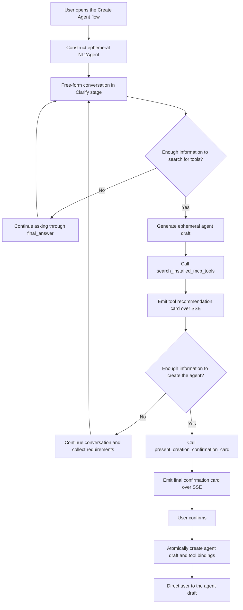

# NL2Agent Ephemeral Agent Design

## 1. Design Goals

NL2Agent is an ephemeral ReAct agent started from the dedicated "Create Agent" entry point. It clarifies user requirements through natural-language conversation, recommends MCP tools installed for the current tenant, and creates an editable agent draft after final user confirmation.

Core principles:

- NL2Agent is constructed only while handling the current request and has no database agent record.
- The current page maintains multi-turn context through the `history` field in each request.
- NL2Agent conversations, cards, and runtime state are not written to history. Refreshing or leaving the page starts a new flow.
- The model decides when to continue clarifying, when to search for tools, and when enough information exists to create the agent.
- No database draft is created before final confirmation.
- The server owns authentication, data validation, tenant isolation, transactions, and idempotency.
- The resulting target agent uses the standard draft, tool-binding, and publishing lifecycle.

## 2. Ephemeral Runtime Architecture

### 2.1 Entry Point

The frontend calls a dedicated endpoint from the "Create Agent" flow:

```http
POST /agent/nl2agent/run
```

Request:

```json
{
  "query": "The user's current input",
  "history": [
    {"role": "user", "content": "..."},
    {"role": "assistant", "content": "..."}
  ],
  "minio_files": []
}
```

`query` is the current user input, `history` is assembled from the current frontend page state, and `minio_files` uses the existing attachment description format. The request does not contain an `agent_id` or `conversation_id`.

### 2.2 Runtime Configuration

The server constructs `AgentConfig` and `AgentRunInfo` in memory from:

- The current tenant's default LLM.
- The NL2Agent duty prompt.
- The NL2Agent platform tools.
- The conversation history and attachments in the current request.
- The user, tenant, and language resolved from the authentication context.

The ephemeral configuration uses `__nl2agent_runtime__` as a runtime-only name. It is not persisted and is not reserved as a normal agent name.

The runtime reuses the existing SDK chain:

```text
build_nl2agent_run_info
  -> agent_run_thread
  -> NexentAgent.create_single_agent
  -> CoreAgent ReAct loop
```

NL2Agent does not load configuration through the database-backed `create_agent_config`, does not appear in the ordinary agent selector, and does not require a database-generated agent ID.

### 2.3 Lifecycle

- Each `/agent/nl2agent/run` request creates a new ephemeral runtime from the supplied `history`.
- The runtime serves only the current SSE request and may be released when the stream ends.
- It does not read or write conversations, messages, historical cards, or history summaries.
- It does not enable long-term memory, historical context loading, conversation title generation, or SSE resume.
- Refreshing, closing, or leaving the creation flow discards the frontend history, draft, and card state.
- The NL2Agent flow ends after the target agent draft is created successfully.

## 3. ReAct Conversation Flow



The model uses two independent readiness thresholds:

1. It may search for tools once the available information is sufficient to identify required capabilities and search terms.
2. It may present the final confirmation card once the available information is sufficient to generate a usable agent configuration.

Tool search may happen before requirement collection is complete. Search results may inform later clarification, but the final confirmation card requires at least one completed tool search.

After the final confirmation card is emitted, the flow enters `awaiting_confirmation`. The frontend stops accepting new requirement input, and the user may only confirm creation or leave the flow.

## 4. Prompt and Platform Tools

### 4.1 Duty Prompt

The NL2Agent duty prompt uses consistent stage-specific instructions:

- `clarify`: Learn the agent's goals, usage scenario, inputs, outputs, constraints, and success criteria through free-form conversation. Do not require a fixed structure or emit a requirements confirmation card.
- `tool_search`: Once there is enough information to identify required capabilities, generate a complete `GeneratedAgentDraft` and call `search_installed_mcp_tools`. Do not search without a draft.
- `ready_to_create`: Once the draft is sufficiently complete and at least one tool search has finished, call `present_creation_confirmation_card`. Do not claim completion in plain text.
- Tool Observations tell the model the search result, card generation result, and allowed next action.
- The model must not generate or override user IDs, tenant IDs, authorization data, card IDs, or tool credentials.

### 4.2 Platform Tools

The ephemeral NL2Agent binds only two platform tools:

```text
search_installed_mcp_tools
present_creation_confirmation_card
```

The tools receive the server-injected user, tenant, language, `MessageObserver`, and controlled callbacks through `ToolConfig.metadata`. The model cannot supply or override this security context.

`search_installed_mcp_tools` accepts the current `GeneratedAgentDraft`. The server builds search text from the draft fields and emits a tool recommendation card directly through `ProcessType.CARD`.

`present_creation_confirmation_card` accepts the complete current draft and the identifier of the most recent valid tool search, then emits the final confirmation card through `ProcessType.CARD`. The call is rejected if there is no valid tool search.

## 5. Ephemeral Agent Draft

```python
class GeneratedAgentDraft(BaseModel):
    model_config = ConfigDict(
        extra="forbid",
        str_strip_whitespace=True,
    )

    name: str = Field(min_length=1, max_length=100)
    display_name: str = Field(min_length=1, max_length=100)
    description: str = Field(min_length=1)
    duty_prompt: str = Field(min_length=1)
    constraint_prompt: str = Field(min_length=1)
    few_shots_prompt: str | None = None
```

Field requirements:

- `name` follows normal agent naming rules and is checked again for conflicts during final confirmation.
- `display_name` is the user-facing name.
- `description` summarizes the purpose, target users, and primary capabilities.
- `duty_prompt` defines responsibilities, task flow, and output requirements.
- `constraint_prompt` defines boundaries, permissions, safety requirements, and failure handling.
- `few_shots_prompt` is generated only when examples materially improve behavioral stability.
- Unknown fields are rejected, and all strings are stripped of surrounding whitespace.

The ephemeral draft exists only in the current frontend page state and SSE card payloads. It is not written to the database before final confirmation.

The resulting target agent has these properties:

- A database-generated `target_agent_id > 0`.
- `version_no=0`.
- `enabled=true`.
- The current tenant's default LLM.
- An initial editable draft state.
- No automatic publication.

## 6. MCP Tool Recommendations

### 6.1 Data Scope

Only tools from the current tenant that satisfy the following conditions are searched:

```text
source == "mcp"
is_available == true
```

The model and frontend cannot access MCP tokens, request headers, secrets, or connection credentials.

### 6.2 Search Fields

The searchable tool document contains:

- `name`
- `origin_name`
- `description`
- Localized descriptions
- `labels`
- `usage`

The server builds search text from the ephemeral draft's `display_name`, `description`, `duty_prompt`, `constraint_prompt`, and `few_shots_prompt`. The model cannot provide an arbitrary search scope or tenant condition separately.

### 6.3 Matching Rules

Matching uses RapidFuzz:

```text
score = max(
    WRatio(query, tool_document),
    token_set_ratio(query, tool_document)
) / 100
```

Fixed rules:

| Rule | Value |
|---|---|
| Minimum recommendation score | `0.45` |
| Maximum recommendation count | `5` |
| Default selection threshold | `0.65` |
| Tie-break order | Ascending `tool_id` |

When no tool matches, the server emits an empty-state tool card and allows creation without tool bindings.

### 6.4 Draft Revisions and Tool Selection

- Each new draft generated for a search receives a new `draft_revision`.
- The tool recommendation card selects tools scoring at least `0.65` by default.
- Users may select or clear tools on the latest recommendation card.
- A new tool search marks older recommendation cards and confirmation cards based on older revisions as `superseded`.
- A new recommendation card uses its new default selection set and does not inherit selections from an older revision.
- The final confirmation card always reads the latest selection state from the tool card with the same `draft_revision`.

## 7. SSE Cards and Frontend State

### 7.1 Card Envelope

Both platform tools emit through the existing `ProcessType.CARD`:

```ts
type NL2AgentCardEnvelope<T> = {
  card_id: string;
  draft_revision: string;
  schema_version: 1;
  name:
    | "nl2agent_tool_recommendations_card"
    | "nl2agent_creation_confirmation_card";
  status: "pending" | "confirmed" | "superseded" | "failed";
  data: T;
};
```

The server generates both `card_id` and `draft_revision`. Cards are delivered only through the current SSE stream and are not stored in conversation message units.

### 7.2 Tool Recommendation Card

The tool recommendation card contains:

- The current `draft_revision`.
- Each recommended tool's `tool_id`, name, description, MCP source, labels, and match score.
- Default selected tool IDs.
- Empty-result or search-failure state.

The frontend owns selection state for the current page and prevents duplicate actions while a request is in progress.

### 7.3 Final Confirmation Card

The final confirmation card contains:

- The complete `GeneratedAgentDraft`.
- The agent name and purpose summary.
- The associated `draft_revision`.
- The most recent valid recommendation set.
- A notice that enough information has been collected and confirmation will write it to an agent draft.

The card exposes only a confirmation button. The frontend dynamically displays the tools that will be bound by reading the latest selection state for the same `draft_revision`.

### 7.4 assistant-ui Mapping

The streaming adapter converts NL2Agent `card` events to:

```ts
{
  type: "data",
  name: envelope.name,
  data: envelope,
}
```

Component mapping:

```tsx
<MessagePrimitive.Parts
  components={{
    Text: DirectiveText,
    data: {
      by_name: {
        nl2agent_tool_recommendations_card: McpToolRecommendationCard,
        nl2agent_creation_confirmation_card: AgentCreationConfirmationCard,
      },
    },
  }}
/>
```

NL2Agent has no historical conversation adapter. Existing non-NL2Agent text, reasoning, tool-call, source, and card rendering remains unchanged.

## 8. Final Confirmation API

```http
POST /agent/nl2agent/confirm
```

Request:

```json
{
  "card_id": "confirmation-card-uuid",
  "draft": {
    "name": "agent_name",
    "display_name": "Agent Name",
    "description": "...",
    "duty_prompt": "...",
    "constraint_prompt": "...",
    "few_shots_prompt": null
  },
  "selected_tool_ids": [10, 12]
}
```

DTO:

```python
class NL2AgentConfirmRequest(BaseModel):
    model_config = ConfigDict(extra="forbid")

    card_id: UUID
    draft: GeneratedAgentDraft
    selected_tool_ids: list[int]
```

`selected_tool_ids` is stably deduplicated, and every value must be a positive integer.

Server behavior:

1. Resolve the current user and tenant from the authentication context.
2. Revalidate the complete draft, agent name, and field lengths.
3. Revalidate that every tool belongs to the current tenant, has `source="mcp"`, and is still available.
4. Look up an existing creation result using tenant, user, and `card_id` as the idempotency key.
5. Create the target agent draft at `version_no=0` and write tool bindings in one transaction.
6. Persist the mapping from the idempotency key to `target_agent_id`.
7. Return the target agent ID and draft configuration URL.

Success response:

```json
{
  "target_agent_id": 456,
  "draft_url": "/agents/456?version_no=0"
}
```

After a successful response, the frontend marks the confirmation card as `confirmed`, tells the user that all relevant information has been written to the agent draft, and directs the user to inspect the draft.

Repeated submissions with the same idempotency key return the existing draft. Validation or transaction failures must not retain a partial agent, tool bindings, or a successful idempotency record. The card becomes `failed`, and transient failures may be retried.

## 9. Security and Consistency

- User and tenant identity comes only from the authentication context.
- The submitted draft is user-controlled configuration and still undergoes all standard agent validation rules.
- Submitted tool IDs have no authorization authority and must be revalidated for tenant, source, and availability.
- The model and frontend cannot submit or read MCP credentials.
- Agent draft creation, tool bindings, and the idempotency result share one transaction boundary.
- A `card_id` is idempotent only within the current tenant and user scope and cannot be reused across identities.
- NL2Agent does not persist runtime history, so frontend page state is never an authorization source.
- After creation, the target agent follows the existing editing, publishing, permission, and version-management rules.

## 10. Test Plan

### 10.1 Backend

- `/agent/nl2agent/run` executes with an ephemeral configuration and the tenant's default LLM.
- The ephemeral run neither queries an NL2Agent database record nor saves conversations, messages, or history summaries.
- Request `history` is converted correctly to SDK `AgentHistory` without database history augmentation.
- The ephemeral run does not enable memory search, history recovery, or SSE resume.
- Both platform tools can use only server-injected security context.
- Tool search returns only installed and available MCP tools from the current tenant.
- Search fields, score threshold, Top 5 limit, default selection, and tie-break order remain deterministic.
- The confirmation tool rejects calls without a valid completed tool search.
- The confirmation API validates the draft, tool permissions, positive IDs, and stable deduplication.
- Forged, cross-tenant, non-MCP, and unavailable tools are rejected.
- Agent creation, tool bindings, and idempotency results are atomic.
- Retrying after a network timeout returns the same `target_agent_id`.

### 10.2 Frontend

- The dedicated Create Agent entry starts NL2Agent, and the ordinary agent selector does not show it.
- Current-page history supports multi-turn clarification, while refresh or exit does not restore the flow.
- The two card types map to independent assistant-ui components.
- The tool card correctly renders recommendations, defaults, multi-select, empty, and failed states.
- A new `draft_revision` supersedes older recommendation and confirmation cards.
- The final confirmation card displays the draft summary and latest tool selection and exposes only confirmation.
- Successful confirmation shows the draft entry point; failure does not show a success state.
- Existing non-NL2Agent SSE messages and cards are unaffected.

### 10.3 End-to-End

1. Start NL2Agent from the dedicated Create Agent entry point.
2. Provide incomplete requirements and verify free-form model clarification.
3. Supply enough information for search and verify ephemeral draft generation and the MCP recommendation card.
4. Change the tool selection and continue supplying requirements.
5. Verify that a new draft revision supersedes old cards and produces new recommendations.
6. Once information is sufficient, verify that the final card displays the draft summary and latest tool selection.
7. Confirm and verify atomic creation of a positive-ID target draft and its tool bindings.
8. Verify that the UI directs the user to an editable, enabled, unpublished draft.
9. Refresh the creation page and verify that the NL2Agent conversation and cards are not restored.
10. Repeat the same confirmation and verify that no duplicate agent is created.

## 11. Implementation Contract

- The model owns semantic clarification, stage decisions, draft generation, and tool call ordering.
- The server owns ephemeral runtime configuration, security context, search scope, validation, transactions, and idempotency.
- The frontend owns current-page conversation history, draft revisions, card state, and tool selection.
- Tool search is a required precondition for the final confirmation card.
- User confirmation is the only action that writes the target agent to the database.
- The Chinese and English design documents define identical behavior.
