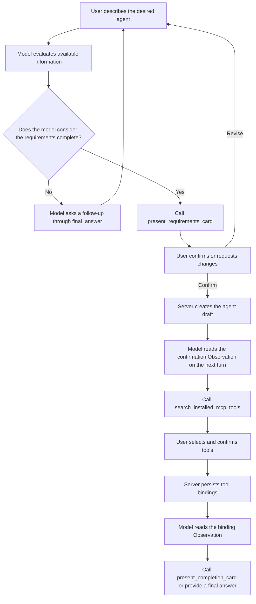

# NL2Agent Built-in Agent Design

## 1. Design Goals

NL2Agent is a model-driven, ordinary ReAct agent. It uses multi-turn conversation to clarify the requirements for a new agent, recommends MCP tools installed for the current tenant, and creates an editable agent draft.

Core principles:

- NL2Agent uses the same `AgentConfig`, `ToolConfig`, and ReAct runtime as every other agent.
- The model decides what to ask, how many turns are needed, when to show a confirmation card, and which tool to call next.
- The server owns authentication, validation, explicit user confirmation, transactions, idempotency, and tenant isolation.
- NL2Agent appears as an ordinary agent in the existing agent selector.
- Every agent ID is a positive integer generated by the database.

## 2. Agent Structure

### 2.1 Tenant-scoped built-in record

Each tenant has one published NL2Agent:

| Field | Value |
|---|---|
| `name` | `__nl2agent__` |
| `display_name` | `NL2Agent` |
| `enabled` | `true` |
| `is_main_agent` | `true` |
| `model_ids` | Current tenant default LLM |
| `version_no` | `0` for the source record |
| `current_version_no` | Latest published version |
| Permission | Visible to all tenant users and read-only |

An idempotent `ensure_nl2agent_for_tenant` service creates or reconciles the record. The PostgreSQL sequence generates an `agent_id > 0`.

`__nl2agent__` is a reserved system name and cannot be used by normal create, copy, rename, or import operations.

### 2.2 Shared runtime

NL2Agent uses the existing agent runtime:

```text
create_agent_run_info
  -> create_agent_config
  -> agent_run_thread
  -> NexentAgent.create_single_agent
  -> CoreAgent ReAct loop
```

The NL2Agent duty prompt and platform tools are loaded through the normal agent draft, tool binding, and published snapshot mechanisms.

### 2.3 Platform tools

NL2Agent is bound to three platform tools:

```text
present_requirements_card
search_installed_mcp_tools
present_completion_card
```

The server injects tenant, user, conversation, and controlled callbacks through `ToolConfig.metadata`. The model cannot supply or override this security context.

## 3. ReAct Conversation Flow



Tool Observations tell the model what happened and whether the current turn should stop for user input.

Server-enforced tool preconditions:

- MCP tools cannot be searched before the requirements card is confirmed.
- Tools cannot be searched or bound for an agent outside the current tenant.
- A successful completion card cannot be generated before the tool recommendation card is confirmed.
- Repeating a completed operation returns its persisted result.

## 4. Five-part Requirements Model

The requirements are arguments of `present_requirements_card`:

```python
class NL2AgentRequirementsCardInput(BaseModel):
    model_config = ConfigDict(
        extra="forbid",
        str_strip_whitespace=True,
    )

    user_identity: str = Field(min_length=1)
    usage_scenario: str = Field(min_length=1)
    input_methods: list[str] = Field(min_length=1)
    output_methods: list[str] = Field(min_length=1)
    output_content: str = Field(min_length=1)
    key_constraints: list[str]
```

Field semantics:

| Field | Meaning |
|---|---|
| `user_identity` | Who uses the agent, such as support staff, developers, or operators |
| `usage_scenario` | The business scenario and workflow in which it is used |
| `input_methods` | Text, files, images, voice, API data, or other inputs |
| `output_methods` | Chat text, JSON, files, email, system writes, or other delivery methods |
| `output_content` | The specific information and result the output must contain |
| `key_constraints` | Permission, timing, accuracy, format, and data-scope constraints |

Validation rules:

- User identity and usage scenario are independently required.
- Input and output methods support multiple values.
- List values are trimmed, empty entries are removed, and duplicates are removed while preserving order.
- The model must explicitly provide `key_constraints`.
- An empty constraints list means the user explicitly confirmed that there are no additional constraints.
- Unknown fields are rejected.

The requirements card always displays five sections:

1. User identity / usage scenario
2. Expected input methods
3. Expected output methods
4. Output content
5. Key constraints

The first section displays user identity and usage scenario as two separate subsections.

## 5. Agent Draft Configuration

`present_requirements_card` also receives a model-generated draft configuration:

```python
class GeneratedAgentDraft(BaseModel):
    model_config = ConfigDict(
        extra="forbid",
        str_strip_whitespace=True,
    )

    name: str = Field(min_length=1, max_length=100)
    display_name: str = Field(min_length=1, max_length=100)
    description: str = Field(min_length=1)
    duty_prompt: str = Field(min_length=1)
    constraint_prompt: str = Field(min_length=1)
    few_shots_prompt: str | None = None
```

The card displays only the five user requirement sections. The draft configuration is stored in the authoritative card data and used to create the target agent after confirmation.

Target agent properties:

- Database-generated `target_agent_id > 0`.
- `version_no=0`.
- `enabled=true`.
- Uses the tenant default LLM.
- Starts as an editable draft.
- Is not automatically published.

## 6. MCP Tool Recommendations

### 6.1 Data scope

Only tools in the current tenant that meet both conditions are queried:

```text
source == "mcp"
is_available == true
```

The model and frontend cannot access MCP tokens, headers, secrets, or connection credentials.

### 6.2 Search fields

The tool search document contains:

- `name`
- `origin_name`
- `description`
- Localized description
- `labels`
- `usage`

The search query is built from every field in the authoritative requirements card. Requirement text supplied again by the model is not trusted.

### 6.3 Matching rules

Use RapidFuzz:

```text
score = max(
    WRatio(query, tool_document),
    token_set_ratio(query, tool_document)
) / 100
```

Fixed rules:

| Rule | Value |
|---|---|
| Minimum recommendation score | `0.45` |
| Maximum recommendations | `5` |
| Default-selected threshold | `0.65` |
| Tie breaker | Ascending `tool_id` |

An empty match result renders an empty state and allows the user to complete the flow without binding tools.

## 7. Action APIs

### 7.1 Confirm requirements

```http
POST /agent/nl2agent/requirements/confirm
```

Request:

```json
{
  "conversation_id": 123,
  "card_id": "requirements-card-uuid"
}
```

Behavior:

- Authorize the current user, tenant, and conversation.
- Load the persisted requirements card and draft configuration.
- Validate the card state and all five requirement sections.
- Idempotently create the target agent draft.
- Store `target_agent_id` on the card.
- Return the updated card and a continuation message.

### 7.2 Confirm tools

```http
POST /agent/nl2agent/tools/confirm
```

Request:

```json
{
  "conversation_id": 123,
  "card_id": "tools-card-uuid",
  "target_agent_id": 456,
  "selected_tool_ids": [10, 12]
}
```

Behavior:

- Authorize the conversation, card, and target agent.
- Verify that every selected tool belongs to the authoritative recommendation set.
- Recheck tenant ownership, MCP source, and current availability.
- Idempotently persist `version_no=0` tool bindings.
- Persist the final `selected_tool_ids`.
- Return the updated card and a continuation message.

Every new DTO uses `Field(gt=0)` for `conversation_id`, `agent_id`, and `target_agent_id`.

## 8. Cards and assistant-ui

### 8.1 Card envelope

The three platform tools emit the existing `ProcessType.CARD` event:

```ts
type NL2AgentCardEnvelope<T> = {
  card_id: string;
  schema_version: 1;
  name:
    | "nl2agent_requirements_card"
    | "nl2agent_tool_recommendations_card"
    | "nl2agent_completion_card";
  status: "pending" | "confirmed" | "superseded" | "failed";
  data: T;
};
```

Cards are persisted in existing conversation message units.

When a new requirements card is created, any older pending requirements card in the same creation flow is marked `superseded`.

### 8.2 assistant-ui mapping

The adapter converts a structured `card` event to:

```ts
{
  type: "data",
  name: envelope.name,
  data: envelope,
}
```

Streaming and historical adapters use the same conversion. Existing non-NL2Agent card payloads retain their current rendering behavior.

### 8.3 Independent GUIs

```tsx
<MessagePrimitive.Parts
  components={{
    Text: DirectiveText,
    data: {
      by_name: {
        nl2agent_requirements_card: RequirementsConfirmationCard,
        nl2agent_tool_recommendations_card: McpToolRecommendationCard,
        nl2agent_completion_card: AgentCreationResultCard,
      },
    },
  }}
/>
```

GUI requirements:

- Requirements card: five columns on wide screens, independent responsive sections on narrow screens, and explicit confirm and revise actions.
- Tool card: tool description, MCP source, labels, match score, multi-selection, restore, retry, and empty states.
- Completion card: target agent, bound tools, and a command to open the agent configuration page.
- Confirmed, superseded, and historical cards render read-only.
- Duplicate submission is disabled while an action request is pending.

## 9. Security and Consistency

- User and tenant identity come only from authentication context.
- `tenant_id`, `user_id`, and tool IDs supplied by the model have no authorization effect.
- Persisted cards are authoritative for confirmation APIs and subsequent tool calls.
- Card state changes and related database writes share one transaction or equivalent locking boundary.
- A retry after a network timeout returns the persisted result.
- A failed uncommitted operation remains retryable.
- A continuation message only provides an Observation to the model; every subsequent tool call revalidates database state.
- Multi-turn context uses `AgentRunInfo.history`; no NL2Agent session table is introduced.

## 10. Test Plan

### 10.1 Backend

- NL2Agent has a database-generated positive ID and a normal published snapshot.
- NL2Agent runs through the standard `AgentConfig` and ReAct runtime.
- Tenant provisioning and version reconciliation remain idempotent under concurrency.
- User identity and usage scenario are independently required.
- Input and output methods support multiple cleaned values.
- An explicitly empty constraints list passes validation.
- All three tools enforce their preconditions and tenant isolation.
- Requirements and tool confirmation are authorized, atomic, and idempotent.
- MCP filtering, scoring, Top 5 ordering, and default selection are deterministic.
- Forged, cross-tenant, non-MCP, unavailable, and non-recommended tools are rejected.

### 10.2 Frontend

- Streaming and historical adapters produce equivalent `data` parts.
- Each card name renders its dedicated GUI.
- The five requirement sections remain independent on desktop and mobile.
- Tool selections are restored after refresh and history reload.
- Pending, confirmed, superseded, failed, and empty states render correctly.
- Continuation messages are sent automatically after successful actions.
- NL2Agent appears only as an ordinary agent selector item.
- Existing text, reasoning, tool-call, source, and standard card rendering is unaffected.

### 10.3 End-to-end

1. Select NL2Agent from the ordinary agent list.
2. Provide incomplete requirements and verify model-driven follow-up questions.
3. Complete all five requirement sections and render the confirmation card.
4. Revise a requirement and verify that the old card is superseded.
5. Confirm requirements and create a target draft with a positive ID.
6. Render MCP recommendations and change the default selection.
7. Confirm tool bindings.
8. Render the completion card and open the configuration page.
9. Reload the conversation and restore all card states.
10. Verify that the target agent is an enabled, editable, unpublished draft.

## 11. Implementation Contract

- The model owns semantic flow and tool selection.
- The server owns every security, permission, and transactional boundary.
- Explicit user confirmation is required before creating an agent or binding tools.
- The model decides when to render the completion card.
- Chinese and English design documents describe the same behavior.
