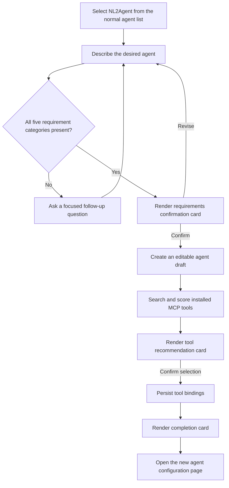

# NL2Agent Built-in Agent Design

## 1. Overview

NL2Agent is a built-in agent that helps a user create a new agent through a
multi-turn conversation. It collects and confirms the user's requirements,
searches the tenant's installed MCP tools, recommends the most relevant tools,
and creates an editable agent draft.

NL2Agent is presented in the existing agent selector as an ordinary published
agent. It is not injected into the frontend as a pinned item or rendered as a
separate landing-page card.

This design is based only on the current codebase.

## 2. Goals

- Let users describe a new agent through natural multi-turn conversation.
- Require five specific requirement categories before confirmation:
  - User identity / usage scenario
  - Expected input method
  - Expected output method
  - Output content
  - Key constraints
- Render the five categories as separate sections in the requirements card.
- Search only the current tenant's installed and available MCP tools.
- Recommend the five most relevant tools and allow multi-selection.
- Create a normal editable agent draft after explicit user confirmation.
- Persist cards, confirmation status, and selected tools in conversation
  history.
- Give every card its own React component and interaction design.

## 3. Non-goals

- NL2Agent does not publish the newly created agent automatically.
- NL2Agent does not install new MCP servers or tools.
- NL2Agent does not read MCP credentials, tokens, headers, or local filesystem
  configuration.
- The language model does not generate authoritative tool IDs or write to the
  database.
- This change does not add a dedicated NL2Agent session table.
- This change does not retrofit positive-ID validation into every legacy agent
  request model.

## 4. Confirmed Code Constraints

### 4.1 Agent IDs

The current general chat request does not universally enforce a positive agent
ID:

```python
class AgentRequest(BaseModel):
    agent_id: Optional[int] = None
```

Some agent automation requests explicitly use `Field(gt=0)`. Independently of
request validation, normal agents are stored in `ag_tenant_agent_t`, whose
`agent_id` is generated by a PostgreSQL sequence. The normal run path loads the
agent from the database, and the published-agent list requires a real draft
record and a published snapshot.

Therefore:

- NL2Agent must have a database-generated positive `agent_id`.
- A reserved negative ID such as `-1` must not be used.
- All new NL2Agent request and response models that carry an agent ID use
  `Field(gt=0)`.
- The ID of the built-in NL2Agent and the ID of the agent being created are
  named separately as `nl2agent_id` and `target_agent_id`.

### 4.2 Published-agent visibility

The existing published-agent list:

1. Queries `version_no=0` records for the current tenant only.
2. Skips disabled agents.
3. Applies group visibility.
4. Requires `current_version_no > 0`.
5. Requires the corresponding published snapshot.

A global asset-owner record or a frontend-only item would not satisfy these
conditions. NL2Agent must therefore be provisioned and published per tenant.

### 4.3 MCP tool source

"Installed MCP tools" means the current tenant's tool records in PostgreSQL.
The search source is not a user-provided filesystem path or MCP server URL.

Only records meeting both conditions are eligible:

```text
source == "mcp"
is_available == true
```

## 5. User Flow



Confirmations are explicit frontend actions. The model must not infer
confirmation from free-form text such as "looks good".

## 6. Built-in Agent Provisioning

### 6.1 Persisted identity

Each tenant has one built-in NL2Agent record with:

| Field | Value |
|---|---|
| `name` | `__nl2agent__` |
| `display_name` | `NL2Agent` |
| `enabled` | `true` |
| `is_main_agent` | `true` |
| `model_ids` | Current tenant default LLM model ID |
| `version_no` | `0` for the editable source record |
| `current_version_no` | Latest published built-in version |

The internal name is reserved. Normal create, rename, duplicate, and import
operations must reject it.

### 6.2 Idempotent reconciliation

Add an `ensure_nl2agent_for_tenant(tenant_id, user_id)` service that:

1. Acquires a transaction-scoped lock for the tenant and reserved name.
2. Finds the existing non-deleted NL2Agent draft.
3. Creates it with a sequence-generated ID when it does not exist.
4. Resolves the tenant's current default LLM.
5. Updates and publishes the built-in definition only when its prompt or model
   configuration has changed.
6. Returns the positive `nl2agent_id`.

Call the service before the existing published-agent list is assembled. This
provides an idempotent lazy backfill for existing tenants and initialization
for new tenants without adding a separate deployment task.

If the tenant has no available default LLM, keep the record and published
snapshot but let the existing availability rules mark NL2Agent unavailable.

### 6.3 List and edit behavior

- NL2Agent is returned through the existing `/agent/published_list` API.
- It uses the same selector item and selection behavior as other agents.
- It is visible to all users in its tenant, independent of group membership.
- Its permission is read-only to prevent accidental editing or deletion.
- Runtime dispatch identifies it only after loading the persisted agent record
  and verifying its tenant and reserved internal name.

## 7. Conversation and Prompt Contract

### 7.1 Conversation state

Use `AgentRunInfo.history` as the source of prior turns. No additional session
table is required.

The structured model output has four states:

```text
clarify
requirements_ready
tool_search_ready
complete
```

### 7.2 Required requirement schema

```python
class NL2AgentRequirements(BaseModel):
    user_and_scenario: str = Field(min_length=1)
    input_method: str = Field(min_length=1)
    output_method: str = Field(min_length=1)
    output_content: str = Field(min_length=1)
    constraints: list[str] = Field(min_length=1)
```

The model may not return `requirements_ready` while any field is empty. It asks
only for missing or ambiguous information and preserves already confirmed
details across turns.

The exact user-facing labels are:

| Field | Label |
|---|---|
| `user_and_scenario` | 用户身份 / 使用场景 |
| `input_method` | 期望输入方式 |
| `output_method` | 期望输出方式 |
| `output_content` | 输出内容 |
| `constraints` | 关键约束 |

### 7.3 Draft generation

When requirements become ready, the structured output also contains an agent
draft specification:

```python
class GeneratedAgentDraft(BaseModel):
    name: str
    display_name: str
    description: str
    duty_prompt: str
    constraint_prompt: str
    few_shots_prompt: str | None = None
```

The requirements card displays only the five confirmed requirement categories.
The generated draft fields remain server-side inputs for the confirmation
action.

The YAML prompt must enforce these rules:

- Do not invent information for a missing requirement field.
- Do not invent tool IDs or claim that a tool has been installed.
- Do not perform database operations.
- Treat action results in conversation history as authoritative.
- Generate concise names and executable prompts from the confirmed
  requirements.

## 8. MCP Tool Matching

### 8.1 Search document

Build one normalized search document per eligible tool from:

- `name`
- `origin_name`
- `description`
- Localized description when available
- `labels`
- `usage`

Build the requirement query from all five confirmed fields.

### 8.2 Scoring

Use RapidFuzz and calculate:

```text
score = max(WRatio(query, document), token_set_ratio(query, document)) / 100
```

Apply the following deterministic rules:

| Rule | Value |
|---|---|
| Minimum recommendation score | `0.45` |
| Maximum recommendations | `5` |
| Default-selected threshold | `0.65` |
| Tie breaker | Ascending `tool_id` |

An empty result is valid. The tool card displays an empty state and allows the
user to finish without tools.

## 9. Action APIs

### 9.1 Confirm requirements

```http
POST /agent/nl2agent/requirements/confirm
```

Request:

```json
{
  "conversation_id": 123,
  "card_id": "requirements-card-uuid"
}
```

Behavior:

1. Authorize the conversation against the current user and tenant.
2. Load the authoritative pending card from persisted conversation units.
3. Reject incomplete, superseded, or foreign cards.
4. Create an enabled `version_no=0` agent draft using the tenant default LLM.
5. Store the positive `target_agent_id` on the card.
6. Mark the card confirmed.
7. Return the updated card and a continuation message.

Response:

```json
{
  "card": {},
  "target_agent_id": 456,
  "continuation_message": "The requirements were confirmed and the draft was created."
}
```

### 9.2 Confirm tools

```http
POST /agent/nl2agent/tools/confirm
```

Request:

```json
{
  "conversation_id": 123,
  "card_id": "tools-card-uuid",
  "target_agent_id": 456,
  "selected_tool_ids": [10, 12]
}
```

Behavior:

1. Authorize the conversation and target agent.
2. Verify that `target_agent_id` matches the authoritative card.
3. Verify every selected tool is in the card's recommendation set.
4. Recheck tenant ownership, MCP source, and current availability.
5. Persist version-zero tool bindings and `selected_tool_ids`.
6. Mark the card confirmed.
7. Return a continuation message.

Both actions are idempotent. Repeating an already completed action returns the
stored result without creating duplicate agents or tool instances.

After a successful action, the frontend sets the returned
`continuation_message` in the assistant-ui composer and sends it automatically.
This creates an explicit history event that lets NL2Agent continue from the
applied server-side state.

## 10. Card Persistence

Each card payload contains:

```ts
type CardEnvelope<T> = {
  card_id: string;
  schema_version: 1;
  status: "pending" | "confirmed" | "superseded" | "failed";
  data: T;
};
```

Cards are stored in existing conversation message units. Requirements and tool
confirmation update the authoritative stored unit rather than relying on
frontend-only state.

When a new requirements card is emitted, older pending requirements cards in
the same creation flow are marked `superseded`. The tool card persists its
final `selected_tool_ids`, so history reload restores the submitted state.

Card state update and the related database mutation must occur in one
transaction or under an equivalent lock-and-idempotency boundary.

## 11. SSE and assistant-ui Integration

### 11.1 Two different `type` fields

Backend SSE events may use domain-specific event types:

```text
nl2agent_requirements_card
nl2agent_tool_recommendations_card
nl2agent_completion_card
```

assistant-ui message part `type` is a separate, framework-defined
discriminator such as `text`, `reasoning`, `tool-call`, `source`, or `data`.
Arbitrary assistant-ui part types are not rendered by
`MessagePrimitive.Parts`.

The adapter therefore converts each NL2Agent SSE event into the supported
`data` extension point:

```ts
{
  type: "data",
  name: "nl2agent_requirements_card",
  data: payload,
}
```

The streaming adapter and historical conversation adapter must produce the
same part shape.

### 11.2 Independent GUI components

`data` does not imply a shared generic card. The `name` field selects a
dedicated React component:

```tsx
<MessagePrimitive.Parts
  components={{
    Text: DirectiveText,
    data: {
      by_name: {
        nl2agent_requirements_card: RequirementsConfirmationCard,
        nl2agent_tool_recommendations_card: McpToolRecommendationCard,
        nl2agent_completion_card: AgentCreationResultCard,
      },
    },
  }}
/>
```

Each component has its own payload type, layout, actions, loading state, and
error handling.

### 11.3 Requirements confirmation GUI

- Display the five required fields as five separate columns on wide screens.
- Use responsive independent sections on narrow screens.
- Never merge input method, output method, and output content.
- Provide explicit confirm and revise actions.
- Disable repeated submission while the action request is pending.
- Render confirmed and superseded states as non-editable history.

### 11.4 MCP recommendation GUI

- Display tool name, description, MCP server usage, labels, and match score.
- Support multi-selection.
- Check recommendations with score `>= 0.65` by default.
- Restore persisted `selected_tool_ids`.
- Provide loading, error, retry, confirmed, and empty-result states.

### 11.5 Completion GUI

The completion card is the final in-conversation result, not an agent selector
item. It displays:

- Created agent name
- Positive `target_agent_id`
- Bound MCP tools
- A command to open the agent configuration page

It gives the user a persistent, actionable success state after the database
operations complete.

## 12. Security and Failure Handling

- Derive tenant and user identity from authorization, never from card payloads.
- Verify that every conversation, card, target agent, and tool belongs to the
  current tenant.
- Never include MCP tokens, authorization headers, or credentials in SSE,
  cards, logs, or model prompts.
- Reject forged tool IDs even if they belong to the same tenant but were not
  recommended by the authoritative card.
- Return a configuration error when the tenant default LLM is missing during
  draft creation.
- Keep a failed card retryable when no database mutation was committed.
- Return the stored success result when a client retries after a network
  timeout.

## 13. Test Plan

### Backend

- NL2Agent receives a sequence-generated `agent_id > 0`.
- No negative or virtual NL2Agent ID path exists.
- Provisioning is idempotent under sequential and concurrent calls.
- Existing tenants receive NL2Agent through lazy reconciliation.
- Default LLM changes update the built-in published version only when needed.
- NL2Agent appears in the ordinary published list for all tenant users.
- Reserved-name creation, rename, duplicate, and import are rejected.
- Missing requirement fields always produce `clarify`.
- All five fields produce `requirements_ready`.
- MCP search enforces tenant, source, and availability filters.
- Matching thresholds, Top 5, default selection, and stable tie ordering are
  deterministic.
- Requirements confirmation is authorized, atomic, and idempotent.
- Tool confirmation rejects unlisted, foreign, non-MCP, or unavailable tools.
- Final `selected_tool_ids` and tool bindings are persisted.

### Frontend

- Streaming and historical adapters create identical `data` parts.
- Each card name renders its dedicated GUI component.
- Requirements render in five columns or responsive independent sections.
- Tool selection restores after refresh and history reload.
- Pending, confirmed, superseded, failed, retry, and empty states render
  correctly.
- Successful actions automatically send their continuation messages.
- NL2Agent appears only in the ordinary agent selector.
- Normal text, reasoning, tool-call, and source rendering is unchanged.

### End-to-end

1. Select NL2Agent from the normal agent list.
2. Provide incomplete requirements and verify focused follow-up questions.
3. Complete all five categories and verify the requirements card.
4. Revise one field and verify the previous card is superseded.
5. Confirm requirements and verify a positive target agent ID.
6. Verify tenant MCP recommendations and default selections.
7. Confirm a custom tool selection.
8. Reload the conversation and verify both card states.
9. Open the new agent configuration page from the completion card.
10. Verify the created agent remains an unpublished, editable draft.

## 14. Expected Implementation Areas

The implementation is expected to touch:

- Backend agent runtime and prompt definitions.
- Agent provisioning, creation, version, tool-binding, and conversation
  services.
- NL2Agent action routes and Pydantic request/response models.
- SSE event generation and historical message serialization.
- The newchat streaming and history adapters.
- Dedicated requirements, MCP recommendation, and completion card components.
- Backend, frontend, and end-to-end tests.
