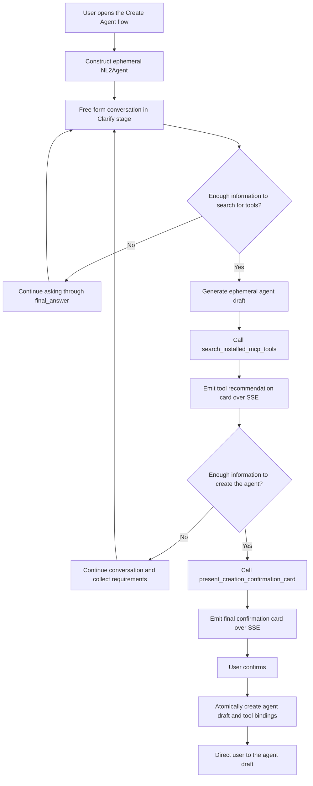

# NL2Agent Ephemeral Agent Design

## 0. Current Implementation Phase

The minimum verifiable implementation currently provides only these capabilities:

- Reuse the ordinary chat UI through `/newchat?mode=nl2agent` and its existing stream rendering.
- Construct NL2Agent in backend memory for every request without saving an agent or conversation.
- Bind only `search_installed_mcp_tools` and display its structured JSON in the existing tool Result area.
- Do not implement recommendation cards, a final confirmation card, the confirmation API, or target-agent creation.

The post-search flow in Section 3, Sections 7 through 9, and their full acceptance cases describe the later target design rather than currently implemented behavior.

## 1. Design Goals

NL2Agent is an ephemeral ReAct agent started from the dedicated "Create Agent" entry point. It clarifies user requirements through natural-language conversation, recommends MCP tools installed for the current tenant, and creates an editable agent draft after final user confirmation.

Core principles:

- NL2Agent is constructed only while handling the current request and has no database agent record.
- The current page maintains multi-turn context through the `history` field in each request.
- NL2Agent conversations, cards, and runtime state are not written to history. Refreshing or leaving the page starts a new flow.
- The model decides when to continue clarifying, when to search for tools, and when enough information exists to create the agent.
- No database draft is created before final confirmation.
- The server owns authentication, data validation, tenant isolation, transactions, and idempotency.
- The resulting target agent uses the standard draft, tool-binding, and publishing lifecycle.

## 2. Ephemeral Runtime Architecture

### 2.1 Entry Point

The frontend calls the ephemeral endpoint from the existing `/newchat?mode=nl2agent` page:

```http
POST /agent/nl2agent/run
```

Request:

```json
{
  "query": "The user's current input",
  "history": [
    {"role": "user", "content": "..."},
    {"role": "assistant", "content": "..."}
  ],
  "minio_files": []
}
```

`query` is the current user input, `history` is assembled from the current frontend page state, and `minio_files` uses the existing attachment description format. The request does not contain an `agent_id` or `conversation_id`.

### 2.2 Runtime Configuration

The server constructs `AgentConfig` and `AgentRunInfo` in memory from:

- The current tenant's default LLM.
- The NL2Agent duty prompt.
- The NL2Agent runtime LangChain tools.
- The conversation history and attachments in the current request.
- The user, tenant, and language resolved from the authentication context.

The ephemeral configuration uses `__nl2agent_runtime__` as a runtime-only name. It is not persisted and is not reserved as a normal agent name.

The runtime constructs the SDK run object directly and does not enter the ordinary agent database or conversation path:

```text
build_nl2agent_run_info (thin wrapper: builds the in-memory AgentConfig)
  -> AgentRunInfo
  -> agent_run
  -> agent_run_thread
  -> NexentAgent.create_single_agent
  -> CoreAgent ReAct loop
```

NL2Agent does not modify `create_agent_run_info` or `run_agent_stream`. Its wrapper reuses tenant default-model construction and attachment-description assembly, then creates `AgentRunInfo` directly. Observer JSON from `agent_run` is wrapped in the SSE format already parsed by the frontend. When the browser cancels the request, the stream generator sets the run-scoped `stop_event`.

The current MVP search tool is a process-local LangChain `StructuredTool` that closes over the tenant ID and backend search function. The current SDK does not host-bridge `source="langchain"` tools into Docker or WASM executors, so the NL2Agent wrapper explicitly sets `sandbox_config=None` and uses the existing local executor. Supporting remote sandbox execution is out of scope for this design and would require either SDK host-tool support for LangChain tools or moving these tools behind MCP.

NL2Agent does not load configuration through the database-backed `create_agent_config`, does not appear in the ordinary agent selector, and does not require a database-generated agent ID.

### 2.3 Lifecycle

- Each `/agent/nl2agent/run` request creates a new ephemeral runtime from the supplied `history`.
- The runtime serves only the current SSE request and may be released when the stream ends.
- It does not read or write conversations, messages, historical cards, or history summaries.
- It does not enable long-term memory, historical context loading, conversation title generation, or SSE resume.
- Refreshing, closing, or leaving the creation flow discards the frontend history, draft, and card state.
- The NL2Agent flow ends after the target agent draft is created successfully.

## 3. ReAct Conversation Flow



The model uses two independent readiness thresholds:

1. It may search for tools once the available information is sufficient to identify required capabilities and search terms.
2. It may present the final confirmation card once the available information is sufficient to generate a usable agent configuration.

Tool search may happen before requirement collection is complete, and search results may inform later clarification. The final confirmation card requires a completed tool search **within the same run**: the ephemeral runtime keeps no state across requests, so `present_creation_confirmation_card` can only verify searches performed in the current ReAct run. If the model attempts to present the confirmation card in a run with no prior search, the tool returns an error Observation instructing it to call `search_installed_mcp_tools` first. This also guarantees the confirmation card is always based on a fresh search over the latest draft. The precondition is a product-quality guard, not a security control; authorization is enforced independently by the confirmation API's revalidation.

After the final confirmation card is emitted, the flow enters `awaiting_confirmation`. The frontend stops accepting new requirement input, and the user may only confirm creation or leave the flow.

## 4. Prompt and Runtime Tools

### 4.1 Duty Prompt

NL2Agent has no standalone YAML file, database prompt record, or prompt-loader entry. Whenever the ephemeral `AgentConfig` is built, the backend assembles role, workflow, draft schema, constraints, and final-response sections from the authenticated language, runtime tool name, and result limit. It injects this text through `AgentConfig.instructions` into the SDK's default CodeAgent system prompt.

The duty prompt uses consistent stage-specific instructions:

- `clarify`: Learn the agent's goals, usage scenario, inputs, outputs, constraints, and success criteria through free-form conversation. Do not require a fixed structure or emit a requirements confirmation card.
- `tool_search`: Once there is enough information to identify required capabilities, generate a complete `GeneratedAgentDraft` and call `search_installed_mcp_tools`. Do not search without a draft.
- `ready_to_create` (later phase): Once the draft is sufficiently complete and a tool search has completed in the current run, call `present_creation_confirmation_card`. The current MVP explicitly prohibits entering this phase or claiming that an agent was created.
- Tool Observations tell the model the search result, card generation result, and allowed next action.
- The model must not generate or override user IDs, tenant IDs, authorization data, card IDs, or tool credentials.

### 4.2 Runtime Tool Construction

The current MVP binds only one runtime tool:

```text
search_installed_mcp_tools
```

The backend creates the search tool for every `/agent/nl2agent/run` request with `StructuredTool.from_function`. Its handler closes over the authenticated `tenant_id` and backend search function. These values do not appear in the model-visible argument schema, so the model cannot supply or override tenant scope or the result limit.

Each `StructuredTool` is attached directly to the prebuilt `AgentConfig` with `source="langchain"`. The backend constructs the `ToolConfig` first and then assigns the `BaseTool` object to `metadata`, matching the existing LangChain loader convention; the SDK's existing `Tool.from_langchain` adapter performs the conversion. The runtime tools are not written to `ag_tool_info_t` or `ag_tool_instance_t`, are not discovered from `backend/tool_collection/langchain`, and never appear in the public tool picker or public tool-validation endpoint. No SDK changes, `bind_runtime` hook, `is_internal` marker, MCP registration, or tool-list refresh are introduced.

The per-run factory follows this shape:

```python
search_tool = build_search_installed_mcp_tools(
    tenant_id=tenant_id,
    language=language,
    search_fn=search_installed_mcp_tools_for_tenant,
)
search_config = ToolConfig(
    class_name="search_installed_mcp_tools",
    name="search_installed_mcp_tools",
    source="langchain",
    params={},
)
search_config.metadata = search_tool
```

`search_installed_mcp_tools` exposes one model-visible `draft` JSON object. The current `smolagents` converter cannot consume a nested Pydantic `$ref`, so the LangChain `args_schema` declares `draft` as an object and the handler applies strict `GeneratedAgentDraft.model_validate()` validation at entry. It then calls the tenant-scoped Python search function exactly once and never calls an LLM, MCP server, agent, or another tool.

The `mcp` segment in the tool name describes the catalog records being searched, not the tool's implementation transport. The successful Observation has this fixed shape:

```python
class InstalledMcpToolRecommendation(BaseModel):
    tool_id: int
    name: str
    origin_name: str | None
    description: str
    source: Literal["mcp"]
    usage: str
    labels: list[str]
    score: float


class SearchInstalledMcpToolsObservation(BaseModel):
    status: Literal["success"]
    recommendation_count: int
    recommendations: list[InstalledMcpToolRecommendation]


class SearchInstalledMcpToolsErrorObservation(BaseModel):
    status: Literal["error"]
    code: Literal["invalid_draft", "tool_search_failed"]
    retryable: Literal[True]
```

An empty result is a successful completed search. Draft validation, database, or ranking failures return retryable error Observations without internal exception details. The existing `execution_logs` mapping displays this structured JSON in ToolFallback's Result area.

`present_creation_confirmation_card` and shared per-run card state are deferred to the later card phase.

## 5. Ephemeral Agent Draft

```python
class GeneratedAgentDraft(BaseModel):
    model_config = ConfigDict(
        extra="forbid",
        str_strip_whitespace=True,
    )

    name: str = Field(min_length=1, max_length=100)
    display_name: str = Field(min_length=1, max_length=100)
    description: str = Field(min_length=1)
    duty_prompt: str = Field(min_length=1)
    constraint_prompt: str = Field(min_length=1)
    few_shots_prompt: str | None = None
```

Field requirements:

- `name` follows normal agent naming rules and is checked again for conflicts during final confirmation.
- `display_name` is the user-facing name.
- `description` summarizes the purpose, target users, and primary capabilities.
- `duty_prompt` defines responsibilities, task flow, and output requirements.
- `constraint_prompt` defines boundaries, permissions, safety requirements, and failure handling.
- `few_shots_prompt` is generated only when examples materially improve behavioral stability.
- Unknown fields are rejected, and all strings are stripped of surrounding whitespace.

The ephemeral draft exists only in the current frontend page state and SSE card payloads. It is not written to the database before final confirmation.

The resulting target agent has these properties:

- A database-generated `target_agent_id > 0`.
- `version_no=0`.
- `enabled=true`.
- The current tenant's default LLM.
- An initial editable draft state.
- No automatic publication.

## 6. MCP Tool Recommendations

### 6.1 Data Scope

Only tools from the current tenant that satisfy the following conditions are searched:

```text
source == "mcp"
is_available == true
```

The scope intentionally remains MCP-only. Local and statically discovered LangChain tools may require per-agent model, knowledge-base, secret, or other initialization parameters, while the current recommendation and confirmation flow selects only `tool_id` values and has no configuration step. Recommending those tools would allow NL2Agent to create a draft that cannot run.

The model and frontend cannot access MCP tokens, request headers, secrets, or connection credentials.

The backend search function obtains candidates from `query_all_tools(tenant_id)`, which already enforces tenant ownership and excludes soft-deleted rows, and then applies the `source` and availability filters above. The runtime search tool itself is absent from this query because it is never persisted. Only safe display metadata is copied into search documents and results; `params`, headers, tokens, and other executable configuration are excluded.

### 6.2 Search Fields

The searchable tool document contains:

- `name`
- `origin_name`
- `description`
- `labels`
- `usage`

Before matching, values are converted to strings, Unicode-normalized, lowercased, stripped, and whitespace-collapsed. Missing optional fields contribute an empty string. Labels retain their list order and are joined with spaces.

The server builds search text from the ephemeral draft's `display_name`, `description`, `duty_prompt`, `constraint_prompt`, and `few_shots_prompt`. The model cannot provide an arbitrary search scope or tenant condition separately.

### 6.3 Matching Rules

Matching uses RapidFuzz:

```text
score = max(
    WRatio(query, tool_document),
    token_set_ratio(query, tool_document)
) / 100
```

`rapidfuzz>=3.0.0` is a direct backend dependency for this feature rather than an implicit transitive dependency. Ranking is entirely deterministic and invokes no model or external service.

Fixed rules:

| Rule | Value |
|---|---|
| Minimum recommendation score | `0.45` |
| Maximum recommendation count | `5` |
| Default selection threshold | `0.65` |
| Tie-break order | Ascending `tool_id` |

Candidates below the minimum score are discarded. The remaining candidates are sorted by descending score and then ascending `tool_id`, truncated to five, and their scores are rounded to four decimal places for the tool Observation and card payload.

The score thresholds are initial values and are expected to be tuned with real usage data.

When no tool matches, the tool emits an empty-state recommendation card, and creation without tool bindings remains allowed.

### 6.4 Draft Revisions and Tool Selection

- Each new draft generated for a search receives a new `draft_revision`.
- The tool recommendation card selects tools scoring at least `0.65` by default.
- Users may select or clear tools on the latest recommendation card.
- When a new recommendation card arrives, the frontend marks all older recommendation cards and confirmation cards as `superseded`.
- A new recommendation card uses its new default selection set and does not inherit selections from an older revision.
- Because the confirmation card is always produced in the same run as a completed search, its `draft_revision` always equals the latest recommendation card's revision; no cross-revision matching is needed.
- The final confirmation card always reads the latest selection state from the tool card with the same `draft_revision`.

## 7. SSE Cards and Frontend State

### 7.1 Card Envelope

Both runtime tools emit through the existing `ProcessType.CARD`:

```ts
type NL2AgentCardEnvelope<T> = {
  card_id: string;
  draft_revision: string;
  schema_version: 1;
  name:
    | "nl2agent_tool_recommendations_card"
    | "nl2agent_creation_confirmation_card";
  status: "pending" | "confirmed" | "superseded" | "failed";
  data: T;
};
```

The server generates both `card_id` and `draft_revision`. Cards are delivered only through the current SSE stream and are not stored in conversation message units.

### 7.2 Tool Recommendation Card

The tool recommendation card contains:

- The current `draft_revision`.
- Each recommended tool's `tool_id`, name, description, MCP source, labels, and match score.
- Default selected tool IDs.
- Empty-result or search-failure state.

The frontend owns selection state for the current page and prevents duplicate actions while a request is in progress.

### 7.3 Final Confirmation Card

The final confirmation card contains:

- The complete `GeneratedAgentDraft`.
- The agent name and purpose summary.
- The associated `draft_revision`.
- The most recent valid recommendation set.
- A notice that enough information has been collected and confirmation will write it to an agent draft.

The card exposes only a confirmation button. The frontend dynamically displays the tools that will be bound by reading the latest selection state for the same `draft_revision`.

### 7.4 assistant-ui Mapping

Verified against the current frontend (`@assistant-ui/react ^0.14.20`, new chat under `app/[locale]/newchat/`): the shared streaming adapter (`newchat/adapter/remote-chat-model-adapter.ts`) currently maps `card` chunks to `null` (skipped), and the message renderer (`thread.tsx`) supports data parts only through the generic `dataRendererUI` path; the installed version has no `by_name` component registry.

The current MVP integrates as follows:

- `/newchat?mode=nl2agent` uses a local assistant-ui runtime and an in-memory NL2Agent display object without loading the remote conversation list.
- The shared streaming adapter switches to `/api/agent/nl2agent/run` through `runConfig.custom.runtimeMode` and omits `agent_id`, `conversation_id`, model overrides, resume, and title callbacks.
- Existing `tool` and `execution_logs` mappings display the structured JSON in ToolFallback; no `card` chunk parsing or card component registration is added.
- Ordinary `/newchat` continues to use its existing remote conversation runtime unchanged.

NL2Agent has no historical conversation adapter. Existing non-NL2Agent text, reasoning, tool-call, source, and card rendering remains unchanged.

## 8. Final Confirmation API

```http
POST /agent/nl2agent/confirm
```

Request:

```json
{
  "card_id": "confirmation-card-uuid",
  "draft": {
    "name": "agent_name",
    "display_name": "Agent Name",
    "description": "...",
    "duty_prompt": "...",
    "constraint_prompt": "...",
    "few_shots_prompt": null
  },
  "selected_tool_ids": [10, 12]
}
```

DTO:

```python
class NL2AgentConfirmRequest(BaseModel):
    model_config = ConfigDict(extra="forbid")

    card_id: UUID
    draft: GeneratedAgentDraft
    selected_tool_ids: list[int]
```

`selected_tool_ids` is stably deduplicated, and every value must be a positive integer.

Server behavior:

1. Resolve the current user and tenant from the authentication context.
2. Revalidate the complete draft, agent name, and field lengths.
3. Revalidate that every tool belongs to the current tenant, has `source="mcp"`, and is still available.
4. Idempotency is Redis-based and introduces no new database table. The key is derived from tenant, user, and `card_id`. If the key already holds a `target_agent_id`, return it directly; if the key is held as an in-progress lock, reject with a retryable conflict.
5. Acquire the in-progress lock via `SET NX` with a TTL, then create the target agent draft at `version_no=0` and write tool bindings in one database transaction.
6. After commit, write `target_agent_id` into the idempotency key with a bounded TTL that covers realistic retry windows (for example 24 hours); on failure, release the lock.
7. Return the target agent ID and draft configuration URL.

Success response:

```json
{
  "target_agent_id": 456,
  "draft_url": "/agents/456?version_no=0"
}
```

After a successful response, the frontend marks the confirmation card as `confirmed`, tells the user that all relevant information has been written to the agent draft, and directs the user to inspect the draft.

Repeated submissions with the same idempotency key return the existing draft within the idempotency TTL; beyond the TTL, the frontend's `confirmed` card state prevents resubmission. Validation or transaction failures must not retain a partial agent or tool bindings, and must release the in-progress lock without recording a success. The card becomes `failed`, and transient failures may be retried.

## 9. Security and Consistency

- User and tenant identity comes only from the authentication context.
- The submitted draft is user-controlled configuration and still undergoes all standard agent validation rules.
- Submitted tool IDs have no authorization authority and must be revalidated for tenant, source, and availability.
- The model and frontend cannot submit or read MCP credentials.
- Agent draft creation and tool bindings share one database transaction; the idempotency record is Redis-based, with an in-progress lock preventing concurrent duplicates. No new database table is introduced for idempotency.
- A `card_id` is idempotent only within the current tenant and user scope and cannot be reused across identities.
- NL2Agent does not persist runtime history, so frontend page state is never an authorization source.
- The search-before-confirmation-card precondition is enforced per run for product quality only; security relies entirely on the confirmation API revalidating the draft and every submitted tool ID.
- Runtime LangChain tools are created only inside the prebuilt NL2Agent configuration, are not persisted or discovered, and are unreachable through the public tool picker and validation endpoint.
- Bound tenant and user context never appears in model-visible tool arguments; the search service independently applies the tenant condition.
- NL2Agent uses the local executor because the current SDK does not host-bridge LangChain tools into remote sandboxes; remote sandbox support requires a separate SDK or MCP design.
- After creation, the target agent follows the existing editing, publishing, permission, and version-management rules.

## 10. Test Plan

### 10.1 Backend

- `/agent/nl2agent/run` executes with an ephemeral configuration and the tenant's default LLM.
- The ephemeral run neither queries an NL2Agent database record nor saves conversations, messages, or history summaries.
- Request `history` is converted correctly to SDK `AgentHistory` without database history augmentation.
- The ephemeral run does not enable memory search, history recovery, or SSE resume.
- Both runtime tools expose only draft data to the model and use closure-bound server security context.
- The generated `ToolConfig` entries use `source="langchain"`, carry in-memory `BaseTool` objects, and do not create or update tool catalog rows.
- Tool search returns only installed and available MCP tools from the current tenant.
- The search handler calls the tenant-scoped Python search function exactly once and never invokes another tool, agent, LLM, or MCP endpoint.
- Search normalization, fields, score threshold, Top 5 limit, score rounding, default selection, and tie-break order remain deterministic.
- Successful Observations and card payloads contain the same ordered recommendation DTOs and expose no executable tool configuration.
- Empty search results count as successful searches, while backend failures emit a failed card and do not satisfy the confirmation precondition.
- The confirmation tool rejects calls when no tool search has completed in the current run, and its error Observation instructs the model to search first.
- The confirmation API validates the draft, tool permissions, positive IDs, and stable deduplication.
- Forged, cross-tenant, non-MCP, and unavailable tools are rejected.
- Agent creation and tool bindings are atomic; concurrent duplicate confirmations are blocked by the idempotency lock.
- Retrying after a network timeout within the idempotency TTL returns the same `target_agent_id`.

### 10.2 Frontend

- The dedicated Create Agent entry starts NL2Agent, and the ordinary agent selector does not show it.
- Current-page history supports multi-turn clarification, while refresh or exit does not restore the flow.
- The two card types map to independent assistant-ui components.
- The tool card correctly renders recommendations, defaults, multi-select, empty, and failed states.
- A new `draft_revision` supersedes older recommendation and confirmation cards.
- The final confirmation card displays the draft summary and latest tool selection and exposes only confirmation.
- Successful confirmation shows the draft entry point; failure does not show a success state.
- Existing non-NL2Agent SSE messages and cards are unaffected.

### 10.3 End-to-End

1. Start NL2Agent from the dedicated Create Agent entry point.
2. Provide incomplete requirements and verify free-form model clarification.
3. Supply enough information for search and verify ephemeral draft generation and the MCP recommendation card.
4. Change the tool selection and continue supplying requirements.
5. Verify that a new draft revision supersedes old cards and produces new recommendations.
6. Once information is sufficient, verify that the final card displays the draft summary and latest tool selection.
7. Confirm and verify atomic creation of a positive-ID target draft and its tool bindings.
8. Verify that the UI directs the user to an editable, enabled, unpublished draft.
9. Refresh the creation page and verify that the NL2Agent conversation and cards are not restored.
10. Repeat the same confirmation and verify that no duplicate agent is created.

## 11. Implementation Contract

- The model owns semantic clarification, stage decisions, draft generation, and tool call ordering.
- The server owns ephemeral runtime configuration, security context, search scope, validation, transactions, and idempotency.
- The frontend owns current-page conversation history, draft revisions, card state, and tool selection.
- Tool search is a required precondition for the final confirmation card, enforced through shared per-run runtime state; across requests it is maintained as a prompt-level rule, and the confirmation API's revalidation remains the security boundary.
- Both NL2Agent tools are backend-created, non-persistent LangChain `StructuredTool` instances; the SDK remains unchanged.
- User confirmation is the only action that writes the target agent to the database.
- The Chinese and English design documents define identical behavior.
