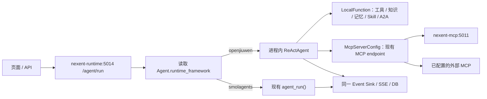

# Nexent 单服务、Agent 级运行框架设计

> 状态：实现与真实环境验收完成（固定使用已有 `openjiuwen==0.1.16`）
> 日期：2026-07-21  
> 涉及仓库：`nexent`、`/Users/hsc/Applications/opensource/agent-core`

## 1. 结论

Nexent 只保留现有 Runtime 和 MCP 服务：

| 服务 | 端口 | 职责 |
| --- | ---: | --- |
| `nexent-runtime` | 5014 | 统一 `/agent/run`、SSE、持久化，并在进程内执行 Smolagents 或 OpenJiuwen |
| `nexent-mcp` | 5011 | 继续提供现有 MCP endpoint |

不新增 OpenJiuwen service、进程、镜像、端口、Capability Gateway 或 Runtime 回环 HTTP。Agent 在首次保存时选择
`smolagents` 或 `openjiuwen`，框架随后永久不可修改。运行失败形成所选框架的失败事件，不自动切换框架。

OpenJiuwen standalone 仍在 agent-core 中按原生方式独立运行，不依赖 Nexent。

## 2. 数据模型与不可变规则

`nexent.ag_tenant_agent_t` 的每个草稿和版本快照增加 nullable `runtime_framework`：

- 合法非空值只有 `smolagents`、`openjiuwen`。
- 迁移将历史行回填为 `smolagents`。
- 新预创建的空白子 Agent 可以暂时为 `NULL`；首次保存时必须赋值。
- 数据库 trigger 允许 `NULL -> 合法值` 和相同值幂等更新，拒绝任何非空值变化及非空值改回 `NULL`。
- 服务层在数据库写入前返回 `409 AGENT_RUNTIME_FRAMEWORK_IMMUTABLE`，数据库 trigger 是最后防线。
- 旧创建 API 未传字段时默认 Smolagents；旧更新 API 未传字段时保留已有框架。

字段贯穿 Agent 创建/更新、详情、列表、版本、发布/回滚、复制、导入导出和市场安装。旧导入格式缺字段时按
Smolagents 处理。版本回滚不得改变草稿的框架。

`/agent/run`、debug 参数和租户配置都没有框架覆盖字段，运行时只读取装配后的 `AgentRunInfo.runtime_framework`。

## 3. 页面行为

创建页面默认选中 Smolagents，也允许选择 OpenJiuwen。第一次保存成功后：

- selector 永久禁用并显示“创建后不可修改”；
- store、baseline、脏检查和保存 payload 都保留 `runtime_framework`；
- 切换尚未保存的新 Agent 框架时清空已选内部子 Agent；
- 内部子 Agent选择器只显示相同框架的候选；
- 复制继承来源框架；后端仍负责最终不可变与关系校验。

数据库值为 `NULL` 的空白 Agent在页面上显示默认 Smolagents，但保持未锁定，首次保存才完成赋值。

## 4. 父子 Agent约束

内部父子 Agent必须使用相同框架。校验覆盖：

1. 页面候选过滤；
2. Agent 批量保存关系；
3. 独立关系 API；
4. 导入图预检；
5. 版本发布时的子版本固定；
6. 运行前递归装配。

混合框架关系返回 `409 AGENT_RUNTIME_FRAMEWORK_MISMATCH`。导入在创建任何 Agent 前完成整图框架和环检测。
运行装配再次验证同框架与无环，防止绕过页面或服务层的数据进入执行阶段。

外部 A2A Agent不参与该约束。它继续按协议代理，在 OpenJiuwen 中包装成请求级 `LocalFunction(task)`。

## 5. 单进程 Runtime 分派

`backend/services/agent_runtime/registry.py` 同时声明两个 factory path，但不提前导入 provider：

- `SmolagentsRuntime` 委托现有 `agent_run(AgentRunInfo)`；
- `OpenJiuwenInProcessRuntime` 仅在第一个 OpenJiuwen Agent运行时导入 OpenJiuwen、启动全局 `Runner`。

因此，只运行 Smolagents 时不会导入 `openjiuwen`。OpenJiuwen 初始化后，两种 provider 可在同一个
`nexent-runtime` 进程中并发服务不同 Agent。

统一的 `AgentRuntimeExecution` 携带 run ID、`AgentRunInfo`、conversation、user、tenant 和 version。两个 provider
都输出既有 Nexent chunk，继续经过同一 message unit、SSE、resume 和持久化逻辑。

OpenJiuwen 初始化、装配、模型或工具错误都会产生显式 error event 并终止运行；registry 不包含 fallback 分支。

## 6. OpenJiuwen 运行与资源生命周期

每次根运行建立独立 active-run 记录和取消信号。每个 Agent节点建立独立 `_NodeScope`，拥有：

- `ReActAgent`、session、context 和 callback；
- 本节点的 Nexent 工具实例；
- 请求级 LocalFunction 与 MCP server/tool；
- request/run/agent 作用域 ID。

stop endpoint 仍按 conversation/user 工作，内部解析为 run ID，并取消对应 OpenJiuwen producer、子 Agent和工具调用。
Nexent 的 `stop_event` 同时置位，使现有工具、A2A client 和 Smolagents 保持原取消语义。

结束、错误和取消均按子到父的调用栈释放 callback、ability、context、MCP server、工具实例和连接。应用退出只关闭
已经初始化的 provider；OpenJiuwen 未运行过时不会 import 或调用 `Runner.stop()`。

## 7. 本地能力复用

Knowledge、Memory、Skill 和普通工具不经过 MCP。装配阶段继续使用现有权限、memory policy、skill sandbox、模型和
artifact 配置生成 `ToolConfig`；OpenJiuwen 运行时通过 `NexentAgent.create_tool()` 创建请求级实例，再包装成
`ToolCard + LocalFunction`。

包装器保留原输入 schema，调用现有 `forward()`/callable，并把 `MessageObserver` 中的检索、工具日志、Skill 文件等
既有事件送入共享 emitter。Skill artifact 仍由统一流处理链完成路径校验和上传，不引入 OpenJiuwen 自有数据源。

外部 A2A 使用现有 `ExternalA2AAgentWrapper` 和认证配置，同样包装为 LocalFunction。

## 8. MCP 复用与隔离

Agent 装配只查询一次现有 MCP 数据，并同时生成：

- `mcp_host`：供 Smolagents 现有路径使用；
- `mcp_bindings`：供 OpenJiuwen 使用的结构化绑定。

每个 `MCPBinding` 包含 server ID/name、现有 URL、transport、请求级 header、Agent 选择的工具 allowlist、required tool
列表和 endpoint 可用状态。认证 header 标记为不参与 Pydantic 序列化与 repr，不进入 Agent 数据、事件或日志。

OpenJiuwen 为每个 Agent节点生成唯一 `McpServerConfig.server_id`，直接连接 `nexent-mcp:5011` 或已有外部 endpoint：

- 不启动 MCP server；
- 不创建新端口；
- 不将同 server 的未选工具加入 ability；
- required server/工具缺失时阻止运行；
- optional server/工具失败时发送受控 warning；
- success、error、cancel、timeout 后移除 server、tool 和 callback resources。

## 9. 同框架子 Agent

运行前从 `AgentConfig` 构建递归 `OpenJiuwenRunSpec`。每个节点记录 Agent ID/name、模型、prompt、工具/MCP binding、
父 ID 和 depth。

父 Agent把每个子 Agent暴露为 `LocalFunction(task)`。调用时创建子节点独立 session/context/scope；子 Agent最终答案
作为父 Agent的 tool result。所有节点共享 sequence emitter 和根取消信号，但只有根节点产生外层 `final_answer`。
子节点事件附带 `agent_id`、`agent_name`、`parent_agent_id`、`depth` 和全局 sequence。

该设计复用现有 managed-agent 语义，不启动 AgentTeam 服务或任何额外进程。

## 10. 镜像与部署

main 镜像固定安装已有 `openjiuwen==0.1.16`。Nexent provider 首次运行时直接懒加载其公开的 `Runner`、`ReActAgent`、
`LocalFunction` 和 `McpServerConfig` 等 core API，不要求 `openjiuwen.extensions.nexent`。镜像构建在依赖层检查这些 core API，
复制 backend 后再 import `OpenJiuwenInProcessRuntime` 并调用同一 bindings loader，使缺包或 API 不兼容在构建期失败。

0.1.16 声明 `openai>=1.108.0`，因此 Nexent SDK 使用 `mem0ai==1.0.0` 取代限制 `openai<1.100.0` 的 0.1.117；同时使用
`orjson>=3.11.5` 满足 OpenJiuwen 依赖树中的 langgraph-sdk 与 pymilvus。最终 main 镜像的解析结果由构建和依赖检查门禁验证，
不得在 SDK 安装阶段静默降级成声明约束不兼容的版本。

Compose 和 Helm 不定义 OpenJiuwen Runtime service/subchart/profile、独立 image、Runtime URL、Capability Gateway、grant
或 signing key。`nexent-runtime` 的命令、镜像和 5014 端口不变，`nexent-mcp` 的进程和 5011 端口不变。

## 11. 发布与回滚

发布顺序：

1. 固定 Nexent 依赖和 lock 为已有 `openjiuwen==0.1.16`；
2. 构建 main 镜像并验证 core API 与 in-process provider import smoke；
3. 运行 Compose/Helm 静态与启动 smoke；
4. 先验证 Smolagents golden，再创建新的 OpenJiuwen Agent灰度；
5. 验证并发、stop、MCP header 隔离和资源基线。

回滚只回滚应用版本或停止创建新的 OpenJiuwen Agent。框架是 Agent 的不可变业务数据，不能通过部署配置或版本回滚把
已有 OpenJiuwen Agent改成 Smolagents；需要转换时必须新建 Agent。OpenJiuwen 运行失败也不会自动回退。

## 12. 验收结果

0.1.16 的公开 core API 已在最终 `nexent-runtime` 容器中完成真实模型运行、Runner 生命周期、SSE、持久化和资源注销验证；
四个 main-image 服务使用同一个 `nexent/nexent:latest` 重新创建，现有 `nexent-mcp:5011/sse` 可从 Runtime 直接发现工具。
Knowledge、Memory、Skill、A2A、递归子 Agent、MCP allowlist/required/optional/header 隔离和 cleanup 由全量自动化覆盖。
