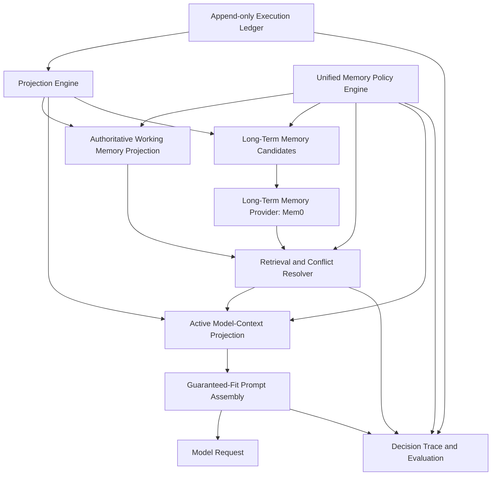

# Agent Memory Research Adoption Evaluation

- **Date:** 2026-06-10
- **Input:** Colleague proposal on Nexent global memory and context management
- **Scope:** Adoptable memory improvements and their integration with the existing context-management production plan

## 1. Executive Verdict

The proposal is strategically strong and correctly identifies Nexent's best product direction: Nexent should be a production-grade **Context and Memory Control Plane**, not merely a wrapper around Mem0.

The proposal contributes five important ideas that should be adopted:

1. Add an authoritative, structured session Working Memory.
2. Add one unified Memory Policy Engine for writing, retrieval, conflict resolution, privacy, and expiry.
3. Define deterministic authority and conflict rules for prompt assembly.
4. Add temporal lifecycle metadata to long-term memory.
5. Make memory decisions, conflicts, budgets, and prompt assembly observable and measurable.

However, two architectural adjustments are necessary:

- Working Memory must be a durable projection of the execution ledger, not an independent source of truth that can drift from session history.
- Redis and MinIO should not be mandatory Working Memory stores. Use the durable ledger/checkpoint database as the source of truth, Redis as an optional hot cache, and object storage only for large artifacts or snapshots.

Most recommendations fit inside the existing W4-W15 workstreams. Three additions deserve explicit deliverables: the Working Memory projection, the unified Memory Policy Engine, and temporal memory lifecycle management.

## 2. Current Nexent Reality

### 2.1 Existing Strengths Confirmed

- Nexent already supports Mem0-backed `tenant`, `user`, `agent`, and `user_agent` scopes through `sdk/nexent/memory/memory_service.py` and `sdk/nexent/memory/memory_utils.py`.
- Users can enable or disable memory and configure agent sharing through `backend/services/memory_config_service.py`.
- Nexent supports automatic memory retrieval plus explicit `search_memory` and `store_memory` tools.
- Retrieved memory is represented as a `MemoryComponent`, participates in context selection, and carries generic metadata.
- Context compression, component budgets, tracing, and debugger tooling already provide a strong base for a control plane.

### 2.2 Gaps Confirmed

- There is no first-class authoritative Working Memory model or store.
- Automatic memory writing uses only the current user query and final answer, so it misses tool-derived facts, decisions, task progress, failures, and corrections: `backend/services/agent_service.py:893-928`.
- Memory write routing is distributed across prompt instructions, tools, end-of-run background logic, and user settings rather than one policy engine.
- Retrieval searches each enabled scope using the same query, `top_k`, and threshold, then concatenates results without global reranking, deduplication, lifecycle filtering, or conflict resolution: `sdk/nexent/memory/memory_service.py:190-282`.
- Retrieved memories are rendered as system messages. In the current template and piecewise assembly, memory appears before core responsibilities and safety instructions: `backend/prompts/managed_system_prompt_template_en.yaml:5-44` and `backend/utils/context_utils.py:1218-1295`.
- Current conflict rules depend on prompt text, list position, and relevance score instead of deterministic policy enforcement.
- Memory records exposed to context assembly do not have a required temporal lifecycle contract such as `valid_from`, `valid_until`, `status`, or `superseded_by`.
- Existing tracing covers retrieval and compression, but there is no unified decision trace explaining writes, retrieval selection, conflicts, exclusions, and final prompt assembly.

## 3. Adoption Matrix

| Priority | Proposal to adopt | Verdict | Required implementation | Existing plan mapping |
| --- | --- | --- | --- | --- |
| Blocker | Authoritative session Working Memory | Adopt with architectural adjustment | Build a typed `working_memory_projection` from ledger events and checkpoints. Store task goal, constraints, decisions, unresolved items, active entities, and tool state. Make it durable; optionally cache in Redis. | W5, W6, W7 |
| Blocker | Unified Memory Policy Engine | Adopt | Extend the unified `ContextPolicy` into a `MemoryPolicy` domain covering write destination, retrieval, authority, confirmation, expiry, privacy, and no-write rules. All automatic and tool-driven memory operations must use it. | W10, W14 |
| Blocker | Deterministic authority and conflict resolution | Adopt and strengthen | Enforce authority tiers in code before prompt assembly. Never rely only on prompt instructions or list order. Current explicit user input must override stale memory; untrusted memory must never become authoritative system policy. | W6, W10, W14 |
| Blocker | Correct prompt assembly order | Adopt immediately | Separate authoritative instructions from retrieved memory. Inject Working Memory as structured runtime state; inject long-term memories as attributed, non-authoritative context below policy and current-task constraints. | W3, W10, W14 |
| High | Richer memory extraction from agent progress | Adopt | Generate memory candidates from sanitized ledger events and progress summaries, not only user prompt plus final answer. Include decisions and verified tool-derived facts; exclude hidden reasoning and raw secrets. | W5, W6, W14 |
| High | Temporal and versioned long-term memory | Adopt incrementally | Require lifecycle metadata: source, scope, confidence, created/confirmed time, validity interval, status, and supersession link. Filter stale/deleted memories before retrieval. Start with metadata and history; evaluate temporal graphs later. | W8, W14 |
| High | Global retrieval reranking and deduplication | Adopt | Merge results across scopes, then rerank by authority, explicitness, recency, validity, relevance, and confidence. Deduplicate semantically equivalent facts and detect contradictions before injection. | W10, W11, W14 |
| High | Cross-layer context and memory observability | Adopt | Add an authorized decision trace showing candidate memories, write decisions, retrieved/excluded items, conflicts, resolution reasons, component budgets, reductions, and final prompt projection. | W5, W6, W15 |
| High | Memory-specific evaluation suite | Adopt | Extend context SLOs with write precision, retrieval recall, stale-memory rejection, conflict resolution, correction propagation, deletion propagation, and long-task state retention. | W15 |
| High | User confirmation and no-write policies | Adopt | Require confirmation for sensitive, high-impact, tenant-shared, or low-confidence memory writes. Add explicit ephemeral/no-write classifications and honor “forget” requests across derived state. | W10, W14 |
| Medium | Productized zero-code memory controls | Adopt | Extend current switches and CRUD UI with Working Memory enablement, memory scope, write confirmation mode, retention, compaction mode, and an authorized “why was this used/stored?” view. | W9, W14, W15 |
| Medium | Time travel, replay, and rollback | Already covered; add memory criteria | Use immutable ledger history and versioned projections to inspect earlier memory state, replay decisions, and restore checkpoints without rewriting history. | W5, W7, W8, W9 |
| Medium | Context Control Plane positioning | Adopt as product language | Describe Mem0 as one long-term-memory provider within Nexent's broader policy, state, context assembly, lifecycle, and observability platform. | Product/documentation work |
| Defer | Temporal knowledge graph | Benchmark before adoption | Do not introduce Graphiti/Zep-like infrastructure initially. First implement temporal metadata, supersession, conflict detection, and evaluation. Adopt a graph only if relationship and temporal-reasoning benchmarks justify the operational cost. | Future extension |
| Reject as fixed architecture | Mandatory Redis hot store plus MinIO cold backup for Working Memory | Replace with storage abstraction | Use a durable projection/checkpoint store as source of truth. Redis may accelerate reads; object storage is appropriate for large artifacts and snapshots, not ordinary structured Working Memory. | W7, W12 |

## 4. Recommended Target Architecture

### 4.1 Working Memory Contract

Working Memory should contain structured, session-authoritative state:

- Current goal and active subgoals.
- Explicit user constraints and current-turn corrections.
- Confirmed decisions and their source event IDs.
- Unresolved questions and pending actions.
- Active entities, files, artifacts, and tool state.
- Relevant deadlines and validity periods.
- Projection version, source event sequence, and last update time.

Working Memory should not contain:

- Hidden chain-of-thought.
- Unlimited raw tool output.
- Unverified model inference presented as fact.
- Long-term preferences unrelated to the active task.

### 4.2 Authority Order

Use deterministic authority tiers rather than one flat priority list:

1. System security and platform policy.
2. Authorized tenant policy.
3. Explicit current user instruction and correction.
4. Confirmed Working Memory state for the active task.
5. Recent verified events and tool results.
6. Valid retrieved long-term memory.
7. Compressed summaries.
8. Unverified agent inference.

Recency alone must not override higher-authority policy. Relevance score must not be treated as trust.

### 4.3 Long-Term Memory Lifecycle Contract

Each long-term memory should expose at least:

| Field | Purpose |
| --- | --- |
| `memory_id` | Stable identity. |
| `scope` and owner IDs | Tenant/user/agent authorization boundary. |
| `content` and normalized fact key | Human-readable memory and conflict/deduplication key. |
| `source_event_ids` | Evidence and audit trail. |
| `source_type` | Explicit user statement, verified tool result, agent inference, import, or administrator policy. |
| `confidence` | Evidence confidence, distinct from retrieval relevance. |
| `created_at` and `last_confirmed_at` | Lifecycle and freshness. |
| `valid_from` and `valid_until` | Temporal applicability. |
| `status` | Candidate, active, stale, superseded, rejected, or deleted. |
| `superseded_by` | Replacement chain. |
| `policy_version` | Policy that approved the write. |

## 5. Changes to Make in the Existing 16-Workstream Plan

### Immediate Plan Amendments

- **W5 Structured execution ledger:** Add typed memory-candidate, memory-write-decision, conflict-resolution, and Working Memory update events.
- **W6 Raw history versus active projection:** Add `working_memory_projection` and `memory_candidate_projection` alongside chat, resume, model-context, memory, and audit projections.
- **W7 Durable context state:** Persist Working Memory projection versions and source event sequences. Treat Redis only as an optional cache.
- **W8 Cache validity:** Invalidate Working Memory and memory retrieval projections when source events, memory lifecycle state, or policy versions change.
- **W9 Lifecycle APIs:** Add inspect/restore/fork behavior for Working Memory and memory decisions.
- **W10 Unified context policy:** Expand it into the unified Memory Policy Engine and enforce deterministic authority tiers.
- **W11 Progressive reduction:** Preserve a minimal authoritative Working Memory representation under token pressure; reduce long-term memory before Working Memory.
- **W14 Governance and privacy:** Add temporal lifecycle, confirmation, no-write, source evidence, deletion propagation, and memory authorization rules.
- **W15 SLOs:** Add memory-system evaluation metrics and decision-trace completeness.

### Recommended New Deliverables Without Adding New W-IDs

| Deliverable | Parent workstreams | Acceptance proof |
| --- | --- | --- |
| Working Memory schema, projector, store abstraction, and context component | W5-W7, W10-W11 | Restart and fork reproduce the same active task state; compression never silently removes mandatory Working Memory. |
| Memory Policy Engine | W10, W14 | The same candidate produces deterministic write, retrieval, conflict, expiry, and privacy decisions across automatic and tool-driven paths. |
| Temporal memory lifecycle | W8, W14 | A newer correction supersedes an older fact; stale and deleted memories are not injected; evidence remains auditable. |
| Context and memory decision trace | W5, W15 | Authorized operators can explain why each memory was stored, retrieved, excluded, resolved, reduced, or injected. |
| Nexent Memory Eval | W15 | CI detects regressions in write precision, retrieval, conflict handling, stale rejection, deletion, and state retention. |

## 6. Suggested Adoption Sequence

### Adopt Now

1. Fix prompt authority ordering so retrieved memory cannot precede or override authoritative instructions.
2. Define the Working Memory schema and implement it as an execution-ledger projection.
3. Define the unified Memory Policy contract and route all memory writes and retrieval through it.
4. Add memory lifecycle metadata, conflict detection, supersession, and deletion propagation.
5. Add the global decision trace and memory-specific CI evaluation.

### Adopt After the Foundation

1. Add zero-code configuration and authorized inspection UI.
2. Add optional Redis caching for Working Memory projections.
3. Add advanced retrieval reranking and personalized policy presets.

### Evaluate Later

1. Temporal knowledge graph or Graphiti/Zep integration.
2. Alternative long-term memory providers behind the same policy and lifecycle interfaces.
3. Object-store snapshots for unusually large state or compliance archives.

## 7. Overall Assessment

The proposal should be adopted as a memory-focused extension of the current context-management plan. Its most valuable contribution is not a specific storage choice; it is the missing policy and authority model that connects long-term memory, session state, context compression, and prompt assembly.

After adoption, Nexent would move from:

> Mem0 retrieval plus context compression

to:

> A governed Context and Memory Control Plane that can explain what was remembered, why it was trusted, when it is valid, how conflicts were resolved, and exactly why it entered the model context.

## 8. External Primary References

- LangGraph persistence, checkpoints, threads, replay, and fault tolerance: <https://docs.langchain.com/oss/python/langgraph/persistence>
- Letta memory blocks and stateful agent concepts: <https://docs.letta.com/guides/agents/memory-blocks>
- Zep/Graphiti temporal knowledge graph concepts: <https://help.getzep.com/graphiti/getting-started/overview>
- Mem0 memory concepts and lifecycle documentation: <https://docs.mem0.ai/core-concepts/memory-operations>
