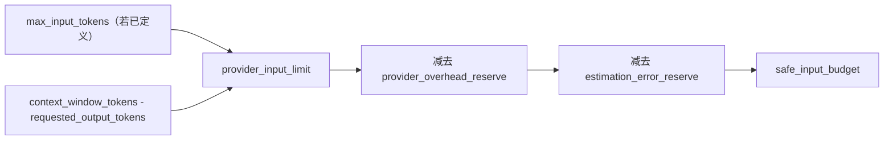
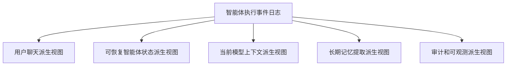
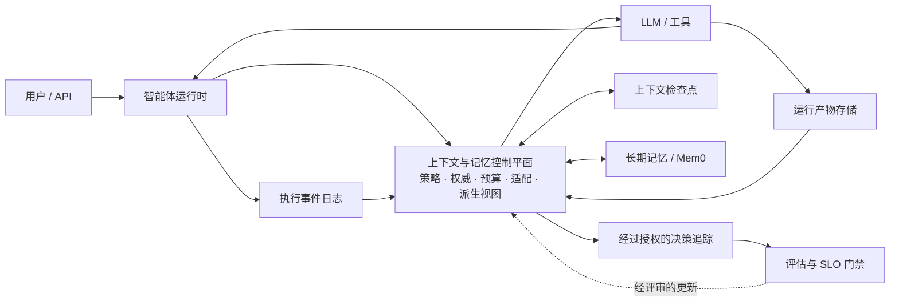
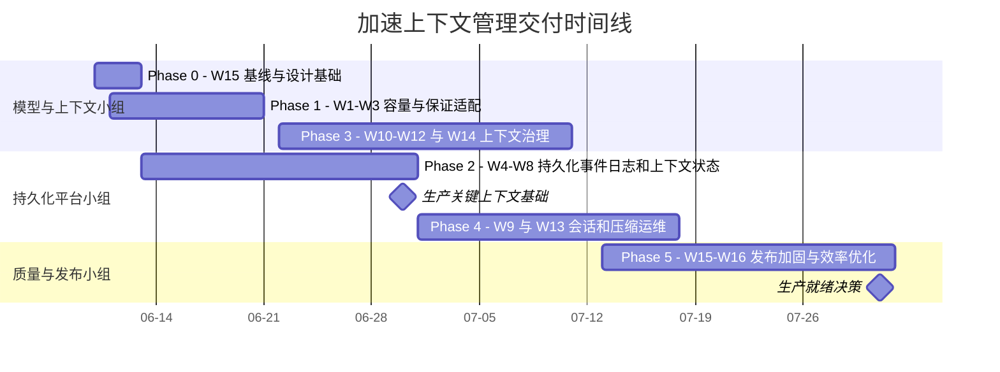
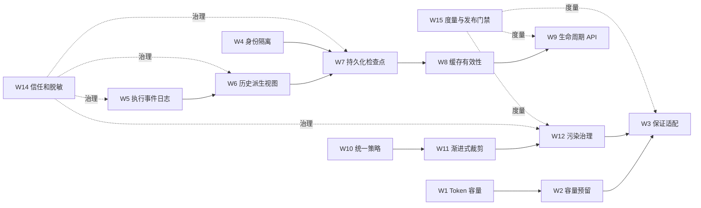

# Nexent 上下文管理生产化建设计划

- **状态：** 提案
- **日期：** 2026-06-10
- **范围：** 仅限上下文管理
- **目标：** 建设可用于生产环境、多租户、多 Worker 的智能体上下文平台

## 0. Nexent 与其他智能体平台对比

本对比评估 Nexent 截至 2026 年 6 月 10 日的当前实现，仅关注上下文管理、智能体状态和记忆。由于各产品定位不同，下表不进行泛化功能清单对比，而是聚焦每个平台最值得 Nexent 学习的能力。

### 0.1 执行层能力评分

| 能力 | Nexent 当前状态 | 与领先平台的差距 | 补齐差距的价值 | 执行动作 |
| --- | --- | --- | --- | --- |
| 上下文压缩与预算 | 已具备增量摘要、摘要缓存、降级截断、上下文组件和调试追踪。 | Token 容量语义不正确，无法保证最终适配，且大组件或工具输出缺少渐进式裁剪。 | 避免上下文超限，并在长任务中提升回答质量、降低延迟和 Token 成本。 | [W1](#w1)-[W3](#w3)、[W10](#w10)-[W13](#w13) 和 [W16](#w16)。 |
| 持久化会话与执行状态 | 已持久化用户输入、最终答案和部分可见进度，但摘要状态仍主要存在于进程内。 | 与 Codex、LangGraph 和 OpenAI Agents SDK 相比，Nexent 无法可靠重建、恢复、重放、分叉或故障恢复完整智能体执行。 | 支持可靠的长任务、多 Worker 故障转移、调试、审计和用户控制的会话恢复。 | [W5](#w5)-[W9](#w9)。 |
| 长期记忆 | 已在四级授权作用域中集成 Mem0，具备良好的检索基础。 | 缺少平台级记忆策略引擎、时间有效性、冲突处理、证据关联和可度量的生命周期治理。 | 提升个性化可信度，避免过期或矛盾记忆影响智能体决策。 | [W14](#w14)-[W15](#w15)，并新增 Memory Policy Engine 和时间记忆元数据。 |
| 权威工作记忆（Working Memory） | 当前没有一等结构化层表达智能体的活动目标、决策、约束和任务状态。 | 与 Letta 和 LangGraph 相比，关键工作状态被埋在对话记录或临时运行时对象中。 | 为智能体提供精简、可编辑、可恢复的权威状态，避免反复重放完整历史。 | 将工作记忆建设为 [W5](#w5)-[W7](#w7) 执行事件日志的类型化派生视图，并通过 [W9](#w9) 暴露操作能力。 |
| 上下文与记忆治理 | 已具备授权作用域和功能开关。 | 信任标签、来源、脱敏、保留、删除传播和决策追踪仍不完整。 | 降低隐私与安全风险，使持久化上下文能够用于企业生产环境。 | [W4](#w4)、[W8](#w8) 和 [W14](#w14)-[W15](#w15)。 |
| 平台产品化 | 已将零代码配置、多租户、工具、技能、知识、记忆和编排集成到同一平台。 | 更强的状态和上下文原语尚未形成统一的运维及开发者控制平面。 | 将 Nexent 的广泛集成优势转化为差异化的生产级智能体平台。 | 在保留现有平台工作流的同时，交付完整 [W1](#w1)-[W16](#w16) 路线图。 |

**结论：** Nexent 的平台集成范围已超过多数专业化竞争者，但在持久化执行状态、权威工作记忆（Working Memory）、生命周期控制和记忆治理方面仍落后于领先系统。

### 0.2 编码智能体产品

| 对比平台 | Nexent 当前状态 | Nexent 与该平台的差距 | 补齐差距的价值 | 执行动作 |
| --- | --- | --- | --- | --- |
| [Claude Code](https://docs.anthropic.com/en/docs/claude-code/sub-agents) | Nexent 支持多智能体执行和上下文压缩，但委派任务仍会过多共享主任务上下文，生命周期控制有限。 | Claude Code 会隔离子智能体上下文、返回有界摘要，并提供压缩 Hook 和持久项目指导。 | 防止委派任务污染父上下文，并让用户可预测地控制长会话。 | 通过 [W12](#w12) 隔离子智能体上下文并转存输出；通过 [W9](#w9) 和 [W13](#w13) 增加压缩 Hook 与检查能力；通过 [W10](#w10) 和 [W14](#w14) 治理持久指导。 |
| [Codex](https://developers.openai.com/codex/learn/best-practices) | Nexent 已持久化面向聊天展示的记录，但缺少完整持久执行历史，以及一等的 resume、fork、rollback 和上下文状态控制。 | Codex 将会话历史和生命周期操作作为核心产品能力，并通过渐进式披露控制上下文增长。 | 支持可靠续作、从历史状态进行实验、透明控制上下文以及高效长任务执行。 | 通过 [W5](#w5)-[W9](#w9) 建设执行事件日志、派生视图、检查点和生命周期 API；通过 [W10](#w10)-[W12](#w12) 增加渐进加载和输出治理。 |
| [OpenCode](https://opencode.ai/docs/config/) | Nexent 已有自动压缩和降级截断，但运维控制较分散，大型输出仍可能占据主要上下文。 | OpenCode 提供直接易用的容量预留、工具输出裁剪、会话导出和扩展 Hook。 | 使上下文行为更易运维、调试和定制，并持续保持在预算内。 | 通过 [W2](#w2) 增加容量预留；通过 [W12](#w12) 裁剪输出并转存运行产物；通过 [W9](#w9) 增加会话导出；围绕 [W10](#w10) 和 [W13](#w13) 定义轻量扩展 Hook API。 |

### 0.3 状态、记忆与智能体框架

| 对比平台 | Nexent 当前状态 | Nexent 与该平台的差距 | 补齐差距的价值 | 执行动作 |
| --- | --- | --- | --- | --- |
| [LangGraph](https://docs.langchain.com/oss/python/langgraph/persistence) | Nexent 的摘要和缓存主要存在于进程内，不足以重建每个执行步骤。 | LangGraph 提供类型化的逐步持久检查点、版本化线程、重放、时间旅行和故障恢复。 | 支持多 Worker 恢复、确定性调试，并从已知正常的执行状态继续运行。 | 通过 [W5](#w5)、[W7](#w7) 和 [W8](#w8) 建设类型化执行事件与持久检查点；通过 [W9](#w9) 暴露重放和恢复能力。 |
| [OpenAI Agents SDK](https://openai.github.io/openai-agents-python/sessions/) | Nexent 保存聊天记录和部分可见进度，但缺少覆盖全部运行事件的统一标准会话协议。 | Agents SDK 将工具、智能体交接、审批和运行事件建模为丰富的会话事件，并支持可插拔存储。 | 简化集成，并保存可靠恢复、审计和多种派生视图所需的结构化证据。 | 通过 [W5](#w5)-[W7](#w7) 定义标准运行事件 Schema 和可插拔执行事件日志存储；通过 [W9](#w9) 暴露最小会话接口。 |
| [Letta](https://docs.letta.com/guides/core-concepts/stateful-agents/) | Nexent 已有长期记忆，但缺少表达活动任务状态的权威、可编辑工作记忆（Working Memory）。 | Letta 提供明确的上下文内记忆块、归档记忆、共享块和上下文可视化。 | 使目标、约束、决策和任务进度保持精简、可检查，并可跨运行恢复。 | 通过 [W5](#w5)-[W7](#w7) 创建类型化工作记忆派生视图；通过 [W9](#w9) 增加检查和编辑 API；通过 [W4](#w4) 和 [W14](#w14) 执行共享状态授权。 |
| [Zep / Graphiti](https://help.getzep.com/graphiti/getting-started/overview) | Nexent 可以检索有作用域的长期记忆，但未正式建模事实何时有效、被替代、发生冲突或具备证据支持。 | Zep/Graphiti 管理时间事实、关系、有效期和替代关系。 | 防止旧事实静默覆盖新证据，并提升记忆驱动行为的可解释性。 | 在 [W14](#w14) 中扩展时间元数据、证据关联、冲突检测和替代规则；仅在这些契约稳定后评估图后端。 |
| [Mem0](https://docs.mem0.ai/) | Mem0 已作为 Nexent 的长期记忆 Provider 集成到四级作用域中。 | Nexent 缺少 Provider 无关的策略层统一管理抽取、检索、更新、冲突处理、保留和质量。 | 保留现有投入，同时使记忆行为可信、可度量且 Provider 可替换。 | 保留 Mem0 Provider；新增由 [W5](#w5)-[W6](#w6) 提供事件、受 [W14](#w14) 治理、由 [W15](#w15) 度量的 Memory Policy Engine。 |
| [LlamaIndex](https://developers.llamaindex.ai/python/framework/module_guides/deploying/agents/memory/) | Nexent 已有实用的上下文和记忆组件，但存储、检索、派生视图与策略职责耦合较紧。 | LlamaIndex 提供可组合的记忆、存储、检索和摘要原语。 | 在不削弱平台统一治理的前提下，使上下文算法更容易测试、替换和演进。 | 在实施 [W6](#w6)、[W10](#w10) 和 [W11](#w11) 时，定义稳定的 store、retriever、projector、reducer 和 policy 接口。 |
| [ClawVM](https://doi.org/10.1145/3805621.3807648) | Nexent 已具备预算、摘要、运行产物、记忆和生命周期概念，但主要仍以尽力而为的机制运行。 | ClawVM 通过类型化上下文页、最小保真不变量、多分辨率表示、覆盖完整生命周期的校验写回和可观测上下文故障，使上下文驻留与持久化成为可执行契约。 | 防止关键状态在压缩、重置、驱逐或召回失败时静默消失，并使故障可重放、可诊断。 | 将其执行契约落实到 [W3](#w3)、[W5](#w5)-[W6](#w6)、[W9](#w9)-[W12](#w12)、[W14](#w14) 和 [W15](#w15)；现有存储和 Mem0 继续作为适配器后的后端。 |

### 0.4 战略定位

Nexent 应定位为生产级 **Context and Memory Control Plane**：融合 LangGraph 式持久化、Letta 式有状态记忆、Zep 式时间治理和编码智能体式上下文控制，同时保留 Nexent 的零代码、多租户产品平台优势。

## 1. 执行摘要与整体收益

Nexent 已具备较强的上下文压缩基础，包括增量摘要、摘要缓存、降级截断、上下文组件、分层长期记忆、基准测试和调试追踪。当前主要缺口不是重新设计压缩算法，而是让上下文状态具备正确性、持久性、隔离性、可控性和可度量性。

本计划包含 16 个必须执行的改进项：

- 原有的 14 个生产化改进项。
- 修正模型 Token 容量设计，扩展原有的上下文适配问题。
- 建设结构化智能体执行事件日志，扩展原有的会话持久化和生命周期能力。

后两个发现不是附加优化，而是会影响多数改进项的基础架构变更。

### 1.1 必须执行的改进汇总

以下模块用于建立便于分工的责任边界，跨模块依赖关系在第 3 章中明确说明。

| 模块 | 工作项 | 建议主要负责人 | 主要职责 |
| --- | --- | --- | --- |
| 模型容量与请求安全 | W1-W3 | 模型集成和智能体运行时工程师 | 容量契约、Token 预算和请求强制适配。 |
| 持久化会话状态与生命周期 | W4-W9 | 后端平台、数据和分布式系统工程师 | 身份隔离、执行事件日志、检查点、重放和会话操作。 |
| 上下文构建与压缩 | W10-W13 | 智能体运行时和上下文算法工程师 | 上下文策略、渐进式裁剪、运行产物转存和压缩可靠性。 |
| 治理与隐私 | W14 | 安全、隐私和平台治理工程师 | 来源、信任边界、脱敏、保留和删除。 |
| 质量与效率 | W15-W16 | 质量基础设施和性能工程师 | 上下文 SLO、发布门禁、可观测性和 Prompt Cache 效率。 |

下表按照便于分工的工程模块分组。模块和工作项按照依赖关系及建议执行优先级排序，同时保留严重程度用于发布规划。

| 模块 | 严重程度 | ID | 必须执行的改进 | 当前问题 | 建议方案 | 主要收益 |
| --- | --- | --: | --- | --- | --- | --- |
| 模型容量与请求安全 | 阻塞项 | [W1](#w1) | 修正模型 Token 容量配置 | `max_tokens` 同时具有输出上限和上下文阈值等冲突语义。 | 拆分总上下文、硬输入上限、输出上限、输出预留和 tokenizer 字段，并动态计算安全输入预算。 | 确保压缩触发正确，避免向模型发送非法请求。 |
| 模型容量与请求安全 | 高 | [W2](#w2) | 输出和安全容量预留 | 上下文构建可能消耗模型全部容量。 | 预留输出、Provider 开销、推理和估算误差空间。 | 保证回答质量并降低超限风险。 |
| 模型容量与请求安全 | 阻塞项 | [W3](#w3) | 保证每次模型请求都能放入上下文窗口 | 压缩后仍超限时，Nexent 只记录告警，仍可能调用模型。 | 在每次模型调用前执行强制、确定性的最终适配流水线。 | 消除可预防的上下文长度错误。 |
| 持久化会话状态与生命周期 | 阻塞项 | [W4](#w4) | 租户和用户隔离 | 上下文状态仅按 `conversation_id` 建立索引。 | 所有上下文状态都使用租户、用户、会话、智能体和分支联合身份。 | 防止跨用户或跨租户上下文泄漏。 |
| 持久化会话状态与生命周期 | 阻塞项 | [W5](#w5) | 结构化智能体执行事件日志 | 当前持久化更接近 UI 聊天记录，无法可靠重放智能体状态。 | 持久化有序、类型化的运行、步骤、工具调用/结果、运行产物、错误和检查点。 | 支持可靠恢复、审计、分叉和重建。 |
| 持久化会话状态与生命周期 | 阻塞项 | [W6](#w6) | 分离原始历史与当前模型上下文 | 如果直接将更丰富的执行进度加入历史，会进一步污染模型上下文。 | 从执行事件日志生成面向聊天、恢复、模型上下文、长期记忆和审计的派生视图。 | 保留丰富证据，同时控制 Prompt 大小。 |
| 持久化会话状态与生命周期 | 阻塞项 | [W7](#w7) | 多 Worker 持久化上下文状态 | 摘要缓存在进程重启后丢失，也无法跨 Worker 使用。 | 持久化带版本的上下文检查点，并使用乐观并发控制。 | 支持水平扩展和故障恢复。 |
| 持久化会话状态与生命周期 | 阻塞项 | [W8](#w8) | 完整缓存校验与版本控制 | 仅验证边界指纹，可能错误复用过期摘要。 | 对完整覆盖前缀进行哈希，并加入模型、策略、Schema、Prompt 和分支版本。 | 防止恢复错误或过期上下文。 |
| 持久化会话状态与生命周期 | 高 | [W9](#w9) | 完整会话生命周期 API | 缺少 compact、checkpoint、restore、fork、reset 和 inspect 等能力。 | 在不可变执行事件日志上建设持久化生命周期 API 和压缩 Hook。 | 使长会话可控制、可恢复。 |
| 上下文构建与压缩 | 高 | [W10](#w10) | 统一且可执行的上下文与记忆策略 | 上下文注入和记忆决策分散在不一致的策略及执行路径中。 | 使用统一、可校验的策略引擎管理上下文选择、记忆写入/检索、权威性、冲突和禁止写入规则。 | 使上下文与记忆行为可预测、可信且可配置。 |
| 上下文构建与压缩 | 高 | [W11](#w11) | 渐进式组件裁剪 | 超大的工具、技能、记忆或指令可能被整体丢弃。 | 针对组件执行裁剪、重排、摘要，并保留最小可用表示。 | 在预算压力下仍保留关键能力。 |
| 上下文构建与压缩 | 高 | [W12](#w12) | 上下文污染与大输出治理 | 工具结果和中间步骤可能占据主上下文的大部分空间。 | 将大输出转存为运行产物，仅保留摘要和引用，并隔离子智能体上下文。 | 提升长会话可靠性并降低 Token 成本。 |
| 上下文构建与压缩 | 高 | [W13](#w13) | 可靠且受治理的压缩执行 | 压缩直接使用主模型，缺少独立的可靠性和成本控制。 | 增加压缩模型策略、超时、重试、取消、熔断和确定性降级。 | 防止压缩故障导致整个智能体运行失败。 |
| 治理与隐私 | 中 | [W14](#w14) | 信任、来源、脱敏和保留策略 | 检索和持久化的丰富上下文缺少正式的信任及生命周期管理。 | 标记来源和信任等级，脱敏敏感信息，执行保留策略和删除传播。 | 使丰富上下文能够安全用于生产环境。 |
| 质量与效率 | 中 | [W15](#w15) | 上下文质量与可靠性 SLO | 已有基准测试不会阻止回归或阻塞发布。 | 在 CI 和生产环境中建立适配率、保留率、延迟、成本、恢复和隔离门禁。 | 将上下文质量变为可执行的产品契约。 |
| 质量与效率 | 中 | [W16](#w16) | 面向 Prompt Cache 的上下文装配 | Prompt 排序没有主动优化 Provider 缓存复用。 | 稳定 Prompt 前缀并追踪缓存输入 Token。 | 降低重复调用的延迟和成本。 |

### 1.2 整体收益

完成本计划后，Nexent 将从具备进程内压缩能力的智能体运行时，升级为持久化上下文平台：

- **正确：** 模型请求使用正确的容量语义，并保证能够放入上下文窗口。
- **安全：** 上下文具备租户隔离、来源标记、脱敏和治理能力。
- **持久：** 丰富执行状态和摘要可跨重启、故障转移和 Worker 迁移保留。
- **高效：** 模型只接收有预算的派生视图，大输出被转存，Prompt Cache 得到主动利用。
- **可控：** 用户和运维人员可以检查、压缩、恢复、分叉和重置上下文。
- **可度量：** 信息保留、上下文适配、延迟、成本、恢复和隔离成为发布门禁。
- **可扩展：** 未来可基于持久化执行事件日志重建更先进的上下文算法。

最重要的架构结果是明确分离以下概念：

该分离使 Nexent 能够保存智能体可靠续作所需的执行证据，同时确保每次模型请求保持精简、相关、安全且符合 Provider 限制。

## 2. 改进项详细说明

### 2.1 调查结论

#### 2.1.1 `max_tokens` 被错误地用作上下文窗口

该问题已确认。

Nexent SDK 将 `ModelConfig.max_tokens` 定义为单次模型调用的输出 Token 上限，并将其传递给 `chat.completions.create`：

- `sdk/nexent/core/agents/agent_model.py:47-55`
- `sdk/nexent/core/models/openai_llm.py:181-184`

但是，智能体配置又读取数据库中的同一字段，并将其直接赋给 `ContextManagerConfig.token_threshold`：

- `backend/agents/create_agent_info.py:510-516`
- `backend/agents/create_agent_info.py:553-556`

此外，主生产路径 `create_model_config_list` 在构建 SDK `ModelConfig` 时没有复制数据库中的 `max_tokens`：

- `backend/agents/create_agent_info.py:262-305`

因此，该字段目前没有唯一可信的语义，不能在未迁移的情况下可靠用于输入预算或输出限制。

建议新增以下模型配置字段：

| 字段 | 含义 |
| --- | --- |
| `context_window_tokens` | 模型总上下文容量，适用于输入和输出共享窗口的 Provider。 |
| `max_input_tokens` | 当 Provider 存在独立输入限制时使用的可选硬上限。 |
| `max_output_tokens` | Provider 支持或用户配置的输出上限，用于替代含义模糊的 `max_tokens`。 |
| `default_output_reserve_tokens` | 上下文构建前为模型输出预留的默认容量。 |
| `tokenizer_family` | Token 计数策略或 Provider/模型 tokenizer 标识。 |

运行时应动态计算安全输入预算：

仅增加 `max_input_tokens` 不足以解决问题。对于输入和输出共享窗口的 Provider，仍然需要 `context_window_tokens` 和独立输出上限才能正确计算预算。

兼容策略：

- 暂时保留数据库/API 中的 `max_tokens`，将其标记为 `max_output_tokens` 的废弃别名。
- 迁移后禁止使用旧 `max_tokens` 作为上下文窗口。
- 对未知容量使用保守的模型目录默认值，并标记来源为 `fallback`。
- 当容量未知或由系统推断时，向运维人员展示告警。

#### 2.1.2 当前聊天持久化有价值，但不足以恢复智能体状态

当前持久化并非无用，它已经保存：

- `conversation_message_t` 中的用户输入和助手最终答案。
- `conversation_message_unit_t` 中的可见思考、代码、执行日志和搜索占位符。
- 独立表中的搜索来源和图片。

证据：

- `backend/services/conversation_management_service.py:42-150`
- `backend/services/conversation_management_service.py:214-230`
- `backend/database/db_models.py:48-88`

但是，下一次智能体运行只接收扁平的 `{role, content}` 列表。前端明确选择助手最终答案作为历史，SDK 也只将其重建为包含最终文本的合成 `ActionStep`：

- `frontend/app/[locale]/chat/internal/chatInterface.tsx:463-475`
- `backend/consts/model.py:227-239`
- `backend/agents/create_agent_info.py:885-904`
- `sdk/nexent/core/agents/nexent_agent.py:448-475`

现有 Message Unit 更适合 UI 回放，缺少可靠恢复智能体所需的结构：

- 缺少持久化 run ID、step ID、父子关系和 branch ID。
- 缺少类型化工具请求和工具结果关系。
- 缺少上下文检查点和摘要版本。
- 缺少稳定的事件重放 Schema。
- 缺少分布式并发版本。
- 缺少脱敏、保留和大输出转存策略。

建议使用仅追加、类型化的智能体执行事件日志作为唯一可信数据源。

此处的 **会话（session）** 是用户可见的一次交互容器；**执行事件日志（execution event log）** 是该会话内发生事项的持久化、有序记录；**派生视图（derived view）** 则面向特定用途选择并转换这些事件。例如，聊天派生视图只包含面向用户的消息，而模型上下文派生视图只包含下一次模型调用所需且符合预算的信息。派生视图不是新的数据源，可以随时从执行事件日志重新生成。在事件溯源领域，这一概念也常被称为 projection。

| 本文术语 | 含义 |
| --- | --- |
| 会话（session） | 组织相关运行、分支和用户可见历史的交互容器。 |
| 运行（run） | 会话内由一次用户请求触发的智能体执行。 |
| 执行事件日志（execution event log） | 仅追加、有序记录运行中的动作、工具调用、结果、错误和回答。 |
| 派生视图（derived view） | 从执行事件中按特定用途选择和转换得到、可重新生成的视图。 |
| 检查点（checkpoint） | 绑定到确定执行事件边界、用于恢复的版本化状态快照。 |
| 运行产物（artifact） | 存储在当前模型上下文之外的大型输出、文件、日志或二进制数据。 |
| 工作记忆（Working Memory） | 智能体当前使用的结构化目标、约束、决策和任务状态。 |

建议持久化实体：

| 实体 | 用途 |
| --- | --- |
| `agent_session` | 保存租户、用户、会话、智能体、分支、状态和版本。 |
| `agent_run` | 保存一次用户触发运行的模型/配置快照和开始结束状态。 |
| `agent_event` | 保存有序类型化事件，例如用户输入、模型动作、工具调用、工具结果、错误、最终答案和取消。 |
| `agent_artifact` | 保存大工具输出、文件、日志和二进制引用，避免直接进入 Prompt。 |
| `context_checkpoint` | 保存带版本的摘要、压缩边界、策略/模型/Schema 版本和 Token 统计。 |

默认应持久化：

- 用户消息和助手最终答案。
- 理解工具调用所需的可见模型动作。
- 结构化工具名、脱敏参数、状态和结果引用。
- 工具结果摘要及大结果的运行产物指针。
- 错误、重试、取消和最大步骤终止。
- 引用、附件、Token、延迟、成本、上下文检查点和进度摘要。

默认不应持久化：

- 隐藏或私有 Chain-of-Thought、Provider 推理轨迹。
- 密钥、凭据、原始授权头和未脱敏敏感工具参数。
- 直接写入关系事件表的无限大原始工具输出。

#### 必需的记忆控制能力

生产级记忆系统必须具备以下控制能力。这些能力在 W5-W15 中实现，不作为独立工作项管理：

| 必需能力 | 必须实现的行为 | 所属 W-ID |
| --- | --- | --- |
| 权威工作记忆 | 维护当前目标、显式约束、已确认决策、未解决事项、活动实体和工具状态的类型化派生视图。它必须可从执行事件重建，并能跨重启和分叉恢复。 | [W5](#w5)-[W9](#w9)、[W11](#w11) |
| 统一记忆策略引擎 | 所有自动和工具触发的记忆写入、检索、更新、过期及删除都必须经过同一版本化策略契约。 | [W10](#w10)、[W14](#w14) |
| 确定性权威与冲突处理 | 在组装 Prompt 前通过代码解决冲突。系统和租户策略高于用户指令；当前用户的显式纠正高于工作记忆和长期记忆；相关性不代表可信度。 | [W10](#w10)、[W14](#w14) |
| 正确的 Prompt 权威顺序 | 检索到的长期记忆必须带来源且不具备权威性，其优先级低于权威指令、当前任务约束和已确认工作记忆。 | [W3](#w3)、[W10](#w10)、[W14](#w14) |
| 丰富记忆候选提取 | 从脱敏执行事件、已验证工具事实、决策和纠正中生成记忆候选，而不是只使用用户输入和最终答案。 | [W5](#w5)-[W6](#w6)、[W14](#w14) |
| 时间化记忆生命周期 | 记录来源证据、置信度、确认时间、有效期、状态和替代关系；注入前排除过期、拒绝、删除或已被替代的记忆。 | [W8](#w8)、[W14](#w14) |
| 全局检索结果处理 | 合并不同作用域结果后，执行全局重排、去重、生命周期过滤和矛盾检测，再注入 Prompt。 | [W10](#w10)-[W11](#w11)、[W14](#w14) |
| 可解释的记忆决策 | 在不暴露隐藏思维链的前提下，记录记忆被保存、拒绝、检索、排除、替代、裁剪或注入的原因。 | [W5](#w5)-[W6](#w6)、[W15](#w15) |
| 确认与禁止写入控制 | 敏感、租户共享、高影响或低置信度写入需要确认，并支持临时和明确禁止写入分类。 | [W10](#w10)、[W14](#w14) |

工作记忆不能成为可能与执行历史发生漂移的独立真实来源。持久化执行事件日志和检查点仍是权威数据；Redis 只能作为可选热缓存，对象存储仅用于大型运行产物或快照。

#### ClawVM 引入评估

ClawVM 的核心洞察是：上下文管理应成为由智能体运行框架执行的契约，而不是一组依赖模型自行摘要和检索的启发式机制。其虚拟内存术语不是必须采用的产品概念，但其生产机制非常适合 Nexent。

| 论文贡献 | 对 Nexent 的评估 | 在本计划中的落实位置 |
| --- | --- | --- |
| 带稳定身份、作用域、来源和最小保真要求的类型化上下文页 | 引入。它为上下文选择、裁剪、恢复和审计提供确定性操作单元。公共 API 使用更中性的 `ContextItem`，不暴露操作系统术语。 | [W5](#w5)、[W6](#w6)、[W10](#w10)、[W11](#w11)、[W14](#w14) |
| 完整、压缩、结构化和指针四级表示 | 引入。预生成低保真表示可避免紧急压缩依赖额外 LLM 调用，并支持渐进降级；同时必须度量生成成本和陈旧风险。 | [W3](#w3)、[W6](#w6)、[W11](#w11)、[W12](#w12) |
| 两阶段选择：先装入所有必选最小表示，再用剩余预算升级 | 引入。它将结构安全与质量优化清晰分离。初期使用确定性的优先级、最近使用情况和重算成本评分，不因追求最优背包算法阻塞上线。 | [W3](#w3)、[W10](#w10)、[W11](#w11)、[W15](#w15) |
| 覆盖完整生命周期、经过校验且非破坏性的写回 | 作为阻塞级持久化契约引入。压缩、重置、分叉、驱逐、关闭或 Worker 交接可能销毁唯一副本前，必须完成脏状态的暂存、校验和提交。 | [W5](#w5)、[W7](#w7)、[W8](#w8)、[W9](#w9)、[W14](#w14) |
| 可观测上下文故障模型与确定性重放 | 引入。显式故障分类和原因码使上下文问题可测试、可运维；后续增加离线 Oracle 对比以调优策略。 | [W5](#w5)、[W9](#w9)、[W15](#w15) |
| 所有可由策略控制的故障降为零的实验结论 | 作为架构证据，而不是可直接继承的保证。论文主要评估确定性重放和结构故障；语义正确性、在线跨会话行为和最终用户质量仍未充分验证。 | 在 [W15](#w15) 下要求 Nexent 自有的在线、重放、语义质量和多租户证据。 |

### 2.2 目标架构

图中有意将控制平面表示为单一架构组件；其内部策略、权威、预算、检索、裁剪和派生视图职责已在 W5-W15 中定义。该图只强调三个闭环：运行时执行、持久化上下文与记忆状态，以及经过人工评审的治理改进。

核心不变量：

1. 任何模型请求都不能超过计算出的安全输入预算。
2. 上下文状态按租户、用户、会话、智能体和分支隔离。
3. Worker 重启或路由变更不能丢失可恢复上下文。
4. 原始持久化历史与发送给模型的有界上下文必须分离。
5. 所有丢弃、摘要或转存的上下文项都必须可观测。
6. 覆盖数据或策略变化时，必须使相关上下文检查点失效。
7. 工作记忆必须是可重建、带版本的派生视图，而不是独立真实来源。
8. 检索记忆不能仅因相关或以系统消息注入就成为权威信息。
9. 记忆写入、冲突、生命周期变化、排除和 Prompt 注入决策必须可解释。
10. 所有模型或工具执行结果必须先写入执行事件日志，才能影响后续上下文。
11. 评估可以建议策略变更，但权威和隐私策略变更必须经过评审。
12. 每个必选上下文项都必须声明经过压缩和重置后仍需保留的最小表示。
13. 任何生命周期操作销毁脏上下文状态的唯一副本前，必须先完成持久化提交。
14. 写回默认必须经过 Schema 校验、作用域校验、来源关联，并使用非破坏性语义。
15. 召回、裁剪、驱逐、恢复和写回结果必须暴露稳定原因码。

### 2.3 开发工作项

#### 2.3.1 模型容量与请求安全

##### W1. 建立正确的模型 Token 容量配置

**问题：** `max_tokens` 同时被当作输出上限和上下文阈值。

**方案：**

- 将 2.1.1 中的容量字段加入数据库、API、Provider 发现、前端、SDK 和监控。
- 将 LLM 内部 `max_tokens` 重命名为 `max_output_tokens`。
- 新增 `ModelCapacityResolver`，标记容量来源为 `provider`、`operator`、`catalog` 或 `fallback`。
- 每次请求动态计算 `safe_input_budget`。
- 拒绝输出预留超过总上下文窗口等非法配置。

**证明与收益：** 正确容量模型是可靠压缩触发、跨 Provider 兼容和输出质量保证的基础。

**验收标准：** 覆盖共享窗口和独立输入上限 Provider，并在监控中报告完整容量。

##### W2. 预留输出和安全容量

**问题：** 上下文阈值可能等于模型上限，没有为输出、推理、Provider 开销和估算误差预留空间。

**方案：**

- 使用 2.1.1 中的安全输入预算公式。
- 支持智能体级和请求级输出预留覆盖。
- 定义 Provider 开销和估算误差余量。
- 在硬边界前使用可配置软阈值触发压缩。

**证明与收益：** 降低超限风险，避免压缩上下文挤占模型回答空间。

**验收标准：** 每次请求报告并遵守预留容量。

##### W3. 保证每次模型调用都适配上下文窗口

**问题：** 压缩结果仍超限时，仅在 `sdk/nexent/core/agents/agent_context.py:628-633` 记录告警。

**方案：**

- 所有主模型和压缩模型调用前执行 `ContextFitPipeline`。
- 按顺序移除过期项、转存大工具结果、渐进式裁剪组件、压缩旧历史、缩减近期观察，最后执行带明确事件记录的紧急截断。
- 强制保留完整工具调用/结果对。
- 必选上下文本身超限时应拒绝执行或安全降级。
- 使用两阶段装配：先装入所有必选项的最小表示，再使用剩余容量将选中项升级为更高保真表示。
- Provider 返回上下文长度错误时，根据 Provider 信息执行一次受控重试。

**证明与收益：** 将上下文适配从尽力告警升级为运行时契约。

**验收标准：** 属性测试验证任意上下文组合都不会生成超预算请求。

#### 2.3.2 持久化会话状态与生命周期

##### W4. 修复租户和用户隔离

**问题：** `backend/agents/agent_run_manager.py:78-93` 中的会话级 ContextManager 仅按 `conversation_id` 建立索引。

**方案：**

- 新增 `ContextIdentity(tenant_id, user_id, conversation_id, agent_id, branch_id)`。
- 内存缓存、持久化检查点、锁和指标全部使用该身份。
- 读取或写入检查点前执行身份授权。
- 禁止只使用会话 ID 修改上下文状态。

**证明与收益：** 运行注册表已经使用用户限定 Key，而上下文注册表没有。统一身份模型可以直接消除跨用户状态泄漏风险。

**验收标准：** 多租户 ID 冲突测试和未授权检查点访问测试通过。

##### W5. 建设结构化智能体执行事件日志

**问题：** 现有持久化是面向用户的对话记录，而非可重放智能体状态。高级上下文管理无法可靠重建工具进度、失败和检查点边界。

**方案：**

- 实现 2.1.2 中描述的实体和派生视图。
- 所有事件包含 `tenant_id`、`user_id`、`session_id`、`run_id`、 `branch_id`、`event_seq`、`event_type`、`step_id`、父事件、时间和 Schema 版本。
- 类型化持久化经过脱敏的工具调用和结果。
- 持久化类型化的工作记忆更新、记忆候选、记忆写入决策和冲突处理事件。
- 持久化上下文项创建、表示变化、召回、驱逐、恢复、写回暂存、校验、提交、拒绝和生命周期边界事件，并使用稳定原因码。
- 将上下文检查点绑定到执行事件序列。
- 在迁移期间继续填充现有会话表和 UI。
- 由后端而非前端负责权威历史重建。

**证明与收益：** 支持可靠恢复、分叉、审计、压缩、调试、评估和记忆提取，同时不需要将所有原始事件发送给模型。

**验收标准：** 重启后可从执行事件日志重建运行；不同派生视图可以不同；默认不依赖或持久化隐藏 Chain-of-Thought。

##### W6. 分离原始历史与当前上下文派生视图

**问题：** 保存更多执行进度有价值，但直接注入全部事件会增加上下文污染和成本。

**方案：**

- 新增 `HistoryProjector`，按用途选择和转换事件：
  - `chat_projection`：以用户输入和最终答案为主。
  - `resume_projection`：保留未完成任务、动作、工具状态和决策。
  - `model_context_projection`：有预算的摘要和最近完整步骤。
  - `memory_projection`：仅提取稳定事实和偏好。
  - `working_memory_projection`：当前目标、显式约束、已确认决策、未解决事项、活动实体和工具状态。
  - `memory_candidate_projection`：可进入长期记忆策略的脱敏稳定事实、纠正和已验证工具证据。
  - `audit_projection`：完整且经过授权的事件记录。
- 派生视图策略需要版本控制和可观测性。
- 原始事件独立于摘要保存，以便未来使用更先进派生视图生成器重建。
- 将执行状态派生为稳定的 `ContextItem`，包含类型、身份、作用域、来源、权威等级、脏状态、重算成本和最小保真要求。

**证明与收益：** 成熟智能体平台通过该分离同时实现丰富持久化和精简模型上下文。

**验收标准：** 增加执行事件日志的详细程度不会自动增加当前 Prompt 大小。

##### W7. 持久化多 Worker 上下文状态

**问题：** 摘要缓存和 ContextManager 仅存在于进程本地，重启、故障转移和负载均衡都会丢失状态。

**方案：**

- 持久化 `context_checkpoint`，包括摘要、覆盖事件序列、指纹、Token 统计和版本。
- 在检查点中保存工作记忆版本、来源事件序列和策略版本。
- 使用 `checkpoint_version` 和 Compare-And-Swap 乐观并发控制。
- Redis 可用作缓存，但数据库作为持久化真实来源。
- 为不活跃检查点设置 TTL 和归档策略。

**证明与收益：** 支持水平扩展、重启恢复、确定性续作和更低成本的增量压缩。

**验收标准：** 切换 Worker 后有效上下文保持一致，并发运行不会覆盖新检查点。

##### W8. 完整缓存校验与版本控制

**问题：** 摘要缓存仅验证短边界指纹。

**方案：**

- 使用规范序列化对完整覆盖事件前缀进行哈希。
- 校验上下文策略、摘要 Prompt/Schema、智能体版本、模型、Tokenizer 和分支版本。
- 来源事件、记忆生命周期状态、权威规则或记忆策略版本变化时，使工作记忆和记忆检索派生视图失效。
- 保存覆盖事件起止序列。
- 历史编辑或脱敏后主动使检查点失效。

**证明与收益：** 防止编辑、切换模型、Prompt 更新或分叉后错误使用过期摘要。

**验收标准：** 任意覆盖事件或策略变更都会使缓存失效。

##### W9. 建设完整会话生命周期 API

**问题：** 缺少 compact、checkpoint、restore、fork、reset 和 inspect。

**方案：**

- 增加上述 API 和 SDK 方法。
- 原始执行事件日志保持不可变，分支通过父事件序列建立引用。
- 支持带用户指令的定向手动压缩。
- 增加压缩和恢复生命周期事件及 Hook。
- 增加经过授权的工作记忆和记忆决策检查、恢复、分叉及编辑操作。

**证明与收益：** Codex 当前提供持久化对话记录、resume、fork、手动 compact、自动压缩配置和压缩 Hook；Claude Code 也提供压缩 Hook 和独立子智能体上下文。

**验收标准：** 分叉不会修改父会话，恢复可重建检查点对应的活动上下文。

#### 2.3.3 上下文构建与压缩

##### W10. 在所有策略中执行统一上下文与记忆策略

**问题：** `summary_config.py` 中的注入开关未被运行时选择逻辑执行，部分策略也忽略总预算或组件预算。

**方案：**

- 新增经过校验的 `ContextPolicy`，并包含负责写入位置、检索、权威性、确认、过期、隐私和禁止写入规则的 `MemoryPolicy`。
- 选择前应用注入开关。
- 要求所有策略遵守必选组件、总预算、组件预算、信任策略和降级规则。
- 上下文选择必须确定性执行：先装入全部最小必选表示，再依据策略定义的单位 Token 效用将剩余预算用于更高保真表示。
- 自动和工具触发的记忆操作必须经过同一策略。
- 在组装 Prompt 前执行确定性权威等级：
  1. 系统安全与平台策略。
  2. 已授权租户策略。
  3. 当前用户显式指令和纠正。
  4. 当前任务已确认工作记忆。
  5. 最近已验证事件和工具结果。
  6. 有效的检索长期记忆。
  7. 压缩摘要。
  8. 未验证智能体推断。
- 合并不同作用域的检索结果后，执行全局重排、去重、生命周期过滤和冲突处理，再进行注入。
- 配置阶段拒绝非法策略。

**证明与收益：** 消除“配置存在但不生效”的行为，保证策略一致性。

**验收标准：** 所有策略、开关、预算、权威、确认、冲突和禁止写入组合矩阵测试通过。

##### W11. 增加渐进式组件裁剪

**问题：** `agent_model.py:443-486` 中的 TokenBudgetStrategy 会整体丢弃超大组件。

**方案：**

- 工具仅保留名称和最小 Schema，详细信息按需加载。
- 技能先缩短描述和筛选可能匹配项，再加载完整技能。
- 记忆和知识执行重排、去重、摘要及数量限制。
- 工作记忆始终保留活动目标、显式约束、已确认决策和未解决事项的必选最小表示。
- 子智能体仅保留路由信息，选中后加载完整 Card。
- 标记不可丢弃的系统指令。
- 上下文项创建或发生实质更新时，生成并缓存适用的完整、压缩、结构化和可解析指针表示。
- 任何违反上下文项最小保真不变量的表示降级都必须被拒绝。

**证明与收益：** 避免预算压力下静默失去整个工具、技能或关键指令。

**验收标准：** 超大组件始终保留其必选最小表示。

##### W12. 控制上下文污染和大工具输出

**问题：** 大工具结果和中间 ReAct 步骤会污染主上下文，观察截断默认关闭。

**方案：**

- 将大结果写入 `agent_artifact`。
- 上下文中仅保留有界摘要、元数据和可检索运行产物指针。
- 运行产物指针必须可确定性解析；解析失败、鉴权拒绝或后端错误必须记录为类型化故障。
- 默认开启安全观察长度限制。
- 保留完整工具调用/结果对。
- 将高输出探索任务放入隔离的子智能体上下文。

**证明与收益：** Claude Code 和 Codex 均通过独立子智能体减少主上下文污染；OpenCode 支持旧工具输出裁剪和压缩预留缓冲。

**验收标准：** 多 MB 工具结果不会显著扩展当前 Prompt，智能体仍可按需检索。

##### W13. 建立可靠、受治理的压缩执行

**问题：** 压缩同步使用主模型，缺少独立超时、模型策略、成本上限和熔断。

**方案：**

- 配置独立压缩模型和备用模型。
- 增加超时、取消、有限 Provider 重试、限流策略、成本上限和熔断。
- 检测无进展压缩，防止无限循环。
- 语义压缩不可用时使用确定性截断。

**证明与收益：** 压缩 Provider 故障时仍可保持主智能体可用，并控制延迟和成本。

**验收标准：** 超时、限流、错误摘要、Provider 故障和无进展压缩注入测试通过。

#### 2.3.4 治理与隐私

##### W14. 增加信任、来源、脱敏和保留策略

**问题：** 检索记忆和知识以系统消息注入，缺少正式信任边界；丰富执行历史也会扩大隐私和安全风险。

**方案：**

- 为所有组件和执行日志事件增加来源、信任等级、所有者、时间、权限和过期时间。
- 非可信检索内容必须低于权威指令。
- 长期记忆必须记录来源事件 ID、来源类型、置信度、创建/确认时间、有效期、生命周期状态、替代关系和批准策略版本。
- 敏感、租户共享、高影响或低置信度写入必须确认，并支持临时及禁止写入分类。
- 注入前过滤过期、被替代、被拒绝和已删除的记忆。
- 持久化前脱敏密钥和敏感工具参数。
- 按租户策略配置事件和运行产物保留周期。
- 用户删除操作传播到执行事件日志、检查点、运行产物和长期记忆。
- 生命周期写回必须经过日志事务：暂存类型化 append/merge/set-with-version 操作，校验 Schema、来源、作用域、策略和非破坏性，再以确定性合并规则提交；拒绝必须记录原因码。

**证明与收益：** Codex 记忆文档明确包含密钥脱敏、线程级控制，以及排除外部上下文会话生成记忆的能力。

**验收标准：** 密钥 Fixture 不出现在事件、摘要和记忆中，删除可传播到所有派生状态。

#### 2.3.5 质量与效率

##### W15. 执行上下文质量和可靠性 SLO

**问题：** Nexent 已有基准测试和追踪，但没有发布门禁。

**方案：**

- 建立上下文适配率、摘要保留准确率、工具结果保留率、压缩率、延迟、成本、重启恢复、租户隔离、多语言、多模态和 Prompt Cache SLO。
- 增加记忆写入准确率与确认合规、记忆检索召回与全局重排质量、过期记忆拒绝、纠正传播、冲突处理、删除传播、工作记忆跨压缩/重启/恢复/分叉保留，以及决策追踪完整性指标。
- 增加最小保真不变量违反、压缩后启动状态恢复失败、脏状态跨压缩/重置/分叉/关闭/驱逐/Worker 交接写回遗漏、召回原因分类、重复等价工具调用、可避免重复检索和上下文抖动率指标。
- 在 CI 中运行现有 LongMemEval、EventQA 和手工测试集。
- 建设生产仪表盘和告警。
- 增加经过授权的决策追踪，展示记忆候选、写入决策、检索选择、排除、冲突、裁剪和最终上下文组装原因。
- 增加确定性追踪重放，并可选建设离线 Oracle，用于区分可由策略避免的故障和因必选最小表示无法放入预算而产生的不可避免故障。

**证明与收益：** 将上下文质量从经验判断转变为持续维护的产品契约。

**验收标准：** 任何约定上下文 SLO 回归都会阻止发布。

##### W16. 面向 Prompt Cache 装配上下文

**问题：** Nexent 没有主动优化稳定 Prompt 前缀，也没有追踪缓存输入使用量。

**方案：**

- 将稳定系统指令和工具 Schema 放在动态上下文之前。
- 使用确定性序列化和组件排序。
- 追踪 Provider 缓存输入 Token 和前缀变化原因。
- 避免在稳定前缀中加入不必要的时间戳和用户动态文本。

**证明与收益：** 对支持 Prompt Cache 的 Provider 降低延迟和成本。

**验收标准：** 重复会话能够观测到稳定的缓存输入复用。

## 3. 建议实施计划

### 3.1 分阶段交付计划

Phase 是按时间组织的交付组合，W-ID 是第 1、2 章定义的稳定且可分配工作项。每个 Phase 将需要共同集成和演示的工作项组合在一起。当某个工作项需要提前完成设计或度量、并在后续阶段完成最终实现时，它可以跨越多个 Phase；本计划中只有 W15 被有意拆分到两个 Phase。

| Phase | 计划时间 | 包含的 W-ID | 映射原因与阶段成果 |
| --- | --- | --- | --- |
| Phase 0：基线与设计冻结 | 6 月 10-12 日 | [W15](#w15) 基础工作 | 建立后续所有阶段所需的度量基线、SLO 目标和架构契约。W15 在此启动，并在 Phase 5 完成。 |
| Phase 1：修正容量并保证上下文适配 | 6 月 11-20 日 | [W1](#w1)、[W2](#w2)、[W3](#w3) | 修正模型容量语义、预留输出空间，并保证每次模型请求都能适配上下文窗口。 |
| Phase 2：持久化执行事件日志和上下文状态 | 6 月 13-30 日 | [W4](#w4)、[W5](#w5)、[W6](#w6)、[W7](#w7)、[W8](#w8) | 建设多 Worker 生产运行所需的隔离、可重放、持久化状态基础。 |
| Phase 3：策略、渐进式裁剪和污染治理 | 6 月 22 日-7 月 10 日 | [W10](#w10)、[W11](#w11)、[W12](#w12)、[W14](#w14) | 提升从持久化基础中选择上下文时的质量与安全性。W12 还会在最终适配前治理超大输出，从而进一步加固 W3。 |
| Phase 4：会话产品能力和压缩运维 | 7 月 1-17 日 | [W9](#w9)、[W13](#w13) | 将持久化状态和压缩基础产品化为可控制的会话生命周期操作。 |
| Phase 5：效率优化和发布加固 | 7 月 13-31 日 | [W15](#w15) 完成、[W16](#w16) | 完成发布门禁和可观测性，并优化稳定 Prompt 前缀的缓存效率。 |

6 月 30 日里程碑覆盖 Phase 1 和 Phase 2 的完成成果，即 W1-W8。Phase 3-5 有意并行推进，并在 7 月 31 日前完成剩余 W9-W16。

#### Phase 0：基线与设计冻结

**计划时间：** 6 月 10-12 日 **工作项：** W15 基础工作

交付：

- 记录当前超限率、压缩保留率、延迟和成本。
- 为 Token 语义和执行事件日志编写架构决策记录。
- 定义事件 Schema、容量公式和生产 SLO。
- 冻结对 `max_tokens` 的新增模糊用法。

退出条件：

- 基线和 Schema 设计通过评审。
- 当前上下文测试套件保持通过。

#### Phase 1：修正容量并保证上下文适配

**计划时间：** 6 月 11-20 日 **工作项：** W1、W2、W3

交付：

- 完成容量字段的数据库、API、前端迁移。
- 实现 `ModelCapacityResolver` 和 Tokenizer 适配接口。
- 实现安全输入预算计算。
- 实现强制最终适配流水线和超限恢复。

退出条件：

- 所有已知模型调用都不能超过安全输入容量。
- 旧 `max_tokens` 不再被用作上下文窗口。

#### Phase 2：持久化执行事件日志和上下文状态

**计划时间：** 6 月 13-30 日 **工作项：** W4、W5、W6、W7、W8

交付：

- 结构化执行事件日志和运行产物存储。
- 带版本的持久化上下文检查点。
- 租户/用户/智能体/分支限定身份。
- 后端权威历史派生视图。
- 权威工作记忆派生视图和记忆候选事件。
- 现有 UI 兼容适配器。

退出条件：

- 重启、多 Worker、ID 冲突、重放和缓存失效测试通过。
- 完成 6 月 30 日“生产关键上下文基础”端到端里程碑演示。

#### Phase 3：策略、渐进式裁剪和污染治理

**计划时间：** 6 月 22 日-7 月 10 日 **工作项：** W10、W11、W12、W14

交付：

- 统一上下文策略引擎。
- 统一记忆策略引擎、确定性权威顺序和全局记忆检索结果处理。
- 所有组件类型的渐进式裁剪器。
- 大输出转存和运行产物检索。
- 信任、来源、脱敏、删除和保留策略。

退出条件：

- 预算压力下仍保留必选上下文。
- 密钥和删除传播测试通过。

#### Phase 4：会话产品能力和压缩运维

**计划时间：** 7 月 1-17 日 **工作项：** W9、W13

交付：

- Compact、checkpoint、restore、fork、reset 和 inspect API。
- 生命周期 Hook 和定向手动压缩。
- 压缩模型策略、故障处理和熔断。

退出条件：

- 长会话可以检查、分叉、恢复和压缩，且不会破坏状态。

#### Phase 5：效率优化和发布加固

**计划时间：** 7 月 13-31 日 **工作项：** W15、W16 完成

交付：

- 稳定 Prompt 前缀和缓存 Token 指标。
- 完整 CI 基准门禁和生产仪表盘。
- 记忆专项 SLO 和经过授权的上下文/记忆决策追踪。
- 负载、故障、多语言、多模态和成本测试。

退出条件：

- 多 Provider 和生产拓扑下的上下文 SLO 全部通过。

### 3.2 建议时间线

加速计划假设由三个小组并行推进，大量使用 AI 辅助实现和测试生成，执行每日集成，并严格控制范围。AI 辅助能够缩短实现和测试编写时间，但架构决策、数据迁移、安全评审和生产验证仍然必须由人工负责并作为交付门禁。

**6 月 30 日里程碑：生产关键上下文基础**

截至 6 月 30 日，Nexent 必须完成 W1-W8 的端到端演示：

- 模型容量语义正确，所有序列化请求都能保证适配上下文窗口。
- 上下文状态具备租户隔离，并可跨 Worker 重启或故障转移恢复。
- 结构化执行事件日志、当前上下文派生视图、持久化检查点和完整缓存校验能够协同运行。
- 权威工作记忆能够跨重启恢复，并可从执行事件重新生成。
- 保持现有 UI 聊天行为兼容。
- 容量、隔离、重放、重启、并发和缓存失效测试在 CI 中通过。

该里程碑意义重大，因为它消除了非法模型请求、跨租户泄漏和智能体状态不可恢复等生产阻塞问题。7 月将集中完成上下文控制质量、产品操作、治理、效率和发布加固。

### 3.3 依赖关系

### 3.4 必需测试组合

| 测试组 | 必须提供的证明 |
| --- | --- |
| 容量契约 | 序列化后的请求始终符合模型/Provider 限制，并保留输出空间。 |
| 租户隔离 | 不同租户或用户的相同 ID 不会共享状态。 |
| 重启和故障转移 | 切换 Worker 后恢复相同有效上下文。 |
| 并发 | 并行运行不会覆盖更新的检查点。 |
| 执行事件日志重放 | 可以从持久化事件重建运行和不同派生视图。 |
| 缓存失效 | 任意覆盖历史或策略变化都会使旧摘要失效。 |
| 保留质量 | 关键决策、待办、工具结果和约束能够通过压缩保留。 |
| 工具污染 | 大工具输出被转存并可检索，不导致 Prompt 超限。 |
| 故障注入 | 压缩模型故障、错误输出、超时和限流能够安全降级。 |
| 安全和隐私 | 密钥被脱敏，删除传播到所有派生状态。 |
| 成本和延迟 | 压缩及上下文装配保持在 SLO 预算内。 |
| 最小保真安全 | 必选启动状态、策略、约束、活动计划状态和可解析证据指针能够通过压缩与重置保留。 |
| 生命周期写回 | 每个破坏性生命周期边界前完成脏状态暂存、校验和提交；破坏性写入或旧版本写入被拒绝。 |
| 上下文故障可观测性 | 召回拒绝/错误、指针解析失败、重复工具调用、可避免重复检索、启动状态丢失、写回遗漏和最小集合超限均产生稳定原因码。 |
| 确定性重放 | 记录的追踪能够重现上下文选择和写回决策；Oracle 对比能够区分策略优化空间与物理预算不足。 |

### 3.5 外部参考证据

本对比基于 2026-06-10 检查的当前一手文档：

- Codex 会监控剩余上下文、自动重复压缩长任务、持久化对话记录，并支持 resume、fork、手动 compact、上下文状态、渐进式技能加载和压缩 Hook： <https://developers.openai.com/codex/>
- Claude Code 子智能体使用独立上下文窗口并返回摘要，避免污染主会话： <https://docs.anthropic.com/en/docs/claude-code/sub-agents>
- Claude Code 提供包括压缩 Hook 在内的生命周期 Hook： <https://docs.anthropic.com/en/docs/claude-code/hooks>
- OpenCode 提供自动压缩、旧工具输出裁剪和压缩 Token 预留： <https://opencode.ai/docs/config/>
- OpenCode 提供用于注入或替换续作摘要上下文的压缩插件 Hook： <https://opencode.ai/docs/plugins/>
- LangGraph 将图状态按步骤保存为线程化检查点，支持重放、时间旅行和故障恢复： <https://docs.langchain.com/oss/python/langgraph/persistence>
- OpenAI Agents SDK Session 自动维护跨运行对话历史： <https://openai.github.io/openai-agents-python/sessions/>
- Letta 持久化有状态智能体上下文，并提供持久化上下文内记忆块： <https://docs.letta.com/guides/core-concepts/stateful-agents/>
- Zep/Graphiti 提供事实与关系可随时间演化的时间上下文图： <https://help.getzep.com/graphiti/getting-started/overview>
- Mem0 提供专业长期记忆基础设施： <https://docs.mem0.ai/>
- LlamaIndex 提供可定制、可组合的智能体记忆原语： <https://developers.llamaindex.ai/python/framework/module_guides/deploying/agents/memory/>
- ClawVM 定义类型化上下文页、最小保真不变量、多分辨率驻留、覆盖完整生命周期的校验写回、可观测上下文故障和确定性重放；其结果支持该执行架构，但明确仅覆盖结构故障而非语义正确性： <https://doi.org/10.1145/3805621.3807648>
