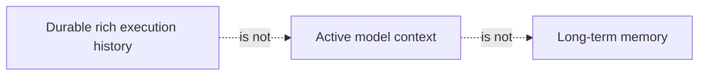
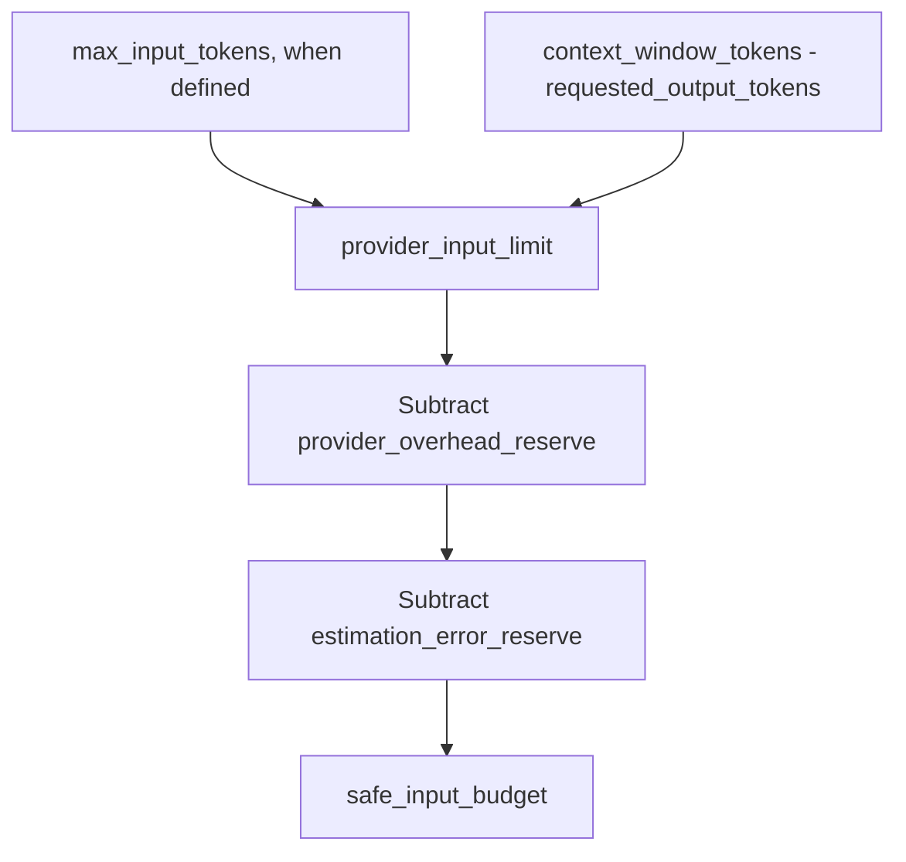
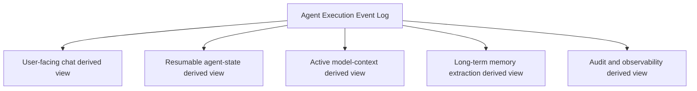
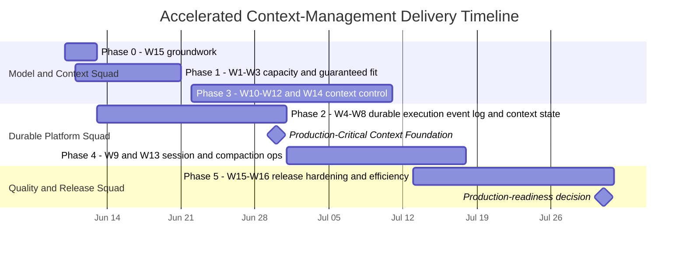
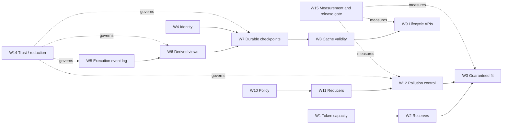

# Nexent Context Management Production Plan

- **Status:** Proposed
- **Date:** 2026-06-10
- **Scope:** Context management only
- **Target:** Production-ready, multi-tenant, multi-worker agent context platform

## 0. Nexent Versus Other Agentic Platforms

This comparison evaluates Nexent's current implementation as of June 10, 2026. It focuses only on context management, agent state, and memory. Because these products have different scopes, the tables compare the strongest capability Nexent should learn from rather than attempting a generic feature checklist.

### 0.1 Executive Scorecard

| Capability | Nexent current status | Gap versus leading platforms | Value of closing the gap | Actions |
| --- | --- | --- | --- | --- |
| Context compression and budgeting | Incremental summaries, summary caches, fallback truncation, context components, and debugger traces already exist. | Token-capacity semantics are incorrect, final fit is not guaranteed, and large components or tool outputs are not reduced progressively. | Prevents context-length failures while improving answer quality, latency, and token cost during long runs. | [W1](#w1)-[W3](#w3), [W10](#w10)-[W13](#w13), and [W16](#w16). |
| Durable session and execution state | User prompts, final answers, and some visible progress are persisted, while summary state remains process-local. | Unlike Codex, LangGraph, and the OpenAI Agents SDK, Nexent cannot reliably reconstruct, resume, replay, fork, or recover complete agent execution. | Enables dependable long-running agents, multi-worker failover, debugging, audit, and user-controlled session recovery. | [W5](#w5)-[W9](#w9). |
| Long-term memory | Mem0 is integrated across four authorization scopes and provides a useful retrieval foundation. | Memory lacks a platform-level policy engine, temporal validity, conflict resolution, evidence links, and measurable lifecycle governance. | Produces more trustworthy personalization and prevents stale or contradictory memories from influencing decisions. | [W14](#w14)-[W15](#w15), plus introduce a Memory Policy Engine and temporal-memory metadata. |
| Authoritative Working Memory | No first-class structured layer currently represents the agent's active goals, decisions, constraints, and task state. | Unlike Letta and LangGraph, important working state is buried in transcripts or transient runtime objects. | Gives agents a compact, editable, recoverable source of truth without repeatedly replaying full history. | Implement Working Memory as a typed derived view from the execution event log under [W5](#w5)-[W7](#w7) and expose it through [W9](#w9). |
| Context and memory governance | Authorization scopes and feature switches exist. | Trust labels, provenance, redaction, retention, deletion propagation, and decision traces are incomplete. | Reduces privacy and security risk and makes persisted context suitable for enterprise production use. | [W4](#w4), [W8](#w8), and [W14](#w14)-[W15](#w15). |
| Platform productization | Nexent already combines zero-code configuration, multi-tenancy, tools, skills, knowledge, memory, and orchestration. | Stronger state and context primitives are not yet exposed as a coherent operator and developer control plane. | Converts Nexent's broad integration advantage into a differentiated, production-grade agent platform. | Deliver the complete [W1](#w1)-[W16](#w16) roadmap while preserving existing platform workflows. |

**Bottom line:** Nexent already has broader platform integration than most specialized competitors, but it trails the leading systems in durable execution state, authoritative Working Memory, lifecycle controls, and memory governance.

### 0.2 Coding-Agent Products

| Compared with | Nexent current status | Gap between Nexent and platform | Value of closing the gap | Actions to take |
| --- | --- | --- | --- | --- |
| [Claude Code](https://docs.anthropic.com/en/docs/claude-code/sub-agents) | Nexent supports multi-agent execution and context compression, but delegated work still shares too much main-run context and has limited lifecycle control. | Claude Code isolates subagent contexts, returns bounded summaries, exposes compaction hooks, and maintains persistent project guidance. | Prevents delegated work from polluting the parent context and gives users predictable control over long sessions. | Isolate subagent contexts and offload outputs through [W12](#w12); add compaction hooks and inspection through [W9](#w9) and [W13](#w13); govern persistent guidance through [W10](#w10) and [W14](#w14). |
| [Codex](https://developers.openai.com/codex/learn/best-practices) | Nexent persists chat-facing records but lacks a complete durable execution history and first-class resume, fork, rollback, and context-status controls. | Codex treats session history and lifecycle operations as core product capabilities and uses progressive disclosure to control context growth. | Enables reliable continuation, experimentation from earlier states, transparent context control, and efficient long-running work. | Build the execution event log, derived views, checkpoints, and lifecycle APIs through [W5](#w5)-[W9](#w9); add progressive loading and output control through [W10](#w10)-[W12](#w12). |
| [OpenCode](https://opencode.ai/docs/config/) | Nexent has automatic compression and fallback truncation, but operational controls are fragmented and large outputs can dominate context. | OpenCode exposes straightforward controls for reserved capacity, tool-output pruning, session export, and extension hooks. | Makes context behavior easier to operate, debug, customize, and keep within budget. | Add capacity reserves through [W2](#w2); output pruning and artifact offloading through [W12](#w12); session export through [W9](#w9); define a small extension-hook API around [W10](#w10) and [W13](#w13). |

### 0.3 State, Memory, and Agent Frameworks

| Compared with | Nexent current status | Gap between Nexent and platform | Value of closing the gap | Actions to take |
| --- | --- | --- | --- | --- |
| [LangGraph](https://docs.langchain.com/oss/python/langgraph/persistence) | Nexent's summaries and caches primarily live in process and are not sufficient to reconstruct each execution step. | LangGraph provides typed per-step checkpoints, versioned threads, replay, time travel, and fault recovery. | Enables multi-worker recovery, deterministic debugging, and resuming from a known-good execution state. | Implement typed execution events and durable checkpoints through [W5](#w5), [W7](#w7), and [W8](#w8); expose replay and restore through [W9](#w9). |
| [OpenAI Agents SDK](https://openai.github.io/openai-agents-python/sessions/) | Nexent stores chat records and some visible progress, but lacks one canonical session protocol for all run items. | The Agents SDK models tools, handoffs, approvals, and run events as rich session items with pluggable storage. | Simplifies integrations and preserves enough structured evidence for reliable resume, audit, and alternative derived views. | Define canonical run-item schemas and pluggable event-log storage through [W5](#w5)-[W7](#w7); expose a minimal session interface through [W9](#w9). |
| [Letta](https://docs.letta.com/guides/core-concepts/stateful-agents/) | Nexent has long-term memory but no authoritative, editable Working Memory representation for active task state. | Letta provides explicit in-context memory blocks, archival memory, shared blocks, and context visualization. | Keeps goals, constraints, decisions, and task progress compact, inspectable, and recoverable across runs. | Create typed Working Memory derived views through [W5](#w5)-[W7](#w7); add inspect/edit APIs through [W9](#w9); enforce shared-state authorization through [W4](#w4) and [W14](#w14). |
| [Zep / Graphiti](https://help.getzep.com/graphiti/getting-started/overview) | Nexent retrieves scoped long-term memories but does not formally model when facts are valid, superseded, conflicting, or evidence-backed. | Zep/Graphiti maintains temporal facts, relationships, validity intervals, and supersession. | Prevents stale facts from silently overriding newer evidence and improves explainability of memory-driven behavior. | Extend [W14](#w14) with temporal metadata, evidence links, conflict detection, and supersession rules; evaluate a graph backend only after these contracts are stable. |
| [Mem0](https://docs.mem0.ai/) | Mem0 is already integrated as Nexent's long-term-memory provider across four scopes. | Nexent lacks a provider-independent policy layer governing extraction, retrieval, update, conflict handling, retention, and quality. | Preserves the existing investment while making memory behavior trustworthy, measurable, and replaceable. | Keep Mem0 as a provider; add a Memory Policy Engine fed by [W5](#w5)-[W6](#w6), governed by [W14](#w14), and measured through [W15](#w15). |
| [LlamaIndex](https://developers.llamaindex.ai/python/framework/module_guides/deploying/agents/memory/) | Nexent has useful context and memory components, but their storage, retrieval, derived-view generation, and policy responsibilities are tightly coupled. | LlamaIndex offers composable memory, storage, retrieval, and summary primitives. | Makes context algorithms easier to test, replace, and evolve without weakening platform-wide governance. | Define stable store, retriever, derived-view generator, reducer, and policy interfaces while implementing [W6](#w6), [W10](#w10), and [W11](#w11). |
| [ClawVM](https://doi.org/10.1145/3805621.3807648) | Nexent already has budgeting, summaries, artifacts, memory, and lifecycle concepts, but they operate mainly as best-effort mechanisms. | ClawVM makes context residency and durability enforceable through typed pages, minimum-fidelity invariants, multi-resolution representations, lifecycle-complete validated writeback, and observable context faults. | Prevents critical state from silently disappearing during compaction, reset, eviction, or failed recall, while making failures replayable and diagnosable. | Apply its enforcement contract across [W3](#w3), [W5](#w5)-[W6](#w6), [W9](#w9)-[W12](#w12), [W14](#w14), and [W15](#w15); retain Nexent's existing stores and Mem0 behind adapters. |

### 0.4 Strategic Position

Nexent should position itself as a production-grade **Context and Memory Control Plane**: combining LangGraph-like durability, Letta-like stateful memory, Zep-like temporal governance, and coding-agent-style context controls while preserving Nexent's zero-code, multi-tenant product platform.

## 1. Executive Summary and Big-Picture Outcome

Nexent already has a capable context compression engine: incremental summaries, summary caches, fallback truncation, context components, layered long-term memory, benchmarks, and debugger traces. The remaining work is primarily about making context state correct, durable, isolated, controllable, and measurable.

This plan contains 16 workstreams:

- The original 14 production-readiness improvements.
- A corrected model token-capacity design, expanding the original context-fit blocker.
- A durable structured agent execution event log, expanding the original session persistence and lifecycle gaps.

The two new findings are not independent cosmetic additions. They are foundational changes that affect most of the original improvements.

### 1.1 Required Action Summary

The modules below are intended as assignable ownership boundaries. Cross-module dependencies remain explicit in chapter 3.

| Module | Workstreams | Suggested primary owners | Primary responsibility |
| --- | --- | --- | --- |
| Model Capacity and Request Safety | W1-W3 | Model integration and agent-runtime engineers | Capacity contracts, token budgeting, and guaranteed request fit. |
| Durable Session State and Lifecycle | W4-W9 | Backend platform, data, and distributed-systems engineers | Identity isolation, execution event log, checkpoints, replay, and session operations. |
| Context Shaping and Compaction | W10-W13 | Agent-runtime and context-algorithm engineers | Context policy, reduction, artifact offloading, and compaction reliability. |
| Governance and Privacy | W14 | Security, privacy, and platform-governance engineers | Provenance, trust boundaries, redaction, retention, and deletion. |
| Quality and Efficiency | W15-W16 | Quality infrastructure and performance engineers | Context SLOs, release gates, observability, and prompt-cache efficiency. |

The table is grouped by assignable engineering module. Modules and workstreams are ordered by dependency and recommended execution priority; severity remains explicit for release planning.

| Module | Severity | ID | Required improvement | Current problem | Proposed action | Primary benefit |
| --- | --- | --: | --- | --- | --- | --- |
| Model Capacity and Request Safety | Blocker | [W1](#w1) | Correct model token-capacity configuration | `max_tokens` has conflicting meanings and is incorrectly reused as the context threshold. | Separate total context, hard input, output cap, output reserve, and tokenizer fields; derive a safe input budget. | Correct compression triggers and provider-safe requests. |
| Model Capacity and Request Safety | High | [W2](#w2) | Output and safety capacity reserve | Context construction can consume all model capacity. | Reserve output, provider overhead, reasoning, and estimation-error capacity. | Protects answer quality and reduces overflow risk. |
| Model Capacity and Request Safety | Blocker | [W3](#w3) | Guaranteed context fit | Nexent can still call the model after compression leaves context oversized. | Add a mandatory deterministic final-fit pipeline before every model call. | Eliminates preventable context-length failures. |
| Durable Session State and Lifecycle | Blocker | [W4](#w4) | Tenant and user isolation | Context state is keyed only by `conversation_id`. | Qualify all context state by tenant, user, conversation, agent, and branch. | Prevents cross-user or cross-tenant leakage. |
| Durable Session State and Lifecycle | Blocker | [W5](#w5) | Structured agent execution event log | Current persistence is a UI transcript, not replayable agent state. | Persist ordered typed runs, steps, tool calls/results, artifacts, errors, and checkpoints. | Enables reliable resume, audit, fork, and reconstruction. |
| Durable Session State and Lifecycle | Blocker | [W6](#w6) | Separate raw history from active context | Persisting richer progress without purpose-specific derived views would flood model context. | Derive purpose-specific chat, resume, model-context, memory, and audit derived views from the execution event log. | Preserves rich evidence without increasing prompt size. |
| Durable Session State and Lifecycle | Blocker | [W7](#w7) | Durable multi-worker context state | Summary caches disappear on restart and cannot move across workers. | Persist versioned context checkpoints with optimistic concurrency. | Enables horizontal scaling and failover recovery. |
| Durable Session State and Lifecycle | Blocker | [W8](#w8) | Complete cache validation and versioning | Boundary-only fingerprints can reuse stale summaries. | Hash the complete covered prefix and include model, policy, schema, prompt, and branch versions. | Prevents stale or incorrect resumed context. |
| Durable Session State and Lifecycle | High | [W9](#w9) | Full session lifecycle APIs | Nexent lacks first-class compact, checkpoint, restore, fork, reset, and inspect operations. | Add durable lifecycle APIs and compaction hooks over immutable execution-event history. | Makes long-running sessions controllable and recoverable. |
| Context Shaping and Compaction | High | [W10](#w10) | Unified enforceable context and memory policy | Context injection and memory decisions are distributed across inconsistent strategies and paths. | Apply one validated policy engine to context selection, memory writes/retrieval, authority, conflicts, and no-write rules. | Makes context and memory behavior predictable, trustworthy, and configurable. |
| Context Shaping and Compaction | High | [W11](#w11) | Progressive component reduction | Oversized tools, skills, memory, or instructions may be dropped whole. | Add component-specific shorten, rerank, summarize, and minimum-representation reducers. | Retains critical capabilities under pressure. |
| Context Shaping and Compaction | High | [W12](#w12) | Context-pollution and large-output control | Tool results and intermediate steps can dominate the main context. | Offload large outputs to artifacts, retain bounded summaries, and isolate subagent contexts. | Improves long-session reliability and lowers token cost. |
| Context Shaping and Compaction | High | [W13](#w13) | Reliable governed compaction | Compaction uses the active model without dedicated resilience or cost controls. | Add compaction-model policy, deadlines, retries, cancellation, circuit breakers, and deterministic fallback. | Prevents compaction failures from taking down agent runs. |
| Governance and Privacy | Medium | [W14](#w14) | Trust, provenance, redaction, and retention | Rich retrieved and persisted context lacks formal trust and lifecycle policies. | Label sources and trust, redact secrets, enforce retention, and propagate deletion. | Makes rich context safe for production use. |
| Quality and Efficiency | Medium | [W15](#w15) | Context quality and reliability SLOs | Existing benchmarks do not block regressions or releases. | Add CI and production gates for fit, retention, latency, cost, recovery, and isolation. | Turns context quality into an enforceable product contract. |
| Quality and Efficiency | Medium | [W16](#w16) | Prompt-cache-aware assembly | Prompt ordering does not intentionally maximize provider cache reuse. | Stabilize prompt prefixes and track cached-input metrics. | Reduces recurring latency and cost. |

### 1.2 Big-Picture Outcome

After this plan, Nexent will move from an agent runtime with capable in-process compression into a durable context platform:

- **Correct:** Model requests use real capacity semantics and always fit.
- **Safe:** Context is tenant-isolated, provenance-aware, redacted, and governed.
- **Durable:** Rich execution state and summaries survive restart, failover, and worker changes.
- **Efficient:** Models receive bounded derived views, not entire raw histories; large outputs are offloaded and prompt caching is intentional.
- **Controllable:** Operators and users can inspect, compact, restore, fork, and reset context.
- **Measurable:** Retention, fit, latency, cost, recovery, and isolation become release-blocking SLOs.
- **Extensible:** Future context algorithms can be rebuilt from the durable execution event log without losing historical execution evidence.

The most important architectural result is the separation of concerns:

That separation allows Nexent to preserve enough evidence for reliable agent continuation while keeping every model request small, relevant, safe, and provider-correct.

## 2. Improvements Details

### 2.1 Investigation Findings

#### 2.1.1 `max_tokens` Is Incorrectly Used as the Context Window

The finding is confirmed.

Nexent's SDK defines `ModelConfig.max_tokens` as the per-call completion output cap and forwards it to `chat.completions.create`:

- `sdk/nexent/core/agents/agent_model.py:47-55`
- `sdk/nexent/core/models/openai_llm.py:181-184`

However, agent configuration also reads the same database value and assigns it directly to `ContextManagerConfig.token_threshold`:

- `backend/agents/create_agent_info.py:510-516`
- `backend/agents/create_agent_info.py:553-556`

The field is also inconsistently propagated. The main `create_model_config_list` production path constructs SDK `ModelConfig` objects without copying the database `max_tokens` value:

- `backend/agents/create_agent_info.py:262-305`

Provider discovery and tests sometimes populate values resembling total context windows, while the SDK contract calls the value an output cap. Therefore the existing database field has no single reliable semantic meaning and cannot be trusted for either input budgeting or output limiting without migration.

This conflates four different concepts:

1. Total model context window.
2. Maximum provider-supported input tokens.
3. Maximum provider-supported or requested output tokens.
4. Safe runtime input budget after reserving output and safety capacity.

#### Proposed Token-Capacity Model

Add these fields to model configuration:

| Field | Meaning |
| --- | --- |
| `context_window_tokens` | Total model context capacity when the provider uses a combined input/output window. |
| `max_input_tokens` | Optional hard provider input limit when it differs from the combined context window. |
| `max_output_tokens` | Provider-supported or configured completion-output cap. Replaces the ambiguous LLM meaning of `max_tokens`. |
| `default_output_reserve_tokens` | Runtime output capacity reserved before constructing input context. |
| `tokenizer_family` | Token-counting strategy or provider/model tokenizer identifier. |

The runtime must derive, not directly configure, its safe input budget:

`max_input_tokens` is useful, but adding it alone is insufficient. Without `context_window_tokens` and a separate output cap, Nexent still cannot correctly support providers that enforce a combined input/output window or dynamically vary the requested output allowance.

#### Backward Compatibility

- Keep database/API `max_tokens` temporarily as a deprecated alias for `max_output_tokens`.
- Never use legacy `max_tokens` as a context window after migration.
- For records without known context capacity, use a conservative provider/model catalog default and mark the capacity source as `fallback`.
- Surface warnings when a model's capacity is unknown or inferred.

#### 2.1.2 Current Chat Persistence Is Useful but Too Weak for Agent Resume

The existing persistence is not useless. It stores:

- User prompts and assistant final answers in `conversation_message_t`.
- Streamed assistant units such as visible thinking, generated code, execution logs, and search placeholders in `conversation_message_unit_t`.
- Search sources and images in separate tables.

Evidence:

- `backend/services/conversation_management_service.py:42-150`
- `backend/services/conversation_management_service.py:214-230`
- `backend/database/db_models.py:48-88`

However, the next agent run receives only a flat list of `{role, content}`. The frontend explicitly selects the assistant final answer for history, and the SDK reconstructs each assistant turn as a synthetic `ActionStep` containing only that text:

- `frontend/app/[locale]/chat/internal/chatInterface.tsx:463-475`
- `backend/consts/model.py:227-239`
- `backend/agents/create_agent_info.py:885-904`
- `sdk/nexent/core/agents/nexent_agent.py:448-475`

The persisted message units are UI-oriented and lack the structure needed for reliable agent continuation:

- No durable run ID, step ID, parent-child relationship, or branch ID.
- No typed tool-call request/result relationship.
- No context checkpoint or compression-summary version.
- No stable event schema for replay.
- No concurrency/version field for distributed workers.
- No policy for redaction, retention, or large-output offloading.

#### Proposed Persistence Architecture

Use an append-only, typed execution event log as the source of truth. Derive different purpose-specific views from it for different consumers.

Here, a **session** is the user-visible interaction container. The **execution event log** is the durable, ordered record of what happened within that session. A **derived view**, sometimes called a projection in event-sourcing systems, selects and transforms those events for one purpose. For example, the chat view contains user-facing messages, while the model-context view contains only the bounded information needed for the next model call. Derived views are not separate sources of truth and can be rebuilt from the execution event log.

| Term | Meaning in this plan |
| --- | --- |
| Session | The interaction container that groups related runs, branches, and user-visible history. |
| Run | One user-triggered agent execution within a session. |
| Execution event log | The append-only ordered record of actions, tool calls, results, errors, and answers produced during runs. |
| Derived view | A rebuildable, purpose-specific selection and transformation of execution events. |
| Checkpoint | A versioned recovery snapshot tied to a known execution-event boundary. |
| Artifact | A large output, file, log, or binary stored outside the active model context. |
| Working Memory | Structured current goals, constraints, decisions, and task state used by the agent. |

Recommended durable entities:

| Entity | Purpose |
| --- | --- |
| `agent_session` | Tenant/user/conversation/agent identity, branch, status, versions. |
| `agent_run` | One user-triggered run, model/config snapshots, start/end state. |
| `agent_event` | Ordered typed events: user input, model action, tool call, tool result, error, final answer, cancellation. |
| `agent_artifact` | Large tool outputs, files, logs, and binary references stored outside prompt context. |
| `context_checkpoint` | Versioned summary, compressed boundaries, policy/model/schema versions, and token accounting. |

#### What to Persist

Persist by default:

- User messages and assistant final answers.
- Visible model actions required to interpret tool calls.
- Structured tool-call name, sanitized arguments, status, and result reference.
- Tool-result summaries plus artifact pointers for large raw results.
- Errors, retries, cancellation, and max-step termination.
- Citations, attachments, token usage, latency, and cost.
- Context checkpoints and compact progress/decision summaries.

Do not persist by default:

- Hidden/private chain-of-thought or provider reasoning traces.
- Secrets, credentials, raw authorization headers, or unredacted sensitive tool parameters.
- Unlimited raw tool output inline in the relational event table.

Visible reasoning content can remain available for UI replay when product policy allows it, but it should not be required for agent resume. Resume should depend on structured actions, observations, decisions, and checkpoints.

#### Required Memory-Control Capabilities

Production-grade memory requires the following control capabilities. They are implemented within W5-W15 rather than managed as a separate workstream:

| Required capability | Required behavior | Parent W-IDs |
| --- | --- | --- |
| Authoritative Working Memory | Maintain a typed derived view of current goals, explicit constraints, confirmed decisions, unresolved items, active entities, and tool state. It must be rebuildable from execution events and survive restart or fork. | [W5](#w5)-[W9](#w9), [W11](#w11) |
| Unified Memory Policy Engine | Route every automatic and tool-driven memory write, retrieval, update, expiry, and deletion through one versioned policy contract. | [W10](#w10), [W14](#w14) |
| Deterministic authority and conflict resolution | Resolve conflicts in code before prompt assembly. System and tenant policy outrank user instructions; explicit current-user corrections outrank Working Memory and long-term memory; relevance never implies trust. | [W10](#w10), [W14](#w14) |
| Correct prompt authority order | Keep retrieved long-term memory attributed and non-authoritative. Inject it below authoritative instructions, current-task constraints, and confirmed Working Memory. | [W3](#w3), [W10](#w10), [W14](#w14) |
| Rich memory candidate extraction | Generate memory candidates from sanitized execution events, verified tool facts, decisions, and corrections instead of only the user prompt and final answer. | [W5](#w5)-[W6](#w6), [W14](#w14) |
| Temporal memory lifecycle | Track source evidence, confidence, confirmation time, validity interval, status, and supersession. Exclude stale, rejected, deleted, or superseded memories before injection. | [W8](#w8), [W14](#w14) |
| Global retrieval resolution | Merge results across scopes, then globally rerank, deduplicate, lifecycle-filter, and detect contradictions before prompt injection. | [W10](#w10)-[W11](#w11), [W14](#w14) |
| Explainable memory decisions | Record why a memory was stored, rejected, retrieved, excluded, superseded, reduced, or injected, without exposing hidden chain-of-thought. | [W5](#w5)-[W6](#w6), [W15](#w15) |
| Confirmation and no-write controls | Require confirmation for sensitive, tenant-shared, high-impact, or low-confidence writes; support ephemeral and explicit no-write classifications. | [W10](#w10), [W14](#w14) |

Working Memory must not become an independent source of truth that can drift from execution history. The durable execution event log and checkpoints remain authoritative; Redis may be used as an optional hot cache, while object storage is reserved for large artifacts or snapshots.

#### ClawVM Adoption Assessment

ClawVM's central insight is that context management should be an enforceable harness-level contract, not a collection of model-driven summarization and retrieval heuristics. Its virtual-memory terminology is optional; the production mechanisms are directly useful for Nexent.

| Paper contribution | Assessment for Nexent | Adoption in this plan |
| --- | --- | --- |
| Typed pages with stable identity, scope, provenance, and minimum fidelity | Adopt. This gives context policy a deterministic unit of selection, reduction, restoration, and audit. Use the product-neutral term `ContextItem` rather than exposing OS terminology in public APIs. | [W5](#w5), [W6](#w6), [W10](#w10), [W11](#w11), [W14](#w14) |
| Full, compressed, structured, and pointer representations | Adopt. Precomputing lower-fidelity forms prevents emergency compaction from depending on another LLM call and enables graceful degradation. Generation cost and staleness must be measured. | [W3](#w3), [W6](#w6), [W11](#w11), [W12](#w12) |
| Two-phase selection: install required minima, then spend remaining budget on upgrades | Adopt. This cleanly separates structural safety from quality optimization. Start with deterministic priority/recency/recompute-cost scoring; do not block launch on an optimal knapsack solver. | [W3](#w3), [W10](#w10), [W11](#w11), [W15](#w15) |
| Lifecycle-complete, validated, non-destructive writeback | Adopt as a blocker-level persistence contract. Dirty state must be staged, validated, and committed before compaction, reset, fork, eviction, shutdown, or ownership transfer can destroy the only copy. | [W5](#w5), [W7](#w7), [W8](#w8), [W9](#w9), [W14](#w14) |
| Observable context-fault model and deterministic replay | Adopt. Explicit fault classes and reason codes make context failures testable and operationally actionable. Add replay-oracle comparison later for policy tuning. | [W5](#w5), [W9](#w9), [W15](#w15) |
| Claimed zero policy-controllable faults | Treat as evidence for the architecture, not as a transferable guarantee. The paper primarily evaluates deterministic replay and structural faults; semantic correctness, live cross-session behavior, and end-user quality remain open. | Require Nexent-specific live, replay, semantic-quality, and multi-tenant evidence under [W15](#w15). |

### 2.2 Target Architecture

The Control Plane is intentionally shown as one architectural component; its internal policy, authority, budgeting, retrieval, reduction, and derived-view responsibilities are specified in W5-W15. The diagram emphasizes three closed loops: runtime execution, durable context/memory state, and human-reviewed governance improvement.

Core invariants:

1. No model request exceeds its calculated safe input budget.
2. Context state is isolated by tenant, user, conversation, agent, and branch.
3. A worker restart or routing change does not lose resumable context.
4. Raw durable history is separate from the bounded context sent to a model.
5. Every dropped, summarized, or offloaded context item is observable.
6. Context checkpoints are invalidated when their covered data or policy changes.
7. Working Memory is a rebuildable, versioned derived view rather than an independent source of truth.
8. Retrieved memory never becomes authoritative solely because it is relevant or injected as a system message.
9. Memory writes, conflicts, lifecycle changes, exclusions, and prompt-injection decisions are explainable.
10. Every model/tool outcome returns to the execution event log before it can affect future context.
11. Evaluation can recommend policy changes, but authority and privacy policy changes require review.
12. Every mandatory context item declares a minimum representation that must survive compaction and reset.
13. Dirty context state is durably committed before any lifecycle action can destroy its only copy.
14. Writeback is schema-validated, scoped, provenance-linked, and non-destructive by default.
15. Recall, reduction, eviction, restoration, and writeback outcomes expose stable reason codes.

### 2.3 Development Workstreams

#### 2.3.1 Model Capacity and Request Safety

##### W1. Introduce Correct Model Token-Capacity Configuration

**Problem:** `max_tokens` is simultaneously used as output cap and context threshold.

**Solution:**

- Add the fields defined in section 2.1 to database models, APIs, provider discovery, frontend forms, SDK `ModelConfig`, and monitoring.
- Rename internal LLM `max_tokens` to `max_output_tokens`.
- Add `ModelCapacityResolver` with source metadata: `provider`, `operator`, `catalog`, or `fallback`.
- Derive `safe_input_budget` per request.
- Validate impossible configurations, such as output reserve greater than the total context window.

**Proof and benefit:** Correct capacity modeling is required for reliable compression triggers, provider portability, and output-quality guarantees.

**Acceptance criteria:**

- Tests cover combined-window and separate-input-limit providers.
- Monitoring reports total window, output reserve, safe input budget, actual input usage, and capacity source.

##### W2. Reserve Output and Safety Capacity

**Problem:** Context threshold can equal the model maximum and does not reserve space for output, reasoning, framing overhead, or estimation error.

**Solution:**

- Use the capacity formula in section 2.1.
- Support per-agent and per-request output reserve overrides.
- Define provider overhead and estimation-error margins.
- Trigger compaction before the hard boundary using a configurable soft limit.

**Proof and benefit:** Reduces overflow risk and avoids starving the model's answer generation.

**Acceptance criteria:**

- Every request reports and honors its reserved capacities.
- Long-answer tasks retain the configured output allowance.

##### W3. Guarantee Context Fit Before Every Model Call

**Problem:** After compression Nexent only warns if the result still exceeds the threshold at `sdk/nexent/core/agents/agent_context.py:628-633`.

**Solution:**

- Add a `ContextFitPipeline` before every main and compaction model call.
- Apply deterministic stages until the request fits:
  1. Remove expired/non-required components.
  2. Replace large tool outputs with summaries and artifact pointers.
  3. Progressively reduce optional components.
  4. Compact older history.
  5. Reduce recent observations while preserving complete tool pairs.
  6. Apply final emergency truncation with an explicit context-loss event.
- Refuse or safely degrade if mandatory context alone exceeds capacity.
- Assemble in two phases: first install every mandatory item's minimum representation, then use remaining capacity to upgrade selected items to higher-fidelity representations.
- Retry once on provider context-length errors using provider-reported evidence.

**Proof and benefit:** Prevents avoidable provider failures and turns context fit from a best-effort warning into a runtime contract.

**Acceptance criteria:**

- Property tests generate arbitrary context combinations and verify serialized requests remain within budget.
- Provider overflow tests verify deterministic recovery without loops.

#### 2.3.2 Durable Session State and Lifecycle

##### W4. Fix Tenant and User Isolation

**Problem:** Conversation-level context managers are keyed only by `conversation_id` in `backend/agents/agent_run_manager.py:78-93`.

**Solution:**

- Introduce `ContextIdentity(tenant_id, user_id, conversation_id, agent_id, branch_id)`.
- Use the identity for in-memory caches, durable checkpoints, locks, and metrics.
- Require identity authorization before checkpoint read/write.
- Remove all APIs that accept a bare conversation ID for context-state mutation.

**Proof and benefit:** The run registry already uses a user-qualified key while the context registry does not. Aligning them prevents cross-user state leakage and makes multi-tenant deployment defensible.

**Acceptance criteria:**

- Collision tests prove identical conversation IDs across tenants/users never share summaries or components.
- Security tests reject unauthorized checkpoint access.

##### W5. Build the Structured Agent Execution Event Log

**Problem:** Existing persistence is a user-facing transcript, not a replayable agent-state model. Advanced context management cannot reliably reconstruct tool progress, failures, or checkpoint boundaries from it.

**Solution:**

- Implement the entities and derived views described in section 2.2.
- Give every event `tenant_id`, `user_id`, `session_id`, `run_id`, `branch_id`, `event_seq`, `event_type`, `step_id`, `parent_event_id`, timestamps, and schema version.
- Persist tool calls and results as typed events with redacted payloads.
- Persist typed Working Memory update, memory-candidate, memory-write-decision, and conflict-resolution events.
- Persist context-item creation, representation change, recall, eviction, restoration, writeback staging, validation, commit, rejection, and lifecycle-boundary events with stable reason codes.
- Persist context checkpoints against execution event sequences.
- Build a compatibility adapter that continues populating the existing conversation tables/UI during migration.
- Make the backend, not the frontend, authoritative for reconstructing history.

**Proof and benefit:** Enables reliable resume, fork, audit, compaction, debugging, evaluation, and memory extraction without sending all raw events to the model.

**Acceptance criteria:**

- A run can be reconstructed from execution events after restart.
- UI transcript, active context, and long-term memory derived views can differ without losing the source events.
- Hidden chain-of-thought is not required or persisted by default.

##### W6. Separate Raw History from the Active-Context Derived View

**Problem:** Persisting more progress is valuable, but blindly injecting all stored events would worsen context pollution and cost.

**Solution:**

- Create a `HistoryProjector` that selects and transforms execution events for a target purpose:
  - `chat_projection`: user and final-answer focused.
  - `resume_projection`: unresolved tasks, actions, tool state, and decisions.
  - `model_context_projection`: budgeted summaries plus recent complete steps.
  - `memory_projection`: stable facts/preferences only.
  - `working_memory_projection`: current goals, explicit constraints, confirmed decisions, unresolved items, active entities, and tool state.
  - `memory_candidate_projection`: sanitized stable facts, corrections, and verified tool-derived evidence eligible for long-term memory policy.
  - `audit_projection`: complete authorized event record.
- Make derived-view policy versioned and observable.
- Preserve raw events independently of summaries so improved projectors can be applied later.
- Project execution state into stable `ContextItem` records with type, identity, scope, provenance, authority, dirty state, recompute cost, and minimum-fidelity requirements.

**Proof and benefit:** This is the key architectural separation used by mature agent systems: durable transcripts can remain rich while each model call sees only the bounded, relevant derived view.

**Acceptance criteria:**

- Increasing execution-event detail does not increase active prompt size unless selected by policy.

##### W7. Persist Context State for Multi-Worker Operation

**Problem:** Summary caches and context managers live only in a process-local dictionary. Restart, failover, and load-balancer routing discard state.

**Solution:**

- Persist `context_checkpoint` records containing summary text, covered event sequence, fingerprints, token counts, and policy/model/schema versions.
- Persist Working Memory version, source event sequence, and policy version with each checkpoint.
- Use optimistic concurrency with `checkpoint_version` and compare-and-swap.
- Optionally cache checkpoints in Redis, while the database remains durable.
- Add TTL/archival policies for inactive checkpoints.

**Proof and benefit:** Durable checkpoints enable horizontal scaling, restart recovery, deterministic resume, and cheaper incremental compression.

**Acceptance criteria:**

- A session resumes with the same effective context after worker restart.
- Concurrent runs cannot silently overwrite newer checkpoints.

##### W8. Make Cache Validation Complete and Versioned

**Problem:** Summary cache validity uses only a short boundary fingerprint at `sdk/nexent/core/agents/agent_context.py:286-313`.

**Solution:**

- Hash the complete covered event prefix using canonical serialization.
- Include context policy version, summary prompt/schema version, agent version, model ID, tokenizer version, and branch ID in checkpoint validity.
- Invalidate Working Memory and memory-retrieval derived views when source events, lifecycle state, authority rules, or memory-policy versions change.
- Store the covered start/end event sequence.
- Invalidate checkpoints after history edits or redactions.

**Proof and benefit:** Prevents stale summaries after edits, model switches, prompt changes, or branch operations.

**Acceptance criteria:**

- Mutation tests prove any covered event or policy change invalidates the cache.

##### W9. Add Full Session Lifecycle APIs

**Problem:** Nexent lacks first-class compact, checkpoint, restore, fork, branch, reset, and context-inspection operations.

**Solution:**

- Add APIs and SDK methods: `compact`, `checkpoint`, `restore`, `fork`, `reset_context`, and `inspect_context`.
- Keep raw execution events immutable; branch by referencing a parent event sequence.
- Support manual focused compaction instructions.
- Add lifecycle events and hooks around compaction and restore.
- Add authorized inspect, restore, fork, and edit operations for Working Memory and memory decisions.

**Proof and benefit:** Codex documents persisted transcripts, resume/fork, manual `/compact`, configurable auto-compaction, and pre/post-compaction hooks. Claude Code exposes compaction hooks and separate context windows for subagents. These controls make long-running sessions understandable and recoverable.

**Acceptance criteria:**

- Forked sessions diverge without modifying the parent.
- Restore reproduces the checkpoint's active-context derived view.

#### 2.3.3 Context Shaping and Compaction

##### W10. Enforce One Context and Memory Policy Across All Strategies

**Problem:** Injection flags exist in `summary_config.py` but are not applied by runtime selection. Some strategies ignore total or per-component budgets.

**Solution:**

- Add a validated `ContextPolicy` with a `MemoryPolicy` domain covering write destination, retrieval, authority, confirmation, expiry, privacy, and no-write rules.
- Apply injection flags before selection.
- Require every strategy to honor mandatory components, total budget, per-component budget, trust policy, and degradation rules.
- Make context selection deterministic: install all minimum-required representations first, then spend remaining budget on higher-fidelity upgrades using policy-defined utility per token.
- Route automatic and tool-driven memory operations through the same policy.
- Enforce deterministic authority tiers before prompt assembly:
  1. System security and platform policy.
  2. Authorized tenant policy.
  3. Explicit current-user instruction and correction.
  4. Confirmed Working Memory for the active task.
  5. Recent verified events and tool results.
  6. Valid retrieved long-term memory.
  7. Compressed summaries.
  8. Unverified agent inference.
- Merge retrieval results across scopes, then globally rerank, deduplicate, lifecycle-filter, and resolve conflicts before injection.
- Reject invalid policy at configuration time.

**Proof and benefit:** Removes configuration that appears functional but is not, and makes context behavior predictable across strategies.

**Acceptance criteria:**

- Matrix tests cover every strategy, flag, budget, authority, confirmation, conflict, and no-write combination.

##### W11. Add Progressive Component Reduction

**Problem:** Oversized context components are dropped whole by `TokenBudgetStrategy` in `agent_model.py:443-486`.

**Solution:**

- Define reducers per component type:
  - Tools: keep names and minimal schemas, load details on demand.
  - Skills: shorten descriptions, retain likely matches, load full skill later.
  - Memory/knowledge: rerank, deduplicate, summarize, and cap result count.
  - Working Memory: always retain a mandatory minimum representation of active goals, explicit constraints, confirmed decisions, and unresolved work.
  - Agents: keep routing metadata, load full cards only when selected.
  - System instructions: mark mandatory sections as non-droppable.
- Generate and cache admissible representations when an item is created or materially updated: full, compressed, structured, and resolvable pointer where applicable.
- Refuse a representation downgrade when it would violate the item's minimum-fidelity invariant.
- Emit reduction decisions and lost-content metadata.

**Proof and benefit:** Preserves essential capabilities under pressure instead of silently removing an entire tool, skill, or instruction section.

**Acceptance criteria:**

- Oversized component tests retain mandatory minimum representations.

##### W12. Control Context Pollution and Large Tool Outputs

**Problem:** Large tool outputs and intermediate ReAct steps can dominate context. Observation truncation exists but defaults to disabled.

**Solution:**

- Store large outputs in `agent_artifact`.
- Keep a bounded summary, metadata, and retrievable artifact pointer in context.
- Require artifact pointers to resolve deterministically and record a typed fault when resolution, authorization, or backend access fails.
- Enable safe observation limits by default.
- Preserve complete tool-call/result pairs.
- Run exploratory or high-volume delegated work in isolated subagent contexts.

**Proof and benefit:** Claude Code and Codex recommend isolated subagents so search results, logs, and file content do not pollute the main context. OpenCode supports old-tool-output pruning and a reserved compaction buffer.

**Acceptance criteria:**

- Multi-megabyte tool results do not materially expand active prompt context.
- Agents can retrieve offloaded details when needed.

##### W13. Make Compaction Execution Reliable and Governed

**Problem:** Compression synchronously uses the active model without a dedicated timeout, model policy, cost limit, or circuit breaker.

**Solution:**

- Configure a separate compaction model and fallback model.
- Add timeout, cancellation, bounded provider-aware retries, rate-limit policy, cost ceiling, and circuit breaker.
- Detect no-progress compaction and prevent infinite retry loops.
- Make hard truncation deterministic when semantic compaction is unavailable.

**Proof and benefit:** Keeps the main agent available during compaction-provider degradation and prevents uncontrolled latency or spend.

**Acceptance criteria:**

- Fault-injection tests cover timeout, rate limit, malformed summary, provider outage, and no-progress compaction.

#### 2.3.4 Governance and Privacy

##### W14. Add Trust, Provenance, Redaction, and Retention Policies

**Problem:** Retrieved memories and knowledge are injected as system messages without a formal trust boundary. Richer execution persistence also increases privacy and security risk.

**Solution:**

- Add source, trust level, owner, timestamp, permissions, and expiry metadata to every context component and execution event.
- Keep untrusted retrieved content below authoritative instructions.
- Require long-term memories to expose source event IDs, source type, confidence, created/confirmed time, validity interval, lifecycle status, supersession link, and approving policy version.
- Require confirmation for sensitive, tenant-shared, high-impact, or low-confidence writes; support explicit ephemeral and no-write classifications.
- Filter stale, superseded, rejected, and deleted memories before retrieval injection.
- Redact secrets and sensitive tool parameters before persistence.
- Configure retention by event/artifact type and tenant policy.
- Add deletion propagation across the execution event log, checkpoints, artifacts, and memories.
- Route lifecycle writeback through a journal: stage typed append/merge/set-with-version operations, validate schema/provenance/scope/policy/non-destructiveness, then commit with deterministic merge and reason-coded rejection.

**Proof and benefit:** Rich context is only production-safe when its origin and lifecycle are controlled. Codex memory documentation explicitly describes secret redaction, per-thread controls, and excluding external-context sessions from memory generation.

**Acceptance criteria:**

- Secret fixtures never appear in persisted events, summaries, or memory.
- User deletion removes all derived context state.

#### 2.3.5 Quality and Efficiency

##### W15. Enforce Context Quality and Reliability SLOs

**Problem:** Nexent has benchmarks and tracing, but no release-blocking SLOs.

**Solution:**

- Define release gates for:
  - Context-fit success rate.
  - Summary retention accuracy by category.
  - Tool-call/result retention.
  - Compression ratio, latency, and cost.
  - Restart and multi-worker recovery.
  - Tenant isolation.
  - Multilingual and multimodal behavior.
  - Prompt-cache reuse.
  - Memory-write precision and confirmation compliance.
  - Memory retrieval recall and global reranking quality.
  - Stale-memory rejection, correction propagation, conflict resolution, and deletion propagation.
  - Working Memory retention across compression, restart, restore, and fork.
  - Decision-trace completeness for memory and context assembly.
  - Minimum-fidelity invariant violations.
  - Post-compaction/bootstrap restoration failures.
  - Dirty-state flush misses across compaction, reset, fork, shutdown, eviction, and worker handoff.
  - Recall outcomes separated into no-match, denied, backend-error, and pointer-resolution failure.
  - Duplicate equivalent tool calls, avoidable refetches, and context-thrash rate.
- Run existing LongMemEval/EventQA/manual suites in CI with fixed baselines.
- Add production dashboards and alerts.
- Add an authorized decision trace showing candidate memories, write decisions, retrieval selection, exclusions, conflicts, reductions, and final context assembly reasons.
- Add deterministic trace replay and an optional offline oracle that estimates whether observed faults were policy-controllable or unavoidable because mandatory minimum representations could not fit.

**Proof and benefit:** Converts context quality from anecdotal behavior into a maintained product contract.

**Acceptance criteria:**

- Releases fail when agreed context SLOs regress.

##### W16. Make Prompt Assembly Cache-Aware

**Problem:** Nexent does not intentionally optimize stable prompt prefixes or track cached-input usage.

**Solution:**

- Order stable system instructions and tool schemas before dynamic context.
- Use deterministic serialization and component ordering.
- Track provider cached-input tokens and prefix-change causes.
- Avoid changing timestamps or user-specific dynamic text inside stable prefixes when unnecessary.

**Proof and benefit:** Improves latency and cost on providers supporting prompt caching while making prompt changes easier to diagnose.

**Acceptance criteria:**

- Cache-enabled providers show measurable cached-input reuse on repeated turns.

## 3. Suggested Implementation Plan

### 3.1 Phased Delivery Plan

Phases are time-boxed delivery bundles; W-IDs are the stable, assignable workstreams defined in chapters 1 and 2. A phase groups workstreams that should be integrated and demonstrated together. A workstream can span phases when early design or measurement work is required before its final implementation; W15 is the only intentionally split workstream in this plan.

| Phase | Schedule | Included W-IDs | Mapping rationale and phase outcome |
| --- | --- | --- | --- |
| Phase 0: Baseline and Design Freeze | June 10-12 | [W15](#w15) groundwork | Establishes measurements, SLO targets, and architecture contracts needed to prove every later phase. W15 is started here and completed in Phase 5. |
| Phase 1: Correct Capacity and Guarantee Fit | June 11-20 | [W1](#w1), [W2](#w2), [W3](#w3) | Fixes model-capacity semantics, reserves output space, and guarantees every model request fits. |
| Phase 2: Durable Event Log and Context State | June 13-30 | [W4](#w4), [W5](#w5), [W6](#w6), [W7](#w7), [W8](#w8) | Builds the isolated, replayable, durable state foundation required for multi-worker production operation. |
| Phase 3: Policy, Reduction, and Pollution Control | June 22-July 10 | [W10](#w10), [W11](#w11), [W12](#w12), [W14](#w14) | Improves the quality and safety of the context selected from the durable foundation. W12 also hardens W3 by controlling oversized outputs before final fit. |
| Phase 4: Session Product and Compaction Operations | July 1-17 | [W9](#w9), [W13](#w13) | Productizes the durable state and compaction foundation as controllable session lifecycle operations. |
| Phase 5: Efficiency and Release Hardening | July 13-31 | [W15](#w15) completion, [W16](#w16) | Completes release gates and observability, then optimizes stable-prefix prompt-cache efficiency. |

The June 30 milestone covers the completed outputs of Phases 1 and 2, meaning W1-W8. Phases 3-5 overlap intentionally and complete the remaining W9-W16 workstreams by July 31.

#### Phase 0: Baseline and Design Freeze

**Schedule:** June 10-12 **Workstreams:** W15 groundwork

Deliver:

- Record current overflow rate, compression retention, latency, and cost.
- Add architecture decision records for token semantics and execution event log.
- Define event schemas, capacity formulas, and production SLO targets.
- Freeze ambiguous new uses of `max_tokens`.

Exit gate:

- Baselines and schema designs approved.
- Existing context test suite remains green.

#### Phase 1: Correct Capacity and Guarantee Fit

**Schedule:** June 11-20 **Workstreams:** W1, W2, W3

Deliver:

- Database/API/frontend migration for token-capacity fields.
- `ModelCapacityResolver` and tokenizer adapter interface.
- Safe-input-budget calculation.
- Mandatory final-fit pipeline and overflow recovery.

Exit gate:

- No known model call can exceed calculated safe input capacity.
- Legacy `max_tokens` is no longer used as context window.

#### Phase 2: Durable Event Log and Context State

**Schedule:** June 13-30 **Workstreams:** W4, W5, W6, W7, W8

Deliver:

- Structured execution event log and artifact store.
- Durable versioned context checkpoints.
- Tenant/user/agent/branch-qualified identity.
- Backend-owned history derived views.
- Authoritative Working Memory derived view and memory-candidate events.
- Existing UI compatibility adapter.

Exit gate:

- Restart, multi-worker, collision, replay, and cache-invalidation tests pass.
- The June 30 Production-Critical Context Foundation milestone is demonstrated end to end.

#### Phase 3: Policy, Reduction, and Pollution Control

**Schedule:** June 22-July 10 **Workstreams:** W10, W11, W12, W14

Deliver:

- Unified context policy engine.
- Unified Memory Policy Engine, deterministic authority ordering, and global memory retrieval resolution.
- Progressive reducers for every component type.
- Large-output offloading and artifact retrieval.
- Trust, provenance, redaction, deletion, and retention policies.

Exit gate:

- Mandatory context is preserved under pressure.
- Secret and deletion-propagation tests pass.

#### Phase 4: Session Product and Compaction Operations

**Schedule:** July 1-17 **Workstreams:** W9, W13

Deliver:

- Compact/checkpoint/restore/fork/reset/inspect APIs.
- Lifecycle hooks and manual focused compaction.
- Dedicated compaction-model policy, fault handling, and circuit breaker.

Exit gate:

- Long-running sessions can be inspected, forked, restored, and compacted without state corruption.

#### Phase 5: Efficiency and Release Hardening

**Schedule:** July 13-31 **Workstreams:** W15, W16 completion

Deliver:

- Stable-prefix prompt assembly and cached-token metrics.
- Full CI benchmark gates and production dashboards.
- Memory-specific SLOs and authorized context/memory decision traces.
- Load, chaos, multilingual, multimodal, and cost testing.

Exit gate:

- Context SLOs pass for multiple providers and production topology.

### 3.2 Suggested Timeline

The accelerated schedule assumes three parallel squads, heavy AI-assisted implementation, daily integration, automated test generation, and strict scope control. AI assistance shortens implementation and test-authoring time, but architecture decisions, migrations, security review, and production validation remain human-owned gates.

**June 30 milestone: Production-Critical Context Foundation**

By June 30, Nexent must demonstrate W1-W8 end to end:

- Model capacity has correct semantics and every serialized request is guaranteed to fit.
- Context state is tenant-isolated and survives worker restart or failover.
- The structured execution event log, active-context derived view, durable checkpoints, and complete cache validation operate together.
- Authoritative Working Memory survives restart and can be rebuilt from execution events.
- Existing UI chat behavior remains compatible.
- Capacity, isolation, replay, restart, concurrency, and cache-invalidation tests pass in CI.

This milestone is significant because it removes the blockers that can cause invalid model requests, cross-tenant leakage, or unrecoverable agent state. July then focuses on control quality, product operations, governance, efficiency, and release hardening.

### 3.3 Dependency Order

### 3.4 Required Test Portfolio

| Test group | Required proof |
| --- | --- |
| Capacity contract | Serialized requests always fit model/provider limits with output reserve. |
| Tenant isolation | Same IDs across tenants/users cannot share state. |
| Restart/failover | Resume reproduces effective context on another worker. |
| Concurrency | Competing runs cannot overwrite newer checkpoint state. |
| Event-log replay | Runs and derived views reconstruct from durable events. |
| Cache invalidation | Any covered history or policy mutation invalidates stale summaries. |
| Retention quality | Key decisions, pending work, tool outcomes, and constraints survive compression. |
| Tool pollution | Very large tool outputs are offloaded and retrievable without prompt overflow. |
| Fault injection | Compaction model outage, malformed output, timeout, and rate limit degrade safely. |
| Security/privacy | Secrets are redacted and deletion propagates through all derived state. |
| Cost/latency | Compression and context assembly remain inside SLO budgets. |
| Minimum-fidelity safety | Mandatory bootstrap, policy, constraints, active-plan state, and resolvable evidence pointers survive compaction and reset. |
| Lifecycle writeback | Dirty state is staged, validated, and committed before every destructive lifecycle boundary; destructive or stale-version writes are rejected. |
| Context-fault observability | Recall denial/error, pointer-resolution failure, duplicate tool call, avoidable refetch, bootstrap loss, flush miss, and minimum-set overflow emit stable reason codes. |
| Deterministic replay | Recorded traces reproduce context-selection and writeback decisions; oracle comparison distinguishes policy headroom from physical budget insufficiency. |

### 3.5 External Reference Evidence

The comparison is based on current primary documentation checked on 2026-06-10:

- Codex monitors remaining context, automatically compacts repeated long-running work, persists transcripts, supports resume/fork/manual compact, exposes context status, uses progressive skill disclosure, and provides pre/post compaction hooks: <https://developers.openai.com/codex/>
- Claude Code subagents use separate context windows and return summaries to avoid flooding the main conversation: <https://docs.anthropic.com/en/docs/claude-code/sub-agents>
- Claude Code provides lifecycle hooks including compaction hooks: <https://docs.anthropic.com/en/docs/claude-code/hooks>
- OpenCode exposes automatic compaction, old-tool-output pruning, and a reserved compaction token buffer: <https://opencode.ai/docs/config/>
- OpenCode exposes a compaction plugin hook for injecting or replacing continuation-summary context: <https://opencode.ai/docs/plugins/>
- LangGraph persists graph state as per-step checkpoints organized into threads, enabling replay, time travel, and fault recovery: <https://docs.langchain.com/oss/python/langgraph/persistence>
- OpenAI Agents SDK sessions automatically maintain conversation history across runs: <https://openai.github.io/openai-agents-python/sessions/>
- Letta persists stateful-agent context and provides persistent in-context memory blocks: <https://docs.letta.com/guides/core-concepts/stateful-agents/>
- Zep/Graphiti provides temporal context graphs whose facts and relationships evolve over time: <https://help.getzep.com/graphiti/getting-started/overview>
- Mem0 provides specialized long-term memory infrastructure: <https://docs.mem0.ai/>
- LlamaIndex provides customizable and composable agent memory primitives: <https://developers.llamaindex.ai/python/framework/module_guides/deploying/agents/memory/>
- ClawVM defines typed context pages, minimum-fidelity invariants, multi-resolution residency, lifecycle-complete validated writeback, observable context faults, and deterministic replay; its results support the enforcement architecture but are explicitly limited to structural faults rather than semantic correctness: <https://doi.org/10.1145/3805621.3807648>
