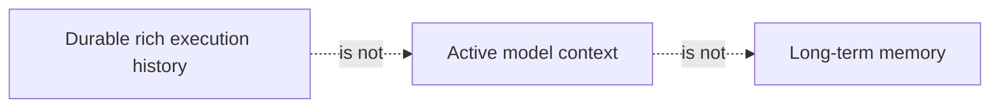
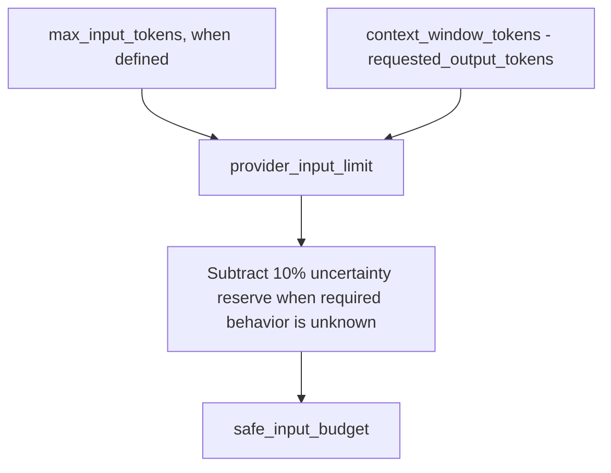
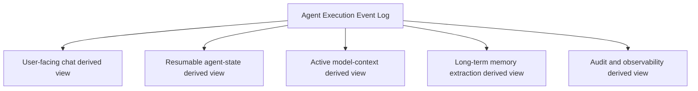
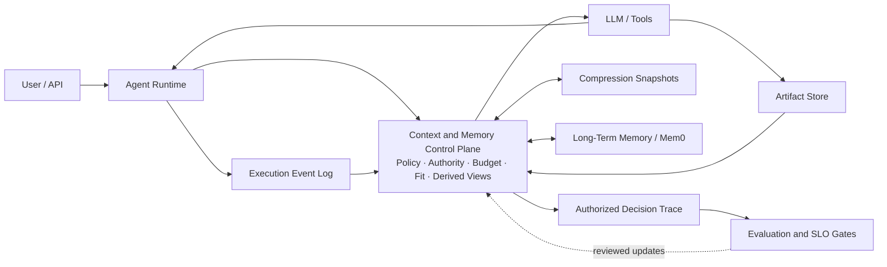
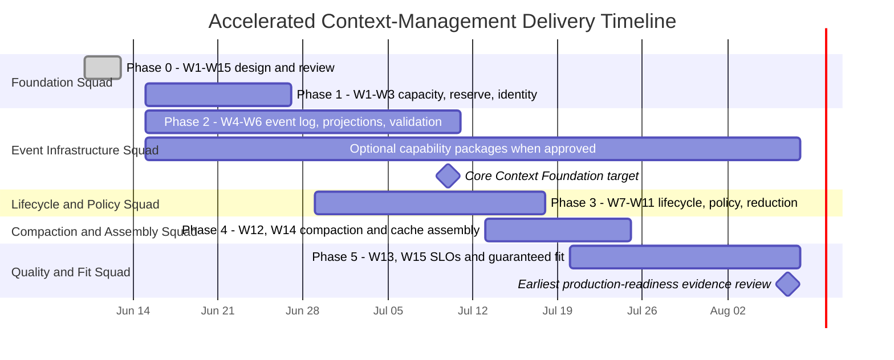
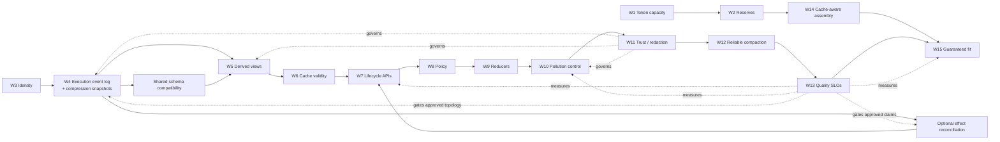

# Nexent Context Management Production Plan

- **Status:** Design complete; approved for staged implementation
- **Date:** 2026-06-12
- **Scope:** Context management only
- **Target:** Claim-scoped production-ready, multi-tenant, multi-worker agent context platform
- **Implementation start:** 2026-06-15
- **Production-readiness review:** See `review/`; all review-driven changes cite
  findings from `review/findings-registry.md`.
- **Review completed:** 2026-06-12; see `review/phase1-program-goals.md` through
  `review/phase5-architecture-assessment.md`, `review/impact-analysis.md`, and
  `review/over-engineering-secondary-review.md`.
- **Architecture verdict:** Approved for staged implementation. A broad production-scale
  claim remains conditional on the release capability matrix and accepted workload,
  reliability, recovery, security, and operability evidence. **Findings:** CM-009-CM-013,
  CM-024.
- Use "claim-scoped production readiness" rather than unconditional "production-ready"
  throughout this plan. **Finding:** CM-024.

## 0. Nexent Versus Other Agentic Platforms

This comparison evaluates Nexent's current implementation as of June 10, 2026. It focuses only on context management, agent state, and memory. Because these products have different scopes, the tables compare the strongest capability Nexent should learn from rather than attempting a generic feature checklist.

### 0.1 Executive Scorecard

| Capability | Nexent current status | Gap versus leading platforms | Value of closing the gap | Actions |
| --- | --- | --- | --- | --- |
| Context compression and budgeting | Incremental summaries, summary caches, fallback truncation, context components, and debugger traces already exist. | Token-capacity semantics are incorrect, final fit is not guaranteed, and large components or tool outputs are not reduced progressively. | Prevents context-length failures while improving answer quality, latency, and token cost during long runs. | [W1](#w1)-[W15](#w15), [W8](#w8)-[W12](#w12), and [W14](#w14). |
| Durable session and execution state | User prompts, final answers, and some visible progress are persisted, while summary state remains process-local. | Unlike mature durable agent runtimes, Nexent cannot reliably reconstruct, resume, replay, or recover complete agent execution. | Enables dependable long-running agents, multi-worker failover, debugging, audit, and user-controlled session recovery. | [W4](#w4)-[W7](#w7). |
| Long-term memory | Mem0 is integrated across four authorization scopes and provides a useful retrieval foundation. | Memory lacks a platform-level policy engine, temporal validity, conflict resolution, evidence links, and measurable lifecycle governance. | Produces more trustworthy personalization and prevents stale or contradictory memories from influencing decisions. | [W11](#w11)-[W13](#w13), plus introduce a Memory Policy Engine and temporal-memory metadata. |
| Authoritative Working Memory | No first-class structured layer currently represents the agent's active goals, decisions, constraints, and task state. | Unlike Letta and LangGraph, important working state is buried in transcripts or transient runtime objects. | Gives agents a compact, editable, recoverable source of truth without repeatedly replaying full history. | Implement Working Memory as a typed derived view from the execution event log under [W4](#w4)-[W5](#w5) and expose it through [W7](#w7). |
| Context and memory governance | Authorization scopes and feature switches exist. | Trust labels, provenance, redaction, retention, deletion propagation, and decision traces are incomplete. | Reduces privacy and security risk and makes persisted context suitable for enterprise production use. | [W3](#w3), [W6](#w6), and [W11](#w11)-[W13](#w13). |
| Platform productization | Nexent already combines zero-code configuration, multi-tenancy, tools, skills, knowledge, memory, and orchestration. | Stronger state and context primitives are not yet exposed as a coherent operator and developer control plane. | Converts Nexent's broad integration advantage into a differentiated, production-grade agent platform. | Deliver the complete [W1](#w1)-[W14](#w14) roadmap while preserving existing platform workflows. |

**Bottom line:** Nexent already has broader platform integration than most specialized competitors, but it trails the leading systems in durable execution state, authoritative Working Memory, lifecycle controls, and memory governance.

### 0.2 Coding-Agent Products

| Compared with | Nexent current status | Gap between Nexent and platform | Value of closing the gap | Actions to take |
| --- | --- | --- | --- | --- |
| [Claude Code](https://docs.anthropic.com/en/docs/claude-code/sub-agents) | Nexent supports multi-agent execution and context compression, but delegated work still shares too much main-run context and has limited lifecycle control. | Claude Code isolates subagent contexts, returns bounded summaries, exposes compaction hooks, and maintains persistent project guidance. | Prevents delegated work from polluting the parent context and gives users predictable control over long sessions. | Isolate subagent contexts and offload outputs through [W10](#w10); add compaction hooks and inspection through [W7](#w7) and [W12](#w12); govern persistent guidance through [W8](#w8) and [W11](#w11). |
| [Codex](https://developers.openai.com/codex/learn/best-practices) | Nexent persists chat-facing records but lacks a complete durable execution history and first-class resume, restore, and context-status controls. | Codex treats session history and lifecycle operations as core product capabilities and uses progressive disclosure to control context growth. | Enables reliable continuation, recovery from earlier states, transparent context control, and efficient long-running work. | Build the execution event log, derived views, compression snapshots, and lifecycle APIs through [W4](#w4)-[W7](#w7); add progressive loading and output control through [W8](#w8)-[W10](#w10). |
| [OpenCode](https://opencode.ai/docs/config/) | Nexent has automatic compression and fallback truncation, but operational controls are fragmented and large outputs can dominate context. | OpenCode exposes straightforward controls for reserved capacity, tool-output pruning, session export, and extension hooks. | Makes context behavior easier to operate, debug, customize, and keep within budget. | Add capacity reserves through [W2](#w2); output pruning and artifact offloading through [W10](#w10); session export through [W7](#w7); define a small extension-hook API around [W8](#w8) and [W12](#w12). |

### 0.3 State, Memory, and Agent Frameworks

| Compared with | Nexent current status | Gap between Nexent and platform | Value of closing the gap | Actions to take |
| --- | --- | --- | --- | --- |
| [LangGraph](https://docs.langchain.com/oss/python/langgraph/persistence) | Nexent's summaries and caches primarily live in process and are not sufficient to reconstruct each execution step. | LangGraph provides typed per-step checkpoints, versioned threads, replay, time travel, and fault recovery. | Enables multi-worker recovery, deterministic debugging, and resuming from a known-good execution state. | Implement typed execution events and compression snapshots through [W4](#w4) and [W6](#w6); expose replay and restore through [W7](#w7). |
| [OpenAI Agents SDK](https://openai.github.io/openai-agents-python/sessions/) | Nexent stores chat records and some visible progress, but lacks one canonical session protocol for all run items. | The Agents SDK models tools, handoffs, approvals, and run events as rich session items with pluggable storage. | Simplifies integrations and preserves enough structured evidence for reliable resume, audit, and alternative derived views. | Define canonical run-item schemas and pluggable event-log storage through [W4](#w4)-[W5](#w5); expose a minimal session interface through [W7](#w7). |
| [Letta](https://docs.letta.com/guides/core-concepts/stateful-agents/) | Nexent has long-term memory but no authoritative, editable Working Memory representation for active task state. | Letta provides explicit in-context memory blocks, archival memory, shared blocks, and context visualization. | Keeps goals, constraints, decisions, and task progress compact, inspectable, and recoverable across runs. | Create typed Working Memory derived views through [W4](#w4)-[W5](#w5); add inspect/edit APIs through [W7](#w7); enforce shared-state authorization through [W3](#w3) and [W11](#w11). |
| [Zep / Graphiti](https://help.getzep.com/graphiti/getting-started/overview) | Nexent retrieves scoped long-term memories but does not formally model when facts are valid, superseded, conflicting, or evidence-backed. | Zep/Graphiti maintains temporal facts, relationships, validity intervals, and supersession. | Prevents stale facts from silently overriding newer evidence and improves explainability of memory-driven behavior. | Extend [W11](#w11) with temporal metadata, evidence links, conflict detection, and supersession rules; evaluate a graph backend only after these contracts are stable. |
| [Mem0](https://docs.mem0.ai/) | Mem0 is already integrated as Nexent's long-term-memory provider across four scopes. | Nexent lacks a provider-independent policy layer governing extraction, retrieval, update, conflict handling, retention, and quality. | Preserves the existing investment while making memory behavior trustworthy, measurable, and replaceable. | Keep Mem0 as a provider; add a Memory Policy Engine fed by [W4](#w4)-[W5](#w5), governed by [W11](#w11), and measured through [W13](#w13). |
| [LlamaIndex](https://developers.llamaindex.ai/python/framework/module_guides/deploying/agents/memory/) | Nexent has useful context and memory components, but their storage, retrieval, derived-view generation, and policy responsibilities are tightly coupled. | LlamaIndex offers composable memory, storage, retrieval, and summary primitives. | Makes context algorithms easier to test, replace, and evolve without weakening platform-wide governance. | Define stable store, retriever, derived-view generator, reducer, and policy interfaces while implementing [W5](#w5), [W8](#w8), and [W9](#w9). |
| [ClawVM](https://doi.org/10.1145/3805621.3807648) | Nexent already has budgeting, summaries, artifacts, memory, and lifecycle concepts, but they operate mainly as best-effort mechanisms. | ClawVM makes context residency and durability enforceable through typed pages, minimum-fidelity invariants, multi-resolution representations, lifecycle-complete validated writeback, and observable context faults. | Prevents critical state from silently disappearing during compaction, reset, eviction, or failed recall, while making failures replayable and diagnosable. | Apply its enforcement contract across [W15](#w15), [W4](#w4)-[W5](#w5), [W7](#w7)-[W10](#w10), [W11](#w11), and [W13](#w13); retain Nexent's existing stores and Mem0 behind adapters. |

### 0.4 Strategic Position

Nexent should position itself as a production-grade **Context and Memory Control Plane**: combining LangGraph-like durability, Letta-like stateful memory, Zep-like temporal governance, and coding-agent-style context controls while preserving Nexent's zero-code, multi-tenant product platform.

## 1. Executive Summary and Big-Picture Outcome

Nexent already has a capable context compression engine: incremental summaries, summary caches, fallback truncation, context components, layered long-term memory, benchmarks, and debugger traces. The remaining work is primarily about making context state correct, durable, isolated, controllable, and measurable.

This plan contains 15 implementation-ready workstreams. The production-readiness
review adds claim-scoped constraints, not three unconditional platform workstreams:

- The original 14 production-readiness improvements.
- A corrected model token-capacity design, expanding the original context-fit blocker.
- A durable structured agent execution event log, expanding the original session persistence and lifecycle gaps.
- Durable effect reconciliation remains a conditional capability package for automatic
  side-effect-safe resume.
- Storage operating requirements stay with the concrete storage paths and deployment
  topology that introduce them.
- Schema evolution begins as the W4 event-schema compatibility contract (CM-005).

The foundational additions are not cosmetic. They affect the correctness and delivery
gates of most other workstreams.

### 1.1 Design Completion Status

The design phase completed on June 12, 2026. W1-W14 now have implementation-ready
specifications under `doc/working/context-management-workstreams/`. Each specification
defines its objective, ownership boundary, dependencies, typed service and failure
contracts, persistence/versioning behavior where applicable, phased implementation
plan, repository touchpoints, tests, and definition of done.

The completed design establishes five coordinated engineering modules:

| Module | W-IDs | Design result |
| --- | --- | --- |
| Model Capacity and Request Safety | W1, W2, W15 | One capacity resolver, per-request safe-input budgets, and a mandatory final-fit gateway before provider dispatch. |
| Durable Session State and Lifecycle | W3-W7 | Fully qualified identity, typed event-log source of truth with compression snapshots, purpose-specific projections, complete validation, and authorized lifecycle APIs. |
| Context Shaping and Compaction | W8-W12 | One enforceable policy engine, minimum-fidelity representations, artifact offload/retrieval, and bounded governed compaction. |
| Governance and Privacy | W11 | Shared provenance, redaction, retention, deletion-lineage, and validated writeback contracts across persisted context. |
| Quality and Efficiency | W13-W14 | Versioned SLO/evidence gates and deterministic cache-aware final assembly. |

The production-readiness review is also complete. It approves staged implementation
without adding unconditional workstreams, while requiring minimum guardrails and
claim-scoped evidence from `review/findings-registry.md`. Implementation begins on
June 15, 2026. No W-ID is considered delivered until its tests, evidence, and exit
gates pass.

### 1.2 Required Action Summary

The modules below are intended as assignable ownership boundaries. Cross-module dependencies remain explicit in chapter 3.

| Module | Workstreams | Suggested primary owners | Primary responsibility |
| --- | --- | --- | --- |
| Model Capacity and Request Safety | W1, W2, W15 | Model integration and agent-runtime engineers | Capacity contracts, token budgeting, and guaranteed request fit. |
| Durable Session State and Lifecycle | W3-W7 | Backend platform, data, and distributed-systems engineers | Identity isolation, execution event log with compression snapshots, replay, and session operations. |
| Context Shaping and Compaction | W8-W12 | Agent-runtime and context-algorithm engineers | Context policy, reduction, artifact offloading, and compaction reliability. |
| Governance and Privacy | W11 | Security, privacy, and platform-governance engineers | Provenance, trust boundaries, redaction, retention, and deletion. |
| Quality and Efficiency | W13-W14 | Quality infrastructure and performance engineers | Context SLOs, release gates, observability, and prompt-cache efficiency. |

The table is grouped by assignable engineering module. Modules and workstreams are ordered by dependency and recommended execution priority; severity remains explicit for release planning.

| Module | Severity | ID | Required improvement | Current problem | Proposed action | Primary benefit |
| --- | --- | --: | --- | --- | --- | --- |
| Model Capacity and Request Safety | Blocker | [W1](#w1) | Correct model token-capacity configuration | `max_tokens` has conflicting meanings and is incorrectly reused as the context threshold. | Separate total context, hard input, output cap, output reserve, and tokenizer fields; derive a safe input budget. | Correct compression triggers and provider-safe requests. |
| Model Capacity and Request Safety | High | [W2](#w2) | Output and safety capacity reserve | Context construction can consume all model capacity. | Reserve output separately; when required provider behavior is unknown, reserve an additional 10% of the context window. | Protects answer quality and reduces overflow risk. |
| Model Capacity and Request Safety | Blocker | [W15](#w15) | Guaranteed context fit | Nexent can still call the model after compression leaves context oversized. | Add a mandatory deterministic final-fit pipeline before every model call. | Eliminates preventable context-length failures. |
| Durable Session State and Lifecycle | Blocker | [W3](#w3) | Tenant and user isolation | Context state is keyed only by `conversation_id`. | Qualify all conversation/session state by tenant, user, and conversation. | Prevents cross-user or cross-tenant leakage. |
| Durable Session State and Lifecycle | Blocker | [W4](#w4) | Structured agent execution event log | Current persistence is a UI transcript, not replayable agent state. | Persist session-ordered typed runs, steps, tool calls/results, artifacts, errors, and compression snapshots. | Enables state reconstruction, restart recovery, and audit; ambiguous side effects stop for explicit resolution unless the optional effect-reconciliation package is delivered. |
| Durable Session State and Lifecycle | Blocker | [W5](#w5) | Separate raw history from active context | Persisting richer progress without purpose-specific derived views would flood model context. | Derive purpose-specific chat, resume, model-context, memory, and audit derived views from the execution event log. | Preserves rich evidence without increasing prompt size. |
| Durable Session State and Lifecycle | — | ~~W7~~ | ~~Durable multi-worker context state~~ | — | Retired: checkpoint functionality merged into W4 as `compression.snapshot` events. | Recovery and restart handled through W4 event replay from latest compression snapshot. |
| Durable Session State and Lifecycle | Blocker | [W6](#w6) | Complete cache validation and versioning | Boundary-only fingerprints can reuse stale summaries. | Hash the complete covered prefix and include model, policy, schema, prompt, and lifecycle versions. | Prevents stale or incorrect resumed context. |
| Durable Session State and Lifecycle | High | [W7](#w7) | Full session lifecycle APIs | Nexent lacks first-class compact, flush_snapshot, restore, reset, and inspect operations. | Add durable lifecycle APIs and compaction hooks over immutable execution-event history. | Makes long-running sessions controllable and recoverable. |
| Context Shaping and Compaction | High | [W8](#w8) | Unified enforceable context and memory policy | Context injection and memory decisions are distributed across inconsistent strategies and paths. | Apply one validated policy engine to context selection, memory writes/retrieval, authority, conflicts, and no-write rules. | Makes context and memory behavior predictable, trustworthy, and configurable. |
| Context Shaping and Compaction | High | [W9](#w9) | Progressive component reduction | Oversized tools, skills, memory, or instructions may be dropped whole. | Add component-specific shorten, rerank, summarize, and minimum-representation reducers. | Retains critical capabilities under pressure. |
| Context Shaping and Compaction | High | [W10](#w10) | Context-pollution and large-output control | Tool results and intermediate steps can dominate the main context. | Offload large outputs to artifacts, retain bounded summaries, and isolate subagent contexts. | Improves long-session reliability and lowers token cost. |
| Context Shaping and Compaction | High | [W12](#w12) | Reliable governed compaction | Compaction uses the active model without dedicated resilience or cost controls. | Add compaction-model policy, deadlines, retries, cancellation, circuit breakers, and deterministic fallback. | Prevents compaction failures from taking down agent runs. |
| Governance and Privacy | Medium | [W11](#w11) | Trust, provenance, redaction, and retention | Rich retrieved and persisted context lacks formal trust and lifecycle policies. | Label sources and trust, redact secrets, enforce retention, and propagate deletion. | Makes rich context safe for production use. |
| Quality and Efficiency | Medium | [W13](#w13) | Context quality and reliability SLOs | Existing benchmarks do not block regressions or releases. | Add CI and production gates for fit, retention, latency, cost, recovery, and isolation. | Turns context quality into an enforceable product contract. |
| Quality and Efficiency | Medium | [W14](#w14) | Prompt-cache-aware assembly | Prompt ordering does not intentionally maximize provider cache reuse. | Stabilize prompt prefixes and track cached-input metrics. | Reduces recurring latency and cost. |
| Model Capacity and Request Safety | Medium (post-acceptance) | [W17](#w17) | Capacity suggestion on model add (UX follow-up to W1 catalog adoption) | Default `model_factory='OpenAI-API-Compatible'` misses the W1 catalog; operators have no UX path to reach catalog values without DB editing or the provider-browser tab. | Add suggest-capacity endpoint, fuzzy catalog match, provider discovery hints, and form placeholder UX; extend `_infer_model_factory` to cover LLM/VLM. | Makes W1's eight catalog entries reachable from the default add flow that most tenants use. |

### 1.3 Big-Picture Outcome

After this plan, Nexent will move from an agent runtime with capable in-process compression into a durable context platform:

- **Correct:** Model requests use real capacity semantics and always fit.
- **Safe:** Context is tenant-isolated, provenance-aware, redacted, and governed.
- **Durable:** Rich execution state and summaries survive restart, failover, and worker changes.
- **Efficient:** Models receive bounded derived views, not entire raw histories; large outputs are offloaded and prompt caching is intentional.
- **Controllable:** Operators and users can inspect, compact, restore, and reset context.
- **Measurable:** Retention, fit, latency, cost, recovery, and isolation become release-blocking SLOs.
- **Extensible:** Future context algorithms can be rebuilt from the durable execution event log without losing historical execution evidence.

The most important architectural result is the separation of concerns:

That separation allows Nexent to preserve enough evidence for reliable agent continuation while keeping every model request small, relevant, safe, and provider-correct.

### 1.4 Post-Acceptance Additions

W1-W16 represent the design-freeze scope completed on 2026-06-12 and reviewed
through the 26 findings in `review/findings-registry.md`. Workstreams listed
below were opened **after** the design freeze, triggered by limitations
discovered during end-to-end testing of the shipped W1 stack. They are tracked
here so the program plan reflects the full active workstream set without
implying they were part of the original review.

| ID | Workstream | Module | Trigger |
| --- | --- | --- | --- |
| [W17](#w17) | Capacity suggestion on model add | Model Capacity and Request Safety | CM-031 (catalog miss for default `model_factory`), discovered 2026-06-16 during glm-5.1 end-to-end test |

Post-acceptance limitations share the same `CM-NNN` numbering as design-phase
findings; entries created after acceptance are appended to the registry with
the next available number (CM-031 onward). The over-engineering guardrail
still applies: a new workstream is only opened when a specific, named
limitation has been observed and the smallest scoped fix would still require
a coordinated UX + backend change.

## 2. Improvements Details

### 2.1 Investigation Findings

#### 2.1.1 `max_tokens` Is Incorrectly Used as the Context Window

The finding is confirmed.

Nexent's SDK defines `ModelConfig.max_tokens` as the per-call completion output cap and forwards it to `chat.completions.create`:

- `sdk/nexent/core/agents/agent_model.py:47-55`
- `sdk/nexent/core/models/openai_llm.py:181-184`

However, agent configuration also reads the same database value and assigns it directly to `ContextManagerConfig.token_threshold`:

- `backend/agents/create_agent_info.py:510-516`
- `backend/agents/create_agent_info.py:553-556`

The field is also inconsistently propagated. The main `create_model_config_list` production path constructs SDK `ModelConfig` objects without copying the database `max_tokens` value:

- `backend/agents/create_agent_info.py:262-305`

Provider discovery and tests sometimes populate values resembling total context windows, while the SDK contract calls the value an output cap. Therefore the existing database field has no single reliable semantic meaning and cannot be trusted for either input budgeting or output limiting without migration.

This conflates four different concepts:

1. Total model context window.
2. Maximum provider-supported input tokens.
3. Maximum provider-supported or requested output tokens.
4. Safe runtime input budget after reserving output and safety capacity.

#### Proposed Token-Capacity Model

Add these fields to model configuration:

| Field | Meaning |
| --- | --- |
| `context_window_tokens` | Total model context capacity when the provider uses a combined input/output window. |
| `max_input_tokens` | Optional hard provider input limit when it differs from the combined context window. |
| `max_output_tokens` | Provider-supported or configured completion-output cap. Replaces the ambiguous LLM meaning of `max_tokens`. |
| `default_output_reserve_tokens` | Runtime output capacity reserved before constructing input context. |
| `tokenizer_family` | Token-counting strategy or provider/model tokenizer identifier. |
| `capability_profile_version` | Approved versioned provider/model capability profile used by the request. |

The runtime must derive, not directly configure, its safe input budget:

`max_input_tokens` is useful, but adding it alone is insufficient. Without `context_window_tokens` and a separate output cap, Nexent still cannot correctly support providers that enforce a combined input/output window or dynamically vary the requested output allowance.

#### Backward Compatibility

- Keep database/API `max_tokens` temporarily as a deprecated alias for `max_output_tokens`.
- Never use legacy `max_tokens` as a context window after migration.
- Production dispatch requires known hard capacity from an approved operator override
  or versioned capability profile; unverified provider discovery cannot silently change
  production behavior.
- When hard capacity is known but tokenizer, reasoning-window, or provider-overhead
  behavior is incomplete, reserve an additional 10% of the context window and surface
  a warning.

#### 2.1.2 Current Chat Persistence Is Useful but Too Weak for Agent Resume

The existing persistence is not useless. It stores:

- User prompts and assistant final answers in `conversation_message_t`.
- Streamed assistant units such as visible thinking, generated code, execution logs, and search placeholders in `conversation_message_unit_t`.
- Search sources and images in separate tables.

Evidence:

- `backend/services/conversation_management_service.py:42-150`
- `backend/services/conversation_management_service.py:214-230`
- `backend/database/db_models.py:48-88`

However, the next agent run receives only a flat list of `{role, content}`. The frontend explicitly selects the assistant final answer for history, and the SDK reconstructs each assistant turn as a synthetic `ActionStep` containing only that text:

- `frontend/app/[locale]/chat/internal/chatInterface.tsx:463-475`
- `backend/consts/model.py:227-239`
- `backend/agents/create_agent_info.py:885-904`
- `sdk/nexent/core/agents/nexent_agent.py:448-475`

The persisted message units are UI-oriented and lack the structure needed for reliable agent continuation:

- No durable run ID, step ID, parent-child relationship, or replay sequence.
- No typed tool-call request/result relationship.
- No compression snapshot or compression-summary version.
- No stable event schema for replay.
- No concurrency/version field for distributed workers.
- No policy for redaction, retention, or large-output offloading.

#### Proposed Persistence Architecture

Use an append-only, typed execution event log as the source of truth. Derive different purpose-specific views from it for different consumers.

Here, a **session** is the user-visible interaction container. The **execution event log** is the durable, ordered record of what happened within that session. A **derived view**, sometimes called a projection in event-sourcing systems, selects and transforms those events for one purpose. For example, the chat view contains user-facing messages, while the model-context view contains only the bounded information needed for the next model call. Derived views are not separate sources of truth and can be rebuilt from the execution event log.

| Term | Meaning in this plan |
| --- | --- |
| Session | The internal durable execution-log companion to one owned Nexent conversation; it groups related runs and user-visible history. |
| Run | One user-triggered agent execution within a session. |
| Execution event log | The append-only ordered record of actions, tool calls, results, errors, and answers produced during runs. |
| Derived view | A rebuildable, purpose-specific selection and transformation of execution events. |
| Compression Snapshot | A versioned recovery snapshot tied to a known execution-event boundary, stored as a W4 event. |
| Artifact | A large output, file, log, or binary stored outside the active model context. |
| Working Memory | Structured current goals, constraints, decisions, and task state used by the agent. |

Recommended durable entities:

| Entity | Purpose |
| --- | --- |
| `agent_session` | Tenant/user/conversation ownership, lifecycle status, and next event sequence. |
| `agent_event_index` | Session-ordered event IDs plus run, step, parent, and idempotency relationships. |
| `agent_event_data` | Typed schema-versioned payloads for user input, model action, tool call/result, error, final answer, and cancellation. |
| `agent_artifact` | Large tool outputs, files, logs, and binary references stored outside prompt context. |
| `compression.snapshot` (W4 event) | Versioned summary, Working Memory state, covered event range, policy/model/schema versions, and token accounting. Stored as a W4 event, not a separate table. |

Compatibility decision: the current integer `conversation_id` remains Nexent's public
chat identifier. A new internal UUID `agent_session_id` maps one-to-one to an owned
conversation when present and must not be named `session_id`, which already identifies
CAS/JWT authentication sessions. Current conversation tables become compatibility
projections rather than the execution source of truth. Debug/northbound runs without a
conversation use explicitly standalone agent sessions or are classified non-durable.

#### What to Persist

Persist by default:

- User messages and assistant final answers.
- Visible model actions required to interpret tool calls.
- Structured tool-call name, sanitized arguments, status, and result reference.
- Tool-result summaries plus artifact pointers for large raw results.
- Errors, retries, cancellation, and max-step termination.
- Citations, attachments, token usage, latency, and cost.
- Compression snapshots and compact progress/decision summaries.

Do not persist by default:

- Hidden/private chain-of-thought or provider reasoning traces.
- Secrets, credentials, raw authorization headers, or unredacted sensitive tool parameters.
- Unlimited raw tool output inline in the relational event table.

Visible reasoning content can remain available for UI replay when product policy allows it, but it should not be required for agent resume. Resume should depend on structured actions, observations, decisions, and compression snapshots.

#### Required Memory-Control Capabilities

Production-grade memory requires the following control capabilities. They are implemented within W4-W13 rather than managed as a separate workstream:

| Required capability | Required behavior | Parent W-IDs |
| --- | --- | --- |
| Authoritative Working Memory | Maintain a typed derived view of current goals, explicit constraints, confirmed decisions, unresolved items, active entities, and tool state. It must be rebuildable from execution events and survive restart or restore. | [W4](#w4)-[W7](#w7), [W9](#w9) |
| Unified Memory Policy Engine | Route every automatic and tool-driven memory write, retrieval, update, expiry, and deletion through one versioned policy contract. | [W8](#w8), [W11](#w11) |
| Deterministic authority and conflict resolution | Resolve conflicts in code before prompt assembly. System and tenant policy outrank user instructions; explicit current-user corrections outrank Working Memory and long-term memory; relevance never implies trust. | [W8](#w8), [W11](#w11) |
| Correct prompt authority order | Keep retrieved long-term memory attributed and non-authoritative. Inject it below authoritative instructions, current-task constraints, and confirmed Working Memory. | [W15](#w15), [W8](#w8), [W11](#w11) |
| Rich memory candidate extraction | Generate memory candidates from sanitized execution events, verified tool facts, decisions, and corrections instead of only the user prompt and final answer. | [W4](#w4)-[W5](#w5), [W11](#w11) |
| Temporal memory lifecycle | Track source evidence, confidence, confirmation time, validity interval, status, and supersession. Exclude stale, rejected, deleted, or superseded memories before injection. | [W6](#w6), [W11](#w11) |
| Global retrieval resolution | Merge results across scopes, then globally rerank, deduplicate, lifecycle-filter, and detect contradictions before prompt injection. | [W8](#w8)-[W9](#w9), [W11](#w11) |
| Explainable memory decisions | Record why a memory was stored, rejected, retrieved, excluded, superseded, reduced, or injected, without exposing hidden chain-of-thought. | [W4](#w4)-[W5](#w5), [W13](#w13) |
| Confirmation and no-write controls | Require confirmation for sensitive, tenant-shared, high-impact, or low-confidence writes; support ephemeral and explicit no-write classifications. | [W8](#w8), [W11](#w11) |

Working Memory must not become an independent source of truth that can drift from execution history. The durable execution event log (including compression snapshots) remains authoritative; object storage is reserved for large artifacts.

#### ClawVM Adoption Assessment

ClawVM's central insight is that context management should be an enforceable harness-level contract, not a collection of model-driven summarization and retrieval heuristics. Its virtual-memory terminology is optional; the production mechanisms are directly useful for Nexent.

| Paper contribution | Assessment for Nexent | Adoption in this plan |
| --- | --- | --- |
| Typed pages with stable identity, scope, provenance, and minimum fidelity | Adopt. This gives context policy a deterministic unit of selection, reduction, restoration, and audit. Use the product-neutral term `ContextItem` rather than exposing OS terminology in public APIs. | [W4](#w4), [W5](#w5), [W8](#w8), [W9](#w9), [W11](#w11) |
| Full, compressed, structured, and pointer representations | Adopt. Precomputing lower-fidelity forms prevents emergency compaction from depending on another LLM call and enables graceful degradation. Generation cost and staleness must be measured. | [W15](#w15), [W5](#w5), [W9](#w9), [W10](#w10) |
| Two-phase selection: install required minima, then spend remaining budget on upgrades | Adopt. This cleanly separates structural safety from quality optimization. Start with deterministic priority/recency/recompute-cost scoring; do not block launch on an optimal knapsack solver. | [W15](#w15), [W8](#w8), [W9](#w9), [W13](#w13) |
| Lifecycle-complete, validated, non-destructive writeback | Adopt as a blocker-level persistence contract. Dirty state must be committed as a `compression.snapshot` event before compaction, reset, restore, eviction, shutdown, or worker handoff can destroy the only copy. Conversation/session ownership transfer is outside the initial release. | [W4](#w4), [W6](#w6), [W7](#w7), [W11](#w11) |
| Observable context-fault model and deterministic replay | Adopt. Explicit fault classes and reason codes make context failures testable and operationally actionable. Add replay-oracle comparison later for policy tuning. | [W4](#w4), [W7](#w7), [W13](#w13) |
| Claimed zero policy-controllable faults | Treat as evidence for the architecture, not as a transferable guarantee. The paper primarily evaluates deterministic replay and structural faults; semantic correctness, live cross-session behavior, and end-user quality remain open. | Require Nexent-specific live, replay, semantic-quality, and multi-tenant evidence under [W13](#w13). |

### 2.2 Target Architecture

The Control Plane is intentionally shown as one architectural component; its internal policy, authority, budgeting, retrieval, reduction, and derived-view responsibilities are specified in W3-W13. The diagram emphasizes three closed loops: runtime execution, durable context/memory state, and human-reviewed governance improvement.

Core invariants:

1. No model request exceeds its calculated safe input budget.
2. Context state is isolated by tenant, user, and conversation; agent/configuration identity is captured per run.
3. A worker restart or routing change does not lose resumable context.
4. Raw durable history is separate from the bounded context sent to a model.
5. Every dropped, summarized, or offloaded context item is observable.
6. Compression snapshots are invalidated when their covered data or policy changes.
7. Working Memory is a rebuildable, versioned derived view rather than an independent source of truth.
8. Retrieved memory never becomes authoritative solely because it is relevant or injected as a system message.
9. Memory writes, conflicts, lifecycle changes, exclusions, and prompt-injection decisions are explainable.
10. Every model/tool outcome returns to the execution event log before it can affect future context.
11. Evaluation can recommend policy changes, but authority and privacy policy changes require review.
12. Every mandatory context item declares a minimum representation that must survive compaction and reset.
13. Dirty context state is durably committed before any lifecycle action can destroy its only copy.
14. Writeback is schema-validated, scoped, provenance-linked, and non-destructive by default.
15. Recall, reduction, eviction, restoration, and writeback outcomes expose stable reason codes.
16. Every persisted derived object exposes queryable source-event lineage; physical
    erasure invalidates affected objects as a whole and marks the session
    `partial_after_erasure`.
17. SDK/client assertions are untrusted; production model dispatch and governed
    persistence fail closed unless trusted server-side boundaries verify current
    authorization, policy, budget/fit, and governance inputs.

### 2.3 Development Workstreams

#### 2.3.1 Model Capacity and Request Safety

##### W1. Introduce Correct Model Token-Capacity Configuration

**Problem:** `max_tokens` is simultaneously used as output cap and context threshold.

**Solution:**

- Add the fields defined in section 2.1 to database models, APIs, provider discovery, frontend forms, SDK `ModelConfig`, and monitoring.
- Rename internal LLM `max_tokens` to `max_output_tokens`.
- Add `ModelCapacityResolver` backed by a small approved versioned capability profile
  for supported provider/model deployments; provider discovery is candidate metadata,
  not automatic production authority.
- Keep Nexent's open model configuration behavior: the approved profile catalog
  supplies defaults and is not an allowlist. Uncataloged models require authorized
  configured hard capacity before production dispatch.
- Derive `safe_input_budget` per request.
- Validate impossible configurations, such as output reserve greater than the total context window.
- Reject production dispatch when hard capacity is unknown.

**Proof and benefit:** Correct capacity modeling is required for reliable compression triggers, provider portability, and output-quality guarantees.

**Acceptance criteria:**

- Tests cover combined-window and separate-input-limit providers.
- Monitoring reports total window, output reserve, safe input budget, actual input usage, and capacity source.

##### W2. Reserve Output and Safety Capacity

**Problem:** Context threshold can equal the model maximum and does not reserve space for output, reasoning, framing overhead, or estimation error.

**Solution:**

- Use the capacity formula in section 2.1.
- Support per-agent and per-request output reserve overrides.
- When required tokenizer, reasoning-window, or provider-overhead behavior is unknown,
  use one unified uncertainty reserve equal to 10% of `context_window_tokens`, in
  addition to output reserve. Do not separately configure unknown-behavior reserves in
  release one.
- If that 10% rule is required and resolved `context_window_tokens` is absent, reject
  configuration with `uncertainty_reserve_basis_unknown`; do not guess from
  `max_input_tokens`.
- In release one, request-level output overrides may only increase output reservation
  up to `max_output_tokens`. Lowering the configured default uses existing authorized
  model/agent configuration; no new override permission system is required.
- Trigger compaction before the hard boundary using a configurable soft limit.
- Treat SDK/client budgets as advisory only; the trusted server-side dispatch path
  resolves or verifies the enforced budget and rejects caller-expanded limits.

**Proof and benefit:** Reduces overflow risk and avoids starving the model's answer generation.

**Acceptance criteria:**

- Every request reports and honors its reserved capacities.
- Long-answer tasks retain the configured output allowance.

##### W15. Guarantee Context Fit Before Every Model Call

**Problem:** After compression Nexent only warns if the result still exceeds the threshold at `sdk/nexent/core/agents/agent_context.py:628-633`.

**Solution:**

- Add a `ContextFitPipeline` before every main and compaction model call.
- First ship a minimal independent hard-fit gateway that can reject, use existing
  bounded representations, remove/truncate optional content deterministically, preserve
  complete tool pairs, and fail on mandatory overflow. W8-W12 later improve retained
  quality without becoming prerequisites for hard fit.
- Restrict production provider credentials and dispatch capability to one trusted
  server-side path that requires current W3 authorization, W8 policy, W2 budget, and
  the exact final W15 fit result; remove or deny direct dispatch paths.
- Eliminate production dispatch bypasses:
  - Fix B1: `backend/utils/llm_utils.py:100` (system prompt generation bypass)
  - Fix B2: `backend/services/conversation_management_service.py:282` (title generation bypass)
  - Implement credential isolation (architecture layer)
- Apply deterministic stages until the request fits:
  1. Remove expired/non-required components.
  2. Replace large tool outputs with summaries and artifact pointers.
  3. Progressively reduce optional components.
  4. Compact older history.
  5. Reduce recent observations while preserving complete tool pairs.
  6. Apply final emergency truncation with an explicit context-loss event.
- Refuse or safely degrade if mandatory context alone exceeds capacity.
- Assemble in two phases: first install every mandatory item's minimum representation, then use remaining capacity to upgrade selected items to higher-fidelity representations.
- Retry once on provider context-length errors using provider-reported evidence.
- W14 supplies only a cache partition plan. W15 alone assembles and serializes the final
  provider payload, then computes token counts and cache fingerprints from that exact
  payload; trusted dispatch cannot modify prompt content or cache directives.

**Proof and benefit:** Prevents avoidable provider failures and turns context fit from a best-effort warning into a runtime contract.

**Acceptance criteria:**

- Property tests generate arbitrary context combinations and verify serialized requests remain within budget.
- Provider overflow tests verify deterministic recovery without loops.

##### W17. Capacity Suggestion on Model Add (Post-Acceptance Follow-up)

**Status:** Post-acceptance addition opened 2026-06-16 after end-to-end W1 testing
surfaced CM-031 (catalog miss for the default `model_factory`). Not part of the
W1-W16 design-freeze scope. See `W17_Capacity_Suggestion_On_Model_Add.md` for the
full spec.

**Problem:** Catalog keys require an exact `(provider, model_name)` match, but
the default `model_factory = 'OpenAI-API-Compatible'` from the manual-add UI does
not match any catalog provider key. Most LLM rows added through this flow
silently miss the catalog and fall through to the legacy fallback.

**Solution:**

- Add a read-only `POST /api/v1/models/suggest-capacity` endpoint that does
  catalog fuzzy matching and optional provider discovery.
- Frontend calls the endpoint after the user types `model_name` and `base_url`;
  populates the capacity form fields as placeholders that the operator can
  accept or override. Accepted values save as `capacity_source = 'operator'`.
- Extend `_infer_model_factory` to cover LLM/VLM via the shared host-to-provider
  map used by the suggestion endpoint.

**Proof and benefit:** Without this, CM-031 forces every operator to either edit
the database directly or use a provider-specific browser tab to reach the W1
catalog values. With it, the same eight catalog entries become reachable from
the default add path that most tenants use.

**Acceptance criteria:**

- Suggestion endpoint returns `catalog_exact` for direct catalog keys,
  `catalog_fuzzy` for normalized variants, and `provider_discovery` for the four
  supported provider adapters.
- SLO: ≥70% of new manual-add LLM rows during the rollout window produce a
  non-`none` match.
- Disabling the feature flag leaves the W1 end-to-end path unaffected.

**Schedule:** Post-acceptance follow-up. Not bound to the Phase 1-5 timeline;
phased rollout with feature flag once W1 capacity validation is stable.

#### 2.3.2 Durable Session State and Lifecycle

##### W3. Fix Tenant and User Isolation

**Problem:** Conversation-level context managers are keyed only by `conversation_id` in `backend/agents/agent_run_manager.py:78-93`.

**Solution:**

- Introduce `ContextIdentity(tenant_id, user_id, conversation_id)`.
- Use the identity for in-memory caches, compression snapshots, locks, and metrics.
- Require identity authorization before compression snapshot read/write.
- Treat `tenant_id` and `user_id` as immutable single-owner fields for each conversation
  and W4 session. Reject conversation sharing, membership, and ownership transfer;
  shared agents and tenant-shared memories do not grant session access.
- Remove internal APIs that mutate context state using only a bare conversation ID;
  public conversation APIs may retain it after resolving authorized full identity.

**Proof and benefit:** The run registry already uses a user-qualified key while the context registry does not. Aligning them prevents cross-user state leakage and makes multi-tenant deployment defensible.

**Acceptance criteria:**

- Collision tests prove identical conversation IDs across tenants/users never share summaries or components.
- Security tests reject unauthorized compression snapshot access.

##### W4. Build the Structured Agent Execution Event Log

**Problem:** Existing persistence is a user-facing transcript, not a replayable agent-state model. Advanced context management cannot reliably reconstruct tool progress, failures, or compression boundaries from it.

**Solution:**

- Implement the branchless `agent_session`, `agent_event_index`, and `agent_event_data`
  entities and derived views described in section 2.2.
- Map one internal UUID `agent_session_id` to each owned existing Nexent conversation;
  preserve integer `conversation_id` in current public APIs, and explicitly handle
  debug/northbound runs that do not provide a conversation.
- Store tenant/user/conversation ownership on the session. Give every event index a
  UUID `event_id`, agent-session-scoped `event_seq`, integer `run_id`, optional integer
  `step_id`, optional `parent_event_id`, idempotency key, and timestamp.
- Store `event_type`, schema version, validated detail, and governance metadata in the
  atomically appended event-data row.
- Persist tool calls and results as typed events with redacted payloads.
- Fail closed before event persistence when classification/redaction cannot produce a
  complete governed payload; a sanitized failure event never contains rejected content.
- Classify every committed tool-call start without a committed terminal result as
  `ambiguous_effect` during recovery; never invoke it automatically.
- Record an authorized explicit `retry`, `skip`, or `confirm_completed` resolution
  before continuation. A retry explicitly accepts possible duplicate external effects.
- Persist typed Working Memory update, memory-candidate, memory-write-decision, and conflict-resolution events.
- Persist context-item creation, representation change, recall, eviction, restoration, writeback staging, validation, commit, rejection, and lifecycle-boundary events with stable reason codes.
- Append `compression.snapshot` events at configured boundaries within the execution event log.
- Build an outbox-backed, idempotent compatibility projector that continues populating
  the existing conversation tables/UI during migration. Required projection-outbox
  rows commit atomically with their W4 source event; W4 owns retry and repair.
- Replace asynchronous direct message saves with event-first appends and derive
  compatibility message ordering from committed events.
- Permit exactly one active run per durable session in the initial release. Reject a
  second run and conflicting lifecycle mutations until the active run reaches a
  committed terminal/recovery state.
- Make the backend, not the frontend, authoritative for reconstructing history.

**Proof and benefit:** Enables state reconstruction, audit, compaction, debugging,
evaluation, and memory extraction without sending all raw events to the model.
Automatic resume of side-effecting tools additionally requires the optional durable
effect-reconciliation capability; otherwise ambiguous effects stop for explicit
resolution. **Finding:** CM-001.

**Acceptance criteria:**

- A run can be reconstructed from execution events after restart.
- A durable session cannot start a second run while one is active.
- UI transcript, active context, and long-term memory derived views can differ without losing the source events.
- Hidden chain-of-thought is not required or persisted by default.

##### W5. Separate Raw History from the Active-Context Derived View

**Problem:** Persisting more progress is valuable, but blindly injecting all stored events would worsen context pollution and cost.

**Solution:**

- Create a `HistoryProjector` that selects and transforms execution events for a target purpose:
  - `chat_projection`: user and final-answer focused.
  - `resume_projection`: unresolved tasks, actions, tool state, and decisions.
  - `model_context_projection`: budgeted summaries plus recent complete steps.
  - `memory_projection`: stable facts/preferences only.
  - `working_memory_projection`: current goals, explicit constraints, confirmed decisions, unresolved items, active entities, and tool state.
  - `memory_candidate_projection`: sanitized stable facts, corrections, and verified tool-derived evidence eligible for long-term memory policy.
  - `audit_projection`: complete authorized event record.
- Make derived-view policy versioned and observable.
- Preserve raw events independently of summaries so improved projectors can be applied later.
- Treat caller-provided `AgentRequest.history` as a migration compatibility input,
  compare it with backend projections, and stop treating it as resumable source truth.
- Project execution state into stable `ContextItem` records with type, identity, scope, provenance, authority, dirty state, recompute cost, and minimum-fidelity requirements.

**Proof and benefit:** This is the key architectural separation used by mature agent systems: durable transcripts can remain rich while each model call sees only the bounded, relevant derived view.

**Acceptance criteria:**

- Increasing execution-event detail does not increase active prompt size unless selected by policy.

##### ~~W7. Persist Context State for Multi-Worker Operation~~ (Retired)

**Status:** Retired. Checkpoint functionality is merged into W4 as `compression.snapshot`
events.

**Original problem:** Summary caches and context managers live only in a process-local
dictionary. Restart, failover, and load-balancer routing discard state.

**Resolution:** Instead of an independent checkpoint subsystem with its own table, CAS
logic, Redis cache, and schema migration (CM-014), compression results are stored as
`compression.snapshot` events within the W4 execution event log. Recovery finds the
latest `compression.snapshot` event and replays subsequent events. This eliminates:

- Independent checkpoint table and CAS concurrency control
- Redis checkpoint cache layer
- W6 checkpoint-specific validation (compression snapshots are validated like any other event)
- CM-014 checkpoint schema migration (covered by CM-005 event-schema compatibility)
- W7 publication outbox for cross-system consistency

**Recovery flow:** Find latest `compression.snapshot` → load payload → replay subsequent
events → resume. If no snapshot exists, replay entire event log.

**See:** W4 `compression.snapshot` event type, recovery flow, and dirty-state flush.

##### W6. Make Cache Validation Complete and Versioned

**Problem:** Summary cache validity uses only a short boundary fingerprint at `sdk/nexent/core/agents/agent_context.py:286-313`.

**Solution:**

- Hash the complete covered event prefix using canonical serialization.
- Include W4 session identity, covered event sequence, context policy version, summary prompt/schema version, agent version, model ID, and tokenizer version in derived-state validity.
- Invalidate Working Memory and memory-retrieval derived views when source events, lifecycle state, authority rules, or memory-policy versions change.
- Store the covered start/end event sequence.
- Invalidate derived state after history edits or redactions.
- Mark sessions `partial_after_erasure` after physical event erasure and prevent
  complete-replay claims.

**Proof and benefit:** Prevents stale summaries after edits, model switches, prompt changes, or restore/reset operations.

**Acceptance criteria:**

- Mutation tests prove any covered event or policy change invalidates the cache.

##### W7. Add Full Session Lifecycle APIs

**Problem:** Nexent lacks first-class compact, flush_snapshot, restore, reset, and context-inspection operations.

**Solution:**

- Add APIs and SDK methods: `compact`, `flush_snapshot`, `restore`, `reset_context`, and `inspect_context`.
- Reject mutating lifecycle operations with `operation_conflicts_with_active_run` while
  a session run is active. Read-only inspection remains allowed; runtime-internal
  compaction remains part of its owning run.
- Keep raw execution events immutable; restore/reset append lifecycle events that
  select a new active derived-state baseline without deleting later history.
- Define deterministic linear-history restore semantics: projectors start from the
  referenced compression snapshot and apply events after `restore.applied`.
- Support manual focused compaction instructions.
- Add lifecycle events and hooks around compaction and restore.
- Add authorized inspect, restore, and edit operations for Working Memory and memory decisions.

**Proof and benefit:** Persisted transcripts, resume/restore, manual compaction, configurable auto-compaction, and lifecycle hooks make long-running sessions understandable and recoverable without introducing branching.

**Acceptance criteria:**

- Restore reproduces the compression snapshot's active-context derived view.

#### 2.3.3 Context Shaping and Compaction

##### W8. Enforce One Context and Memory Policy Across All Strategies

**Problem:** Injection flags exist in `summary_config.py` but are not applied by runtime selection. Some strategies ignore total or per-component budgets.

**Solution:**

- Add a validated `ContextPolicy` with a `MemoryPolicy` domain covering write destination, retrieval, authority, confirmation, expiry, privacy, and no-write rules.
- Apply injection flags before selection.
- Require every strategy to honor mandatory components, total budget, per-component budget, trust policy, and degradation rules.
- Make context selection deterministic: install all minimum-required representations first, then spend remaining budget on higher-fidelity upgrades using policy-defined utility per token.
- Route automatic and tool-driven memory operations through the same policy.
- Enforce deterministic authority tiers before prompt assembly:
  1. System security and platform policy.
  2. Authorized tenant policy.
  3. Explicit current-user instruction and correction.
  4. Confirmed Working Memory for the active task.
  5. Recent verified events and tool results.
  6. Valid retrieved long-term memory.
  7. Compressed summaries.
  8. Unverified agent inference.
- Merge retrieval results across scopes, then globally rerank, deduplicate, lifecycle-filter, and resolve conflicts before injection.
- Reject invalid policy at configuration time.

**Proof and benefit:** Removes configuration that appears functional but is not, and makes context behavior predictable across strategies.

**Acceptance criteria:**

- Matrix tests cover every strategy, flag, budget, authority, confirmation, conflict, and no-write combination.

##### W9. Add Progressive Component Reduction

**Problem:** Oversized context components are dropped whole by `TokenBudgetStrategy` in `agent_model.py:443-486`.

**Solution:**

- Define reducers per component type:
  - Tools: keep names and minimal schemas, load details on demand.
  - Skills: shorten descriptions, retain likely matches, load full skill later.
  - Memory/knowledge: rerank, deduplicate, summarize, and cap result count.
  - Working Memory: always retain a mandatory minimum representation of active goals, explicit constraints, confirmed decisions, and unresolved work.
  - Agents: keep routing metadata, load full cards only when selected.
  - System instructions: mark mandatory sections as non-droppable.
- Generate and cache admissible representations when an item is created or materially updated: full, compressed, structured, and resolvable pointer where applicable.
- Refuse a representation downgrade when it would violate the item's minimum-fidelity invariant.
- Emit reduction decisions and lost-content metadata.

**Proof and benefit:** Preserves essential capabilities under pressure instead of silently removing an entire tool, skill, or instruction section.

**Acceptance criteria:**

- Oversized component tests retain mandatory minimum representations.

##### W10. Control Context Pollution and Large Tool Outputs

**Problem:** Large tool outputs and intermediate ReAct steps can dominate context. Observation truncation exists but defaults to disabled.

**Solution:**

- Store large outputs in `agent_artifact`.
- Keep a bounded summary, metadata, and retrievable artifact pointer in context.
- Require artifact pointers to resolve deterministically and record a typed fault when resolution, authorization, or backend access fails.
- Publish artifacts through governed non-readable staging, one relational
  pending-artifact/event/finalize-outbox transaction, idempotent finalize, and orphan
  cleanup. Only `ready` artifacts are readable.
- Configure offload thresholds per tool type via agent configuration. Outputs
  exceeding the threshold are stored as artifacts with pointers; the original
  content is preserved for retrieval. This is an offload decision, not a
  truncation — full content remains accessible through the artifact pointer.
  Context space decisions (whether to include full content, pointer only, or
  summary) are made by W8 policy selection and W15 final fit, not by W10.
- Preserve complete tool-call/result pairs.
- Run exploratory or high-volume delegated work in isolated subagent contexts.

**Proof and benefit:** Claude Code and Codex recommend isolated subagents so search results, logs, and file content do not pollute the main context. OpenCode supports old-tool-output pruning and a reserved compaction buffer.

**Acceptance criteria:**

- Multi-megabyte tool results do not materially expand active prompt context.
- Agents can retrieve offloaded details when needed.

##### W12. Make Compaction Execution Reliable and Governed

**Problem:** Compression synchronously uses the active model without a dedicated timeout, model policy, cost limit, or circuit breaker. Current implementation in `agent_context.py` has 21 gaps (16 critical) compared to W12 requirements.

**Solution:**

- Configure a separate compaction model and fallback model.
- Add timeout, cancellation, bounded provider-aware retries, rate-limit policy, cost ceiling, and circuit breaker.
- Detect no-progress compaction and prevent infinite retry loops.
- Make hard truncation deterministic when semantic compaction is unavailable.
- Use W2 `CapacityReservePolicy.soft_limit_ratio` as the primary trigger for compaction.
- Implement fallback model selection: primary → fallback → W9 deterministic hard reduction.
- Ensure measurable progress: compressed output token count must be strictly less than source token count.
- Subagent sessions can trigger their own compaction through W12 using their own `CompactionPolicy`.

**Current State:** The existing `ContextManager` class in `agent_context.py` provides functional but incomplete compression. W12 includes a detailed gap analysis mapping current capabilities against requirements.

**Proof and benefit:** Keeps the main agent available during compaction-provider degradation and prevents uncontrolled latency or spend.

**Acceptance criteria:**

- Fault-injection tests cover timeout, rate limit, malformed summary, provider outage, and no-progress compaction.

#### 2.3.4 Governance and Privacy

##### W11. Add Trust, Provenance, Redaction, and Retention Policies

**Problem:** Retrieved memories and knowledge are injected as system messages without a formal trust boundary. Richer execution persistence also increases privacy and security risk.

**Solution:**

- Add source, trust level, owner, timestamp, permissions, and expiry metadata to every context component and execution event.
- Keep untrusted retrieved content below authoritative instructions.
- Require long-term memories to expose source event IDs, source type, confidence, created/confirmed time, validity interval, lifecycle status, supersession link, and approving policy version.
- Require confirmation for sensitive, tenant-shared, high-impact, or low-confidence writes; support explicit ephemeral and no-write classifications.
- Filter stale, superseded, rejected, and deleted memories before retrieval injection.
- Redact secrets and sensitive tool parameters before persistence.
- Reject raw persistence, fallback, logs, and traces when classification or redaction
  fails; allow only retry, ephemeral process-local handling, operation failure, and a
  sanitized reason-coded failure record.
- Configure retention by event/artifact type and tenant policy.
- Add deletion propagation across the execution event log, compression snapshots, artifacts, and memories.
- Tombstone authorized deletion targets immediately so reads, restore, retrieval, and
  prompt injection deny them while deletion is in progress. Track and retry a fixed
  per-store destination list, and claim completion only after every required
  destination verifies deletion.
- Require queryable source-event lineage for persisted derived objects. Physical
  erasure invalidates affected objects as a whole; rebuild from remaining authorized
  events when safe, otherwise reject restore/resume.
- Route lifecycle writeback through a journal: stage typed append/merge/set-with-version operations, validate schema/provenance/scope/policy/non-destructiveness, then commit with deterministic merge and reason-coded rejection.
- Restrict governed durable writes to trusted server-side persistence interfaces that
  require current authorization, policy, classification/redaction, provenance,
  lineage, and retention metadata. Reject SDK/client self-declared governance and raw
  direct-write paths.

**Proof and benefit:** Rich context is only production-safe when its origin and lifecycle are controlled. Codex memory documentation explicitly describes secret redaction, per-thread controls, and excluding external-context sessions from memory generation.

**Acceptance criteria:**

- Secret fixtures never appear in persisted events, summaries, or memory.
- User deletion removes all derived context state.

#### 2.3.5 Quality and Efficiency

##### W13. Enforce Context Quality and Reliability SLOs

**Problem:** Nexent has benchmarks and tracing, but no release-blocking SLOs.

**Solution:**

- Define release gates for:
  - Context-fit success rate.
  - Summary retention accuracy by category.
  - Tool-call/result retention.
  - Compression ratio, latency, and cost.
  - Restart and multi-worker recovery.
  - Tenant isolation.
  - Multilingual behavior and any explicitly supported modalities.
  - Prompt-cache reuse.
  - Memory-write precision and confirmation compliance.
  - Memory retrieval recall and global reranking quality.
  - Stale-memory rejection, correction propagation, conflict resolution, and deletion propagation.
  - Working Memory retention across compression, restart, restore, and reset.
  - Decision-trace completeness for memory and context assembly.
  - Minimum-fidelity invariant violations.
  - Post-compaction/bootstrap restoration failures.
  - Dirty-state flush misses across compaction, reset, restore, shutdown, eviction, and worker handoff.
  - Recall outcomes separated into no-match, denied, backend-error, and pointer-resolution failure.
  - Duplicate equivalent tool calls, avoidable refetches, and context-thrash rate.
- Run existing LongMemEval/EventQA/manual suites in CI with fixed baselines.
- Add production dashboards and alerts.
- Add OpenTelemetry-style decision trace output for context/memory pipeline
  observability (projection, policy, fit, and reduction decisions). Traces are
  collected by external observability infrastructure, not persisted in the product
  database. Detailed traces are enabled only during debugging or benchmark runs.
  A unified telemetry specification consolidates all trace requirements (low
  priority, post-core). **Finding:** CM-022.

**Proof and benefit:** Converts context quality from anecdotal behavior into a maintained product contract.

**Acceptance criteria:**

- Releases fail when agreed context SLOs regress.

##### W14. Make Prompt Assembly Cache-Aware

**Problem:** Nexent does not intentionally optimize stable prompt prefixes or track cached-input usage.

**Solution:**

- Order stable system instructions and tool schemas before dynamic context.
- Supply deterministic cache partition/order plans to W15; W15 owns final serialization
  and computes fingerprints from the exact dispatched payload.
- Track provider cached-input tokens and prefix-change causes.
- Avoid changing timestamps or user-specific dynamic text inside stable prefixes when unnecessary.
- Subagent sessions apply W14 cache optimization independently using their own agent configuration.

**Proof and benefit:** Improves latency and cost on providers supporting prompt caching while making prompt changes easier to diagnose.

**Acceptance criteria:**

- Cache-enabled providers show measurable cached-input reuse on repeated turns.

### 2.4 Production-Readiness Review Decisions

The formal review artifacts under `review/` are part of this plan. The findings
registry is authoritative for the IDs referenced below. Findings block only the
capability claims that depend on them; valid risks do not automatically create new
workstreams or block the entire program. The secondary over-engineering review
classifies each finding by the minimum required delivery response. The review found
26 findings: 4 Critical, 10 High, 7 Medium, and 5 Low. Of these, 14 require minimal
guardrails, 5 are claim-gated, 3 are measure-triggered, and 4 are handled by explicit
scope exclusion. After the accepted decisions are applied, the goal-coverage assessment
marks 7 goals Fully Covered, 10 Partially Covered, and 1 Not Covered.

No finding authorizes an unconditional new workstream or generalized platform. Teams
must use the minimum response in `review/findings-registry.md`; advanced mechanisms
require an approved capability claim, workload threshold, incident, or measurement
trigger.

#### Claim-Scoped Constraints

1. W4-W7 may claim state replay. In the initial release, every tool-call start without
   a committed terminal result is conservatively classified as `ambiguous_effect`;
   automatic invocation stops until an authorized user or operator records `retry`,
   `skip`, or `confirm_completed`. A general effect-intent/reconciliation platform is
   not required unless automatic side-effect-safe resume is later approved.
   **Findings:** CM-001, CM-003.
2. Append-only history and physical erasure use the minimum CM-002 guardrail: every
   persisted derived object exposes queryable source-event lineage; physical erasure
   marks the session `partial_after_erasure`, invalidates affected objects as a whole,
   and rejects restore/resume when remaining history cannot rebuild safely. A global
   lineage graph, field-level summary editing, and general erasure-replay engine are
   not required. Unknown classification or classification/redaction failure forbids raw
   governed persistence, fallback, logs, and traces; only retry, ephemeral process-local
   handling, operation failure, and sanitized reason-coded records are allowed.
   **Findings:** CM-002, CM-012.
3. The initial release permits exactly one active run per durable session. Restore,
   reset, manual compact, Working Memory mutation, and other conflicting lifecycle
   operations return `operation_conflicts_with_active_run` until the run reaches a
   committed terminal/recovery state. Runtime-internal compaction remains part of its
   owning run. Fencing tokens and concurrent same-session lifecycle mutation are out
   of scope until that capability is approved. **Finding:** CM-003.
4. Start with simple per-session serialization, the normalized event index/data join,
   and append-time incremental hashes. W4 records append latency, session-sequence lock
   wait, events per session, and replay latency under representative CM-009 workloads.
   CM-004 does not block the initial production implementation. Add batching,
   partitioning, materialization, a separate sequence service, or Merkle structures
   only after representative measurements cross approved thresholds.
   **Findings:** CM-004, CM-015.
5. CM-006 covers multi-record publication and asynchronous derived-state repair, not a
   generic cross-store transaction. W4 events and required compatibility-projection
   outbox rows commit in one relational transaction; W4 events are immediately
   authoritative while compatibility views may lag and are repaired idempotently. A
committed `compression.snapshot` event is immediately loadable as part of the W4
event log; no separate publication or cross-system repair is needed.
   W10 uses governed non-readable staging, one pending-artifact/event/finalize-outbox
   transaction, idempotent finalize, ready-only reads, retry/repair, and orphan cleanup.
   W11 immediately tombstones authorized deletion targets and coordinates a fixed
   per-store destination registry; each adapter deletes/verifies idempotently, and
   completion requires every required destination. Universal saga, distributed
   transaction, and generic workflow platforms are not required.
   **Findings:** CM-006, CM-019, CM-020.
6. Before the first production event-schema upgrade, W4 supports reading the current
   and immediately previous event version through one canonical reader/upcaster. The
   upgrade deploys compatible readers before enabling the new writer, and rollback may
   target only releases that can read committed new-version events. This does not block
   the initial single-version deployment and does not create an independent schema
   platform. No later upgrade may strand a retained older event version; it requires a
   separately approved migration or expanded read window first. Checkpoint compatibility
   remains separately governed by CM-014.
   **Findings:** CM-005, CM-014.
7. Workload, numeric SLO, capacity, backup, and recovery evidence blocks only the
   production-scale claim; it does not block a bounded pilot or initial implementation.
   **Findings:** CM-009-CM-011.
8. First release uses immutable single-owner conversations/sessions. It exposes no
   conversation membership or ownership-transfer API; shared agents and tenant-shared
   memories do not grant session access. Explicit operator policy does not change
   ownership. Unsupported sharing/transfer requests fail explicitly, while ordinary
   unauthorized access remains non-disclosing. Delegated mutation and unsupported
   modalities are also rejected. **Findings:** CM-007, CM-025, CM-026.
9. Policy enforcement occurs at a trusted server boundary. A small approved versioned
   capability profile covers only supported provider/model deployments. Unknown hard
   capacity rejects production dispatch; known hard capacity with incomplete required
   behavior uses an additional 10% context-window uncertainty reserve. Unknown prompt-
   cache capability disables cache directives. Supported conflict types are declared;
   unsupported behavior rejects or degrades visibly. Structural minimum-fidelity
   validation is required, while general semantic validation remains measured.
   **Findings:** CM-013, CM-016-CM-018, CM-021.
10. Decision traces reuse W11 governance and add bounded labels, sampling, and
    retention. **Finding:** CM-022.
11. W15 first ships an independent minimal hard-fit gateway; W8-W12 later improve
    quality without becoming fit prerequisites. W14 supplies only a cache partition
    plan, while W15 alone assembles, serializes, counts, and fingerprints the exact final
    payload sent unchanged by trusted dispatch. **Findings:** CM-008, CM-023.

#### Conditional Capability Packages

- **Automatic side-effect-safe resume:** add durable effect intent, tool capability
  declarations, ambiguity states, and reconciliation only when this product claim is
  approved. Until then, the minimum CM-001 guardrail conservatively marks every
  interrupted tool call ambiguous and stops for explicit resolution.
- **Production-scale topology:** concrete W4/W10/W11 paths own correctness and
  repair; deployment/SRE approval owns topology-specific capacity, backup, DR, and
  RPO/RTO evidence. Do not create a single storage mega-workstream.
- **Advanced schema migration:** begin with the W4 event-schema compatibility contract (CM-005).
  A separate migration workstream is optional when multi-team or high-volume migration
  needs emerge.

#### Corrected Dependency and Readiness Rules

- W15 first ships a minimal deterministic fit gateway that can reject, remove optional
  content, and apply bounded deterministic fallback. Its strengthened quality gate
  depends on W8-W12; cache-preserving final assembly depends on a single W15/W14 final
  assembly contract. **Findings:** CM-008, CM-023.
- The July 10 and August 7 dates are planning targets. Readiness is evaluated against
  the exact capability claims enabled by the release. Reaching a date never overrides
  a failed or insufficient-evidence mandatory gate. **Findings:** CM-011, CM-024.

## 3. Suggested Implementation Plan

### 3.1 Phased Delivery Plan

Phases are time-boxed delivery bundles; W-IDs are the stable, assignable workstreams
defined in chapters 1 and 2. A phase groups workstreams that should be integrated and
demonstrated together. W13 is intentionally split. Optional capability packages are
scheduled only after their product claims are approved. Dates are planning targets;
section 2.4 defines the claim-scoped readiness gates. **Findings:** CM-011, CM-024.

| Phase | Schedule target | Included W-IDs | Mapping rationale and phase outcome |
| --- | --- | --- | --- |
| Phase 0: Baseline and Design Freeze | June 10-12 | [W1](#w1)-[W15](#w15) specifications; formal review; W13 groundwork | Completes implementation-ready designs, review constraints, baseline definitions, and shared contracts. |
| Phase 1: Foundation | June 15-26 | [W1](#w1), [W2](#w2), [W3](#w3) | Establishes correct capacity semantics, output reservation, and tenant isolation. |
| Phase 2: Event Infrastructure | June 15-July 10 | [W4](#w4)-[W6](#w6) | Builds the durable event log, history projections, and metadata-based cache validation. |
| Phase 3: Lifecycle and Policy | June 29-July 17 | [W7](#w7)-[W11](#w11) | Implements session lifecycle APIs, unified policy, progressive reduction, output control, and trust/redaction. |
| Phase 4: Compaction and Assembly | July 13-24 | [W12](#w12), [W14](#w14) | Implements reliable compaction with fallback models and cache-aware prompt assembly. |
| Phase 5: Quality and Fit | July 20-August 7 target | [W13](#w13), [W15](#w15) plus approved optional-package evidence | Defines SLOs, establishes baselines, and guarantees context fit before every model call. |
| Post-acceptance follow-ups | Unscheduled; flag-gated rollout | [W17](#w17) and any future post-acceptance-finding-triggered workstreams | Decoupled from the Phase 0-5 timeline. Each follow-up ships behind its own feature flag and graduates via its own evidence gate. Not blocked by, and does not block, the Phase 5 release-hardening exit. |

The July 10 milestone targets the implementation outputs of W1-W6. It is not a
production-readiness gate. Phases 3-5 overlap intentionally; August 7 is the earliest
target for the approved release-scope evidence review. Post-acceptance follow-ups
(see §1.4) are separately tracked and do not move the Phase 5 milestone. **Findings:** CM-011, CM-024.

#### Phase 0: Baseline and Design Freeze

**Schedule target:** June 10-12 **Workstreams:** W1-W14 design, formal review, W13 groundwork, and minimum shared contracts

Deliver:

- Complete implementation-ready W1-W14 specifications and cross-workstream dependency
  mapping.
- Complete formal production-readiness and over-engineering reviews.
- Define the measurement plan for current overflow rate, compression retention,
  latency, and cost; runtime baseline capture starts with implementation.
- Add architecture decision records for token semantics and execution event log.
- Define event schemas, capacity formulas, baseline measurement contracts, claim scope,
  path-specific publication/cross-store rules, and minimal schema-evolution rules.
- Freeze ambiguous new uses of `max_tokens`.

Exit gate:

- Baseline definitions, enabled capability claims, and minimum shared contracts
  approved.

#### Phase 1: Foundation

**Schedule target:** June 15-26 **Workstreams:** W1, W2, W3

Deliver:

- Database/API/frontend migration for token-capacity fields.
- `ModelCapacityResolver` and tokenizer adapter interface.
- Approved versioned capability profiles for supported production provider/model deployments.
- Safe-input-budget calculation.
- `ContextIdentity(tenant_id, user_id, conversation_id)` introduction.
- Tenant/user isolation for all context state.

Exit gate:

- Model capacity correctly configured with separate input/output limits.
- Per-request safe input budget calculated and enforced.
- Context state isolated by tenant/user/conversation.
- Legacy `max_tokens` is no longer used as context window.

#### Phase 2: Event Infrastructure

**Schedule target:** June 15-July 10 **Workstreams:** W4, W5, W6

Deliver:

- Structured execution event log (`agent_session`, `agent_event`, `agent_event_data` tables).
- Event taxonomy and schema evolution contract (CM-005).
- `compression.snapshot` event type for recovery acceleration.
- 7 projection types (chat, resume, audit, working_memory, model_context, memory_candidate, memory).
- Projection priority and ContextItem scope definitions.
- O(1) metadata-based cache validation (CM-015).
- Backend-owned history derived views.
- Existing UI compatibility adapter.

Exit gate:

- All agent execution events persisted to event log.
- Projections correctly separate raw history from active context.
- Cache validation uses metadata-based approach (no content hashing).
- Restart, multi-worker, collision, state replay, and cache-invalidation tests pass.

#### Phase 3: Lifecycle and Policy

**Schedule target:** June 29-July 17 **Workstreams:** W7, W8, W9, W10, W11

Deliver:

- Session lifecycle APIs (`flush_snapshot`, `restore`, `reset`, `compact`, `inspect`).
- Subagent conflict check and `resolve_ambiguous_effect` API.
- Unified context and memory policy with 8-layer authority ordering.
- Subagent policy independence.
- Progressive component reduction (7 reducer types).
- Deterministic vs semantic reducer caching distinction.
- Context pollution control with artifact offload (threshold-based, not truncation).
- Subagent artifact isolation.
- Trust, provenance, redaction, and retention policies.
- Subagent governance.

Exit gate:

- Session lifecycle APIs functional with subagent conflict handling.
- Context policy enforcement working with 8-layer authority.
- Progressive reduction preserving critical information.
- Large outputs offloaded to artifacts (not truncated).
- Redaction and provenance tracking operational.
- Mandatory context preserved under pressure.
- Secret and deletion-propagation tests pass.

#### Phase 4: Compaction and Assembly

**Schedule target:** July 13-24 **Workstreams:** W12, W14

Deliver:

- Reliable governed compaction with `CompactionPolicy`.
- Primary and fallback compaction models.
- Timeout, retry, and circuit breaker for compaction.
- Measurable progress validation (compressed < source).
- Subagent compression independence.
- Cache-aware prompt assembly with stable/dynamic content separation.
- Cache partition planning.
- Subagent cache optimization.

Exit gate:

- Compaction reliable with fallback model and circuit breaker.
- Compression progress measurable (token reduction).
- Prompt assembly optimized for cache reuse.
- Subagent sessions handle compaction and caching independently.
- Long-running sessions can be inspected, restored, reset, and compacted without state corruption.

#### Phase 5: Quality and Fit

**Schedule target:** July 20-August 7 **Workstreams:** W13, W15 and approved optional packages

Deliver:

- Context quality and reliability SLOs (fit rate, retention, latency, cost).
- Baseline measurements established before W1-W12 changes.
- Performance baseline test coordination across all workstreams.
- Guaranteed context fit with `ContextFitPipeline`.
- Hard-fit gateway implementation.
- Dispatch bypass elimination (B1: `llm_utils.py:100`, B2: `conversation_management_service.py:282`).
- Credential isolation (architecture layer).
- Stable-prefix prompt assembly and cached-token metrics.
- Full CI benchmark gates and production dashboards.
- Unified telemetry specification for context/memory decision traces (OpenTelemetry-style, external observability infrastructure).
- Scope-appropriate load, fault, multilingual, and cost testing.
- Optional effect-reconciliation, production-topology, or advanced-migration evidence
  only for capability claims approved for this release.

Exit gate:

- SLOs defined and baseline measurements established.
- Context fit guaranteed before every model call.
- No dispatch bypasses remaining.
- Quality metrics tracked and reported.
- Numeric gates pass for the exact providers, topology, and capabilities approved for
  the release.

### 3.2 Suggested Timeline

The accelerated schedule assumes three parallel squads, heavy AI-assisted implementation, daily integration, automated test generation, and strict scope control. AI assistance shortens implementation and test-authoring time, but architecture decisions, migrations, security review, and production validation remain human-owned gates.

**July 10 target: Core Context Foundation**

The July 10 planning target aims to demonstrate W1-W6 end to end:

- Model capacity has correct semantics and every serialized request is guaranteed to fit.
- Context state is tenant-isolated and survives worker restart or failover.
- The structured execution event log with compression snapshots, active-context derived view, and complete cache validation operate together.
- Authoritative Working Memory survives restart and can be rebuilt from execution events.
- Existing UI chat behavior remains compatible.
- Capacity, isolation, replay, restart, concurrency, and cache-invalidation tests pass in CI.

This target is significant because it demonstrates the core state architecture. It
does not imply automatic side-effect-safe resume, production-scale topology, complete
erasure, advanced migration, or multimodal support unless those claims are separately
approved and evidenced. **Findings:** CM-001, CM-002, CM-005, CM-009, CM-011, CM-024.

### 3.3 Dependency Order

### 3.4 Required Test Portfolio

| Test group | Required proof |
| --- | --- |
| Capacity contract | Serialized requests always fit approved model/provider limits with output reserve; unknown hard capacity rejects production dispatch, and incomplete required behavior adds a 10% context-window uncertainty reserve. |
| Tenant isolation | Same IDs across tenants/users cannot share state. |
| Single-owner scope | Sharing and ownership-transfer requests are rejected; shared resources grant no session access; audited operator actions leave the owner unchanged. |
| Restart/failover | Resume reproduces effective context on another worker. |
| Concurrency | A durable session rejects a second active run and rejects restore/reset/manual compact until the active run reaches a committed terminal/recovery state; W4 sequence lock prevents stale overwrite. |
| Event-log replay | Runs and derived views reconstruct from durable events. |
| Cache invalidation | Any covered history or policy mutation invalidates stale summaries. |
| Retention quality | Key decisions, pending work, tool outcomes, and constraints survive compression. |
| Tool pollution | Very large tool outputs are offloaded and retrievable without prompt overflow. |
| Fault injection | Compaction model outage, malformed output, timeout, and rate limit degrade safely. |
| Security/privacy | Secrets are redacted and deletion propagates through all derived state. |
| Physical erasure | Source-lineage lookup invalidates every affected persisted derived object, session status becomes `partial_after_erasure`, and unsafe restore/resume is rejected. |
| Cost/latency | Compression and context assembly remain inside SLO budgets. |
| Minimum-fidelity safety | Mandatory bootstrap, policy, constraints, active-plan state, and resolvable evidence pointers survive compaction and reset. |
| Lifecycle writeback | Dirty state is staged, validated, and committed before every destructive lifecycle boundary; destructive or stale-version writes are rejected. |
| Context-fault observability | Recall denial/error, pointer-resolution failure, duplicate tool call, avoidable refetch, bootstrap loss, flush miss, and minimum-set overflow emit stable reason codes. |
| Deterministic replay | Recorded traces reproduce context-selection and writeback decisions; oracle comparison distinguishes policy headroom from physical budget insufficiency. |
| External effect safety | A crash after tool-call start and before committed terminal result produces `ambiguous_effect`; recovery performs no automatic invocation and continues only after an authorized, idempotent `retry`, `skip`, or `confirm_completed` resolution. Automatic reconciliation is tested only when separately enabled. |
| Cross-store consistency and overload | Introduced publication paths and queues reconcile or degrade according to their bounded contracts. |
| Backup and disaster recovery, for production-scale claims | Approved topology recovery meets its numeric RPO/RTO and rebuild objectives. |
| Schema evolution | Supported-version upgrades and reader upcasting preserve historical sessions in the approved compatibility window. |

### 3.5 External Reference Evidence

The comparison is based on current primary documentation checked on 2026-06-10:

- Codex monitors remaining context, automatically compacts repeated long-running work, persists transcripts, supports resume/fork/manual compact, exposes context status, uses progressive skill disclosure, and provides pre/post compaction hooks: <https://developers.openai.com/codex/>
- Claude Code subagents use separate context windows and return summaries to avoid flooding the main conversation: <https://docs.anthropic.com/en/docs/claude-code/sub-agents>
- Claude Code provides lifecycle hooks including compaction hooks: <https://docs.anthropic.com/en/docs/claude-code/hooks>
- OpenCode exposes automatic compaction, old-tool-output pruning, and a reserved compaction token buffer: <https://opencode.ai/docs/config/>
- OpenCode exposes a compaction plugin hook for injecting or replacing continuation-summary context: <https://opencode.ai/docs/plugins/>
- LangGraph persists graph state as per-step checkpoints organized into threads, enabling replay, time travel, and fault recovery: <https://docs.langchain.com/oss/python/langgraph/persistence>
- OpenAI Agents SDK sessions automatically maintain conversation history across runs: <https://openai.github.io/openai-agents-python/sessions/>
- Letta persists stateful-agent context and provides persistent in-context memory blocks: <https://docs.letta.com/guides/core-concepts/stateful-agents/>
- Zep/Graphiti provides temporal context graphs whose facts and relationships evolve over time: <https://help.getzep.com/graphiti/getting-started/overview>
- Mem0 provides specialized long-term memory infrastructure: <https://docs.mem0.ai/>
- LlamaIndex provides customizable and composable agent memory primitives: <https://developers.llamaindex.ai/python/framework/module_guides/deploying/agents/memory/>
- ClawVM defines typed context pages, minimum-fidelity invariants, multi-resolution residency, lifecycle-complete validated writeback, observable context faults, and deterministic replay; its results support the enforcement architecture but are explicitly limited to structural faults rather than semantic correctness: <https://doi.org/10.1145/3805621.3807648>
