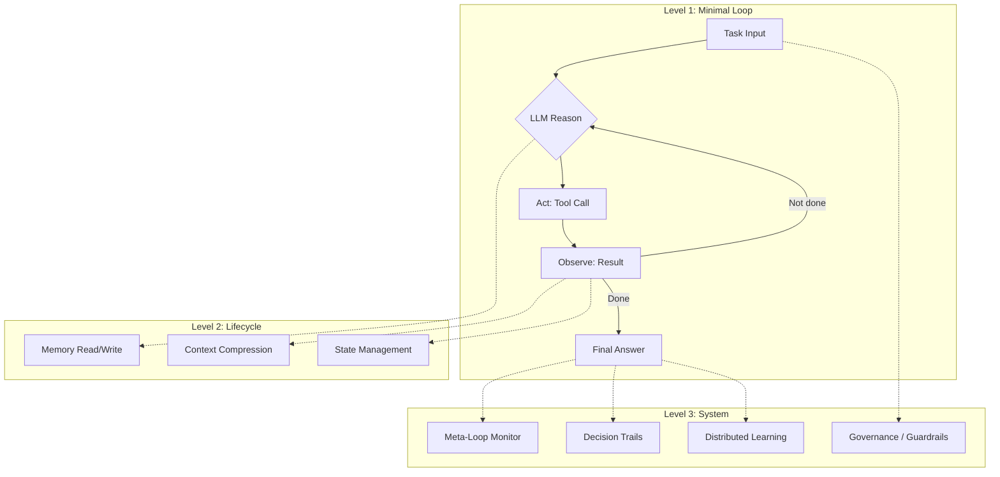
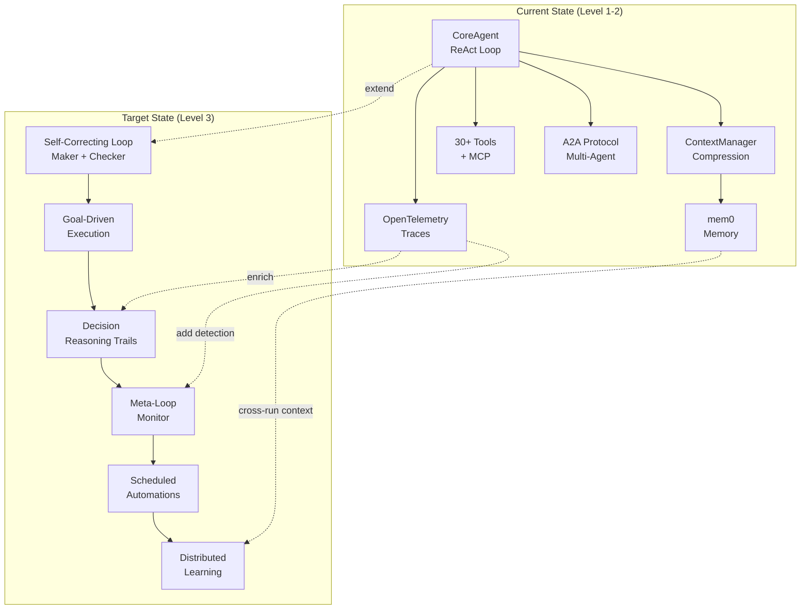
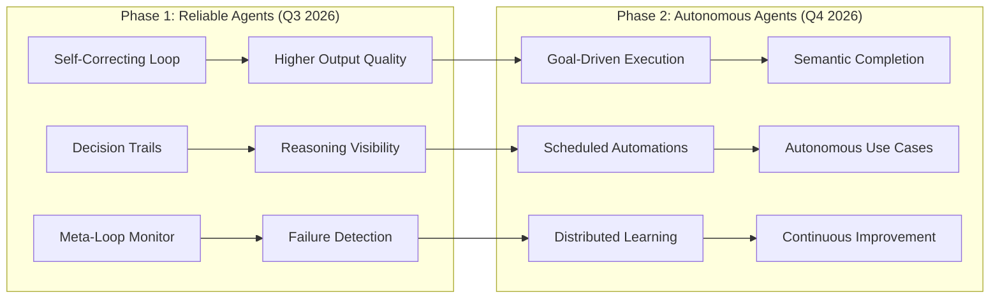

# Loop Engineering: Technical Insight and Product Evolution Recommendations

- **Date:** 2026-06-12
- **Input:** Emerging "Loop Engineering" concept (Addy Osmani, Google, June 8 2026), Oracle developer blog (June 11 2026), academic papers, open-source implementations
- **Scope:** What Loop Engineering is, why it matters now, and how Nexent should evolve to adopt it

---

## 1. Executive Verdict

Loop Engineering is not a product or a library. It is a design methodology that reframes the developer's role from "person who prompts the agent" to "person who designs the system that prompts the agent." The concept crystallized in early June 2026 through parallel publications from Addy Osmani (Google) and Oracle's developer blog, and it has already been validated by three academic papers and multiple open-source implementations. The core insight is that production-grade AI agents require persistent, self-correcting execution loops with structured memory, decision trails, and meta-level monitoring, not just better prompts.

For Nexent, this matters because the platform already implements Levels 1 and 2 of the Agent Loop architecture (LLM + Tools + Lifecycle management) through its smolagents-based CoreAgent and ContextManager. What Nexent lacks are the Level 3 capabilities that Loop Engineering demands: autonomous goal-driven execution, maker/checker self-correction, decision reasoning trails, meta-loop monitoring, and scheduled automations. These are precisely the capabilities that will differentiate agent platforms in the second half of 2026.

The recommendation is to adopt Loop Engineering incrementally across two phases. Phase 1 (Q3 2026) focuses on reliability: self-correcting loops, decision trails, and meta-loop monitoring. Phase 2 (Q4 2026) focuses on autonomy: goal-driven execution and scheduled automations. Nexent's existing foundation in context management, observability, and multi-agent collaboration provides a strong base. The window of opportunity is narrow: competitors like Dify, Coze, and FastGPT will begin shipping similar capabilities within 3 to 6 months.

---

## 2. What Is Loop Engineering?

### 2.1 Three Layers of the Concept

The term "Loop Engineering" sits at the intersection of three distinct but related concepts. Confusion between these layers is common in early discussions, so it is worth separating them clearly.

| Layer | Name | Nature | Example |
|-------|------|--------|---------|
| 1 | Agent Loop | Architectural pattern | `while(!done) { reason(); act(); observe(); }` |
| 2 | Loop Engineering | Design methodology | Osmani's five building blocks + memory |
| 3 | Specific implementations | Products and frameworks | Claude Code hooks, Codex agents, digitarald/loop-agent |

Layer 1 is the runtime mechanism: a loop that repeatedly calls an LLM, executes tools, and observes results until a task completes. Layer 2 is the methodology for designing systems around that loop, including how humans configure, monitor, and learn from it. Layer 3 comprises the concrete tools and products that ship these capabilities to end users.

### 2.2 The Agent Loop: Canonical Architecture

Oracle's developer blog (June 11, 2026) provides the clearest formal model, organizing the Agent Loop into three levels of increasing sophistication:

**Level 1: LLM + Tools + Response.** The minimal viable loop. An LLM receives a task, reasons about which tool to call, executes it, observes the result, and either produces a final answer or loops again. This is what most agent frameworks ship today.

**Level 2: Lifecycle Inside the Loop.** Memory operations, state management, and context compression happen within each iteration. The loop is aware of its own history and can summarize, compress, or retrieve past steps. This is where Nexent currently operates, with its ContextManager and token-aware summarization.

**Level 3: Operations Inside and Outside the Loop.** The harness becomes a system. External processes monitor the loop, inject new information, enforce governance policies, and learn from completed runs. The loop is no longer isolated; it participates in a larger operational context.



The canonical loop in pseudocode:

```
while (!done) {
    thought = reason(task, memory, tools)
    action  = act(thought)
    result  = observe(action)
    memory.update(result)
    done    = check_completion(task, result)
}
```

Reference: [Oracle Developer Blog: The Agent Loop Decoded](https://blogs.oracle.com/developers/the-agent-loop-decoded-three-levels-every-agent-engineer-must-know)

### 2.3 Loop Engineering: The Methodology

Addy Osmani's formulation (June 8, 2026) goes beyond the runtime loop to describe how engineers should design systems around it. He identifies five building blocks plus memory:

| Block | Purpose | Claude Code | OpenAI Codex |
|-------|---------|-------------|--------------|
| Automations | Scheduled or event-triggered agent runs | Hooks (PreToolUse, PostToolUse, Stop) | Background agents with cron triggers |
| Worktrees | Isolated execution environments | Git worktrees per agent | Sandboxed containers per task |
| Skills | Reusable instruction sets loaded into context | CLAUDE.md files, custom slash commands | AGENTS.md, custom instructions |
| Connectors | External data source integrations | MCP servers | Built-in web search, file access |
| Sub-agents | Delegated specialist workers | `task()` function with subagent types | Multi-agent orchestration API |
| Memory | Persistent cross-session knowledge | Project memory, conversation history | Thread memory, shared context |

Osmani's central claim: "Loop engineering is replacing yourself as the person who prompts the agent. You design the system that does it instead." The building blocks are the vocabulary for describing what that system looks like.

Reference: [Addy Osmani: Loop Engineering](https://addyo.substack.com/p/loop-engineering)

### 2.4 Key Innovations

**Maker/Checker Separation.** The model that wrote the code should not grade its own work. A separate model (or a separate prompt with different instructions) reviews the output and either approves it or sends it back with specific feedback. This prevents the well-known failure mode where an agent confidently produces incorrect output and validates its own errors.

**/goal Primitive.** Instead of running for a fixed number of steps, the agent runs until a verifiable condition is met. A separate model checks whether the goal has been achieved after each iteration. This replaces brittle step-count limits with semantic completion criteria.

**Decision Reasoning Trails.** Every decision the agent makes is persisted with its rationale. Not just "the agent called search_web" but "the agent called search_web because the user's question referenced a 2026 event and the knowledge base only covers up to 2025." This enables post-hoc analysis, debugging, and organizational learning.

**Distributed Learning.** Completed agent runs deposit their learnings into a shared folder. A curator agent periodically consolidates these into reusable skills or updated instructions. Over time, the system gets better without human intervention.

**Meta-Loop Monitoring.** An external process watches the agent loop for pathological patterns: STALLED (no progress for N steps), REGRESSING (output quality declining), OSCILLATING (repeating the same actions without convergence). When detected, the meta-loop can intervene by injecting guidance, escalating to a human, or terminating the run.

---

## 3. Why Now?

### 3.1 The Paradigm Shift

The industry is moving from turn-based prompting (human sends a message, agent responds, human evaluates) to designing systems where agents prompt themselves. Boris Cherny, lead engineer on Anthropic's Claude Code, stated it directly: "I don't prompt Claude anymore. I have loops running that prompt Claude and figuring out what to do. My job is to write loops." Peter Steinberger echoed this: "You shouldn't be prompting coding agents anymore. You should be designing loops that prompt your agents."

This is not a niche observation from the coding-tools space. It reflects a broader shift in how AI systems are deployed in production. The agent is no longer a chatbot that waits for input. It is a worker that runs on a schedule, reacts to events, and manages its own execution within boundaries set by its designer.

### 3.2 Product-Native Primitives

The five building blocks are no longer theoretical. Both Claude Code and OpenAI Codex now ship them as first-class features:

| Feature | Claude Code | OpenAI Codex | Status |
|---------|-------------|--------------|--------|
| Hooks / Automations | PreToolUse, PostToolUse, Stop, Notification hooks | Background agent scheduling | Shipped |
| Isolated environments | Git worktrees per agent | Sandboxed containers | Shipped |
| Skills / Instructions | CLAUDE.md, custom slash commands | AGENTS.md, custom instructions | Shipped |
| Connectors | MCP server integration | Built-in web/file access | Shipped |
| Sub-agents | `task()` with explore, librarian, oracle types | Multi-agent orchestration | Shipped |
| Persistent memory | Project-level memory across sessions | Thread memory with shared context | Shipped |

When two competing products independently converge on the same architecture, the pattern is real.

### 3.3 Academic Validation

Three recent papers provide theoretical grounding for the Loop Engineering approach:

**arXiv:2604.11378** ("From Agent Loops to Structured Graphs") characterizes the Agent Loop as a "single-ready-unit scheduler" and proposes the Graph Harness as a generalization. The paper formalizes why simple while-loops work for single-agent tasks but break down for multi-step workflows that require branching, parallelism, and conditional routing.

**arXiv:2601.19752** ("Agentic Design Patterns") catalogs 12 reusable design patterns for agent systems, describing the agent loop as a "continuous cognitive cycle." The patterns include reflection, planning, tool use, and self-correction, all core elements of Loop Engineering.

**arXiv:2605.13850** ("Two-Dimensional Framework") classifies "Loop" as one of six execution topology archetypes for agent systems. The taxonomy helps explain why Loop Engineering works for some tasks (iterative refinement, exploration) but not others (one-shot generation, simple retrieval).

### 3.4 Open-Source Implementations

| Project | What It Is | Key Innovation | Link |
|---------|-----------|----------------|------|
| digitarald/loop-agent | Meta-loop orchestrator for VS Code | Stall detection, shared memory, decision trails | [GitHub](https://github.com/digitarald/loop-agent) |
| AgentLoop (@trygentic/agentloop) | DAG-based task management | Parallel execution, self-healing on failure | [npm](https://www.npmjs.com/package/@trygentic/agentloop) |
| Looplet | Iterator-first agent loop | Protocol-hooked, zero dependencies | [GitHub](https://github.com/nicholasgriffintn/looplet) |
| Loop Engine | Enterprise governance layer | Immutable event log, audit trails | [GitHub](https://github.com/jeremylongshore/loop-engine) |
| Google ADK LoopAgent | **DEPRECATED** | Replaced by "Workflow" abstraction | N/A |

The deprecation of Google ADK's LoopAgent is particularly instructive. Google concluded that a standalone "loop agent" was too narrow and folded the concept into a broader Workflow abstraction. This suggests that Loop Engineering should be integrated into existing agent frameworks rather than shipped as a separate component.

---

## 4. Risks and Mitigations

Osmani identifies four risks inherent in Loop Engineering. Each requires explicit mitigation.

**Verification still on you.** An unattended loop is an unattended mistake factory. If nobody reviews the output, errors accumulate silently. Mitigation: implement mandatory human checkpoints at defined intervals (every N completions, every M tokens spent). Never remove the human from the loop entirely; just change where they intervene.

**Comprehension debt.** Faster loops create a bigger gap between what the system has produced and what the operator understands. An agent that generates 50 files in an hour creates a codebase that no one fully comprehends. Mitigation: require decision trails (Recommendation 3) and periodic comprehension audits. If the operator cannot explain what the agent did in the last hour, the loop is running too fast.

**Cognitive surrender.** It is tempting to stop having opinions about the output and accept whatever the loop produces. This leads to quality drift over time. Mitigation: maintain explicit quality criteria that are checked by the maker/checker mechanism (Recommendation 1). The criteria should be updated by humans, not by the agent.

**Token cost volatility.** Each sub-agent burns its own tokens, and costs can spiral when loops run autonomously. A meta-loop that spawns 5 sub-agents, each running 20 steps, can consume 100x the tokens of a single supervised run. Mitigation: implement per-run token budgets and meta-loop monitoring (Recommendation 4) that detects cost anomalies.

---

## 5. Nexent Current State Assessment

### 5.1 Architecture Overview

Nexent v2.2.0 is a microservice-based platform with six core services: Config Service, Runtime Service, Northbound Service, MCP Service, Data Process Service, and A2A Server. The agent framework is built on smolagents 1.23, with `CoreAgent` (`sdk/nexent/core/agents/core_agent.py:215`) extending `CodeAgent` to add streaming, context management, and observability.

The execution model is thread-per-agent-run: each conversation spawns a thread that runs the ReAct loop (`_run_stream` at `core_agent.py:598`) until the agent produces a final answer, hits `max_steps`, or receives a stop signal via `stop_event` (`core_agent.py:219`). Context is managed by `ContextManager` (`agent_context.py:1`), which provides token-aware incremental summarization with a cache-based optimization that avoids redundant LLM calls for previously summarized content.

Multi-agent collaboration uses the A2A protocol (`a2a_agent_proxy.py`), a custom JSON-RPC 2.0 implementation over HTTP and gRPC. Memory is backed by mem0 (`memory_core.py:1`), providing user-level and user-agent-level scopes. Observability is handled through OpenTelemetry traces and a custom monitoring manager (`sdk/nexent/monitor/monitoring.py`).

### 5.2 Maturity by Dimension

| Dimension | Current State | Maturity | Evidence |
|-----------|--------------|----------|----------|
| Agent execution model | ReAct loop with streaming, max_steps, stop_event | High | `core_agent.py:598-660` |
| Context management | Token-aware compression, summarization cache | High | `agent_context.py:1-10`, 1,409 lines |
| Multi-agent collaboration | A2A protocol (JSON-RPC 2.0, HTTP, gRPC) | High | `a2a_agent_proxy.py` |
| Memory system | mem0-backed, two-tier scopes | Medium | `memory_core.py:1-50` |
| Skill system | Progressive disclosure, dynamic loading | Medium | Agent config + prompt templates |
| Tool ecosystem | 30+ built-in tools, MCP integration | High | `nexent/core/tools/` |
| Observability | OpenTelemetry traces, step_metrics collection | Medium | `monitor/monitoring.py`, `core_agent.py:663-745` |
| Autonomous execution | Not implemented | None | No scheduled or event-driven runs |
| Self-correction | final_answer_checks only (basic validation) | Low | `core_agent.py:622` |
| Decision trails | step_metrics captures WHAT, not WHY | Low | `core_agent.py:663-736` |
| Meta-loop monitoring | Not implemented | None | No stall/regression/oscillation detection |

### 5.3 Gap Analysis

| Capability | Nexent Status | Loop Engineering Requirement | Gap |
|-----------|--------------|------------------------------|-----|
| Core agent loop | ReAct while-loop with streaming | Persistent loop with lifecycle management | Partial: loop exists but is request-scoped, not persistent |
| Context compression | Token-aware summarization with cache | Adaptive compression based on task phase | Minor: current system is strong but phase-unaware |
| Maker/Checker | final_answer_checks (basic) | Separate model reviews output with feedback loop | Major: no separate reviewer, no feedback loop |
| Goal-driven execution | max_steps limit | Verifiable goal condition checked by separate model | Major: only step-count limits, no semantic completion |
| Decision trails | step_metrics (tokens, timing) | Persisted rationale for every decision | Major: metrics capture quantities, not reasoning |
| Meta-loop monitoring | None | STALLED/REGRESSING/OSCILLATING detection | Major: no external monitoring of loop health |
| Scheduled automations | None | Cron/event-triggered agent runs | Major: no scheduler or event bus |
| Distributed learning | None | Shared learnings folder, curator agent | Major: no cross-session learning mechanism |
| Sub-agent delegation | A2A proxy for remote agents | Typed sub-agents with role specialization | Partial: A2A exists but lacks role typing |

The following diagram maps the current Nexent architecture to the target state after Loop Engineering adoption:



---

## 6. Product Evolution Recommendations

### 6.1 Recommendation 1: Self-Correcting Agent Loop

**What:** Introduce a maker/checker pattern where the agent that produces output (maker) is reviewed by a separate evaluation step (checker) before the output is delivered to the user.

**Why:** The current `final_answer_checks` mechanism (`core_agent.py:622`) performs basic validation but does not evaluate output quality, correctness, or completeness. A separate checker model can catch errors that the maker model misses, particularly in complex reasoning tasks.

**How:** Extend `_run_stream` to support an optional auditor phase after the maker produces a final answer. The auditor receives the task, the maker's output, and the execution trace, then returns PASS or FAIL with specific feedback. On FAIL, the maker re-runs with the feedback injected as additional context.

```
Task --> [Maker Agent] --> Draft Output
                              |
                              v
                        [Auditor Agent]
                         /          \
                     PASS          FAIL + Feedback
                       |               |
                       v               v
                  Final Answer    [Maker re-runs with feedback]
                                       |
                                       v
                                  (loop, max 2 retries)
```

The existing `final_answer_checks` list at `core_agent.py:622` provides the integration point. A new `AuditorCheck` class would be added to this list, invoking a separate model call with a review-focused prompt template.

**Effort estimate:** 2 to 3 weeks.

### 6.2 Recommendation 2: Goal-Driven Autonomous Execution

**What:** Replace or supplement `max_steps` with a verifiable goal condition. The agent runs until a separate model confirms the goal has been achieved, rather than stopping after an arbitrary step count.

**Why:** The current `max_steps` mechanism (`core_agent.py:481, 649-659`) is a blunt instrument. Complex tasks may need more steps than anticipated, while simple tasks waste steps. A goal condition allows the agent to run exactly as long as needed.

**How:** Introduce a `GoalAgent` configuration that pairs a task description with a verifiable completion criterion. After each step, a lightweight model evaluates whether the goal has been met.

```python
class GoalAgent:
    """Agent that runs until a verifiable goal is achieved."""

    def __init__(
        self,
        task: str,
        goal_criteria: str,
        checker_model: OpenAIModel,
        max_steps: int = 50,       # safety ceiling
        check_interval: int = 3,   # check every N steps
    ):
        self.task = task
        self.goal_criteria = goal_criteria
        self.checker_model = checker_model
        self.max_steps = max_steps
        self.check_interval = check_interval

    def is_goal_met(self, current_output: str, trace: list) -> bool:
        """Separate model evaluates goal completion."""
        prompt = f"""Task: {self.task}
Goal: {self.goal_criteria}
Current output: {current_output}
Has the goal been achieved? Respond YES or NO with reasoning."""
        response = self.checker_model.generate([{"role": "user", "content": prompt}])
        return "YES" in response.content.upper()
```

This builds on the existing `stop_event` mechanism (`core_agent.py:219, 646`) and the `_run_stream` while-loop (`core_agent.py:605`). The goal check would be inserted at the `check_interval` boundary within the loop.

**Effort estimate:** 3 to 4 weeks.

### 6.3 Recommendation 3: Decision Reasoning Trails

**What:** Extend `step_metrics` to capture not just quantitative data (tokens, timing) but also the agent's reasoning for each decision: why it chose a particular tool, why it interpreted a result a certain way, why it decided to continue or stop.

**Why:** The current `_collect_step_metrics` method (`core_agent.py:663-736`) captures input/output tokens, compression stats, and memory state. This tells operators what happened but not why. When an agent produces incorrect output, debugging requires understanding the reasoning chain, not just the token counts.

**How:** Modify the prompt template for model calls to include a structured reasoning field. Parse this field in `_collect_step_metrics` and persist it alongside the quantitative metrics. The existing OpenTelemetry integration (`nexent_agent.py:480-491`) already supports custom attributes, so decision trails can be attached to trace spans.

```python
# Extended metric structure
metric = {
    "step_number": action_step.step_number,
    "timestamp": time.time(),
    "decision": {
        "tool_choice_rationale": "...",   # why this tool
        "interpretation": "...",           # how result was interpreted
        "continuation_reason": "...",      # why continue vs. stop
    },
    # ... existing fields ...
}
```

The monitoring manager's `record_agent_step_metrics` method (`core_agent.py:742`) already accepts the metric dict and forwards it to the observability backend. Adding decision fields is a schema extension, not an architectural change.

**Effort estimate:** 2 weeks.

### 6.4 Recommendation 4: Meta-Loop Monitoring

**What:** An external process that observes the agent loop in real time and detects pathological patterns: STALLED (no meaningful progress for N consecutive steps), REGRESSING (output quality declining across steps), and OSCILLATING (repeating the same tool calls or actions without convergence).

**Why:** Autonomous loops can enter failure states that are invisible to the agent itself. An agent that repeatedly searches for the same information, or that generates progressively worse output as context fills with noise, needs external intervention. Without meta-loop monitoring, these failures waste tokens and produce poor results.

**How:** Implement a `MetaLoopMonitor` class that subscribes to `step_metrics` events and maintains a sliding window of recent steps. Pattern detection runs after each step.

```python
class MetaLoopMonitor:
    """Monitors agent loop health and detects pathological patterns."""

    STALLED_THRESHOLD = 3      # steps without progress
    REGRESSION_WINDOW = 5      # steps to evaluate trend
    OSCILLATION_WINDOW = 4     # steps to check for repetition

    def __init__(self, agent_name: str):
        self.agent_name = agent_name
        self.recent_steps: list[dict] = []
        self.alerts: list[dict] = []

    def on_step_complete(self, metric: dict) -> list[str]:
        """Called after each step. Returns list of detected patterns."""
        self.recent_steps.append(metric)
        detected = []

        if self._is_stalled():
            detected.append("STALLED")
        if self._is_regressing():
            detected.append("REGRESSING")
        if self._is_oscillating():
            detected.append("OSCILLATING")

        for pattern in detected:
            self.alerts.append({
                "pattern": pattern,
                "step": metric["step_number"],
                "timestamp": metric["timestamp"],
            })
        return detected

    def _is_stalled(self) -> bool:
        """No new tool calls or output changes in N steps."""
        if len(self.recent_steps) < self.STALLED_THRESHOLD:
            return False
        window = self.recent_steps[-self.STALLED_THRESHOLD:]
        outputs = [s.get("observations", "") for s in window]
        return len(set(outputs)) == 1  # identical outputs

    def _is_regressing(self) -> bool:
        """Output quality scores declining over window."""
        # Requires quality scoring from auditor (Recommendation 1)
        pass

    def _is_oscillating(self) -> bool:
        """Same sequence of tool calls repeating."""
        if len(self.recent_steps) < self.OSCILLATION_WINDOW:
            return False
        half = self.OSCILLATION_WINDOW // 2
        first_half = [s.get("tool_calls", []) for s in self.recent_steps[-self.OSCILLATION_WINDOW:-half]]
        second_half = [s.get("tool_calls", []) for s in self.recent_steps[-half:]]
        return first_half == second_half
```

This integrates with the existing monitoring infrastructure at `sdk/nexent/monitor/monitoring.py`. The `record_agent_step_metrics` call at `core_agent.py:742` is the natural hook point.

**Effort estimate:** 2 to 3 weeks.

### 6.5 Recommendation 5: Scheduled Agent Automations

**What:** Allow agents to run on a schedule (cron) or in response to events (webhook, data change, time threshold), without human initiation.

**Why:** Loop Engineering's highest-value use cases are autonomous: daily report generation, periodic data monitoring, scheduled knowledge base updates. These require the agent to start itself, run to completion, and deposit results, all without a human clicking "send."

**How:** Introduce an automation scheduler service that manages agent run configurations. Each automation specifies: the agent to run, the trigger (cron expression or event subscription), input parameters, and output destination. The scheduler creates agent runs via the existing `agent_service.py` orchestration layer.

This builds on three existing Nexent capabilities: MCP tools for data access, the knowledge base for persistent storage, and the memory system for cross-run context. The main new component is the scheduler itself, which needs to handle concurrency limits, failure retries, and run history.

**Effort estimate:** 4 to 5 weeks.

### 6.6 Adoption Matrix

| Priority | Recommendation | Verdict | Implementation | Effort | Business Value |
|----------|---------------|---------|----------------|--------|----------------|
| P0 | Self-Correcting Agent Loop | Adopt | Extend `final_answer_checks` with auditor model | 2-3 weeks | High: output quality improvement is the top user request |
| P0 | Decision Reasoning Trails | Adopt | Extend `step_metrics` schema + OTel attributes | 2 weeks | High: debugging and compliance require reasoning visibility |
| P1 | Meta-Loop Monitoring | Adopt | New `MetaLoopMonitor` class, hook into step_metrics | 2-3 weeks | High: prevents token waste and silent failures |
| P1 | Goal-Driven Execution | Adopt | New `GoalAgent` class, extend `_run_stream` loop | 3-4 weeks | Medium: enables complex autonomous tasks |
| P2 | Scheduled Automations | Adopt | New scheduler service, cron/event triggers | 4-5 weeks | Medium: unlocks autonomous use cases |

---

## 7. Recommended Roadmap

### 7.1 Phase 1: Reliable Agents (Q3 2026, 4 to 5 weeks)

Phase 1 focuses on making existing agent runs more reliable and transparent. Three recommendations are implemented in parallel:

- **Self-Correcting Loop** (Recommendation 1): Maker/checker pattern catches errors before they reach the user. This is the highest-impact single change.
- **Decision Reasoning Trails** (Recommendation 3): Operators gain visibility into why agents make decisions, enabling faster debugging and compliance auditing.
- **Meta-Loop Monitoring** (Recommendation 4): Pathological patterns are detected and flagged before they waste significant resources.

**Deliverable:** Measurably higher output quality, full reasoning traceability, and automatic detection of loop failures.

### 7.2 Phase 2: Autonomous Agents (Q4 2026, 4 to 5 weeks)

Phase 2 extends the reliable foundation into autonomous operation:

- **Goal-Driven Execution** (Recommendation 2): Agents run until a semantic goal is met, not until an arbitrary step count expires.
- **Scheduled Automations** (Recommendation 5): Agents run on schedules or in response to events, enabling use cases like daily reporting and periodic monitoring.
- **Distributed Learning** (future): Completed runs deposit learnings that improve future runs. This is the longest-term investment and may extend into Q1 2027.

**Deliverable:** Autonomous agent operation with continuous learning, enabling use cases that are impossible with human-initiated runs.



---

## 8. What NOT to Do

| Anti-pattern | Reason |
|-------------|--------|
| Self-build agent loop framework from scratch | Nexent already has a working ReAct loop on smolagents. Building a parallel framework creates maintenance burden and fragments the codebase. Extend what exists. |
| Copy VS Code integration patterns | digitarald/loop-agent is designed for VS Code's extension model. Nexent is a web platform with different execution semantics. The patterns (stall detection, decision trails) are transferable; the VS Code integration is not. |
| Chase Google ADK LoopAgent API | Google deprecated LoopAgent in favor of a broader Workflow abstraction. Building against a deprecated API guarantees future rework. Watch how the Workflow abstraction evolves and adopt selectively. |
| Big-bang adoption of all five recommendations | The recommendations are ordered by priority and dependency. Implementing them out of order or all at once creates integration risk and makes it impossible to measure individual impact. |
| Remove max_steps in favor of goal-driven execution | max_steps is a safety net. Goal-driven execution should supplement it, not replace it. A misconfigured goal condition with no step limit can run indefinitely. |

---

## 9. Conclusion

Loop Engineering is a paradigm to adopt, not a product to evaluate. It represents the natural evolution of agent platforms from request-response tools to autonomous execution environments. The core insight, that the engineer's job is shifting from writing prompts to designing self-correcting, self-monitoring loops, is validated by industry practice, academic research, and open-source implementation.

Nexent has a strong Level 1 and Level 2 foundation. The ReAct loop in `CoreAgent`, the token-aware context management in `ContextManager`, the mem0-backed memory system, and the OpenTelemetry observability infrastructure are all assets that Loop Engineering capabilities can build upon. The gap is at Level 3: autonomous execution, self-correction, decision trails, and meta-loop monitoring.

The opportunity window is narrow. Competitors in the agent platform space (Dify, Coze, FastGPT) are actively developing similar capabilities. Nexent's advantage lies in its existing depth of context management and observability, which are the hardest parts to build from scratch. By shipping Phase 1 (reliable agents) in Q3 2026 and Phase 2 (autonomous agents) in Q4 2026, Nexent can establish leadership in the Loop Engineering category before the market converges on a standard approach.

---

## 10. References

1. Addy Osmani, "Loop Engineering," June 8, 2026. https://addyo.substack.com/p/loop-engineering
2. Oracle Developer Blog, "The Agent Loop Decoded: Three Levels Every Agent Engineer Must Know," June 11, 2026. https://blogs.oracle.com/developers/the-agent-loop-decoded-three-levels-every-agent-engineer-must-know
3. arXiv:2604.11378, "From Agent Loops to Structured Graphs: A Formal Characterization of the Graph Harness." https://arxiv.org/abs/2604.11378
4. arXiv:2601.19752, "Agentic Design Patterns: 12 Reusable Patterns for Agent Systems." https://arxiv.org/abs/2601.19752
5. arXiv:2605.13850, "A Two-Dimensional Framework for Agent Execution Topologies." https://arxiv.org/abs/2605.13850
6. digitarald/loop-agent, Meta-loop orchestrator for VS Code. https://github.com/digitarald/loop-agent
7. @trygentic/agentloop, DAG-based task management. https://www.npmjs.com/package/@trygentic/agentloop
8. Looplet, Iterator-first agent loop. https://github.com/nicholasgriffintn/looplet
9. Loop Engine, Enterprise governance layer. https://github.com/jeremylongshore/loop-engine
10. Boris Cherny (Anthropic), quoted in Osmani (2026): "I don't prompt Claude anymore. I have loops running that prompt Claude."
11. Peter Steinberger, quoted in Osmani (2026): "You shouldn't be prompting coding agents anymore. You should be designing loops that prompt your agents."
12. Nexent source code, v2.2.0. https://github.com/ModelEngine-Group/nexent
