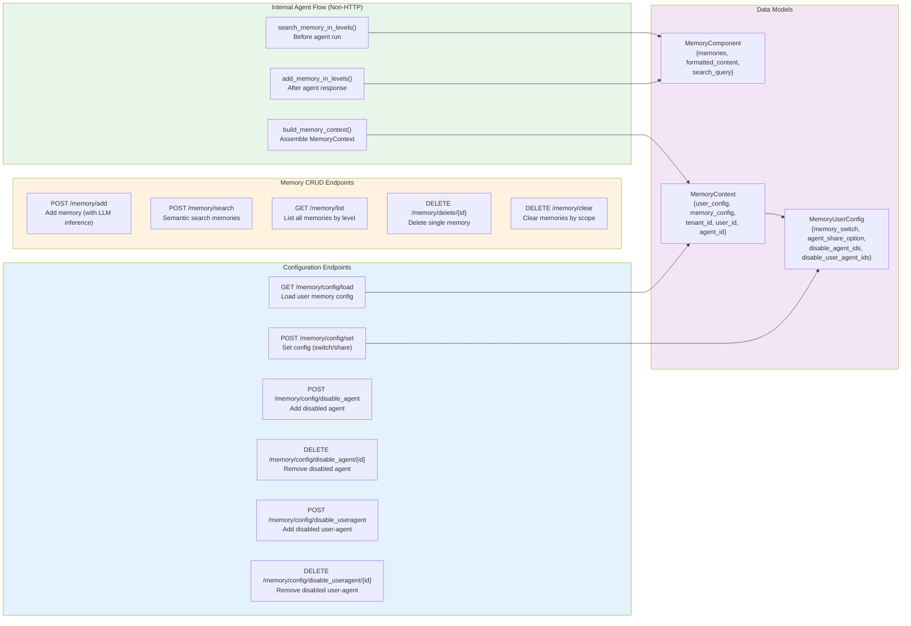

```mermaid
graph LR
    subgraph ConfigAPI["Configuration Endpoints"]
        LOAD["GET /memory/config/load<br/>Load user memory config"]
        SET["POST /memory/config/set<br/>Set config (switch/share)"]
        DIS_A_ADD["POST /memory/config/disable_agent<br/>Add disabled agent"]
        DIS_A_REM["DELETE /memory/config/disable_agent/{id}<br/>Remove disabled agent"]
        DIS_UA_ADD["POST /memory/config/disable_useragent<br/>Add disabled user-agent"]
        DIS_UA_REM["DELETE /memory/config/disable_useragent/{id}<br/>Remove disabled user-agent"]
    end

    subgraph CRUDAPI["Memory CRUD Endpoints"]
        ADD["POST /memory/add<br/>Add memory (with LLM inference)"]
        SEARCH["POST /memory/search<br/>Semantic search memories"]
        LIST["GET /memory/list<br/>List all memories by level"]
        DEL["DELETE /memory/delete/{id}<br/>Delete single memory"]
        CLEAR["DELETE /memory/clear<br/>Clear memories by scope"]
    end

    subgraph InternalFlow["Internal Agent Flow (Non-HTTP)"]
        PRE_SEARCH["search_memory_in_levels()<br/>Before agent run"]
        POST_ADD["add_memory_in_levels()<br/>After agent response"]
        BUILD_CTX["build_memory_context()<br/>Assemble MemoryContext"]
    end

    subgraph DataModels["Data Models"]
        MEM_CTX["MemoryContext<br/>{user_config, memory_config,<br/>tenant_id, user_id, agent_id}"]
        MEM_UC["MemoryUserConfig<br/>{memory_switch, agent_share_option,<br/>disable_agent_ids, disable_user_agent_ids}"]
        MEM_COMP["MemoryComponent<br/>{memories, formatted_content,<br/>search_query}"]
    end

    LOAD --> MEM_CTX
    SET --> MEM_UC
    BUILD_CTX --> MEM_CTX
    MEM_CTX --> MEM_UC

    PRE_SEARCH --> MEM_COMP
    POST_ADD --> MEM_COMP

    style ConfigAPI fill:#e3f2fd
    style CRUDAPI fill:#fff3e0
    style InternalFlow fill:#e8f5e9
    style DataModels fill:#f3e5f5
```
