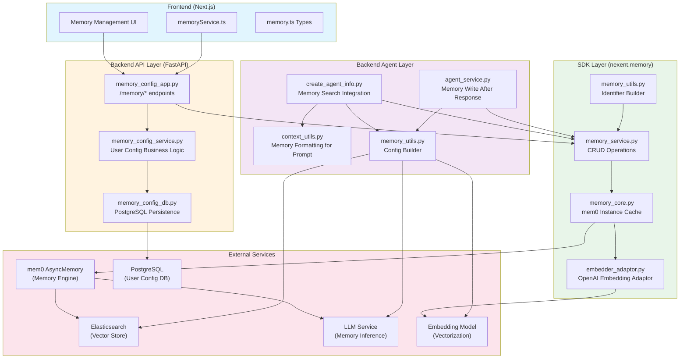

```mermaid
graph TB
    subgraph Frontend["Frontend (Next.js)"]
        UI["Memory Management UI"]
        MS["memoryService.ts"]
        MT["memory.ts Types"]
    end

    subgraph BackendAPI["Backend API Layer (FastAPI)"]
        APP["memory_config_app.py<br/>/memory/* endpoints"]
        CFG_SVC["memory_config_service.py<br/>User Config Business Logic"]
        CFG_DB["memory_config_db.py<br/>PostgreSQL Persistence"]
    end

    subgraph BackendAgent["Backend Agent Layer"]
        CREATE["create_agent_info.py<br/>Memory Search Integration"]
        AGENT_SVC["agent_service.py<br/>Memory Write After Response"]
        CTX_UTILS["context_utils.py<br/>Memory Formatting for Prompt"]
        MEM_UTILS["memory_utils.py<br/>Config Builder"]
    end

    subgraph SDK["SDK Layer (nexent.memory)"]
        SVC["memory_service.py<br/>CRUD Operations"]
        CORE["memory_core.py<br/>mem0 Instance Cache"]
        UTILS["memory_utils.py<br/>Identifier Builder"]
        EMB["embedder_adaptor.py<br/>OpenAI Embedding Adaptor"]
    end

    subgraph External["External Services"]
        MEM0["mem0 AsyncMemory<br/>(Memory Engine)"]
        ES["Elasticsearch<br/>(Vector Store)"]
        LLM["LLM Service<br/>(Memory Inference)"]
        EMB_SVC["Embedding Model<br/>(Vectorization)"]
        PG["PostgreSQL<br/>(User Config DB)"]
    end

    UI --> APP
    MS --> APP
    APP --> CFG_SVC
    CFG_SVC --> CFG_DB
    CFG_DB --> PG

    APP --> SVC
    CREATE --> SVC
    AGENT_SVC --> SVC

    CREATE --> CTX_UTILS
    CREATE --> MEM_UTILS
    AGENT_SVC --> MEM_UTILS

    SVC --> CORE
    CORE --> MEM0
    CORE --> EMB
    UTILS --> SVC

    MEM0 --> ES
    MEM0 --> LLM
    EMB --> EMB_SVC

    MEM_UTILS --> ES
    MEM_UTILS --> LLM
    MEM_UTILS --> EMB_SVC

    style Frontend fill:#e1f5fe
    style BackendAPI fill:#fff3e0
    style BackendAgent fill:#f3e5f5
    style SDK fill:#e8f5e9
    style External fill:#fce4ec
```
