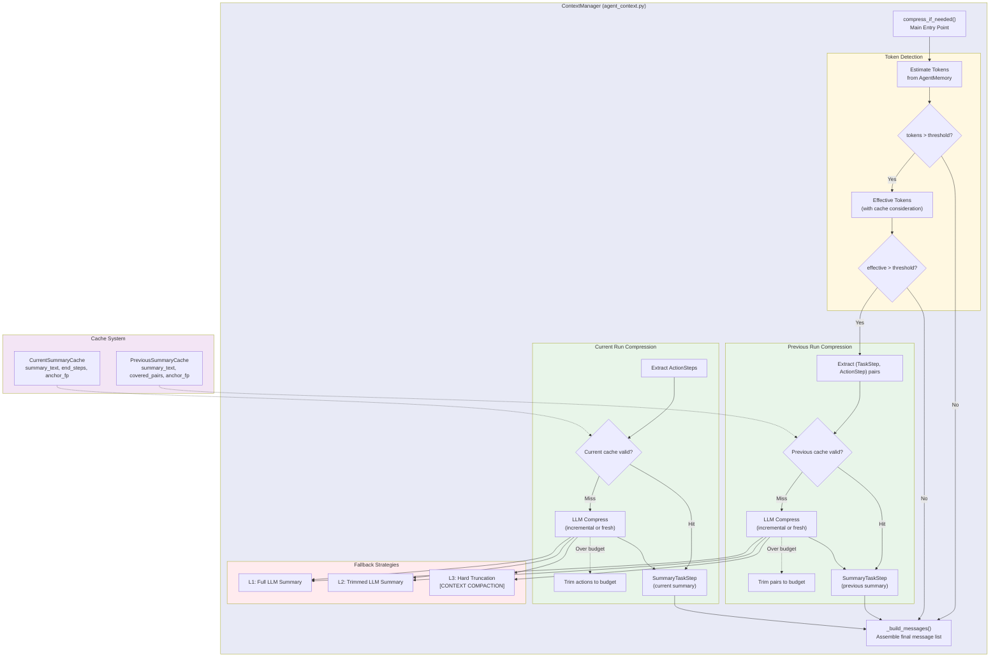

```mermaid
graph TB
    subgraph ContextManager["ContextManager (agent_context.py)"]
        direction TB
        
        ENTRY["compress_if_needed()<br/>Main Entry Point"]
        
        subgraph Detection["Token Detection"]
            EST["Estimate Tokens<br/>from AgentMemory"]
            THRESH{"tokens > threshold?"}
            EFF["Effective Tokens<br/>(with cache consideration)"]
            EFF_THR{"effective > threshold?"}
        end

        subgraph PrevPhase["Previous Run Compression"]
            EXTRACT_P["Extract (TaskStep, ActionStep) pairs"]
            CACHE_P{"Previous cache valid?"}
            COMP_P["LLM Compress<br/>(incremental or fresh)"]
            TRIM_P["Trim pairs to budget"]
            SUMMARY_P["SummaryTaskStep<br/>(previous summary)"]
        end

        subgraph CurrPhase["Current Run Compression"]
            EXTRACT_C["Extract ActionSteps"]
            CACHE_C{"Current cache valid?"}
            COMP_C["LLM Compress<br/>(incremental or fresh)"]
            TRIM_C["Trim actions to budget"]
            SUMMARY_C["SummaryTaskStep<br/>(current summary)"]
        end

        subgraph Fallback["Fallback Strategies"]
            L1["L1: Full LLM Summary"]
            L2["L2: Trimmed LLM Summary"]
            L3["L3: Hard Truncation<br/>[CONTEXT COMPACTION]"]
        end

        BUILD["_build_messages()<br/>Assemble final message list"]
    end

    subgraph CacheSystem["Cache System"]
        PREV_CACHE["PreviousSummaryCache<br/>summary_text, covered_pairs, anchor_fp"]
        CURR_CACHE["CurrentSummaryCache<br/>summary_text, end_steps, anchor_fp"]
    end

    ENTRY --> EST
    EST --> THRESH
    THRESH -->|No| BUILD
    THRESH -->|Yes| EFF
    EFF --> EFF_THR
    EFF_THR -->|No| BUILD
    EFF_THR -->|Yes| EXTRACT_P

    EXTRACT_P --> CACHE_P
    CACHE_P -->|Hit| SUMMARY_P
    CACHE_P -->|Miss| COMP_P
    COMP_P --> SUMMARY_P
    COMP_P -.->|Over budget| TRIM_P

    EXTRACT_C --> CACHE_C
    CACHE_C -->|Hit| SUMMARY_C
    CACHE_C -->|Miss| COMP_C
    COMP_C --> SUMMARY_C
    COMP_C -.->|Over budget| TRIM_C

    COMP_P --> L1
    COMP_P --> L2
    COMP_P --> L3
    COMP_C --> L1
    COMP_C --> L2
    COMP_C --> L3

    SUMMARY_P --> BUILD
    SUMMARY_C --> BUILD

    PREV_CACHE -.-> CACHE_P
    CURR_CACHE -.-> CACHE_C

    style ContextManager fill:#e8eaf6
    style Detection fill:#fff8e1
    style PrevPhase fill:#e8f5e9
    style CurrPhase fill:#e8f5e9
    style Fallback fill:#ffebee
    style CacheSystem fill:#f3e5f5
```
