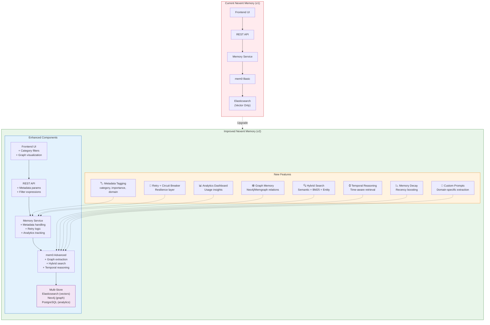

```mermaid
graph TB
    subgraph Current["Current Nexent Memory (v1)"]
        direction TB
        C_UI["Frontend UI"]
        C_API["REST API"]
        C_SVC["Memory Service"]
        C_MEM0["mem0 Basic"]
        C_ES["Elasticsearch<br/>(Vector Only)"]
        
        C_UI --> C_API
        C_API --> C_SVC
        C_SVC --> C_MEM0
        C_MEM0 --> C_ES
    end

    subgraph Improved["Improved Nexent Memory (v2)"]
        direction TB
        
        subgraph Features["New Features"]
            F_META["🏷️ Metadata Tagging<br/>category, importance, domain"]
            F_GRAPH["🕸️ Graph Memory<br/>Neo4j/Memgraph relations"]
            F_HYBRID["🔍 Hybrid Search<br/>Semantic + BM25 + Entity"]
            F_TEMPORAL["⏰ Temporal Reasoning<br/>Time-aware retrieval"]
            F_DECAY["📉 Memory Decay<br/>Recency boosting"]
            F_PROMPT["📝 Custom Prompts<br/>Domain-specific extraction"]
            F_RETRY["🔄 Retry + Circuit Breaker<br/>Resilience layer"]
            F_ANALYTICS["📊 Analytics Dashboard<br/>Usage insights"]
        end

        subgraph Enhanced["Enhanced Components"]
            E_UI["Frontend UI<br/>+ Category filters<br/>+ Graph visualization"]
            E_API["REST API<br/>+ Metadata params<br/>+ Filter expressions"]
            E_SVC["Memory Service<br/>+ Metadata handling<br/>+ Retry logic<br/>+ Analytics tracking"]
            E_MEM0["mem0 Advanced<br/>+ Graph extraction<br/>+ Hybrid search<br/>+ Temporal reasoning"]
            E_STORE["Multi-Store<br/>Elasticsearch (vectors)<br/>Neo4j (graph)<br/>PostgreSQL (analytics)"]
        end

        E_UI --> E_API
        E_API --> E_SVC
        E_SVC --> E_MEM0
        E_MEM0 --> E_STORE
        
        F_META -.-> E_SVC
        F_GRAPH -.-> E_MEM0
        F_HYBRID -.-> E_MEM0
        F_TEMPORAL -.-> E_MEM0
        F_DECAY -.-> E_MEM0
        F_PROMPT -.-> E_MEM0
        F_RETRY -.-> E_SVC
        F_ANALYTICS -.-> E_SVC
    end

    Current -.->|Upgrade| Improved

    style Current fill:#ffebee,stroke:#c62828
    style Improved fill:#e8f5e9,stroke:#2e7d32
    style Features fill:#fff3e0,stroke:#f57c00
    style Enhanced fill:#e3f2fd,stroke:#1565c0
    style E_STORE fill:#f3e5f5,stroke:#6a1b9a
```
