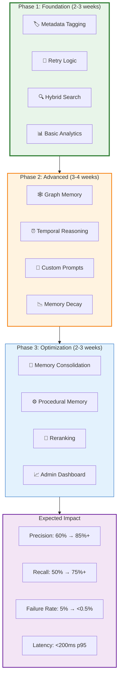

```mermaid
graph TB
    subgraph Phase1["Phase 1: Foundation (2-3 weeks)"]
        P1_1["🏷️ Metadata Tagging"]
        P1_2["🔄 Retry Logic"]
        P1_3["🔍 Hybrid Search"]
        P1_4["📊 Basic Analytics"]
    end

    subgraph Phase2["Phase 2: Advanced (3-4 weeks)"]
        P2_1["🕸️ Graph Memory"]
        P2_2["⏰ Temporal Reasoning"]
        P2_3["📝 Custom Prompts"]
        P2_4["📉 Memory Decay"]
    end

    subgraph Phase3["Phase 3: Optimization (2-3 weeks)"]
        P3_1["🔗 Memory Consolidation"]
        P3_2["⚙️ Procedural Memory"]
        P3_3["🎯 Reranking"]
        P3_4["📈 Admin Dashboard"]
    end

    subgraph Impact["Expected Impact"]
        I1["Precision: 60% → 85%+"]
        I2["Recall: 50% → 75%+"]
        I3["Failure Rate: 5% → <0.5%"]
        I4["Latency: <200ms p95"]
    end

    Phase1 --> Phase2
    Phase2 --> Phase3
    Phase3 --> Impact

    style Phase1 fill:#e8f5e9,stroke:#2e7d32,stroke-width:3px
    style Phase2 fill:#fff3e0,stroke:#f57c00,stroke-width:2px
    style Phase3 fill:#e3f2fd,stroke:#1565c0,stroke-width:1px
    style Impact fill:#f3e5f5,stroke:#6a1b9a,stroke-width:2px
```
