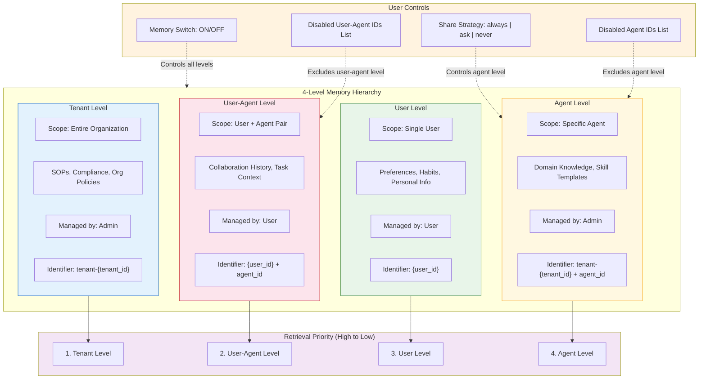

```mermaid
graph TB
    subgraph MemoryLevels["4-Level Memory Hierarchy"]
        direction TB
        
        subgraph Tenant["Tenant Level"]
            T_SCOPE["Scope: Entire Organization"]
            T_DATA["SOPs, Compliance, Org Policies"]
            T_MGR["Managed by: Admin"]
            T_ID["Identifier: tenant-{tenant_id}"]
        end

        subgraph Agent["Agent Level"]
            A_SCOPE["Scope: Specific Agent"]
            A_DATA["Domain Knowledge, Skill Templates"]
            A_MGR["Managed by: Admin"]
            A_ID["Identifier: tenant-{tenant_id} + agent_id"]
        end

        subgraph User["User Level"]
            U_SCOPE["Scope: Single User"]
            U_DATA["Preferences, Habits, Personal Info"]
            U_MGR["Managed by: User"]
            U_ID["Identifier: {user_id}"]
        end

        subgraph UserAgent["User-Agent Level"]
            UA_SCOPE["Scope: User + Agent Pair"]
            UA_DATA["Collaboration History, Task Context"]
            UA_MGR["Managed by: User"]
            UA_ID["Identifier: {user_id} + agent_id"]
        end
    end

    subgraph RetrievalPriority["Retrieval Priority (High to Low)"]
        P1["1. Tenant Level"]
        P2["2. User-Agent Level"]
        P3["3. User Level"]
        P4["4. Agent Level"]
    end

    subgraph UserControls["User Controls"]
        SWITCH["Memory Switch: ON/OFF"]
        SHARE["Share Strategy: always | ask | never"]
        DISABLE_A["Disabled Agent IDs List"]
        DISABLE_UA["Disabled User-Agent IDs List"]
    end

    Tenant --> P1
    UserAgent --> P2
    User --> P3
    Agent --> P4

    SWITCH -.->|Controls all levels| MemoryLevels
    SHARE -.->|Controls agent level| Agent
    DISABLE_A -.->|Excludes agent level| Agent
    DISABLE_UA -.->|Excludes user-agent level| UserAgent

    style Tenant fill:#e3f2fd,stroke:#1565c0
    style Agent fill:#fff8e1,stroke:#f9a825
    style User fill:#e8f5e9,stroke:#2e7d32
    style UserAgent fill:#fce4ec,stroke:#c62828
    style RetrievalPriority fill:#f3e5f5
    style UserControls fill:#fff3e0
```
