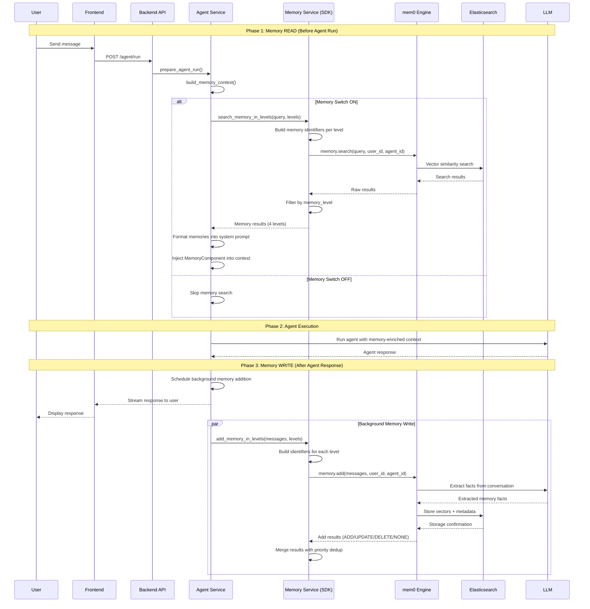

```mermaid
sequenceDiagram
    participant User
    participant Frontend
    participant API as Backend API
    participant AgentSvc as Agent Service
    participant MemSvc as Memory Service (SDK)
    participant Mem0 as mem0 Engine
    participant ES as Elasticsearch
    participant LLM

    Note over User,LLM: Phase 1: Memory READ (Before Agent Run)

    User->>Frontend: Send message
    Frontend->>API: POST /agent/run
    API->>AgentSvc: prepare_agent_run()
    AgentSvc->>AgentSvc: build_memory_context()
    
    alt Memory Switch ON
        AgentSvc->>MemSvc: search_memory_in_levels(query, levels)
        MemSvc->>MemSvc: Build memory identifiers per level
        MemSvc->>Mem0: memory.search(query, user_id, agent_id)
        Mem0->>ES: Vector similarity search
        ES-->>Mem0: Search results
        Mem0-->>MemSvc: Raw results
        MemSvc->>MemSvc: Filter by memory_level
        MemSvc-->>AgentSvc: Memory results (4 levels)
        AgentSvc->>AgentSvc: Format memories into system prompt
        AgentSvc->>AgentSvc: Inject MemoryComponent into context
    else Memory Switch OFF
        AgentSvc->>AgentSvc: Skip memory search
    end

    Note over User,LLM: Phase 2: Agent Execution

    AgentSvc->>LLM: Run agent with memory-enriched context
    LLM-->>AgentSvc: Agent response

    Note over User,LLM: Phase 3: Memory WRITE (After Agent Response)

    AgentSvc->>AgentSvc: Schedule background memory addition
    AgentSvc-->>Frontend: Stream response to user
    Frontend-->>User: Display response
    
    par Background Memory Write
        AgentSvc->>MemSvc: add_memory_in_levels(messages, levels)
        MemSvc->>MemSvc: Build identifiers for each level
        MemSvc->>Mem0: memory.add(messages, user_id, agent_id)
        Mem0->>LLM: Extract facts from conversation
        LLM-->>Mem0: Extracted memory facts
        Mem0->>ES: Store vectors + metadata
        ES-->>Mem0: Storage confirmation
        Mem0-->>MemSvc: Add results (ADD/UPDATE/DELETE/NONE)
        MemSvc->>MemSvc: Merge results with priority dedup
    end
```
