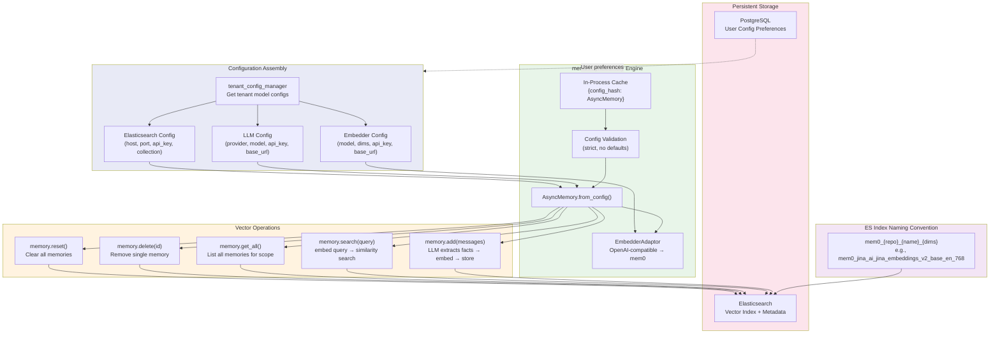

```mermaid
graph TB
    subgraph ConfigBuild["Configuration Assembly"]
        TCM["tenant_config_manager<br/>Get tenant model configs"]
        LLM_CFG["LLM Config<br/>(provider, model, api_key, base_url)"]
        EMB_CFG["Embedder Config<br/>(model, dims, api_key, base_url)"]
        ES_CFG["Elasticsearch Config<br/>(host, port, api_key, collection)"]
        
        TCM --> LLM_CFG
        TCM --> EMB_CFG
        TCM --> ES_CFG
    end

    subgraph IndexNaming["ES Index Naming Convention"]
        IDX["mem0_{repo}_{name}_{dims}<br/>e.g., mem0_jina_ai_jina_embeddings_v2_base_en_768"]
    end

    subgraph Mem0Engine["mem0 AsyncMemory Engine"]
        CACHE["In-Process Cache<br/>{config_hash: AsyncMemory}"]
        VALIDATE["Config Validation<br/>(strict, no defaults)"]
        FACTORY["AsyncMemory.from_config()"]
        ADAPTOR["EmbedderAdaptor<br/>OpenAI-compatible → mem0"]
        
        CACHE --> VALIDATE
        VALIDATE --> FACTORY
        FACTORY --> ADAPTOR
    end

    subgraph VectorOps["Vector Operations"]
        ADD["memory.add(messages)<br/>LLM extracts facts → embed → store"]
        SEARCH["memory.search(query)<br/>embed query → similarity search"]
        LIST["memory.get_all()<br/>List all memories for scope"]
        DELETE["memory.delete(id)<br/>Remove single memory"]
        RESET["memory.reset()<br/>Clear all memories"]
    end

    subgraph Storage["Persistent Storage"]
        ES_STORE["Elasticsearch<br/>Vector Index + Metadata"]
        PG_STORE["PostgreSQL<br/>User Config Preferences"]
    end

    LLM_CFG --> FACTORY
    EMB_CFG --> ADAPTOR
    ES_CFG --> FACTORY
    IDX --> ES_STORE

    FACTORY --> ADD
    FACTORY --> SEARCH
    FACTORY --> LIST
    FACTORY --> DELETE
    FACTORY --> RESET

    ADD --> ES_STORE
    SEARCH --> ES_STORE
    LIST --> ES_STORE
    DELETE --> ES_STORE
    RESET --> ES_STORE

    PG_STORE -.->|User preferences| ConfigBuild

    style ConfigBuild fill:#e8eaf6
    style Mem0Engine fill:#e8f5e9
    style VectorOps fill:#fff3e0
    style Storage fill:#fce4ec
    style IndexNaming fill:#f3e5f5
```
