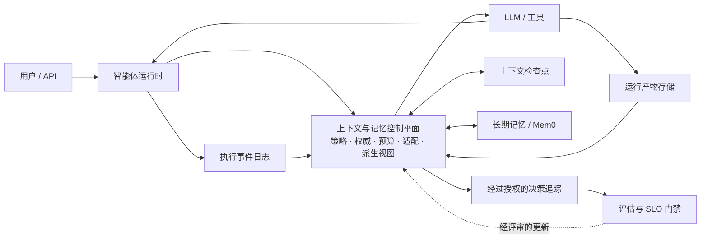

```mermaid
flowchart LR
    U["用户 / API"] --> R["智能体运行时"]
    R --> CP["上下文与记忆控制平面<br/>策略 · 权威 · 预算 · 适配 · 派生视图"]
    CP --> X["LLM / 工具"]
    X --> R

    R --> LOG["执行事件日志"]
    LOG --> CP

    CP <--> CK["上下文检查点"]
    CP <--> MEM["长期记忆 / Mem0"]
    X --> ART["运行产物存储"]
    ART --> CP

    CP --> TRACE["经过授权的决策追踪"]
    TRACE --> SLO["评估与 SLO 门禁"]
    SLO -. "经评审的更新" .-> CP
```
