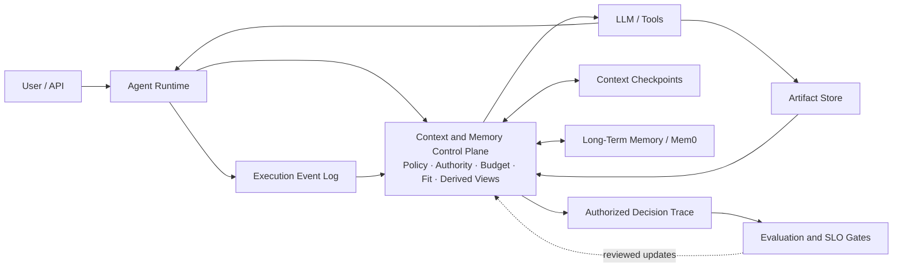

```mermaid
flowchart LR
    U["User / API"] --> R["Agent Runtime"]
    R --> CP["Context and Memory Control Plane<br/>Policy · Authority · Budget · Fit · Derived Views"]
    CP --> X["LLM / Tools"]
    X --> R

    R --> LOG["Execution Event Log"]
    LOG --> CP

    CP <--> CK["Context Checkpoints"]
    CP <--> MEM["Long-Term Memory / Mem0"]
    X --> ART["Artifact Store"]
    ART --> CP

    CP --> TRACE["Authorized Decision Trace"]
    TRACE --> SLO["Evaluation and SLO Gates"]
    SLO -. "reviewed updates" .-> CP
```
