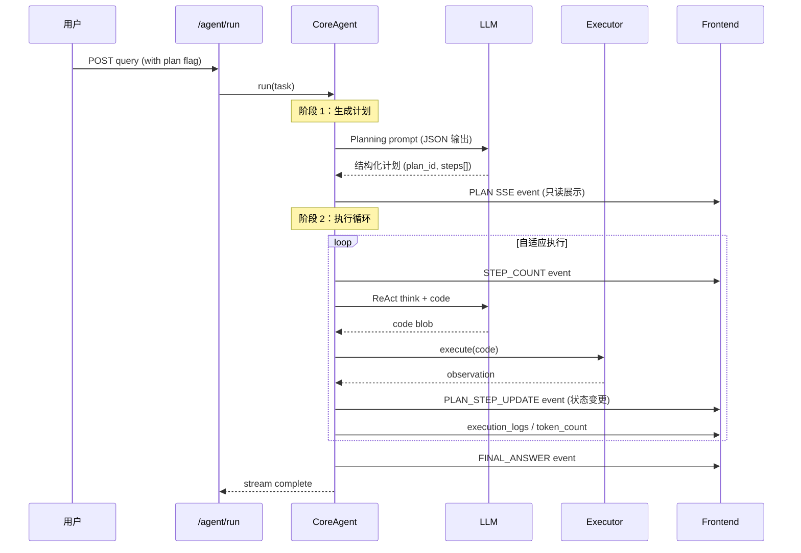

# Agent 计划功能设计方案

> 文档版本：v1.0
> 日期：2026-06-09

---

## 一、背景与目标

当前智能体（Agent）的执行模式为纯 ReAct 循环：接收任务后直接进入"思考 - 代码执行 - 观察"循环，直至得出最终答案。这种模式在简单任务上效率很高，但存在以下问题：

- **缺乏全局视角**：Agent 每一步都只看到当前状态，无法预判后续步骤，容易做重复工作或遗漏关键步骤。
- **用户不可见**：Agent 的执行过程对用户黑盒，用户无法预知任务会被分解为哪些步骤，任务复杂时体验不佳。
- **无法干预**：用户在中途发现方向偏差时，无法调整执行计划。

因此，引入**计划（Planning）**机制：Agent 在正式执行前，先对任务进行分解，生成结构化的任务计划并展示给用户（只读），然后按计划逐步执行。

---

## 二、设计决策

在进入详细设计前，先明确几个关键决策：

| 决策项 | 选项 | 选择 | 理由 |
|--------|------|------|------|
| 触发方式 | 每次任务 / 自动检测复杂度 / 用户按钮触发 | **用户按钮触发** | 避免对简单任务增加不必要的延迟 |
| 计划可见性 | 隐藏（仅 Agent 内部）/ 只读展示 / 可编辑 | **只读展示** | 用户可见但不能随意修改，保证执行方向可控 |
| 步骤粒度 | 纯文本步骤列表 / 带有状态的富结构 | **带状态的富结构** | 需要支持"已完成/进行中/跳过"等状态更新 |
| 执行顺序 | 严格顺序 / 自适应（可跳过/重排） | **自适应** | Agent 可根据实际执行上下文调整，跳过不必要的步骤 |

---

## 三、整体架构

### 3.1 执行流程

```mermaid
flowchart TD
    User([用户]) --> API[/agent/run]

    subgraph SDK
        CA[CoreAgent.run]
        PP[Planning Phase<br/>生成计划]
        EL[Execution Loop<br/>ReAct 执行循环]
        FA[FinalAnswer]
    end

    subgraph SSE_Events
        PE[PLAN event<br/>计划展示给用户]
        SE[STEP_COUNT event<br/>当前步骤]
        UE[PLAN_STEP_UPDATE event<br/>步骤状态更新]
        FE[FINAL_ANSWER event]
    end

    API --> CA
    CA --> PP
    PP -->|emit PLAN| PE
    PE -->|SSE| FE_UI[Frontend: 计划面板]
    PP -->|step_number=1| EL
    EL -->|emit| SE
    EL -->|emit| UE
    EL --> FA

    FE_UI --> EL
```

**序列图：**



### 3.2 计划数据模型

```python
class PlanStep(BaseModel):
    id: str                           # 唯一标识，如 "step-1"
    title: str                        # 简短标题
    description: str                   # 详细描述
    status: Literal["pending", "in_progress", "completed", "skipped"] = "pending"

class AgentPlan(BaseModel):
    plan_id: str                      # 计划唯一 ID
    title: str                        # 计划标题（从任务中提取）
    steps: List[PlanStep]             # 有序步骤列表
    current_step_index: int = 0       # 当前执行到的步骤索引
```

### 3.3 SSE 事件扩展

新增两种事件类型：

| 事件类型 | 触发时机 | 内容格式 | 前端行为 |
|----------|----------|----------|----------|
| `plan` | 计划生成后、执行循环前 | JSON: `{plan_id, title, steps[]}` | 渲染只读计划面板 |
| `plan_step_update` | 每步执行完成后 | JSON: `{step_id, status}` | 更新对应步骤状态图标 |

---

## 四、详细设计

### 4.1 SDK 层 —— `observer.py`

**文件：** `sdk/nexent/core/utils/observer.py`

新增 `ProcessType` 枚举值：

```python
# ProcessType 枚举，添加在 MAX_STEPS_REACHED 之后
PLAN = "plan"                      # 结构化计划 JSON
PLAN_STEP_UPDATE = "plan_step_update"  # 单个计划步骤的状态更新
```

在 `_init_message_transformers` 中注册：

```python
ProcessType.PLAN: default_transformer,
ProcessType.PLAN_STEP_UPDATE: default_transformer,
```

### 4.2 SDK 层 —— `agent_model.py`

**文件：** `sdk/nexent/core/agents/agent_model.py`

新增两个 Pydantic 模型：

```python
from typing import Literal, List
from pydantic import BaseModel, Field

class PlanStep(BaseModel):
    id: str = Field(description="唯一步骤 ID，如 'step-1'")
    title: str = Field(description="简短步骤标题")
    description: str = Field(description="步骤详细描述")
    status: Literal["pending", "in_progress", "completed", "skipped"] = "pending"

class AgentPlan(BaseModel):
    plan_id: str = Field(description="计划唯一 ID")
    title: str = Field(description="从任务中提取的计划标题")
    steps: List[PlanStep] = Field(description="有序步骤列表")
    current_step_index: int = 0
```

### 4.3 SDK 层 —— `core_agent.py`

**文件：** `sdk/nexent/core/agents/core_agent.py`

#### 4.3.1 修改 `_run_stream`

在主循环开始前，插入计划生成阶段：

```python
def _run_stream(self, task: str, ...):
    # === 计划生成阶段 ===
    plan = self._generate_plan(task)  # 同步调用 LLM 生成计划

    plan_json = json.dumps({
        "plan_id": plan.plan_id,
        "title": plan.title,
        "steps": [s.model_dump() for s in plan.steps]
    }, ensure_ascii=False)
    self.observer.add_message(self.agent_name, ProcessType.PLAN, plan_json)
    self._write_plan_to_memory(plan)

    # === 执行循环阶段（原有逻辑不变）===
    self.step_number = 1
    while not returned_final_answer and self.step_number <= max_steps and not self.stop_event.is_set():
        ...
```

#### 4.3.2 新增 `_generate_plan` 方法

```python
def _generate_plan(self, task: str) -> AgentPlan:
    """使用 LLM 生成结构化任务计划。"""
    import uuid
    planning_prompt = self._build_planning_prompt(task)
    messages = [ChatMessage(role=MessageRole.USER, content=planning_prompt)]
    response = self.model(messages)
    return self._parse_plan_response(response.content, task)

def _build_planning_prompt(self, task: str) -> str:
    """构建计划生成提示词，要求 LLM 输出 JSON 格式的计划。"""
    lang = getattr(self, 'lang', 'en')
    if lang == 'zh':
        return (
            f"你是一个任务规划助手。请将以下用户任务分解为 3-8 个逻辑清晰的步骤。\n"
            f"用户任务：{task}\n\n"
            f"请严格按照以下 JSON 格式输出计划，不要输出任何其他内容：\n"
            f'{{"plan_id": "自动生成的UUID", "title": "简短计划标题", "steps": ['
            f'{{"id": "step-1", "title": "步骤1标题", "description": "详细描述", "status": "pending"}}, ...]}}\n\n'
            f"要求：\n"
            f"- 每个步骤应可独立执行\n"
            f"- 步骤之间应有清晰的逻辑顺序\n"
            f"- 描述要具体，避免模糊表述"
        )
    else:
        return (
            f"You are a task planning assistant. Decompose the following user task into 3-8 logical steps.\n"
            f"User task: {task}\n\n"
            f"Output ONLY the JSON plan in this exact format, nothing else:\n"
            f'{{"plan_id": "auto-generated-uuid", "title": "short plan title", "steps": ['
            f'{{"id": "step-1", "title": "Step 1 title", "description": "Detailed description", "status": "pending"}}, ...]}}\n\n'
            f"Requirements:\n"
            f"- Each step should be independently actionable\n"
            f"- Steps should follow a clear logical order\n"
            f"- Descriptions must be specific"
        )

def _parse_plan_response(self, content: str, task: str) -> AgentPlan:
    """解析 LLM 响应为 AgentPlan，解析失败时降级为单步计划。"""
    import uuid
    try:
        # 尝试从 LLM 输出中提取 JSON（处理 Markdown 代码块包裹的情况）
        import re
        json_match = re.search(r'\{.*\}', content, re.DOTALL)
        if json_match:
            data = json.loads(json_match.group())
        else:
            data = json.loads(content)
        return AgentPlan(**data)
    except Exception:
        # 降级：创建单步计划
        return AgentPlan(
            plan_id=str(uuid.uuid4()),
            title=task[:50] if len(task) > 50 else task,
            steps=[PlanStep(
                id="step-1",
                title="执行任务",
                description=task,
                status="pending"
            )]
        )
```

#### 4.3.3 新增计划步骤状态更新

在 `_step_stream` 的每次迭代完成后，根据执行结果更新计划步骤状态：

```python
def _determine_step_completion(self, step_index: int, code_output) -> Optional[PlanStep]:
    """根据执行输出判断当前步骤是否完成。"""
    # 当前实现：每执行一步，标记对应计划步骤为 completed
    # 自适应逻辑：Agent 可在代码中输出特殊标记来跳过步骤
    if self.current_plan and step_index < len(self.current_plan.steps):
        step = self.current_plan.steps[step_index]
        # 检查 code_output 中是否包含跳过标记
        output_str = str(getattr(code_output, 'output', ''))
        if "__SKIP_STEP__" in output_str:
            step.status = "skipped"
        else:
            step.status = "completed"
        return step
    return None
```

在 `_step_stream` 执行完成后调用：

```python
# _step_stream 末尾，在 yield ActionOutput 之后
updated_step = self._determine_step_completion(self.step_number - 1, code_output)
if updated_step:
    self.observer.add_message(
        self.agent_name, ProcessType.PLAN_STEP_UPDATE,
        json.dumps({"step_id": updated_step.id, "status": updated_step.status})
    )
```

### 4.4 系统提示词 —— YAML 模板

**文件：**
- `backend/prompts/managed_system_prompt_template_zh.yaml`
- `backend/prompts/managed_system_prompt_template_en.yaml`

当前 `planning:` 部分为空，填充内容：

```yaml
planning:
  initial_plan: |-
    你是一个任务规划助手。用户提交任务后，你需要先分解任务，再执行。
    请将任务分解为 3-8 个逻辑清晰的步骤，并输出 JSON 格式的计划。

    **输出格式要求：**
    必须严格按以下 JSON 格式输出计划，不要在 JSON 前后添加任何解释性文字：
    {
      "plan_id": "自动生成的UUID字符串",
      "title": "简短的计划标题（不超过30字）",
      "steps": [
        {
          "id": "step-1",
          "title": "步骤1的简短标题",
          "description": "该步骤的详细描述，说明要做什么以及如何做",
          "status": "pending"
        },
        ...更多步骤
      ]
    }

    **分解原则：**
    1. 每个步骤应可独立验证完成
    2. 步骤之间保持清晰的依赖顺序
    3. 描述要具体，说明具体操作而非仅重复任务目标
    4. 复杂任务优先分解为"准备 → 分析 → 执行 → 验证"结构
    5. 步骤数量控制在 3-8 个，避免过细（难以管理）或过粗（失去计划价值）

    生成计划后，请立即输出上述 JSON 格式的计划内容。
```

英文版本对应调整为英文提示词。

### 4.5 前端 —— 类型定义

**文件：** `frontend/app/[locale]/chat/types/chat.ts`

```typescript
interface PlanStep {
  id: string;
  title: string;
  description: string;
  status: 'pending' | 'in_progress' | 'completed' | 'skipped';
}

interface AgentPlan {
  plan_id: string;
  title: string;
  steps: PlanStep[];
  current_step_index: number;
}
```

在 `ChatMessageType` 接口中扩展：

```typescript
interface ChatMessageType {
  // ... 现有字段
  plan?: AgentPlan;
  planVisible?: boolean;
}
```

### 4.6 前端 —— 消息配置

**文件：** `frontend/lib/config/chatConfig.ts`（或对应配置文件）

```typescript
export const MESSAGE_TYPES = {
  // ... 现有类型
  PLAN: 'plan',
  PLAN_STEP_UPDATE: 'plan_step_update',
} as const;
```

### 4.7 前端 —— 事件处理

**文件：** `frontend/app/[locale]/chat/streaming/chatStreamHandler.tsx`

新增两个 `case` 分支：

```typescript
// PLAN 事件处理（约在 MAX_STEPS_REACHED 之后添加）
case chatConfig.messageTypes.PLAN:
  try {
    const planData = JSON.parse(messageContent);
    updatedMsg.plan = planData;
    updatedMsg.planVisible = true;
  } catch {
    // 解析失败，忽略该事件
  }
  break;

// PLAN_STEP_UPDATE 事件处理
case chatConfig.messageTypes.PLAN_STEP_UPDATE:
  try {
    const stepUpdate = JSON.parse(messageContent);
    if (updatedMsg.plan && updatedMsg.plan.steps) {
      const step = updatedMsg.plan.steps.find(
        (s: PlanStep) => s.id === stepUpdate.step_id
      );
      if (step) {
        step.status = stepUpdate.status;
      }
    }
  } catch {
    // 解析失败，忽略
  }
  break;
```

### 4.8 前端 —— 计划面板组件

**文件：** `frontend/components/chat/PlanPanel.tsx`（新建）

```tsx
import React from 'react';
import { CheckCircle, Circle, Loader2, SkipForward } from 'lucide-react';

interface PlanStepProps {
  step: {
    id: string;
    title: string;
    description: string;
    status: 'pending' | 'in_progress' | 'completed' | 'skipped';
  };
  index: number;
}

const StatusIcon: React.FC<{ status: string }> = ({ status }) => {
  switch (status) {
    case 'completed':
      return <CheckCircle className="w-4 h-4 text-green-500 shrink-0" />;
    case 'in_progress':
      return <Loader2 className="w-4 h-4 text-blue-500 shrink-0 animate-spin" />;
    case 'skipped':
      return <SkipForward className="w-4 h-4 text-gray-400 shrink-0" />;
    default:
      return <Circle className="w-4 h-4 text-gray-300 shrink-0" />;
  }
};

const StepRow: React.FC<PlanStepProps> = ({ step, index }) => {
  const isActive = step.status === 'in_progress';
  return (
    <div
      className={`flex items-start gap-3 py-2 px-3 rounded-md transition-colors ${
        isActive ? 'bg-blue-50 border border-blue-100' : ''
      }`}
    >
      <StatusIcon status={step.status} />
      <div className="flex-1 min-w-0">
        <div className="flex items-center gap-2">
          <span className="text-sm font-medium text-gray-700">
            {index + 1}. {step.title}
          </span>
          {isActive && (
            <span className="text-xs bg-blue-100 text-blue-600 px-1.5 py-0.5 rounded">
              进行中
            </span>
          )}
        </div>
        <p className="text-xs text-gray-500 mt-0.5 line-clamp-2">
          {step.description}
        </p>
      </div>
    </div>
  );
};

interface PlanPanelProps {
  plan: {
    plan_id: string;
    title: string;
    steps: Array<{
      id: string;
      title: string;
      description: string;
      status: 'pending' | 'in_progress' | 'completed' | 'skipped';
    }>;
  };
}

const PlanPanel: React.FC<PlanPanelProps> = ({ plan }) => {
  const completedCount = plan.steps.filter(
    (s) => s.status === 'completed' || s.status === 'skipped'
  ).length;
  const progress = Math.round((completedCount / plan.steps.length) * 100);

  return (
    <div className="plan-panel border border-gray-200 rounded-lg overflow-hidden mb-4 bg-white">
      <div className="px-4 py-3 border-b border-gray-100 bg-gray-50">
        <div className="flex items-center justify-between">
          <h3 className="font-semibold text-sm text-gray-800">
            {plan.title || '任务计划'}
          </h3>
          <span className="text-xs text-gray-500">
            {completedCount} / {plan.steps.length} 步骤完成
          </span>
        </div>
        <div className="mt-2 h-1.5 bg-gray-200 rounded-full overflow-hidden">
          <div
            className="h-full bg-blue-500 transition-all duration-300"
            style={{ width: `${progress}%` }}
          />
        </div>
      </div>
      <div className="p-2">
        <div className="flex flex-col gap-1">
          {plan.steps.map((step, idx) => (
            <StepRow key={step.id} step={step} index={idx} />
          ))}
        </div>
      </div>
    </div>
  );
};

export default PlanPanel;
```

### 4.9 前端 —— 集成到消息渲染

**文件：** `frontend/app/[locale]/chat/streaming/chatStreamFinalMessage.tsx`

在消息渲染的适当位置（assistant 消息内、steps 之前）加入计划面板：

```tsx
{/* 计划面板：只读展示 */}
{message.plan && message.planVisible && (
  <PlanPanel plan={message.plan} />
)}

{/* 原有步骤列表 */}
{message.steps && message.steps.length > 0 && (
  <div className="steps-container">
    {message.steps.map((step) => (
      <AgentStep key={step.id} step={step} />
    ))}
  </div>
)}
```

---

## 五、文件变更清单

| 层级 | 文件路径 | 变更类型 | 变更内容 |
|------|----------|----------|----------|
| SDK | `sdk/nexent/core/utils/observer.py` | 修改 | 新增 `PLAN` 和 `PLAN_STEP_UPDATE` 枚举值及 transformer 注册 |
| SDK | `sdk/nexent/core/agents/agent_model.py` | 修改 | 新增 `PlanStep` 和 `AgentPlan` Pydantic 模型 |
| SDK | `sdk/nexent/core/agents/core_agent.py` | 修改 | `_run_stream` 插入计划阶段；新增 `_generate_plan`、`_parse_plan_response`、`_determine_step_completion` 方法 |
| 提示词 | `backend/prompts/managed_system_prompt_template_zh.yaml` | 修改 | 填充 `planning.initial_plan` 中文提示词 |
| 提示词 | `backend/prompts/managed_system_prompt_template_en.yaml` | 修改 | 填充 `planning.initial_plan` 英文提示词 |
| 前端 | `frontend/lib/config/chatConfig.ts` | 修改 | 新增 `PLAN` 和 `PLAN_STEP_UPDATE` 消息类型 |
| 前端 | `frontend/app/[locale]/chat/types/chat.ts` | 修改 | 新增 `PlanStep` 和 `AgentPlan` TypeScript 类型，扩展 `ChatMessageType` |
| 前端 | `frontend/app/[locale]/chat/streaming/chatStreamHandler.tsx` | 修改 | 处理 `PLAN` 和 `PLAN_STEP_UPDATE` SSE 事件 |
| 前端 | `frontend/components/chat/PlanPanel.tsx` | 新建 | 计划面板组件（带状态图标和进度条） |
| 前端 | `frontend/app/[locale]/chat/streaming/chatStreamFinalMessage.tsx` | 修改 | 渲染 `PlanPanel` 组件 |

---

## 六、关键设计要点

### 6.1 自适应执行

Agent 在执行过程中可以根据实际上下文跳过或调整计划步骤。具体方式：

1. **Agent 在代码输出中包含 `__SKIP_STEP__:step-3`** —— 标记 step-3 被跳过。
2. **`_determine_step_completion`** 检测该标记，将对应步骤状态设为 `skipped`，并通过 `PLAN_STEP_UPDATE` 事件通知前端。
3. 后续步骤自动递补，执行逻辑不受影响。

### 6.2 降级策略

- **LLM 无法生成有效 JSON**：降级为单步计划（整个任务作为一个步骤），执行流程不受影响。
- **前端解析 PLAN 事件失败**：静默忽略，不阻塞执行循环。

### 6.3 性能考量

- 计划生成阶段额外增加 **1 次 LLM 调用**，对于简单任务影响约 0.5-2 秒延迟（取决于模型）。此开销通过**用户主动触发**来控制，避免对所有任务都增加延迟。
- 计划 JSON 数据量小（通常 < 2KB），通过 SSE 传输无压力。

### 6.4 兼容性

- `AgentRunInfo` 和 `AgentConfig` 模型无需修改 —— 计划机制完全由 `CoreAgent._run_stream` 内部实现，对外接口保持不变。
- 现有的 `STEP_COUNT`、`execution_logs`、`token_count` 等事件不受影响。
- 未开启计划功能时，执行流程与之前完全一致。

---

## 七、待确认事项

以下事项需要在开发前与团队确认：

1. **触发方式的最终确定**：当前设计为用户按钮触发。是否需要在 `AgentRequest` 中增加 `enable_plan?: boolean` 字段？还是通过智能体配置（agent 级别）来控制？
2. **计划持久化**：是否需要将生成的计划保存到数据库（用于后续审计或回放）？
3. **计划与子 Agent**：当存在子 Agent（managed_agents）时，计划是否也需要覆盖子 Agent 的执行？当前设计仅覆盖主 Agent 循环。
4. **多轮对话中的计划**：在同一个 conversation 中，用户发送多条消息时，每次消息都重新生成计划，还是只在第一轮生成一次？
