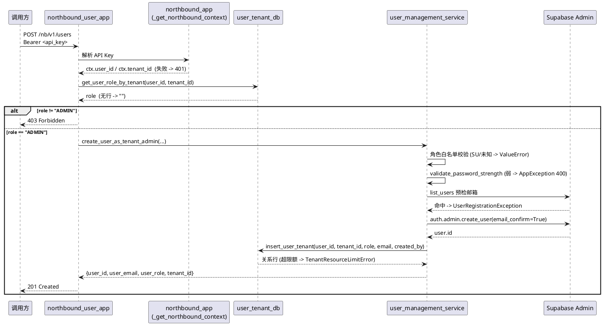
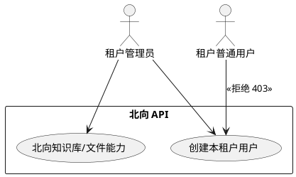
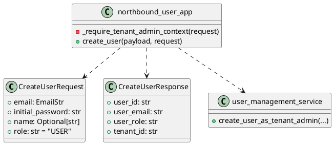

# 北向创建用户接口（仅租户管理员）— 设计文档

> 变更名：`nb-create-user-tenant-admin`
> 流程模式：Full
> 关联 Issue：https://github.com/ModelEngine-Group/nexent/issues/3822
> 关联 proposal：`openspec/nb-create-user-tenant-admin/proposal.md`
> 基准代码：`origin/develop` @ `86d75923d`

## 1. 方案概述

- **业务背景**：北向 API 缺少用户管理端点，租户管理员只能通过邀请码间接开通账号。
- **需求目标**：提供 `POST /nb/v1/users`，租户管理员可直接创建本租户用户。
- **需求范围**：新增 1 个北向 app 文件、1 个服务函数、2 处测试，并注册路由；不触碰既有注册流程。

整体做法：新增独立北向 app `backend/apps/northbound_user_app.py`，复用既有
`_get_northbound_context` 解析 API Key，再用 `get_user_role_by_tenant` 校验调用者在本租户
为 `ADMIN`（否则 403）；新用户走 Supabase Admin 创建（`email_confirm=True`）+ `insert_user_tenant`
写入租户关系。

## 2. 功能需求

### 2.1 核心功能

- **创建用户**
  服务函数 `create_user_as_tenant_admin()` 依次完成：角色白名单校验 → 密码强度校验 →
  邮箱存在预检 → `auth.admin.create_user` → `insert_user_tenant` → 返回新用户摘要。
- **权限门禁**
  `_require_tenant_admin_context(request)`：先取 `ctx`，再查角色，非 `ADMIN` 抛 403。

### 2.2 流程描述



### 2.3 权限设计

- **角色清单**：`SU` / `ADMIN` / `DEV` / `USER`（`backend/database/user_tenant_db.py` 约定）
- **权限矩阵**：见 `proposal.md` §5.2
- **SOD 矩阵**：创建者与被创建者可以是同一人（自管理场景允许）；
  不允许创建 `SU`，避免北向接口成为平台级提权入口 —— 这是本设计唯一的 SOD 硬约束。

## 3. 非功能需求

### 3.1 性能要求
邮箱预检走 Supabase `list_users` 分页扫描（每页 100）。用户量大时为 O(n/100) 次调用，
是本端点主要开销。本期不做缓存（避免引入一致性问题），如成为瓶颈再优化为按邮箱直查。

### 3.2 安全要求
- 角色白名单显式排除 `SU` 与未知值
- 密码不入日志、不入响应
- Supabase 服务角色密钥只经 `get_supabase_admin_client()` 获取

### 3.3 兼容性要求
- 纯新增：不改既有端点、不改既有注册流程、不改数据表结构

### 3.4 依赖的外部要求
- 部署需配置 `SERVICE_ROLE_KEY`（否则 `get_supabase_admin_client()` 返回 None → 500）

## 4. 约束与依赖

### 4.1 技术约束

- **邮箱唯一性是全局的**：Supabase Auth 按邮箱全局唯一，因此"邮箱已被其他租户占用"
  也只能拒绝（409），不能挂到本租户。这是比"租户内唯一"更严格的语义。
- **legacy 异常没有全局 handler**（关键）：
  `backend/apps/app_factory.py:189` 的通用 `Exception` handler 只处理
  `AppException` / `NexentCapabilityError`，其余一律 500。因此
  `TenantResourceLimitError`、`UserRegistrationException`、`ValueError`
  **必须在端点层显式映射**为 HTTPException，不能依赖全局转换。
- **循环依赖**：`user_management_service` 复用 `oauth_service.find_supabase_user_id_by_email`
  时使用函数内惰性 import（与 `oauth_service.py:444` 惰性 import `get_supabase_admin_client` 同风格）。

### 4.2 外部依赖
- Supabase GoTrue Admin API（`auth.admin.create_user` / `auth.admin.list_users`）
- PostgreSQL `user_tenant_t`

## 5. IT 方案设计

### 5.1 用例设计



### 5.2 实体设计
无新增实体。复用 `UserTenant`（`backend/database/db_models.py`）与 Supabase Auth 用户。

### 5.3 数据库设计
无 DDL 变更。`insert_user_tenant` 已承载全部写入与限额校验。

### 5.4 类设计



### 5.5 时序图设计
见 §2.2。

### 5.6 API 设计

```yaml
paths:
  /nb/v1/users:
    post:
      tags: [northbound]
      summary: Create a user in the caller's tenant (tenant admin only)
      security:
        - bearerAuth: []
      requestBody:
        required: true
        content:
          application/json:
            schema:
              type: object
              required: [email, initial_password]
              properties:
                email:
                  type: string
                  format: email
                initial_password:
                  type: string
                  description: ">=8 chars with upper, lower and digit"
                name:
                  type: string
                  nullable: true
                role:
                  type: string
                  enum: [USER, DEV, ADMIN]
                  default: USER
      responses:
        '201':
          description: Created
          content:
            application/json:
              schema:
                type: object
                properties:
                  user_id: { type: string }
                  user_email: { type: string, format: email }
                  user_role: { type: string }
                  tenant_id: { type: string }
        '400': { description: Weak password / invalid role / tenant quota exceeded }
        '401': { description: Invalid or missing API key }
        '403': { description: Caller is not a tenant administrator }
        '409': { description: Email already registered }
        '422': { description: Request validation error }
        '500': { description: Internal error }
```

> 说明：FastAPI 由路由 + Pydantic 模型自动生成 `/openapi.json`，无需手写 swagger 文件。

## 6. 其他设计

### 6.1 端点路径与路由注册

- 新建 `APIRouter(prefix="/nb/v1", tags=["northbound"])`，端点路径 `/users`，
  最终产出 `POST /nb/v1/users`（无尾部斜杠，避免 307 重定向）。
  与 `northbound_app.py:62` 的主 router 同前缀、不同路径，FastAPI 允许且不冲突。
- 在 `backend/apps/northbound_base_app.py` 追加 import 与 `include_router`，
  与现有 `northbound_router` / `northbound_knowledge_router` 并列（该文件第 18-19、52-53 行）。

### 6.2 服务函数签名

```python
async def create_user_as_tenant_admin(
    tenant_id: str,
    email: EmailStr,
    initial_password: str,
    created_by: str,
    name: Optional[str] = None,
    role: str = "USER",
) -> Dict[str, Any]:
```

处理顺序与异常：

| 步骤 | 失败异常 | 端点映射 |
| ---- | -------- | -------- |
| 角色白名单归一化（大写、去空格） | `ValueError`（`SU` 或未知值） | 400 |
| `validate_password_strength` | `AppException(ErrorCode.PROFILE_PASSWORD_WEAK)` | 400（由 `AppException` handler 自动映射） |
| 邮箱预检 `find_supabase_user_id_by_email` | `UserRegistrationException` | 409 |
| `get_supabase_admin_client()` 返回空 | `RuntimeError` | 500 |
| `auth.admin.create_user` 返回无 user | `UserRegistrationException` | 409 |
| `insert_user_tenant` 超限额 | `TenantResourceLimitError` | 400 |
| 其它 | — | 500 |

### 6.3 为什么不用 `_require_asset_owner_context`

`backend/apps/northbound_knowledge_app.py:45` 的 `_require_asset_owner_context` 语义是
"调用者必须属于资产所有者租户"（`ctx.tenant_id == ASSET_OWNER_TENANT_ID`），
与本需求"租户内角色为 ADMIN"不同，故新写 `_require_tenant_admin_context`。

## 7. 涉及文件

| 文件 | 操作 | 说明 |
| ---- | ---- | ---- |
| `backend/apps/northbound_user_app.py` | 新增 | router、`CreateUserRequest`/`CreateUserResponse`、`_require_tenant_admin_context`、`POST /users` 与错误映射 |
| `backend/apps/northbound_base_app.py` | 修改 | 追加 import + `include_router`（2 行） |
| `backend/services/user_management_service.py` | 修改 | 新增 `create_user_as_tenant_admin` |
| `test/backend/app/test_northbound_user_app.py` | 新增 | 端点层单测（参考 `test_northbound_knowledge_app.py` 的 `sys.modules` 打桩风格） |
| `test/backend/services/test_user_management_service.py` | 修改 | 追加服务层单测 |

## 8. 风险 & 缓解

| 风险 | 影响 | 缓解 |
| ---- | ---- | ---- |
| `SERVICE_ROLE_KEY` 未配置 | `get_supabase_admin_client()` 返回 None，全部请求 500 | 显式判空抛 `RuntimeError`，日志可定位；与既有 `oauth_service.py:449` 处理一致 |
| 邮箱预检与创建之间的竞态（TOCTOU） | 并发同邮箱可能穿过预检 | Supabase 唯一约束兜底，异常统一映射 409，语义幂等可接受 |
| 邮箱预检为 O(n/100) 分页扫描 | 用户量大时延迟升高 | 本期接受；后续可换按邮箱直查 |
| 管理员数超限 | 创建 `ADMIN` 失败 | `insert_user_tenant` 内建 `MAX_ADMINS_PER_TENANT` 校验 → 400 |
| 测试拉入重量级依赖链 | 单测启动失败 | 用 `sys.modules` 打桩 `apps.northbound_app` 等模块，与既有北向测试同风格 |

## 9. 附录

### 9.1 原始需求描述

> 提供北向创建用户接口，只有租户管理员才能调用此接口

### 9.2 参考资料

- `backend/apps/northbound_app.py:83` `_get_northbound_context`
- `backend/apps/northbound_knowledge_app.py:38,45` 北向 app 风格参考
- `backend/apps/app_factory.py:70-209` 异常 handler 注册
- `backend/database/user_tenant_db.py:77,159` `get_user_role_by_tenant` / `insert_user_tenant`
- `backend/services/user_management_service.py:595` `validate_password_strength`
- `backend/services/oauth_service.py:371,459` 邮箱预检与 admin 创建范式
- `backend/utils/auth_utils.py:300` `get_supabase_admin_client`
