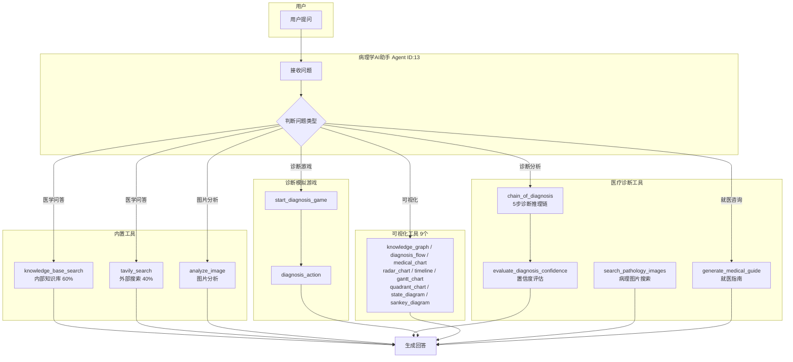
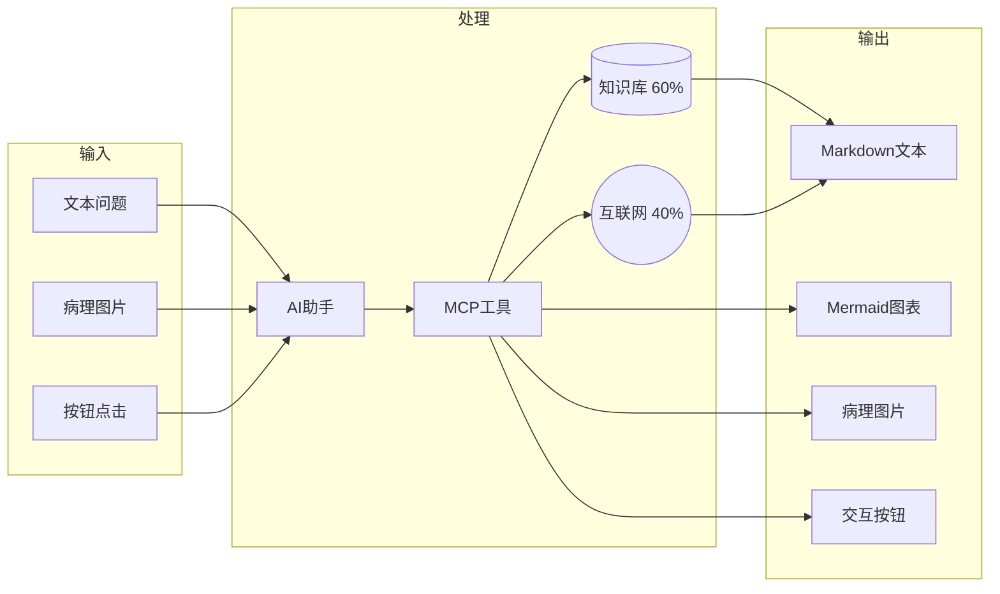

# PathologyAI - 智能病理诊断助手

**ModeEngine AI 创新应用学习赛 提交材料**

> 团队：量子工坊

---

## 📦 提交材料目录

```
docs/
├── README.md                    # 本文档（项目完整介绍）
├── agent-config.md              # 智能体配置说明
├── custom-tools.md              # 15个MCP工具详细说明
├── frontend-improvements.md     # 前端组件改进说明
├── architecture.md              # 架构与调用关系图（Mermaid）
├── diagrams/                    # 架构图（PNG格式）
│   ├── tools_architecture.png   # 工具调用架构图
│   ├── system_architecture.png  # 系统分层架构图
│   ├── cod_process.png          # CoD诊断推理链
│   ├── game_flow.png            # 诊断游戏流程
│   └── dataflow.png             # 数据流向图
└── code-changes/                # 源码文件
    ├── backend/
    │   └── local_mcp_service.py        # 15个MCP工具定义
    ├── frontend/
    │   ├── PathologyImageGallery.tsx   # 新增：病理图片画廊
    │   ├── DiagnosisConfidenceCard.tsx # 新增：置信度卡片
    │   ├── SourceTag.tsx               # 新增：来源标签
    │   ├── MedicalVisualizationPanel.tsx
    │   ├── index.ts
    │   ├── markdownRenderer.tsx        # 修改：按钮解析
    │   ├── chatLeftSidebar.tsx         # 修改：清空对话
    │   └── conversationService.ts      # 修改：批量删除
    ├── medical_extension/
    │   ├── chain_of_diagnosis.py       # CoD实现
    │   ├── confidence_evaluator.py     # 置信度评估
    │   ├── medical_prompts.py
    │   ├── agent_templates.py
    │   ├── api.py
    │   └── test_medical.py
    └── docker/
        └── update_prompt_btn.sql       # Agent提示词SQL
```

---

## 🎯 核心功能

### Chain-of-Diagnosis（CoD）诊断推理框架 ⭐⭐⭐⭐⭐

首创医学诊断专用的结构化推理框架，包含5个标准化步骤：

| 步骤 | 名称 | 说明 |
|------|------|------|
| Step 1 | **症状分析** | 全面提取和分类患者症状 |
| Step 2 | **病史关联** | 关联既往病史和家族史 |
| Step 3 | **鉴别诊断** | 列出所有可能的诊断假设 |
| Step 4 | **检查建议** | 建议进一步检查项目 |
| Step 5 | **初步结论** | 综合分析得出最可能诊断 |

**创新点**：每一步推理过程完全可追溯、可解释，解决了传统AI诊断"黑盒"问题。

### 置信度评估系统

多维度评估诊断可信度：

| 维度 | 说明 |
|------|------|
| 证据充分度 | 支持诊断的证据是否充足 |
| 一致性 | 症状与诊断是否一致 |
| 完整性 | 信息是否完整 |
| 确定性 | 诊断的确定程度 |

**风险等级**：`LOW` / `MEDIUM` / `HIGH` / `CRITICAL`

### 诊断模拟游戏

交互式临床问诊练习，通过 `[btn:选项]` 按钮交互：

```
1.启动 → 2.问诊 → 3.体检 → 4.检查 → 5.诊断
```

用户扮演医生，AI扮演患者，训练临床思维。

---

## 🔧 15个专业MCP工具

形成完整的病理诊断工具链：

### 医疗诊断工具（4个）

| 工具名称 | 功能 |
|----------|------|
| `chain_of_diagnosis` | CoD框架实现，5步结构化诊断 |
| `evaluate_diagnosis_confidence` | 多维度置信度评估 |
| `search_pathology_images` | 病理图片搜索 |
| `generate_medical_guide` | 就医指南生成 |

### 诊断游戏工具（2个）

| 工具名称 | 功能 |
|----------|------|
| `start_diagnosis_game` | 启动诊断模拟游戏 |
| `diagnosis_action` | 执行游戏动作（问诊/体检/检查/诊断） |

### 医学可视化工具（9个）

| 工具名称 | 功能 |
|----------|------|
| `generate_knowledge_graph` | 医学知识图谱 |
| `generate_diagnosis_flow` | 诊断流程图 |
| `generate_medical_chart` | 统计图表（柱状图/折线图/饼图） |
| `generate_radar_chart` | 雷达图（多维度健康指标） |
| `generate_timeline` | 时间线图（病程发展） |
| `generate_gantt_chart` | 甘特图（治疗计划） |
| `generate_quadrant_chart` | 象限图（风险评估） |
| `generate_state_diagram` | 状态转换图（疾病状态） |
| `generate_sankey_diagram` | 桑基图（流量转换） |

---

## 📊 项目数据统计

### 应用代码规模

| 项目 | 数量 |
|------|------|
| MCP工具 | 15个完整实现 |
| 前端组件 | 4个新增 + 4个修改 |
| 后端代码 | ~1,400行 |
| 文档 | 5个Markdown文档 |
| 架构图 | 5张 |

### 系统模型配置

基于 Nexent v1.7.7 平台：

| 模型类型 | 模型名称 |
|----------|----------|
| 大语言模型 | Claude 4.5 Haiku |
| 向量模型 | BGE-M3 Embedding |
| 重排模型 | Jina Reranker |
| 多模态向量模型 | BGE-M3 Multi |
| 视觉语言模型 | GPT-4o Vision |
| 语音合成 | OpenAI-TTS-HD |
| 语音识别 | OpenAI-Whisper |

---

## 💡 技术创新点

### 1. Chain-of-Diagnosis框架 ⭐⭐⭐⭐⭐

**首创医学诊断专用推理框架**

- 结构化5步诊断流程
- 每步可追溯、可解释
- 多维度置信度评估
- 完整的证据链

### 2. MCP工具生态系统 ⭐⭐⭐⭐⭐

**完整的病理诊断工具链**

- 15个工具覆盖诊断全流程
- 遵循MCP标准协议
- 可独立使用，可组合调用
- 易于扩展到其他医学领域

### 3. 交互式诊断游戏 ⭐⭐⭐⭐

**创新的临床思维训练方案**

- `[btn:选项]` 按钮交互机制
- 完整的问诊→体检→检查→诊断流程
- 实时反馈和评分
- 适合医学教育场景

### 4. 双重知识检索 ⭐⭐⭐⭐

**内外部知识融合策略**

- 内部知识库权重60%（专业准确）
- 外部搜索权重40%（时效补充）
- 自动来源标注 `[内部]` `[外部]`
- 可溯源、可验证

### 5. 医学可视化工具集 ⭐⭐⭐⭐

**9种Mermaid图表自动生成**

- 知识图谱、诊断流程图
- 雷达图、时间线、甘特图
- 象限图、状态图、桑基图
- 前端原生渲染，无需额外依赖

---

## 🏗️ 系统架构

### 分层架构图

```
┌─────────────────────────────────────────────────────────────┐
│                    前端层 (Frontend)                         │
│         聊天界面 | 医学可视化组件 | 诊断游戏界面              │
└─────────────────────────────┬───────────────────────────────┘
                              │
                              ▼
┌─────────────────────────────────────────────────────────────┐
│                    Nexent Runtime                            │
│              病理学AI助手 (Agent ID: 13)                     │
└─────────────────────────────┬───────────────────────────────┘
                              │
                              ▼
┌─────────────────────────────────────────────────────────────┐
│                    MCP工具层 (15个自定义工具)                 │
│      诊断推理 | 置信度评估 | 诊断游戏 | 9种可视化图表         │
└─────────────────────────────┬───────────────────────────────┘
                              │
                              ▼
┌─────────────────────────────────────────────────────────────┐
│                       数据层                                 │
│        PostgreSQL | Elasticsearch | 病理图片服务器           │
└─────────────────────────────────────────────────────────────┘
```

### 5.2 工具调用关系图



### 5.3 数据流向



---

## 六、前端改进

### 6.1 新增组件

| 组件 | 文件 | 功能 |
|------|------|------|
| 病理图片画廊 | `PathologyImageGallery.tsx` | 展示和预览病理图片 |
| 置信度卡片 | `DiagnosisConfidenceCard.tsx` | 显示诊断置信度和风险等级 |
| 来源标签 | `SourceTag.tsx` | 标注信息来源 [内部]/[外部] |

### 6.2 修改组件

| 组件 | 修改内容 |
|------|----------|
| `markdownRenderer.tsx` | 新增 `[btn:xxx]` 按钮解析和渲染 |
| `chatLeftSidebar.tsx` | 新增"清空所有对话"功能 |
| `conversationService.ts` | 新增 `deleteAll` 批量删除方法 |
| `MedicalVisualizationPanel.tsx` | 去除硬编码，支持通用病理学 |

---

## 部署说明

### 8.1 环境要求

- Nexent v1.7.7+
- Docker & Docker Compose
- Python 3.10+
- Node.js 18+

### 8.2 部署步骤

1. **部署 Nexent 平台**
   ```bash
   docker-compose up -d
   ```

2. **导入 Agent 配置**
   ```bash
   docker exec -i nexent-postgres psql -U postgres -d nexent < update_prompt_btn.sql
   ```

3. **配置模型**
   - 在 Nexent 管理界面配置各模型 API

4. **启动使用**
   - 访问 http://localhost:3000
   - 选择"病理学AI助手"开始对话

---

## 九、使用示例

### 9.1 医学问答

```
用户: HIV感染的诊断标准是什么？
AI: [调用 knowledge_base_search + tavily_search]
    [融合内部60% + 外部40%结果]
    返回诊断标准说明...
```

### 9.2 诊断推理

```
用户: 患者发热、淋巴结肿大、皮疹，请分析
AI: [调用 chain_of_diagnosis]
    Step1: 症状分析 - 三联征提示...
    Step2: 病史关联 - ...
    Step3: 鉴别诊断 - ...
    Step4: 检查建议 - ...
    Step5: 初步结论 - ...
    [调用 evaluate_diagnosis_confidence]
    置信度: 85% | 风险等级: MEDIUM
```

### 9.3 诊断游戏

```
用户: 开始诊断游戏
AI: [调用 start_diagnosis_game]
    
    🎮 诊断模拟游戏
    难度: 中级 | 病例类型: 感染性疾病
    
    患者信息: 男性，35岁，主诉发热3天...
    
    [btn:询问发热情况] [btn:询问其他症状] [btn:询问既往史]
```

---

## 📝 应用价值

### 医学教育

- 医学生病理学习辅助
- 住院医师规范化培训
- 在线医学教育平台
- 临床思维训练（诊断游戏）

### 临床辅助

- 病理医生诊断辅助决策
- 基层医院诊断能力提升
- 远程病理会诊支持
- 结构化诊断报告生成

### 科研应用

- 病理知识图谱构建
- 医学AI研究数据积累
- 诊断算法优化验证
- 可视化数据展示

### 社会价值

- 缓解病理医生严重短缺（缺口3万+）
- 提升诊断标准化和准确性
- 推动优质医疗资源下沉
- 降低误诊漏诊风险

---

## ⚠️ 安全声明

**重要提示**：
- 本AI助手仅供学习和参考使用
- 不能替代专业医生的诊断和治疗建议
- 如有健康问题，请及时就医
- 所有诊断建议均需专业医师确认

---

## 📄 许可证

Apache License 2.0

---

## 👥 贡献者

**量子工坊团队**

开放原子基金会 ModeEngine AI 创新应用学习赛
