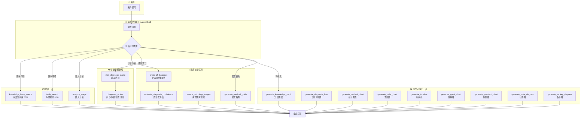
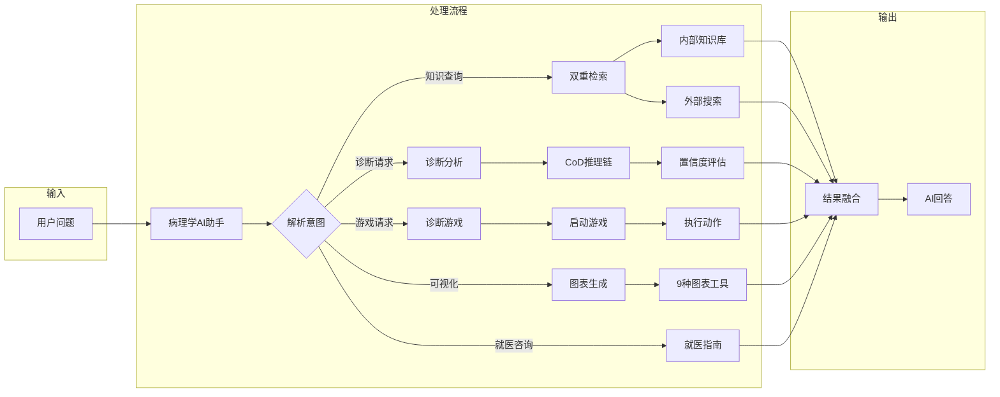
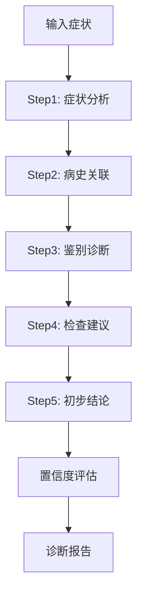
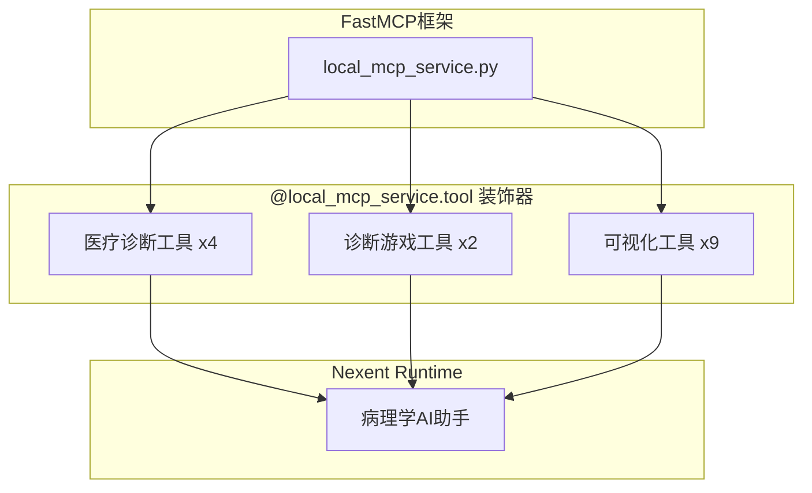
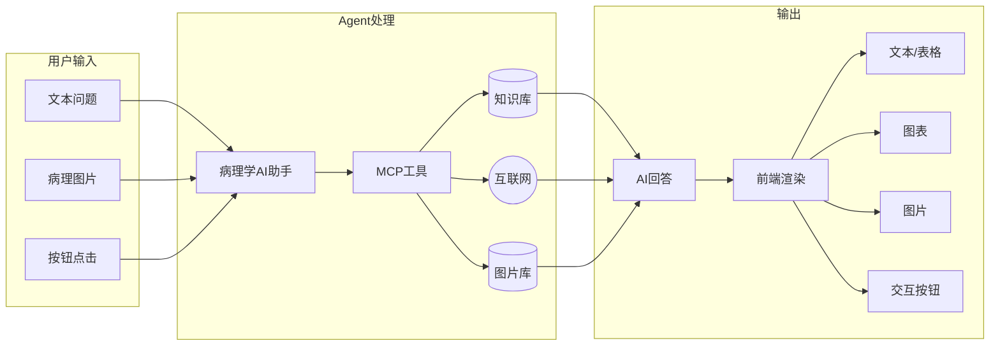

# 🏗️ 架构与调用关系图

## 系统架构概览

```
┌─────────────────────────────────────────────────────────────────┐
│                         用户界面 (Frontend)                       │
│  ┌─────────────┐  ┌─────────────┐  ┌─────────────────────────┐  │
│  │  聊天界面    │  │ 医学可视化  │  │  诊断模拟游戏界面        │  │
│  └─────────────┘  └─────────────┘  └─────────────────────────┘  │
└────────────────────────────┬────────────────────────────────────┘
                             │
                             ▼
┌─────────────────────────────────────────────────────────────────┐
│                      Nexent Runtime                              │
│  ┌─────────────────────────────────────────────────────────────┐│
│  │              病理学AI助手 (Agent ID: 13)                     ││
│  └─────────────────────────────────────────────────────────────┘│
└────────────────────────────┬────────────────────────────────────┘
                             │
                             ▼
┌─────────────────────────────────────────────────────────────────┐
│                        MCP 工具层                                │
│  ┌──────────────────────┐  ┌──────────────────────────────┐     │
│  │      内置工具         │  │        自定义医疗工具         │     │
│  │  • knowledge_search  │  │  • chain_of_diagnosis        │     │
│  │  • tavily_search     │  │  • evaluate_confidence       │     │
│  │  • analyze_image     │  │  • diagnosis_game            │     │
│  └──────────────────────┘  └──────────────────────────────┘     │
└────────────────────────────┬────────────────────────────────────┘
                             │
                             ▼
┌─────────────────────────────────────────────────────────────────┐
│                        数据层                                    │
│  ┌─────────────┐  ┌─────────────┐  ┌─────────────────────────┐  │
│  │ PostgreSQL  │  │Elasticsearch│  │    病理图片服务器        │  │
│  └─────────────┘  └─────────────┘  └─────────────────────────┘  │
└─────────────────────────────────────────────────────────────────┘
```

---

## 工具调用关系图 (Mermaid)



---

## 完整工具调用流程图



---

## 诊断游戏流程图


---

## Chain-of-Diagnosis 流程



---

## 前端组件调用关系

```mermaid
flowchart TD
    subgraph Chat["聊天界面"]
        CI[chatInterface.tsx]
        MD[markdownRenderer.tsx]
    end

    subgraph MedViz["医学可视化组件"]
        MVP[MedicalVisualizationPanel]
        PIG[PathologyImageGallery]
        DCC[DiagnosisConfidenceCard]
        ST[SourceTag]
    end

    subgraph Services["服务层"]
        CS[conversationService.ts]
    end

    CI --> MD
    MD -->|渲染Mermaid| MVP
    MD -->|渲染图片| PIG
    MD -->|渲染置信度| DCC
    MD -->|渲染来源| ST
    MD -->|[btn:xx]按钮| BTN[ClickableOption]
    
    CI --> CS
    CS -->|deleteAll| API[后端API]
```

---

## MCP工具注册关系



---

## 数据流向图



---

## 文件修改清单

### 后端修改

| 文件 | 类型 | 说明 |
|------|------|------|
| `backend/tool_collection/mcp/local_mcp_service.py` | 新增 | 15个医疗MCP工具 |

### 前端修改

| 文件 | 类型 | 说明 |
|------|------|------|
| `frontend/components/medical-visualization/PathologyImageGallery.tsx` | 新增 | 病理图片画廊 |
| `frontend/components/medical-visualization/DiagnosisConfidenceCard.tsx` | 新增 | 置信度卡片 |
| `frontend/components/medical-visualization/SourceTag.tsx` | 新增 | 来源标签 |
| `frontend/components/medical-visualization/MedicalVisualizationPanel.tsx` | 修改 | 去除硬编码 |
| `frontend/components/ui/markdownRenderer.tsx` | 修改 | [btn:xx]按钮解析 |
| `frontend/app/[locale]/chat/components/chatLeftSidebar.tsx` | 修改 | 清空对话按钮 |
| `frontend/services/conversationService.ts` | 修改 | deleteAll方法 |

### 配置文件

| 文件 | 说明 |
|------|------|
| `docker/update_prompt_btn.sql` | Agent提示词配置 |
